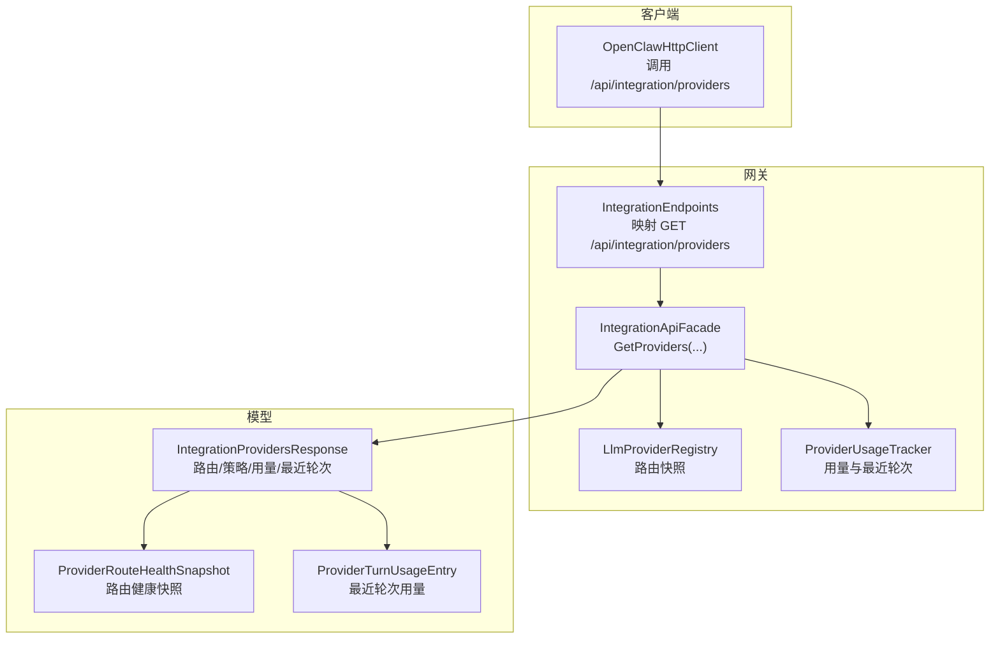
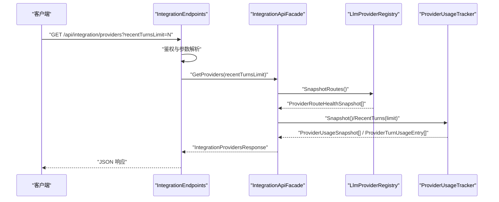
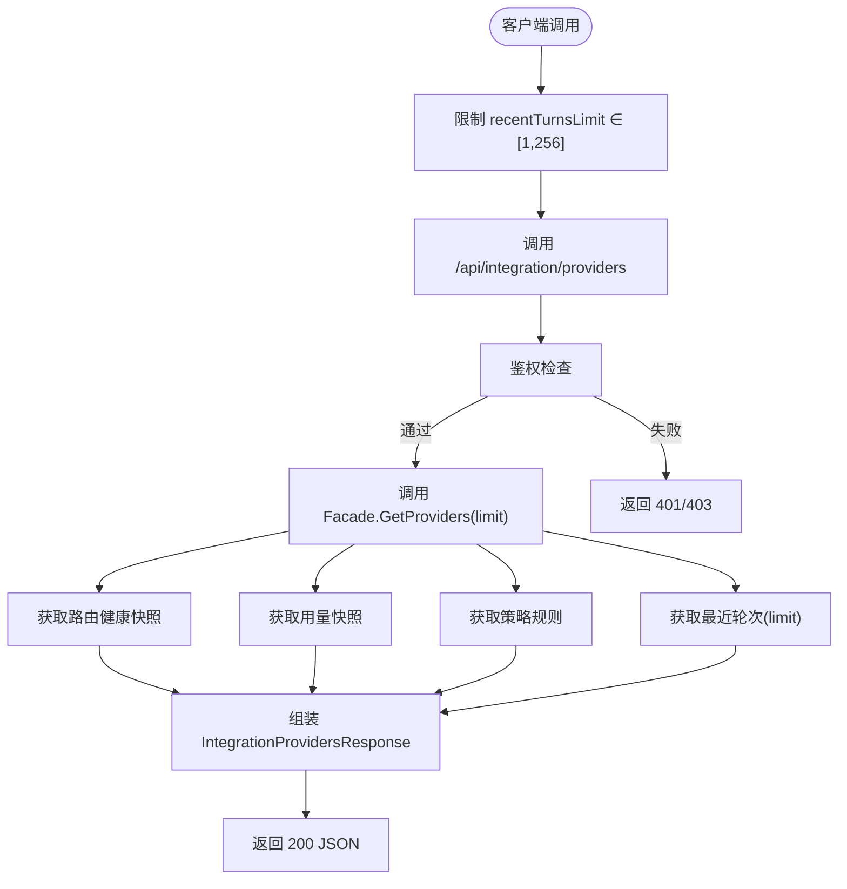
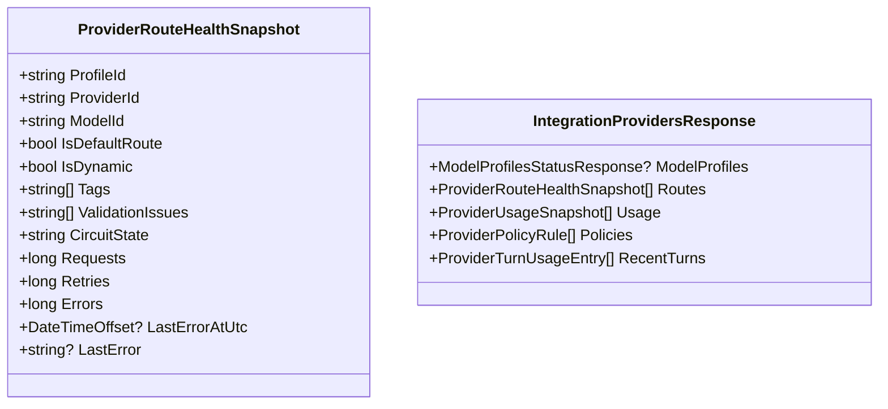
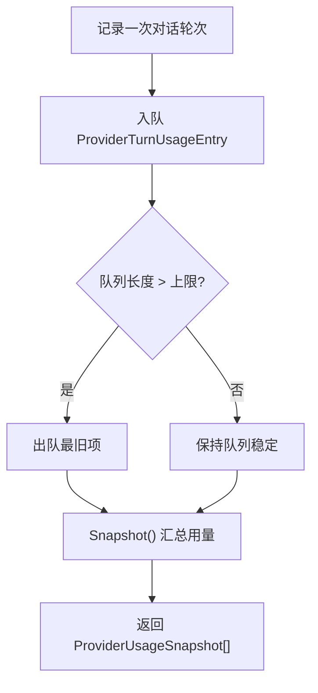
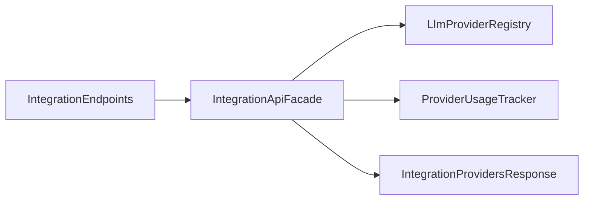

# 提供商管理

<cite>
**本文引用的文件**
- [IntegrationEndpoints.cs](file://src/OpenClaw.Gateway/Endpoints/IntegrationEndpoints.cs)
- [IntegrationApiFacade.cs](file://src/OpenClaw.Gateway/Composition/IntegrationApiFacade.cs)
- [OpenClawHttpClient.cs](file://src/OpenClaw.Client/OpenClawHttpClient.cs)
- [IntegrationApiModels.cs](file://src/OpenClaw.Core/Models/IntegrationApiModels.cs)
- [OperatorApiModels.cs](file://src/OpenClaw.Core/Models/OperatorApiModels.cs)
- [ProviderUsageTracker.cs](file://src/OpenClaw.Core/Observability/ProviderUsageTracker.cs)
- [LlmProviderRegistry.cs](file://src/OpenClaw.Gateway/LlmProviderRegistry.cs)
- [MainWindowViewModel.Providers.cs](file://src/OpenClaw.Companion/ViewModels/MainWindowViewModel.Providers.cs)
- [README.md](file://README.md)
</cite>

## 目录
1. [简介](#简介)
2. [项目结构](#项目结构)
3. [核心组件](#核心组件)
4. [架构总览](#架构总览)
5. [详细组件分析](#详细组件分析)
6. [依赖关系分析](#依赖关系分析)
7. [性能考量](#性能考量)
8. [故障排查指南](#故障排查指南)
9. [结论](#结论)
10. [附录：使用示例与最佳实践](#附录使用示例与最佳实践)

## 简介
本文件围绕“提供商管理”能力，系统化阐述 GetIntegrationProvidersAsync 方法的实现与使用方式，涵盖提供商列表查询、状态管理、配置更新、性能监控等关键功能。文档同时说明提供商分类、认证机制、连接状态、故障转移等主题，并提供可直接落地的使用示例与最佳实践。

## 项目结构
提供商管理 API 位于网关层（Gateway），通过端点暴露、由门面（Facade）聚合运行时数据并返回统一响应模型；客户端通过 HTTP 客户端发起请求；观测性模块负责用量统计与最近轮次记录；UI 层在配套应用中展示提供商路由健康快照与使用情况。

**图表来源**
- [IntegrationEndpoints.cs:82-93](file://src/OpenClaw.Gateway/Endpoints/IntegrationEndpoints.cs#L82-L93)
- [IntegrationApiFacade.cs:197-209](file://src/OpenClaw.Gateway/Composition/IntegrationApiFacade.cs#L197-L209)
- [LlmProviderRegistry.cs:83-89](file://src/OpenClaw.Gateway/LlmProviderRegistry.cs#L83-L89)
- [ProviderUsageTracker.cs:40-100](file://src/OpenClaw.Core/Observability/ProviderUsageTracker.cs#L40-L100)
- [IntegrationApiModels.cs:99-106](file://src/OpenClaw.Core/Models/IntegrationApiModels.cs#L99-L106)
- [OperatorApiModels.cs:46-76](file://src/OpenClaw.Core/Models/OperatorApiModels.cs#L46-L76)

**章节来源**
- [IntegrationEndpoints.cs:82-93](file://src/OpenClaw.Gateway/Endpoints/IntegrationEndpoints.cs#L82-L93)
- [IntegrationApiFacade.cs:197-209](file://src/OpenClaw.Gateway/Composition/IntegrationApiFacade.cs#L197-L209)
- [OpenClawHttpClient.cs:390-391](file://src/OpenClaw.Client/OpenClawHttpClient.cs#L390-L391)
- [IntegrationApiModels.cs:99-106](file://src/OpenClaw.Core/Models/IntegrationApiModels.cs#L99-L106)
- [OperatorApiModels.cs:46-76](file://src/OpenClaw.Core/Models/OperatorApiModels.cs#L46-L76)

## 核心组件
- 网关端点：负责鉴权与参数解析，调用门面方法返回 JSON 响应。
- 门面服务：聚合运行时状态、路由快照、用量统计、策略规则与最近轮次，组装统一响应。
- 观测性模块：维护提供商用量快照与最近轮次队列，支持限制数量与会话过滤。
- 模型定义：标准化响应结构，包含路由健康、用量统计、策略规则与最近轮次明细。
- 客户端封装：提供 GetIntegrationProvidersAsync 方法，内置参数校验与限流。

**章节来源**
- [IntegrationEndpoints.cs:82-93](file://src/OpenClaw.Gateway/Endpoints/IntegrationEndpoints.cs#L82-L93)
- [IntegrationApiFacade.cs:197-209](file://src/OpenClaw.Gateway/Composition/IntegrationApiFacade.cs#L197-L209)
- [ProviderUsageTracker.cs:40-100](file://src/OpenClaw.Core/Observability/ProviderUsageTracker.cs#L40-L100)
- [IntegrationApiModels.cs:99-106](file://src/OpenClaw.Core/Models/IntegrationApiModels.cs#L99-L106)
- [OpenClawHttpClient.cs:390-391](file://src/OpenClaw.Client/OpenClawHttpClient.cs#L390-L391)

## 架构总览
下图展示了从客户端到网关端点、门面服务、运行时数据源以及响应模型的整体交互流程。

**图表来源**
- [IntegrationEndpoints.cs:82-93](file://src/OpenClaw.Gateway/Endpoints/IntegrationEndpoints.cs#L82-L93)
- [IntegrationApiFacade.cs:197-209](file://src/OpenClaw.Gateway/Composition/IntegrationApiFacade.cs#L197-L209)
- [LlmProviderRegistry.cs:83-89](file://src/OpenClaw.Gateway/LlmProviderRegistry.cs#L83-L89)
- [ProviderUsageTracker.cs:40-100](file://src/OpenClaw.Core/Observability/ProviderUsageTracker.cs#L40-L100)
- [IntegrationApiModels.cs:99-106](file://src/OpenClaw.Core/Models/IntegrationApiModels.cs#L99-L106)

## 详细组件分析

### 组件一：GetIntegrationProvidersAsync 实现与调用链
- 客户端侧：OpenClawHttpClient 提供 GetIntegrationProvidersAsync，内部将 recentTurnsLimit 限制在 [1, 256] 区间并拼接查询参数。
- 网关端点：IntegrationEndpoints 映射 /api/integration/providers，解析 recentTurnsLimit 查询参数，执行鉴权后调用门面。
- 门面服务：IntegrationApiFacade.GetProviders 聚合以下数据：
  - 模型配置概要：默认配置与可用配置列表。
  - 路由健康快照：来自 LlmProviderRegistry 的 SnapshotRoutes。
  - 用量统计：来自 ProviderUsageTracker 的 Snapshot。
  - 策略规则：来自运行时策略存储。
  - 最近轮次：来自 ProviderUsageTracker.RecentTurns，受 limit 控制。
- 响应模型：IntegrationProvidersResponse 包含上述字段，便于前端渲染与运营监控。

**图表来源**
- [OpenClawHttpClient.cs:390-391](file://src/OpenClaw.Client/OpenClawHttpClient.cs#L390-L391)
- [IntegrationEndpoints.cs:82-93](file://src/OpenClaw.Gateway/Endpoints/IntegrationEndpoints.cs#L82-L93)
- [IntegrationApiFacade.cs:197-209](file://src/OpenClaw.Gateway/Composition/IntegrationApiFacade.cs#L197-L209)
- [LlmProviderRegistry.cs:83-89](file://src/OpenClaw.Gateway/LlmProviderRegistry.cs#L83-L89)
- [ProviderUsageTracker.cs:40-100](file://src/OpenClaw.Core/Observability/ProviderUsageTracker.cs#L40-L100)
- [IntegrationApiModels.cs:99-106](file://src/OpenClaw.Core/Models/IntegrationApiModels.cs#L99-L106)

**章节来源**
- [OpenClawHttpClient.cs:390-391](file://src/OpenClaw.Client/OpenClawHttpClient.cs#L390-L391)
- [IntegrationEndpoints.cs:82-93](file://src/OpenClaw.Gateway/Endpoints/IntegrationEndpoints.cs#L82-L93)
- [IntegrationApiFacade.cs:197-209](file://src/OpenClaw.Gateway/Composition/IntegrationApiFacade.cs#L197-L209)
- [IntegrationApiModels.cs:99-106](file://src/OpenClaw.Core/Models/IntegrationApiModels.cs#L99-L106)

### 组件二：提供商分类与认证机制
- 分类维度：路由快照包含 ProviderId、ModelId、ProfileId、标签与验证问题等，用于区分不同提供商与模型组合。
- 认证与连接状态：路由健康快照中的 CircuitState、Errors、LastError 等字段反映连接稳定性；结合通道就绪评估与兼容性目录，可用于判断认证有效性与连接状态。
- 故障转移：当某路由 CircuitState 非 Closed 或错误数上升时，建议优先切换至其他健康路由或降级策略。

**图表来源**
- [OperatorApiModels.cs:46-76](file://src/OpenClaw.Core/Models/OperatorApiModels.cs#L46-L76)
- [IntegrationApiModels.cs:99-106](file://src/OpenClaw.Core/Models/IntegrationApiModels.cs#L99-L106)

**章节来源**
- [OperatorApiModels.cs:46-76](file://src/OpenClaw.Core/Models/OperatorApiModels.cs#L46-L76)
- [IntegrationApiModels.cs:99-106](file://src/OpenClaw.Core/Models/IntegrationApiModels.cs#L99-L106)

### 组件三：配置更新与兼容性导出
- 兼容性目录：通过 /api/integration/compatibility/catalog 与 /api/integration/compatibility/export 获取当前运行态的兼容性视图，辅助判断提供商配置是否满足运行模式与安全策略。
- 配置更新：可通过配套的账户与后端探测接口进行提供商凭据与后端连通性验证，确保配置变更生效。

**章节来源**
- [IntegrationEndpoints.cs:106-121](file://src/OpenClaw.Gateway/Endpoints/IntegrationEndpoints.cs#L106-L121)
- [IntegrationApiFacade.cs:217-236](file://src/OpenClaw.Gateway/Composition/IntegrationApiFacade.cs#L217-L236)

### 组件四：性能监控与最近轮次
- 用量快照：ProviderUsageTracker.Snapshot 提供按提供商/模型维度的用量统计，便于成本与容量规划。
- 最近轮次：ProviderUsageTracker.RecentTurns 支持按会话过滤与上限限制，便于定位异常会话与热点路径。

**图表来源**
- [ProviderUsageTracker.cs:40-100](file://src/OpenClaw.Core/Observability/ProviderUsageTracker.cs#L40-L100)

**章节来源**
- [ProviderUsageTracker.cs:40-100](file://src/OpenClaw.Core/Observability/ProviderUsageTracker.cs#L40-L100)

### 组件五：UI 展示与运营面板
- UI 层通过 ProviderRouteRow 将 ProviderRouteHealthSnapshot 映射为表格行，展示提供商、模型、配置文件、熔断状态、用量与问题摘要。
- 运营面板集成提供商路由健康、用量、最近轮次与插件健康度，形成统一可观测视图。

**章节来源**
- [MainWindowViewModel.Providers.cs:68-102](file://src/OpenClaw.Companion/ViewModels/MainWindowViewModel.Providers.cs#L68-L102)

## 依赖关系分析
- 端点依赖门面：IntegrationEndpoints 仅负责路由与鉴权，具体业务逻辑委托给 IntegrationApiFacade。
- 门面依赖运行时数据源：路由快照来自 LlmProviderRegistry，用量与最近轮次来自 ProviderUsageTracker。
- 响应模型独立于实现：IntegrationProvidersResponse 作为契约，解耦前后端。

**图表来源**
- [IntegrationEndpoints.cs:82-93](file://src/OpenClaw.Gateway/Endpoints/IntegrationEndpoints.cs#L82-L93)
- [IntegrationApiFacade.cs:197-209](file://src/OpenClaw.Gateway/Composition/IntegrationApiFacade.cs#L197-L209)
- [LlmProviderRegistry.cs:83-89](file://src/OpenClaw.Gateway/LlmProviderRegistry.cs#L83-L89)
- [ProviderUsageTracker.cs:40-100](file://src/OpenClaw.Core/Observability/ProviderUsageTracker.cs#L40-L100)
- [IntegrationApiModels.cs:99-106](file://src/OpenClaw.Core/Models/IntegrationApiModels.cs#L99-L106)

**章节来源**
- [IntegrationEndpoints.cs:82-93](file://src/OpenClaw.Gateway/Endpoints/IntegrationEndpoints.cs#L82-L93)
- [IntegrationApiFacade.cs:197-209](file://src/OpenClaw.Gateway/Composition/IntegrationApiFacade.cs#L197-L209)

## 性能考量
- 参数限制：客户端对 recentTurnsLimit 进行范围钳制，避免过大数据量导致响应膨胀与内存压力。
- 队列截断：最近轮次采用固定上限队列，超出部分自动丢弃，保证内存占用可控。
- 聚合成本：门面一次性聚合多源数据，建议在高频调用场景下引入缓存或增量刷新策略。
- 并发安全：路由快照与用量快照均为只读快照，避免并发写带来的竞争开销。

[本节为通用性能指导，不直接分析具体文件]

## 故障排查指南
- 鉴权失败：确认请求头携带有效令牌且具备 integration.read 权限。
- 参数非法：recentTurnsLimit 必须在 [1, 256] 范围内；否则返回 400。
- 路由异常：查看 ProviderRouteHealthSnapshot 中 CircuitState、Errors、LastError 字段，定位连接或认证问题。
- 用量异常：通过 ProviderUsageSnapshot 与 ProviderTurnUsageEntry 排查是否存在单会话高用量或持续错误。

**章节来源**
- [IntegrationEndpoints.cs:82-93](file://src/OpenClaw.Gateway/Endpoints/IntegrationEndpoints.cs#L82-L93)
- [OperatorApiModels.cs:46-76](file://src/OpenClaw.Core/Models/OperatorApiModels.cs#L46-L76)
- [ProviderUsageTracker.cs:40-100](file://src/OpenClaw.Core/Observability/ProviderUsageTracker.cs#L40-L100)

## 结论
GetIntegrationProvidersAsync 通过清晰的分层设计与标准化响应模型，实现了对提供商路由健康、用量统计、策略规则与最近轮次的统一查询。结合 UI 展示与兼容性导出，可支撑从日常运维到策略治理的全链路管理需求。建议在生产环境中配合鉴权、限流与缓存策略，确保查询性能与稳定性。

[本节为总结性内容，不直接分析具体文件]

## 附录：使用示例与最佳实践

### 使用示例一：查询提供商列表与最近轮次
- 客户端调用：通过 OpenClawHttpClient.GetIntegrationProvidersAsync(50, CancellationToken.None) 获取最近 50 条轮次。
- 响应解析：IntegrationProvidersResponse.Routes、Usage、Policies、RecentTurns 四个维度综合评估提供商健康度。

**章节来源**
- [OpenClawHttpClient.cs:390-391](file://src/OpenClaw.Client/OpenClawHttpClient.cs#L390-L391)
- [IntegrationApiModels.cs:99-106](file://src/OpenClaw.Core/Models/IntegrationApiModels.cs#L99-L106)

### 使用示例二：集成新提供商
- 步骤：
  1) 在兼容性目录中确认新提供商与模型的兼容性。
  2) 通过账户与后端探测接口完成凭据配置与连通性验证。
  3) 通过 GetIntegrationProvidersAsync 验证路由已生效并处于健康状态。
- 参考端点：
  - /api/integration/compatibility/catalog
  - /api/integration/accounts
  - /api/integration/backends

**章节来源**
- [IntegrationEndpoints.cs:106-121](file://src/OpenClaw.Gateway/Endpoints/IntegrationEndpoints.cs#L106-L121)
- [IntegrationApiFacade.cs:217-236](file://src/OpenClaw.Gateway/Composition/IntegrationApiFacade.cs#L217-L236)

### 使用示例三：监控提供商性能
- 指标关注：
  - 路由健康：CircuitState、Errors、LastError、ValidationIssues。
  - 用量趋势：ProviderUsageSnapshot 的请求量与错误量变化。
  - 最近轮次：按会话过滤，识别异常用户或工具。
- UI 展示：利用 ProviderRouteRow 将健康快照映射为表格行，便于运营人员快速定位问题。

**章节来源**
- [OperatorApiModels.cs:46-76](file://src/OpenClaw.Core/Models/OperatorApiModels.cs#L46-L76)
- [ProviderUsageTracker.cs:40-100](file://src/OpenClaw.Core/Observability/ProviderUsageTracker.cs#L40-L100)
- [MainWindowViewModel.Providers.cs:68-102](file://src/OpenClaw.Companion/ViewModels/MainWindowViewModel.Providers.cs#L68-L102)