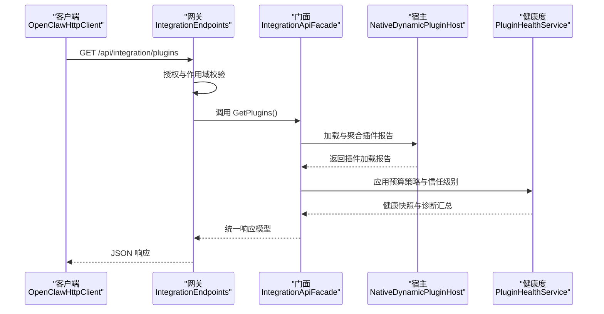
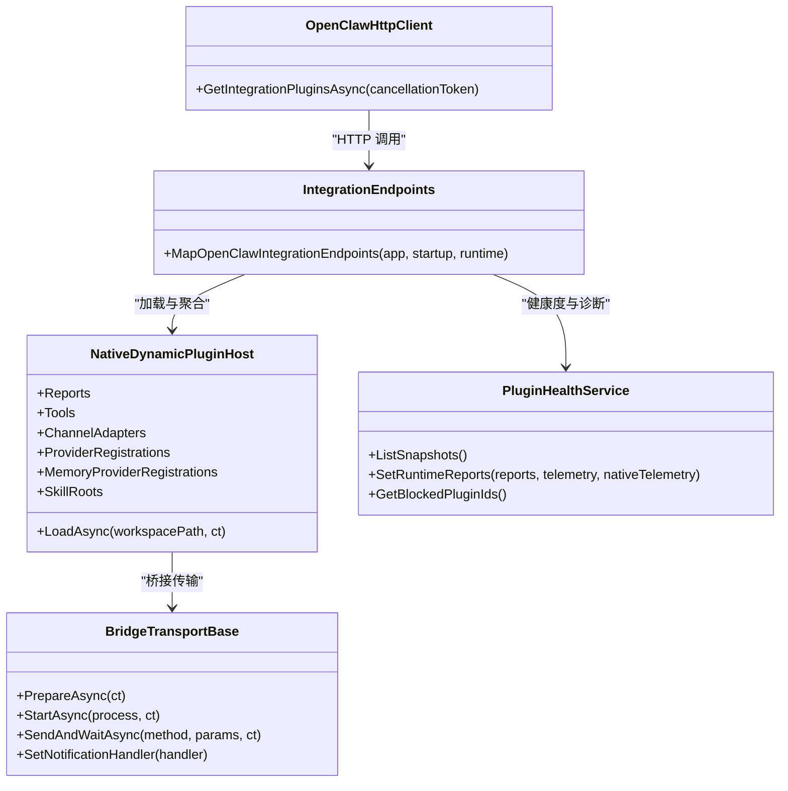
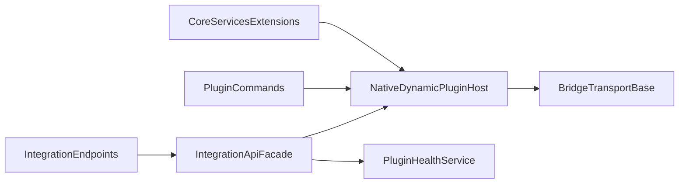

# 插件管理

<cite>
**本文引用的文件**
- [IntegrationEndpoints.cs](file://src/OpenClaw.Gateway/Endpoints/IntegrationEndpoints.cs)
- [OpenClawHttpClient.cs](file://src/OpenClaw.Client/OpenClawHttpClient.cs)
- [PluginHealthService.cs](file://src/OpenClaw.Gateway/PluginHealthService.cs)
- [NativeDynamicPluginHost.cs](file://src/OpenClaw.Agent/Plugins/NativeDynamicPluginHost.cs)
- [CoreServicesExtensions.cs](file://src/OpenClaw.Gateway/Composition/CoreServicesExtensions.cs)
- [PluginCommands.cs](file://src/OpenClaw.Cli/PluginCommands.cs)
- [openclaw.native-plugin.json](file://src/OpenClaw.Plugins.EmploymentCoachWorkflow/openclaw.native-plugin.json)
- [BridgeTransportBase.cs](file://src/OpenClaw.Agent/Plugins/BridgeTransportBase.cs)
</cite>

## 目录
1. [简介](#简介)
2. [项目结构](#项目结构)
3. [核心组件](#核心组件)
4. [架构总览](#架构总览)
5. [详细组件分析](#详细组件分析)
6. [依赖关系分析](#依赖关系分析)
7. [性能考量](#性能考量)
8. [故障排查指南](#故障排查指南)
9. [结论](#结论)
10. [附录](#附录)

## 简介
本文件围绕插件管理 API 进行系统化技术文档编制，重点聚焦于 GetIntegrationPluginsAsync 方法的实现与使用，涵盖插件列表查询、版本管理、安装卸载、配置管理、插件分类、依赖关系、兼容性检查、安全策略与运行时健康度管理等主题。文档同时提供端到端的调用流程图、类关系图与数据流图，帮助开发者快速理解与落地插件生命周期管理。

## 项目结构
插件管理能力由网关层、客户端层、代理层（桥接与原生动态）以及 CLI 工具链协同完成：
- 网关层提供集成 API，暴露插件列表、兼容性目录、状态等接口；
- 客户端封装 HTTP 调用，统一构建请求与响应模型；
- 代理层负责桥接型 JS 插件与原生动态插件的发现、加载、注册与健康度治理；
- CLI 提供插件安装、卸载、搜索与兼容性检查工具；
- 配置与服务组合在启动阶段完成内存存储、运行时模式与预算策略的装配。

```mermaid
graph TB
subgraph "客户端"
C1["OpenClawHttpClient<br/>集成API客户端"]
end
subgraph "网关"
G1["IntegrationEndpoints<br/>路由与授权"]
G2["IntegrationApiFacade<br/>业务门面"]
end
subgraph "代理层"
P1["NativeDynamicPluginHost<br/>原生动态插件宿主"]
P2["BridgeTransportBase<br/>桥接传输基类"]
end
subgraph "CLI"
CLI["PluginCommands<br/>安装/卸载/检查"]
end
subgraph "配置与服务"
S1["CoreServicesExtensions<br/>服务注册与装配"]
S2["PluginHealthService<br/>健康度与预算策略"]
end
C1 --> G1
G1 --> G2
G2 --> P1
G2 --> P2
CLI --> P1
S1 --> P1
S2 --> P1
```

图表来源
- [IntegrationEndpoints.cs:95-104](file://src/OpenClaw.Gateway/Endpoints/IntegrationEndpoints.cs#L95-L104)
- [OpenClawHttpClient.cs:393-394](file://src/OpenClaw.Client/OpenClawHttpClient.cs#L393-L394)
- [NativeDynamicPluginHost.cs:64-169](file://src/OpenClaw.Agent/Plugins/NativeDynamicPluginHost.cs#L64-L169)
- [CoreServicesExtensions.cs:38-100](file://src/OpenClaw.Gateway/Composition/CoreServicesExtensions.cs#L38-L100)
- [PluginHealthService.cs:1-449](file://src/OpenClaw.Gateway/PluginHealthService.cs#L1-L449)
- [PluginCommands.cs:1-200](file://src/OpenClaw.Cli/PluginCommands.cs#L1-L200)

章节来源
- [IntegrationEndpoints.cs:95-104](file://src/OpenClaw.Gateway/Endpoints/IntegrationEndpoints.cs#L95-L104)
- [OpenClawHttpClient.cs:393-394](file://src/OpenClaw.Client/OpenClawHttpClient.cs#L393-L394)
- [NativeDynamicPluginHost.cs:64-169](file://src/OpenClaw.Agent/Plugins/NativeDynamicPluginHost.cs#L64-L169)
- [CoreServicesExtensions.cs:38-100](file://src/OpenClaw.Gateway/Composition/CoreServicesExtensions.cs#L38-L100)
- [PluginHealthService.cs:1-449](file://src/OpenClaw.Gateway/PluginHealthService.cs#L1-L449)
- [PluginCommands.cs:1-200](file://src/OpenClaw.Cli/PluginCommands.cs#L1-L200)

## 核心组件
- GetIntegrationPluginsAsync：客户端方法，用于向网关发起插件列表查询请求，返回标准化的插件集合响应。
- IntegrationEndpoints：网关路由层，映射 /api/integration/plugins，执行鉴权与授权后调用门面返回结果。
- IntegrationApiFacade：业务门面，聚合插件发现、兼容性检查与运行时状态，生成统一响应。
- NativeDynamicPluginHost：原生动态插件宿主，负责扫描、校验、加载与注册插件能力（工具、通道、命令、提供方、内存提供方、技能根目录），并产出加载报告。
- PluginHealthService：插件健康度与预算策略管理，记录禁用/隔离状态、重启次数、内存快照、诊断汇总与自动隔离策略。
- PluginCommands：CLI 插件管理命令，支持从 npm 或本地路径安装、卸载、列出、搜索插件，并进行兼容性检查与信任级别评估。
- BridgeTransportBase：桥接传输抽象，定义请求/响应、通知处理与读写循环，支撑桥接型插件进程通信。

章节来源
- [OpenClawHttpClient.cs:393-394](file://src/OpenClaw.Client/OpenClawHttpClient.cs#L393-L394)
- [IntegrationEndpoints.cs:95-104](file://src/OpenClaw.Gateway/Endpoints/IntegrationEndpoints.cs#L95-L104)
- [NativeDynamicPluginHost.cs:64-169](file://src/OpenClaw.Agent/Plugins/NativeDynamicPluginHost.cs#L64-L169)
- [PluginHealthService.cs:44-158](file://src/OpenClaw.Gateway/PluginHealthService.cs#L44-L158)
- [PluginCommands.cs:39-159](file://src/OpenClaw.Cli/PluginCommands.cs#L39-L159)
- [BridgeTransportBase.cs:10-149](file://src/OpenClaw.Agent/Plugins/BridgeTransportBase.cs#L10-L149)

## 架构总览
下图展示了 GetIntegrationPluginsAsync 的端到端调用链路，从客户端到网关、再到代理层与健康度服务的数据流。



图表来源
- [OpenClawHttpClient.cs:393-394](file://src/OpenClaw.Client/OpenClawHttpClient.cs#L393-L394)
- [IntegrationEndpoints.cs:95-104](file://src/OpenClaw.Gateway/Endpoints/IntegrationEndpoints.cs#L95-L104)
- [NativeDynamicPluginHost.cs:64-169](file://src/OpenClaw.Agent/Plugins/NativeDynamicPluginHost.cs#L64-L169)
- [PluginHealthService.cs:44-158](file://src/OpenClaw.Gateway/PluginHealthService.cs#L44-L158)

## 详细组件分析

### GetIntegrationPluginsAsync 实现与使用
- 客户端封装：OpenClawHttpClient 将 /api/integration/plugins 映射为 GetIntegrationPluginsAsync，内部通过通用的 GetAsync 方法序列化/反序列化响应模型。
- 网关路由：IntegrationEndpoints 在 /api/integration/plugins 上注册 GET 处理器，执行授权校验后调用门面的 GetPlugins 并返回 JSON。
- 门面职责：聚合原生动态与桥接插件的加载报告，结合健康度服务输出信任级别、兼容性状态与诊断摘要。
- 典型使用场景：
  - 查询当前已加载插件清单与能力声明；
  - 结合兼容性目录筛选特定类别或状态的插件；
  - 通过健康度快照识别高风险插件并采取隔离或降级策略。

章节来源
- [OpenClawHttpClient.cs:393-394](file://src/OpenClaw.Client/OpenClawHttpClient.cs#L393-L394)
- [IntegrationEndpoints.cs:95-104](file://src/OpenClaw.Gateway/Endpoints/IntegrationEndpoints.cs#L95-L104)

### 插件分类与依赖关系
- 分类维度：
  - 原生动态插件：通过 openclaw.native-plugin.json 声明入口与能力，宿主按清单扫描、校验并加载。
  - 桥接插件：通过 Node.js 进程与传输层（stdio/socket/hybrid）交互，支持热重启与运行时指标采集。
- 依赖关系：
  - 原生动态插件依赖运行时模式（JIT/AOT），AOT 模式下禁止动态加载；
  - 桥接插件依赖 Node.js 可用性与传输通道准备；
  - 插件能力（工具、通道、命令、提供方、内存提供方、技能目录）在加载时被注册到全局服务。

章节来源
- [NativeDynamicPluginHost.cs:87-130](file://src/OpenClaw.Agent/Plugins/NativeDynamicPluginHost.cs#L87-L130)
- [openclaw.native-plugin.json:1-11](file://src/OpenClaw.Plugins.EmploymentCoachWorkflow/openclaw.native-plugin.json#L1-L11)
- [BridgeTransportBase.cs:10-149](file://src/OpenClaw.Agent/Plugins/BridgeTransportBase.cs#L10-L149)

### 兼容性检查与安全策略
- 兼容性检查：
  - 最低宿主版本与插件 API 版本匹配校验；
  - 清单解析失败、重复 ID、程序集路径越界、缺失程序集等错误诊断；
  - 技能目录越界、配置模式不支持等警告与错误。
- 安全策略：
  - 运行时模式限制：AOT 模式下拒绝动态加载；
  - 插件清单与入口文件校验；
  - 信任级别评估：基于来源（官方包源）、结构化表面声明与错误计数综合判定。
- 自动策略：
  - 健康度服务根据重启次数、工作集上限与兼容性错误阈值自动隔离插件。

章节来源
- [NativeDynamicPluginHost.cs:700-782](file://src/OpenClaw.Agent/Plugins/NativeDynamicPluginHost.cs#L700-L782)
- [PluginHealthService.cs:239-291](file://src/OpenClaw.Gateway/PluginHealthService.cs#L239-L291)
- [PluginCommands.cs:681-705](file://src/OpenClaw.Cli/PluginCommands.cs#L681-L705)

### 版本管理与安装卸载
- 版本管理：
  - 原生动态插件清单包含 id、version、assemblyPath、typeName、capabilities、skills、jitOnly 等字段；
  - CLI 支持从 npm 或本地路径安装，安装前进行兼容性检查与信任级别评估。
- 安装流程：
  - npm 包下载（tarball）→ 解压 → 检查清单与入口 → 可安装则复制到扩展目录 → 启动网关生效；
  - 本地路径支持直接复制与依赖安装（package.json 存在时）。
- 卸载与搜索：
  - 卸载即删除扩展目录对应插件目录；
  - 搜索通过 npm registry 或本地目录枚举实现。

章节来源
- [openclaw.native-plugin.json:1-11](file://src/OpenClaw.Plugins.EmploymentCoachWorkflow/openclaw.native-plugin.json#L1-L11)
- [PluginCommands.cs:39-159](file://src/OpenClaw.Cli/PluginCommands.cs#L39-L159)
- [PluginCommands.cs:161-200](file://src/OpenClaw.Cli/PluginCommands.cs#L161-L200)

### 配置管理与生命周期
- 配置管理：
  - 原生动态插件通过 PluginsConfig.Entries 注入插件级配置（JsonElement），宿主在注册上下文中提供；
  - CLI 支持对插件配置模式进行验证（如 configSchema）。
- 生命周期：
  - 发现：扫描扩展目录与工作区，解析清单与入口；
  - 校验：版本匹配、路径合法性、能力声明；
  - 加载：实例化插件类型并注册工具、通道、命令、提供方、内存提供方与技能根目录；
  - 运行：桥接传输层维持进程通信，支持重启与指标上报；
  - 健康治理：健康度服务记录重启次数、内存快照与诊断，应用预算策略自动隔离。

章节来源
- [NativeDynamicPluginHost.cs:380-396](file://src/OpenClaw.Agent/Plugins/NativeDynamicPluginHost.cs#L380-L396)
- [PluginHealthService.cs:44-158](file://src/OpenClaw.Gateway/PluginHealthService.cs#L44-L158)
- [BridgeTransportBase.cs:40-75](file://src/OpenClaw.Agent/Plugins/BridgeTransportBase.cs#L40-L75)

### 类关系与数据结构


图表来源
- [OpenClawHttpClient.cs:393-394](file://src/OpenClaw.Client/OpenClawHttpClient.cs#L393-L394)
- [IntegrationEndpoints.cs:95-104](file://src/OpenClaw.Gateway/Endpoints/IntegrationEndpoints.cs#L95-L104)
- [NativeDynamicPluginHost.cs:64-169](file://src/OpenClaw.Agent/Plugins/NativeDynamicPluginHost.cs#L64-L169)
- [PluginHealthService.cs:44-158](file://src/OpenClaw.Gateway/PluginHealthService.cs#L44-L158)
- [BridgeTransportBase.cs:10-149](file://src/OpenClaw.Agent/Plugins/BridgeTransportBase.cs#L10-L149)

## 依赖关系分析
- 组件耦合：
  - IntegrationEndpoints 对 IntegrationApiFacade 存在直接依赖，后者再依赖宿主与健康度服务；
  - NativeDynamicPluginHost 与 BridgeTransportBase 通过注册上下文解耦具体能力；
  - PluginHealthService 以只读方式消费加载报告，避免反向依赖。
- 外部依赖：
  - 原生动态插件依赖 JIT 运行时模式；
  - 桥接插件依赖 Node.js 与传输通道（stdio/socket/hybrid）；
  - CLI 依赖 npm 与文件系统操作。



图表来源
- [IntegrationEndpoints.cs:95-104](file://src/OpenClaw.Gateway/Endpoints/IntegrationEndpoints.cs#L95-L104)
- [NativeDynamicPluginHost.cs:64-169](file://src/OpenClaw.Agent/Plugins/NativeDynamicPluginHost.cs#L64-L169)
- [PluginHealthService.cs:44-158](file://src/OpenClaw.Gateway/PluginHealthService.cs#L44-L158)
- [BridgeTransportBase.cs:10-149](file://src/OpenClaw.Agent/Plugins/BridgeTransportBase.cs#L10-L149)
- [CoreServicesExtensions.cs:38-100](file://src/OpenClaw.Gateway/Composition/CoreServicesExtensions.cs#L38-L100)
- [PluginCommands.cs:1-200](file://src/OpenClaw.Cli/PluginCommands.cs#L1-L200)

章节来源
- [IntegrationEndpoints.cs:95-104](file://src/OpenClaw.Gateway/Endpoints/IntegrationEndpoints.cs#L95-L104)
- [NativeDynamicPluginHost.cs:64-169](file://src/OpenClaw.Agent/Plugins/NativeDynamicPluginHost.cs#L64-L169)
- [PluginHealthService.cs:44-158](file://src/OpenClaw.Gateway/PluginHealthService.cs#L44-L158)
- [BridgeTransportBase.cs:10-149](file://src/OpenClaw.Agent/Plugins/BridgeTransportBase.cs#L10-L149)
- [CoreServicesExtensions.cs:38-100](file://src/OpenClaw.Gateway/Composition/CoreServicesExtensions.cs#L38-L100)
- [PluginCommands.cs:1-200](file://src/OpenClaw.Cli/PluginCommands.cs#L1-L200)

## 性能考量
- 加载性能：
  - 原生动态插件采用 JIT 模式加载，需关注 AOT 模式下的禁用策略；
  - 桥接插件通过传输层异步请求/响应，建议合理设置超时与重试。
- 内存与资源：
  - 健康度服务基于工作集上限与重启次数实施自动隔离，避免资源滥用；
  - 技能根目录与提供方注册数量影响启动时间，建议按需启用。
- I/O 与网络：
  - CLI 安装涉及 npm 下载与解压，建议在受限网络环境预缓存或离线部署。

## 故障排查指南
- 常见问题定位：
  - 插件未加载：检查清单路径、程序集存在性与越界路径；查看加载报告中的诊断项；
  - 运行时模式冲突：AOT 模式下动态插件会被拒绝，需切换至 JIT 模式；
  - 桥接插件异常：确认 Node.js 可用、传输通道准备就绪与认证令牌正确；
  - 自动隔离：健康度服务会因重启次数或工作集超限自动隔离插件，需人工审查与恢复。
- 关键日志与指标：
  - 加载报告中的严重级别与代码；
  - 健康度快照中的重启次数、内存快照与诊断汇总；
  - 传输层读写循环中的 JSON 解析异常与挂起请求取消。

章节来源
- [NativeDynamicPluginHost.cs:171-188](file://src/OpenClaw.Agent/Plugins/NativeDynamicPluginHost.cs#L171-L188)
- [PluginHealthService.cs:239-291](file://src/OpenClaw.Gateway/PluginHealthService.cs#L239-L291)
- [BridgeTransportBase.cs:91-136](file://src/OpenClaw.Agent/Plugins/BridgeTransportBase.cs#L91-L136)

## 结论
本文围绕 GetIntegrationPluginsAsync 的实现与使用，系统梳理了插件管理的查询、版本、安装卸载、配置、分类、依赖、兼容性与安全策略等关键环节，并通过端到端流程图与类关系图帮助读者建立整体认知。结合健康度服务与预算策略，可有效保障插件生态的稳定性与安全性。

## 附录
- 使用示例（路径参考）
  - 查询插件列表：[OpenClawHttpClient.GetIntegrationPluginsAsync:393-394](file://src/OpenClaw.Client/OpenClawHttpClient.cs#L393-L394)
  - 网关路由与授权：[IntegrationEndpoints.MapOpenClawIntegrationEndpoints:95-104](file://src/OpenClaw.Gateway/Endpoints/IntegrationEndpoints.cs#L95-L104)
  - 原生动态插件加载：[NativeDynamicPluginHost.LoadAsync:64-169](file://src/OpenClaw.Agent/Plugins/NativeDynamicPluginHost.cs#L64-L169)
  - 健康度与预算策略：[PluginHealthService.ListSnapshots:58-158](file://src/OpenClaw.Gateway/PluginHealthService.cs#L58-L158)
  - CLI 安装流程：[PluginCommands.InstallFromNpmAsync:64-159](file://src/OpenClaw.Cli/PluginCommands.cs#L64-L159)
  - 插件清单样例：[openclaw.native-plugin.json:1-11](file://src/OpenClaw.Plugins.EmploymentCoachWorkflow/openclaw.native-plugin.json#L1-L11)
  - 传输层请求/响应：[BridgeTransportBase.SendAndWaitAsync:43-75](file://src/OpenClaw.Agent/Plugins/BridgeTransportBase.cs#L43-L75)