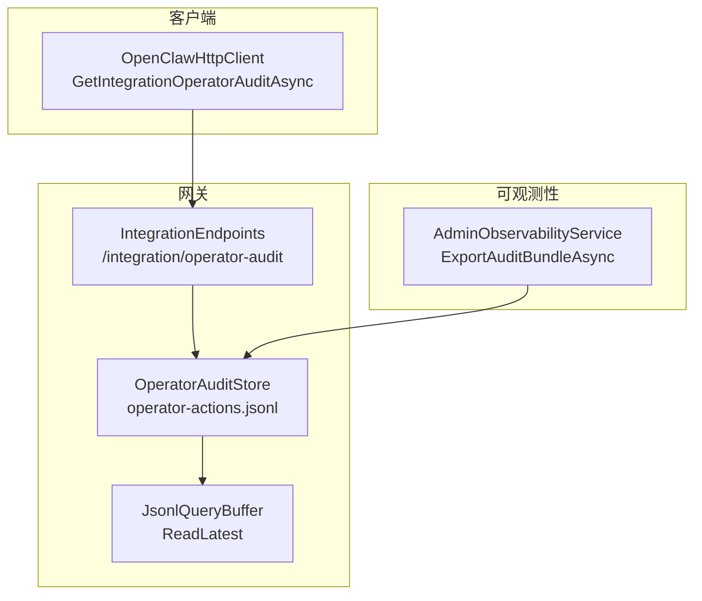
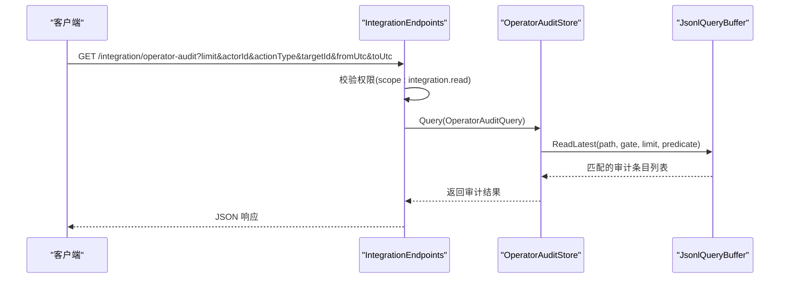
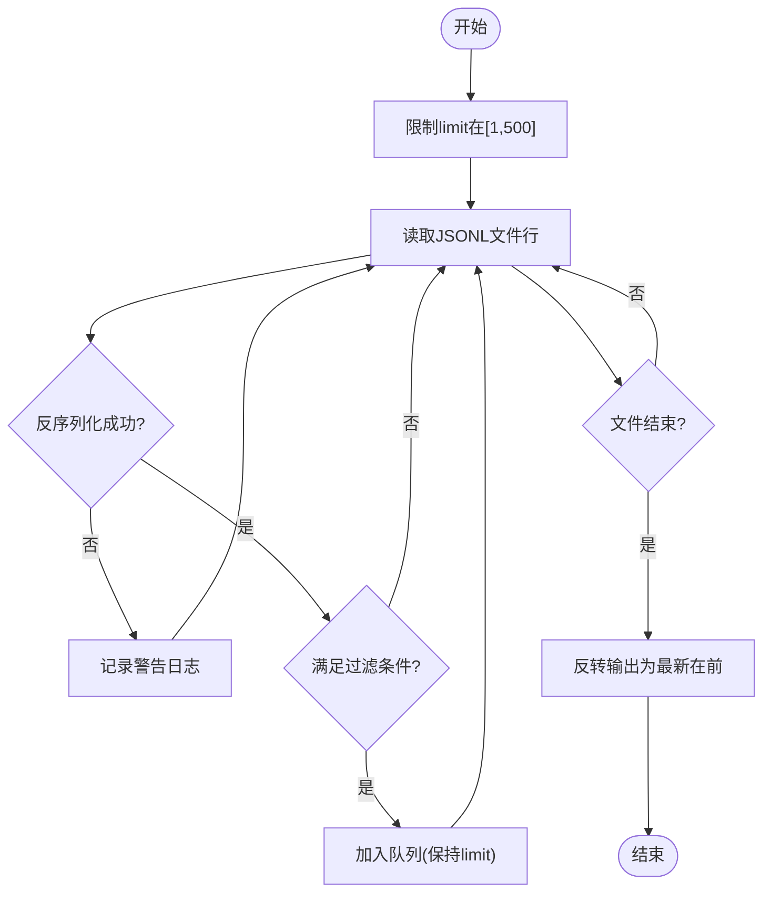
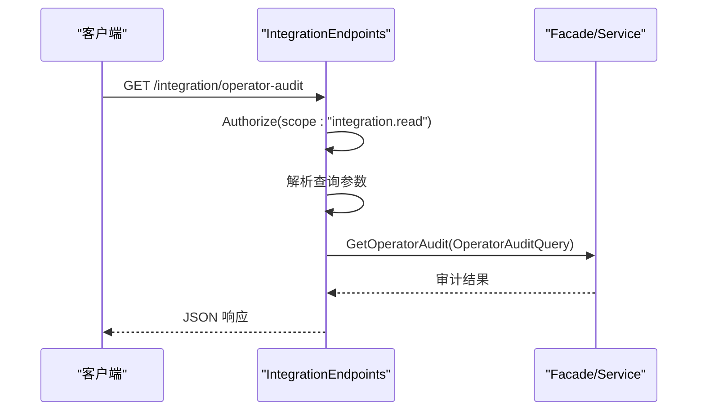
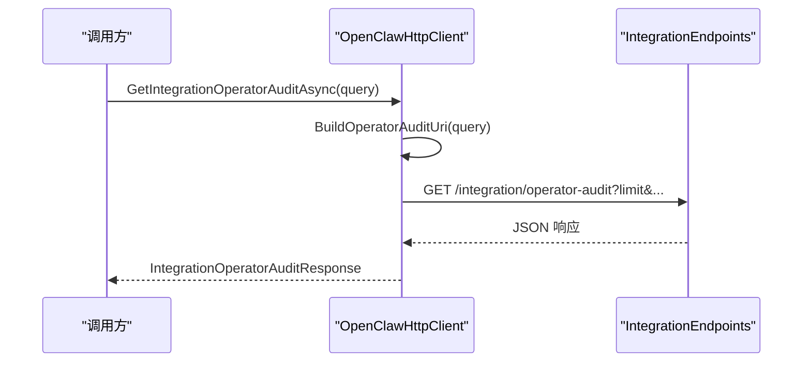
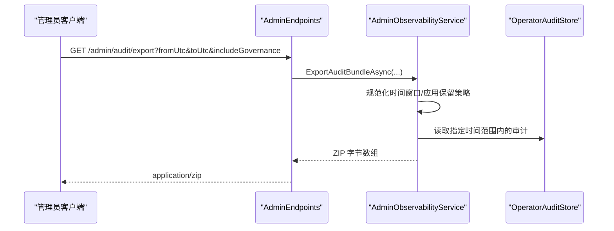
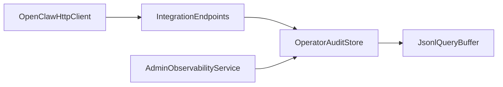

# 操作员审计

<cite>
**本文引用的文件**
- [OperatorAuditStore.cs](file://src/OpenClaw.Gateway/OperatorAuditStore.cs)
- [IntegrationEndpoints.cs](file://src/OpenClaw.Gateway/Endpoints/IntegrationEndpoints.cs)
- [OperatorApiModels.cs](file://src/OpenClaw.Core/Models/OperatorApiModels.cs)
- [JsonlQueryBuffer.cs](file://src/OpenClaw.Gateway/JsonlQueryBuffer.cs)
- [AdminObservabilityService.cs](file://src/OpenClaw.Gateway/AdminObservabilityService.cs)
- [OpenClawHttpClient.cs](file://src/OpenClaw.Client/OpenClawHttpClient.cs)
- [DigitalEmployeeEndpoints.cs](file://src/OpenClaw.Gateway/Endpoints/DigitalEmployeeEndpoints.cs)
- [ContractEndpoints.cs](file://src/OpenClaw.Gateway/Endpoints/ContractEndpoints.cs)
- [RedactionPipeline.cs](file://src/OpenClaw.Core/Security/RedactionPipeline.cs)
</cite>

## 目录
1. [简介](#简介)
2. [项目结构](#项目结构)
3. [核心组件](#核心组件)
4. [架构总览](#架构总览)
5. [详细组件分析](#详细组件分析)
6. [依赖关系分析](#依赖关系分析)
7. [性能考量](#性能考量)
8. [故障排查指南](#故障排查指南)
9. [结论](#结论)
10. [附录](#附录)

## 简介
本文件面向“操作员审计 API”的技术文档，重点围绕 GetIntegrationOperatorAuditAsync 方法的实现与使用进行系统化说明。内容涵盖审计日志查询、过滤、导出等能力，明确审计事件类型、查询条件、权限控制、数据保护与合规支持，并提供可操作的使用示例，帮助读者在满足合规要求的前提下高效分析用户行为与操作轨迹。

## 项目结构
操作员审计相关能力由以下模块协同实现：
- 网关端点：提供集成 API 的查询入口与鉴权控制
- 审计存储：以 JSONL 文件持久化审计条目并提供高效查询
- 客户端封装：对集成 API 进行统一调用与参数构建
- 可观测性服务：负责审计导出打包与合规范围控制
- 数据保护：敏感信息脱敏与隐私保护策略

图表来源
- [IntegrationEndpoints.cs:132-156](file://src/OpenClaw.Gateway/Endpoints/IntegrationEndpoints.cs#L132-L156)
- [OperatorAuditStore.cs:97-125](file://src/OpenClaw.Gateway/OperatorAuditStore.cs#L97-L125)
- [JsonlQueryBuffer.cs:9-49](file://src/OpenClaw.Gateway/JsonlQueryBuffer.cs#L9-L49)
- [OpenClawHttpClient.cs:512-515](file://src/OpenClaw.Client/OpenClawHttpClient.cs#L512-L515)
- [AdminObservabilityService.cs:229-307](file://src/OpenClaw.Gateway/AdminObservabilityService.cs#L229-L307)

章节来源
- [IntegrationEndpoints.cs:132-156](file://src/OpenClaw.Gateway/Endpoints/IntegrationEndpoints.cs#L132-L156)
- [OperatorAuditStore.cs:97-125](file://src/OpenClaw.Gateway/OperatorAuditStore.cs#L97-L125)
- [JsonlQueryBuffer.cs:9-49](file://src/OpenClaw.Gateway/JsonlQueryBuffer.cs#L9-L49)
- [OpenClawHttpClient.cs:512-515](file://src/OpenClaw.Client/OpenClawHttpClient.cs#L512-L515)
- [AdminObservabilityService.cs:229-307](file://src/OpenClaw.Gateway/AdminObservabilityService.cs#L229-L307)

## 核心组件
- 审计查询模型
  - OperatorAuditQuery：包含 limit、actorId、actionType、targetId、fromUtc、toUtc 等查询参数
  - OperatorAuditEntry：单条审计记录，包含序列号、时间戳、操作者身份、认证方式、动作类型、目标标识、摘要、链式哈希、前后状态、成功标记等字段
- 审计存储与查询
  - OperatorAuditStore：负责写入审计条目（含链式哈希校验）、读取最新 N 条并按条件过滤
  - JsonlQueryBuffer：通用 JSONL 行读取与过滤工具，支持限流与谓词筛选
- 集成 API 端点
  - /integration/operator-audit：对外暴露审计查询接口，内置权限控制与参数解析
- 客户端封装
  - OpenClawHttpClient.GetIntegrationOperatorAuditAsync：构建查询 URI 并发起请求
- 导出与合规
  - AdminObservabilityService.ExportAuditBundleAsync：生成审计导出包，支持合规窗口与保留期控制
- 数据保护
  - RedactionPipeline：对会话与敏感数据进行脱敏处理

章节来源
- [OperatorApiModels.cs:359-391](file://src/OpenClaw.Core/Models/OperatorApiModels.cs#L359-L391)
- [OperatorAuditStore.cs:33-93](file://src/OpenClaw.Gateway/OperatorAuditStore.cs#L33-L93)
- [JsonlQueryBuffer.cs:9-49](file://src/OpenClaw.Gateway/JsonlQueryBuffer.cs#L9-L49)
- [IntegrationEndpoints.cs:132-156](file://src/OpenClaw.Gateway/Endpoints/IntegrationEndpoints.cs#L132-L156)
- [OpenClawHttpClient.cs:512-515](file://src/OpenClaw.Client/OpenClawHttpClient.cs#L512-L515)
- [AdminObservabilityService.cs:229-307](file://src/OpenClaw.Gateway/AdminObservabilityService.cs#L229-L307)
- [RedactionPipeline.cs:21-39](file://src/OpenClaw.Core/Security/RedactionPipeline.cs#L21-L39)

## 架构总览
下图展示了从客户端到网关再到存储与导出的整体流程：

图表来源
- [IntegrationEndpoints.cs:132-156](file://src/OpenClaw.Gateway/Endpoints/IntegrationEndpoints.cs#L132-L156)
- [OperatorAuditStore.cs:97-125](file://src/OpenClaw.Gateway/OperatorAuditStore.cs#L97-L125)
- [JsonlQueryBuffer.cs:9-49](file://src/OpenClaw.Gateway/JsonlQueryBuffer.cs#L9-L49)

## 详细组件分析

### 组件一：审计查询与过滤（OperatorAuditStore）
- 查询逻辑
  - 限制返回条数在合理范围内（上限 500），按时间倒序读取
  - 支持按 actorId、actionType、targetId、时间范围进行精确或范围过滤
  - 使用谓词函数逐条匹配，避免全量加载
- 写入与链式完整性
  - 写入时计算条目哈希，维护序列号与前一条目哈希，确保链式完整性
  - 初始化时扫描现有文件，恢复最高序列号与最后哈希值
- 错误处理
  - 解析失败时记录警告日志，不影响整体流程

图表来源
- [OperatorAuditStore.cs:97-125](file://src/OpenClaw.Gateway/OperatorAuditStore.cs#L97-L125)
- [JsonlQueryBuffer.cs:9-49](file://src/OpenClaw.Gateway/JsonlQueryBuffer.cs#L9-L49)

章节来源
- [OperatorAuditStore.cs:97-125](file://src/OpenClaw.Gateway/OperatorAuditStore.cs#L97-L125)
- [JsonlQueryBuffer.cs:9-49](file://src/OpenClaw.Gateway/JsonlQueryBuffer.cs#L9-L49)

### 组件二：集成 API 端点与权限控制（IntegrationEndpoints）
- 路径与方法
  - GET /integration/operator-audit
- 权限控制
  - 需要 scope:integration.read；未授权直接返回失败
- 参数解析
  - limit 默认 100，支持 actorId、actionType、targetId、fromUtc、toUtc
- 响应
  - 返回 IntegrationOperatorAuditResponse（包含审计条目列表）

图表来源
- [IntegrationEndpoints.cs:132-156](file://src/OpenClaw.Gateway/Endpoints/IntegrationEndpoints.cs#L132-L156)

章节来源
- [IntegrationEndpoints.cs:132-156](file://src/OpenClaw.Gateway/Endpoints/IntegrationEndpoints.cs#L132-L156)

### 组件三：客户端封装（OpenClawHttpClient）
- 方法
  - GetIntegrationOperatorAuditAsync(OperatorAuditQuery, CancellationToken)
- URI 构建规则
  - limit 强制限制在 [1,500]
  - 可选参数：actorId、actionType、targetId、fromUtc、toUtc
  - 使用 UTC ISO8601 字符串传递时间参数
- 响应
  - IntegrationOperatorAuditResponse

图表来源
- [OpenClawHttpClient.cs:512-515](file://src/OpenClaw.Client/OpenClawHttpClient.cs#L512-L515)
- [OpenClawHttpClient.cs:1804-1823](file://src/OpenClaw.Client/OpenClawHttpClient.cs#L1804-L1823)

章节来源
- [OpenClawHttpClient.cs:512-515](file://src/OpenClaw.Client/OpenClawHttpClient.cs#L512-L515)
- [OpenClawHttpClient.cs:1804-1823](file://src/OpenClaw.Client/OpenClawHttpClient.cs#L1804-L1823)

### 组件四：审计导出与合规（AdminObservabilityService）
- 导出接口
  - GET /admin/audit/export
  - 参数：fromUtc、toUtc、includeGovernance
- 合规与保留
  - 自动规范化时间窗口，默认 30 天，应用组织保留策略
  - 导出包包含 operator-audit.jsonl、runtime-events.jsonl、approval-history.jsonl、provider-usage.json、provider-routes.json、dead-letter.jsonl、session-metadata.json，以及可选的 governance-ledger.jsonl
  - 清单中包含起止序列号、哈希、文件条目计数与保留天数等元信息
- 输出
  - ZIP 包，文件名包含 UTC 时间戳

图表来源
- [AdminObservabilityService.cs:229-307](file://src/OpenClaw.Gateway/AdminObservabilityService.cs#L229-L307)
- [IntegrationEndpoints.cs:264-277](file://src/OpenClaw.Gateway/Endpoints/AdminEndpoints.Setup.cs#L264-L277)

章节来源
- [AdminObservabilityService.cs:229-307](file://src/OpenClaw.Gateway/AdminObservabilityService.cs#L229-L307)
- [IntegrationEndpoints.cs:264-277](file://src/OpenClaw.Gateway/Endpoints/AdminEndpoints.Setup.cs#L264-L277)

### 组件五：审计事件类型与记录点
- 记录点示例
  - DigitalEmployeeEndpoints 中通过 Append 记录操作员动作
  - ContractEndpoints 中记录合约相关动作
- 典型事件类型
  - 依据 ActionType 字段区分，如配置变更、策略调整、会话管理、工具调用审批等
- 记录内容
  - 包含 ActorId、ActorRole、ActorDisplayName、AuthMode、TargetId、Summary、Success 等

章节来源
- [DigitalEmployeeEndpoints.cs:281-299](file://src/OpenClaw.Gateway/Endpoints/DigitalEmployeeEndpoints.cs#L281-L299)
- [ContractEndpoints.cs:260-279](file://src/OpenClaw.Gateway/Endpoints/ContractEndpoints.cs#L260-L279)

## 依赖关系分析
- 组件耦合
  - IntegrationEndpoints 依赖 OperatorAuditStore 提供查询能力
  - OperatorAuditStore 依赖 JsonlQueryBuffer 实现高效过滤
  - AdminObservabilityService 依赖 OperatorAuditStore 读取审计数据并打包导出
  - OpenClawHttpClient 依赖集成端点与 OperatorAuditQuery 构建请求
- 外部依赖
  - JSON 序列化上下文 CoreJsonContext
  - 日志与指标（运行时度量）
- 潜在循环依赖
  - 当前模块间为单向依赖，无明显循环

图表来源
- [OpenClawHttpClient.cs:512-515](file://src/OpenClaw.Client/OpenClawHttpClient.cs#L512-L515)
- [IntegrationEndpoints.cs:132-156](file://src/OpenClaw.Gateway/Endpoints/IntegrationEndpoints.cs#L132-L156)
- [OperatorAuditStore.cs:97-125](file://src/OpenClaw.Gateway/OperatorAuditStore.cs#L97-L125)
- [JsonlQueryBuffer.cs:9-49](file://src/OpenClaw.Gateway/JsonlQueryBuffer.cs#L9-L49)
- [AdminObservabilityService.cs:229-307](file://src/OpenClaw.Gateway/AdminObservabilityService.cs#L229-L307)

章节来源
- [OpenClawHttpClient.cs:512-515](file://src/OpenClaw.Client/OpenClawHttpClient.cs#L512-L515)
- [IntegrationEndpoints.cs:132-156](file://src/OpenClaw.Gateway/Endpoints/IntegrationEndpoints.cs#L132-L156)
- [OperatorAuditStore.cs:97-125](file://src/OpenClaw.Gateway/OperatorAuditStore.cs#L97-L125)
- [JsonlQueryBuffer.cs:9-49](file://src/OpenClaw.Gateway/JsonlQueryBuffer.cs#L9-L49)
- [AdminObservabilityService.cs:229-307](file://src/OpenClaw.Gateway/AdminObservabilityService.cs#L229-L307)

## 性能考量
- 查询效率
  - 采用 JSONL 行流式读取与队列缓存，限制返回数量，避免一次性加载全量数据
- 写入一致性
  - 通过链式哈希与序列号保证审计链完整，便于审计追踪与校验
- 导出规模
  - 导出接口自动应用保留策略与时间窗口规范化，避免超大规模导出导致内存压力
- 并发安全
  - 存储层使用内部锁与只读缓冲，确保并发读写的安全性

## 故障排查指南
- 常见问题
  - 权限不足：确认调用 scope 是否为 integration.read 或 admin.audit.export
  - 参数非法：检查 limit 是否在 [1,500]，时间参数是否为合法 UTC ISO8601
  - 文件读取异常：关注存储路径是否存在、权限是否正确、JSONL 行格式是否有效
- 排查步骤
  - 使用 /integration/operator-audit 验证查询参数与返回条数
  - 查看运行日志中的警告信息（如 JSONL 行解析失败）
  - 通过 /admin/audit/export 检查导出包清单与保留策略
- 相关实现参考
  - 权限控制与参数解析：IntegrationEndpoints
  - 存储写入与错误日志：OperatorAuditStore
  - 导出清单与保留策略：AdminObservabilityService

章节来源
- [IntegrationEndpoints.cs:132-156](file://src/OpenClaw.Gateway/Endpoints/IntegrationEndpoints.cs#L132-L156)
- [OperatorAuditStore.cs:88-92](file://src/OpenClaw.Gateway/OperatorAuditStore.cs#L88-L92)
- [AdminObservabilityService.cs:229-307](file://src/OpenClaw.Gateway/AdminObservabilityService.cs#L229-L307)

## 结论
GetIntegrationOperatorAuditAsync 提供了稳定、可扩展的操作员审计查询能力。通过严格的权限控制、高效的 JSONL 查询与链式完整性保障，结合导出与合规机制，能够满足日常运营分析与合规审计需求。建议在生产环境中：
- 明确审计事件类型与记录点，统一 ActionType 语义
- 合理设置查询窗口与 limit，避免超大范围扫描
- 定期导出并归档审计包，遵循组织保留策略
- 对敏感数据进行脱敏处理，确保隐私合规

## 附录

### 使用示例与最佳实践
- 查询操作记录
  - 场景：统计某操作者在指定时间范围内的操作次数
  - 步骤：构造 OperatorAuditQuery，设置 actorId 与时间范围，调用 GetIntegrationOperatorAuditAsync 获取条目列表
  - 分析：按 ActionType 分组统计，识别高频动作与异常模式
- 分析用户行为
  - 场景：定位特定目标资源上的变更历史
  - 步骤：设置 targetId 与 actionType，结合时间窗口缩小范围
  - 分析：查看 before/after 字段（若存在）与摘要信息，还原操作影响面
- 满足合规要求
  - 场景：生成合规导出包
  - 步骤：调用 /admin/audit/export，设置 fromUtc/toUtc，必要时 includeGovernance
  - 注意：导出会应用组织保留策略，确保导出范围符合合规要求

### 关键参数与类型定义
- OperatorAuditQuery
  - 字段：Limit、ActorId、ActionType、TargetId、FromUtc、ToUtc
- OperatorAuditEntry
  - 字段：Id、Sequence、TimestampUtc、ActorId、ActorRole、ActorDisplayName、AuthMode、ActionType、TargetId、Summary、PreviousEntryHash、EntryHash、Before、After、Success
- IntegrationOperatorAuditResponse
  - 字段：Items（OperatorAuditEntry 列表）

章节来源
- [OperatorApiModels.cs:359-391](file://src/OpenClaw.Core/Models/OperatorApiModels.cs#L359-L391)
- [IntegrationEndpoints.cs:132-156](file://src/OpenClaw.Gateway/Endpoints/IntegrationEndpoints.cs#L132-L156)
- [OpenClawHttpClient.cs:512-515](file://src/OpenClaw.Client/OpenClawHttpClient.cs#L512-L515)