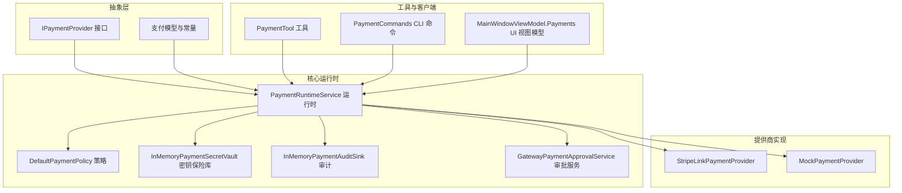
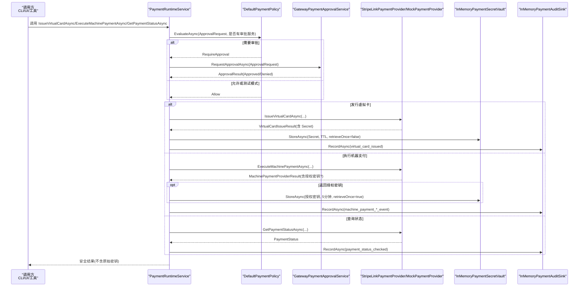
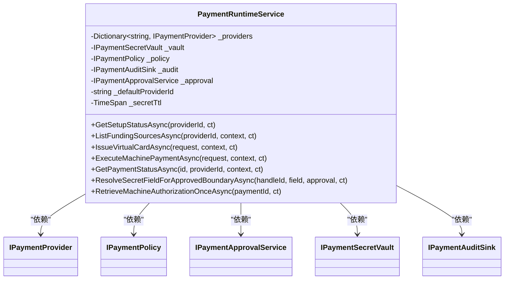
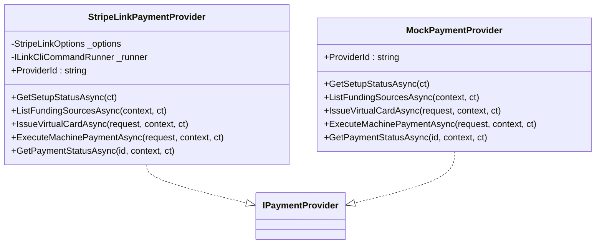
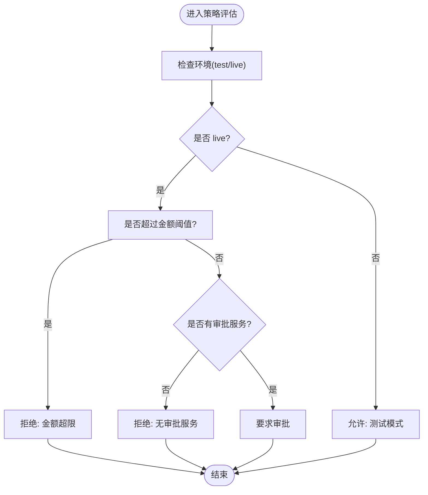
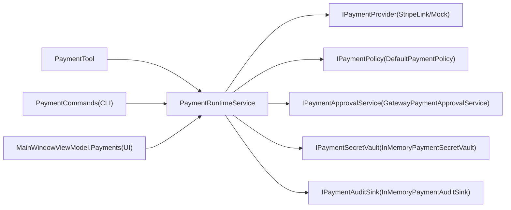

# 支付集成

<cite>
**本文引用的文件**
- [PaymentInterfaces.cs](file://src/OpenClaw.Payments.Abstractions/PaymentInterfaces.cs)
- [PaymentModels.cs](file://src/OpenClaw.Payments.Abstractions/PaymentModels.cs)
- [PaymentRuntimeService.cs](file://src/OpenClaw.Payments.Core/PaymentRuntimeService.cs)
- [StripeLinkPaymentProvider.cs](file://src/OpenClaw.Payments.StripeLink/StripeLinkPaymentProvider.cs)
- [MockPaymentProvider.cs](file://src/OpenClaw.Payments.Core/MockPaymentProvider.cs)
- [DefaultPaymentPolicy.cs](file://src/OpenClaw.Payments.Core/DefaultPaymentPolicy.cs)
- [InMemoryPaymentSecretVault.cs](file://src/OpenClaw.Payments.Core/InMemoryPaymentSecretVault.cs)
- [PaymentAuditSinks.cs](file://src/OpenClaw.Payments.Core/PaymentAuditSinks.cs)
- [GatewayPaymentApprovalService.cs](file://src/OpenClaw.Gateway/GatewayPaymentApprovalService.cs)
- [PaymentTool.cs](file://src/OpenClaw.Plugins.Payment/PaymentTool.cs)
- [PaymentCommands.cs](file://src/OpenClaw.Cli/PaymentCommands.cs)
- [MainWindowViewModel.Payments.cs](file://src/OpenClaw.Companion/ViewModels/MainWindowViewModel.Payments.cs)
</cite>

## 目录
1. [简介](#简介)
2. [项目结构](#项目结构)
3. [核心组件](#核心组件)
4. [架构总览](#架构总览)
5. [详细组件分析](#详细组件分析)
6. [依赖关系分析](#依赖关系分析)
7. [性能与可扩展性](#性能与可扩展性)
8. [故障排查指南](#故障排查指南)
9. [结论](#结论)
10. [附录：使用示例与最佳实践](#附录使用示例与最佳实践)

## 简介
本技术文档面向“支付集成 API”的实现与使用，聚焦以下核心方法与能力：
- GetPaymentSetupStatusAsync：查询支付提供商安装与就绪状态
- ListPaymentFundingSourcesAsync：列出可用资金来源（银行卡/余额等）
- IssueVirtualCardAsync：发行虚拟卡并返回可安全使用的“凭证句柄”
- ExecuteMachinePaymentAsync：执行机器支付（如按资源付费），支持一次性授权密钥
- GetPaymentStatusAsync：查询支付状态

文档同时覆盖支付提供商抽象、支付流程、安全机制（密钥保管、脱敏、审计）、策略与审批、错误处理与可观测性，并提供从 CLI、UI 到后端服务的集成示例。

## 项目结构
支付能力由“抽象层 + 核心运行时 + 提供商实现 + 审计与策略 + 工具与客户端”构成，采用分层与插件化设计，便于替换不同支付提供商（如 Stripe Link）或在测试环境使用模拟实现。

图表来源
- [PaymentInterfaces.cs:1-60](file://src/OpenClaw.Payments.Abstractions/PaymentInterfaces.cs#L1-L60)
- [PaymentModels.cs:1-400](file://src/OpenClaw.Payments.Abstractions/PaymentModels.cs#L1-L400)
- [PaymentRuntimeService.cs:1-433](file://src/OpenClaw.Payments.Core/PaymentRuntimeService.cs#L1-L433)
- [StripeLinkPaymentProvider.cs:1-286](file://src/OpenClaw.Payments.StripeLink/StripeLinkPaymentProvider.cs#L1-L286)
- [MockPaymentProvider.cs:1-165](file://src/OpenClaw.Payments.Core/MockPaymentProvider.cs#L1-L165)
- [DefaultPaymentPolicy.cs:1-60](file://src/OpenClaw.Payments.Core/DefaultPaymentPolicy.cs#L1-L60)
- [InMemoryPaymentSecretVault.cs:1-73](file://src/OpenClaw.Payments.Core/InMemoryPaymentSecretVault.cs#L1-L73)
- [PaymentAuditSinks.cs:1-19](file://src/OpenClaw.Payments.Core/PaymentAuditSinks.cs#L1-L19)
- [GatewayPaymentApprovalService.cs:1-104](file://src/OpenClaw.Gateway/GatewayPaymentApprovalService.cs#L1-L104)
- [PaymentTool.cs:1-181](file://src/OpenClaw.Plugins.Payment/PaymentTool.cs#L1-L181)
- [PaymentCommands.cs:1-206](file://src/OpenClaw.Cli/PaymentCommands.cs#L1-L206)
- [MainWindowViewModel.Payments.cs:1-273](file://src/OpenClaw.Companion/ViewModels/MainWindowViewModel.Payments.cs#L1-L273)

章节来源
- [PaymentInterfaces.cs:1-60](file://src/OpenClaw.Payments.Abstractions/PaymentInterfaces.cs#L1-L60)
- [PaymentModels.cs:1-400](file://src/OpenClaw.Payments.Abstractions/PaymentModels.cs#L1-L400)

## 核心组件
- 支付接口与模型：定义统一的提供商接口、支付动作、策略决策、审计事件、机密字段等。
- 运行时服务：统一编排提供商选择、策略评估、审批请求、密钥保管、审计记录与错误处理。
- 提供商实现：Stripe Link CLI 实现与模拟实现，分别对接外部 CLI 或内存模拟。
- 策略与审批：默认策略根据环境与金额阈值决定是否需要审批；网关侧将审批请求转交到工具审批系统。
- 安全与审计：密钥仅通过保险库安全存储与一次性提取；所有关键操作均记录审计事件。
- 工具与客户端：CLI 命令、UI 视图模型与插件工具封装调用，屏蔽底层细节。

章节来源
- [PaymentRuntimeService.cs:1-433](file://src/OpenClaw.Payments.Core/PaymentRuntimeService.cs#L1-L433)
- [DefaultPaymentPolicy.cs:1-60](file://src/OpenClaw.Payments.Core/DefaultPaymentPolicy.cs#L1-L60)
- [InMemoryPaymentSecretVault.cs:1-73](file://src/OpenClaw.Payments.Core/InMemoryPaymentSecretVault.cs#L1-L73)
- [PaymentAuditSinks.cs:1-19](file://src/OpenClaw.Payments.Core/PaymentAuditSinks.cs#L1-L19)
- [GatewayPaymentApprovalService.cs:1-104](file://src/OpenClaw.Gateway/GatewayPaymentApprovalService.cs#L1-L104)
- [PaymentTool.cs:1-181](file://src/OpenClaw.Plugins.Payment/PaymentTool.cs#L1-L181)
- [PaymentCommands.cs:1-206](file://src/OpenClaw.Cli/PaymentCommands.cs#L1-L206)
- [MainWindowViewModel.Payments.cs:1-273](file://src/OpenClaw.Companion/ViewModels/MainWindowViewModel.Payments.cs#L1-L273)

## 架构总览
下图展示了支付调用从工具/客户端到运行时、提供商、审批与审计的整体链路。

图表来源
- [PaymentRuntimeService.cs:1-433](file://src/OpenClaw.Payments.Core/PaymentRuntimeService.cs#L1-L433)
- [DefaultPaymentPolicy.cs:1-60](file://src/OpenClaw.Payments.Core/DefaultPaymentPolicy.cs#L1-L60)
- [GatewayPaymentApprovalService.cs:1-104](file://src/OpenClaw.Gateway/GatewayPaymentApprovalService.cs#L1-L104)
- [StripeLinkPaymentProvider.cs:1-286](file://src/OpenClaw.Payments.StripeLink/StripeLinkPaymentProvider.cs#L1-L286)
- [InMemoryPaymentSecretVault.cs:1-73](file://src/OpenClaw.Payments.Core/InMemoryPaymentSecretVault.cs#L1-L73)
- [PaymentAuditSinks.cs:1-19](file://src/OpenClaw.Payments.Core/PaymentAuditSinks.cs#L1-L19)

## 详细组件分析

### 组件一：运行时服务 PaymentRuntimeService
- 职责
  - 解析并选择提供商（默认提供商回退）
  - 标准化执行上下文（环境归一化）
  - 统一策略评估与审批流程
  - 安全地存储/提取机密（虚拟卡与授权令牌）
  - 记录审计事件
  - 参数校验与错误包装
- 关键方法映射
  - GetSetupStatusAsync → Provider.GetSetupStatusAsync
  - ListFundingSourcesAsync → Provider.ListFundingSourcesAsync
  - IssueVirtualCardAsync → Provider.IssueVirtualCardAsync + Vault 存储 + 审计
  - ExecuteMachinePaymentAsync → Provider.ExecuteMachinePaymentAsync + 可选一次性授权密钥存储 + 审计
  - GetPaymentStatusAsync → Provider.GetPaymentStatusAsync + 审计
- 安全要点
  - 不直接返回原始密钥；通过 Vault 以句柄形式存取
  - 一次性授权密钥 TTL 严格限制（5 分钟）
  - 审计事件包含最小化安全元数据
- 错误处理
  - 策略拒绝抛出专用异常
  - 审批失败或超时记录审计并抛出异常
  - 提供商调用失败统一包装为运行时异常

图表来源
- [PaymentRuntimeService.cs:1-433](file://src/OpenClaw.Payments.Core/PaymentRuntimeService.cs#L1-L433)
- [PaymentInterfaces.cs:1-60](file://src/OpenClaw.Payments.Abstractions/PaymentInterfaces.cs#L1-L60)

章节来源
- [PaymentRuntimeService.cs:1-433](file://src/OpenClaw.Payments.Core/PaymentRuntimeService.cs#L1-L433)

### 组件二：提供商实现（Stripe Link 与 Mock）
- StripeLinkPaymentProvider
  - 通过 CLI 与 Stripe Link 交互，解析 JSON 输出为内部模型
  - 支持设置模式（test/live）、超时与工作目录
  - 将敏感字段封装为 PaymentSecret 并交由运行时安全存储
- MockPaymentProvider
  - 内存确定性实现，便于测试与演示
  - 生成稳定句柄与状态，便于 UI/CLI 验证

图表来源
- [StripeLinkPaymentProvider.cs:1-286](file://src/OpenClaw.Payments.StripeLink/StripeLinkPaymentProvider.cs#L1-L286)
- [MockPaymentProvider.cs:1-165](file://src/OpenClaw.Payments.Core/MockPaymentProvider.cs#L1-L165)
- [PaymentInterfaces.cs:1-60](file://src/OpenClaw.Payments.Abstractions/PaymentInterfaces.cs#L1-L60)

章节来源
- [StripeLinkPaymentProvider.cs:1-286](file://src/OpenClaw.Payments.StripeLink/StripeLinkPaymentProvider.cs#L1-L286)
- [MockPaymentProvider.cs:1-165](file://src/OpenClaw.Payments.Core/MockPaymentProvider.cs#L1-L165)

### 组件三：策略与审批
- DefaultPaymentPolicy
  - 测试模式默认放行（可配置）
  - 生活动金额超过阈值拒绝
  - 无审批服务且为 live 模式时拒绝
  - 其余情况要求审批
- GatewayPaymentApprovalService
  - 将审批请求转交给工具审批系统
  - 记录审批审计与治理账本

图表来源
- [DefaultPaymentPolicy.cs:1-60](file://src/OpenClaw.Payments.Core/DefaultPaymentPolicy.cs#L1-L60)
- [GatewayPaymentApprovalService.cs:1-104](file://src/OpenClaw.Gateway/GatewayPaymentApprovalService.cs#L1-L104)

章节来源
- [DefaultPaymentPolicy.cs:1-60](file://src/OpenClaw.Payments.Core/DefaultPaymentPolicy.cs#L1-L60)
- [GatewayPaymentApprovalService.cs:1-104](file://src/OpenClaw.Gateway/GatewayPaymentApprovalService.cs#L1-L104)

### 组件四：密钥保管与审计
- InMemoryPaymentSecretVault
  - 以句柄为索引存储 PaymentSecret
  - 支持过期清理与一次性提取
- InMemoryPaymentAuditSink
  - 内存队列记录审计事件，便于调试与诊断

章节来源
- [InMemoryPaymentSecretVault.cs:1-73](file://src/OpenClaw.Payments.Core/InMemoryPaymentSecretVault.cs#L1-L73)
- [PaymentAuditSinks.cs:1-19](file://src/OpenClaw.Payments.Core/PaymentAuditSinks.cs#L1-L19)

### 组件五：工具与客户端
- PaymentTool
  - 插件工具封装，暴露统一参数模式，屏蔽运行时细节
- PaymentCommands（CLI）
  - 提供 setup、funding list、virtual-card issue、execute、status 等命令
  - 自动处理 live 模式确认与环境归一化
- MainWindowViewModel.Payments（UI）
  - 提供可视化入口：加载设置、列出资金来源、发行虚拟卡、执行支付、查询状态

章节来源
- [PaymentTool.cs:1-181](file://src/OpenClaw.Plugins.Payment/PaymentTool.cs#L1-L181)
- [PaymentCommands.cs:1-206](file://src/OpenClaw.Cli/PaymentCommands.cs#L1-L206)
- [MainWindowViewModel.Payments.cs:1-273](file://src/OpenClaw.Companion/ViewModels/MainWindowViewModel.Payments.cs#L1-L273)

## 依赖关系分析
- 松耦合接口：通过 IPaymentProvider 抽象屏蔽具体提供商差异
- 运行时集中编排：策略、审批、密钥、审计在运行时统一处理
- 可替换提供商：只需实现 IPaymentProvider 并注册即可
- 审计与治理：审批与支付事件均记录审计，便于合规与回溯

图表来源
- [PaymentTool.cs:1-181](file://src/OpenClaw.Plugins.Payment/PaymentTool.cs#L1-L181)
- [PaymentRuntimeService.cs:1-433](file://src/OpenClaw.Payments.Core/PaymentRuntimeService.cs#L1-L433)
- [PaymentCommands.cs:1-206](file://src/OpenClaw.Cli/PaymentCommands.cs#L1-L206)
- [MainWindowViewModel.Payments.cs:1-273](file://src/OpenClaw.Companion/ViewModels/MainWindowViewModel.Payments.cs#L1-L273)
- [DefaultPaymentPolicy.cs:1-60](file://src/OpenClaw.Payments.Core/DefaultPaymentPolicy.cs#L1-L60)
- [GatewayPaymentApprovalService.cs:1-104](file://src/OpenClaw.Gateway/GatewayPaymentApprovalService.cs#L1-L104)
- [InMemoryPaymentSecretVault.cs:1-73](file://src/OpenClaw.Payments.Core/InMemoryPaymentSecretVault.cs#L1-L73)
- [PaymentAuditSinks.cs:1-19](file://src/OpenClaw.Payments.Core/PaymentAuditSinks.cs#L1-L19)

章节来源
- [PaymentRuntimeService.cs:1-433](file://src/OpenClaw.Payments.Core/PaymentRuntimeService.cs#L1-L433)

## 性能与可扩展性
- 异步与取消：所有关键路径使用 ValueTask/CancellationToken，避免阻塞
- 最小化序列化：使用源生成器减少 JSON 序列化开销
- 缓存与重试：运行时未内置缓存，建议在上层或网关层做轻量缓存（如资金来源列表短期缓存）
- 扩展点：新增提供商只需实现 IPaymentProvider；策略与审批可注入自定义实现

[本节为通用指导，不直接分析具体文件]

## 故障排查指南
- 策略拒绝
  - 现象：抛出策略拒绝异常
  - 排查：确认环境、金额阈值、是否具备审批服务
  - 参考
    - [DefaultPaymentPolicy.cs:21-51](file://src/OpenClaw.Payments.Core/DefaultPaymentPolicy.cs#L21-L51)
    - [PaymentRuntimeService.cs:269-334](file://src/OpenClaw.Payments.Core/PaymentRuntimeService.cs#L269-L334)
- 审批失败或超时
  - 现象：审批被拒或超时
  - 排查：检查审批服务可用性与超时配置
  - 参考
    - [GatewayPaymentApprovalService.cs:27-102](file://src/OpenClaw.Gateway/GatewayPaymentApprovalService.cs#L27-L102)
- 提供商调用失败
  - 现象：CLI 失败或解析异常
  - 排查：检查 CLI 路径、工作目录、环境变量与超时
  - 参考
    - [StripeLinkPaymentProvider.cs:19-138](file://src/OpenClaw.Payments.StripeLink/StripeLinkPaymentProvider.cs#L19-L138)
- 密钥缺失或过期
  - 现象：无法提取机密
  - 排查：确认句柄有效、TTL 设置、是否已一次性提取
  - 参考
    - [InMemoryPaymentSecretVault.cs:34-54](file://src/OpenClaw.Payments.Core/InMemoryPaymentSecretVault.cs#L34-L54)
- 审计与可观测性
  - 使用审计快照定位问题
  - 参考
    - [PaymentAuditSinks.cs:10-17](file://src/OpenClaw.Payments.Core/PaymentAuditSinks.cs#L10-L17)

章节来源
- [DefaultPaymentPolicy.cs:21-51](file://src/OpenClaw.Payments.Core/DefaultPaymentPolicy.cs#L21-L51)
- [GatewayPaymentApprovalService.cs:27-102](file://src/OpenClaw.Gateway/GatewayPaymentApprovalService.cs#L27-L102)
- [StripeLinkPaymentProvider.cs:19-138](file://src/OpenClaw.Payments.StripeLink/StripeLinkPaymentProvider.cs#L19-L138)
- [InMemoryPaymentSecretVault.cs:34-54](file://src/OpenClaw.Payments.Core/InMemoryPaymentSecretVault.cs#L34-L54)
- [PaymentAuditSinks.cs:10-17](file://src/OpenClaw.Payments.Core/PaymentAuditSinks.cs#L10-L17)

## 结论
该支付集成以清晰的抽象与运行时编排为核心，结合策略、审批、密钥保管与审计，形成安全可控的支付能力。通过 CLI、UI 与插件工具提供多入口，既满足开发者快速验证，也便于在生产中接入真实提供商（如 Stripe Link）。建议在生产环境中：
- 注入真实提供商与审批服务
- 配置严格的金额阈值与超时
- 使用持久化审计与密钥存储
- 在网关层增加缓存与熔断策略

[本节为总结，不直接分析具体文件]

## 附录：使用示例与最佳实践

### 示例一：发行虚拟卡（CLI）
- 步骤
  - 获取设置状态：openclaw payment setup
  - 列出资金来源：openclaw payment funding list
  - 发行虚拟卡（测试）：openclaw payment virtual-card issue --merchant "<name>" --amount-minor <n> --currency USD
  - 发行虚拟卡（线上）：openclaw payment virtual-card issue --merchant "<name>" --amount-minor <n> --environment live --yes
- 参考
  - [PaymentCommands.cs:33-66](file://src/OpenClaw.Cli/PaymentCommands.cs#L33-L66)

章节来源
- [PaymentCommands.cs:33-66](file://src/OpenClaw.Cli/PaymentCommands.cs#L33-L66)

### 示例二：执行机器支付（UI）
- 步骤
  - 在 UI 中填写金额、币种、商户名
  - 确认后触发执行，查看结果文本与状态
- 参考
  - [MainWindowViewModel.Payments.cs:167-217](file://src/OpenClaw.Companion/ViewModels/MainWindowViewModel.Payments.cs#L167-L217)

章节来源
- [MainWindowViewModel.Payments.cs:167-217](file://src/OpenClaw.Companion/ViewModels/MainWindowViewModel.Payments.cs#L167-L217)

### 示例三：查询支付状态（CLI）
- 步骤
  - openclaw payment status --id <payment-or-handle-id>
- 参考
  - [PaymentCommands.cs:93-99](file://src/OpenClaw.Cli/PaymentCommands.cs#L93-L99)

章节来源
- [PaymentCommands.cs:93-99](file://src/OpenClaw.Cli/PaymentCommands.cs#L93-L99)

### 最佳实践
- 环境与金额
  - 默认测试模式，线上需显式 --environment live 与 --yes 确认
  - 合理设置金额上限，避免大额风险
- 审批与治理
  - 为线上支付配置审批服务，确保可追溯
- 安全
  - 不在日志中打印原始密钥；仅使用句柄进行后续操作
  - 对一次性授权密钥严格控制 TTL
- 可观测性
  - 定期检查审计事件，关注 policy_denied、approval_*、machine_payment_*、virtual_card_* 等事件

章节来源
- [PaymentCommands.cs:114-137](file://src/OpenClaw.Cli/PaymentCommands.cs#L114-L137)
- [DefaultPaymentPolicy.cs:21-51](file://src/OpenClaw.Payments.Core/DefaultPaymentPolicy.cs#L21-L51)
- [PaymentRuntimeService.cs:135-175](file://src/OpenClaw.Payments.Core/PaymentRuntimeService.cs#L135-L175)