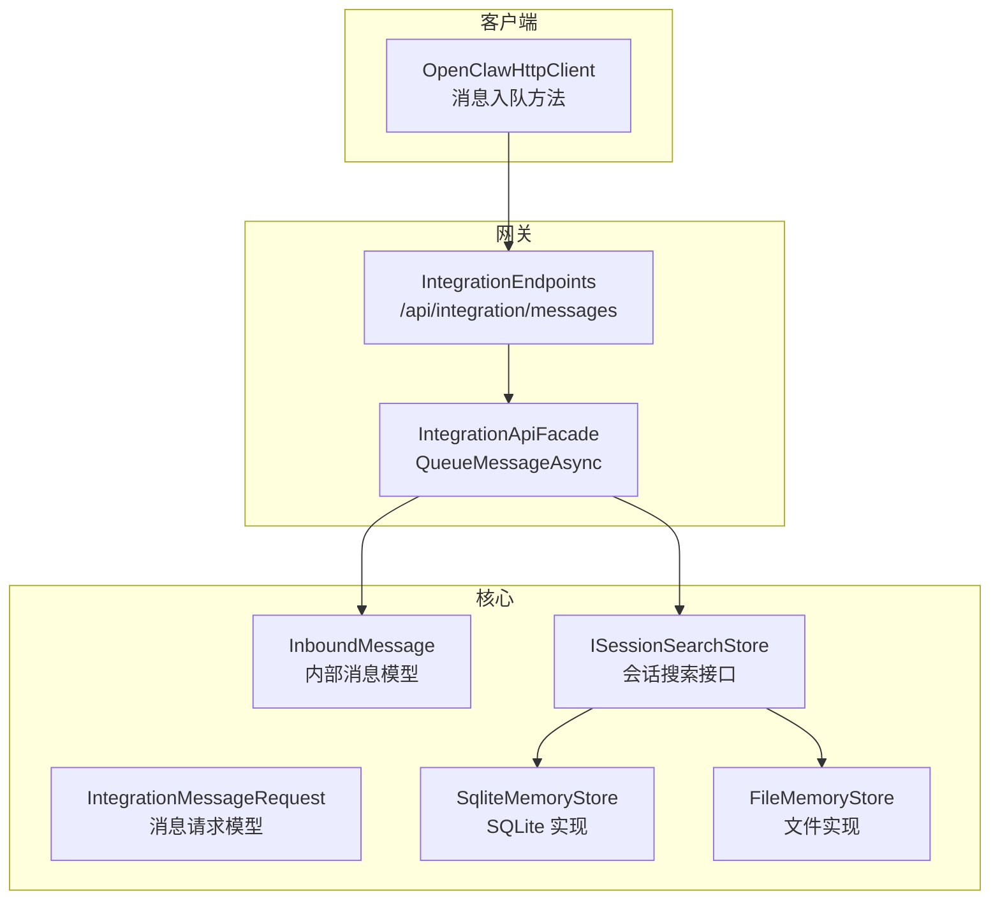
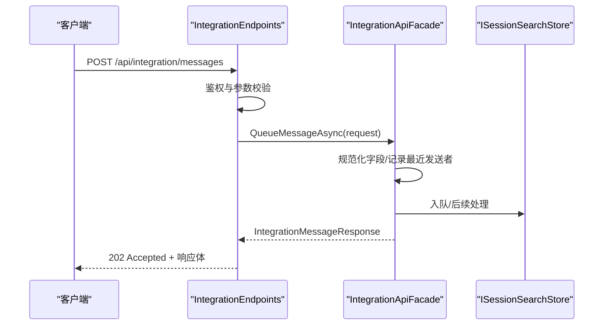
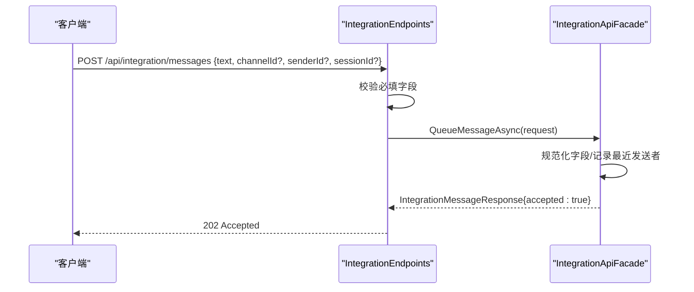
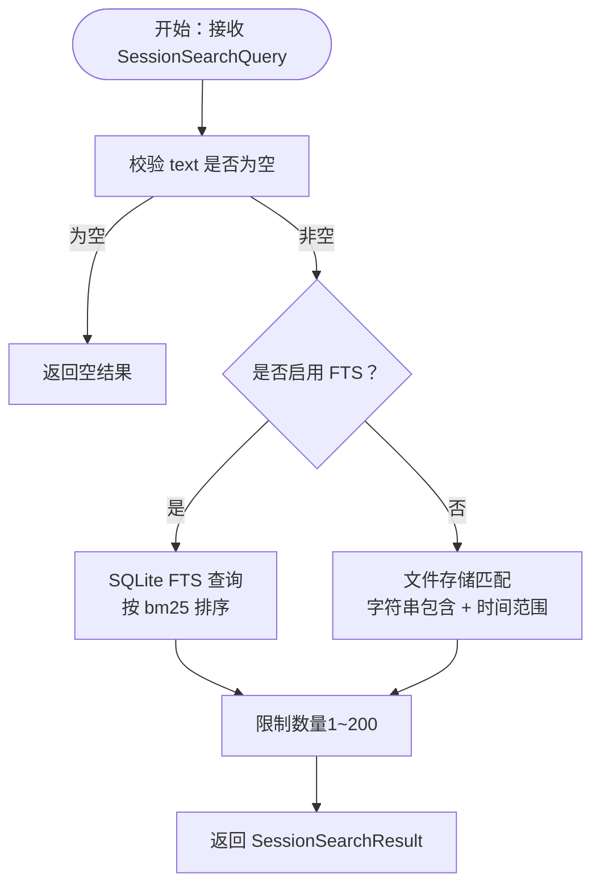
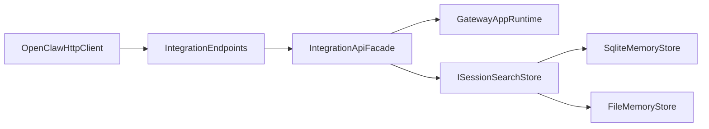

# 消息管理

<cite>
**本文引用的文件**
- [IntegrationEndpoints.cs](file://src/OpenClaw.Gateway/Endpoints/IntegrationEndpoints.cs)
- [IntegrationApiFacade.cs](file://src/OpenClaw.Gateway/Composition/IntegrationApiFacade.cs)
- [IntegrationApiModels.cs](file://src/OpenClaw.Core/Models/IntegrationApiModels.cs)
- [Messages.cs](file://src/OpenClaw.Core/Models/Messages.cs)
- [SessionSearchModels.cs](file://src/OpenClaw.Core/Models/SessionSearchModels.cs)
- [OpenClawHttpClient.cs](file://src/OpenClaw.Client/OpenClawHttpClient.cs)
- [GatewayAdminEndpointTests.cs](file://src/OpenClaw.Tests/GatewayAdminEndpointTests.cs)
- [admin.html](file://src/OpenClaw.Gateway/wwwroot/admin.html)
- [SqliteMemoryStore.cs](file://src/OpenClaw.Core/Memory/SqliteMemoryStore.cs)
- [FileMemoryStore.cs](file://src/OpenClaw.Core/Memory/FileMemoryStore.cs)
- [SessionAdminListing.cs](file://src/OpenClaw.Gateway/Composition/SessionAdminListing.cs)
</cite>

## 目录
1. [简介](#简介)
2. [项目结构](#项目结构)
3. [核心组件](#核心组件)
4. [架构总览](#架构总览)
5. [详细组件分析](#详细组件分析)
6. [依赖关系分析](#依赖关系分析)
7. [性能考虑](#性能考虑)
8. [故障排除指南](#故障排除指南)
9. [结论](#结论)
10. [附录](#附录)

## 简介
本文件面向消息管理 API 的技术文档，重点围绕集成消息队列与查询能力展开，特别是 /api/integration/messages 端点的请求处理流程、消息模型、查询与过滤机制、排序规则以及在客户端与网关中的使用方式。文档同时覆盖会话搜索（Session Search）能力，帮助读者理解如何通过关键词检索会话内容、筛选时间范围与渠道来源，并进行分页与排序。

## 项目结构
消息管理相关的核心代码分布在以下模块：
- 网关端点：负责接收外部请求、参数解析与鉴权校验，调用门面层处理业务逻辑
- 门面层：封装消息入队、会话列表与搜索、运行时事件等能力
- 模型定义：消息请求/响应、会话搜索查询与结果、通用消息模型
- 存储实现：SQLite 与文件存储的会话搜索与分页逻辑
- 客户端 SDK：提供统一的 HTTP 客户端方法，便于应用集成
- 测试与前端：验证消息入队行为、演示消息发送界面

图表来源
- [IntegrationEndpoints.cs:808-842](file://src/OpenClaw.Gateway/Endpoints/IntegrationEndpoints.cs#L808-L842)
- [IntegrationApiFacade.cs:781-800](file://src/OpenClaw.Gateway/Composition/IntegrationApiFacade.cs#L781-L800)
- [IntegrationApiModels.cs:28-40](file://src/OpenClaw.Core/Models/IntegrationApiModels.cs#L28-L40)
- [Messages.cs:6-45](file://src/OpenClaw.Core/Models/Messages.cs#L6-L45)
- [SqliteMemoryStore.cs:1200-1253](file://src/OpenClaw.Core/Memory/SqliteMemoryStore.cs#L1200-L1253)
- [FileMemoryStore.cs:1094-1119](file://src/OpenClaw.Core/Memory/FileMemoryStore.cs#L1094-L1119)

章节来源
- [IntegrationEndpoints.cs:808-842](file://src/OpenClaw.Gateway/Endpoints/IntegrationEndpoints.cs#L808-L842)
- [IntegrationApiFacade.cs:781-800](file://src/OpenClaw.Gateway/Composition/IntegrationApiFacade.cs#L781-L800)
- [IntegrationApiModels.cs:28-40](file://src/OpenClaw.Core/Models/IntegrationApiModels.cs#L28-L40)
- [Messages.cs:6-45](file://src/OpenClaw.Core/Models/Messages.cs#L6-L45)

## 核心组件
- 集成消息端点：接收来自客户端的消息请求，执行鉴权与参数校验后交由门面层处理
- 门面层消息处理：规范化消息字段、记录最近发送者、构造内部消息对象并入队
- 消息模型：包含通道标识、发送者、会话绑定、文本内容、回复引用等字段
- 会话搜索：支持按关键词、渠道、发送者、时间范围、状态等条件进行检索与分页
- 客户端 SDK：提供统一的 HTTP 客户端方法，简化消息入队与会话查询

章节来源
- [IntegrationEndpoints.cs:808-842](file://src/OpenClaw.Gateway/Endpoints/IntegrationEndpoints.cs#L808-L842)
- [IntegrationApiFacade.cs:781-800](file://src/OpenClaw.Gateway/Composition/IntegrationApiFacade.cs#L781-L800)
- [IntegrationApiModels.cs:28-40](file://src/OpenClaw.Core/Models/IntegrationApiModels.cs#L28-L40)
- [Messages.cs:6-45](file://src/OpenClaw.Core/Models/Messages.cs#L6-L45)
- [SessionSearchModels.cs:3-12](file://src/OpenClaw.Core/Models/SessionSearchModels.cs#L3-L12)
- [OpenClawHttpClient.cs:107-122](file://src/OpenClaw.Client/OpenClawHttpClient.cs#L107-L122)

## 架构总览
消息管理的端到端流程如下：
- 客户端通过 /api/integration/messages 发送消息请求
- 网关端点解析请求体，进行鉴权与参数校验
- 门面层将请求转换为内部消息模型并入队
- 后续由运行时管道处理消息（此处不展开具体执行细节）

图表来源
- [IntegrationEndpoints.cs:808-842](file://src/OpenClaw.Gateway/Endpoints/IntegrationEndpoints.cs#L808-L842)
- [IntegrationApiFacade.cs:781-800](file://src/OpenClaw.Gateway/Composition/IntegrationApiFacade.cs#L781-L800)
- [IntegrationApiModels.cs:38-40](file://src/OpenClaw.Core/Models/IntegrationApiModels.cs#L38-L40)

## 详细组件分析

### 组件一：消息入队端点与门面处理
- 端点职责
  - 解析 JSON 请求体为 IntegrationMessageRequest
  - 校验必需字段（如 text）
  - 执行操作员鉴权与速率限制
  - 调用门面层执行入队
- 门面处理
  - 规范化 channelId、senderId、sessionId
  - 记录最近发送者
  - 构造 InboundMessage 并入队
  - 返回 IntegrationMessageResponse

图表来源
- [IntegrationEndpoints.cs:808-842](file://src/OpenClaw.Gateway/Endpoints/IntegrationEndpoints.cs#L808-L842)
- [IntegrationApiFacade.cs:781-800](file://src/OpenClaw.Gateway/Composition/IntegrationApiFacade.cs#L781-L800)
- [IntegrationApiModels.cs:28-40](file://src/OpenClaw.Core/Models/IntegrationApiModels.cs#L28-L40)

章节来源
- [IntegrationEndpoints.cs:808-842](file://src/OpenClaw.Gateway/Endpoints/IntegrationEndpoints.cs#L808-L842)
- [IntegrationApiFacade.cs:781-800](file://src/OpenClaw.Gateway/Composition/IntegrationApiFacade.cs#L781-L800)
- [IntegrationApiModels.cs:28-40](file://src/OpenClaw.Core/Models/IntegrationApiModels.cs#L28-L40)

### 组件二：消息类型与消息格式
- 请求模型（IntegrationMessageRequest）
  - 字段：channelId、senderId、sessionId、text、messageId、replyToMessageId
- 内部模型（InboundMessage）
  - 字段：channelId、senderId、accountId、sessionId、cronJobName、automationRunId、type、text、senderName、messageId、replyToMessageId、requestId、surfaceId、componentId、event、valueJson、sequence、isSystem、subject、approvalId、approved、receivedAt、取消标记等
- 响应模型（IntegrationMessageResponse）
  - 字段：accepted（布尔值）

章节来源
- [IntegrationApiModels.cs:28-40](file://src/OpenClaw.Core/Models/IntegrationApiModels.cs#L28-L40)
- [Messages.cs:6-45](file://src/OpenClaw.Core/Models/Messages.cs#L6-L45)

### 组件三：查询与过滤（会话搜索）
- 查询模型（SessionSearchQuery）
  - 字段：text（关键词）、channelId、senderId、fromUtc、toUtc、limit、snippetLength
- 结果模型（SessionSearchHit/SessionSearchResult）
  - 字段：session_id、channel_id、sender_id、role、timestamp、snippet、score
- 存储实现要点
  - SQLite 实现：支持全文检索（FTS），按 bm25 排序，支持时间范围与渠道过滤
  - 文件实现：基于内存对象的字符串匹配与时间范围过滤

图表来源
- [SessionSearchModels.cs:3-12](file://src/OpenClaw.Core/Models/SessionSearchModels.cs#L3-L12)
- [SqliteMemoryStore.cs:1200-1253](file://src/OpenClaw.Core/Memory/SqliteMemoryStore.cs#L1200-L1253)
- [FileMemoryStore.cs:1094-1119](file://src/OpenClaw.Core/Memory/FileMemoryStore.cs#L1094-L1119)

章节来源
- [SessionSearchModels.cs:3-12](file://src/OpenClaw.Core/Models/SessionSearchModels.cs#L3-L12)
- [SqliteMemoryStore.cs:1200-1253](file://src/OpenClaw.Core/Memory/SqliteMemoryStore.cs#L1200-L1253)
- [FileMemoryStore.cs:1094-1119](file://src/OpenClaw.Core/Memory/FileMemoryStore.cs#L1094-L1119)

### 组件四：排序规则与分页
- 会话列表排序
  - 默认按 lastActiveAt 降序排列，其次按 id 升序
- 会话搜索排序
  - 使用 bm25 分数升序（分数越小越相关）
- 分页策略
  - 会话列表：先从持久化存储加载全部匹配项，再进行过滤与分页
  - 会话搜索：限制每页最大条目数（默认 25，上限 200）

章节来源
- [SqliteMemoryStore.cs:1154-1158](file://src/OpenClaw.Core/Memory/SqliteMemoryStore.cs#L1154-L1158)
- [SessionAdminListing.cs:109-113](file://src/OpenClaw.Gateway/Composition/SessionAdminListing.cs#L109-L113)

### 组件五：使用示例与最佳实践
- 查询系统消息
  - 通过会话搜索接口传入关键词与时间范围，获取相关对话片段
  - 参考路径：[IntegrationEndpoints.cs:219-246](file://src/OpenClaw.Gateway/Endpoints/IntegrationEndpoints.cs#L219-L246)
- 实现消息搜索
  - 使用 SessionSearchQuery 的 text、channelId、senderId、fromUtc、toUtc、limit、snippetLength 字段
  - 参考路径：[SessionSearchModels.cs:3-12](file://src/OpenClaw.Core/Models/SessionSearchModels.cs#L3-L12)
- 处理消息通知
  - 通过 /api/integration/runtime-events 获取运行时事件，结合会话 ID 过滤
  - 参考路径：[IntegrationEndpoints.cs:636-664](file://src/OpenClaw.Gateway/Endpoints/IntegrationEndpoints.cs#L636-L664)
- 客户端调用
  - 使用 OpenClawHttpClient 的消息入队方法
  - 参考路径：[OpenClawHttpClient.cs:107-122](file://src/OpenClaw.Client/OpenClawHttpClient.cs#L107-L122)
- 前端演示
  - admin.html 中的消息发送表单与提交逻辑
  - 参考路径：[admin.html:5506-5524](file://src/OpenClaw.Gateway/wwwroot/admin.html#L5506-L5524)

章节来源
- [IntegrationEndpoints.cs:219-246](file://src/OpenClaw.Gateway/Endpoints/IntegrationEndpoints.cs#L219-L246)
- [SessionSearchModels.cs:3-12](file://src/OpenClaw.Core/Models/SessionSearchModels.cs#L3-L12)
- [OpenClawHttpClient.cs:107-122](file://src/OpenClaw.Client/OpenClawHttpClient.cs#L107-L122)
- [admin.html:5506-5524](file://src/OpenClaw.Gateway/wwwroot/admin.html#L5506-L5524)

## 依赖关系分析
- 端点依赖门面层：端点仅负责路由与参数校验，业务逻辑集中在门面层
- 门面层依赖运行时与存储：消息入队依赖运行时的最近发送者记录与存储接口
- 存储实现：SQLite 与文件两种实现，分别满足不同部署场景
- 客户端依赖：OpenClawHttpClient 提供统一的 API 调用入口

图表来源
- [IntegrationEndpoints.cs:808-842](file://src/OpenClaw.Gateway/Endpoints/IntegrationEndpoints.cs#L808-L842)
- [IntegrationApiFacade.cs:781-800](file://src/OpenClaw.Gateway/Composition/IntegrationApiFacade.cs#L781-L800)
- [SqliteMemoryStore.cs:1200-1253](file://src/OpenClaw.Core/Memory/SqliteMemoryStore.cs#L1200-L1253)
- [FileMemoryStore.cs:1094-1119](file://src/OpenClaw.Core/Memory/FileMemoryStore.cs#L1094-L1119)
- [OpenClawHttpClient.cs:107-122](file://src/OpenClaw.Client/OpenClawHttpClient.cs#L107-L122)

章节来源
- [IntegrationEndpoints.cs:808-842](file://src/OpenClaw.Gateway/Endpoints/IntegrationEndpoints.cs#L808-L842)
- [IntegrationApiFacade.cs:781-800](file://src/OpenClaw.Gateway/Composition/IntegrationApiFacade.cs#L781-L800)
- [SqliteMemoryStore.cs:1200-1253](file://src/OpenClaw.Core/Memory/SqliteMemoryStore.cs#L1200-L1253)
- [FileMemoryStore.cs:1094-1119](file://src/OpenClaw.Core/Memory/FileMemoryStore.cs#L1094-L1119)
- [OpenClawHttpClient.cs:107-122](file://src/OpenClaw.Client/OpenClawHttpClient.cs#L107-L122)

## 性能考虑
- 会话搜索
  - SQLite FTS：适合大规模文本检索，按 bm25 排序，注意 limit 上限控制
  - 文件实现：适用于小规模数据或开发环境，字符串匹配成本随数据量增长
- 排序与分页
  - 会话列表默认按活跃时间降序，避免全表扫描
  - 会话搜索限制每页最大条目数，防止高负载
- 鉴权与速率限制
  - 端点内置操作员鉴权与速率限制，建议客户端合理重试与退避

## 故障排除指南
- 常见错误与状态码
  - 400 错误：请求体无效或缺少必需字段（如 text）
  - 401 未授权：缺少有效令牌或角色不匹配
  - 403 禁止：角色权限不足
  - 429 限流：超过策略限制
  - 502 网关错误：后端服务异常
- 定位问题
  - 查看端点返回的 OperationStatusResponse.error 字段
  - 检查客户端是否正确设置认证头与请求体
  - 在测试中参考 GatewayAdminEndpointTests 的断言与请求构造

章节来源
- [IntegrationEndpoints.cs:871-887](file://src/OpenClaw.Gateway/Endpoints/IntegrationEndpoints.cs#L871-L887)
- [GatewayAdminEndpointTests.cs:5458-5473](file://src/OpenClaw.Tests/GatewayAdminEndpointTests.cs#L5458-L5473)

## 结论
消息管理 API 提供了从客户端到网关的完整消息入队链路，并通过会话搜索能力支撑关键词检索、时间范围过滤与分页排序。通过标准化的消息模型与门面层抽象，系统在可扩展性与安全性方面具备良好基础。建议在生产环境中优先采用 SQLite FTS 以获得更优的搜索性能，并配合速率限制与鉴权策略保障稳定性。

## 附录
- 关键实现路径
  - 消息入队端点：[IntegrationEndpoints.cs:808-842](file://src/OpenClaw.Gateway/Endpoints/IntegrationEndpoints.cs#L808-L842)
  - 门面层处理：[IntegrationApiFacade.cs:781-800](file://src/OpenClaw.Gateway/Composition/IntegrationApiFacade.cs#L781-L800)
  - 消息模型：[IntegrationApiModels.cs:28-40](file://src/OpenClaw.Core/Models/IntegrationApiModels.cs#L28-L40)、[Messages.cs:6-45](file://src/OpenClaw.Core/Models/Messages.cs#L6-L45)
  - 会话搜索模型：[SessionSearchModels.cs:3-12](file://src/OpenClaw.Core/Models/SessionSearchModels.cs#L3-L12)
  - SQLite 搜索实现：[SqliteMemoryStore.cs:1200-1253](file://src/OpenClaw.Core/Memory/SqliteMemoryStore.cs#L1200-L1253)
  - 文件搜索实现：[FileMemoryStore.cs:1094-1119](file://src/OpenClaw.Core/Memory/FileMemoryStore.cs#L1094-L1119)
  - 客户端调用示例：[OpenClawHttpClient.cs:107-122](file://src/OpenClaw.Client/OpenClawHttpClient.cs#L107-L122)
  - 前端演示：[admin.html:5506-5524](file://src/OpenClaw.Gateway/wwwroot/admin.html#L5506-L5524)