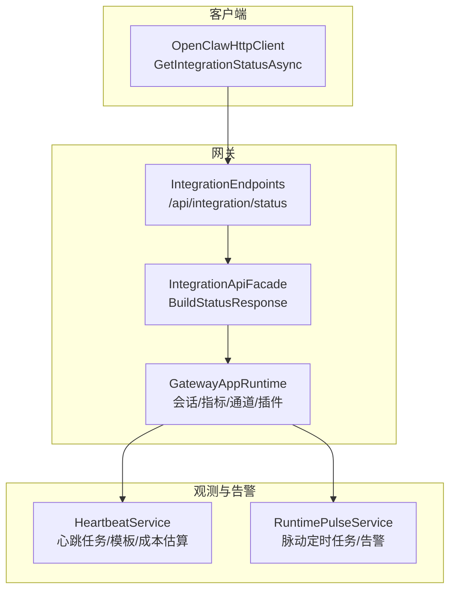
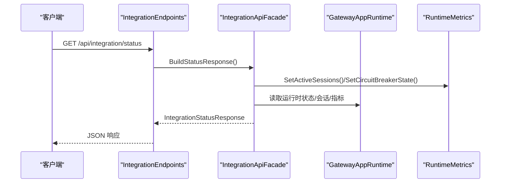
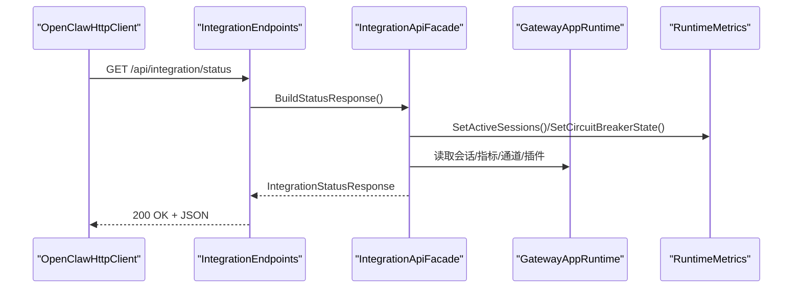
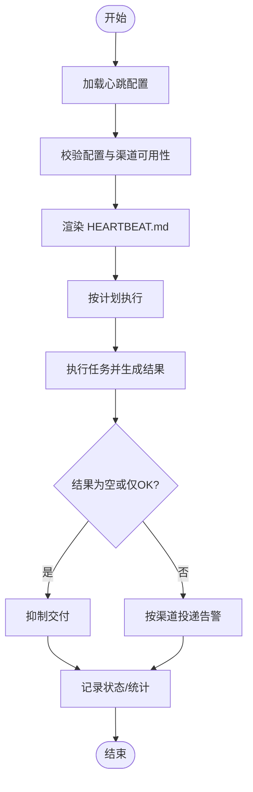
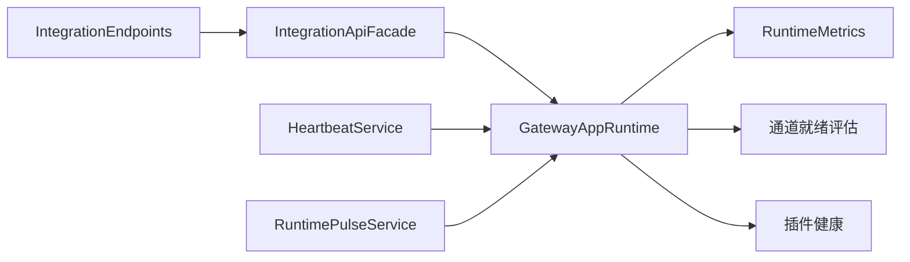

# 状态监控

<cite>
**本文引用的文件**
- [IntegrationApiModels.cs](file://src/OpenClaw.Core/Models/IntegrationApiModels.cs)
- [IntegrationApiFacade.cs](file://src/OpenClaw.Gateway/Composition/IntegrationApiFacade.cs)
- [IntegrationEndpoints.cs](file://src/OpenClaw.Gateway/Endpoints/IntegrationEndpoints.cs)
- [RuntimeMetrics.cs](file://src/OpenClaw.Core/Observability/RuntimeMetrics.cs)
- [HeartbeatService.cs](file://src/OpenClaw.Gateway/HeartbeatService.cs)
- [RuntimePulseService.cs](file://src/OpenClaw.Gateway/RuntimePulseService.cs)
- [PulseModels.cs](file://src/OpenClaw.Core/Models/PulseModels.cs)
- [HeartbeatModels.cs](file://src/OpenClaw.Core/Models/HeartbeatModels.cs)
- [AdminObservabilityService.cs](file://src/OpenClaw.Gateway/AdminObservabilityService.cs)
- [GatewayAdminEndpointTests.cs](file://src/OpenClaw.Tests/GatewayAdminEndpointTests.cs)
- [OpenClawHttpClient.cs](file://src/OpenClaw.Client/OpenClawHttpClient.cs)
</cite>

## 目录
1. [简介](#简介)
2. [项目结构](#项目结构)
3. [核心组件](#核心组件)
4. [架构总览](#架构总览)
5. [详细组件分析](#详细组件分析)
6. [依赖关系分析](#依赖关系分析)
7. [性能考量](#性能考量)
8. [故障排查指南](#故障排查指南)
9. [结论](#结论)
10. [附录：使用示例与最佳实践](#附录使用示例与最佳实践)

## 简介
本文件聚焦于状态监控 API 的技术实现与使用方法，围绕 GetIntegrationStatusAsync 方法展开，系统性阐述以下能力：
- 系统健康检查（HealthResponse）
- 组件状态查询（运行时模式、通道就绪度、插件健康）
- 性能指标采集（RuntimeMetrics 快照）
- 告警通知（心跳/脉动服务的告警与可见性控制）
- 数据结构、更新频率、缓存策略与异常处理机制
- 实战用法：自定义监控面板、阈值告警、第三方监控工具集成

## 项目结构
状态监控 API 位于网关层，通过集成端点暴露统一的 /api/integration/status 接口；后端由网关运行时聚合会话、指标、通道与插件健康等信息，并通过 Facade 聚合输出。

图示来源
- [IntegrationEndpoints.cs:33-40](file://src/OpenClaw.Gateway/Endpoints/IntegrationEndpoints.cs#L33-L40)
- [IntegrationApiFacade.cs:89-103](file://src/OpenClaw.Gateway/Composition/IntegrationApiFacade.cs#L89-L103)
- [HeartbeatService.cs:14-135](file://src/OpenClaw.Gateway/HeartbeatService.cs#L14-L135)
- [RuntimePulseService.cs:16-59](file://src/OpenClaw.Gateway/RuntimePulseService.cs#L16-L59)

章节来源
- [IntegrationEndpoints.cs:33-40](file://src/OpenClaw.Gateway/Endpoints/IntegrationEndpoints.cs#L33-L40)
- [IntegrationApiFacade.cs:89-103](file://src/OpenClaw.Gateway/Composition/IntegrationApiFacade.cs#L89-L103)

## 核心组件
- 状态响应模型：IntegrationStatusResponse
  - 包含健康状态、运行时状态、指标快照、活动会话数、待审批数、活跃审批授权数
- 网关 Facade：BuildStatusResponse
  - 聚合运行时状态、指标快照、会话计数、审批状态
- 运行时指标：RuntimeMetrics
  - 计数器与仪表盘指标（如活跃会话、电路断路器状态）
- 健康检查与告警：HeartbeatService、RuntimePulseService
  - 心跳任务模板与验证、脉动定时任务与告警记录

章节来源
- [IntegrationApiModels.cs:3-11](file://src/OpenClaw.Core/Models/IntegrationApiModels.cs#L3-L11)
- [IntegrationApiFacade.cs:89-103](file://src/OpenClaw.Gateway/Composition/IntegrationApiFacade.cs#L89-L103)
- [RuntimeMetrics.cs:34-65](file://src/OpenClaw.Core/Observability/RuntimeMetrics.cs#L34-L65)
- [HeartbeatService.cs:14-135](file://src/OpenClaw.Gateway/HeartbeatService.cs#L14-L135)
- [RuntimePulseService.cs:16-59](file://src/OpenClaw.Gateway/RuntimePulseService.cs#L16-L59)

## 架构总览
状态监控 API 的调用链路如下：

图示来源
- [IntegrationEndpoints.cs:33-40](file://src/OpenClaw.Gateway/Endpoints/IntegrationEndpoints.cs#L33-L40)
- [IntegrationApiFacade.cs:89-103](file://src/OpenClaw.Gateway/Composition/IntegrationApiFacade.cs#L89-L103)
- [RuntimeMetrics.cs:34-65](file://src/OpenClaw.Core/Observability/RuntimeMetrics.cs#L34-L65)

## 详细组件分析

### GetIntegrationStatusAsync 的实现与数据流
- 客户端调用
  - OpenClawHttpClient 提供 GetIntegrationStatusAsync 方法封装 HTTP 请求
- 网关端点
  - IntegrationEndpoints 将请求路由到 BuildStatusResponse
- Facade 聚合
  - 设置活跃会话数与电路断路器状态
  - 生成健康状态、运行时状态、指标快照、审批与授权统计
- 返回模型
  - IntegrationStatusResponse 字段完整覆盖健康、运行时、指标与治理状态

图示来源
- [OpenClawHttpClient.cs:325-326](file://src/OpenClaw.Client/OpenClawHttpClient.cs#L325-L326)
- [IntegrationEndpoints.cs:33-40](file://src/OpenClaw.Gateway/Endpoints/IntegrationEndpoints.cs#L33-L40)
- [IntegrationApiFacade.cs:89-103](file://src/OpenClaw.Gateway/Composition/IntegrationApiFacade.cs#L89-L103)

章节来源
- [OpenClawHttpClient.cs:325-326](file://src/OpenClaw.Client/OpenClawHttpClient.cs#L325-L326)
- [IntegrationEndpoints.cs:33-40](file://src/OpenClaw.Gateway/Endpoints/IntegrationEndpoints.cs#L33-L40)
- [IntegrationApiFacade.cs:89-103](file://src/OpenClaw.Gateway/Composition/IntegrationApiFacade.cs#L89-L103)

### 数据结构与字段说明
- IntegrationStatusResponse
  - Health：健康状态与启动时间
  - Runtime：运行时模式与动态代码支持
  - Metrics：指标快照（计数器与仪表）
  - ActiveSessions：当前活跃会话数
  - PendingApprovals：待审批数量
  - ActiveApprovalGrants：活跃审批授权数
- 指标快照（Metrics）
  - 计数器：请求、LLM 调用、令牌、工具调用、失败/超时/重试、审批决策、会话驱逐/容量拒绝、令牌准入拒绝、浏览器取消重置、插件桥重启尝试/失败、沙箱租约创建/复用/恢复
  - 仪表：活跃会话、电路断路器状态
- 运行时状态（GatewayRuntimeState）
  - RequestedMode、EffectiveMode、DynamicCodeSupported

章节来源
- [IntegrationApiModels.cs:3-11](file://src/OpenClaw.Core/Models/IntegrationApiModels.cs#L3-L11)
- [RuntimeMetrics.cs:34-65](file://src/OpenClaw.Core/Observability/RuntimeMetrics.cs#L34-L65)
- [RuntimeModels.cs:20-27](file://src/OpenClaw.Core/Models/RuntimeModels.cs#L20-L27)

### 更新频率与缓存策略
- 更新频率
  - IntegrationStatusResponse 由 Facade 在每次请求时即时构建，不包含持久化缓存
  - 指标快照来自 RuntimeMetrics.Snapshot()，反映最新状态
- 缓存策略
  - Facade 内部未对 BuildStatusResponse 结果进行缓存
  - 心跳与脉动服务在本地文件系统维护配置与状态文件，用于管理任务与告警
- 异常处理
  - 端点层对鉴权失败返回相应错误
  - Facade 层未显式抛出异常，返回结构化错误由上层处理

章节来源
- [IntegrationApiFacade.cs:89-103](file://src/OpenClaw.Gateway/Composition/IntegrationApiFacade.cs#L89-L103)
- [HeartbeatService.cs:142-173](file://src/OpenClaw.Gateway/HeartbeatService.cs#L142-L173)
- [IntegrationEndpoints.cs:33-40](file://src/OpenClaw.Gateway/Endpoints/IntegrationEndpoints.cs#L33-L40)

### 健康检查与告警机制
- 健康检查（HeartbeatService）
  - 支持模板化任务（邮件检查、日历提醒、网站监控、API 健康检查、文件夹监控、自定义）
  - 配置校验、渲染 HEARTBEAT.md、成本估算、交付渠道校验
  - 状态文件记录最近一次运行结果与抑制情况
- 脉动（RuntimePulseService）
  - 基于配置的定时任务，按间隔执行并记录告警/OK/跳过原因
  - 可配置可见性（是否显示OK、是否使用指示器）与主动时段
  - 最近告警列表用于前端展示

图示来源
- [HeartbeatService.cs:175-225](file://src/OpenClaw.Gateway/HeartbeatService.cs#L175-L225)
- [PulseModels.cs:54-71](file://src/OpenClaw.Core/Models/PulseModels.cs#L54-L71)
- [RuntimePulseService.cs:64-120](file://src/OpenClaw.Gateway/RuntimePulseService.cs#L64-L120)

章节来源
- [HeartbeatService.cs:175-225](file://src/OpenClaw.Gateway/HeartbeatService.cs#L175-L225)
- [PulseModels.cs:54-71](file://src/OpenClaw.Core/Models/PulseModels.cs#L54-L71)
- [RuntimePulseService.cs:64-120](file://src/OpenClaw.Gateway/RuntimePulseService.cs#L64-L120)

### 观测与运营摘要（可选）
- AdminObservabilityService
  - 生成运营摘要卡片与指标序列，支持时间窗口与分桶统计
  - 用于仪表板展示总体健康趋势与风险指标

章节来源
- [AdminObservabilityService.cs:117-229](file://src/OpenClaw.Gateway/AdminObservabilityService.cs#L117-L229)

## 依赖关系分析
- 组件耦合
  - IntegrationEndpoints 依赖 IntegrationApiFacade
  - IntegrationApiFacade 依赖 GatewayAppRuntime（会话、指标、通道、插件健康）
  - HeartbeatService 与 RuntimePulseService 独立于状态端点，但共享运行时上下文
- 外部依赖
  - 文件系统用于存储心跳与脉动状态文件
  - 渠道就绪评估用于通道健康判断

图示来源
- [IntegrationEndpoints.cs:13-20](file://src/OpenClaw.Gateway/Endpoints/IntegrationEndpoints.cs#L13-L20)
- [IntegrationApiFacade.cs:11-87](file://src/OpenClaw.Gateway/Composition/IntegrationApiFacade.cs#L11-L87)
- [HeartbeatService.cs:14-135](file://src/OpenClaw.Gateway/HeartbeatService.cs#L14-L135)
- [RuntimePulseService.cs:16-59](file://src/OpenClaw.Gateway/RuntimePulseService.cs#L16-L59)

## 性能考量
- 状态查询为轻量聚合，主要开销来自指标快照与会话计数
- 建议
  - 对高频拉取场景可在客户端侧增加短周期缓存（例如 1-5 秒）
  - 合理设置心跳与脉动间隔，避免过度触发
  - 使用分页与限制查询范围（如最近 N 分钟）以降低事件查询压力

## 故障排查指南
- 常见问题
  - 鉴权失败：端点层返回鉴权错误，请确认访问令牌与作用域
  - 会话/指标异常：检查会话管理器与指标服务状态
  - 心跳/脉动无结果：确认配置文件存在且格式正确，渠道可用
- 定位手段
  - 查看最近告警列表与跳过原因（脉动状态）
  - 校验通道就绪度与插件健康快照
  - 使用测试用例验证 /api/integration/status 返回值

章节来源
- [IntegrationEndpoints.cs:33-40](file://src/OpenClaw.Gateway/Endpoints/IntegrationEndpoints.cs#L33-L40)
- [GatewayAdminEndpointTests.cs:5428-5434](file://src/OpenClaw.Tests/GatewayAdminEndpointTests.cs#L5428-L5434)

## 结论
GetIntegrationStatusAsync 提供了统一、实时的状态视图，结合心跳与脉动机制，形成从“健康检查—性能指标—告警通知”的闭环。通过合理的缓存与阈值策略，可满足生产环境的可观测性需求。

## 附录：使用示例与最佳实践

### 自定义监控面板
- 拉取状态
  - 使用 OpenClawHttpClient.GetIntegrationStatusAsync 获取 IntegrationStatusResponse
  - 解析 ActiveSessions、PendingApprovals、ActiveApprovalGrants、Metrics 等字段
- 可视化建议
  - 活跃会话折线图、审批积压柱状图、指标仪表盘（请求/工具/LLM/令牌）
  - 告警历史与最近告警列表

章节来源
- [OpenClawHttpClient.cs:325-326](file://src/OpenClaw.Client/OpenClawHttpClient.cs#L325-L326)
- [IntegrationApiModels.cs:3-11](file://src/OpenClaw.Core/Models/IntegrationApiModels.cs#L3-L11)

### 设置阈值告警
- 建议阈值
  - ActiveSessions 持续超过 N 分钟高于阈值 → 告警
  - PendingApprovals 持续超过 M 分钟大于阈值 → 告警
  - ProviderErrors/ToolTimeouts/LlmErrors 增长率超过 P% → 告警
  - CircuitBreakerState=Open → 告警
- 执行方式
  - 客户端定时轮询 /api/integration/status 并对比阈值
  - 或订阅脉动最近告警列表（/admin/pulse/events）

章节来源
- [RuntimeMetrics.cs:34-65](file://src/OpenClaw.Core/Observability/RuntimeMetrics.cs#L34-L65)
- [PulseModels.cs:73-78](file://src/OpenClaw.Core/Models/PulseModels.cs#L73-L78)
- [IntegrationEndpoints.cs:236-248](file://src/OpenClaw.Gateway/Endpoints/AdminEndpoints.Runtime.cs#L236-L248)

### 集成第三方监控工具
- Prometheus/Grafana
  - 将 Metrics 快照映射为指标，使用客户端定时抓取
- PagerDuty/企业微信/钉钉
  - 将最近告警列表与脉动状态对接到 Webhook
- ELK/OTel
  - 将运行时事件与脉动事件导出到日志/追踪系统

章节来源
- [IntegrationApiModels.cs:3-11](file://src/OpenClaw.Core/Models/IntegrationApiModels.cs#L3-L11)
- [HeartbeatModels.cs:104-118](file://src/OpenClaw.Core/Models/HeartbeatModels.cs#L104-L118)
- [PulseModels.cs:54-71](file://src/OpenClaw.Core/Models/PulseModels.cs#L54-L71)