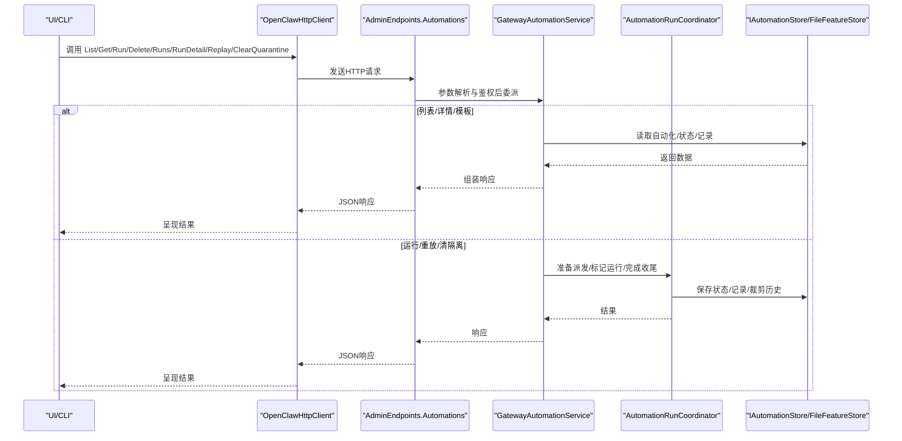
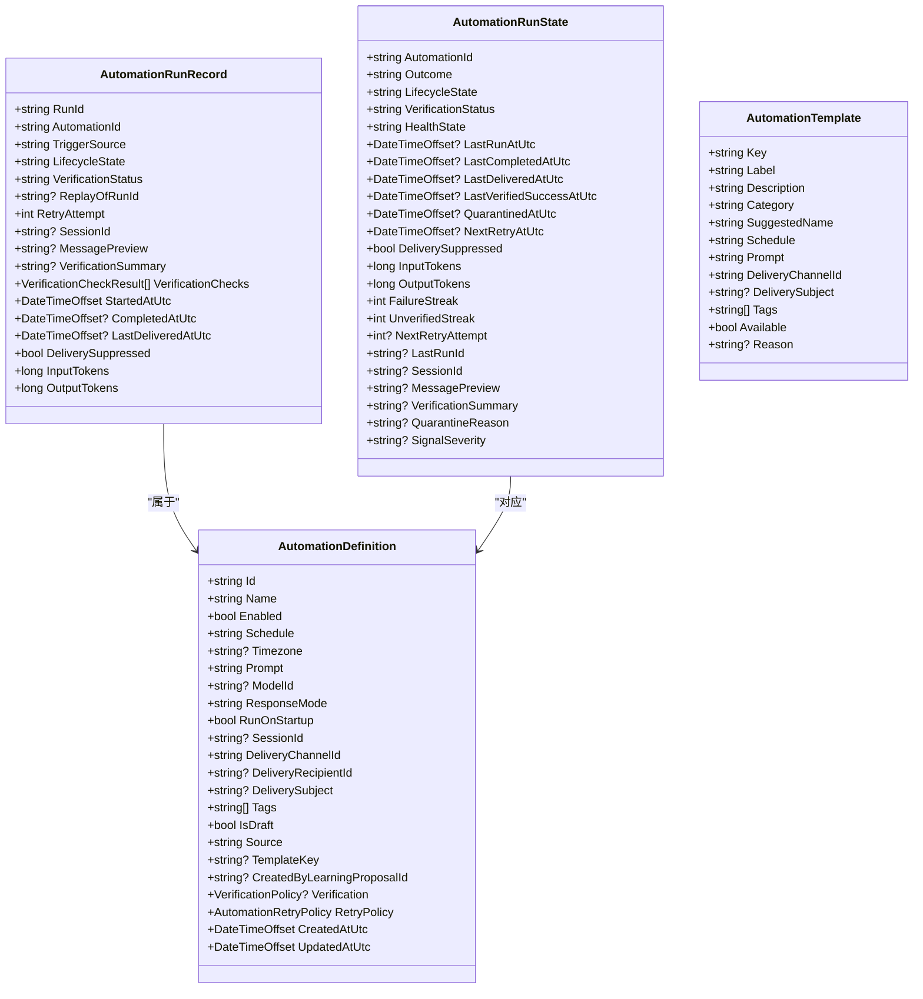
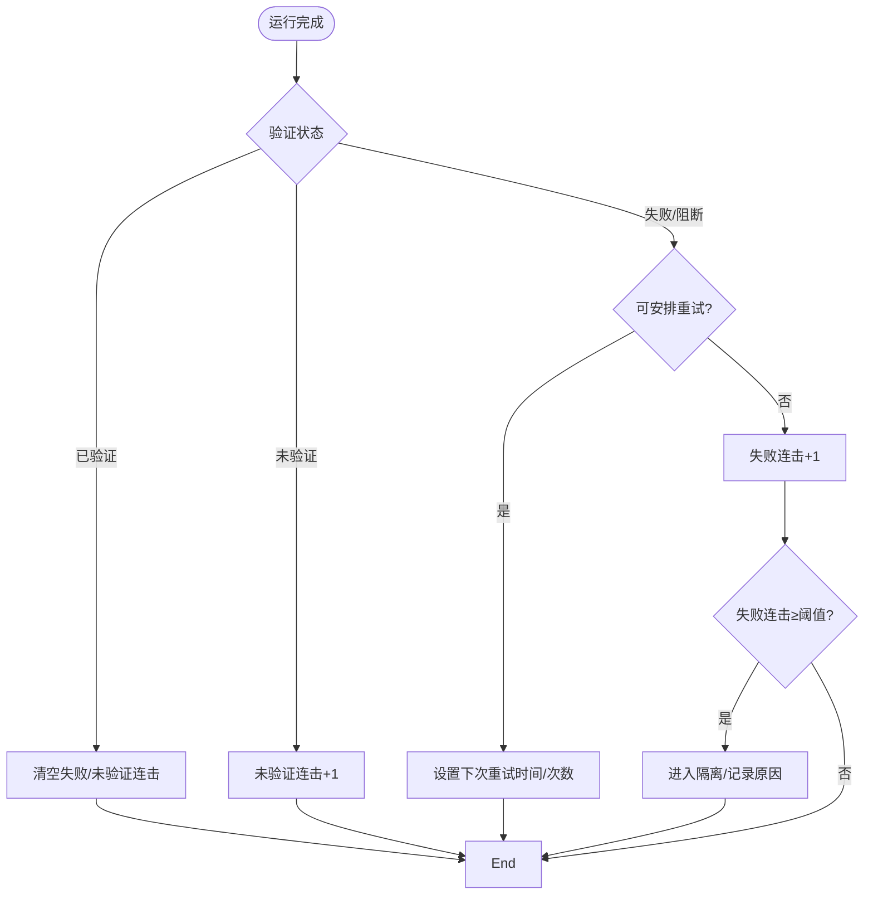
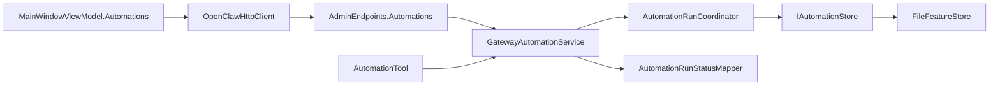

# 自动化管理

<cite>
**本文引用的文件**
- [OpenClawHttpClient.cs](file://src/OpenClaw.Client/OpenClawHttpClient.cs)
- [IAutomationStore.cs](file://src/OpenClaw.Core/Abstractions/IAutomationStore.cs)
- [AutomationModels.cs](file://src/OpenClaw.Core/Models/AutomationModels.cs)
- [AdminEndpoints.Automations.cs](file://src/OpenClaw.Gateway/Endpoints/AdminEndpoints.Automations.cs)
- [GatewayAutomationService.cs](file://src/OpenClaw.Gateway/GatewayAutomationService.cs)
- [AutomationRunCoordinator.cs](file://src/OpenClaw.Gateway/AutomationRunCoordinator.cs)
- [AutomationRunStatusMapper.cs](file://src/OpenClaw.Gateway/AutomationRunStatusMapper.cs)
- [FileFeatureStore.cs](file://src/OpenClaw.Core/Features/FileFeatureStore.cs)
- [MainWindowViewModel.Automations.cs](file://src/OpenClaw.Companion/ViewModels/MainWindowViewModel.Automations.cs)
- [AutomationTool.cs](file://src/OpenClaw.Gateway/Tools/AutomationTool.cs)
</cite>

## 目录
1. [简介](#简介)
2. [项目结构](#项目结构)
3. [核心组件](#核心组件)
4. [架构总览](#架构总览)
5. [详细组件分析](#详细组件分析)
6. [依赖关系分析](#依赖关系分析)
7. [性能考量](#性能考量)
8. [故障排查指南](#故障排查指南)
9. [结论](#结论)
10. [附录：使用示例与最佳实践](#附录使用示例与最佳实践)

## 简介
本文件面向自动化管理 API 的使用者与维护者，系统性阐述以下方法的实现与用法：
- ListAutomationsAsync：列出所有自动化规则（含迁移后的遗留任务）
- ListAutomationTemplatesAsync：列出可用的自动化模板
- GetAutomationAsync：获取单个自动化详情及运行状态
- RunAutomationAsync：手动或试运行触发自动化
- DeleteAutomationAsync：删除自动化
- GetAutomationRunsAsync：获取自动化历史运行记录
- GetAutomationRunAsync：获取某次运行的详细信息
- ReplayAutomationRunAsync：重放某次运行
- ClearAutomationQuarantineAsync：清除自动化隔离状态

文档同时覆盖自动化类型、触发条件、执行策略、健康与验证状态、重试与隔离机制、监控告警等主题，并提供可操作的使用示例与排障建议。

## 项目结构
自动化管理能力由“客户端 SDK → 网关端点 → 服务层 → 协调器 → 存储层”构成，配合工具与仪表盘提供可视化与交互式体验。

```mermaid
graph TB
subgraph "客户端"
C1["OpenClawHttpClient<br/>定义与调用API"]
C2["MainWindowViewModel.Automations<br/>UI绑定与命令"]
end
subgraph "网关"
G1["AdminEndpoints.Automations<br/>HTTP端点映射"]
G2["GatewayAutomationService<br/>业务编排与调度"]
G3["AutomationRunCoordinator<br/>运行生命周期协调"]
G4["AutomationRunStatusMapper<br/>状态归一化与派生"]
G5["AutomationTool<br/>Agent内联工具"]
end
subgraph "存储"
S1["IAutomationStore 接口"]
S2["FileFeatureStore 实现<br/>文件系统持久化"]
end
C1 --> G1
C2 --> C1
G1 --> G2
G2 --> G3
G3 --> S1
S1 --> S2
G2 --> S1
G5 --> G2
```

图示来源
- [OpenClawHttpClient.cs:752-794](file://src/OpenClaw.Client/OpenClawHttpClient.cs#L752-L794)
- [AdminEndpoints.Automations.cs:39-289](file://src/OpenClaw.Gateway/Endpoints/AdminEndpoints.Automations.cs#L39-L289)
- [GatewayAutomationService.cs:49-392](file://src/OpenClaw.Gateway/GatewayAutomationService.cs#L49-L392)
- [AutomationRunCoordinator.cs:26-483](file://src/OpenClaw.Gateway/AutomationRunCoordinator.cs#L26-L483)
- [IAutomationStore.cs:5-17](file://src/OpenClaw.Core/Abstractions/IAutomationStore.cs#L5-L17)
- [FileFeatureStore.cs:41-111](file://src/OpenClaw.Core/Features/FileFeatureStore.cs#L41-L111)
- [MainWindowViewModel.Automations.cs:47-291](file://src/OpenClaw.Companion/ViewModels/MainWindowViewModel.Automations.cs#L47-L291)
- [AutomationTool.cs:48-220](file://src/OpenClaw.Gateway/Tools/AutomationTool.cs#L48-L220)

章节来源
- [OpenClawHttpClient.cs:752-794](file://src/OpenClaw.Client/OpenClawHttpClient.cs#L752-L794)
- [AdminEndpoints.Automations.cs:39-289](file://src/OpenClaw.Gateway/Endpoints/AdminEndpoints.Automations.cs#L39-L289)
- [GatewayAutomationService.cs:49-392](file://src/OpenClaw.Gateway/GatewayAutomationService.cs#L49-L392)
- [AutomationRunCoordinator.cs:26-483](file://src/OpenClaw.Gateway/AutomationRunCoordinator.cs#L26-L483)
- [IAutomationStore.cs:5-17](file://src/OpenClaw.Core/Abstractions/IAutomationStore.cs#L5-L17)
- [FileFeatureStore.cs:41-111](file://src/OpenClaw.Core/Features/FileFeatureStore.cs#L41-L111)
- [MainWindowViewModel.Automations.cs:47-291](file://src/OpenClaw.Companion/ViewModels/MainWindowViewModel.Automations.cs#L47-L291)
- [AutomationTool.cs:48-220](file://src/OpenClaw.Gateway/Tools/AutomationTool.cs#L48-L220)

## 核心组件
- 客户端 SDK：封装 HTTP API，暴露 List、Get、Run、Delete、Runs、RunDetail、Replay、ClearQuarantine 等方法，支持 dry-run 与鉴权头。
- 网关端点：将 HTTP 请求映射到服务层，负责鉴权、参数校验、错误响应与 JSON 序列化。
- 服务层（GatewayAutomationService）：聚合配置、存储与运行协调器，负责自动化生命周期编排、预览、迁移、定时任务构建、运行状态与记录管理。
- 协调器（AutomationRunCoordinator）：负责入站消息派发、运行状态更新、重试与隔离策略、合同验证集成、历史裁剪。
- 存储层（IAutomationStore/FileFeatureStore）：抽象与文件系统实现，提供自动化定义、运行状态、运行记录的持久化与清理。
- 工具（AutomationTool）：在 Agent 执行上下文中提供 list/get/run/replay 等内联能力。
- UI（MainWindowViewModel.Automations）：提供自动化列表、模板、运行记录的可视化与交互式操作入口。

章节来源
- [OpenClawHttpClient.cs:752-794](file://src/OpenClaw.Client/OpenClawHttpClient.cs#L752-L794)
- [AdminEndpoints.Automations.cs:39-289](file://src/OpenClaw.Gateway/Endpoints/AdminEndpoints.Automations.cs#L39-L289)
- [GatewayAutomationService.cs:49-392](file://src/OpenClaw.Gateway/GatewayAutomationService.cs#L49-L392)
- [AutomationRunCoordinator.cs:26-483](file://src/OpenClaw.Gateway/AutomationRunCoordinator.cs#L26-L483)
- [IAutomationStore.cs:5-17](file://src/OpenClaw.Core/Abstractions/IAutomationStore.cs#L5-L17)
- [FileFeatureStore.cs:41-111](file://src/OpenClaw.Core/Features/FileFeatureStore.cs#L41-L111)
- [MainWindowViewModel.Automations.cs:47-291](file://src/OpenClaw.Companion/ViewModels/MainWindowViewModel.Automations.cs#L47-L291)
- [AutomationTool.cs:48-220](file://src/OpenClaw.Gateway/Tools/AutomationTool.cs#L48-L220)

## 架构总览
下图展示从客户端到存储的端到端调用链路与职责分工。

图示来源
- [OpenClawHttpClient.cs:752-794](file://src/OpenClaw.Client/OpenClawHttpClient.cs#L752-L794)
- [AdminEndpoints.Automations.cs:39-289](file://src/OpenClaw.Gateway/Endpoints/AdminEndpoints.Automations.cs#L39-L289)
- [GatewayAutomationService.cs:214-316](file://src/OpenClaw.Gateway/GatewayAutomationService.cs#L214-L316)
- [AutomationRunCoordinator.cs:26-342](file://src/OpenClaw.Gateway/AutomationRunCoordinator.cs#L26-L342)
- [IAutomationStore.cs:5-17](file://src/OpenClaw.Core/Abstractions/IAutomationStore.cs#L5-L17)
- [FileFeatureStore.cs:41-111](file://src/OpenClaw.Core/Features/FileFeatureStore.cs#L41-L111)

## 详细组件分析

### ListAutomationsAsync
- 功能：合并并去重返回所有自动化，包括：
  - 配置中的遗留 Cron 任务
  - 文件存储中的托管自动化
  - 心跳自动化（受 HeartbeatService 驱动）
- 关键行为：
  - 对重复 ID 进行去重与排序
  - 将 Legacy Cron 映射为 AutomationDefinition
  - 心跳自动化独立处理并注入
- 使用场景：仪表盘与 CLI 展示自动化清单；迁移前的全量盘点

章节来源
- [GatewayAutomationService.cs:49-67](file://src/OpenClaw.Gateway/GatewayAutomationService.cs#L49-L67)
- [GatewayAutomationService.cs:603-622](file://src/OpenClaw.Gateway/GatewayAutomationService.cs#L603-L622)
- [GatewayAutomationService.cs:624-642](file://src/OpenClaw.Gateway/GatewayAutomationService.cs#L624-L642)

### ListAutomationTemplatesAsync
- 功能：返回一组内置模板，包含心跳、自定义、收件箱分流、日报、频道治理、事件跟进、仓库整洁等类别
- 用途：创建新自动化时提供快速选择与建议

章节来源
- [GatewayAutomationService.cs:399-493](file://src/OpenClaw.Gateway/GatewayAutomationService.cs#L399-L493)

### GetAutomationAsync
- 功能：按 ID 获取自动化定义与当前运行状态
- 返回内容：自动化对象 + 运行状态（含健康、验证、下次重试等）

章节来源
- [AdminEndpoints.Automations.cs:95-112](file://src/OpenClaw.Gateway/Endpoints/AdminEndpoints.Automations.cs#L95-L112)
- [GatewayAutomationService.cs:69-79](file://src/OpenClaw.Gateway/GatewayAutomationService.cs#L69-L79)
- [GatewayAutomationService.cs:169-182](file://src/OpenClaw.Gateway/GatewayAutomationService.cs#L169-L182)

### RunAutomationAsync
- 功能：触发一次自动化运行（支持 dry-run）
- 流程要点：
  - 端点接收请求并调用服务层
  - 服务层准备派发（生成运行ID、写入队列）
  - 协调器保存状态/记录，标记运行中
  - 执行完成后根据验证结果更新状态与健康度
- 幂等与并发：同一自动化同时仅允许一个运行实例

章节来源
- [OpenClawHttpClient.cs:762-770](file://src/OpenClaw.Client/OpenClawHttpClient.cs#L762-L770)
- [AdminEndpoints.Automations.cs:219-239](file://src/OpenClaw.Gateway/Endpoints/AdminEndpoints.Automations.cs#L219-L239)
- [GatewayAutomationService.cs:214-235](file://src/OpenClaw.Gateway/GatewayAutomationService.cs#L214-L235)
- [AutomationRunCoordinator.cs:26-111](file://src/OpenClaw.Gateway/AutomationRunCoordinator.cs#L26-L111)
- [AutomationRunCoordinator.cs:182-342](file://src/OpenClaw.Gateway/AutomationRunCoordinator.cs#L182-L342)

### DeleteAutomationAsync
- 功能：删除指定自动化及其运行历史目录
- 注意：删除后无法通过 Companion 恢复

章节来源
- [OpenClawHttpClient.cs:772-776](file://src/OpenClaw.Client/OpenClawHttpClient.cs#L772-L776)
- [AdminEndpoints.Automations.cs:267-289](file://src/OpenClaw.Gateway/Endpoints/AdminEndpoints.Automations.cs#L267-L289)
- [FileFeatureStore.cs:50-55](file://src/OpenClaw.Core/Features/FileFeatureStore.cs#L50-L55)

### GetAutomationRunsAsync
- 功能：获取最近若干次运行记录（默认上限）
- 返回：运行ID、触发来源、生命周期状态、验证状态、摘要、时间戳等

章节来源
- [OpenClawHttpClient.cs:778-779](file://src/OpenClaw.Client/OpenClawHttpClient.cs#L778-L779)
- [AdminEndpoints.Automations.cs:114-132](file://src/OpenClaw.Gateway/Endpoints/AdminEndpoints.Automations.cs#L114-L132)
- [GatewayAutomationService.cs:187-190](file://src/OpenClaw.Gateway/GatewayAutomationService.cs#L187-L190)

### GetAutomationRunAsync
- 功能：获取某次运行的详细快照（含会话、验证检查、交付抑制等）

章节来源
- [OpenClawHttpClient.cs:781-782](file://src/OpenClaw.Client/OpenClawHttpClient.cs#L781-L782)
- [AdminEndpoints.Automations.cs:134-157](file://src/OpenClaw.Gateway/Endpoints/AdminEndpoints.Automations.cs#L134-L157)

### ReplayAutomationRunAsync
- 功能：基于某次运行的上下文重放执行
- 场景：调试失败运行、复现问题、验证修复

章节来源
- [OpenClawHttpClient.cs:784-788](file://src/OpenClaw.Client/OpenClawHttpClient.cs#L784-L788)
- [AdminEndpoints.Automations.cs:241-252](file://src/OpenClaw.Gateway/Endpoints/AdminEndpoints.Automations.cs#L241-L252)
- [GatewayAutomationService.cs:237-259](file://src/OpenClaw.Gateway/GatewayAutomationService.cs#L237-L259)

### ClearAutomationQuarantineAsync
- 功能：清除自动化隔离状态，重置失败/未验证计数与隔离原因
- 适用：自动化因连续失败被隔离后，经人工确认可恢复

章节来源
- [OpenClawHttpClient.cs:790-794](file://src/OpenClaw.Client/OpenClawHttpClient.cs#L790-L794)
- [AdminEndpoints.Automations.cs:254-265](file://src/OpenClaw.Gateway/Endpoints/AdminEndpoints.Automations.cs#L254-L265)
- [AutomationRunCoordinator.cs:344-376](file://src/OpenClaw.Gateway/AutomationRunCoordinator.cs#L344-L376)

### 数据模型与状态机
- 自动化定义（AutomationDefinition）：包含标识、名称、启用状态、计划表达式、时区、提示词、模型、响应模式、首次启动、会话、投递通道/收件人/主题、标签、草稿、来源、模板键、学习提案关联、验证策略、重试策略、创建/更新时间等
- 运行状态（AutomationRunState）：包含生命周期、验证状态、健康状态、最近运行/完成/交付/验证成功时间、隔离时间/原因、下次重试时间/次数、输入输出Token、失败/未验证连击、最后运行ID、会话ID、摘要/信号严重级别等
- 运行记录（AutomationRunRecord）：包含触发来源、生命周期、验证状态/摘要/检查、重试次数、会话ID、预览、开始/完成/交付时间、输入输出Token、交付抑制等
- 模板（AutomationTemplate）：模板键、标签、描述、分类、建议名称、计划、提示词、投递通道/主题、标签、可用性与原因
- 触发来源（AutomationRunTriggerSources）：计划、手动、重试、重放、心跳
- 健康状态（AutomationHealthStates）：未知、健康、退化、隔离
- 验证状态（AutomationVerificationStatuses）：未运行、已验证、未验证、失败、阻断
- 信号严重级别（AutomationSignalSeverities）：告警、错误

图示来源
- [AutomationModels.cs:57-81](file://src/OpenClaw.Core/Models/AutomationModels.cs#L57-L81)
- [AutomationModels.cs:83-108](file://src/OpenClaw.Core/Models/AutomationModels.cs#L83-L108)
- [AutomationModels.cs:110-129](file://src/OpenClaw.Core/Models/AutomationModels.cs#L110-L129)
- [AutomationModels.cs:131-145](file://src/OpenClaw.Core/Models/AutomationModels.cs#L131-L145)

章节来源
- [AutomationModels.cs:3-167](file://src/OpenClaw.Core/Models/AutomationModels.cs#L3-L167)

### 执行策略与重试/隔离
- 重试策略：可配置启用与最大重试次数；按指数回退计算下次重试时间
- 隔离策略：连续失败达到阈值后进入隔离，阻止计划/重试触发；可通过清隔离解除
- 健康状态：根据生命周期、验证状态与隔离状态综合判定
- 验证集成：可对接合同治理服务进行自动验证与检查

图示来源
- [AutomationRunCoordinator.cs:218-259](file://src/OpenClaw.Gateway/AutomationRunCoordinator.cs#L218-L259)
- [AutomationRunCoordinator.cs:439-454](file://src/OpenClaw.Gateway/AutomationRunCoordinator.cs#L439-L454)
- [AutomationRunCoordinator.cs:344-376](file://src/OpenClaw.Gateway/AutomationRunCoordinator.cs#L344-L376)
- [AutomationRunStatusMapper.cs:116-135](file://src/OpenClaw.Gateway/AutomationRunStatusMapper.cs#L116-L135)

章节来源
- [AutomationRunCoordinator.cs:218-259](file://src/OpenClaw.Gateway/AutomationRunCoordinator.cs#L218-L259)
- [AutomationRunCoordinator.cs:344-376](file://src/OpenClaw.Gateway/AutomationRunCoordinator.cs#L344-L376)
- [AutomationRunCoordinator.cs:439-454](file://src/OpenClaw.Gateway/AutomationRunCoordinator.cs#L439-L454)
- [AutomationRunStatusMapper.cs:116-135](file://src/OpenClaw.Gateway/AutomationRunStatusMapper.cs#L116-L135)

### 监控告警
- 心跳自动化：特殊 ID，其 Outcome 与信号严重级别用于派生健康状态与告警
- 运行卡住检测：若运行超过阈值未完成，标记为 Stuck 并更新状态
- 仪表盘与可观测性：失败计数、Provider 错误、死信等指标可用于运营面板

章节来源
- [GatewayAutomationService.cs:22-31](file://src/OpenClaw.Gateway/GatewayAutomationService.cs#L22-L31)
- [AutomationRunStatusMapper.cs:91-114](file://src/OpenClaw.Gateway/AutomationRunStatusMapper.cs#L91-L114)
- [AutomationRunCoordinator.cs:378-437](file://src/OpenClaw.Gateway/AutomationRunCoordinator.cs#L378-L437)

## 依赖关系分析
- 客户端依赖网关端点；端点依赖服务层；服务层依赖协调器与存储；协调器依赖存储与合同治理；存储由接口与文件系统实现组成
- UI 通过客户端发起请求，服务层与协调器负责业务逻辑与状态持久化

图示来源
- [OpenClawHttpClient.cs:752-794](file://src/OpenClaw.Client/OpenClawHttpClient.cs#L752-L794)
- [AdminEndpoints.Automations.cs:39-289](file://src/OpenClaw.Gateway/Endpoints/AdminEndpoints.Automations.cs#L39-L289)
- [GatewayAutomationService.cs:49-392](file://src/OpenClaw.Gateway/GatewayAutomationService.cs#L49-L392)
- [AutomationRunCoordinator.cs:26-483](file://src/OpenClaw.Gateway/AutomationRunCoordinator.cs#L26-L483)
- [IAutomationStore.cs:5-17](file://src/OpenClaw.Core/Abstractions/IAutomationStore.cs#L5-L17)
- [FileFeatureStore.cs:41-111](file://src/OpenClaw.Core/Features/FileFeatureStore.cs#L41-L111)
- [MainWindowViewModel.Automations.cs:47-291](file://src/OpenClaw.Companion/ViewModels/MainWindowViewModel.Automations.cs#L47-L291)
- [AutomationTool.cs:48-220](file://src/OpenClaw.Gateway/Tools/AutomationTool.cs#L48-L220)

章节来源
- [OpenClawHttpClient.cs:752-794](file://src/OpenClaw.Client/OpenClawHttpClient.cs#L752-L794)
- [AdminEndpoints.Automations.cs:39-289](file://src/OpenClaw.Gateway/Endpoints/AdminEndpoints.Automations.cs#L39-L289)
- [GatewayAutomationService.cs:49-392](file://src/OpenClaw.Gateway/GatewayAutomationService.cs#L49-L392)
- [AutomationRunCoordinator.cs:26-483](file://src/OpenClaw.Gateway/AutomationRunCoordinator.cs#L26-L483)
- [IAutomationStore.cs:5-17](file://src/OpenClaw.Core/Abstractions/IAutomationStore.cs#L5-L17)
- [FileFeatureStore.cs:41-111](file://src/OpenClaw.Core/Features/FileFeatureStore.cs#L41-L111)
- [MainWindowViewModel.Automations.cs:47-291](file://src/OpenClaw.Companion/ViewModels/MainWindowViewModel.Automations.cs#L47-L291)
- [AutomationTool.cs:48-220](file://src/OpenClaw.Gateway/Tools/AutomationTool.cs#L48-L220)

## 性能考量
- 运行历史保留：默认保留固定数量的历史记录，避免无限增长导致 IO 压力
- 并发控制：同一自动化同时仅允许一个运行实例，防止资源争用
- 重试回退：指数回退降低瞬时压力，避免级联失败
- 状态派生：通过状态映射器统一 Outcome/Lifecycle/Health，减少重复计算

章节来源
- [AutomationRunCoordinator.cs:8-10](file://src/OpenClaw.Gateway/AutomationRunCoordinator.cs#L8-L10)
- [GatewayAutomationService.cs:214-235](file://src/OpenClaw.Gateway/GatewayAutomationService.cs#L214-L235)
- [AutomationRunCoordinator.cs:444-454](file://src/OpenClaw.Gateway/AutomationRunCoordinator.cs#L444-L454)
- [AutomationRunCoordinator.cs:344-376](file://src/OpenClaw.Gateway/AutomationRunCoordinator.cs#L344-L376)

## 故障排查指南
- 自动化未运行
  - 检查是否被隔离（QuarantinedAtUtc 是否为空）
  - 查看 NextRetryAtUtc 是否在未来，等待重试
  - 确认 Enabled 与 Schedule 正常
- 运行卡住
  - 若运行状态长时间为 Running 且超阈值，系统会标记为 Stuck
- 连续失败导致隔离
  - 失败连击达到阈值后进入隔离；使用清隔离接口恢复
- 验证失败
  - 检查验证策略与检查项；必要时人工干预
- 历史记录缺失
  - 确认历史保留策略与裁剪逻辑；检查存储路径是否存在

章节来源
- [AutomationRunCoordinator.cs:242-249](file://src/OpenClaw.Gateway/AutomationRunCoordinator.cs#L242-L249)
- [AutomationRunCoordinator.cs:378-437](file://src/OpenClaw.Gateway/AutomationRunCoordinator.cs#L378-L437)
- [AutomationRunCoordinator.cs:344-376](file://src/OpenClaw.Gateway/AutomationRunCoordinator.cs#L344-L376)
- [FileFeatureStore.cs:94-111](file://src/OpenClaw.Core/Features/FileFeatureStore.cs#L94-L111)

## 结论
该自动化管理子系统以清晰的分层设计实现了从定义、调度、执行、验证到监控的全生命周期管理。通过模板化与预览能力降低上手门槛，通过重试与隔离策略提升鲁棒性，通过状态映射与健康度评估提供可观测性。结合 UI 与工具，既满足日常运维，也支持深度定制与扩展。

## 附录：使用示例与最佳实践

- 管理自动化规则
  - 列出自动化与模板：调用 ListAutomationsAsync 与 ListAutomationTemplatesAsync
  - 新建/更新自动化：先 BuildPreview 校验，再 SaveAutomationAsync
  - 删除自动化：DeleteAutomationAsync（谨慎操作）
  - 参考路径
    - [OpenClawHttpClient.cs:752-794](file://src/OpenClaw.Client/OpenClawHttpClient.cs#L752-L794)
    - [AdminEndpoints.Automations.cs:53-74](file://src/OpenClaw.Gateway/Endpoints/AdminEndpoints.Automations.cs#L53-L74)
    - [GatewayAutomationService.cs:399-493](file://src/OpenClaw.Gateway/GatewayAutomationService.cs#L399-L493)
    - [GatewayAutomationService.cs:81-116](file://src/OpenClaw.Gateway/GatewayAutomationService.cs#L81-L116)

- 执行自动化任务
  - 手动运行：RunAutomationAsync(dryRun=false)
  - 试运行：RunAutomationAsync(dryRun=true)
  - 重放上次运行：ReplayAutomationRunAsync
  - 参考路径
    - [OpenClawHttpClient.cs:762-788](file://src/OpenClaw.Client/OpenClawHttpClient.cs#L762-L788)
    - [AdminEndpoints.Automations.cs:219-252](file://src/OpenClaw.Gateway/Endpoints/AdminEndpoints.Automations.cs#L219-L252)
    - [GatewayAutomationService.cs:214-259](file://src/OpenClaw.Gateway/GatewayAutomationService.cs#L214-L259)

- 分析执行结果
  - 获取运行记录：GetAutomationRunsAsync
  - 获取单次运行详情：GetAutomationRunAsync
  - 参考路径
    - [OpenClawHttpClient.cs:778-782](file://src/OpenClaw.Client/OpenClawHttpClient.cs#L778-L782)
    - [AdminEndpoints.Automations.cs:114-157](file://src/OpenClaw.Gateway/Endpoints/AdminEndpoints.Automations.cs#L114-L157)

- 清除隔离与恢复
  - ClearAutomationQuarantineAsync
  - 参考路径
    - [OpenClawHttpClient.cs:790-794](file://src/OpenClaw.Client/OpenClawHttpClient.cs#L790-L794)
    - [AdminEndpoints.Automations.cs:254-265](file://src/OpenClaw.Gateway/Endpoints/AdminEndpoints.Automations.cs#L254-L265)
    - [AutomationRunCoordinator.cs:344-376](file://src/OpenClaw.Gateway/AutomationRunCoordinator.cs#L344-L376)

- UI 操作流
  - 加载自动化与模板 → 选择自动化 → 查看详情与运行记录 → 执行运行/重放/清隔离 → 刷新状态
  - 参考路径
    - [MainWindowViewModel.Automations.cs:47-291](file://src/OpenClaw.Companion/ViewModels/MainWindowViewModel.Automations.cs#L47-L291)

- Agent 内联工具
  - 使用 AutomationTool 提供的 list/get/run/replay/clear_quarantine 等动作
  - 参考路径
    - [AutomationTool.cs:48-220](file://src/OpenClaw.Gateway/Tools/AutomationTool.cs#L48-L220)