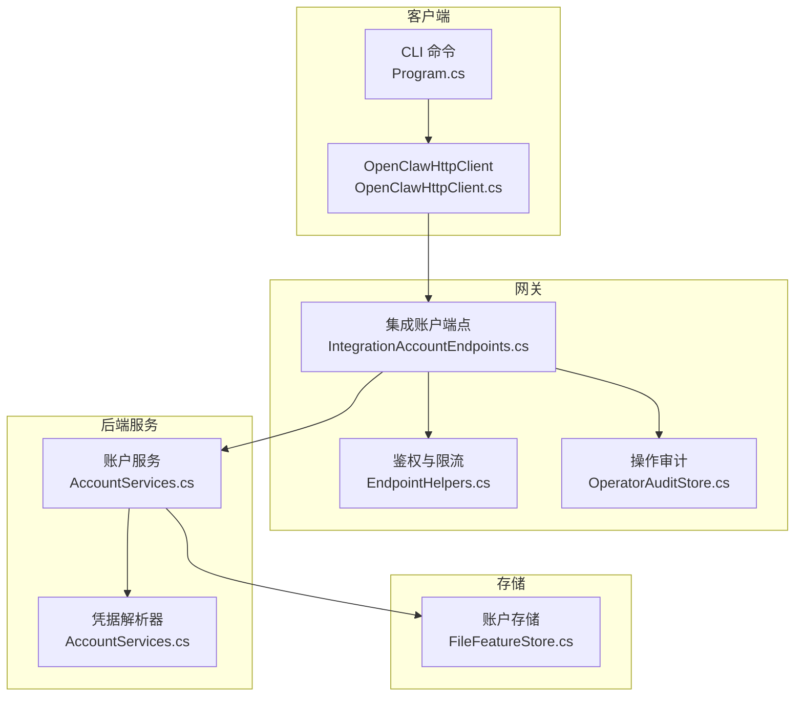
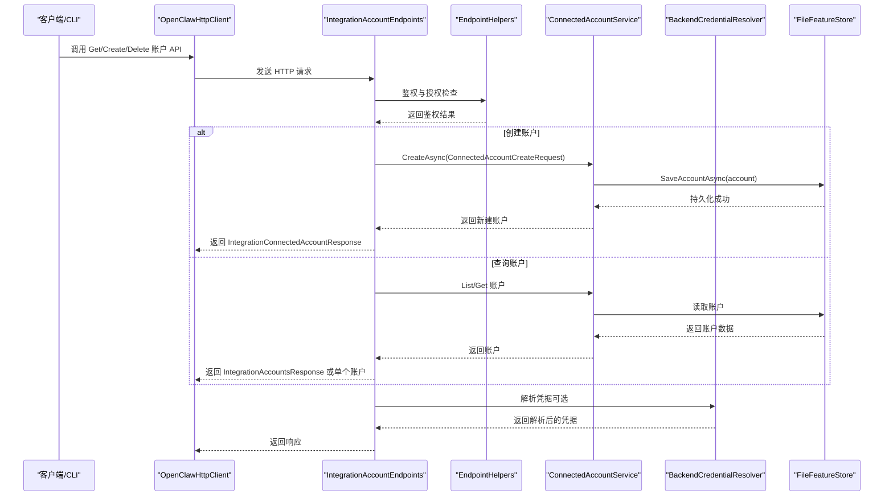
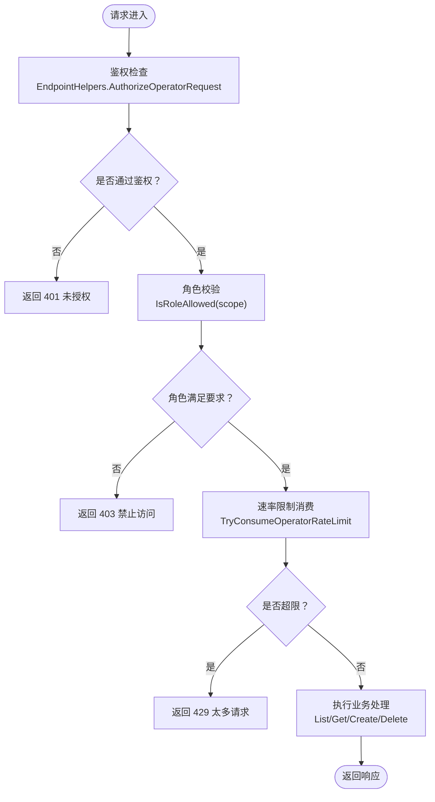
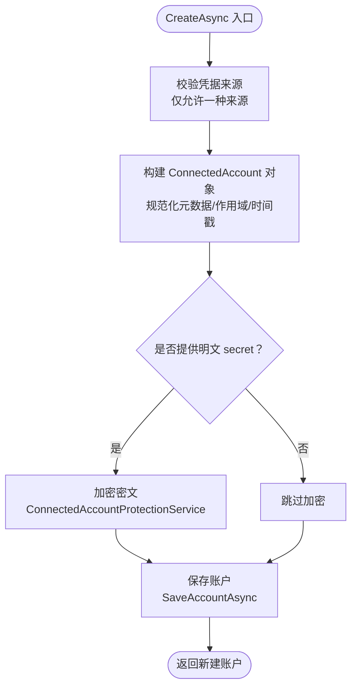
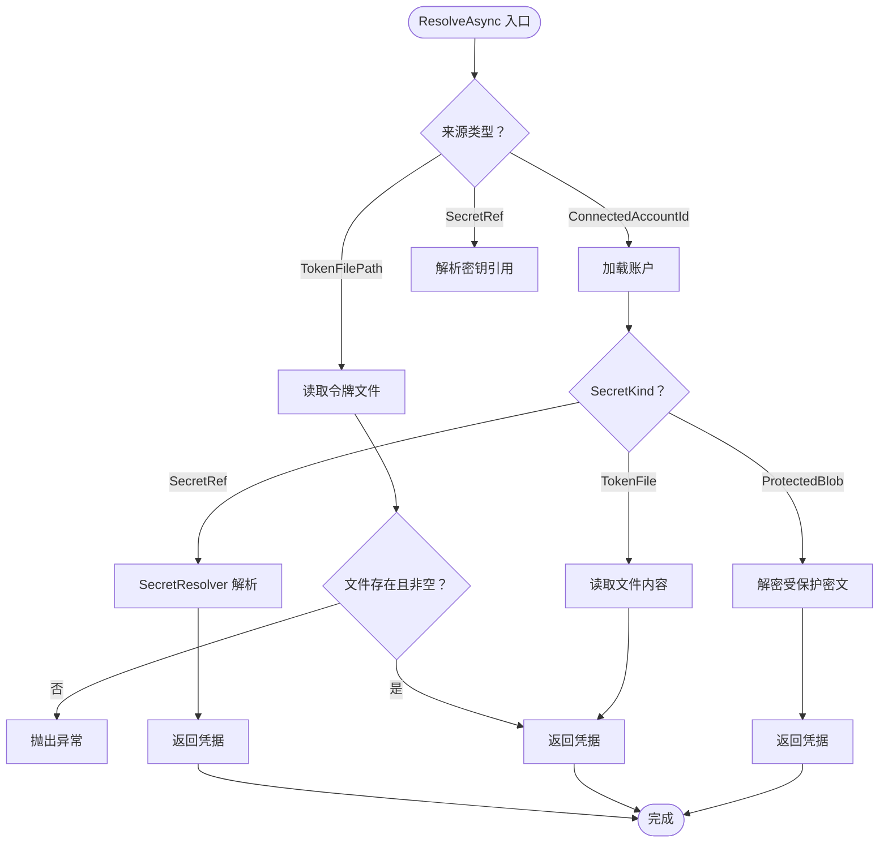
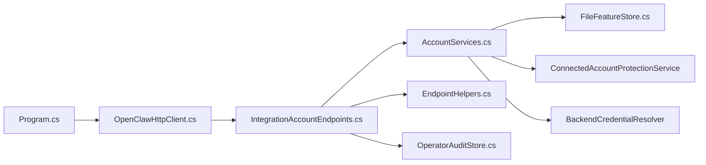

# 账户管理

<cite>
**本文引用的文件**
- [IntegrationAccountEndpoints.cs](file://src/OpenClaw.Gateway/Endpoints/IntegrationAccountEndpoints.cs)
- [AccountServices.cs](file://src/OpenClaw.Gateway/Backends/AccountServices.cs)
- [CodingBackendModels.cs](file://src/OpenClaw.Core/Models/CodingBackendModels.cs)
- [OpenClawHttpClient.cs](file://src/OpenClaw.Client/OpenClawHttpClient.cs)
- [Program.cs](file://src/OpenClaw.Cli/Program.cs)
- [EndpointHelpers.cs](file://src/OpenClaw.Gateway/Endpoints/EndpointHelpers.cs)
- [OperatorAuditStore.cs](file://src/OpenClaw.Gateway/OperatorAuditStore.cs)
- [FileFeatureStore.cs](file://src/OpenClaw.Core/Features/FileFeatureStore.cs)
- [OperatorAccountService.cs](file://src/OpenClaw.Gateway/OperatorAccountService.cs)
- [OperatorGovernanceModels.cs](file://src/OpenClaw.Core/Models/OperatorGovernanceModels.cs)
</cite>

## 目录
1. [简介](#简介)
2. [项目结构](#项目结构)
3. [核心组件](#核心组件)
4. [架构总览](#架构总览)
5. [详细组件分析](#详细组件分析)
6. [依赖关系分析](#依赖关系分析)
7. [性能考虑](#性能考虑)
8. [故障排除指南](#故障排除指南)
9. [结论](#结论)
10. [附录](#附录)

## 简介
本文件面向“账户管理”能力，围绕集成账户（Integration Accounts）的查询、创建与删除等核心 API 进行系统化技术说明。重点覆盖以下方法的实现与使用：GetIntegrationAccountsAsync、GetIntegrationAccountAsync、CreateIntegrationAccountAsync、DeleteIntegrationAccountAsync。内容涵盖账户类型与认证方式、安全策略（权限控制、CSRF、速率限制）、审计日志、以及典型使用场景（外部服务账户管理、凭据配置、账户状态监控）。

## 项目结构
账户管理能力由网关端点、后端服务、客户端封装与存储层共同组成，遵循分层设计：
- 网关端点层：定义 /api/integration/accounts 的 REST 接口，负责鉴权、授权、速率限制与响应封装。
- 后端服务层：提供 ConnectedAccountService 与 BackendCredentialResolver，负责账户生命周期管理与凭据解析。
- 客户端封装层：OpenClawHttpClient 提供对上述接口的调用封装；CLI 中也包含对应的命令行操作。
- 存储层：基于文件系统的 ConnectedAccountStore 实现账户持久化。
- 安全与审计：EndpointHelpers 提供统一鉴权与速率限制；OperatorAuditStore 记录管理员操作审计。

图表来源
- [IntegrationAccountEndpoints.cs:12-84](file://src/OpenClaw.Gateway/Endpoints/IntegrationAccountEndpoints.cs#L12-L84)
- [AccountServices.cs:23-118](file://src/OpenClaw.Gateway/Backends/AccountServices.cs#L23-L118)
- [OpenClawHttpClient.cs:406-426](file://src/OpenClaw.Client/OpenClawHttpClient.cs#L406-L426)
- [Program.cs:1053-1108](file://src/OpenClaw.Cli/Program.cs#L1053-L1108)
- [EndpointHelpers.cs:47-131](file://src/OpenClaw.Gateway/Endpoints/EndpointHelpers.cs#L47-L131)
- [OperatorAuditStore.cs:33-93](file://src/OpenClaw.Gateway/OperatorAuditStore.cs#L33-L93)
- [FileFeatureStore.cs:142-152](file://src/OpenClaw.Core/Features/FileFeatureStore.cs#L142-L152)

章节来源
- [IntegrationAccountEndpoints.cs:12-84](file://src/OpenClaw.Gateway/Endpoints/IntegrationAccountEndpoints.cs#L12-L84)
- [AccountServices.cs:23-118](file://src/OpenClaw.Gateway/Backends/AccountServices.cs#L23-L118)
- [OpenClawHttpClient.cs:406-426](file://src/OpenClaw.Client/OpenClawHttpClient.cs#L406-L426)
- [Program.cs:1053-1108](file://src/OpenClaw.Cli/Program.cs#L1053-L1108)
- [EndpointHelpers.cs:47-131](file://src/OpenClaw.Gateway/Endpoints/EndpointHelpers.cs#L47-L131)
- [OperatorAuditStore.cs:33-93](file://src/OpenClaw.Gateway/OperatorAuditStore.cs#L33-L93)
- [FileFeatureStore.cs:142-152](file://src/OpenClaw.Core/Features/FileFeatureStore.cs#L142-L152)

## 核心组件
- 集成账户端点：提供账户列表、详情、创建、删除的 REST 接口，并内置鉴权、授权与速率限制。
- 账户服务：负责账户创建时的输入校验、凭据加密存储、账户删除与查询。
- 凭据解析器：根据账户类型（密钥引用、受保护密文、令牌文件）解析真实凭据。
- 客户端封装：OpenClawHttpClient 对外暴露 GetIntegrationAccountsAsync、GetIntegrationAccountAsync、CreateIntegrationAccountAsync、DeleteIntegrationAccountAsync 方法。
- 存储实现：基于文件系统保存账户信息，键值编码并序列化为 JSON。
- 审计与安全：EndpointHelpers 统一鉴权与限流；OperatorAuditStore 记录管理员操作链式审计。

章节来源
- [IntegrationAccountEndpoints.cs:21-83](file://src/OpenClaw.Gateway/Endpoints/IntegrationAccountEndpoints.cs#L21-L83)
- [AccountServices.cs:42-96](file://src/OpenClaw.Gateway/Backends/AccountServices.cs#L42-L96)
- [OpenClawHttpClient.cs:406-426](file://src/OpenClaw.Client/OpenClawHttpClient.cs#L406-L426)
- [FileFeatureStore.cs:142-152](file://src/OpenClaw.Core/Features/FileFeatureStore.cs#L142-L152)
- [EndpointHelpers.cs:180-240](file://src/OpenClaw.Gateway/Endpoints/EndpointHelpers.cs#L180-L240)
- [OperatorAuditStore.cs:33-93](file://src/OpenClaw.Gateway/OperatorAuditStore.cs#L33-L93)

## 架构总览
下图展示了从客户端到网关端点、再到后端服务与存储的整体调用链路，以及鉴权与审计的关键节点。

图表来源
- [OpenClawHttpClient.cs:406-426](file://src/OpenClaw.Client/OpenClawHttpClient.cs#L406-L426)
- [IntegrationAccountEndpoints.cs:21-83](file://src/OpenClaw.Gateway/Endpoints/IntegrationAccountEndpoints.cs#L21-L83)
- [AccountServices.cs:36-96](file://src/OpenClaw.Gateway/Backends/AccountServices.cs#L36-L96)
- [FileFeatureStore.cs:142-152](file://src/OpenClaw.Core/Features/FileFeatureStore.cs#L142-L152)
- [EndpointHelpers.cs:180-240](file://src/OpenClaw.Gateway/Endpoints/EndpointHelpers.cs#L180-L240)

## 详细组件分析

### 集成账户端点（IntegrationAccountEndpoints）
- 路由组：/api/integration/accounts
- 支持方法：
  - GET /api/integration/accounts：列出所有账户（返回脱敏后的账户信息）
  - GET /api/integration/accounts/{id}：按 ID 获取账户（返回脱敏后的账户信息）
  - POST /api/integration/accounts：创建账户（需要 CSRF 与权限）
  - DELETE /api/integration/accounts/{id}：删除账户（需要 CSRF 与权限）
- 鉴权与限流：
  - 使用 EndpointHelpers.AuthorizeOperatorRequest 进行统一鉴权
  - 使用 EndpointHelpers.TryConsumeOperatorRateLimit 进行速率限制
  - 不同端点 scope 对应不同所需角色（如 integration.accounts 需要 Admin）

图表来源
- [IntegrationAccountEndpoints.cs:86-115](file://src/OpenClaw.Gateway/Endpoints/IntegrationAccountEndpoints.cs#L86-L115)
- [EndpointHelpers.cs:47-131](file://src/OpenClaw.Gateway/Endpoints/EndpointHelpers.cs#L47-L131)
- [EndpointHelpers.cs:180-240](file://src/OpenClaw.Gateway/Endpoints/EndpointHelpers.cs#L180-L240)

章节来源
- [IntegrationAccountEndpoints.cs:21-83](file://src/OpenClaw.Gateway/Endpoints/IntegrationAccountEndpoints.cs#L21-L83)
- [EndpointHelpers.cs:47-131](file://src/OpenClaw.Gateway/Endpoints/EndpointHelpers.cs#L47-L131)
- [EndpointHelpers.cs:180-240](file://src/OpenClaw.Gateway/Endpoints/EndpointHelpers.cs#L180-L240)

### 账户服务（ConnectedAccountService）
- 列表与查询：ListAsync、GetAsync
- 创建：
  - 输入校验：必须提供 Provider；且仅允许三类凭据来源之一：secretRef、secret、tokenFilePath
  - 凭据加密：当提供明文 secret 时，使用 ConnectedAccountProtectionService 进行加密存储
  - 元数据与作用域：规范化元数据键值，去重作用域
  - 默认启用与时间戳：IsActive 默认 true，创建/更新时间记录
- 删除：DeleteAsync

图表来源
- [AccountServices.cs:42-96](file://src/OpenClaw.Gateway/Backends/AccountServices.cs#L42-L96)
- [AccountServices.cs:98-118](file://src/OpenClaw.Gateway/Backends/AccountServices.cs#L98-L118)

章节来源
- [AccountServices.cs:42-96](file://src/OpenClaw.Gateway/Backends/AccountServices.cs#L42-L96)
- [AccountServices.cs:98-118](file://src/OpenClaw.Gateway/Backends/AccountServices.cs#L98-L118)

### 凭据解析器（BackendCredentialResolver）
- 支持三种来源：
  - SecretRef：通过 SecretResolver 解析密钥引用
  - TokenFile：读取本地文件路径中的令牌
  - ProtectedBlob：解密存储的受保护密文
- 校验逻辑：账户存在、启用、未过期；对应来源文件存在且非空

图表来源
- [AccountServices.cs:146-218](file://src/OpenClaw.Gateway/Backends/AccountServices.cs#L146-L218)
- [AccountServices.cs:220-268](file://src/OpenClaw.Gateway/Backends/AccountServices.cs#L220-L268)

章节来源
- [AccountServices.cs:146-218](file://src/OpenClaw.Gateway/Backends/AccountServices.cs#L146-L218)
- [AccountServices.cs:220-268](file://src/OpenClaw.Gateway/Backends/AccountServices.cs#L220-L268)

### 客户端封装（OpenClawHttpClient）
- 提供四个核心方法：
  - GetIntegrationAccountsAsync：获取账户列表
  - GetIntegrationAccountAsync：按 ID 获取单个账户
  - CreateIntegrationAccountAsync：创建账户
  - DeleteIntegrationAccountAsync：删除账户
- 方法均通过 HTTP 请求发送至 /api/integration/accounts，并进行 JSON 序列化/反序列化。

章节来源
- [OpenClawHttpClient.cs:406-426](file://src/OpenClaw.Client/OpenClawHttpClient.cs#L406-L426)

### CLI 使用（Program.cs）
- 列表：client.GetIntegrationAccountsAsync
- 创建：client.CreateIntegrationAccountAsync
- 删除：client.DeleteIntegrationAccountAsync
- CLI 中对删除失败有明确错误提示与退出码处理

章节来源
- [Program.cs:1053-1108](file://src/OpenClaw.Cli/Program.cs#L1053-L1108)

### 数据模型（CodingBackendModels）
- ConnectedAccount：账户实体，包含 Provider、DisplayName、SecretKind、SecretRef、EncryptedSecretJson、TokenFilePath、Scopes、ExpiresAt、IsActive、Metadata、时间戳等
- ConnectedAccountSecretKind：密钥类型枚举（protected_blob、secret_ref、token_file）
- ConnectedAccountCreateRequest：创建请求体
- IntegrationAccountsResponse/IntegrationConnectedAccountResponse：响应包装对象

章节来源
- [CodingBackendModels.cs:147-182](file://src/OpenClaw.Core/Models/CodingBackendModels.cs#L147-L182)
- [CodingBackendModels.cs:303-314](file://src/OpenClaw.Core/Models/CodingBackendModels.cs#L303-L314)
- [CodingBackendModels.cs:331-339](file://src/OpenClaw.Core/Models/CodingBackendModels.cs#L331-L339)

### 权限控制与安全策略
- 鉴权模式：支持 Bootstrap Token、账户 Token、浏览器会话三种模式，具体启用由组织策略决定
- 角色与端点范围映射：integration.accounts 需要 Admin 角色
- 速率限制：基于账户、浏览器会话或 IP 维度进行限流
- CSRF：创建与删除端点要求 CSRF 校验

章节来源
- [EndpointHelpers.cs:47-131](file://src/OpenClaw.Gateway/Endpoints/EndpointHelpers.cs#L47-L131)
- [EndpointHelpers.cs:242-307](file://src/OpenClaw.Gateway/Endpoints/EndpointHelpers.cs#L242-L307)
- [IntegrationAccountEndpoints.cs:47-83](file://src/OpenClaw.Gateway/Endpoints/IntegrationAccountEndpoints.cs#L47-L83)

### 审计日志
- OperatorAuditStore：以 JSONL 形式记录管理员操作，包含顺序号、哈希链、时间戳、操作者身份、目标与摘要等
- 用于合规与追踪，支持查询与导出

章节来源
- [OperatorAuditStore.cs:33-93](file://src/OpenClaw.Gateway/OperatorAuditStore.cs#L33-L93)
- [OperatorAuditStore.cs:97-125](file://src/OpenClaw.Gateway/OperatorAuditStore.cs#L97-L125)

## 依赖关系分析
- 端点依赖：IntegrationAccountEndpoints 依赖 ConnectedAccountService 与 BrowserSessionAuthService；鉴权依赖 EndpointHelpers；审计依赖 OperatorAuditStore
- 服务依赖：ConnectedAccountService 依赖 IConnectedAccountStore 与 ConnectedAccountProtectionService；凭据解析依赖 SecretResolver 与文件系统
- 客户端依赖：OpenClawHttpClient 依赖 CoreJsonContext 与 HttpClient

图表来源
- [IntegrationAccountEndpoints.cs:17-18](file://src/OpenClaw.Gateway/Endpoints/IntegrationAccountEndpoints.cs#L17-L18)
- [AccountServices.cs:25-34](file://src/OpenClaw.Gateway/Backends/AccountServices.cs#L25-L34)
- [FileFeatureStore.cs:142-152](file://src/OpenClaw.Core/Features/FileFeatureStore.cs#L142-L152)
- [EndpointHelpers.cs:47-131](file://src/OpenClaw.Gateway/Endpoints/EndpointHelpers.cs#L47-L131)
- [OperatorAuditStore.cs:33-93](file://src/OpenClaw.Gateway/OperatorAuditStore.cs#L33-L93)
- [OpenClawHttpClient.cs:406-426](file://src/OpenClaw.Client/OpenClawHttpClient.cs#L406-L426)
- [Program.cs:1053-1108](file://src/OpenClaw.Cli/Program.cs#L1053-L1108)

章节来源
- [IntegrationAccountEndpoints.cs:17-18](file://src/OpenClaw.Gateway/Endpoints/IntegrationAccountEndpoints.cs#L17-L18)
- [AccountServices.cs:25-34](file://src/OpenClaw.Gateway/Backends/AccountServices.cs#L25-L34)
- [FileFeatureStore.cs:142-152](file://src/OpenClaw.Core/Features/FileFeatureStore.cs#L142-L152)
- [EndpointHelpers.cs:47-131](file://src/OpenClaw.Gateway/Endpoints/EndpointHelpers.cs#L47-L131)
- [OperatorAuditStore.cs:33-93](file://src/OpenClaw.Gateway/OperatorAuditStore.cs#L33-L93)
- [OpenClawHttpClient.cs:406-426](file://src/OpenClaw.Client/OpenClawHttpClient.cs#L406-L426)
- [Program.cs:1053-1108](file://src/OpenClaw.Cli/Program.cs#L1053-L1108)

## 性能考虑
- 存储层：文件系统读写在高并发下可能成为瓶颈，建议结合缓存与批量操作优化
- 加解密：受保护密文的加解密为 CPU 密集型，建议在必要时延迟解密或复用已解密结果
- 速率限制：合理设置端点级策略，避免热点账户或会话被限流影响用户体验
- 审计写入：JSONL 写入需注意磁盘 IO，建议异步追加与限流写入

## 故障排除指南
- 400 错误（创建失败）：检查请求体中 Provider 是否为空，或同时提供了多种凭据来源
- 401/403 错误：确认鉴权模式与角色权限；确保组织策略允许当前使用的鉴权方式
- 429 错误：查看速率限制策略，调整调用频率或升级权限
- 404 错误（查询不存在账户）：确认账户 ID 正确
- 文件相关错误：令牌文件不存在或为空，检查 TokenFilePath 与文件权限

章节来源
- [IntegrationAccountEndpoints.cs:51-72](file://src/OpenClaw.Gateway/Endpoints/IntegrationAccountEndpoints.cs#L51-L72)
- [AccountServices.cs:44-55](file://src/OpenClaw.Gateway/Backends/AccountServices.cs#L44-L55)
- [AccountServices.cs:154-163](file://src/OpenClaw.Gateway/Backends/AccountServices.cs#L154-L163)
- [EndpointHelpers.cs:180-240](file://src/OpenClaw.Gateway/Endpoints/EndpointHelpers.cs#L180-L240)

## 结论
集成账户管理通过清晰的端点设计、严格的鉴权与限流机制、完善的凭据解析与存储策略，实现了对外部服务账户的安全、可控与可观测管理。配合审计日志与 CLI 工具，能够满足从开发到生产的多场景需求。

## 附录

### API 定义与使用示例

- 列出账户
  - 客户端调用：[OpenClawHttpClient.cs:406-407](file://src/OpenClaw.Client/OpenClawHttpClient.cs#L406-L407)
  - CLI 示例：[Program.cs:1053-1056](file://src/OpenClaw.Cli/Program.cs#L1053-L1056)

- 获取单个账户
  - 客户端调用：[OpenClawHttpClient.cs:409-410](file://src/OpenClaw.Client/OpenClawHttpClient.cs#L409-L410)
  - 端点实现：[IntegrationAccountEndpoints.cs:32-43](file://src/OpenClaw.Gateway/Endpoints/IntegrationAccountEndpoints.cs#L32-L43)

- 创建账户
  - 客户端调用：[OpenClawHttpClient.cs:412-420](file://src/OpenClaw.Client/OpenClawHttpClient.cs#L412-L420)
  - 端点实现：[IntegrationAccountEndpoints.cs:45-73](file://src/OpenClaw.Gateway/Endpoints/IntegrationAccountEndpoints.cs#L45-L73)
  - CLI 示例：[Program.cs:1078-1094](file://src/OpenClaw.Cli/Program.cs#L1078-L1094)

- 删除账户
  - 客户端调用：[OpenClawHttpClient.cs:422-426](file://src/OpenClaw.Client/OpenClawHttpClient.cs#L422-L426)
  - 端点实现：[IntegrationAccountEndpoints.cs:75-83](file://src/OpenClaw.Gateway/Endpoints/IntegrationAccountEndpoints.cs#L75-L83)
  - CLI 示例：[Program.cs:1096-1108](file://src/OpenClaw.Cli/Program.cs#L1096-L1108)

- 账户类型与认证方式
  - 类型：受保护密文（protected_blob）、密钥引用（secret_ref）、令牌文件（token_file）
  - 参考：[CodingBackendModels.cs:171-176](file://src/OpenClaw.Core/Models/CodingBackendModels.cs#L171-L176)

- 安全策略
  - 鉴权模式：Bootstrap Token、账户 Token、浏览器会话
  - 角色映射：integration.accounts 需要 Admin
  - 速率限制：基于账户、会话或 IP
  - 参考：[EndpointHelpers.cs:47-131](file://src/OpenClaw.Gateway/Endpoints/EndpointHelpers.cs#L47-L131), [EndpointHelpers.cs:242-307](file://src/OpenClaw.Gateway/Endpoints/EndpointHelpers.cs#L242-L307), [EndpointHelpers.cs:180-240](file://src/OpenClaw.Gateway/Endpoints/EndpointHelpers.cs#L180-L240)

- 审计日志
  - 记录字段：顺序号、哈希链、时间戳、操作者身份、目标与摘要
  - 参考：[OperatorAuditStore.cs:33-93](file://src/OpenClaw.Gateway/OperatorAuditStore.cs#L33-L93)