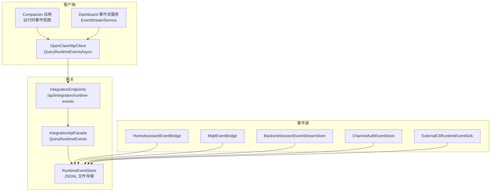
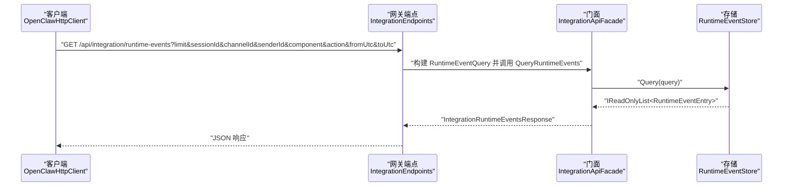
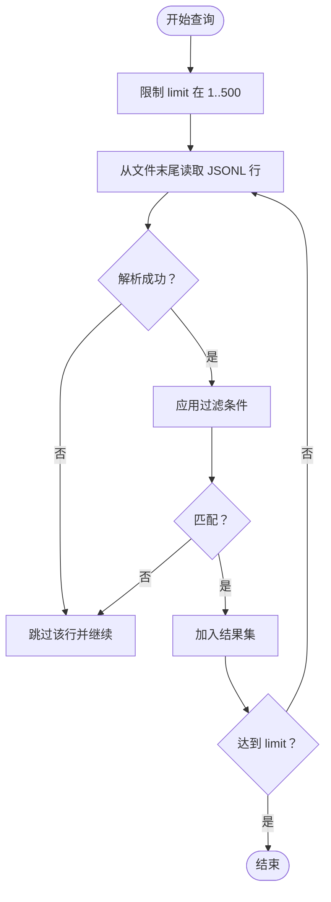
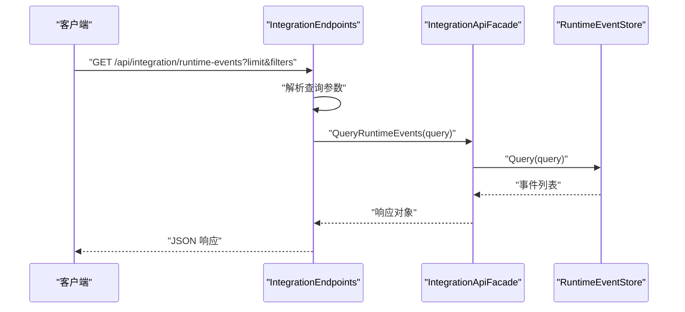
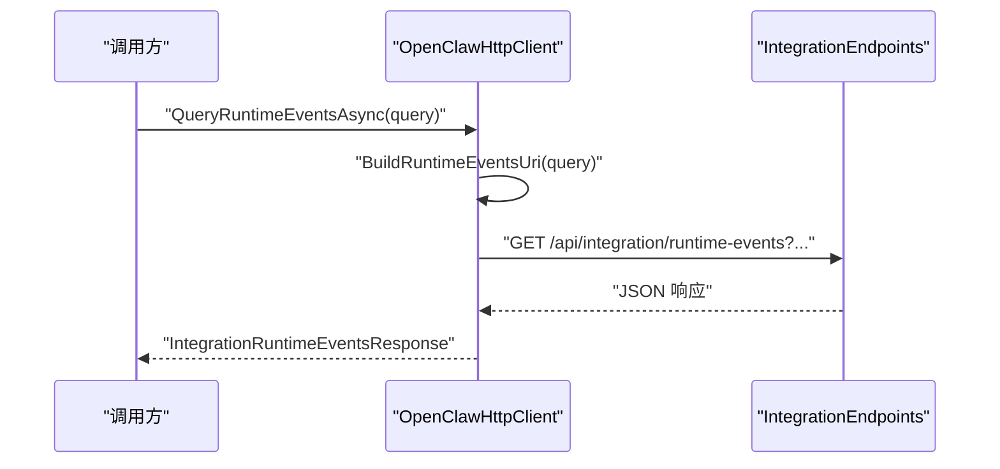
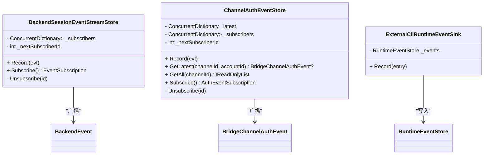
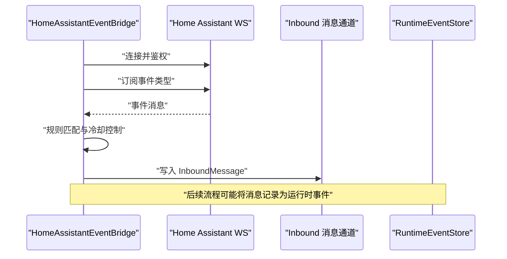
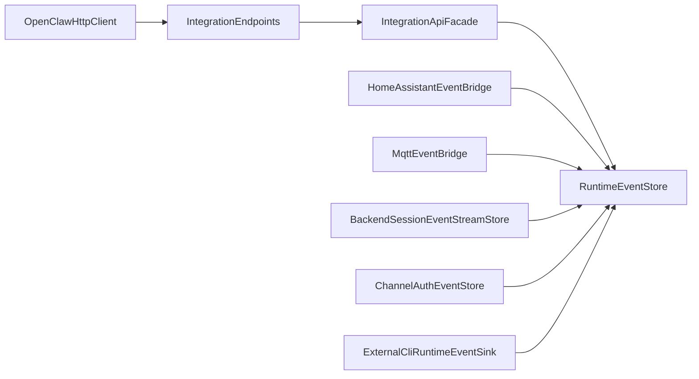

# 运行时事件管理

<cite>
**本文档引用的文件**
- [RuntimeEventStore.cs](file://src/OpenClaw.Gateway/RuntimeEventStore.cs)
- [IntegrationEndpoints.cs](file://src/OpenClaw.Gateway/Endpoints/IntegrationEndpoints.cs)
- [OpenClawHttpClient.cs](file://src/OpenClaw.Client/OpenClawHttpClient.cs)
- [BackendSessionEventStreamStore.cs](file://src/OpenClaw.Gateway/Backends/BackendSessionEventStreamStore.cs)
- [ChannelAuthEventStore.cs](file://src/OpenClaw.Gateway/ChannelAuthEventStore.cs)
- [ExternalCliStores.cs](file://src/OpenClaw.Gateway/ExternalCliStores.cs)
- [MainWindowViewModel.RuntimeEvents.cs](file://src/OpenClaw.Companion/ViewModels/MainWindowViewModel.RuntimeEvents.cs)
- [EventStreamService.cs](file://src/OpenClaw.Dashboard/Services/EventStreamService.cs)
- [HomeAssistantEventBridge.cs](file://src/OpenClaw.Agent/Integrations/HomeAssistantEventBridge.cs)
- [MqttEventBridge.cs](file://src/OpenClaw.Agent/Integrations/MqttEventBridge.cs)
</cite>

## 目录
1. [简介](#简介)
2. [项目结构](#项目结构)
3. [核心组件](#核心组件)
4. [架构总览](#架构总览)
5. [详细组件分析](#详细组件分析)
6. [依赖关系分析](#依赖关系分析)
7. [性能考量](#性能考量)
8. [故障排查指南](#故障排查指南)
9. [结论](#结论)
10. [附录：使用示例与最佳实践](#附录使用示例与最佳实践)

## 简介
本文件面向运行时事件管理 API 的使用者与维护者，重点围绕 GetIntegrationRuntimeEventsAsync 方法（在客户端中对应 QueryRuntimeEventsAsync）进行深入技术说明。内容涵盖事件查询、过滤、订阅机制、事件类型与格式、数据存储与检索策略，并提供可操作的使用示例与排障建议。

## 项目结构
运行时事件管理涉及网关端点、客户端 SDK、事件存储与订阅服务、以及外部集成桥接器等多个模块。下图展示了与“运行时事件”直接相关的组件与交互路径：

图表来源
- [IntegrationEndpoints.cs:636-664](file://src/OpenClaw.Gateway/Endpoints/IntegrationEndpoints.cs#L636-L664)
- [OpenClawHttpClient.cs:822-825](file://src/OpenClaw.Client/OpenClawHttpClient.cs#L822-L825)
- [RuntimeEventStore.cs:51-85](file://src/OpenClaw.Gateway/RuntimeEventStore.cs#L51-L85)
- [BackendSessionEventStreamStore.cs:12-28](file://src/OpenClaw.Gateway/Backends/BackendSessionEventStreamStore.cs#L12-L28)
- [ChannelAuthEventStore.cs:20-28](file://src/OpenClaw.Gateway/ChannelAuthEventStore.cs#L20-L28)
- [ExternalCliStores.cs:44-58](file://src/OpenClaw.Gateway/ExternalCliStores.cs#L44-L58)
- [HomeAssistantEventBridge.cs:116-172](file://src/OpenClaw.Agent/Integrations/HomeAssistantEventBridge.cs#L116-L172)
- [MqttEventBridge.cs:105-147](file://src/OpenClaw.Agent/Integrations/MqttEventBridge.cs#L105-L147)

章节来源
- [IntegrationEndpoints.cs:636-664](file://src/OpenClaw.Gateway/Endpoints/IntegrationEndpoints.cs#L636-L664)
- [OpenClawHttpClient.cs:822-825](file://src/OpenClaw.Client/OpenClawHttpClient.cs#L822-L825)
- [RuntimeEventStore.cs:51-85](file://src/OpenClaw.Gateway/RuntimeEventStore.cs#L51-L85)

## 核心组件
- 运行时事件存储（RuntimeEventStore）
  - 基于 JSON Lines 文本文件持久化事件，支持并发安全写入与范围查询。
  - 查询接口按会话、通道、发送方、组件、动作、时间范围进行过滤，限制返回条数上限。
- 网关端点（IntegrationEndpoints）
  - 提供 /api/integration/runtime-events GET 接口，解析查询参数并调用 Facade 执行查询。
- 客户端 SDK（OpenClawHttpClient）
  - 提供 QueryRuntimeEventsAsync 方法，封装 HTTP 请求与响应反序列化。
- 事件订阅与广播
  - 后端会话事件流：BackendSessionEventStreamStore 提供实时事件订阅。
  - 认证事件流：ChannelAuthEventStore 提供通道认证状态的实时广播。
  - 外部 CLI 事件桥接：ExternalCliRuntimeEventSink 将外部 CLI 事件转换为运行时事件并写入存储。
- 外部事件桥接
  - HomeAssistantEventBridge：从 Home Assistant WebSocket 订阅事件，按规则筛选后转为消息。
  - MqttEventBridge：订阅 MQTT 主题，按模板生成消息并注入到会话。

章节来源
- [RuntimeEventStore.cs:51-85](file://src/OpenClaw.Gateway/RuntimeEventStore.cs#L51-L85)
- [IntegrationEndpoints.cs:636-664](file://src/OpenClaw.Gateway/Endpoints/IntegrationEndpoints.cs#L636-L664)
- [OpenClawHttpClient.cs:822-825](file://src/OpenClaw.Client/OpenClawHttpClient.cs#L822-L825)
- [BackendSessionEventStreamStore.cs:12-28](file://src/OpenClaw.Gateway/Backends/BackendSessionEventStreamStore.cs#L12-L28)
- [ChannelAuthEventStore.cs:20-28](file://src/OpenClaw.Gateway/ChannelAuthEventStore.cs#L20-L28)
- [ExternalCliStores.cs:44-58](file://src/OpenClaw.Gateway/ExternalCliStores.cs#L44-L58)
- [HomeAssistantEventBridge.cs:116-172](file://src/OpenClaw.Agent/Integrations/HomeAssistantEventBridge.cs#L116-L172)
- [MqttEventBridge.cs:105-147](file://src/OpenClaw.Agent/Integrations/MqttEventBridge.cs#L105-L147)

## 架构总览
下图展示从客户端发起查询到网关执行查询并返回结果的完整流程，以及事件写入存储的关键路径：

图表来源
- [IntegrationEndpoints.cs:636-664](file://src/OpenClaw.Gateway/Endpoints/IntegrationEndpoints.cs#L636-L664)
- [OpenClawHttpClient.cs:822-825](file://src/OpenClaw.Client/OpenClawHttpClient.cs#L822-L825)
- [RuntimeEventStore.cs:51-85](file://src/OpenClaw.Gateway/RuntimeEventStore.cs#L51-L85)

## 详细组件分析

### 组件一：运行时事件存储（RuntimeEventStore）
- 存储位置与命名
  - 存放于存储根目录下的 admin/runtime-events.jsonl。
- 写入机制
  - 使用文件锁保证并发安全；异常时记录指标与日志。
- 查询机制
  - 通过 JsonlQueryBuffer 从文件末尾向前读取，按 limit 限制返回数量。
  - 支持多维过滤：SessionId、ChannelId、SenderId、Component（忽略大小写）、Action（忽略大小写）、FromUtc、ToUtc。
- 性能特征
  - 顺序扫描+逆序读取，适合增量追加与尾部查询；大文件时注意磁盘 IO。

图表来源
- [RuntimeEventStore.cs:51-85](file://src/OpenClaw.Gateway/RuntimeEventStore.cs#L51-L85)

章节来源
- [RuntimeEventStore.cs:51-85](file://src/OpenClaw.Gateway/RuntimeEventStore.cs#L51-L85)

### 组件二：网关端点与门面（IntegrationEndpoints + Facade）
- 端点映射
  - /api/integration/runtime-events GET 解析查询参数，构造 RuntimeEventQuery。
- 门面职责
  - 调用 RuntimeEventStore.Query 执行查询，返回 IntegrationRuntimeEventsResponse。
- 参数约束
  - limit 默认 100，最大 500；其他字段可选，支持空字符串表示未设置。

图表来源
- [IntegrationEndpoints.cs:636-664](file://src/OpenClaw.Gateway/Endpoints/IntegrationEndpoints.cs#L636-L664)
- [RuntimeEventStore.cs:51-85](file://src/OpenClaw.Gateway/RuntimeEventStore.cs#L51-L85)

章节来源
- [IntegrationEndpoints.cs:636-664](file://src/OpenClaw.Gateway/Endpoints/IntegrationEndpoints.cs#L636-L664)

### 组件三：客户端 SDK（OpenClawHttpClient）
- 方法签名
  - QueryRuntimeEventsAsync(RuntimeEventQuery, CancellationToken) -> Task<IntegrationRuntimeEventsResponse>。
- 实现要点
  - 构建查询 URI（包含 limit 及各过滤参数），发送 GET 请求并反序列化响应。
- 使用建议
  - 限制 limit 在 1..500；合理设置过滤条件以减少响应体大小。

图表来源
- [OpenClawHttpClient.cs:822-825](file://src/OpenClaw.Client/OpenClawHttpClient.cs#L822-L825)
- [IntegrationEndpoints.cs:636-664](file://src/OpenClaw.Gateway/Endpoints/IntegrationEndpoints.cs#L636-L664)

章节来源
- [OpenClawHttpClient.cs:822-825](file://src/OpenClaw.Client/OpenClawHttpClient.cs#L822-L825)

### 组件四：事件订阅与广播
- 后端会话事件流
  - BackendSessionEventStreamStore 维护订阅者集合，Record 时向所有订阅者广播。
  - Subscribe 返回 EventSubscription，内部使用有界通道，满载丢弃最旧项。
- 认证事件流
  - ChannelAuthEventStore 记录每个通道的最新认证事件并广播；支持按通道或账号查询。
- 外部 CLI 事件桥接
  - ExternalCliRuntimeEventSink 将外部 CLI 事件转换为运行时事件条目并写入存储。

图表来源
- [BackendSessionEventStreamStore.cs:7-52](file://src/OpenClaw.Gateway/Backends/BackendSessionEventStreamStore.cs#L7-L52)
- [ChannelAuthEventStore.cs:11-93](file://src/OpenClaw.Gateway/ChannelAuthEventStore.cs#L11-L93)
- [ExternalCliStores.cs:35-59](file://src/OpenClaw.Gateway/ExternalCliStores.cs#L35-L59)

章节来源
- [BackendSessionEventStreamStore.cs:7-52](file://src/OpenClaw.Gateway/Backends/BackendSessionEventStreamStore.cs#L7-L52)
- [ChannelAuthEventStore.cs:11-93](file://src/OpenClaw.Gateway/ChannelAuthEventStore.cs#L11-L93)
- [ExternalCliStores.cs:35-59](file://src/OpenClaw.Gateway/ExternalCliStores.cs#L35-L59)

### 组件五：外部事件桥接（HomeAssistantEventBridge、MqttEventBridge）
- HomeAssistantEventBridge
  - 连接 Home Assistant WebSocket，订阅指定事件类型，按规则筛选与冷却策略生成消息并注入会话。
- MqttEventBridge
  - 订阅 MQTT 主题，按模板渲染文本并注入会话；支持主题通配符与 QoS。
- 共同点
  - 两类桥接器最终都会产生系统级消息，进而可能被记录为运行时事件（取决于系统配置与路由）。

图表来源
- [HomeAssistantEventBridge.cs:116-172](file://src/OpenClaw.Agent/Integrations/HomeAssistantEventBridge.cs#L116-L172)

章节来源
- [HomeAssistantEventBridge.cs:116-172](file://src/OpenClaw.Agent/Integrations/HomeAssistantEventBridge.cs#L116-L172)
- [MqttEventBridge.cs:105-147](file://src/OpenClaw.Agent/Integrations/MqttEventBridge.cs#L105-L147)

## 依赖关系分析
- 客户端依赖网关端点提供统一查询入口。
- 网关端点依赖门面协调业务逻辑，门面再依赖存储层。
- 事件写入路径多样：外部桥接器、后端会话事件流、认证事件、外部 CLI 事件均汇聚至存储层。
- 订阅与广播独立于查询路径，用于实时事件推送。

图表来源
- [OpenClawHttpClient.cs:822-825](file://src/OpenClaw.Client/OpenClawHttpClient.cs#L822-L825)
- [IntegrationEndpoints.cs:636-664](file://src/OpenClaw.Gateway/Endpoints/IntegrationEndpoints.cs#L636-L664)
- [RuntimeEventStore.cs:51-85](file://src/OpenClaw.Gateway/RuntimeEventStore.cs#L51-L85)
- [BackendSessionEventStreamStore.cs:12-28](file://src/OpenClaw.Gateway/Backends/BackendSessionEventStreamStore.cs#L12-L28)
- [ChannelAuthEventStore.cs:20-28](file://src/OpenClaw.Gateway/ChannelAuthEventStore.cs#L20-L28)
- [ExternalCliStores.cs:44-58](file://src/OpenClaw.Gateway/ExternalCliStores.cs#L44-L58)
- [HomeAssistantEventBridge.cs:116-172](file://src/OpenClaw.Agent/Integrations/HomeAssistantEventBridge.cs#L116-L172)
- [MqttEventBridge.cs:105-147](file://src/OpenClaw.Agent/Integrations/MqttEventBridge.cs#L105-L147)

章节来源
- [OpenClawHttpClient.cs:822-825](file://src/OpenClaw.Client/OpenClawHttpClient.cs#L822-L825)
- [IntegrationEndpoints.cs:636-664](file://src/OpenClaw.Gateway/Endpoints/IntegrationEndpoints.cs#L636-L664)
- [RuntimeEventStore.cs:51-85](file://src/OpenClaw.Gateway/RuntimeEventStore.cs#L51-L85)

## 性能考量
- 查询性能
  - 存储采用 JSON Lines 顺序写入，查询通过逆序扫描实现“最近优先”，适合高频写入与尾部查询场景。
  - 建议合理设置 limit 与过滤条件，避免全量扫描。
- 并发与可靠性
  - 写入使用文件锁保护；异常时记录指标与日志，保障系统稳定性。
- 实时订阅
  - 订阅通道为有界队列，满载丢弃最旧项，避免内存膨胀；适用于高吞吐实时事件场景。

[本节为通用性能讨论，不直接分析具体文件]

## 故障排查指南
- 查询无结果
  - 检查过滤参数是否过于严格；确认 limit 是否足够大。
  - 验证时间范围是否正确（fromUtc/toUtc）。
- 写入失败
  - 查看存储路径权限与磁盘空间；关注日志中的警告信息。
- 实时订阅断开
  - 检查订阅通道是否被释放；确认订阅者生命周期管理。
- 外部桥接器异常
  - 关注 Home Assistant 或 MQTT 连接状态与认证信息；检查订阅策略与主题匹配。

章节来源
- [RuntimeEventStore.cs:42-47](file://src/OpenClaw.Gateway/RuntimeEventStore.cs#L42-L47)
- [BackendSessionEventStreamStore.cs:30-34](file://src/OpenClaw.Gateway/Backends/BackendSessionEventStreamStore.cs#L30-L34)
- [ChannelAuthEventStore.cs:67-71](file://src/OpenClaw.Gateway/ChannelAuthEventStore.cs#L67-L71)
- [HomeAssistantEventBridge.cs:32-58](file://src/OpenClaw.Agent/Integrations/HomeAssistantEventBridge.cs#L32-L58)
- [MqttEventBridge.cs:29-56](file://src/OpenClaw.Agent/Integrations/MqttEventBridge.cs#L29-L56)

## 结论
运行时事件管理通过“查询-过滤-订阅”的分层设计，实现了对系统事件的高效记录、检索与实时推送。GetIntegrationRuntimeEventsAsync 提供了简洁一致的查询入口，结合多种事件源与订阅机制，满足从后台任务到外部集成的广泛场景需求。建议在生产环境中合理设置查询参数与订阅缓冲，确保性能与稳定性。

[本节为总结性内容，不直接分析具体文件]

## 附录：使用示例与最佳实践

### 示例一：查询系统事件（Companion 应用）
- 场景描述
  - 在 Companion 中输入过滤条件（会话 ID、通道 ID、组件、动作、时间范围），点击加载按钮触发查询。
- 关键步骤
  - 构造 RuntimeEventQuery（含 limit 与各过滤字段）。
  - 调用 QueryRuntimeEventsAsync 获取 IntegrationRuntimeEventsResponse。
  - 将返回的事件列表映射为 UI 行并展示。
- 注意事项
  - limit 建议不超过 500；时间范围尽量精确以提升性能。

章节来源
- [MainWindowViewModel.RuntimeEvents.cs:52-99](file://src/OpenClaw.Companion/ViewModels/MainWindowViewModel.RuntimeEvents.cs#L52-L99)
- [OpenClawHttpClient.cs:822-825](file://src/OpenClaw.Client/OpenClawHttpClient.cs#L822-L825)

### 示例二：实现事件监听（Dashboard 事件流）
- 场景描述
  - 使用 EventStreamService 订阅服务器推送的事件流，逐条处理事件数据。
- 关键步骤
  - 设置 Accept: text/event-stream 请求头。
  - 逐行解析 event/data 字段，将数据传递给回调函数。
- 注意事项
  - 正确处理连接中断与取消；在 UI 层反馈连接状态。

章节来源
- [EventStreamService.cs:18-123](file://src/OpenClaw.Dashboard/Services/EventStreamService.cs#L18-L123)

### 示例三：事件写入与订阅（后端会话事件）
- 场景描述
  - 后端会话运行时在事件发生时调用 Record，随后通过订阅者通道广播给监听者。
- 关键步骤
  - AppendEventAsync -> Record -> 广播给所有订阅者。
  - 订阅者通过 Subscribe 获取 ChannelReader 流式消费。
- 注意事项
  - 订阅通道为单读者且有界，避免阻塞；及时释放订阅资源。

章节来源
- [BackendSessionEventStreamStore.cs:12-28](file://src/OpenClaw.Gateway/Backends/BackendSessionEventStreamStore.cs#L12-L28)
- [Backends\BackendSessionServices.cs:188-201](file://src/OpenClaw.Gateway/Backends/BackendSessionServices.cs#L188-L201)

### 示例四：外部 CLI 事件桥接
- 场景描述
  - 外部 CLI 触发事件，由 ExternalCliRuntimeEventSink 转换为运行时事件条目并写入存储。
- 关键步骤
  - 记录 ExternalCliRuntimeEvent -> 转换为 RuntimeEventEntry -> Append 到存储。
- 注意事项
  - 确保元数据（Metadata）包含必要上下文信息以便后续查询与分析。

章节来源
- [ExternalCliStores.cs:44-58](file://src/OpenClaw.Gateway/ExternalCliStores.cs#L44-L58)

### 示例五：外部事件桥接（Home Assistant）
- 场景描述
  - 订阅 Home Assistant 事件，按规则筛选并生成消息，注入到会话。
- 关键步骤
  - 连接 WS -> 鉴权 -> 订阅事件类型 -> 处理事件 -> 渲染提示词 -> 写入消息通道。
- 注意事项
  - 合理设置全局与规则级冷却时间，避免重复触发。

章节来源
- [HomeAssistantEventBridge.cs:116-172](file://src/OpenClaw.Agent/Integrations/HomeAssistantEventBridge.cs#L116-L172)

### 示例六：外部事件桥接（MQTT）
- 场景描述
  - 订阅 MQTT 主题，按模板渲染文本并注入到会话。
- 关键步骤
  - 创建客户端 -> 连接 -> 订阅主题 -> 处理消息 -> 渲染模板 -> 写入消息通道。
- 注意事项
  - 主题匹配遵循通配符规则；注意负载大小限制与冷却策略。

章节来源
- [MqttEventBridge.cs:105-147](file://src/OpenClaw.Agent/Integrations/MqttEventBridge.cs#L105-L147)