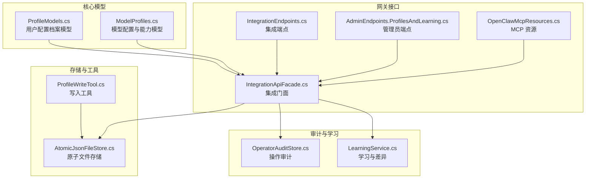
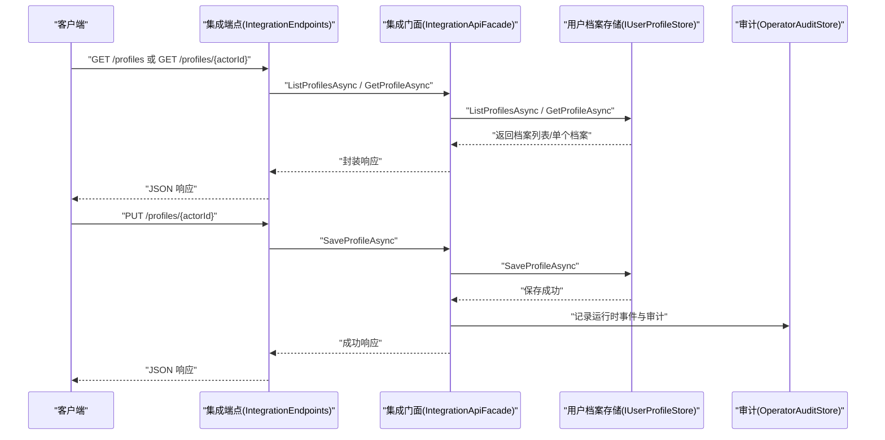
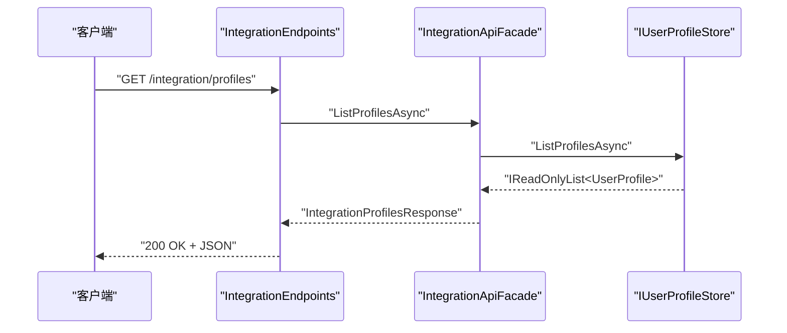
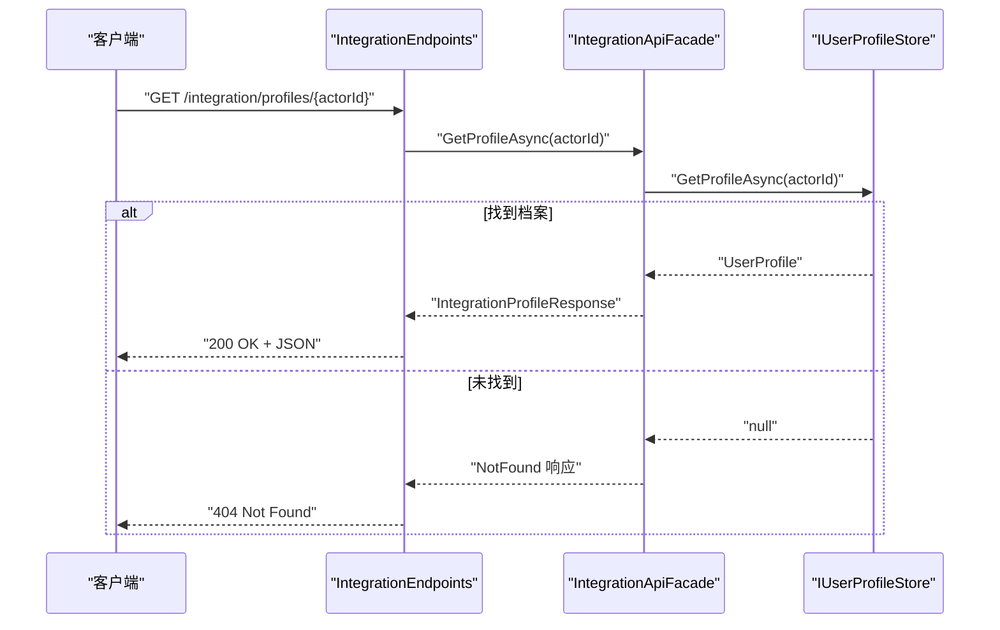
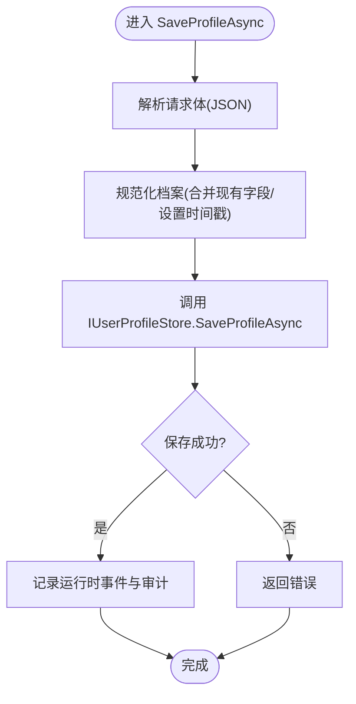
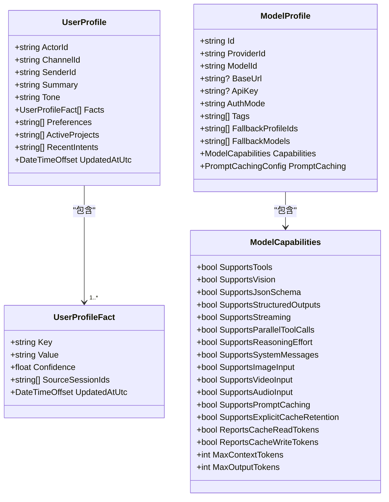
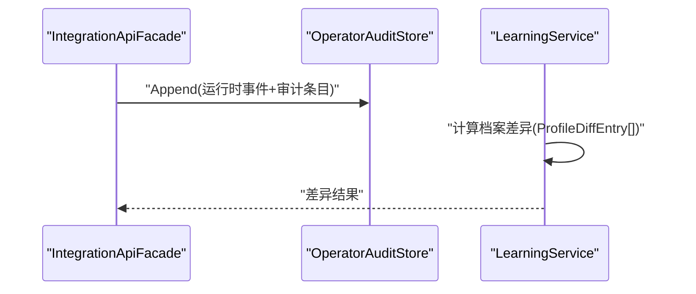
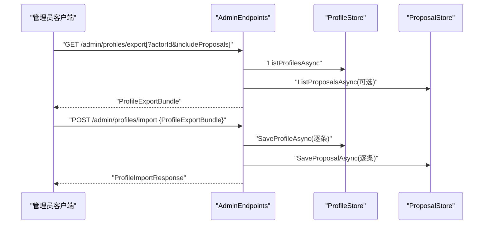
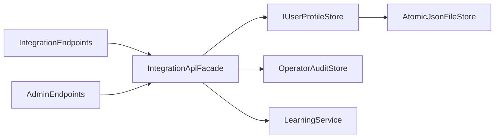

# 配置文件管理

<cite>
**本文引用的文件**
- [ProfileModels.cs](file://src/OpenClaw.Core/Models/ProfileModels.cs)
- [ModelProfiles.cs](file://src/OpenClaw.Core/Models/ModelProfiles.cs)
- [IUserProfileStore.cs](file://src/OpenClaw.Core/Abstractions/IUserProfileStore.cs)
- [AtomicJsonFileStore.cs](file://src/OpenClaw.Gateway/AtomicJsonFileStore.cs)
- [IntegrationEndpoints.cs](file://src/OpenClaw.Gateway/Endpoints/IntegrationEndpoints.cs)
- [AdminEndpoints.ProfilesAndLearning.cs](file://src/OpenClaw.Gateway/Endpoints/AdminEndpoints.ProfilesAndLearning.cs)
- [OpenClawMcpResources.cs](file://src/OpenClaw.Gateway/Mcp/OpenClawMcpResources.cs)
- [IntegrationApiFacade.cs](file://src/OpenClaw.Gateway/Composition/IntegrationApiFacade.cs)
- [ProfileWriteTool.cs](file://src/OpenClaw.Gateway/Tools/ProfileWriteTool.cs)
- [MainWindowViewModel.Profiles.cs](file://src/OpenClaw.Companion/ViewModels/MainWindowViewModel.Profiles.cs)
- [OperatorAuditStore.cs](file://src/OpenClaw.Gateway/OperatorAuditStore.cs)
- [LearningService.cs](file://src/OpenClaw.Gateway/LearningService.cs)
- [GatewayAdminEndpointTests.cs](file://src/OpenClaw.Tests/GatewayAdminEndpointTests.cs)
</cite>

## 目录
1. [简介](#简介)
2. [项目结构](#项目结构)
3. [核心组件](#核心组件)
4. [架构总览](#架构总览)
5. [详细组件分析](#详细组件分析)
6. [依赖关系分析](#依赖关系分析)
7. [性能考量](#性能考量)
8. [故障排查指南](#故障排查指南)
9. [结论](#结论)
10. [附录：使用示例与最佳实践](#附录使用示例与最佳实践)

## 简介
本技术文档围绕“配置文件管理”API展开，重点解释以下方法的实现与使用方式：
- ListProfilesAsync：列出所有用户配置档案
- GetProfileAsync：按 actorId 获取单个用户配置档案
- SaveProfileAsync：保存或更新用户配置档案

文档同时覆盖配置文件的数据结构、权限控制、变更历史记录、备份与恢复（导出/导入）等能力，并提供面向不同场景（用户配置、系统设置、配置模板）的使用示例与最佳实践。

## 项目结构
配置文件管理相关代码分布在多个模块中：
- 核心模型定义位于 OpenClaw.Core，包含用户配置档案、模型配置、学习提案等数据结构
- 网关层提供 HTTP/MCP 接口与工具，负责鉴权、请求解析、调用存储接口
- 原子文件存储用于安全写入与持久化
- 审计与学习服务提供变更审计与差异计算能力

**图表来源**
- [ProfileModels.cs:1-32](file://src/OpenClaw.Core/Models/ProfileModels.cs#L1-L32)
- [ModelProfiles.cs:1-169](file://src/OpenClaw.Core/Models/ModelProfiles.cs#L1-L169)
- [IntegrationEndpoints.cs:252-471](file://src/OpenClaw.Gateway/Endpoints/IntegrationEndpoints.cs#L252-L471)
- [AdminEndpoints.ProfilesAndLearning.cs:40-175](file://src/OpenClaw.Gateway/Endpoints/AdminEndpoints.ProfilesAndLearning.cs#L40-L175)
- [OpenClawMcpResources.cs:87-96](file://src/OpenClaw.Gateway/Mcp/OpenClawMcpResources.cs#L87-L96)
- [IntegrationApiFacade.cs:552-568](file://src/OpenClaw.Gateway/Composition/IntegrationApiFacade.cs#L552-L568)
- [AtomicJsonFileStore.cs:1-89](file://src/OpenClaw.Gateway/AtomicJsonFileStore.cs#L1-L89)
- [ProfileWriteTool.cs:49-75](file://src/OpenClaw.Gateway/Tools/ProfileWriteTool.cs#L49-L75)
- [OperatorAuditStore.cs:38-178](file://src/OpenClaw.Gateway/OperatorAuditStore.cs#L38-L178)
- [LearningService.cs:1639-1696](file://src/OpenClaw.Gateway/LearningService.cs#L1639-L1696)

**章节来源**
- [ProfileModels.cs:1-32](file://src/OpenClaw.Core/Models/ProfileModels.cs#L1-L32)
- [ModelProfiles.cs:1-169](file://src/OpenClaw.Core/Models/ModelProfiles.cs#L1-L169)
- [IntegrationEndpoints.cs:252-471](file://src/OpenClaw.Gateway/Endpoints/IntegrationEndpoints.cs#L252-L471)
- [AdminEndpoints.ProfilesAndLearning.cs:40-175](file://src/OpenClaw.Gateway/Endpoints/AdminEndpoints.ProfilesAndLearning.cs#L40-L175)
- [OpenClawMcpResources.cs:87-96](file://src/OpenClaw.Gateway/Mcp/OpenClawMcpResources.cs#L87-L96)
- [IntegrationApiFacade.cs:552-568](file://src/OpenClaw.Gateway/Composition/IntegrationApiFacade.cs#L552-L568)
- [AtomicJsonFileStore.cs:1-89](file://src/OpenClaw.Gateway/AtomicJsonFileStore.cs#L1-L89)
- [ProfileWriteTool.cs:49-75](file://src/OpenClaw.Gateway/Tools/ProfileWriteTool.cs#L49-L75)
- [OperatorAuditStore.cs:38-178](file://src/OpenClaw.Gateway/OperatorAuditStore.cs#L38-L178)
- [LearningService.cs:1639-1696](file://src/OpenClaw.Gateway/LearningService.cs#L1639-L1696)

## 核心组件
- 用户配置档案模型
  - 用户档案包含身份标识、频道与发送者标识、摘要、语调、事实、偏好、项目、近期意图以及更新时间戳等字段
  - 事实条目包含键值、置信度、来源会话列表与更新时间
- 模型配置与能力
  - 模型档案包含提供方、模型、认证模式、标签、回退策略、能力集合与提示缓存配置等
  - 能力集合描述对工具、视觉、结构化输出、流式、多模态等的支持情况
- 存储接口
  - IUserProfileStore 提供获取、列举、保存与删除用户档案的标准接口
- 原子文件存储
  - 提供安全的 JSON 文件读取与原子写入，避免并发写入导致的数据损坏
- 网关接口与门面
  - 集成端点与管理员端点分别提供公开与受控访问的 API
  - IntegrationApiFacade 将业务调用封装为统一入口，负责规范化与事件记录
- 工具与视图模型
  - ProfileWriteTool 支持从外部输入构建并保存用户档案
  - Companion 视图模型通过客户端调用 ListProfilesAsync 展示与管理档案

**章节来源**
- [ProfileModels.cs:10-31](file://src/OpenClaw.Core/Models/ProfileModels.cs#L10-L31)
- [ModelProfiles.cs:9-102](file://src/OpenClaw.Core/Models/ModelProfiles.cs#L9-L102)
- [IUserProfileStore.cs:5-11](file://src/OpenClaw.Core/Abstractions/IUserProfileStore.cs#L5-L11)
- [AtomicJsonFileStore.cs:9-59](file://src/OpenClaw.Gateway/AtomicJsonFileStore.cs#L9-L59)
- [IntegrationApiFacade.cs:552-568](file://src/OpenClaw.Gateway/Composition/IntegrationApiFacade.cs#L552-L568)
- [ProfileWriteTool.cs:49-75](file://src/OpenClaw.Gateway/Tools/ProfileWriteTool.cs#L49-L75)
- [MainWindowViewModel.Profiles.cs:44-67](file://src/OpenClaw.Companion/ViewModels/MainWindowViewModel.Profiles.cs#L44-L67)

## 架构总览
配置文件管理的调用链路如下：
- 外部客户端通过 HTTP 或 MCP 访问网关
- 网关进行权限校验与请求解析
- 调用 IntegrationApiFacade 执行业务逻辑
- Facade 委托 IUserProfileStore 进行持久化
- 成功后记录运行时事件与审计日志

**图表来源**
- [IntegrationEndpoints.cs:252-471](file://src/OpenClaw.Gateway/Endpoints/IntegrationEndpoints.cs#L252-L471)
- [IntegrationApiFacade.cs:552-568](file://src/OpenClaw.Gateway/Composition/IntegrationApiFacade.cs#L552-L568)
- [IUserProfileStore.cs:5-11](file://src/OpenClaw.Core/Abstractions/IUserProfileStore.cs#L5-L11)
- [OperatorAuditStore.cs:38-93](file://src/OpenClaw.Gateway/OperatorAuditStore.cs#L38-L93)

## 详细组件分析

### 方法：ListProfilesAsync
- 功能：返回系统内所有用户档案
- 权限控制：集成端点要求 integration.read；管理员端点要求 admin.profiles
- 数据来源：IUserProfileStore.ListProfilesAsync
- 响应格式：IntegrationProfilesResponse 包含 Items 列表
- 典型调用路径
  - HTTP：/integration/profiles -> IntegrationEndpoints -> IntegrationApiFacade -> IUserProfileStore
  - 管理端：/admin/profiles -> AdminEndpoints -> IUserProfileStore

**图表来源**
- [IntegrationEndpoints.cs:252-257](file://src/OpenClaw.Gateway/Endpoints/IntegrationEndpoints.cs#L252-L257)
- [IntegrationApiFacade.cs:552-556](file://src/OpenClaw.Gateway/Composition/IntegrationApiFacade.cs#L552-L556)
- [IUserProfileStore.cs](file://src/OpenClaw.Core/Abstractions/IUserProfileStore.cs#L8)

**章节来源**
- [IntegrationEndpoints.cs:252-257](file://src/OpenClaw.Gateway/Endpoints/IntegrationEndpoints.cs#L252-L257)
- [AdminEndpoints.ProfilesAndLearning.cs:40-50](file://src/OpenClaw.Gateway/Endpoints/AdminEndpoints.ProfilesAndLearning.cs#L40-L50)
- [IntegrationApiFacade.cs:552-556](file://src/OpenClaw.Gateway/Composition/IntegrationApiFacade.cs#L552-L556)
- [IUserProfileStore.cs](file://src/OpenClaw.Core/Abstractions/IUserProfileStore.cs#L8)

### 方法：GetProfileAsync
- 功能：根据 actorId 返回指定用户档案
- 权限控制：集成端点要求 integration.read；管理员端点要求 admin.profiles
- 错误处理：未找到时返回 404 与错误信息
- 典型调用路径
  - HTTP：/integration/profiles/{actorId} -> IntegrationEndpoints -> IntegrationApiFacade -> IUserProfileStore
  - MCP：openclaw://profiles/{actorId} -> OpenClawMcpResources -> IntegrationApiFacade

**图表来源**
- [IntegrationEndpoints.cs:441-450](file://src/OpenClaw.Gateway/Endpoints/IntegrationEndpoints.cs#L441-L450)
- [OpenClawMcpResources.cs:87-96](file://src/OpenClaw.Gateway/Mcp/OpenClawMcpResources.cs#L87-L96)
- [IntegrationApiFacade.cs:552-556](file://src/OpenClaw.Gateway/Composition/IntegrationApiFacade.cs#L552-L556)
- [IUserProfileStore.cs](file://src/OpenClaw.Core/Abstractions/IUserProfileStore.cs#L7)

**章节来源**
- [IntegrationEndpoints.cs:441-450](file://src/OpenClaw.Gateway/Endpoints/IntegrationEndpoints.cs#L441-L450)
- [OpenClawMcpResources.cs:87-96](file://src/OpenClaw.Gateway/Mcp/OpenClawMcpResources.cs#L87-L96)
- [IntegrationApiFacade.cs:552-556](file://src/OpenClaw.Gateway/Composition/IntegrationApiFacade.cs#L552-L556)
- [IUserProfileStore.cs](file://src/OpenClaw.Core/Abstractions/IUserProfileStore.cs#L7)

### 方法：SaveProfileAsync
- 功能：保存或更新用户档案；支持从外部输入解析并规范化
- 权限控制：集成端点要求 integration.mutate；管理员端点要求 admin.profiles.mutate
- 数据规范化：ProfileWriteTool 从 JSON 中提取字符串与数组字段，合并现有档案，设置更新时间
- 原子写入：通过 AtomicJsonFileStore 原子性地写入文件，避免竞态
- 变更审计：保存成功后记录运行时事件与审计条目

**图表来源**
- [IntegrationEndpoints.cs:452-471](file://src/OpenClaw.Gateway/Endpoints/IntegrationEndpoints.cs#L452-L471)
- [IntegrationApiFacade.cs:558-568](file://src/OpenClaw.Gateway/Composition/IntegrationApiFacade.cs#L558-L568)
- [ProfileWriteTool.cs:49-75](file://src/OpenClaw.Gateway/Tools/ProfileWriteTool.cs#L49-L75)
- [AtomicJsonFileStore.cs:34-59](file://src/OpenClaw.Gateway/AtomicJsonFileStore.cs#L34-L59)
- [OperatorAuditStore.cs:38-93](file://src/OpenClaw.Gateway/OperatorAuditStore.cs#L38-L93)

**章节来源**
- [IntegrationEndpoints.cs:452-471](file://src/OpenClaw.Gateway/Endpoints/IntegrationEndpoints.cs#L452-L471)
- [IntegrationApiFacade.cs:558-568](file://src/OpenClaw.Gateway/Composition/IntegrationApiFacade.cs#L558-L568)
- [ProfileWriteTool.cs:49-75](file://src/OpenClaw.Gateway/Tools/ProfileWriteTool.cs#L49-L75)
- [AtomicJsonFileStore.cs:34-59](file://src/OpenClaw.Gateway/AtomicJsonFileStore.cs#L34-L59)
- [OperatorAuditStore.cs:38-93](file://src/OpenClaw.Gateway/OperatorAuditStore.cs#L38-L93)

### 配置文件结构
- 用户档案（UserProfile）
  - 标识字段：ActorId、ChannelId、SenderId
  - 描述字段：Summary、Tone
  - 结构化数据：Facts（键值、置信度、来源会话）、Preferences、ActiveProjects、RecentIntents
  - 时间戳：UpdatedAtUtc
- 事实条目（UserProfileFact）
  - Key、Value、Confidence、SourceSessionIds、UpdatedAtUtc
- 模型档案（ModelProfile）
  - ProviderId、ModelId、BaseUrl、ApiKey、AuthMode、Tags、FallbackProfileIds、FallbackModels
  - Capabilities（能力集合）、PromptCaching（提示缓存配置）
- 模型选择描述符（ModelSelectionDescriptor）
  - ProfileId、PreferredTags、FallbackProfileIds、Requirements（能力需求）

**图表来源**
- [ProfileModels.cs:10-31](file://src/OpenClaw.Core/Models/ProfileModels.cs#L10-L31)
- [ModelProfiles.cs:64-102](file://src/OpenClaw.Core/Models/ModelProfiles.cs#L64-L102)

**章节来源**
- [ProfileModels.cs:10-31](file://src/OpenClaw.Core/Models/ProfileModels.cs#L10-L31)
- [ModelProfiles.cs:64-102](file://src/OpenClaw.Core/Models/ModelProfiles.cs#L64-L102)

### 权限控制
- 集成端点
  - 列表与读取：integration.read
  - 写入：integration.mutate
- 管理端点
  - 列表与读取：admin.profiles
  - 导出：admin.profiles.export
  - 导入/变更：admin.profiles.mutate
- MCP 资源
  - openclaw://profiles/{actorId}：需要相应资源访问权限

**章节来源**
- [IntegrationEndpoints.cs:252-471](file://src/OpenClaw.Gateway/Endpoints/IntegrationEndpoints.cs#L252-L471)
- [AdminEndpoints.ProfilesAndLearning.cs:40-175](file://src/OpenClaw.Gateway/Endpoints/AdminEndpoints.ProfilesAndLearning.cs#L40-L175)
- [OpenClawMcpResources.cs:87-96](file://src/OpenClaw.Gateway/Mcp/OpenClawMcpResources.cs#L87-L96)

### 变更历史与审计
- 运行时事件：保存档案后记录组件、动作、摘要等信息
- 操作审计：OperatorAuditStore 以 JSONL 形式追加审计条目，包含序列号、哈希链、前后状态等
- 学习服务差异：LearningService 对比基线与提议档案，生成差异条目（标量、序列、事实）

**图表来源**
- [IntegrationApiFacade.cs:562-568](file://src/OpenClaw.Gateway/Composition/IntegrationApiFacade.cs#L562-L568)
- [OperatorAuditStore.cs:38-93](file://src/OpenClaw.Gateway/OperatorAuditStore.cs#L38-L93)
- [LearningService.cs:1639-1696](file://src/OpenClaw.Gateway/LearningService.cs#L1639-L1696)

**章节来源**
- [IntegrationApiFacade.cs:562-568](file://src/OpenClaw.Gateway/Composition/IntegrationApiFacade.cs#L562-L568)
- [OperatorAuditStore.cs:38-93](file://src/OpenClaw.Gateway/OperatorAuditStore.cs#L38-L93)
- [LearningService.cs:1639-1696](file://src/OpenClaw.Gateway/LearningService.cs#L1639-L1696)

### 备份与恢复（导出/导入）
- 导出
  - 管理端点：/admin/profiles/export 支持按 actorId 过滤与是否包含学习提案
  - 返回 ProfileExportBundle，包含导出时间、档案列表与提案列表
- 导入
  - 管理端点：/admin/profiles/import 接收 ProfileExportBundle，逐条保存档案与提案
  - 记录运行时事件与审计，统计导入数量

**图表来源**
- [AdminEndpoints.ProfilesAndLearning.cs:52-154](file://src/OpenClaw.Gateway/Endpoints/AdminEndpoints.ProfilesAndLearning.cs#L52-L154)

**章节来源**
- [AdminEndpoints.ProfilesAndLearning.cs:52-154](file://src/OpenClaw.Gateway/Endpoints/AdminEndpoints.ProfilesAndLearning.cs#L52-L154)
- [GatewayAdminEndpointTests.cs:3333-3354](file://src/OpenClaw.Tests/GatewayAdminEndpointTests.cs#L3333-L3354)

## 依赖关系分析
- 组件耦合
  - IntegrationEndpoints 与 IntegrationApiFacade 通过标准接口交互，降低耦合
  - IntegrationApiFacade 依赖 IUserProfileStore，便于替换存储实现
  - ProfileWriteTool 与 AtomicJsonFileStore 协作，确保写入一致性
- 外部依赖
  - System.Text.Json 用于序列化/反序列化
  - ASP.NET Core 请求/响应模型与中间件用于鉴权与 CSRF 控制

**图表来源**
- [IntegrationEndpoints.cs:252-471](file://src/OpenClaw.Gateway/Endpoints/IntegrationEndpoints.cs#L252-L471)
- [AdminEndpoints.ProfilesAndLearning.cs:40-175](file://src/OpenClaw.Gateway/Endpoints/AdminEndpoints.ProfilesAndLearning.cs#L40-L175)
- [IntegrationApiFacade.cs:552-568](file://src/OpenClaw.Gateway/Composition/IntegrationApiFacade.cs#L552-L568)
- [IUserProfileStore.cs:5-11](file://src/OpenClaw.Core/Abstractions/IUserProfileStore.cs#L5-L11)
- [AtomicJsonFileStore.cs:1-89](file://src/OpenClaw.Gateway/AtomicJsonFileStore.cs#L1-L89)
- [OperatorAuditStore.cs:38-93](file://src/OpenClaw.Gateway/OperatorAuditStore.cs#L38-L93)
- [LearningService.cs:1639-1696](file://src/OpenClaw.Gateway/LearningService.cs#L1639-L1696)

**章节来源**
- [IntegrationEndpoints.cs:252-471](file://src/OpenClaw.Gateway/Endpoints/IntegrationEndpoints.cs#L252-L471)
- [AdminEndpoints.ProfilesAndLearning.cs:40-175](file://src/OpenClaw.Gateway/Endpoints/AdminEndpoints.ProfilesAndLearning.cs#L40-L175)
- [IntegrationApiFacade.cs:552-568](file://src/OpenClaw.Gateway/Composition/IntegrationApiFacade.cs#L552-L568)
- [IUserProfileStore.cs:5-11](file://src/OpenClaw.Core/Abstractions/IUserProfileStore.cs#L5-L11)
- [AtomicJsonFileStore.cs:1-89](file://src/OpenClaw.Gateway/AtomicJsonFileStore.cs#L1-L89)
- [OperatorAuditStore.cs:38-93](file://src/OpenClaw.Gateway/OperatorAuditStore.cs#L38-L93)
- [LearningService.cs:1639-1696](file://src/OpenClaw.Gateway/LearningService.cs#L1639-L1696)

## 性能考量
- 原子写入
  - 使用临时文件 + 原子移动，减少锁竞争与数据损坏风险
- 序列化开销
  - 采用 System.Text.Json，建议在高频写入场景下复用 JsonTypeInfo 以提升性能
- 并发控制
  - 原子写入内部使用锁保护追加写入，避免多线程竞争
- 查询优化
  - 列表与过滤建议在存储层实现索引或分页，避免一次性加载全部数据

[本节为通用指导，不直接分析具体文件]

## 故障排查指南
- 常见错误与定位
  - 400 Bad Request：请求体 JSON 解析失败或必填字段缺失
  - 401/403 Forbidden：权限不足或 CSRF 校验失败
  - 404 Not Found：actorId 不存在
- 审计与日志
  - 检查 OperatorAuditStore 的 JSONL 文件，确认操作序列、哈希链与前后状态
  - 查看运行时事件，确认组件与动作是否符合预期
- 测试验证
  - 使用测试用例验证导出/导入流程，确保数据一致性

**章节来源**
- [IntegrationEndpoints.cs:265-279](file://src/OpenClaw.Gateway/Endpoints/IntegrationEndpoints.cs#L265-L279)
- [IntegrationEndpoints.cs:441-450](file://src/OpenClaw.Gateway/Endpoints/IntegrationEndpoints.cs#L441-L450)
- [OperatorAuditStore.cs:38-93](file://src/OpenClaw.Gateway/OperatorAuditStore.cs#L38-L93)
- [GatewayAdminEndpointTests.cs:3333-3354](file://src/OpenClaw.Tests/GatewayAdminEndpointTests.cs#L3333-L3354)

## 结论
配置文件管理 API 通过清晰的接口设计与严格的权限控制，提供了对用户档案的完整生命周期管理。结合原子存储、审计与差异计算能力，系统在保证数据一致性的同时，也为后续的自动化治理与合规审计提供了基础。建议在生产环境中启用适当的鉴权与监控，并定期执行导出/导入演练以验证备份与恢复流程。

[本节为总结性内容，不直接分析具体文件]

## 附录：使用示例与最佳实践
- 场景一：用户配置管理
  - 列表查看：调用 ListProfilesAsync 获取所有档案
  - 详情查看：调用 GetProfileAsync 获取指定 actorId 的档案
  - 更新档案：调用 SaveProfileAsync，传入规范化后的 UserProfile
- 场景二：系统设置与模板
  - 使用模型档案（ModelProfile）作为系统默认模板，通过导入导出批量应用
  - 在导入时可选择是否包含学习提案，以便同步学习成果
- 场景三：批量迁移与备份
  - 使用 /admin/profiles/export 导出指定 actorId 的档案与提案
  - 在目标环境使用 /admin/profiles/import 导入，核对导入数量与审计记录

**章节来源**
- [IntegrationEndpoints.cs:252-471](file://src/OpenClaw.Gateway/Endpoints/IntegrationEndpoints.cs#L252-L471)
- [AdminEndpoints.ProfilesAndLearning.cs:52-154](file://src/OpenClaw.Gateway/Endpoints/AdminEndpoints.ProfilesAndLearning.cs#L52-L154)
- [MainWindowViewModel.Profiles.cs:44-67](file://src/OpenClaw.Companion/ViewModels/MainWindowViewModel.Profiles.cs#L44-L67)