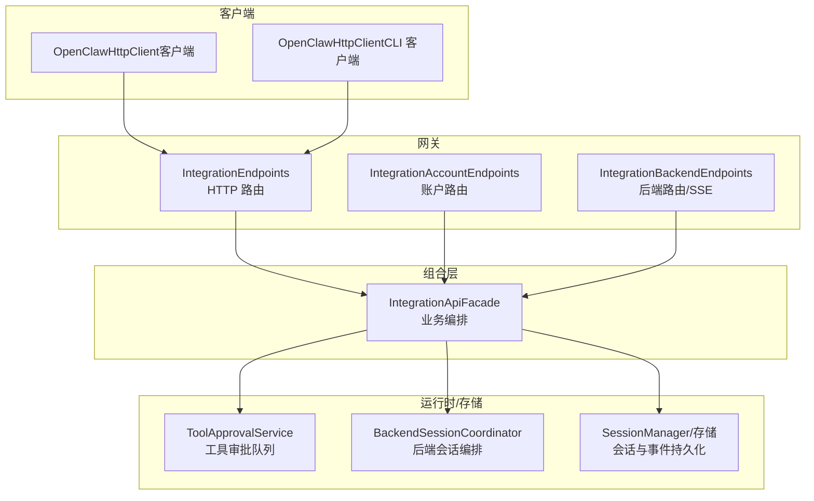
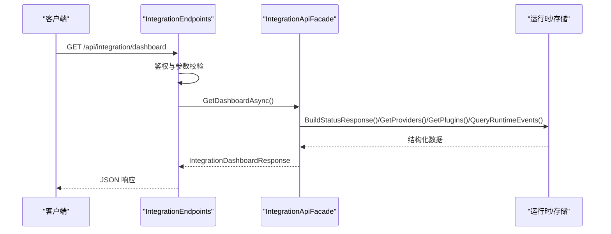
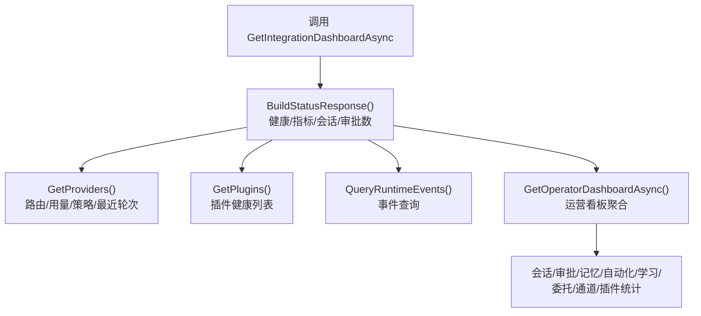
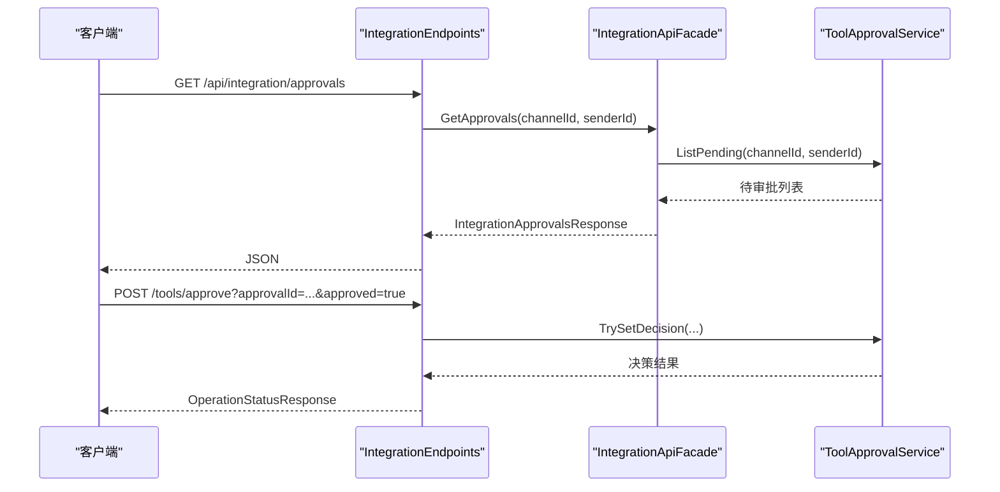
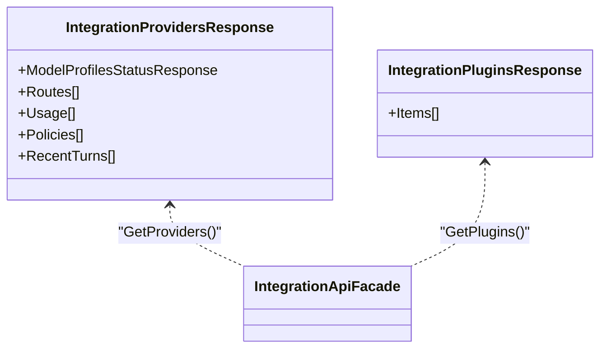
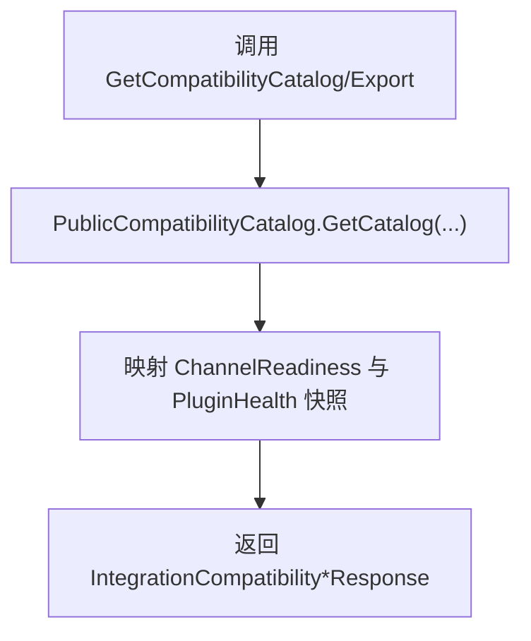
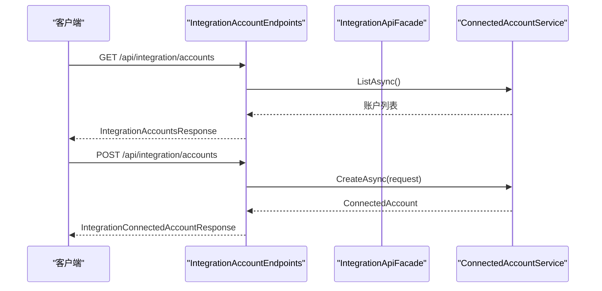
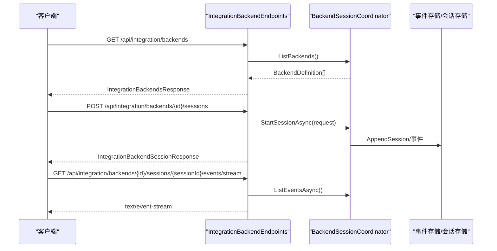
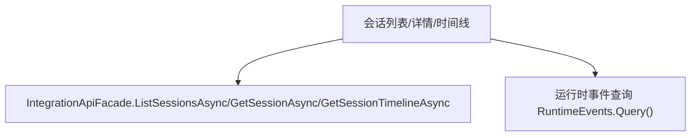
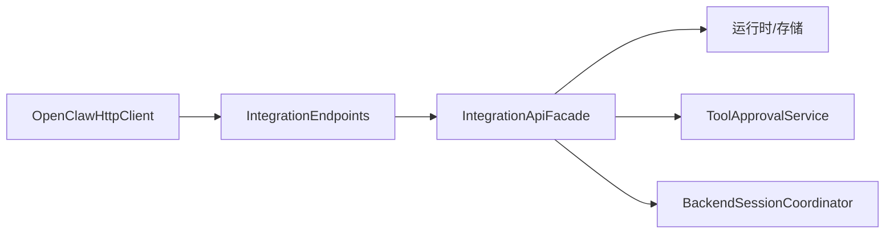

# 集成 API

<cite>
**本文引用的文件**
- [IntegrationApiModels.cs](file://src/OpenClaw.Core/Models/IntegrationApiModels.cs)
- [IntegrationApiFacade.cs](file://src/OpenClaw.Gateway/Composition/IntegrationApiFacade.cs)
- [IntegrationEndpoints.cs](file://src/OpenClaw.Gateway/Endpoints/IntegrationEndpoints.cs)
- [IntegrationAccountEndpoints.cs](file://src/OpenClaw.Gateway/Endpoints/IntegrationAccountEndpoints.cs)
- [IntegrationBackendEndpoints.cs](file://src/OpenClaw.Gateway/Endpoints/IntegrationBackendEndpoints.cs)
- [OpenClawHttpClient.cs（客户端）](file://src/OpenClaw.Client/OpenClawHttpClient.cs)
- [OpenClawHttpClient.cs（CLI 客户端）](file://src/OpenClaw.Cli/OpenClawHttpClient.cs)
- [ToolApprovalService.cs](file://src/OpenClaw.Core/Pipeline/ToolApprovalService.cs)
- [IntegrationBackendEndpoints.cs（后端事件流）](file://src/OpenClaw.Gateway/Endpoints/IntegrationBackendEndpoints.cs)
- [BackendSessionServices.cs](file://src/OpenClaw.Gateway/Backends/BackendSessionServices.cs)
- [IntegrationEndpoints.cs（仪表板与状态）](file://src/OpenClaw.Gateway/Endpoints/IntegrationEndpoints.cs)
- [IntegrationEndpoints.cs（工具审批）](file://src/OpenClaw.Gateway/Endpoints/IntegrationEndpoints.cs)
- [IntegrationEndpoints.cs（账户管理）](file://src/OpenClaw.Gateway/Endpoints/IntegrationEndpoints.cs)
- [IntegrationEndpoints.cs（后端管理）](file://src/OpenClaw.Gateway/Endpoints/IntegrationEndpoints.cs)
- [IntegrationEndpoints.cs（会话管理）](file://src/OpenClaw.Gateway/Endpoints/IntegrationEndpoints.cs)
- [IntegrationEndpoints.cs（事件流）](file://src/OpenClaw.Gateway/Endpoints/IntegrationEndpoints.cs)
</cite>

## 目录
1. [简介](#简介)
2. [项目结构](#项目结构)
3. [核心组件](#核心组件)
4. [架构总览](#架构总览)
5. [详细组件分析](#详细组件分析)
6. [依赖关系分析](#依赖关系分析)
7. [性能考虑](#性能考虑)
8. [故障排查指南](#故障排查指南)
9. [结论](#结论)
10. [附录：使用示例与最佳实践](#附录使用示例与最佳实践)

## 简介
本文件面向集成开发者，系统化梳理并解释“集成 API”的完整实现与使用方式，覆盖仪表板集成、状态监控、工具审批、提供商管理、插件健康、兼容性目录、账户管理、后端管理、会话生命周期、事件流等能力。文档以“端到端”视角呈现从客户端调用到网关路由、再到内部运行时与存储的全链路流程，并提供可操作的使用示例与排障建议。

## 项目结构
集成 API 的实现由三层组成：
- 模型层：定义所有集成 API 的请求/响应数据结构，确保前后端契约一致。
- 网关层：暴露 HTTP/SSE 接口，负责鉴权、参数解析、错误处理与结果序列化。
- 组合层：封装业务逻辑，协调运行时、存储与外部系统，提供统一的 Facade 能力。

图表来源
- [IntegrationEndpoints.cs:11-800](file://src/OpenClaw.Gateway/Endpoints/IntegrationEndpoints.cs#L11-L800)
- [IntegrationAccountEndpoints.cs:10-135](file://src/OpenClaw.Gateway/Endpoints/IntegrationAccountEndpoints.cs#L10-L135)
- [IntegrationBackendEndpoints.cs:10-287](file://src/OpenClaw.Gateway/Endpoints/IntegrationBackendEndpoints.cs#L10-L287)
- [IntegrationApiFacade.cs:11-966](file://src/OpenClaw.Gateway/Composition/IntegrationApiFacade.cs#L11-L966)
- [ToolApprovalService.cs:49-265](file://src/OpenClaw.Core/Pipeline/ToolApprovalService.cs#L49-L265)
- [BackendSessionServices.cs:36-196](file://src/OpenClaw.Gateway/Backends/BackendSessionServices.cs#L36-L196)

章节来源
- [IntegrationEndpoints.cs:11-800](file://src/OpenClaw.Gateway/Endpoints/IntegrationEndpoints.cs#L11-L800)
- [IntegrationAccountEndpoints.cs:10-135](file://src/OpenClaw.Gateway/Endpoints/IntegrationAccountEndpoints.cs#L10-L135)
- [IntegrationBackendEndpoints.cs:10-287](file://src/OpenClaw.Gateway/Endpoints/IntegrationBackendEndpoints.cs#L10-L287)
- [IntegrationApiFacade.cs:11-966](file://src/OpenClaw.Gateway/Composition/IntegrationApiFacade.cs#L11-L966)

## 核心组件
- 数据模型：集中于 IntegrationApiModels.cs，涵盖仪表板、状态、审批、提供商、插件、兼容性、账户、后端、会话、事件等响应体。
- 网关路由：IntegrationEndpoints.cs 提供 /api/integration 下的所有 REST 接口；IntegrationAccountEndpoints.cs 提供账户相关接口；IntegrationBackendEndpoints.cs 提供后端与会话管理及 SSE 事件流。
- 组合编排：IntegrationApiFacade.cs 将路由层与运行时/存储解耦，统一输出标准化响应。
- 审批与会话：ToolApprovalService.cs 提供审批队列与等待机制；BackendSessionServices.cs 提供后端会话生命周期与事件存储。

章节来源
- [IntegrationApiModels.cs:1-203](file://src/OpenClaw.Core/Models/IntegrationApiModels.cs#L1-L203)
- [IntegrationEndpoints.cs:11-800](file://src/OpenClaw.Gateway/Endpoints/IntegrationEndpoints.cs#L11-L800)
- [IntegrationAccountEndpoints.cs:10-135](file://src/OpenClaw.Gateway/Endpoints/IntegrationAccountEndpoints.cs#L10-L135)
- [IntegrationBackendEndpoints.cs:10-287](file://src/OpenClaw.Gateway/Endpoints/IntegrationBackendEndpoints.cs#L10-L287)
- [IntegrationApiFacade.cs:11-966](file://src/OpenClaw.Gateway/Composition/IntegrationApiFacade.cs#L11-L966)
- [ToolApprovalService.cs:49-265](file://src/OpenClaw.Core/Pipeline/ToolApprovalService.cs#L49-L265)
- [BackendSessionServices.cs:36-196](file://src/OpenClaw.Gateway/Backends/BackendSessionServices.cs#L36-L196)

## 架构总览
下图展示了典型“获取仪表板”请求的端到端流程：客户端发起请求 → 网关鉴权与路由 → Facade 编排 → 运行时/存储查询 → 序列化返回。

图表来源
- [IntegrationEndpoints.cs:22-31](file://src/OpenClaw.Gateway/Endpoints/IntegrationEndpoints.cs#L22-L31)
- [IntegrationApiFacade.cs:245-257](file://src/OpenClaw.Gateway/Composition/IntegrationApiFacade.cs#L245-L257)

章节来源
- [IntegrationEndpoints.cs:22-31](file://src/OpenClaw.Gateway/Endpoints/IntegrationEndpoints.cs#L22-L31)
- [IntegrationApiFacade.cs:245-257](file://src/OpenClaw.Gateway/Composition/IntegrationApiFacade.cs#L245-L257)

## 详细组件分析

### 仪表板与状态监控
- GetIntegrationDashboardAsync：聚合状态、待审批、审批历史、提供商快照、插件健康、运行时事件与运营看板指标。
- GetIntegrationStatusAsync：返回健康状态、运行时状态、指标快照、活动会话数、待审批数与已生效授权数。

图表来源
- [IntegrationApiFacade.cs:89-103](file://src/OpenClaw.Gateway/Composition/IntegrationApiFacade.cs#L89-L103)
- [IntegrationApiFacade.cs:197-215](file://src/OpenClaw.Gateway/Composition/IntegrationApiFacade.cs#L197-L215)
- [IntegrationApiFacade.cs:211-215](file://src/OpenClaw.Gateway/Composition/IntegrationApiFacade.cs#L211-L215)
- [IntegrationApiFacade.cs:175-180](file://src/OpenClaw.Gateway/Composition/IntegrationApiFacade.cs#L175-L180)
- [IntegrationApiFacade.cs:259-496](file://src/OpenClaw.Gateway/Composition/IntegrationApiFacade.cs#L259-L496)

章节来源
- [IntegrationEndpoints.cs:22-40](file://src/OpenClaw.Gateway/Endpoints/IntegrationEndpoints.cs#L22-L40)
- [IntegrationApiFacade.cs:89-103](file://src/OpenClaw.Gateway/Composition/IntegrationApiFacade.cs#L89-L103)
- [IntegrationApiFacade.cs:245-257](file://src/OpenClaw.Gateway/Composition/IntegrationApiFacade.cs#L245-L257)

### 工具审批与治理
- GetIntegrationApprovalsAsync / GetIntegrationApprovalHistoryAsync：列出待审批与审批历史。
- ApproveToolRequestAsync / DenyToolRequestAsync：对审批进行同意/拒绝决策。
- ToolApprovalService：在内存中维护审批队列，支持超时、请求者匹配与等待结果。

图表来源
- [IntegrationEndpoints.cs:42-80](file://src/OpenClaw.Gateway/Endpoints/IntegrationEndpoints.cs#L42-L80)
- [OpenClawHttpClient.cs（客户端）:372-377](file://src/OpenClaw.Client/OpenClawHttpClient.cs#L372-L377)
- [ToolApprovalService.cs:101-154](file://src/OpenClaw.Core/Pipeline/ToolApprovalService.cs#L101-L154)

章节来源
- [IntegrationEndpoints.cs:42-80](file://src/OpenClaw.Gateway/Endpoints/IntegrationEndpoints.cs#L42-L80)
- [OpenClawHttpClient.cs（客户端）:372-377](file://src/OpenClaw.Client/OpenClawHttpClient.cs#L372-L377)
- [ToolApprovalService.cs:101-154](file://src/OpenClaw.Core/Pipeline/ToolApprovalService.cs#L101-L154)

### 提供商与插件管理
- GetIntegrationProvidersAsync：返回模型配置、路由快照、用量快照、策略与最近轮次。
- GetIntegrationPluginsAsync：返回插件健康快照列表。

图表来源
- [IntegrationApiModels.cs:99-111](file://src/OpenClaw.Core/Models/IntegrationApiModels.cs#L99-L111)
- [IntegrationApiFacade.cs:197-215](file://src/OpenClaw.Gateway/Composition/IntegrationApiFacade.cs#L197-L215)

章节来源
- [IntegrationEndpoints.cs:82-104](file://src/OpenClaw.Gateway/Endpoints/IntegrationEndpoints.cs#L82-L104)
- [IntegrationApiModels.cs:99-111](file://src/OpenClaw.Core/Models/IntegrationApiModels.cs#L99-L111)
- [IntegrationApiFacade.cs:197-215](file://src/OpenClaw.Gateway/Composition/IntegrationApiFacade.cs#L197-L215)

### 兼容性目录导出
- GetIntegrationCompatibilityCatalogAsync：按状态/类型/分类筛选公开兼容性目录。
- GetIntegrationCompatibilityExportAsync：导出当前运行态、安全态势、通道就绪度、插件健康与完整目录。

图表来源
- [IntegrationEndpoints.cs:106-130](file://src/OpenClaw.Gateway/Endpoints/IntegrationEndpoints.cs#L106-L130)
- [IntegrationApiFacade.cs:217-236](file://src/OpenClaw.Gateway/Composition/IntegrationApiFacade.cs#L217-L236)

章节来源
- [IntegrationEndpoints.cs:106-130](file://src/OpenClaw.Gateway/Endpoints/IntegrationEndpoints.cs#L106-L130)
- [IntegrationApiFacade.cs:217-236](file://src/OpenClaw.Gateway/Composition/IntegrationApiFacade.cs#L217-L236)

### 账户管理（Connected Accounts）
- 列表/详情/创建/删除：提供账户生命周期管理，返回值包含脱敏字段。

图表来源
- [IntegrationAccountEndpoints.cs:21-83](file://src/OpenClaw.Gateway/Endpoints/IntegrationAccountEndpoints.cs#L21-L83)

章节来源
- [IntegrationAccountEndpoints.cs:21-83](file://src/OpenClaw.Gateway/Endpoints/IntegrationAccountEndpoints.cs#L21-L83)

### 后端管理与会话生命周期
- 列表/详情/探测：查看后端定义与可用性。
- 会话管理：启动/输入/停止/查询会话。
- 事件查询与流式事件：支持分页查询与 SSE 流式订阅。

图表来源
- [IntegrationBackendEndpoints.cs:22-173](file://src/OpenClaw.Gateway/Endpoints/IntegrationBackendEndpoints.cs#L22-L173)
- [BackendSessionServices.cs:36-196](file://src/OpenClaw.Gateway/Backends/BackendSessionServices.cs#L36-L196)

章节来源
- [IntegrationBackendEndpoints.cs:22-173](file://src/OpenClaw.Gateway/Endpoints/IntegrationBackendEndpoints.cs#L22-L173)
- [BackendSessionServices.cs:36-196](file://src/OpenClaw.Gateway/Backends/BackendSessionServices.cs#L36-L196)

### 会话管理与事件查询
- 会话列表/详情/时间线：支持分页、过滤与标签。
- 运行时事件查询：按会话/通道/发送者/组件/动作/时间范围查询。

图表来源
- [IntegrationEndpoints.cs:158-246](file://src/OpenClaw.Gateway/Endpoints/IntegrationEndpoints.cs#L158-L246)
- [IntegrationApiFacade.cs:105-173](file://src/OpenClaw.Gateway/Composition/IntegrationApiFacade.cs#L105-L173)
- [IntegrationEndpoints.cs:636-664](file://src/OpenClaw.Gateway/Endpoints/IntegrationEndpoints.cs#L636-L664)

章节来源
- [IntegrationEndpoints.cs:158-246](file://src/OpenClaw.Gateway/Endpoints/IntegrationEndpoints.cs#L158-L246)
- [IntegrationApiFacade.cs:105-173](file://src/OpenClaw.Gateway/Composition/IntegrationApiFacade.cs#L105-L173)
- [IntegrationEndpoints.cs:636-664](file://src/OpenClaw.Gateway/Endpoints/IntegrationEndpoints.cs#L636-L664)

## 依赖关系分析
- 路由层依赖 Facade 层，Facade 层再依赖运行时与存储组件，形成清晰的职责边界。
- 工具审批与后端会话均通过运行时服务与事件存储解耦，便于扩展与测试。
- 客户端通过统一的 OpenClawHttpClient 封装所有集成 API 调用，CLI 客户端复用该封装。

图表来源
- [OpenClawHttpClient.cs（客户端）:10-182](file://src/OpenClaw.Client/OpenClawHttpClient.cs#L10-L182)
- [IntegrationEndpoints.cs:11-800](file://src/OpenClaw.Gateway/Endpoints/IntegrationEndpoints.cs#L11-L800)
- [IntegrationApiFacade.cs:11-966](file://src/OpenClaw.Gateway/Composition/IntegrationApiFacade.cs#L11-L966)
- [ToolApprovalService.cs:49-265](file://src/OpenClaw.Core/Pipeline/ToolApprovalService.cs#L49-L265)
- [BackendSessionServices.cs:36-196](file://src/OpenClaw.Gateway/Backends/BackendSessionServices.cs#L36-L196)

章节来源
- [OpenClawHttpClient.cs（客户端）:10-182](file://src/OpenClaw.Client/OpenClawHttpClient.cs#L10-L182)
- [IntegrationEndpoints.cs:11-800](file://src/OpenClaw.Gateway/Endpoints/IntegrationEndpoints.cs#L11-L800)
- [IntegrationApiFacade.cs:11-966](file://src/OpenClaw.Gateway/Composition/IntegrationApiFacade.cs#L11-L966)

## 性能考虑
- 批量查询与分页：会话列表、事件查询、兼容性导出等接口支持 limit/page 控制，避免一次性返回大量数据。
- SSE 流式事件：后端事件流采用 Server-Sent Events，支持增量推送，降低轮询开销。
- 内存审批队列：ToolApprovalService 使用并发字典与异步等待，避免阻塞主线程。
- 指标快照：状态接口返回指标快照，便于前端快速渲染与缓存。

## 故障排查指南
- 鉴权失败：确认请求头携带有效的 Bearer Token，且具备相应 endpoint scope 与角色权限。
- 参数错误：检查查询参数（如 limit、afterSequence、sessionId）是否合法。
- 会话不存在：后端会话查询或事件流订阅需确保 sessionId 存在且属于指定 backendId。
- 审批未找到/超时：确认 approvalId 正确，等待时间是否超过阈值；必要时重试或延长超时。
- 支付相关禁用：当支付功能未启用时，相关接口将返回禁用提示。

章节来源
- [IntegrationEndpoints.cs:22-80](file://src/OpenClaw.Gateway/Endpoints/IntegrationEndpoints.cs#L22-L80)
- [IntegrationBackendEndpoints.cs:115-173](file://src/OpenClaw.Gateway/Endpoints/IntegrationBackendEndpoints.cs#L115-L173)
- [ToolApprovalService.cs:156-215](file://src/OpenClaw.Core/Pipeline/ToolApprovalService.cs#L156-L215)

## 结论
集成 API 通过清晰的路由、编排与数据模型，提供了从系统状态、工具审批、提供商与插件健康，到账户与后端会话管理的全栈能力。客户端可基于统一的 HTTP/SSE 接口快速接入第三方服务与外部连接，同时保留可观测性与治理能力，满足生产级集成需求。

## 附录：使用示例与最佳实践
- 获取仪表板与状态
  - 客户端调用：[OpenClawHttpClient.cs（客户端）:322-326](file://src/OpenClaw.Client/OpenClawHttpClient.cs#L322-L326)
  - 网关路由：[IntegrationEndpoints.cs:22-40](file://src/OpenClaw.Gateway/Endpoints/IntegrationEndpoints.cs#L22-L40)
- 审批与治理
  - 列待审批：[IntegrationEndpoints.cs:42-54](file://src/OpenClaw.Gateway/Endpoints/IntegrationEndpoints.cs#L42-L54)
  - 同意/拒绝：[OpenClawHttpClient.cs（客户端）:372-377](file://src/OpenClaw.Client/OpenClawHttpClient.cs#L372-L377)
- 提供商与插件
  - 提供商快照：[IntegrationEndpoints.cs:82-93](file://src/OpenClaw.Gateway/Endpoints/IntegrationEndpoints.cs#L82-L93)
  - 插件健康：[IntegrationEndpoints.cs:95-104](file://src/OpenClaw.Gateway/Endpoints/IntegrationEndpoints.cs#L95-L104)
- 兼容性目录
  - 目录查询：[IntegrationEndpoints.cs:106-119](file://src/OpenClaw.Gateway/Endpoints/IntegrationEndpoints.cs#L106-L119)
  - 导出：[IntegrationEndpoints.cs:121-129](file://src/OpenClaw.Gateway/Endpoints/IntegrationEndpoints.cs#L121-L129)
- 账户管理
  - 列表/创建/删除：[IntegrationAccountEndpoints.cs:21-83](file://src/OpenClaw.Gateway/Endpoints/IntegrationAccountEndpoints.cs#L21-L83)
- 后端与会话
  - 列表/探测/启动/输入/停止/查询/事件流：[IntegrationBackendEndpoints.cs:22-173](file://src/OpenClaw.Gateway/Endpoints/IntegrationBackendEndpoints.cs#L22-L173)
- 会话与事件
  - 会话列表/详情/时间线/事件查询：[IntegrationEndpoints.cs:158-246](file://src/OpenClaw.Gateway/Endpoints/IntegrationEndpoints.cs#L158-L246), [IntegrationEndpoints.cs:636-664](file://src/OpenClaw.Gateway/Endpoints/IntegrationEndpoints.cs#L636-L664)

最佳实践
- 在客户端统一设置 Authorization 头与 User-Agent，便于审计与限流识别。
- 对高吞吐场景使用 SSE 事件流替代轮询，减少网络与 CPU 开销。
- 对审批与后端会话操作使用幂等设计，结合 IDempotency-Key 或内部去重策略。
- 对批量查询设置合理 limit 与分页，避免单次响应过大导致延迟与内存压力。
- 对支付类接口在调用前先查询 SetupStatus，确保环境与提供商配置正确。