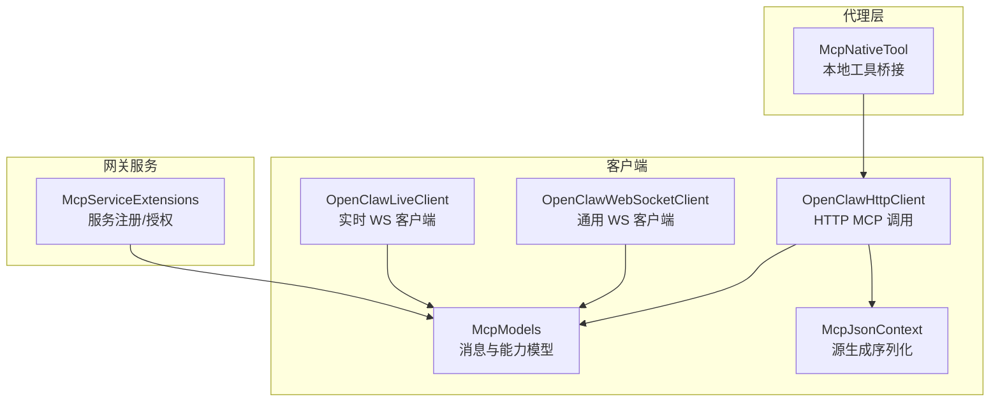
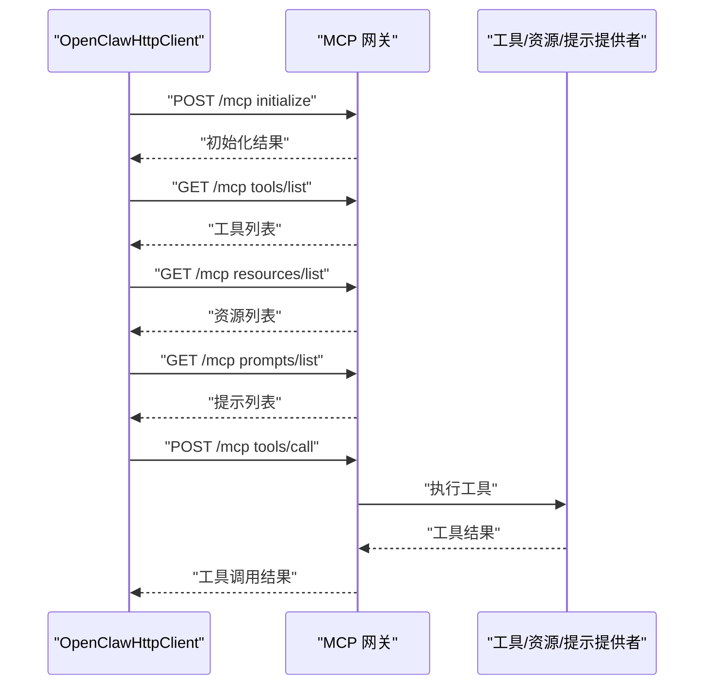
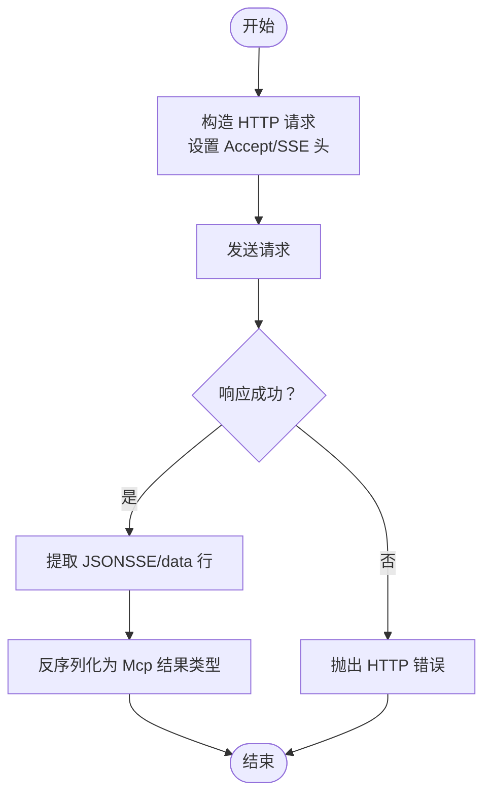
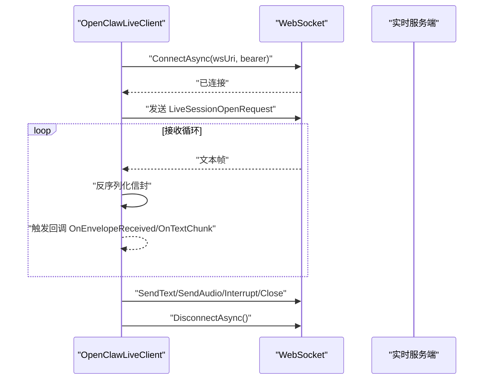
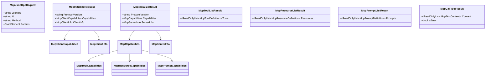
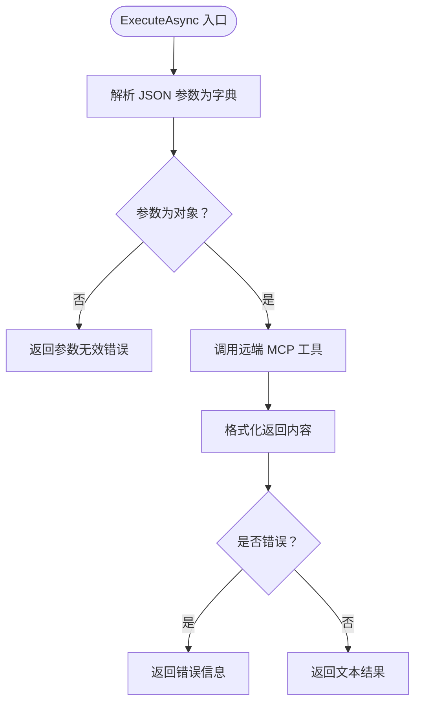
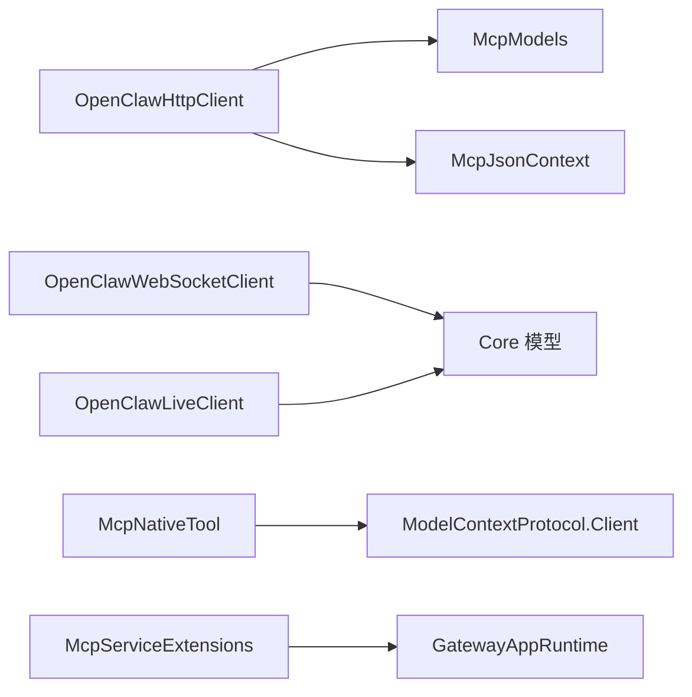

# MCP 客户端

<cite>
**本文引用的文件**
- [McpModels.cs](file://src/OpenClaw.Client/McpModels.cs)
- [McpJsonContext.cs](file://src/OpenClaw.Client/McpJsonContext.cs)
- [OpenClawHttpClient.cs](file://src/OpenClaw.Client/OpenClawHttpClient.cs)
- [OpenClawWebSocketClient.cs](file://src/OpenClaw.Client/OpenClawWebSocketClient.cs)
- [OpenClawLiveClient.cs](file://src/OpenClaw.Client/OpenClawLiveClient.cs)
- [McpNativeTool.cs](file://src/OpenClaw.Agent/Tools/McpNativeTool.cs)
- [McpServiceExtensions.cs](file://src/OpenClaw.Gateway/Mcp/McpServiceExtensions.cs)
- [GatewayAdminEndpointTests.cs](file://src/OpenClaw.Tests/GatewayAdminEndpointTests.cs)
- [OpenClawWebSocketClientTests.cs](file://src/OpenClaw.Tests/OpenClawWebSocketClientTests.cs)
</cite>

## 目录
1. [简介](#简介)
2. [项目结构](#项目结构)
3. [核心组件](#核心组件)
4. [架构总览](#架构总览)
5. [详细组件分析](#详细组件分析)
6. [依赖关系分析](#依赖关系分析)
7. [性能考量](#性能考量)
8. [故障排查指南](#故障排查指南)
9. [结论](#结论)
10. [附录](#附录)

## 简介
本文件面向 MCP（Model Context Protocol）客户端的技术文档，系统阐述 OpenClaw 项目中 MCP 客户端的架构设计、协议实现与工具调用机制。内容覆盖 MCP 初始化、工具列表获取、资源管理、提示管理等关键能力；同时文档化 MCP 消息格式、JSON 序列化策略、协议版本兼容性，并提供与 AI 模型交互、上下文管理、参数传递等实现细节。最后给出错误处理、超时管理、重试策略等最佳实践建议。

## 项目结构
MCP 客户端相关代码主要位于以下模块：
- 客户端模型与序列化：src/OpenClaw.Client/McpModels.cs、McpJsonContext.cs
- HTTP 客户端封装：OpenClawHttpClient.cs
- WebSocket 客户端：OpenClawWebSocketClient.cs、OpenClawLiveClient.cs
- 代理侧工具适配：src/OpenClaw.Agent/Tools/McpNativeTool.cs
- 网关侧服务注册与授权：src/OpenClaw.Gateway/Mcp/McpServiceExtensions.cs
- 测试用例：src/OpenClaw.Tests 下的相关测试文件

**图表来源**
- [OpenClawHttpClient.cs:10-182](file://src/OpenClaw.Client/OpenClawHttpClient.cs#L10-L182)
- [OpenClawWebSocketClient.cs:9-57](file://src/OpenClaw.Client/OpenClawWebSocketClient.cs#L9-L57)
- [OpenClawLiveClient.cs:9-87](file://src/OpenClaw.Client/OpenClawLiveClient.cs#L9-L87)
- [McpModels.cs:5-187](file://src/OpenClaw.Client/McpModels.cs#L5-L187)
- [McpJsonContext.cs:5-38](file://src/OpenClaw.Client/McpJsonContext.cs#L5-L38)
- [McpNativeTool.cs:9-14](file://src/OpenClaw.Agent/Tools/McpNativeTool.cs#L9-L14)
- [McpServiceExtensions.cs:20-46](file://src/OpenClaw.Gateway/Mcp/McpServiceExtensions.cs#L20-L46)

**章节来源**
- [OpenClawHttpClient.cs:10-182](file://src/OpenClaw.Client/OpenClawHttpClient.cs#L10-L182)
- [McpModels.cs:5-187](file://src/OpenClaw.Client/McpModels.cs#L5-L187)
- [McpJsonContext.cs:5-38](file://src/OpenClaw.Client/McpJsonContext.cs#L5-L38)
- [OpenClawWebSocketClient.cs:9-57](file://src/OpenClaw.Client/OpenClawWebSocketClient.cs#L9-L57)
- [OpenClawLiveClient.cs:9-87](file://src/OpenClaw.Client/OpenClawLiveClient.cs#L9-L87)
- [McpNativeTool.cs:9-14](file://src/OpenClaw.Agent/Tools/McpNativeTool.cs#L9-L14)
- [McpServiceExtensions.cs:20-46](file://src/OpenClaw.Gateway/Mcp/McpServiceExtensions.cs#L20-L46)

## 核心组件
- MCP 消息与能力模型：定义 JSON-RPC 请求/响应、初始化请求/结果、工具/资源/提示能力模型等。
- 源生成 JSON 上下文：通过 McpJsonContext 对 MCP 模型进行高性能序列化。
- HTTP 客户端：封装 /mcp 端点的初始化、工具列表、资源列表、资源读取、提示列表与获取、工具调用等方法。
- WebSocket 客户端：提供通用文本/信封事件回调与发送能力；实时客户端支持文本/音频输入与中断控制。
- 代理工具桥接：将远端 MCP 工具以本地 ITool 形式暴露，负责参数解析与结果格式化。
- 网关服务注册：在 ASP.NET Core 中注册 MCP 服务器、工具/资源/提示提供者，并附加统一鉴权与限流。

**章节来源**
- [McpModels.cs:5-187](file://src/OpenClaw.Client/McpModels.cs#L5-L187)
- [McpJsonContext.cs:5-38](file://src/OpenClaw.Client/McpJsonContext.cs#L5-L38)
- [OpenClawHttpClient.cs:262-320](file://src/OpenClaw.Client/OpenClawHttpClient.cs#L262-L320)
- [OpenClawWebSocketClient.cs:119-156](file://src/OpenClaw.Client/OpenClawWebSocketClient.cs#L119-L156)
- [OpenClawLiveClient.cs:89-123](file://src/OpenClaw.Client/OpenClawLiveClient.cs#L89-L123)
- [McpNativeTool.cs:20-70](file://src/OpenClaw.Agent/Tools/McpNativeTool.cs#L20-L70)
- [McpServiceExtensions.cs:32-43](file://src/OpenClaw.Gateway/Mcp/McpServiceExtensions.cs#L32-L43)

## 架构总览
MCP 客户端通过 HTTP 或 WebSocket 与网关的 MCP 服务交互。HTTP 客户端负责一次性请求/响应式调用（如 initialize、tools/list、resources/*、prompts/*、tools/call）。WebSocket 客户端用于实时会话（如 live 会话）。

**图表来源**
- [OpenClawHttpClient.cs:262-320](file://src/OpenClaw.Client/OpenClawHttpClient.cs#L262-L320)
- [McpServiceExtensions.cs:32-43](file://src/OpenClaw.Gateway/Mcp/McpServiceExtensions.cs#L32-L43)

## 详细组件分析

### HTTP 客户端：OpenClawHttpClient
职责与能力
- 统一构造 /mcp 端点请求，封装 JSON-RPC envelope 的发送与响应解析。
- 提供初始化、工具列表、资源列表、资源模板列表、资源读取、提示列表、提示获取、工具调用等方法。
- 自动处理 SSE 响应（当返回 text/event-stream 时提取 data 行）。

关键流程
- 发送 MCP 请求：根据 method 选择带参或无参发送路径，使用 McpJsonContext 进行序列化与反序列化。
- 响应解析：从 HTTP 响应体中提取 JSON；若为 SSE，则解析 data 行；随后反序列化为指定结果类型。
- 错误处理：空响应体、包含错误字段、缺少结果负载等情况均抛出明确异常。

**图表来源**
- [OpenClawHttpClient.cs:262-320](file://src/OpenClaw.Client/OpenClawHttpClient.cs#L262-L320)
- [OpenClawHttpClient.cs:1308-1325](file://src/OpenClaw.Client/OpenClawHttpClient.cs#L1308-L1325)

**章节来源**
- [OpenClawHttpClient.cs:262-320](file://src/OpenClaw.Client/OpenClawHttpClient.cs#L262-L320)
- [OpenClawHttpClient.cs:1308-1325](file://src/OpenClaw.Client/OpenClawHttpClient.cs#L1308-L1325)

### WebSocket 客户端：OpenClawWebSocketClient 与 OpenClawLiveClient
职责与能力
- OpenClawWebSocketClient：通用 WebSocket 客户端，支持连接、断开、发送/接收文本与信封事件，具备最大消息大小限制与并发发送锁。
- OpenClawLiveClient：实时会话 WebSocket 客户端，支持发送文本/音频输入、中断、关闭会话，自动建立连接后发送会话打开请求。

关键流程
- 连接：建立 ClientWebSocket，可选携带 Authorization 头，启动接收循环。
- 发送：序列化信封，检查大小限制，串行发送。
- 接收：按帧拼接文本，触发 OnTextMessage 与 OnEnvelopeReceived 回调，异常通过 OnError 通知。
- 断开：取消接收任务、关闭连接、释放资源，等待在途发送完成。

**图表来源**
- [OpenClawLiveClient.cs:60-87](file://src/OpenClaw.Client/OpenClawLiveClient.cs#L60-L87)
- [OpenClawLiveClient.cs:185-210](file://src/OpenClaw.Client/OpenClawLiveClient.cs#L185-L210)
- [OpenClawLiveClient.cs:212-282](file://src/OpenClaw.Client/OpenClawLiveClient.cs#L212-L282)

**章节来源**
- [OpenClawWebSocketClient.cs:38-117](file://src/OpenClaw.Client/OpenClawWebSocketClient.cs#L38-L117)
- [OpenClawWebSocketClient.cs:158-227](file://src/OpenClaw.Client/OpenClawWebSocketClient.cs#L158-L227)
- [OpenClawLiveClient.cs:60-123](file://src/OpenClaw.Client/OpenClawLiveClient.cs#L60-L123)
- [OpenClawLiveClient.cs:185-282](file://src/OpenClaw.Client/OpenClawLiveClient.cs#L185-L282)

### MCP 模型与序列化：McpModels 与 McpJsonContext
职责与能力
- 定义 JSON-RPC envelope、初始化请求/结果、能力模型（工具/资源/提示）、工具/资源/提示数据结构。
- 使用源生成器对上述类型进行高性能序列化/反序列化，统一命名策略与忽略规则。

**图表来源**
- [McpModels.cs:5-187](file://src/OpenClaw.Client/McpModels.cs#L5-L187)

**章节来源**
- [McpModels.cs:5-187](file://src/OpenClaw.Client/McpModels.cs#L5-L187)
- [McpJsonContext.cs:5-38](file://src/OpenClaw.Client/McpJsonContext.cs#L5-L38)

### 代理工具桥接：McpNativeTool
职责与能力
- 将远端 MCP 工具以本地 ITool 形式暴露，负责：
  - 解析 JSON 参数为字典；
  - 调用远端 MCP 工具；
  - 格式化返回内容（文本块、嵌入资源、结构化内容等）；
  - 统一错误处理与取消传播。

**图表来源**
- [McpNativeTool.cs:20-70](file://src/OpenClaw.Agent/Tools/McpNativeTool.cs#L20-L70)

**章节来源**
- [McpNativeTool.cs:20-70](file://src/OpenClaw.Agent/Tools/McpNativeTool.cs#L20-L70)

### 网关服务注册与授权：McpServiceExtensions
职责与能力
- 注册 MCP 服务器（含 HTTP 无状态传输），注入工具/资源/提示提供者。
- 在应用启动后填充运行时实例，以便 MCP 服务访问。
- 为 /mcp 路径添加统一鉴权与限流中间件。

**章节来源**
- [McpServiceExtensions.cs:20-46](file://src/OpenClaw.Gateway/Mcp/McpServiceExtensions.cs#L20-L46)
- [McpServiceExtensions.cs:61-89](file://src/OpenClaw.Gateway/Mcp/McpServiceExtensions.cs#L61-L89)

## 依赖关系分析
- OpenClawHttpClient 依赖 McpModels 与 McpJsonContext，通过 /mcp 端点与网关通信。
- OpenClawWebSocketClient/OpenClawLiveClient 依赖 Core 模型（信封类型）与 JSON 上下文进行序列化。
- McpNativeTool 依赖 ModelContextProtocol 客户端与协议类型，将远端工具映射为本地工具。
- 网关侧通过 McpServiceExtensions 注册 MCP 服务器与提供者，并在应用构建后初始化运行时。

**图表来源**
- [OpenClawHttpClient.cs:262-320](file://src/OpenClaw.Client/OpenClawHttpClient.cs#L262-L320)
- [OpenClawWebSocketClient.cs:119-156](file://src/OpenClaw.Client/OpenClawWebSocketClient.cs#L119-L156)
- [OpenClawLiveClient.cs:185-210](file://src/OpenClaw.Client/OpenClawLiveClient.cs#L185-L210)
- [McpNativeTool.cs:9-14](file://src/OpenClaw.Agent/Tools/McpNativeTool.cs#L9-L14)
- [McpServiceExtensions.cs:20-46](file://src/OpenClaw.Gateway/Mcp/McpServiceExtensions.cs#L20-L46)

**章节来源**
- [OpenClawHttpClient.cs:262-320](file://src/OpenClaw.Client/OpenClawHttpClient.cs#L262-L320)
- [OpenClawWebSocketClient.cs:119-156](file://src/OpenClaw.Client/OpenClawWebSocketClient.cs#L119-L156)
- [OpenClawLiveClient.cs:185-210](file://src/OpenClaw.Client/OpenClawLiveClient.cs#L185-L210)
- [McpNativeTool.cs:9-14](file://src/OpenClaw.Agent/Tools/McpNativeTool.cs#L9-L14)
- [McpServiceExtensions.cs:20-46](file://src/OpenClaw.Gateway/Mcp/McpServiceExtensions.cs#L20-L46)

## 性能考量
- 源生成序列化：通过 McpJsonContext 与 CoreJsonContext 减少反射开销，提升 JSON 往返性能。
- SSE 解析：HTTP 客户端对 text/event-stream 响应进行逐行解析，避免全量加载，降低内存占用。
- WebSocket 并发：发送路径采用信号量串行化，防止竞争与拥塞；接收循环按帧拼接，避免超大消息。
- 最大消息限制：WebSocket 客户端对入站/出站消息长度进行限制，防止内存溢出。
- 取消与超时：所有异步调用接受 CancellationToken，HTTP 客户端默认禁用全局超时，由调用方控制。

[本节为通用指导，无需列出具体文件来源]

## 故障排查指南
常见问题与定位
- HTTP 响应为空或缺少结果负载：检查服务端返回体与 JSON-RPC envelope 结构，确认 Result 字段存在。
- SSE 响应未包含 data 行：确认服务端正确输出 data: 前缀行。
- WebSocket 发送失败（未连接）：确保已 ConnectAsync 成功且状态为 Open。
- 消息过大：检查发送/接收端的最大消息字节数配置。
- 参数解析失败：确认传入 JSON 为对象根，键值类型匹配工具期望。
- 鉴权/限流：/mcp 路径受统一中间件保护，确认令牌有效与 IP 速率限制。

参考测试用例
- WebSocket 客户端断连等待在途发送完成、回调异常不中断接收循环等行为验证。
- 网关端对 /mcp 的 initialize、tools/list、resources/templates/list、tools/call 等请求的正确响应。

**章节来源**
- [OpenClawWebSocketClientTests.cs:9-26](file://src/OpenClaw.Tests/OpenClawWebSocketClientTests.cs#L9-L26)
- [OpenClawWebSocketClientTests.cs:28-45](file://src/OpenClaw.Tests/OpenClawWebSocketClientTests.cs#L28-L45)
- [GatewayAdminEndpointTests.cs:5973-6027](file://src/OpenClaw.Tests/GatewayAdminEndpointTests.cs#L5973-L6027)

## 结论
本客户端以清晰的分层设计实现了 MCP 协议的关键能力：HTTP 一次性调用与 WebSocket 实时会话并存，结合源生成序列化与严格的错误处理，满足生产环境对性能与稳定性的要求。通过代理工具桥接与网关服务注册，MCP 能力可无缝融入 OpenClaw 生态。

[本节为总结性内容，无需列出具体文件来源]

## 附录

### 使用示例（步骤级）
- 初始化 MCP：调用 InitializeMcpAsync，传入协议版本与客户端能力信息。
- 获取工具列表：调用 ListMcpToolsAsync。
- 获取资源列表：调用 ListMcpResourcesAsync。
- 获取资源模板列表：调用 ListMcpResourceTemplatesAsync。
- 读取资源：调用 ReadMcpResourceAsync，传入资源 URI。
- 获取提示列表：调用 ListMcpPromptsAsync。
- 获取提示内容：调用 GetMcpPromptAsync，传入名称与参数字典。
- 调用工具：调用 CallMcpToolAsync，传入工具名与参数 JsonElement。

以上调用均由 OpenClawHttpClient 提供，内部使用 McpJsonContext 完成序列化与反序列化。

**章节来源**
- [OpenClawHttpClient.cs:262-320](file://src/OpenClaw.Client/OpenClawHttpClient.cs#L262-L320)
- [McpJsonContext.cs:5-38](file://src/OpenClaw.Client/McpJsonContext.cs#L5-L38)