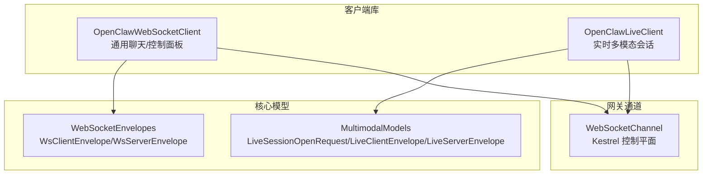
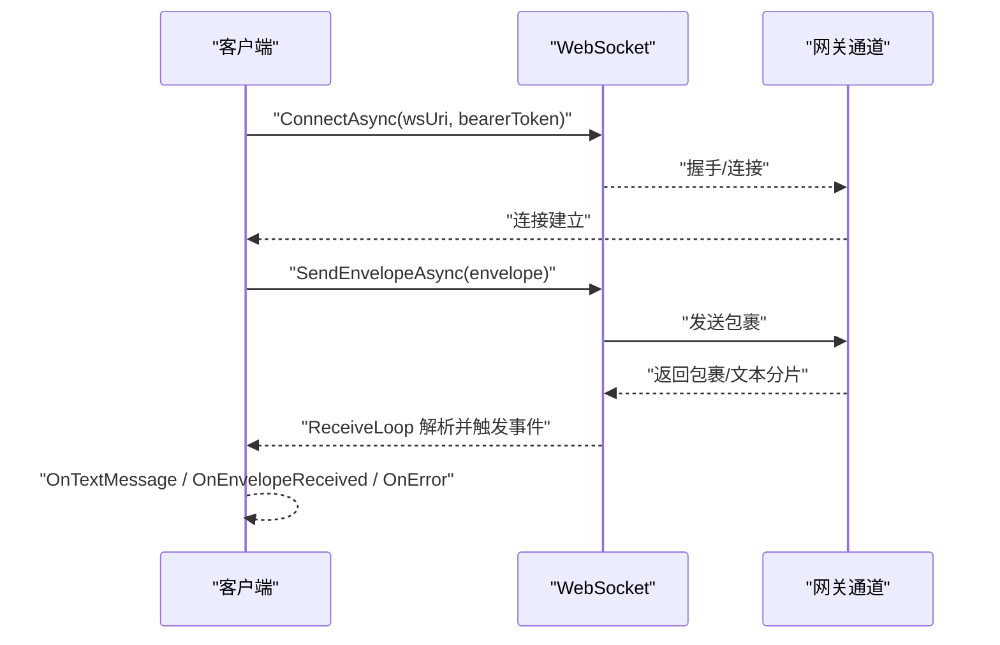
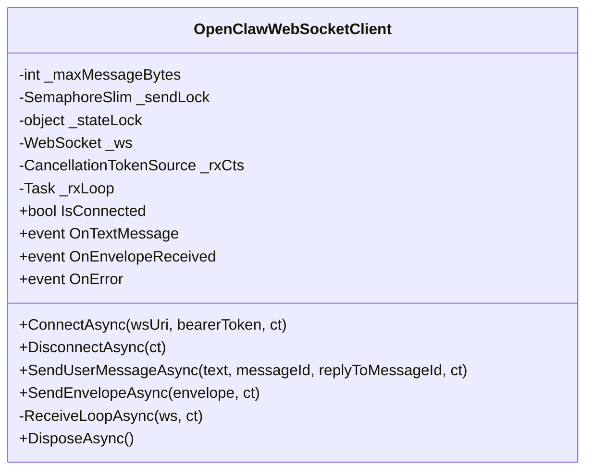
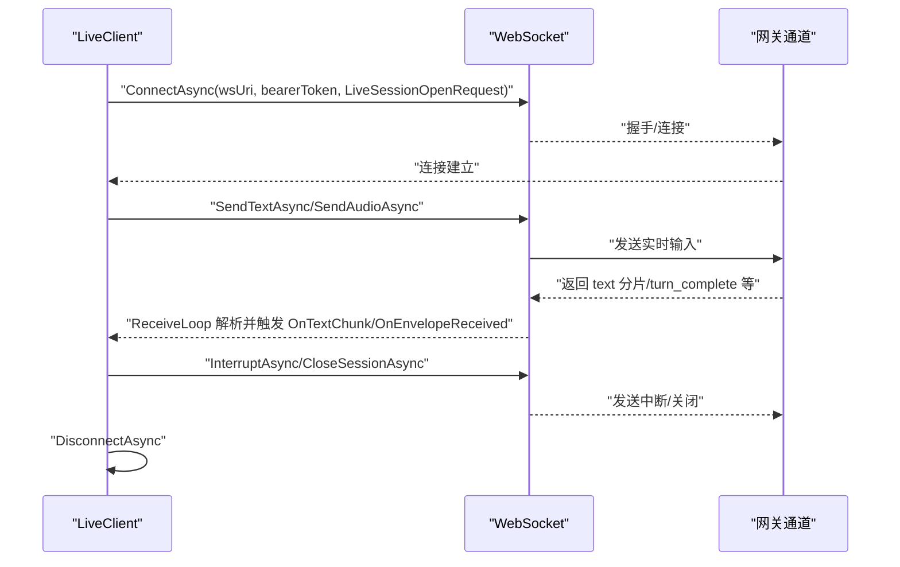
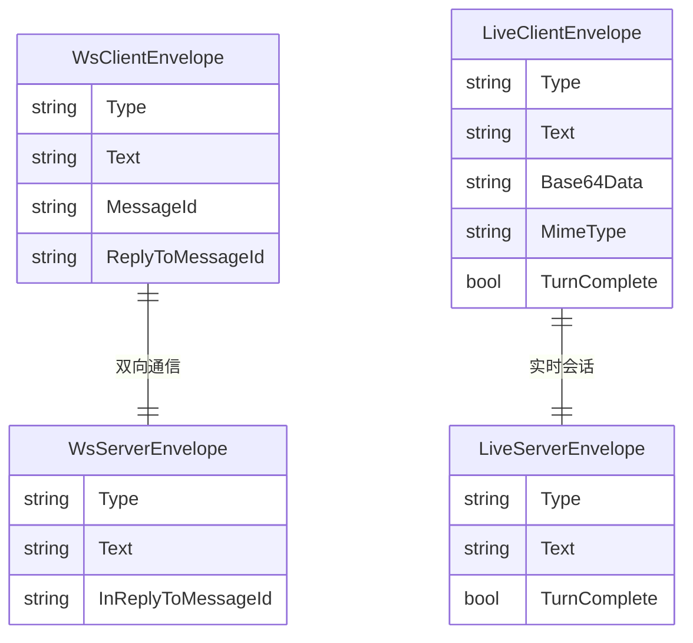
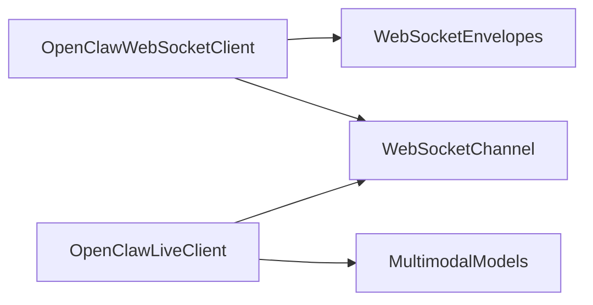

# WebSocket 客户端

<cite>
**本文档引用的文件**
- [OpenClawWebSocketClient.cs](file://src/OpenClaw.Client/OpenClawWebSocketClient.cs)
- [OpenClawLiveClient.cs](file://src/OpenClaw.Client/OpenClawLiveClient.cs)
- [WebSocketEnvelopes.cs](file://src/OpenClaw.Core/Models/WebSocketEnvelopes.cs)
- [MultimodalModels.cs](file://src/OpenClaw.Core/Models/MultimodalModels.cs)
- [WebSocketChannel.cs](file://src/OpenClaw.Channels/WebSocketChannel.cs)
- [OpenClawWebSocketClientTests.cs](file://src/OpenClaw.Tests/OpenClawWebSocketClientTests.cs)
- [OpenClawLiveClientTests.cs](file://src/OpenClaw.Tests/OpenClawLiveClientTests.cs)
</cite>

## 目录
1. [简介](#简介)
2. [项目结构](#项目结构)
3. [核心组件](#核心组件)
4. [架构总览](#架构总览)
5. [详细组件分析](#详细组件分析)
6. [依赖关系分析](#依赖关系分析)
7. [性能考虑](#性能考虑)
8. [故障排除指南](#故障排除指南)
9. [结论](#结论)
10. [附录](#附录)

## 简介
本文件面向 WebSocket 客户端的使用者与维护者，系统性阐述 OpenClawWebSocketClient 与 OpenClawLiveClient 的架构设计、连接生命周期管理、消息序列化与反序列化机制、实时通信协议、事件类型、错误处理与重连策略，并提供连接建立、消息收发、事件订阅与连接状态管理的具体使用示例。文档同时解释与网关服务的实时通信协议、心跳机制与断线重连策略的技术实现细节。

## 项目结构
WebSocket 客户端位于客户端库中，核心类包括：
- OpenClawWebSocketClient：通用 WebSocket 客户端，支持 JSON 包裹消息与文本消息，适用于聊天与控制面板交互。
- OpenClawLiveClient：实时多模态会话客户端，支持文本、音频输入与中断、关闭会话等操作，适用于语音/视频实时对话场景。

两者均基于 .NET System.Net.WebSockets 实现，采用异步 I/O 与并发安全设计，通过事件回调分发消息与错误。

**图表来源**
- [OpenClawWebSocketClient.cs:1-248](file://src/OpenClaw.Client/OpenClawWebSocketClient.cs#L1-L248)
- [OpenClawLiveClient.cs:1-303](file://src/OpenClaw.Client/OpenClawLiveClient.cs#L1-L303)
- [WebSocketEnvelopes.cs:1-109](file://src/OpenClaw.Core/Models/WebSocketEnvelopes.cs#L1-L109)
- [MultimodalModels.cs:81-107](file://src/OpenClaw.Core/Models/MultimodalModels.cs#L81-L107)
- [WebSocketChannel.cs:1-650](file://src/OpenClaw.Channels/WebSocketChannel.cs#L1-L650)

**章节来源**
- [OpenClawWebSocketClient.cs:1-248](file://src/OpenClaw.Client/OpenClawWebSocketClient.cs#L1-L248)
- [OpenClawLiveClient.cs:1-303](file://src/OpenClaw.Client/OpenClawLiveClient.cs#L1-L303)
- [WebSocketEnvelopes.cs:1-109](file://src/OpenClaw.Core/Models/WebSocketEnvelopes.cs#L1-L109)
- [MultimodalModels.cs:81-107](file://src/OpenClaw.Core/Models/MultimodalModels.cs#L81-L107)
- [WebSocketChannel.cs:1-650](file://src/OpenClaw.Channels/WebSocketChannel.cs#L1-L650)

## 核心组件
本节概述两个客户端的关键职责与能力边界：
- OpenClawWebSocketClient
  - 支持连接/断开、发送用户消息、发送任意 JSON 包裹、接收文本与包裹消息、错误回调。
  - 内置最大消息大小限制与发送锁，确保并发安全。
- OpenClawLiveClient
  - 提供实时会话入口（构建 ws/live URI）、发送文本/音频、中断、关闭会话、断开连接。
  - 支持文本分片事件与完整包裹事件的回调分离，便于流式渲染与状态同步。

**章节来源**
- [OpenClawWebSocketClient.cs:18-156](file://src/OpenClaw.Client/OpenClawWebSocketClient.cs#L18-L156)
- [OpenClawLiveClient.cs:18-123](file://src/OpenClaw.Client/OpenClawLiveClient.cs#L18-L123)

## 架构总览
WebSocket 客户端与网关之间的交互遵循“JSON 包裹”或“纯文本”的双模式协议。客户端负责：
- 建立连接并可选设置 Authorization 头。
- 发送 JSON 包裹（如 user_message、text、audio、interrupt、close）。
- 接收服务器返回的包裹（如 assistant_message、text 分片、turn_complete 等）并分发到事件回调。

**图表来源**
- [OpenClawWebSocketClient.cs:38-57](file://src/OpenClaw.Client/OpenClawWebSocketClient.cs#L38-L57)
- [OpenClawWebSocketClient.cs:158-227](file://src/OpenClaw.Client/OpenClawWebSocketClient.cs#L158-L227)
- [WebSocketChannel.cs:76-151](file://src/OpenClaw.Channels/WebSocketChannel.cs#L76-L151)

**章节来源**
- [OpenClawWebSocketClient.cs:38-57](file://src/OpenClaw.Client/OpenClawWebSocketClient.cs#L38-L57)
- [OpenClawWebSocketClient.cs:158-227](file://src/OpenClaw.Client/OpenClawWebSocketClient.cs#L158-L227)
- [WebSocketChannel.cs:76-151](file://src/OpenClaw.Channels/WebSocketChannel.cs#L76-L151)

## 详细组件分析

### OpenClawWebSocketClient 组件分析
- 连接管理
  - ConnectAsync：创建 ClientWebSocket，设置 Authorization 头，发起连接；启动接收循环任务。
  - DisconnectAsync：取消接收循环、等待退出、正常关闭并释放资源，保证发送中的请求完成后再断开。
- 消息处理
  - SendEnvelopeAsync：序列化包裹为 UTF-8 字节数组，检查大小限制，加锁后发送。
  - ReceiveLoopAsync：循环接收消息，聚合分片，校验大小，解析为 WsServerEnvelope 并触发事件。
- 事件与错误
  - OnTextMessage：原始文本消息回调。
  - OnEnvelopeReceived：解析后的服务器包裹回调。
  - OnError：异常信息回调，避免中断接收循环。
- 状态与并发
  - IsConnected：基于内部 WebSocket 状态判断。
  - _sendLock：确保发送互斥。
  - _stateLock：保护连接状态字段。

**图表来源**
- [OpenClawWebSocketClient.cs:9-248](file://src/OpenClaw.Client/OpenClawWebSocketClient.cs#L9-L248)

**章节来源**
- [OpenClawWebSocketClient.cs:38-117](file://src/OpenClaw.Client/OpenClawWebSocketClient.cs#L38-L117)
- [OpenClawWebSocketClient.cs:119-156](file://src/OpenClaw.Client/OpenClawWebSocketClient.cs#L119-L156)
- [OpenClawWebSocketClient.cs:158-227](file://src/OpenClaw.Client/OpenClawWebSocketClient.cs#L158-L227)

### OpenClawLiveClient 组件分析
- 实时会话入口
  - BuildWebSocketUri：根据基地址生成 ws/live URI（自动替换 http/https 为 ws/wss）。
  - ConnectAsync：连接后发送 LiveSessionOpenRequest，随后启动接收循环。
- 实时消息
  - SendTextAsync/SendAudioAsync：封装 LiveClientEnvelope 并发送。
  - InterruptAsync/CloseSessionAsync：发送中断与关闭指令并断开连接。
- 事件分发
  - OnTextChunk：仅在服务器返回 text 类型且包含文本时触发，用于流式文本渲染。
  - OnEnvelopeReceived：所有服务器包裹统一回调。
  - OnError：异常信息回调。
- 错误与断开
  - DisconnectAsync：与通用客户端一致的断开流程，确保发送完成再释放。

**图表来源**
- [OpenClawLiveClient.cs:60-87](file://src/OpenClaw.Client/OpenClawLiveClient.cs#L60-L87)
- [OpenClawLiveClient.cs:89-123](file://src/OpenClaw.Client/OpenClawLiveClient.cs#L89-L123)
- [OpenClawLiveClient.cs:212-282](file://src/OpenClaw.Client/OpenClawLiveClient.cs#L212-L282)

**章节来源**
- [OpenClawLiveClient.cs:38-87](file://src/OpenClaw.Client/OpenClawLiveClient.cs#L38-L87)
- [OpenClawLiveClient.cs:89-123](file://src/OpenClaw.Client/OpenClawLiveClient.cs#L89-L123)
- [OpenClawLiveClient.cs:185-210](file://src/OpenClaw.Client/OpenClawLiveClient.cs#L185-L210)
- [OpenClawLiveClient.cs:212-282](file://src/OpenClaw.Client/OpenClawLiveClient.cs#L212-L282)

### 协议与消息模型
- 通用聊天/控制面板
  - 客户端发送：WsClientEnvelope（如 user_message）。
  - 服务器返回：WsServerEnvelope（如 assistant_message、error、tool approval 等）。
- 实时多模态会话
  - 客户端发送：LiveClientEnvelope（text/audio/interrupt/close）。
  - 服务器返回：LiveServerEnvelope（text 分片、turn_complete 等）。
- 网关通道适配器
  - WebSocketChannel 支持两种模式：纯文本与 JSON 包裹。
  - 自动识别客户端是否启用 JSON 包裹模式，并据此路由消息与流式事件。

**图表来源**
- [WebSocketEnvelopes.cs:7-108](file://src/OpenClaw.Core/Models/WebSocketEnvelopes.cs#L7-L108)
- [MultimodalModels.cs:81-107](file://src/OpenClaw.Core/Models/MultimodalModels.cs#L81-L107)

**章节来源**
- [WebSocketEnvelopes.cs:7-108](file://src/OpenClaw.Core/Models/WebSocketEnvelopes.cs#L7-L108)
- [MultimodalModels.cs:81-107](file://src/OpenClaw.Core/Models/MultimodalModels.cs#L81-L107)
- [WebSocketChannel.cs:12-15](file://src/OpenClaw.Channels/WebSocketChannel.cs#L12-L15)

### 使用示例与最佳实践
- 连接建立
  - 通用客户端：调用 ConnectAsync 设置 wsUri 与可选 bearerToken，随后即可发送与接收。
  - 实时客户端：先构建 ws/live URI，再调用 ConnectAsync 并传入 LiveSessionOpenRequest。
- 发送消息
  - 通用客户端：SendUserMessageAsync 或 SendEnvelopeAsync。
  - 实时客户端：SendTextAsync/SendAudioAsync，必要时 InterruptAsync。
- 订阅事件
  - 通用客户端：订阅 OnTextMessage、OnEnvelopeReceived、OnError。
  - 实时客户端：订阅 OnTextChunk、OnEnvelopeReceived、OnError。
- 断开连接
  - 调用 DisconnectAsync，内部会等待发送中的请求完成后再释放资源。
- 错误处理
  - OnError 回调用于捕获解析与回调过程中的异常，避免中断接收循环。

**章节来源**
- [OpenClawWebSocketClient.cs:38-57](file://src/OpenClaw.Client/OpenClawWebSocketClient.cs#L38-L57)
- [OpenClawWebSocketClient.cs:119-156](file://src/OpenClaw.Client/OpenClawWebSocketClient.cs#L119-L156)
- [OpenClawLiveClient.cs:60-87](file://src/OpenClaw.Client/OpenClawLiveClient.cs#L60-L87)
- [OpenClawLiveClient.cs:89-123](file://src/OpenClaw.Client/OpenClawLiveClient.cs#L89-L123)

## 依赖关系分析
- 客户端对核心模型的依赖
  - 通过 CoreJsonContext.Default 进行包裹消息的序列化/反序列化。
- 客户端对网关通道的依赖
  - WebSocketChannel 负责解析客户端包裹、路由消息、速率限制与流式事件发送。
- 测试验证
  - 通过测试用例验证发送与断开的并发安全、回调异常的容错与继续处理。

**图表来源**
- [OpenClawWebSocketClient.cs:1-248](file://src/OpenClaw.Client/OpenClawWebSocketClient.cs#L1-L248)
- [OpenClawLiveClient.cs:1-303](file://src/OpenClaw.Client/OpenClawLiveClient.cs#L1-L303)
- [WebSocketEnvelopes.cs:1-109](file://src/OpenClaw.Core/Models/WebSocketEnvelopes.cs#L1-L109)
- [MultimodalModels.cs:81-107](file://src/OpenClaw.Core/Models/MultimodalModels.cs#L81-L107)
- [WebSocketChannel.cs:1-650](file://src/OpenClaw.Channels/WebSocketChannel.cs#L1-L650)

**章节来源**
- [OpenClawWebSocketClient.cs:1-248](file://src/OpenClaw.Client/OpenClawWebSocketClient.cs#L1-L248)
- [OpenClawLiveClient.cs:1-303](file://src/OpenClaw.Client/OpenClawLiveClient.cs#L1-L303)
- [WebSocketChannel.cs:1-650](file://src/OpenClaw.Channels/WebSocketChannel.cs#L1-L650)

## 性能考虑
- 缓冲与内存池
  - 接收循环使用 ArrayPool<byte> 与 ArrayBufferWriter<byte> 避免频繁分配。
- 并发与锁
  - 发送使用 SemaphoreSlim 互斥，状态访问使用 _stateLock 保护，降低竞争。
- 消息大小限制
  - 客户端与网关通道均设置最大消息字节数，防止内存压力。
- 速率限制
  - 网关通道为每个连接维护速率窗口，超限则拒绝或关闭连接。
- 异常容错
  - 接收循环捕获异常并通过 OnError 回调报告，不中断整体循环。

**章节来源**
- [OpenClawWebSocketClient.cs:158-227](file://src/OpenClaw.Client/OpenClawWebSocketClient.cs#L158-L227)
- [OpenClawLiveClient.cs:212-282](file://src/OpenClaw.Client/OpenClawLiveClient.cs#L212-L282)
- [WebSocketChannel.cs:41-65](file://src/OpenClaw.Channels/WebSocketChannel.cs#L41-L65)
- [WebSocketChannel.cs:435-510](file://src/OpenClaw.Channels/WebSocketChannel.cs#L435-L510)

## 故障排除指南
- 连接失败
  - 检查 wsUri 与 bearerToken 是否正确；确认网络可达与证书配置。
- 发送阻塞
  - 若断开连接时发送未完成，需等待 DisconnectAsync 完成；测试用例验证了此行为。
- 回调异常导致丢失消息
  - OnTextMessage/OnEnvelopeReceived 中的异常不会中断接收循环，但会通过 OnError 报告；请在回调中做好异常处理。
- 文本分片未到达
  - 仅当服务器返回 text 类型且包含文本时才会触发 OnTextChunk；请检查服务器返回的 LiveServerEnvelope 类型与内容。

**章节来源**
- [OpenClawWebSocketClientTests.cs:28-56](file://src/OpenClaw.Tests/OpenClawWebSocketClientTests.cs#L28-L56)
- [OpenClawLiveClientTests.cs:30-56](file://src/OpenClaw.Tests/OpenClawLiveClientTests.cs#L30-L56)
- [OpenClawWebSocketClient.cs:187-213](file://src/OpenClaw.Client/OpenClawWebSocketClient.cs#L187-L213)
- [OpenClawLiveClient.cs:240-268](file://src/OpenClaw.Client/OpenClawLiveClient.cs#L240-L268)

## 结论
OpenClawWebSocketClient 与 OpenClawLiveClient 提供了稳定、可扩展的 WebSocket 客户端实现，支持从通用聊天到实时多模态会话的多种场景。通过 JSON 包裹与事件驱动的设计，客户端能够高效地与网关进行双向通信，并具备完善的错误处理与并发安全保障。建议在生产环境中结合速率限制、异常监控与日志记录，以获得更稳健的运行表现。

## 附录
- 心跳机制
  - 当前客户端未内置专用心跳定时器；若需要保活，可在应用层定期发送轻量级包或监听连接状态变化。
- 断线重连策略
  - 客户端未提供自动重连逻辑；可在 OnError 或连接状态变化时自行实现指数退避重连。
- 与网关通道的兼容性
  - 网关通道 WebSocketChannel 支持纯文本与 JSON 包裹双模式，客户端应根据场景选择合适的发送方式。