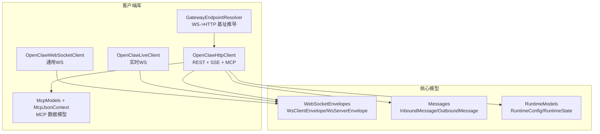
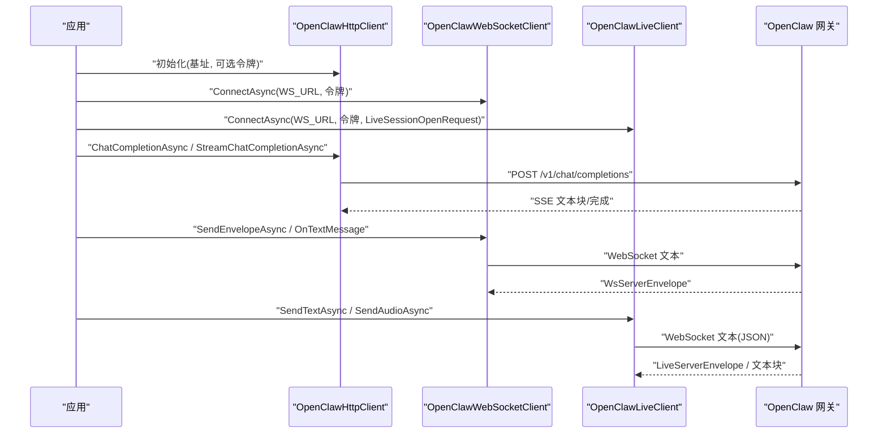
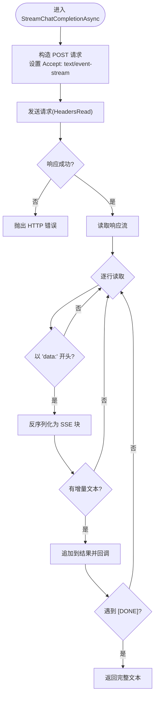
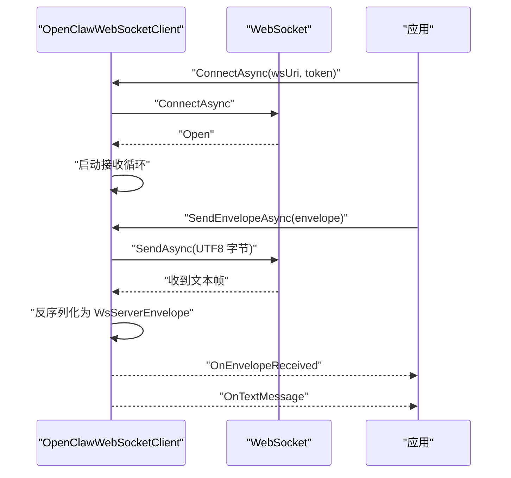
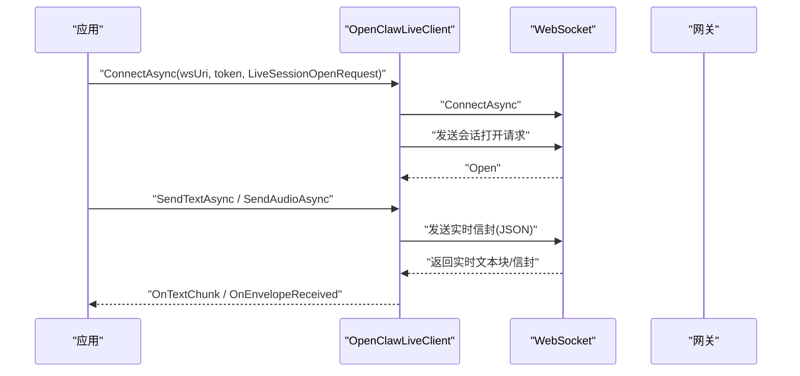
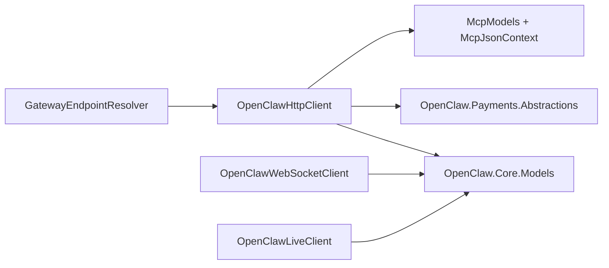

# 客户端库

<cite>
**本文引用的文件**
- [OpenClaw.Client.csproj](file://src/OpenClaw.Client/OpenClaw.Client.csproj)
- [OpenClawHttpClient.cs](file://src/OpenClaw.Client/OpencLawHttpClient.cs)
- [OpenClawWebSocketClient.cs](file://src/OpenClaw.Client/OpenClawWebSocketClient.cs)
- [OpenClawLiveClient.cs](file://src/OpenClaw.Client/OpenClawLiveClient.cs)
- [McpModels.cs](file://src/OpenClaw.Client/McpModels.cs)
- [McpJsonContext.cs](file://src/OpenClaw.Client/McpJsonContext.cs)
- [GatewayEndpointResolver.cs](file://src/OpenClaw.Client/GatewayEndpointResolver.cs)
- [WebSocketEnvelopes.cs](file://src/OpenClaw.Core/Models/WebSocketEnvelopes.cs)
- [Messages.cs](file://src/OpenClaw.Core/Models/Messages.cs)
- [RuntimeModels.cs](file://src/OpenClaw.Core/Models/RuntimeModels.cs)
</cite>

## 目录
1. [简介](#简介)
2. [项目结构](#项目结构)
3. [核心组件](#核心组件)
4. [架构总览](#架构总览)
5. [详细组件分析](#详细组件分析)
6. [依赖关系分析](#依赖关系分析)
7. [性能考量](#性能考量)
8. [故障排查指南](#故障排查指南)
9. [结论](#结论)
10. [附录](#附录)

## 简介
本文件为 OpenClaw.NET 客户端库的技术文档，面向需要在 .NET 应用中集成 OpenClaw 网关的开发者。内容覆盖：
- 客户端架构设计与职责边界
- HTTP 客户端实现（OpenClawHttpClient）
- WebSocket 客户端（OpenClawWebSocketClient）与实时会话客户端（OpenClawLiveClient）
- MCP 客户端能力与消息模型
- 认证方式、连接管理、错误处理与重连策略
- 与网关服务的通信协议、消息格式与事件处理
- 配置选项、SDK 使用示例与最佳实践

## 项目结构
客户端库位于 src/OpenClaw.Client，核心由以下模块组成：
- HTTP 客户端：封装 REST API 调用、SSE 流式响应、MCP RPC 调用
- WebSocket 客户端：通用聊天/控制通道
- 实时 Live 客户端：语音/文本实时交互通道
- MCP 模型与 JSON 上下文：MCP 协议数据结构与序列化
- 网关端点解析器：从 WebSocket URL 推导 HTTP 基地址
- 核心模型：WebSocket 信封、消息、运行时配置等

图示来源
- [OpenClawHttpClient.cs:10-185](file://src/OpenClaw.Client/OpencLawHttpClient.cs#L10-L185)
- [OpenClawWebSocketClient.cs:9-248](file://src/OpenClaw.Client/OpenClawWebSocketClient.cs#L9-L248)
- [OpenClawLiveClient.cs:9-303](file://src/OpenClaw.Client/OpenClawLiveClient.cs#L9-L303)
- [McpModels.cs:1-187](file://src/OpenClaw.Client/McpModels.cs#L1-L187)
- [McpJsonContext.cs:1-39](file://src/OpenClaw.Client/McpJsonContext.cs#L1-L39)
- [GatewayEndpointResolver.cs:3-39](file://src/OpenClaw.Client/GatewayEndpointResolver.cs#L3-L39)
- [WebSocketEnvelopes.cs:7-108](file://src/OpenClaw.Core/Models/WebSocketEnvelopes.cs#L7-L108)
- [Messages.cs:6-61](file://src/OpenClaw.Core/Models/Messages.cs#L6-L61)
- [RuntimeModels.cs:11-69](file://src/OpenClaw.Core/Models/RuntimeModels.cs#L11-L69)

章节来源
- [OpenClaw.Client.csproj:1-16](file://src/OpenClaw.Client/OpenClaw.Client.csproj#L1-L16)

## 核心组件
- OpenClawHttpClient：提供 HTTP REST 接口、SSE 流式响应、MCP JSON-RPC 方法调用、支付与会话管理、审计与自动化等 API 的强类型封装。
- OpenClawWebSocketClient：通用 WebSocket 客户端，支持发送/接收文本与 JSON 信封、事件回调、最大消息大小限制与并发发送锁。
- OpenClawLiveClient：实时语音/文本交互 WebSocket 客户端，负责打开会话、发送文本/音频片段、中断与关闭会话，并处理实时文本块与服务器信封。
- MCP 模型与 JSON 上下文：定义 MCP 初始化、工具、资源、提示等请求/响应结构及序列化上下文。
- GatewayEndpointResolver：根据 WebSocket URL 推导对应的 HTTP 基地址，便于在同一网关上复用 HTTP 与 WS。

章节来源
- [OpenClawHttpClient.cs:10-185](file://src/OpenClaw.Client/OpencLawHttpClient.cs#L10-L185)
- [OpenClawWebSocketClient.cs:9-248](file://src/OpenClaw.Client/OpenClawWebSocketClient.cs#L9-L248)
- [OpenClawLiveClient.cs:9-303](file://src/OpenClaw.Client/OpenClawLiveClient.cs#L9-L303)
- [McpModels.cs:1-187](file://src/OpenClaw.Client/McpModels.cs#L1-L187)
- [McpJsonContext.cs:1-39](file://src/OpenClaw.Client/McpJsonContext.cs#L1-L39)
- [GatewayEndpointResolver.cs:3-39](file://src/OpenClaw.Client/GatewayEndpointResolver.cs#L3-L39)

## 架构总览
客户端通过统一的基地址与路径构造 HTTP/WS 端点，支持 Bearer Token 认证；HTTP 客户端负责 REST 与 SSE，WebSocket 客户端用于通用双向通信，Live 客户端用于实时语音/文本交互。

图示来源
- [OpenClawHttpClient.cs:184-260](file://src/OpenClaw.Client/OpencLawHttpClient.cs#L184-L260)
- [OpenClawWebSocketClient.cs:38-156](file://src/OpenClaw.Client/OpenClawWebSocketClient.cs#L38-L156)
- [OpenClawLiveClient.cs:60-123](file://src/OpenClaw.Client/OpenClawLiveClient.cs#L60-L123)
- [WebSocketEnvelopes.cs:7-108](file://src/OpenClaw.Core/Models/WebSocketEnvelopes.cs#L7-L108)

## 详细组件分析

### OpenClawHttpClient（HTTP 客户端）
职责与能力
- 维护 HTTP 客户端实例与各端点 URI（聊天补全、MCP、集成 API、管理 API、支付等）
- 支持 Bearer Token 默认头注入
- 提供同步与流式聊天补全（SSE）
- 封装 MCP JSON-RPC 方法（initialize、tools/list、resources/*、prompts/*、tools/call）
- 提供支付相关 API（虚拟卡签发、执行支付、状态查询）
- 提供会话、账户、后端、自动化、工作流、内存等集成与管理 API
- 内部构建与参数化 URI，支持分页、过滤与查询

关键接口与流程
- 构造函数：校验基址、生成端点 URI、设置默认 UA 与可选认证头
- ChatCompletionAsync：POST /v1/chat/completions，可选预设头
- StreamChatCompletionAsync：SSE 流式读取，逐行解析 data: 行，拼接文本
- MCP 方法：SendMcpAsync/SendMcpWithoutParamsAsync，统一 JSON-RPC 请求/响应
- 支付 API：IssueVirtualCardAsync、ExecuteMachinePaymentAsync、GetPaymentStatusAsync
- 会话与账户：StartBackendSessionAsync、SendBackendInputAsync、StopBackendSessionAsync、StreamBackendEventsAsync
- 其他：GetIntegration*、ListSessionsAsync、SearchSessionsAsync、ListMemoryNotesAsync、Export/Import Memory、共享 Harness 状态、自动化模板与运行、工作流执行等

图示来源
- [OpenClawHttpClient.cs:204-260](file://src/OpenClaw.Client/OpencLawHttpClient.cs#L204-L260)

章节来源
- [OpenClawHttpClient.cs:91-182](file://src/OpenClaw.Client/OpencLawHttpClient.cs#L91-L182)
- [OpenClawHttpClient.cs:187-202](file://src/OpenClaw.Client/OpencLawHttpClient.cs#L187-L202)
- [OpenClawHttpClient.cs:204-260](file://src/OpenClaw.Client/OpencLawHttpClient.cs#L204-L260)
- [OpenClawHttpClient.cs:262-320](file://src/OpenClaw.Client/OpencLawHttpClient.cs#L262-L320)
- [OpenClawHttpClient.cs:328-359](file://src/OpenClaw.Client/OpencLawHttpClient.cs#L328-L359)
- [OpenClawHttpClient.cs:476-510](file://src/OpenClaw.Client/OpencLawHttpClient.cs#L476-L510)
- [OpenClawHttpClient.cs:517-543](file://src/OpenClaw.Client/OpencLawHttpClient.cs#L517-L543)
- [OpenClawHttpClient.cs:583-591](file://src/OpenClaw.Client/OpencLawHttpClient.cs#L583-L591)
- [OpenClawHttpClient.cs:612-622](file://src/OpenClaw.Client/OpencawHttpClient.cs#L612-L622)

### OpenClawWebSocketClient（通用 WebSocket 客户端）
职责与能力
- 连接/断开管理：ConnectAsync/DisconnectAsync，带取消与清理
- 发送：SendEnvelopeAsync/SendUserMessageAsync，带并发锁与消息大小限制
- 接收：ReceiveLoopAsync，聚合分片消息，反序列化为 WsServerEnvelope 并触发事件
- 事件：OnTextMessage、OnEnvelopeReceived、OnError
- 线程安全：内部锁保护状态，发送锁保证串行发送

图示来源
- [OpenClawWebSocketClient.cs:38-156](file://src/OpenClaw.Client/OpenClawWebSocketClient.cs#L38-L156)
- [OpenClawWebSocketClient.cs:158-227](file://src/OpenClaw.Client/OpenClawWebSocketClient.cs#L158-L227)
- [WebSocketEnvelopes.cs:7-108](file://src/OpenClaw.Core/Models/WebSocketEnvelopes.cs#L7-L108)

章节来源
- [OpenClawWebSocketClient.cs:9-117](file://src/OpenClaw.Client/OpenClawWebSocketClient.cs#L9-L117)
- [OpenClawWebSocketClient.cs:119-156](file://src/OpenClaw.Client/OpenClawWebSocketClient.cs#L119-L156)
- [OpenClawWebSocketClient.cs:158-227](file://src/OpenClaw.Client/OpenClawWebSocketClient.cs#L158-L227)
- [WebSocketEnvelopes.cs:7-108](file://src/OpenClaw.Core/Models/WebSocketEnvelopes.cs#L7-L108)

### OpenClawLiveClient（实时 WebSocket 客户端）
职责与能力
- 会话生命周期：ConnectAsync（含 LiveSessionOpenRequest）、CloseSessionAsync、DisconnectAsync
- 发送能力：SendTextAsync、SendAudioAsync、InterruptAsync
- 接收能力：ReceiveLoopAsync，区分文本块与服务器信封，触发 OnTextChunk 与 OnEnvelopeReceived
- 最大消息大小限制与并发发送锁
- 事件：OnTextChunk、OnEnvelopeReceived、OnError

图示来源
- [OpenClawLiveClient.cs:60-123](file://src/OpenClaw.Client/OpenClawLiveClient.cs#L60-L123)
- [OpenClawLiveClient.cs:185-210](file://src/OpenClaw.Client/OpenClawLiveClient.cs#L185-L210)
- [OpenClawLiveClient.cs:212-282](file://src/OpenClaw.Client/OpenClawLiveClient.cs#L212-L282)

章节来源
- [OpenClawLiveClient.cs:9-32](file://src/OpenClaw.Client/OpenClawLiveClient.cs#L9-L32)
- [OpenClawLiveClient.cs:38-87](file://src/OpenClaw.Client/OpenClawLiveClient.cs#L38-L87)
- [OpenClawLiveClient.cs:89-123](file://src/OpenClaw.Client/OpenClawLiveClient.cs#L89-L123)
- [OpenClawLiveClient.cs:185-282](file://src/OpenClaw.Client/OpenClawLiveClient.cs#L185-L282)

### MCP 客户端与模型
能力概述
- 初始化：MCP initialize，协商协议版本与能力
- 工具：列出工具、调用工具（参数为 JsonElement）
- 资源：列出资源、模板、读取资源
- 提示：列出提示、获取提示（支持参数）

```mermaid
classDiagram
class McpInitializeRequest {
+string ProtocolVersion
+McpClientCapabilities Capabilities
+McpClientInfo ClientInfo
}
class McpClientCapabilities {
+bool Tools_ListChanged
+bool Resources_ListChanged
+bool Resources_SupportsTemplates
+bool Prompts_ListChanged
}
class McpClientInfo {
+string Name
+string Version
}
class McpInitializeResult {
+string ProtocolVersion
+McpCapabilities Capabilities
+McpServerInfo ServerInfo
}
class McpCapabilities {
+McpToolCapabilities Tools
+McpResourceCapabilities Resources
+McpPromptCapabilities Prompts
}
class McpToolCapabilities
class McpResourceCapabilities
class McpPromptCapabilities
class McpServerInfo {
+string Name
+string Version
}
class McpCallToolRequest {
+string Name
+JsonElement Arguments
}
class McpToolDefinition {
+string Name
+string Description
+JsonElement InputSchema
}
class McpToolListResult {
+McpToolDefinition[] Tools
}
class McpResourceDefinition {
+string Uri
+string Name
+string Description
+string MimeType
}
class McpResourceListResult {
+McpResourceDefinition[] Resources
}
class McpResourceTemplateDefinition {
+string UriTemplate
+string Name
+string Description
+string MimeType
}
class McpResourceTemplateListResult {
+McpResourceTemplateDefinition[] ResourceTemplates
}
class McpReadResourceRequest {
+string Uri
}
class McpReadResourceResult {
+McpResourceTextContents[] Contents
}
class McpPromptDefinition {
+string Name
+string Description
+McpPromptArgumentDefinition[] Arguments
}
class McpPromptArgumentDefinition {
+string Name
+string Description
+bool Required
}
class McpPromptListResult {
+McpPromptDefinition[] Prompts
}
class McpGetPromptRequest {
+string Name
+Dictionary~string,string~ Arguments
}
class McpPromptMessage {
+string Role
+McpTextContent Content
}
class McpGetPromptResult {
+string Description
+McpPromptMessage[] Messages
}
McpInitializeRequest --> McpClientCapabilities
McpInitializeRequest --> McpClientInfo
McpInitializeResult --> McpCapabilities
McpInitializeResult --> McpServerInfo
McpCapabilities --> McpToolCapabilities
McpCapabilities --> McpResourceCapabilities
McpCapabilities --> McpPromptCapabilities
McpToolListResult --> McpToolDefinition
McpResourceListResult --> McpResourceDefinition
McpResourceTemplateListResult --> McpResourceTemplateDefinition
McpReadResourceResult --> McpResourceTextContents
McpPromptListResult --> McpPromptDefinition
McpGetPromptResult --> McpPromptMessage
```

图示来源
- [McpModels.cs:27-187](file://src/OpenClaw.Client/McpModels.cs#L27-L187)
- [McpJsonContext.cs:5-38](file://src/OpenClaw.Client/McpJsonContext.cs#L5-L38)

章节来源
- [McpModels.cs:1-187](file://src/OpenClaw.Client/McpModels.cs#L1-L187)
- [McpJsonContext.cs:1-39](file://src/OpenClaw.Client/McpJsonContext.cs#L1-L39)

### 网关端点解析器（WS->HTTP 基址）
- TryResolveHttpBaseUrl：根据 WebSocket URL 推导对应 HTTP(S) 基地址，修正 scheme、port 与路径，确保与 WS 路径兼容
- 用途：当仅持有 WS 地址时，自动派生 HTTP 端点（如 /v1/chat/completions、/mcp 等）

章节来源
- [GatewayEndpointResolver.cs:3-39](file://src/OpenClaw.Client/GatewayEndpointResolver.cs#L3-L39)

### WebSocket 信封与消息模型
- WsClientEnvelope / WsServerEnvelope：用于 WebSocket 通道的 JSON 信封，承载消息类型、会话、审批、工件等扩展字段
- InboundMessage / OutboundMessage：入站/出站消息结构，包含渠道、发送者、会话、媒体等信息

章节来源
- [WebSocketEnvelopes.cs:7-108](file://src/OpenClaw.Core/Models/WebSocketEnvelopes.cs#L7-L108)
- [Messages.cs:6-61](file://src/OpenClaw.Core/Models/Messages.cs#L6-L61)

## 依赖关系分析
- OpenClawHttpClient 依赖：
  - OpenClaw.Core.Models（消息、WebSocket 信封、JSON 上下文）
  - OpenClaw.Payments.Abstractions（支付相关模型）
- OpenClawWebSocketClient / OpenClawLiveClient 依赖：
  - OpenClaw.Core.Models（WebSocket 信封）
- McpJsonContext 与 McpModels：自包含，供 HTTP 客户端进行 MCP 调用
- GatewayEndpointResolver：纯 URL 解析逻辑，无外部依赖

图示来源
- [OpenClawHttpClient.cs:1-10](file://src/OpenClaw.Client/OpencLawHttpClient.cs#L1-L10)
- [OpenClawWebSocketClient.cs:1-6](file://src/OpenClaw.Client/OpenClawWebSocketClient.cs#L1-L6)
- [OpenClawLiveClient.cs:1-6](file://src/OpenClaw.Client/OpenClawLiveClient.cs#L1-L6)
- [McpJsonContext.cs:1-39](file://src/OpenClaw.Client/McpJsonContext.cs#L1-L39)
- [GatewayEndpointResolver.cs:1-39](file://src/OpenClaw.Client/GatewayEndpointResolver.cs#L1-L39)

章节来源
- [OpenClaw.Client.csproj:11-14](file://src/OpenClaw.Client/OpenClaw.Client.csproj#L11-L14)

## 性能考量
- HTTP 客户端
  - 使用 HttpClient 并设置超时为无限，避免长 SSE/WS 会话被截断
  - SSE 流式读取采用 UTF-8 流读取器与合理缓冲区大小，降低内存峰值
  - 预设头支持按需选择模型/后端，减少不必要的路由开销
- WebSocket/Live 客户端
  - 发送前加锁，避免并发写导致帧交错
  - 设置最大消息字节数，防止异常大包占用内存
  - 接收循环使用共享缓冲池与 ArrayBufferWriter，减少 GC 压力
- MCP 调用
  - 使用 System.Text.Json Source Generation，避免反射带来的性能损耗
  - 参数为 JsonElement，支持灵活传参与最小序列化成本

## 故障排查指南
常见问题与定位要点
- 认证失败
  - 确认 Bearer Token 是否正确设置于 HTTP 默认头或 WS 连接头
  - 检查网关端点解析是否正确（WS->HTTP 基址）
- 连接异常
  - WebSocket/Live 客户端在未连接状态下发送会抛出异常，检查 IsConnected 或捕获异常
  - 断线后需重新 ConnectAsync；断开时确保 DisconnectAsync 清理资源
- 消息过大
  - 客户端对消息长度有限制，超过阈值会抛出异常；请拆分或压缩
- SSE 流解析错误
  - 若 data 行格式异常，会抛出解析异常；检查网关输出格式一致性
- MCP 调用失败
  - 检查方法名与参数类型；确认网关已初始化并返回能力列表

章节来源
- [OpenClawWebSocketClient.cs:135-149](file://src/OpenClaw.Client/OpenClawWebSocketClient.cs#L135-L149)
- [OpenClawLiveClient.cs:189-203](file://src/OpenClaw.Client/OpenClawLiveClient.cs#L189-L203)
- [OpenClawHttpClient.cs:242-249](file://src/OpenClaw.Client/OpencLawHttpClient.cs#L242-L249)
- [OpenClawHttpClient.cs:276-278](file://src/OpenClaw.Client/OpencLawHttpClient.cs#L276-L278)
- [OpenClawHttpClient.cs:311-313](file://src/OpenClaw.Client/OpencLawHttpClient.cs#L311-L313)

## 结论
本客户端库提供了统一、类型安全且高性能的 .NET 客户端接入方案，覆盖 HTTP REST、SSE、WebSocket 与实时交互，并内置 MCP 协议支持。通过明确的认证、连接管理与错误处理机制，能够满足从简单聊天到复杂自动化与实时语音/文本交互的多种场景需求。

## 附录

### 配置选项与使用要点
- 基础配置
  - 基地址：HTTP 与 WS 使用同一基地址；若仅有 WS 地址，可用 GatewayEndpointResolver 推导 HTTP 基址
  - 认证：通过 Bearer Token 头注入；WebSocket/Live 连接时同样设置 Authorization 头
- 连接管理
  - HTTP：保持长连接，注意超时设置；SSE 流式读取时避免阻塞
  - WebSocket/Live：先 ConnectAsync，再发送消息；断开时调用 DisconnectAsync
- 事件与回调
  - WebSocket/Live：订阅 OnTextMessage/OnTextChunk、OnEnvelopeReceived、OnError 获取实时反馈
- MCP
  - 先调用 initialize，再列举工具/资源/提示；调用工具时使用 JsonElement 传递参数

章节来源
- [GatewayEndpointResolver.cs:3-39](file://src/OpenClaw.Client/GatewayEndpointResolver.cs#L3-L39)
- [OpenClawWebSocketClient.cs:38-57](file://src/OpenClaw.Client/OpenClawWebSocketClient.cs#L38-L57)
- [OpenClawLiveClient.cs:60-87](file://src/OpenClaw.Client/OpenClawLiveClient.cs#L60-L87)
- [OpenClawHttpClient.cs:262-269](file://src/OpenClaw.Client/OpencLawHttpClient.cs#L262-L269)