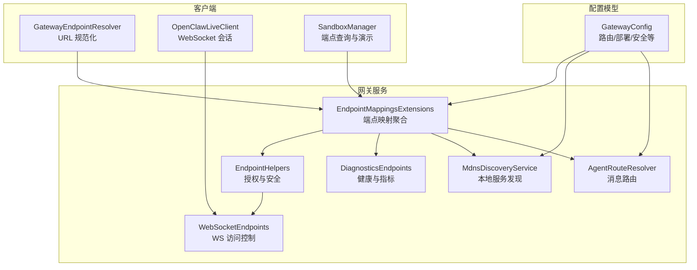
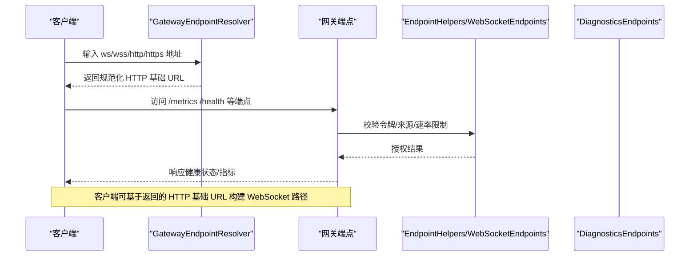
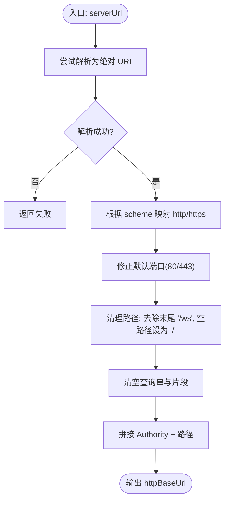
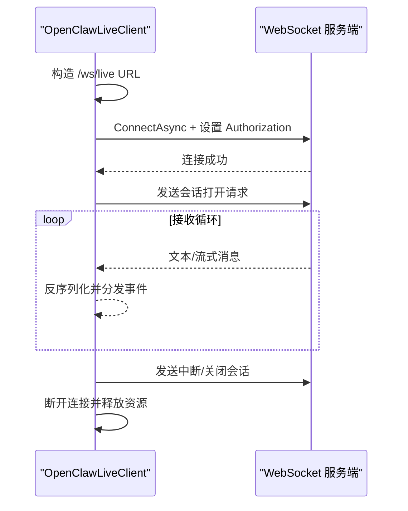
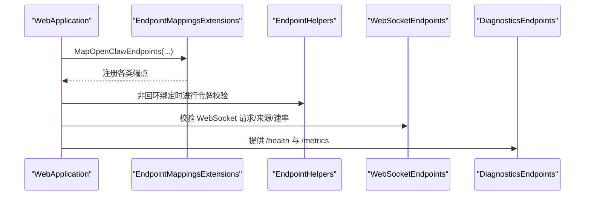
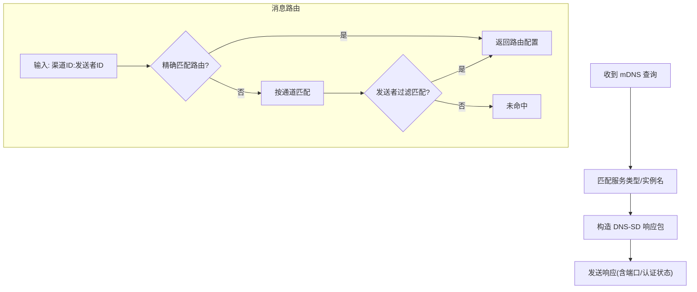
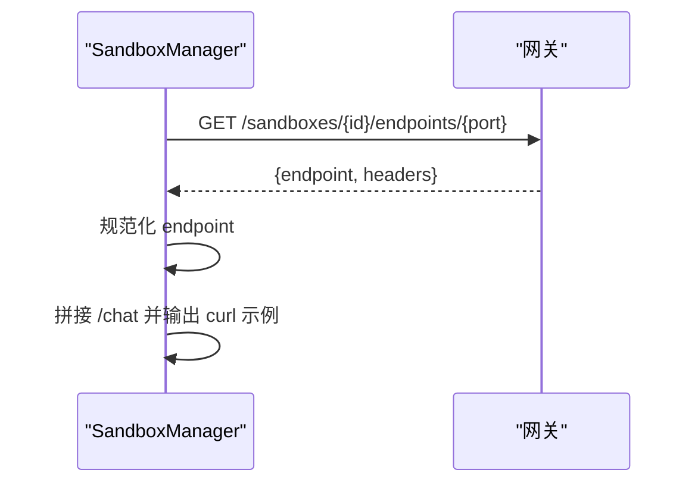
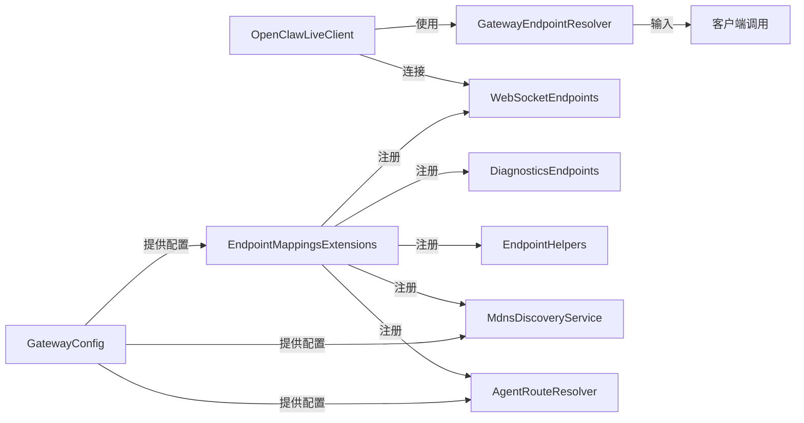

# 网关端点解析器

<cite>
**本文档引用的文件**
- [GatewayEndpointResolver.cs](file://src/OpenClaw.Client/GatewayEndpointResolver.cs)
- [SandboxManager.cs](file://src/OpenClaw.SandboxDemo/SandboxManager.cs)
- [OpenClawLiveClient.cs](file://src/OpenClaw.Client/OpenClawLiveClient.cs)
- [GatewayConfig.cs](file://src/OpenClaw.Core/Models/GatewayConfig.cs)
- [EndpointMappingsExtensions.cs](file://src/OpenClaw.Gateway/Endpoints/EndpointMappingsExtensions.cs)
- [EndpointHelpers.cs](file://src/OpenClaw.Gateway/Endpoints/EndpointHelpers.cs)
- [WebSocketEndpoints.cs](file://src/OpenClaw.Gateway/Endpoints/WebSocketEndpoints.cs)
- [MdnsDiscoveryService.cs](file://src/OpenClaw.Gateway/Integrations/MdnsDiscoveryService.cs)
- [DiagnosticsEndpoints.cs](file://src/OpenClaw.Gateway/Endpoints/DiagnosticsEndpoints.cs)
- [Extensions.cs](file://Kingcrab.ServiceDefaults/Extensions.cs)
- [AgentRouteResolver.cs](file://src/OpenClaw.Gateway/Integrations/AgentRouteResolver.cs)
</cite>

## 目录
1. [简介](#简介)
2. [项目结构](#项目结构)
3. [核心组件](#核心组件)
4. [架构总览](#架构总览)
5. [详细组件分析](#详细组件分析)
6. [依赖关系分析](#依赖关系分析)
7. [性能考虑](#性能考虑)
8. [故障排查指南](#故障排查指南)
9. [结论](#结论)
10. [附录](#附录)

## 简介
本文件面向“网关端点解析器”的设计与实现，系统性阐述 GatewayEndpointResolver 的职责边界、解析逻辑、与网关集群的交互机制、端点发现与 URL 构建、负载均衡与故障转移策略、配置管理与动态更新、健康检查与运维监控等关键能力。同时提供静态配置、动态发现、错误处理等使用示例，并给出性能优化与故障恢复建议。

## 项目结构
围绕端点解析与网关交互的关键模块分布如下：
- 客户端侧：端点解析与 WebSocket 连接封装（GatewayEndpointResolver、OpenClawLiveClient）
- 网关侧：端点映射、安全校验、诊断与健康检查（EndpointMappingsExtensions、EndpointHelpers、WebSocketEndpoints、DiagnosticsEndpoints）
- 配置模型：端点解析与路由、部署模式、mDNS 发现等（GatewayConfig、MdnsDiscoveryService）
- 辅助工具：沙箱端点查询与演示（SandboxManager）

**图表来源**
- [GatewayEndpointResolver.cs:1-39](file://src/OpenClaw.Client/GatewayEndpointResolver.cs#L1-L39)
- [OpenClawLiveClient.cs:1-303](file://src/OpenClaw.Client/OpenClawLiveClient.cs#L1-L303)
- [SandboxManager.cs:390-493](file://src/OpenClaw.SandboxDemo/SandboxManager.cs#L390-L493)
- [EndpointMappingsExtensions.cs:1-26](file://src/OpenClaw.Gateway/Endpoints/EndpointMappingsExtensions.cs#L1-L26)
- [EndpointHelpers.cs:1-46](file://src/OpenClaw.Gateway/Endpoints/EndpointHelpers.cs#L1-L46)
- [WebSocketEndpoints.cs:68-106](file://src/OpenClaw.Gateway/Endpoints/WebSocketEndpoints.cs#L68-L106)
- [DiagnosticsEndpoints.cs:51-80](file://src/OpenClaw.Gateway/Endpoints/DiagnosticsEndpoints.cs#L51-L80)
- [MdnsDiscoveryService.cs:1-130](file://src/OpenClaw.Gateway/Integrations/MdnsDiscoveryService.cs#L1-L130)
- [AgentRouteResolver.cs:1-42](file://src/OpenClaw.Gateway/Integrations/AgentRouteResolver.cs#L1-L42)
- [GatewayConfig.cs:833-898](file://src/OpenClaw.Core/Models/GatewayConfig.cs#L833-L898)

**章节来源**
- [GatewayEndpointResolver.cs:1-39](file://src/OpenClaw.Client/GatewayEndpointResolver.cs#L1-L39)
- [OpenClawLiveClient.cs:1-303](file://src/OpenClaw.Client/OpenClawLiveClient.cs#L1-L303)
- [SandboxManager.cs:390-493](file://src/OpenClaw.SandboxDemo/SandboxManager.cs#L390-L493)
- [EndpointMappingsExtensions.cs:1-26](file://src/OpenClaw.Gateway/Endpoints/EndpointMappingsExtensions.cs#L1-L26)
- [EndpointHelpers.cs:1-46](file://src/OpenClaw.Gateway/Endpoints/EndpointHelpers.cs#L1-L46)
- [WebSocketEndpoints.cs:68-106](file://src/OpenClaw.Gateway/Endpoints/WebSocketEndpoints.cs#L68-L106)
- [DiagnosticsEndpoints.cs:51-80](file://src/OpenClaw.Gateway/Endpoints/DiagnosticsEndpoints.cs#L51-L80)
- [MdnsDiscoveryService.cs:1-130](file://src/OpenClaw.Gateway/Integrations/MdnsDiscoveryService.cs#L1-L130)
- [AgentRouteResolver.cs:1-42](file://src/OpenClaw.Gateway/Integrations/AgentRouteResolver.cs#L1-L42)
- [GatewayConfig.cs:833-898](file://src/OpenClaw.Core/Models/GatewayConfig.cs#L833-L898)

## 核心组件
- GatewayEndpointResolver：负责从任意协议的服务器地址中提取并规范化 HTTP 基础 URL，确保后续 HTTP/WebSocket 路由一致。
- OpenClawLiveClient：封装 WebSocket 连接、消息收发、断线重连与错误事件，支持构建标准的 /ws/live 路径。
- EndpointMappingsExtensions：将各类端点（诊断、OpenAI 兼容接口、集成通道、WebSocket 等）统一注册到应用管道。
- EndpointHelpers/WebSocketEndpoints：在非回环绑定时进行令牌校验、来源校验与速率限制，保障公网暴露的安全性。
- DiagnosticsEndpoints：提供健康检查与运行指标端点，支撑运维监控与自动扩缩容。
- MdnsDiscoveryService：通过 mDNS/DNS-SD 在局域网内广播网关实例，辅助端点发现。
- AgentRouteResolver：基于渠道与发送者匹配的路由解析，用于消息分流与模型选择。
- GatewayConfig：集中式配置模型，涵盖路由、部署、安全、多代理发现等，是端点解析与路由决策的依据。

**章节来源**
- [GatewayEndpointResolver.cs:1-39](file://src/OpenClaw.Client/GatewayEndpointResolver.cs#L1-L39)
- [OpenClawLiveClient.cs:1-303](file://src/OpenClaw.Client/OpenClawLiveClient.cs#L1-L303)
- [EndpointMappingsExtensions.cs:1-26](file://src/OpenClaw.Gateway/Endpoints/EndpointMappingsExtensions.cs#L1-L26)
- [EndpointHelpers.cs:1-46](file://src/OpenClaw.Gateway/Endpoints/EndpointHelpers.cs#L1-L46)
- [WebSocketEndpoints.cs:68-106](file://src/OpenClaw.Gateway/Endpoints/WebSocketEndpoints.cs#L68-L106)
- [DiagnosticsEndpoints.cs:51-80](file://src/OpenClaw.Gateway/Endpoints/DiagnosticsEndpoints.cs#L51-L80)
- [MdnsDiscoveryService.cs:1-130](file://src/OpenClaw.Gateway/Integrations/MdnsDiscoveryService.cs#L1-L130)
- [AgentRouteResolver.cs:1-42](file://src/OpenClaw.Gateway/Integrations/AgentRouteResolver.cs#L1-L42)
- [GatewayConfig.cs:833-898](file://src/OpenClaw.Core/Models/GatewayConfig.cs#L833-L898)

## 架构总览
下图展示端点解析器在整体系统中的位置与交互路径：客户端通过解析器获取 HTTP 基础 URL，随后通过网关端点进行认证与路由；网关侧通过统一映射与安全中间件完成请求接入与健康监控。

**图表来源**
- [GatewayEndpointResolver.cs:5-37](file://src/OpenClaw.Client/GatewayEndpointResolver.cs#L5-L37)
- [EndpointHelpers.cs:35-45](file://src/OpenClaw.Gateway/Endpoints/EndpointHelpers.cs#L35-L45)
- [WebSocketEndpoints.cs:68-106](file://src/OpenClaw.Gateway/Endpoints/WebSocketEndpoints.cs#L68-L106)
- [DiagnosticsEndpoints.cs:51-80](file://src/OpenClaw.Gateway/Endpoints/DiagnosticsEndpoints.cs#L51-L80)

## 详细组件分析

### 组件一：GatewayEndpointResolver（端点解析器）
- 设计目的
  - 将任意协议（ws/wss/http/https）输入转换为规范化的 HTTP 基础 URL，剥离 /ws 后缀，修正默认端口，去除查询串与片段，保证后续 HTTP 与 WebSocket 路由一致性。
- 解析逻辑
  - 协议转换：ws → http，wss → https，保留 http/https。
  - 默认端口修正：当为默认端口且原协议为 ws/wss 时，分别映射为 80/443。
  - 路径清理：移除末尾 “/ws”，空路径归一化为 “/”。
  - 输出：Authority + 规范化路径。
- 复杂度与性能
  - 时间复杂度 O(1)，空间复杂度 O(1)，解析开销极低。
- 错误处理
  - 非绝对 URI 直接返回失败，避免无效输入导致的歧义。
- 使用场景
  - 客户端首次连接前，从用户提供的 ws/wss 地址推导出 HTTP 基础 URL，用于健康检查、指标查询与后续 WebSocket 路径拼接。

**图表来源**
- [GatewayEndpointResolver.cs:5-37](file://src/OpenClaw.Client/GatewayEndpointResolver.cs#L5-L37)

**章节来源**
- [GatewayEndpointResolver.cs:1-39](file://src/OpenClaw.Client/GatewayEndpointResolver.cs#L1-L39)

### 组件二：OpenClawLiveClient（WebSocket 客户端）
- 功能概述
  - 提供 WebSocket 连接生命周期管理、消息发送/接收、错误事件回调、最大消息大小限制与并发发送锁。
  - 支持从 HTTP 基础 URL 构造标准的 /ws/live 路径。
- 关键流程
  - 连接建立：设置 Authorization 头（如提供），发送会话打开请求。
  - 消息收发：文本/音频/中断/关闭会话等信封类型。
  - 断开与释放：取消接收循环、等待退出、关闭连接、释放资源。
- 与端点解析器协作
  - 使用 GatewayEndpointResolver 规范化后的 HTTP 基础 URL，再拼接 /ws/live 形成 WebSocket 地址。
- 性能与可靠性
  - 内部使用共享缓冲区与信号量，避免频繁分配与并发冲突。
  - 超大消息直接拒绝，防止内存压力。

**图表来源**
- [OpenClawLiveClient.cs:38-87](file://src/OpenClaw.Client/OpenClawLiveClient.cs#L38-L87)
- [OpenClawLiveClient.cs:212-282](file://src/OpenClaw.Client/OpenClawLiveClient.cs#L212-L282)

**章节来源**
- [OpenClawLiveClient.cs:1-303](file://src/OpenClaw.Client/OpenClawLiveClient.cs#L1-L303)

### 组件三：端点映射与安全（EndpointMappingsExtensions、EndpointHelpers、WebSocketEndpoints）
- 端点映射聚合
  - 将诊断、OpenAI 兼容接口、集成通道、WebSocket、Webhook、合约等端点统一注册，避免分散配置带来的遗漏。
- 安全与访问控制
  - EndpointHelpers：在非回环绑定时，要求携带有效令牌或满足组织策略。
  - WebSocketEndpoints：校验 WebSocket 请求、来源白名单、令牌有效性与速率限制，拒绝非法连接。
- 健康与指标
  - DiagnosticsEndpoints：提供 /health 与 /metrics 端点，支持就绪检查与运行时指标上报。

**图表来源**
- [EndpointMappingsExtensions.cs:8-25](file://src/OpenClaw.Gateway/Endpoints/EndpointMappingsExtensions.cs#L8-L25)
- [EndpointHelpers.cs:35-45](file://src/OpenClaw.Gateway/Endpoints/EndpointHelpers.cs#L35-L45)
- [WebSocketEndpoints.cs:68-106](file://src/OpenClaw.Gateway/Endpoints/WebSocketEndpoints.cs#L68-L106)
- [DiagnosticsEndpoints.cs:51-80](file://src/OpenClaw.Gateway/Endpoints/DiagnosticsEndpoints.cs#L51-L80)

**章节来源**
- [EndpointMappingsExtensions.cs:1-26](file://src/OpenClaw.Gateway/Endpoints/EndpointMappingsExtensions.cs#L1-L26)
- [EndpointHelpers.cs:1-46](file://src/OpenClaw.Gateway/Endpoints/EndpointHelpers.cs#L1-L46)
- [WebSocketEndpoints.cs:68-106](file://src/OpenClaw.Gateway/Endpoints/WebSocketEndpoints.cs#L68-L106)
- [DiagnosticsEndpoints.cs:51-80](file://src/OpenClaw.Gateway/Endpoints/DiagnosticsEndpoints.cs#L51-L80)

### 组件四：端点发现与路由（MdnsDiscoveryService、AgentRouteResolver、GatewayConfig）
- mDNS 服务发现
  - 在 IPv4/IPv6 多播组上监听查询，按需响应服务记录，广播网关实例名、端口与认证需求，便于局域网内自动发现。
- 消息路由
  - 基于渠道与发送者精确匹配，支持通道级匹配与发送者过滤，结合模型配置与预设进行分流。
- 配置驱动
  - RoutingConfig/Routes 定义路由规则，GatewayConfig 集中承载部署模式、安全策略与发现开关，影响端点可达性与访问控制。

**图表来源**
- [MdnsDiscoveryService.cs:161-198](file://src/OpenClaw.Gateway/Integrations/MdnsDiscoveryService.cs#L161-L198)
- [AgentRouteResolver.cs:21-42](file://src/OpenClaw.Gateway/Integrations/AgentRouteResolver.cs#L21-L42)
- [GatewayConfig.cs:833-851](file://src/OpenClaw.Core/Models/GatewayConfig.cs#L833-L851)

**章节来源**
- [MdnsDiscoveryService.cs:1-130](file://src/OpenClaw.Gateway/Integrations/MdnsDiscoveryService.cs#L1-L130)
- [AgentRouteResolver.cs:1-42](file://src/OpenClaw.Gateway/Integrations/AgentRouteResolver.cs#L1-L42)
- [GatewayConfig.cs:833-898](file://src/OpenClaw.Core/Models/GatewayConfig.cs#L833-L898)

### 组件五：沙箱端点查询（SandboxManager）
- 功能概述
  - 通过 HTTP 请求向网关查询指定沙箱的可用端点与路由头，解析 JSON 并生成 curl 示例，便于快速验证。
- 关键步骤
  - 组装 URL：/sandboxes/{sandboxId}/endpoints/{port}
  - 解析响应：endpoint 字段作为基础 URL，headers 字典作为额外请求头
  - 规范化与拼接：对 endpoint 进行 URL 正规化，拼接 /chat 等路径进行演示
- 错误处理
  - 非 2xx 状态码输出错误信息；异常捕获并提示

**图表来源**
- [SandboxManager.cs:419-481](file://src/OpenClaw.SandboxDemo/SandboxManager.cs#L419-L481)

**章节来源**
- [SandboxManager.cs:390-493](file://src/OpenClaw.SandboxDemo/SandboxManager.cs#L390-L493)

## 依赖关系分析
- 客户端依赖
  - GatewayEndpointResolver 依赖标准 URI 解析与字符串处理，零外部依赖，高度可移植。
  - OpenClawLiveClient 依赖系统 WebSocket 客户端与 JSON 序列化上下文，耦合于 CoreJsonContext。
- 网关侧依赖
  - EndpointMappingsExtensions 聚合各端点模块，依赖启动上下文与运行时对象。
  - EndpointHelpers/WebSocketEndpoints 依赖安全策略与速率限制服务。
  - DiagnosticsEndpoints 依赖运行时指标与会话管理。
  - MdnsDiscoveryService 依赖网络套接字与日志。
  - AgentRouteResolver 依赖路由配置。
- 配置依赖
  - GatewayConfig 作为单一真相源，被路由、部署、安全、mDNS 等模块读取。

**图表来源**
- [GatewayEndpointResolver.cs:1-39](file://src/OpenClaw.Client/GatewayEndpointResolver.cs#L1-L39)
- [OpenClawLiveClient.cs:1-303](file://src/OpenClaw.Client/OpenClawLiveClient.cs#L1-L303)
- [EndpointMappingsExtensions.cs:1-26](file://src/OpenClaw.Gateway/Endpoints/EndpointMappingsExtensions.cs#L1-L26)
- [EndpointHelpers.cs:1-46](file://src/OpenClaw.Gateway/Endpoints/EndpointHelpers.cs#L1-L46)
- [WebSocketEndpoints.cs:68-106](file://src/OpenClaw.Gateway/Endpoints/WebSocketEndpoints.cs#L68-L106)
- [DiagnosticsEndpoints.cs:51-80](file://src/OpenClaw.Gateway/Endpoints/DiagnosticsEndpoints.cs#L51-L80)
- [MdnsDiscoveryService.cs:1-130](file://src/OpenClaw.Gateway/Integrations/MdnsDiscoveryService.cs#L1-L130)
- [AgentRouteResolver.cs:1-42](file://src/OpenClaw.Gateway/Integrations/AgentRouteResolver.cs#L1-L42)
- [GatewayConfig.cs:833-898](file://src/OpenClaw.Core/Models/GatewayConfig.cs#L833-L898)

**章节来源**
- [GatewayEndpointResolver.cs:1-39](file://src/OpenClaw.Client/GatewayEndpointResolver.cs#L1-L39)
- [OpenClawLiveClient.cs:1-303](file://src/OpenClaw.Client/OpenClawLiveClient.cs#L1-L303)
- [EndpointMappingsExtensions.cs:1-26](file://src/OpenClaw.Gateway/Endpoints/EndpointMappingsExtensions.cs#L1-L26)
- [EndpointHelpers.cs:1-46](file://src/OpenClaw.Gateway/Endpoints/EndpointHelpers.cs#L1-L46)
- [WebSocketEndpoints.cs:68-106](file://src/OpenClaw.Gateway/Endpoints/WebSocketEndpoints.cs#L68-L106)
- [DiagnosticsEndpoints.cs:51-80](file://src/OpenClaw.Gateway/Endpoints/DiagnosticsEndpoints.cs#L51-L80)
- [MdnsDiscoveryService.cs:1-130](file://src/OpenClaw.Gateway/Integrations/MdnsDiscoveryService.cs#L1-L130)
- [AgentRouteResolver.cs:1-42](file://src/OpenClaw.Gateway/Integrations/AgentRouteResolver.cs#L1-L42)
- [GatewayConfig.cs:833-898](file://src/OpenClaw.Core/Models/GatewayConfig.cs#L833-L898)

## 性能考虑
- 解析器开销极低：O(1) 时间与空间复杂度，适合高频调用。
- WebSocket 客户端
  - 使用共享缓冲区与信号量，减少 GC 压力与并发竞争。
  - 最大消息长度限制可防止内存膨胀与 DoS。
- 网关端点
  - 速率限制与来源校验在请求早期拦截，降低后端压力。
  - 健康与指标端点采用轻量序列化与缓存策略，避免阻塞主业务。
- mDNS
  - 缓存广告地址 TTL 控制，降低重复广播频率。

[本节为通用性能建议，无需特定文件引用]

## 故障排查指南
- 端点无法解析
  - 检查输入是否为绝对 URI；确认协议为 ws/wss/http/https。
  - 若返回空值，表示输入不合法，需修正地址格式。
- WebSocket 连接失败
  - 确认网关处于非回环绑定时的令牌配置正确。
  - 检查来源白名单与速率限制阈值。
  - 使用 /health 与 /metrics 确认网关健康状态与会话数。
- 局域网内找不到网关
  - 检查 MdnsConfig.Enabled 与 ServiceType 是否正确。
  - 确认防火墙未阻止多播端口。
- 沙箱端点查询异常
  - 查看 HTTP 状态码与响应体；确认沙箱 ID 与端口正确。
  - 如出现异常，查看控制台输出的错误信息。

**章节来源**
- [GatewayEndpointResolver.cs:1-39](file://src/OpenClaw.Client/GatewayEndpointResolver.cs#L1-L39)
- [EndpointHelpers.cs:35-45](file://src/OpenClaw.Gateway/Endpoints/EndpointHelpers.cs#L35-L45)
- [WebSocketEndpoints.cs:68-106](file://src/OpenClaw.Gateway/Endpoints/WebSocketEndpoints.cs#L68-L106)
- [DiagnosticsEndpoints.cs:51-80](file://src/OpenClaw.Gateway/Endpoints/DiagnosticsEndpoints.cs#L51-L80)
- [MdnsDiscoveryService.cs:1-130](file://src/OpenClaw.Gateway/Integrations/MdnsDiscoveryService.cs#L1-L130)
- [SandboxManager.cs:419-481](file://src/OpenClaw.SandboxDemo/SandboxManager.cs#L419-L481)

## 结论
GatewayEndpointResolver 以极简设计实现了从任意协议地址到 HTTP 基础 URL 的标准化转换，为客户端与网关侧的端点发现、安全接入与健康监控提供了统一入口。配合网关端的统一映射、安全校验与 mDNS 发现，形成从配置驱动到动态发现再到运维可观测的完整闭环。建议在生产环境中启用令牌校验、来源白名单与速率限制，并结合 /health 与 /metrics 实施自动化运维。

[本节为总结性内容，无需特定文件引用]

## 附录

### 使用示例

- 静态配置场景
  - 客户端持有固定网关地址（如 wss://gw.example.com:443/ws），通过解析器得到 HTTP 基础 URL，再拼接 /metrics 与 /chat 进行访问与对话。
  - 参考路径：[GatewayEndpointResolver.TryResolveHttpBaseUrl:5-37](file://src/OpenClaw.Client/GatewayEndpointResolver.cs#L5-L37)

- 动态发现场景
  - 通过 mDNS 广播的服务名与端口，结合 EndpointHelpers 的令牌校验，完成安全接入。
  - 参考路径：[MdnsDiscoveryService.Start:54-104](file://src/OpenClaw.Gateway/Integrations/MdnsDiscoveryService.cs#L54-L104)

- 沙箱端点查询
  - 调用 /sandboxes/{id}/endpoints/{port} 获取 endpoint 与 headers，生成 curl 示例进行验证。
  - 参考路径：[SandboxManager.PrintGatewayAccessInfoAsync:419-481](file://src/OpenClaw.SandboxDemo/SandboxManager.cs#L419-L481)

- 错误处理
  - 非 2xx 状态码与异常均会被捕获并输出，便于定位问题。
  - 参考路径：[SandboxManager.PrintGatewayAccessInfoAsync:429-480](file://src/OpenClaw.SandboxDemo/SandboxManager.cs#L429-L480)

**章节来源**
- [GatewayEndpointResolver.cs:1-39](file://src/OpenClaw.Client/GatewayEndpointResolver.cs#L1-L39)
- [MdnsDiscoveryService.cs:54-104](file://src/OpenClaw.Gateway/Integrations/MdnsDiscoveryService.cs#L54-L104)
- [SandboxManager.cs:419-481](file://src/OpenClaw.SandboxDemo/SandboxManager.cs#L419-L481)

### 配置管理与运维要点
- 配置模型
  - 路由与模型选择：RoutingConfig/Routes 与模型配置决定消息分流与模型切换。
  - 部署与安全：Deployment.Mode、Security.*、MdnsConfig 影响端点可达性与访问控制。
- 运维监控
  - /health 与 /metrics 提供健康与指标；开发环境默认开放健康检查端点。
  - 参考路径：[DiagnosticsEndpoints:51-80](file://src/OpenClaw.Gateway/Endpoints/DiagnosticsEndpoints.cs#L51-L80)、[Extensions.MapDefaultEndpoints:128-146](file://Kingcrab.ServiceDefaults/Extensions.cs#L128-L146)

**章节来源**
- [GatewayConfig.cs:833-898](file://src/OpenClaw.Core/Models/GatewayConfig.cs#L833-L898)
- [DiagnosticsEndpoints.cs:51-80](file://src/OpenClaw.Gateway/Endpoints/DiagnosticsEndpoints.cs#L51-L80)
- [Extensions.cs:128-146](file://Kingcrab.ServiceDefaults/Extensions.cs#L128-L146)