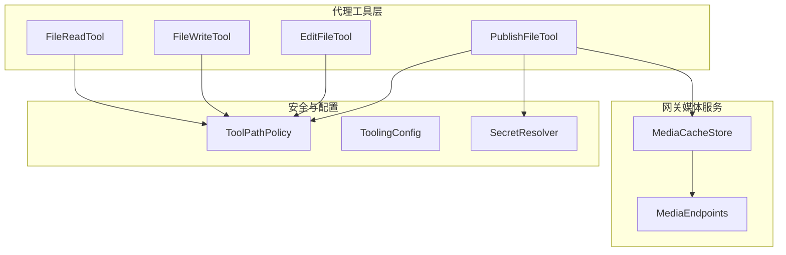
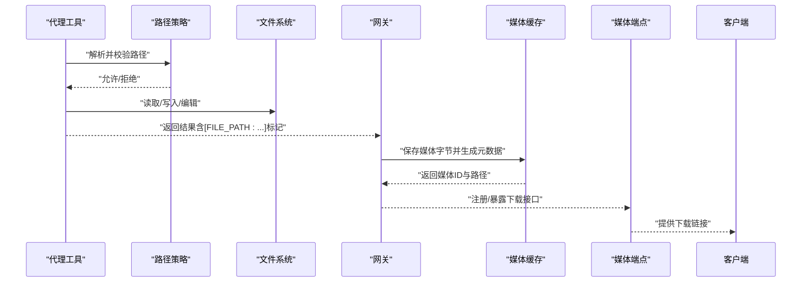
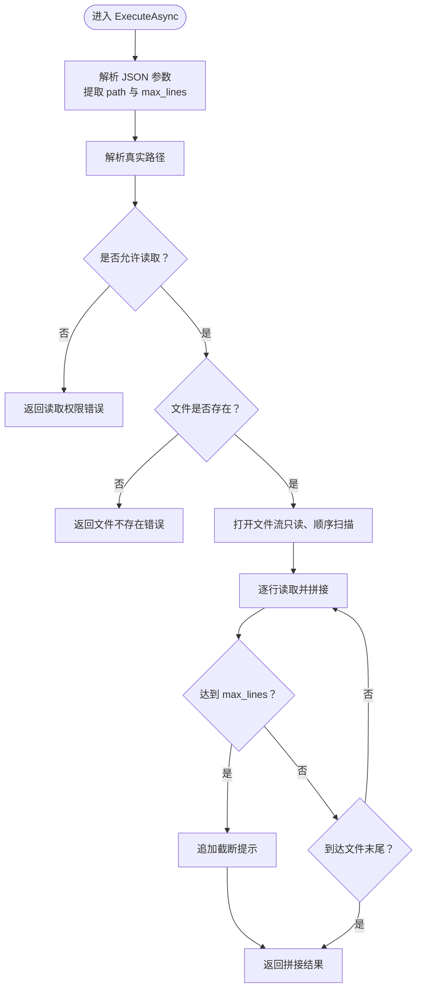
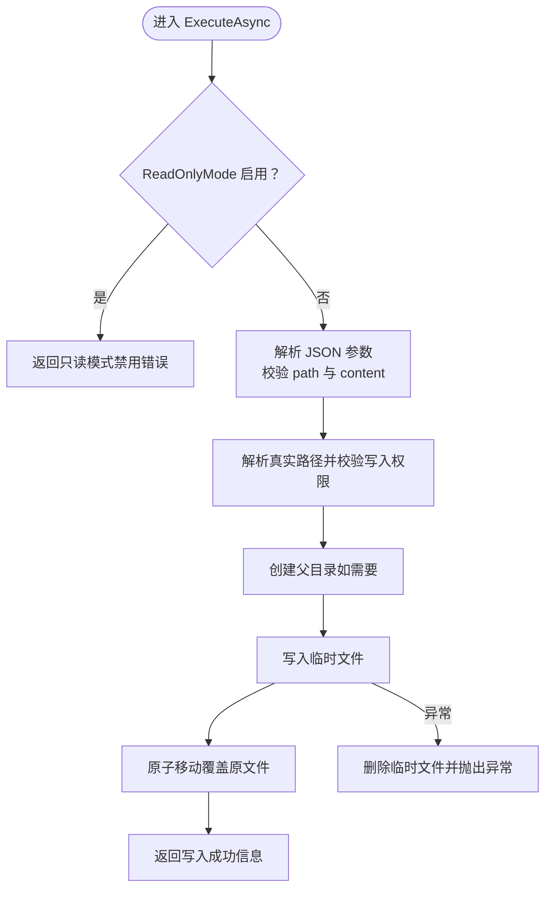
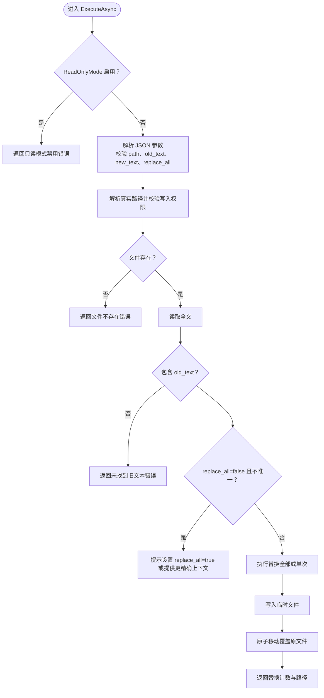
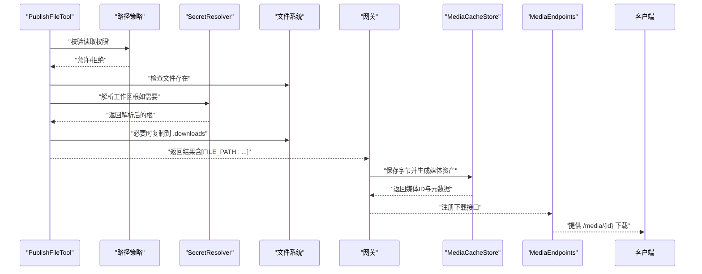
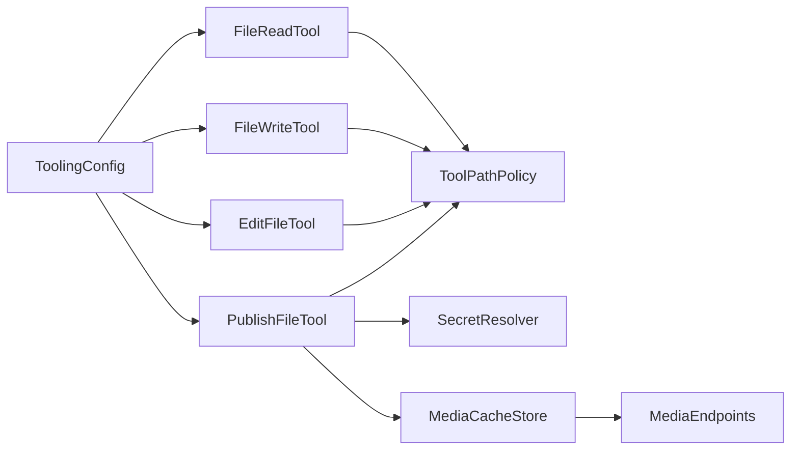

# 文件操作工具

<cite>
**本文引用的文件**
- [FileReadTool.cs](file://src/OpenClaw.Agent/Tools/FileReadTool.cs)
- [FileWriteTool.cs](file://src/OpenClaw.Agent/Tools/FileWriteTool.cs)
- [EditFileTool.cs](file://src/OpenClaw.Agent/Tools/EditFileTool.cs)
- [PublishFileTool.cs](file://src/OpenClaw.Agent/Tools/PublishFileTool.cs)
- [ToolingConfig.cs](file://src/OpenClaw.Core/Models/GatewayConfig.cs)
- [ToolPathPolicy.cs](file://src/OpenClaw.Core/Security/ToolPathPolicy.cs)
- [SecretResolver.cs](file://src/OpenClaw.Core/Security/SecretResolver.cs)
- [MediaCacheStore.cs](file://src/OpenClaw.Gateway/MediaCacheStore.cs)
- [MediaEndpoints.cs](file://src/OpenClaw.Gateway/Endpoints/MediaEndpoints.cs)
- [FileReadToolTests.cs](file://src/OpenClaw.Tests/FileReadToolTests.cs)
- [ToolPathPolicyTests.cs](file://src/OpenClaw.Tests/ToolPathPolicyTests.cs)
</cite>

## 目录
1. [简介](#简介)
2. [项目结构](#项目结构)
3. [核心组件](#核心组件)
4. [架构总览](#架构总览)
5. [详细组件分析](#详细组件分析)
6. [依赖关系分析](#依赖关系分析)
7. [性能考虑](#性能考虑)
8. [故障排除指南](#故障排除指南)
9. [结论](#结论)
10. [附录](#附录)

## 简介
本文件面向“文件操作工具”的技术文档，聚焦以下四个工具：
- 文件读取工具（FileReadTool）
- 文件写入工具（FileWriteTool）
- 文件编辑工具（EditFileTool）
- 文件发布工具（PublishFileTool）

文档从参数配置、路径解析与安全策略、内容读写与格式化、错误处理与性能优化等维度进行系统说明，并结合实际代码实现给出使用示例、最佳实践与安全注意事项。

## 项目结构
文件操作工具位于代理侧工具集，围绕“路径策略”“配置模型”“安全解析器”以及“网关媒体缓存”协作完成本地文件的读取、写入、编辑与发布。

图表来源
- [FileReadTool.cs:1-66](file://src/OpenClaw.Agent/Tools/FileReadTool.cs#L1-L66)
- [FileWriteTool.cs:1-58](file://src/OpenClaw.Agent/Tools/FileWriteTool.cs#L1-L58)
- [EditFileTool.cs:1-108](file://src/OpenClaw.Agent/Tools/EditFileTool.cs#L1-L108)
- [PublishFileTool.cs:1-131](file://src/OpenClaw.Agent/Tools/PublishFileTool.cs#L1-L131)
- [ToolPathPolicy.cs:1-136](file://src/OpenClaw.Core/Security/ToolPathPolicy.cs#L1-L136)
- [ToolingConfig.cs:412-457](file://src/OpenClaw.Core/Models/GatewayConfig.cs#L412-L457)
- [SecretResolver.cs:14-65](file://src/OpenClaw.Core/Security/SecretResolver.cs#L14-L65)
- [MediaCacheStore.cs:6-43](file://src/OpenClaw.Gateway/MediaCacheStore.cs#L6-L43)
- [MediaEndpoints.cs:34-68](file://src/OpenClaw.Gateway/Endpoints/MediaEndpoints.cs#L34-L68)

章节来源
- [FileReadTool.cs:1-66](file://src/OpenClaw.Agent/Tools/FileReadTool.cs#L1-L66)
- [FileWriteTool.cs:1-58](file://src/OpenClaw.Agent/Tools/FileWriteTool.cs#L1-L58)
- [EditFileTool.cs:1-108](file://src/OpenClaw.Agent/Tools/EditFileTool.cs#L1-L108)
- [PublishFileTool.cs:1-131](file://src/OpenClaw.Agent/Tools/PublishFileTool.cs#L1-L131)
- [ToolingConfig.cs:412-457](file://src/OpenClaw.Core/Models/GatewayConfig.cs#L412-L457)

## 核心组件
- FileReadTool：读取文件内容，支持最大行数限制，避免上下文溢出；通过路径策略校验读取权限；异步顺序扫描读取，按需截断。
- FileWriteTool：写入文件，自动创建父目录；采用临时文件+原子移动策略，保证一致性；受只读模式与路径策略约束。
- EditFileTool：小范围文本替换，支持单次或全部替换；严格校验旧文本唯一性，避免误替换；同样采用临时文件+原子移动。
- PublishFileTool：将文件发布为可下载资源；若源文件不在允许写入根目录，则复制到工作区“.downloads”后再发布；返回标记供网关扫描并生成下载链接。

章节来源
- [FileReadTool.cs:19-64](file://src/OpenClaw.Agent/Tools/FileReadTool.cs#L19-L64)
- [FileWriteTool.cs:19-56](file://src/OpenClaw.Agent/Tools/FileWriteTool.cs#L19-L56)
- [EditFileTool.cs:19-82](file://src/OpenClaw.Agent/Tools/EditFileTool.cs#L19-L82)
- [PublishFileTool.cs:37-78](file://src/OpenClaw.Agent/Tools/PublishFileTool.cs#L37-L78)

## 架构总览
文件发布链路的关键流程如下：

图表来源
- [PublishFileTool.cs:37-78](file://src/OpenClaw.Agent/Tools/PublishFileTool.cs#L37-L78)
- [MediaCacheStore.cs:16-40](file://src/OpenClaw.Gateway/MediaCacheStore.cs#L16-L40)
- [MediaEndpoints.cs:62-68](file://src/OpenClaw.Gateway/Endpoints/MediaEndpoints.cs#L62-L68)

## 详细组件分析

### 文件读取工具（FileReadTool）
- 参数与模式
  - 必填：path（绝对或相对路径）
  - 可选：max_lines（默认200，最小1，最大5000），用于限制输出长度，防止上下文膨胀
- 路径解析与权限
  - 使用路径策略解析真实路径并校验读取权限
  - 若路径不存在或无权限，返回错误信息
- 内容读取与格式化
  - 异步顺序读取（SequentialScan），逐行拼接
  - 达到max_lines后追加截断提示
- 错误处理
  - 输入参数缺失或非法时返回明确错误
  - 文件不存在或权限不足时返回相应错误
- 性能特性
  - 流式读取，适合大文件
  - 字符串构建容量预设，减少扩容
- 使用示例（路径参考）
  - [FileReadTool.cs:19-64](file://src/OpenClaw.Agent/Tools/FileReadTool.cs#L19-L64)
  - [FileReadToolTests.cs:10-43](file://src/OpenClaw.Tests/FileReadToolTests.cs#L10-L43)

图表来源
- [FileReadTool.cs:19-64](file://src/OpenClaw.Agent/Tools/FileReadTool.cs#L19-L64)

章节来源
- [FileReadTool.cs:15-17](file://src/OpenClaw.Agent/Tools/FileReadTool.cs#L15-L17)
- [FileReadTool.cs:19-64](file://src/OpenClaw.Agent/Tools/FileReadTool.cs#L19-L64)
- [FileReadToolTests.cs:10-43](file://src/OpenClaw.Tests/FileReadToolTests.cs#L10-L43)

### 文件写入工具（FileWriteTool）
- 参数与模式
  - 必填：path、content
  - 受只读模式影响：开启时直接拒绝
- 路径解析与权限
  - 解析真实路径，校验写入权限
- 写入策略
  - 先创建父目录，再写入临时文件，最后原子移动覆盖目标
  - 失败时尝试清理临时文件，确保环境整洁
- 错误处理
  - 参数缺失、空值、权限不足、写入异常均返回明确错误
- 安全与可靠性
  - 原子写入避免部分写入
  - 临时文件命名避免冲突
- 使用示例（路径参考）
  - [FileWriteTool.cs:19-56](file://src/OpenClaw.Agent/Tools/FileWriteTool.cs#L19-L56)

图表来源
- [FileWriteTool.cs:19-56](file://src/OpenClaw.Agent/Tools/FileWriteTool.cs#L19-L56)

章节来源
- [FileWriteTool.cs:15-17](file://src/OpenClaw.Agent/Tools/FileWriteTool.cs#L15-L17)
- [FileWriteTool.cs:19-56](file://src/OpenClaw.Agent/Tools/FileWriteTool.cs#L19-L56)

### 文件编辑工具（EditFileTool）
- 参数与模式
  - 必填：path、old_text、new_text
  - 可选：replace_all（默认false）
- 编辑策略
  - 仅当 old_text 存在于文件中才继续
  - replace_all=false 时要求 old_text 在文件中唯一，否则提示设置 replace_all 或提供更精确上下文
  - 支持单次替换与全部替换两种模式
- 写入策略
  - 读取全文 → 替换 → 写入临时文件 → 原子移动
- 错误处理
  - 参数缺失、old_text 不存在、非唯一且未启用 replace_all、权限不足、写入失败等均有明确错误
- 使用示例（路径参考）
  - [EditFileTool.cs:19-82](file://src/OpenClaw.Agent/Tools/EditFileTool.cs#L19-L82)

图表来源
- [EditFileTool.cs:19-82](file://src/OpenClaw.Agent/Tools/EditFileTool.cs#L19-L82)

章节来源
- [EditFileTool.cs:15-17](file://src/OpenClaw.Agent/Tools/EditFileTool.cs#L15-L17)
- [EditFileTool.cs:19-82](file://src/OpenClaw.Agent/Tools/EditFileTool.cs#L19-L82)

### 文件发布工具（PublishFileTool）
- 参数与模式
  - 必填：path（已存在的文件绝对路径）
- 发布流程
  - 解析真实路径并校验读取权限
  - 若文件已在允许写入根目录内，直接发布；否则复制到工作区“.downloads”后再发布
  - 返回包含文件名、大小与“[FILE_PATH:...]”标记的结果
- 访问控制与缓存策略
  - 下载目录由配置解析并经路径策略校验
  - 网关扫描结果中的标记，将文件字节写入媒体缓存，生成可访问的下载链接
- 使用示例（路径参考）
  - [PublishFileTool.cs:37-78](file://src/OpenClaw.Agent/Tools/PublishFileTool.cs#L37-L78)
  - [MediaCacheStore.cs:16-40](file://src/OpenClaw.Gateway/MediaCacheStore.cs#L16-L40)
  - [MediaEndpoints.cs:62-68](file://src/OpenClaw.Gateway/Endpoints/MediaEndpoints.cs#L62-L68)

图表来源
- [PublishFileTool.cs:37-78](file://src/OpenClaw.Agent/Tools/PublishFileTool.cs#L37-L78)
- [SecretResolver.cs:24-54](file://src/OpenClaw.Core/Security/SecretResolver.cs#L24-L54)
- [MediaCacheStore.cs:16-40](file://src/OpenClaw.Gateway/MediaCacheStore.cs#L16-L40)
- [MediaEndpoints.cs:62-68](file://src/OpenClaw.Gateway/Endpoints/MediaEndpoints.cs#L62-L68)

章节来源
- [PublishFileTool.cs:25-35](file://src/OpenClaw.Agent/Tools/PublishFileTool.cs#L25-L35)
- [PublishFileTool.cs:37-78](file://src/OpenClaw.Agent/Tools/PublishFileTool.cs#L37-L78)
- [SecretResolver.cs:14-65](file://src/OpenClaw.Core/Security/SecretResolver.cs#L14-L65)
- [MediaEndpoints.cs:62-68](file://src/OpenClaw.Gateway/Endpoints/MediaEndpoints.cs#L62-L68)

## 依赖关系分析
- 工具与路径策略
  - 所有文件工具均依赖路径策略进行读/写权限判定与真实路径解析
- 配置模型
  - ToolingConfig 提供自治模式、只读模式、允许根、审批策略、超时与并行执行等全局配置
- 安全解析器
  - SecretResolver 统一解析工作区根等敏感配置项
- 网关媒体服务
  - MediaCacheStore 与 MediaEndpoints 负责媒体资产持久化与下载接口

图表来源
- [FileReadTool.cs:25-28](file://src/OpenClaw.Agent/Tools/FileReadTool.cs#L25-L28)
- [FileWriteTool.cs:34-37](file://src/OpenClaw.Agent/Tools/FileWriteTool.cs#L34-L37)
- [EditFileTool.cs:43-46](file://src/OpenClaw.Agent/Tools/EditFileTool.cs#L43-L46)
- [PublishFileTool.cs:48-51](file://src/OpenClaw.Agent/Tools/PublishFileTool.cs#L48-L51)
- [ToolingConfig.cs:412-457](file://src/OpenClaw.Core/Models/GatewayConfig.cs#L412-L457)
- [SecretResolver.cs:24-54](file://src/OpenClaw.Core/Security/SecretResolver.cs#L24-L54)
- [MediaCacheStore.cs:6-43](file://src/OpenClaw.Gateway/MediaCacheStore.cs#L6-L43)
- [MediaEndpoints.cs:34-68](file://src/OpenClaw.Gateway/Endpoints/MediaEndpoints.cs#L34-L68)

章节来源
- [ToolingConfig.cs:412-457](file://src/OpenClaw.Core/Models/GatewayConfig.cs#L412-L457)
- [ToolPathPolicy.cs:1-136](file://src/OpenClaw.Core/Security/ToolPathPolicy.cs#L1-L136)
- [SecretResolver.cs:14-65](file://src/OpenClaw.Core/Security/SecretResolver.cs#L14-L65)
- [MediaCacheStore.cs:6-43](file://src/OpenClaw.Gateway/MediaCacheStore.cs#L6-L43)
- [MediaEndpoints.cs:34-68](file://src/OpenClaw.Gateway/Endpoints/MediaEndpoints.cs#L34-L68)

## 性能考虑
- 读取
  - 使用顺序扫描与异步流读取，适合大文件；max_lines 限制输出长度，避免上下文膨胀
- 写入与编辑
  - 采用临时文件+原子移动，避免部分写入；字符串替换在内存中进行，注意大文件的内存占用
- 发布
  - 复制到“.downloads”前先检查可写性；媒体缓存以文件形式存储，注意磁盘空间与IO开销
- 并行与超时
  - 配置支持并行工具执行与工具调用超时，合理设置可提升吞吐与稳定性

## 故障排除指南
- 权限问题
  - 读取/写入被拒绝：检查 ToolingConfig 的 AllowedReadRoots/AllowedWriteRoots 与路径策略
  - 参考：[ToolPathPolicyTests.cs:9-128](file://src/OpenClaw.Tests/ToolPathPolicyTests.cs#L9-L128)
- 文件不存在
  - 确认路径正确且文件存在；必要时先创建父目录（写入工具会自动创建）
- 只读模式
  - ReadOnlyMode 启用时，写入与编辑类工具会被拒绝
- 发布失败
  - 检查工作区根解析与“.downloads”目录可写性；确认网关已启动媒体缓存与端点
- 测试验证
  - 参考单元测试对读取行为与边界条件的覆盖
  - 参考：[FileReadToolTests.cs:10-43](file://src/OpenClaw.Tests/FileReadToolTests.cs#L10-L43)

章节来源
- [ToolPathPolicyTests.cs:9-128](file://src/OpenClaw.Tests/ToolPathPolicyTests.cs#L9-L128)
- [FileReadToolTests.cs:10-43](file://src/OpenClaw.Tests/FileReadToolTests.cs#L10-L43)

## 结论
文件操作工具围绕“安全路径策略+可靠写入流程+可发现的发布标记”构建，既满足日常开发场景，又兼顾安全性与可审计性。通过合理的配置与最佳实践，可在保障安全的前提下高效完成文件读取、写入、编辑与发布任务。

## 附录
- 最佳实践
  - 明确 AllowedReadRoots/AllowedWriteRoots，避免通配符滥用
  - 对大文件读取设置合适的 max_lines，防止上下文溢出
  - 写入与编辑优先使用原子移动策略，确保一致性
  - 发布文件前确认目标目录可写，必要时复制到“.downloads”
  - 合理设置 ToolingConfig 的只读模式与审批策略
- 安全注意事项
  - 避免路径穿越与符号链接逃逸，依赖路径策略的解析与校验
  - 对工作区根等敏感配置使用 SecretResolver 进行统一解析
  - 发布文件时注意文件内容与大小，避免敏感信息泄露