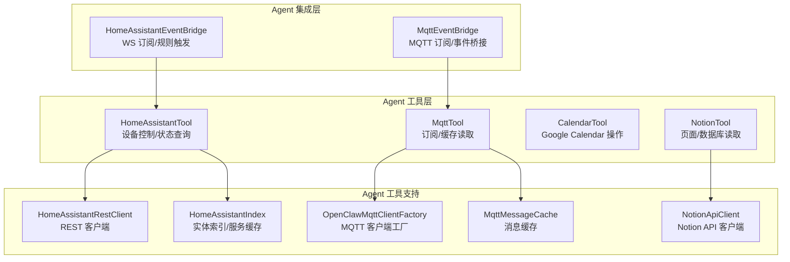
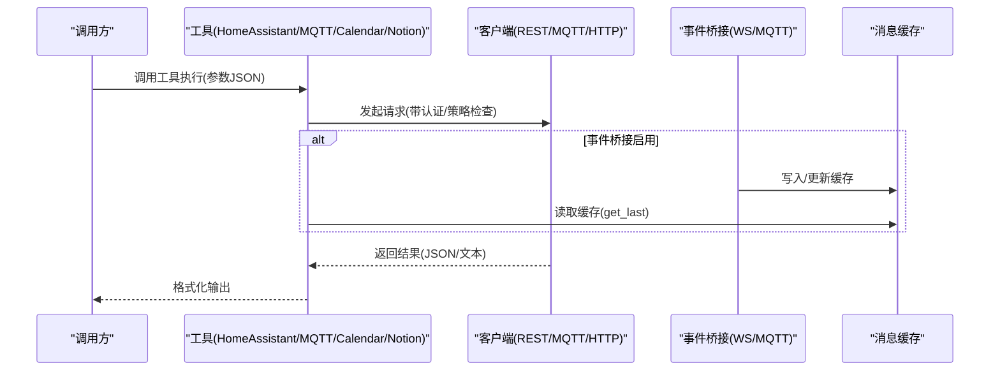
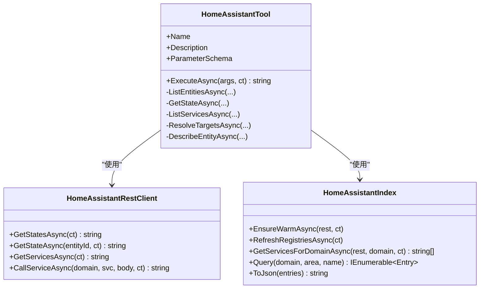
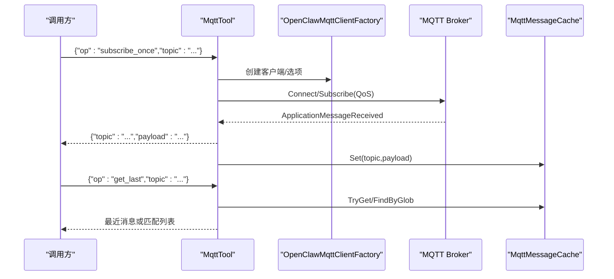
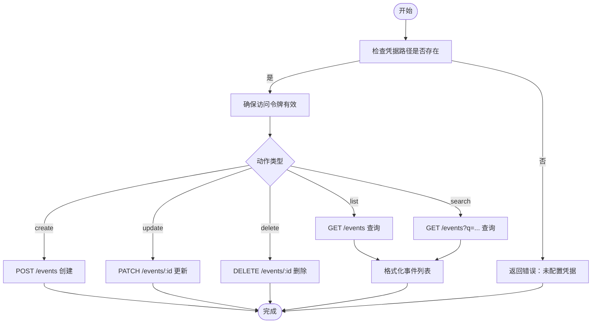
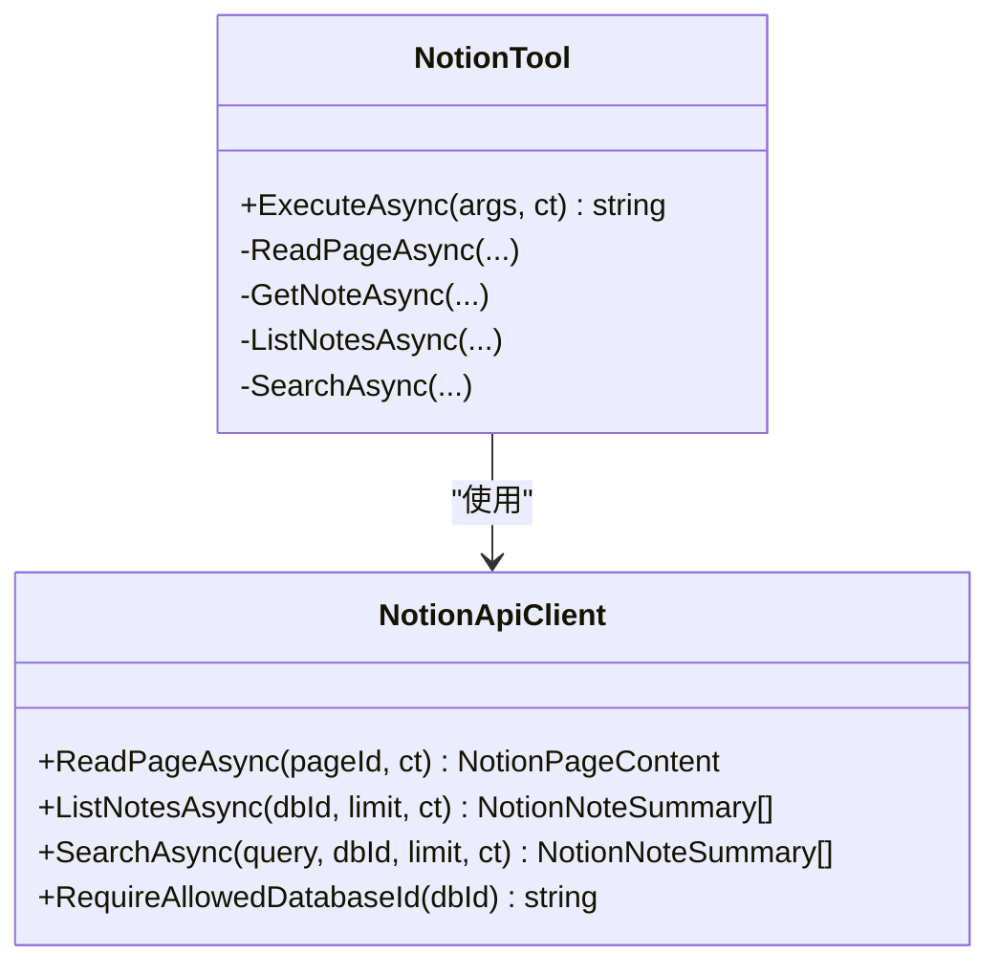
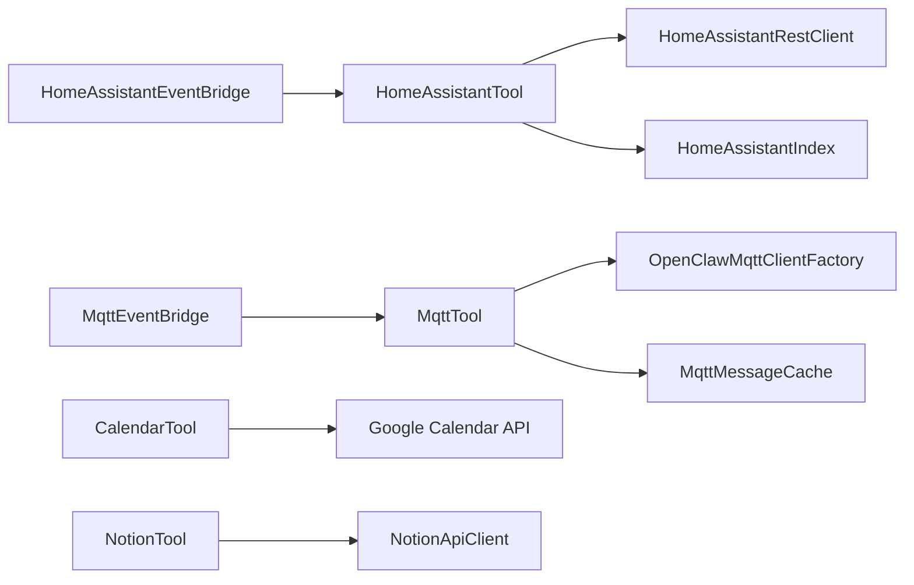

# 集成与自动化工具

<cite>
**本文引用的文件**
- [HomeAssistantTool.cs](file://src/OpenClaw.Agent/Tools/HomeAssistantTool.cs)
- [HomeAssistantRestClient.cs](file://src/OpenClaw.Agent/Tools/HomeAssistantRestClient.cs)
- [HomeAssistantIndex.cs](file://src/OpenClaw.Agent/Tools/HomeAssistantIndex.cs)
- [HomeAssistantEventBridge.cs](file://src/OpenClaw.Agent/Integrations/HomeAssistantEventBridge.cs)
- [MqttTool.cs](file://src/OpenClaw.Agent/Tools/MqttTool.cs)
- [MqttClientFactory.cs](file://src/OpenClaw.Agent/Tools/MqttClientFactory.cs)
- [MqttMessageCache.cs](file://src/OpenClaw.Agent/Tools/MqttMessageCache.cs)
- [MqttEventBridge.cs](file://src/OpenClaw.Agent/Integrations/MqttEventBridge.cs)
- [CalendarTool.cs](file://src/OpenClaw.Agent/Tools/CalendarTool.cs)
- [NotionTool.cs](file://src/OpenClaw.Agent/Tools/NotionTool.cs)
- [NotionApiClient.cs](file://src/OpenClaw.Agent/Tools/NotionApiClient.cs)
- [HomeAssistantToolTests.cs](file://src/OpenClaw.Tests/HomeAssistantToolTests.cs)
- [MqttToolTests.cs](file://src/OpenClaw.Tests/MqttToolTests.cs)
- [NotionToolTests.cs](file://src/OpenClaw.Tests/NotionToolTests.cs)
</cite>

## 目录
1. [简介](#简介)
2. [项目结构](#项目结构)
3. [核心组件](#核心组件)
4. [架构总览](#架构总览)
5. [详细组件分析](#详细组件分析)
6. [依赖关系分析](#依赖关系分析)
7. [性能考量](#性能考量)
8. [故障排除指南](#故障排除指南)
9. [结论](#结论)
10. [附录](#附录)

## 简介
本文件面向集成与自动化工具的使用者与维护者，系统性梳理以下工具的设计与实现：
- Home Assistant 工具：设备控制、状态监控与自动化规则触发
- MQTT 工具：消息发布、订阅管理与主题路由
- 日历工具：日程管理、事件同步与提醒机制
- Notion 工具：页面操作、数据库管理与协作功能

文档覆盖各工具的 API 配置、认证方式、连接管理、典型场景与故障排除方法，帮助读者快速上手并安全稳定地使用。

## 项目结构
本节聚焦与“集成与自动化工具”直接相关的核心文件与模块，展示其在 Agent 层的组织方式与职责划分。

图示来源
- [HomeAssistantTool.cs:9-282](file://src/OpenClaw.Agent/Tools/HomeAssistantTool.cs#L9-L282)
- [HomeAssistantRestClient.cs:10-154](file://src/OpenClaw.Agent/Tools/HomeAssistantRestClient.cs#L10-L154)
- [HomeAssistantIndex.cs:7-276](file://src/OpenClaw.Agent/Tools/HomeAssistantIndex.cs#L7-L276)
- [HomeAssistantEventBridge.cs:13-284](file://src/OpenClaw.Agent/Integrations/HomeAssistantEventBridge.cs#L13-L284)
- [MqttTool.cs:11-151](file://src/OpenClaw.Agent/Tools/MqttTool.cs#L11-L151)
- [MqttClientFactory.cs:8-34](file://src/OpenClaw.Agent/Tools/MqttClientFactory.cs#L8-L34)
- [MqttMessageCache.cs:5-33](file://src/OpenClaw.Agent/Tools/MqttMessageCache.cs#L5-L33)
- [MqttEventBridge.cs:14-192](file://src/OpenClaw.Agent/Integrations/MqttEventBridge.cs#L14-L192)
- [NotionTool.cs:8-168](file://src/OpenClaw.Agent/Tools/NotionTool.cs#L8-L168)
- [NotionApiClient.cs:14-800](file://src/OpenClaw.Agent/Tools/NotionApiClient.cs#L14-L800)

章节来源
- [HomeAssistantTool.cs:9-282](file://src/OpenClaw.Agent/Tools/HomeAssistantTool.cs#L9-L282)
- [MqttTool.cs:11-151](file://src/OpenClaw.Agent/Tools/MqttTool.cs#L11-L151)
- [CalendarTool.cs:14-405](file://src/OpenClaw.Agent/Tools/CalendarTool.cs#L14-L405)
- [NotionTool.cs:8-168](file://src/OpenClaw.Agent/Tools/NotionTool.cs#L8-L168)

## 核心组件
- HomeAssistantTool：提供只读查询能力（列出实体、读取状态、列举服务、解析目标、描述实体），内部通过 REST 客户端与实体索引实现。
- MqttTool：提供只读订阅能力（一次性订阅与读取缓存），内部通过 MQTT 客户端工厂与消息缓存实现。
- CalendarTool：基于 Google Calendar REST API 的日程管理，支持列出、搜索、创建、更新、删除事件，并内置 OAuth 令牌刷新逻辑。
- NotionTool：基于 Notion API 的页面与数据库读取，支持读取页面、按数据库列出笔记、搜索页面，并对访问范围进行白名单控制。

章节来源
- [HomeAssistantTool.cs:47-282](file://src/OpenClaw.Agent/Tools/HomeAssistantTool.cs#L47-L282)
- [MqttTool.cs:35-151](file://src/OpenClaw.Agent/Tools/MqttTool.cs#L35-L151)
- [CalendarTool.cs:79-405](file://src/OpenClaw.Agent/Tools/CalendarTool.cs#L79-L405)
- [NotionTool.cs:39-168](file://src/OpenClaw.Agent/Tools/NotionTool.cs#L39-L168)

## 架构总览
下图展示工具与基础设施的交互关系，包括认证、策略与桥接服务。

图示来源
- [HomeAssistantTool.cs:47-117](file://src/OpenClaw.Agent/Tools/HomeAssistantTool.cs#L47-L117)
- [MqttTool.cs:35-78](file://src/OpenClaw.Agent/Tools/MqttTool.cs#L35-L78)
- [MqttEventBridge.cs:105-147](file://src/OpenClaw.Agent/Integrations/MqttEventBridge.cs#L105-L147)
- [MqttMessageCache.cs:11-19](file://src/OpenClaw.Agent/Tools/MqttMessageCache.cs#L11-L19)
- [CalendarTool.cs:79-112](file://src/OpenClaw.Agent/Tools/CalendarTool.cs#L79-L112)
- [NotionTool.cs:39-69](file://src/OpenClaw.Agent/Tools/NotionTool.cs#L39-L69)

## 详细组件分析

### Home Assistant 工具
- 功能要点
  - 列出实体、读取状态、列举服务、解析目标、描述实体
  - 支持 JSON/文本两种输出格式
  - 基于实体索引与服务缓存提升查询效率
- 认证与连接
  - 使用 Bearer Token 进行 REST 认证
  - 可禁用 TLS 校验（开发调试）
- 自动化规则
  - 通过事件桥接订阅 Home Assistant 事件，按规则渲染消息并写入通道

图示来源
- [HomeAssistantTool.cs:9-282](file://src/OpenClaw.Agent/Tools/HomeAssistantTool.cs#L9-L282)
- [HomeAssistantRestClient.cs:10-154](file://src/OpenClaw.Agent/Tools/HomeAssistantRestClient.cs#L10-L154)
- [HomeAssistantIndex.cs:7-276](file://src/OpenClaw.Agent/Tools/HomeAssistantIndex.cs#L7-L276)

章节来源
- [HomeAssistantTool.cs:47-282](file://src/OpenClaw.Agent/Tools/HomeAssistantTool.cs#L47-L282)
- [HomeAssistantRestClient.cs:16-129](file://src/OpenClaw.Agent/Tools/HomeAssistantRestClient.cs#L16-L129)
- [HomeAssistantIndex.cs:36-124](file://src/OpenClaw.Agent/Tools/HomeAssistantIndex.cs#L36-L124)

### MQTT 工具
- 功能要点
  - subscribe_once：一次性订阅指定主题，等待消息返回
  - get_last：从缓存中读取最近消息，支持通配符匹配
- 认证与连接
  - 支持用户名/密码、TLS、协议版本设置
  - 严格的主题订阅策略（允许/拒绝通配符）
- 桥接与缓存
  - 事件桥接订阅多个主题，按模板渲染并写入通道
  - 缓存最近消息，支持按通配符检索

图示来源
- [MqttTool.cs:35-135](file://src/OpenClaw.Agent/Tools/MqttTool.cs#L35-L135)
- [MqttClientFactory.cs:12-33](file://src/OpenClaw.Agent/Tools/MqttClientFactory.cs#L12-L33)
- [MqttMessageCache.cs:11-32](file://src/OpenClaw.Agent/Tools/MqttMessageCache.cs#L11-L32)
- [MqttEventBridge.cs:58-147](file://src/OpenClaw.Agent/Integrations/MqttEventBridge.cs#L58-L147)

章节来源
- [MqttTool.cs:35-151](file://src/OpenClaw.Agent/Tools/MqttTool.cs#L35-L151)
- [MqttClientFactory.cs:8-34](file://src/OpenClaw.Agent/Tools/MqttClientFactory.cs#L8-L34)
- [MqttMessageCache.cs:5-33](file://src/OpenClaw.Agent/Tools/MqttMessageCache.cs#L5-L33)
- [MqttEventBridge.cs:14-192](file://src/OpenClaw.Agent/Integrations/MqttEventBridge.cs#L14-L192)

### 日历工具（Google Calendar）
- 功能要点
  - 列出未来 N 天事件、按关键词搜索事件
  - 创建/更新/删除事件，支持默认结束时间
- 认证与连接
  - 使用服务账号 JSON 生成 JWT 并换取访问令牌
  - 自动续期，保留 60 秒缓冲
- 错误处理
  - 对 HTTP 请求异常进行统一包装与提示

图示来源
- [CalendarTool.cs:79-236](file://src/OpenClaw.Agent/Tools/CalendarTool.cs#L79-L236)
- [CalendarTool.cs:294-341](file://src/OpenClaw.Agent/Tools/CalendarTool.cs#L294-L341)

章节来源
- [CalendarTool.cs:79-405](file://src/OpenClaw.Agent/Tools/CalendarTool.cs#L79-L405)

### Notion 工具
- 功能要点
  - 读取页面、按数据库列出笔记、搜索页面
  - 默认页面与数据库白名单控制，防止越权访问
- 认证与连接
  - 使用 Bearer Token 进行 API 认证
  - 支持 Notion 版本头与超时控制
- 数据处理
  - 将块内容转为 Markdown 风格文本
  - 对富文本分段，限制单段长度

图示来源
- [NotionTool.cs:39-168](file://src/OpenClaw.Agent/Tools/NotionTool.cs#L39-L168)
- [NotionApiClient.cs:14-800](file://src/OpenClaw.Agent/Tools/NotionApiClient.cs#L14-L800)

章节来源
- [NotionTool.cs:39-168](file://src/OpenClaw.Agent/Tools/NotionTool.cs#L39-L168)
- [NotionApiClient.cs:25-101](file://src/OpenClaw.Agent/Tools/NotionApiClient.cs#L25-L101)

## 依赖关系分析
- 组件内聚与耦合
  - HomeAssistantTool 与 HomeAssistantRestClient、HomeAssistantIndex 高内聚，通过接口清晰分离职责
  - MqttTool 与 MqttClientFactory、MqttMessageCache 解耦，便于扩展与测试
  - CalendarTool 与 NotionTool 分别封装第三方 API，避免跨域影响
- 外部依赖
  - Home Assistant：HTTP REST + WebSocket
  - MQTT：MQTTnet 客户端
  - Google Calendar：OAuth 令牌 + REST API
  - Notion：Bearer Token + REST API

图示来源
- [HomeAssistantTool.cs:9-282](file://src/OpenClaw.Agent/Tools/HomeAssistantTool.cs#L9-L282)
- [HomeAssistantRestClient.cs:10-154](file://src/OpenClaw.Agent/Tools/HomeAssistantRestClient.cs#L10-L154)
- [HomeAssistantIndex.cs:7-276](file://src/OpenClaw.Agent/Tools/HomeAssistantIndex.cs#L7-L276)
- [HomeAssistantEventBridge.cs:13-284](file://src/OpenClaw.Agent/Integrations/HomeAssistantEventBridge.cs#L13-L284)
- [MqttTool.cs:11-151](file://src/OpenClaw.Agent/Tools/MqttTool.cs#L11-L151)
- [MqttClientFactory.cs:8-34](file://src/OpenClaw.Agent/Tools/MqttClientFactory.cs#L8-L34)
- [MqttMessageCache.cs:5-33](file://src/OpenClaw.Agent/Tools/MqttMessageCache.cs#L5-L33)
- [MqttEventBridge.cs:14-192](file://src/OpenClaw.Agent/Integrations/MqttEventBridge.cs#L14-L192)
- [CalendarTool.cs:14-405](file://src/OpenClaw.Agent/Tools/CalendarTool.cs#L14-L405)
- [NotionTool.cs:8-168](file://src/OpenClaw.Agent/Tools/NotionTool.cs#L8-L168)
- [NotionApiClient.cs:14-800](file://src/OpenClaw.Agent/Tools/NotionApiClient.cs#L14-L800)

## 性能考量
- Home Assistant
  - 实体状态与服务列表定期缓存，降低频繁请求带来的延迟
  - 输出大小受最大字符数限制，避免大响应阻塞
- MQTT
  - 一次性订阅支持超时控制；缓存命中可显著减少网络往返
  - 事件桥接按订阅模板渲染，避免冗余消息风暴
- Calendar
  - 令牌提前续期，减少请求失败重试
  - 事件查询支持分页与排序，限制最大结果数量
- Notion
  - 富文本分段写入，避免单次请求过大
  - 白名单预检，减少无效请求

## 故障排除指南
- Home Assistant
  - 401/403：检查令牌是否正确配置与有效
  - 请求失败：查看响应体中的错误信息，确认 BaseUrl 与超时设置
  - 测试参考：单元测试验证 Bearer 认证头与策略拒绝行为
- MQTT
  - 订阅被策略拒绝：核对允许/拒绝通配符配置
  - 缓存无数据：确认事件桥接已启用且消息已到达
  - 测试参考：单元测试验证策略拒绝与缓存读取
- Calendar
  - 凭据未配置：检查服务账号 JSON 路径与权限
  - HTTP 请求失败：根据状态码与错误详情调整参数
- Notion
  - 401/403：确认集成令牌与页面/数据库共享状态
  - 429：降低请求频率或增加重试退避
  - 白名单拒绝：检查 AllowedPageIds/AllowedDatabaseIds 配置

章节来源
- [HomeAssistantRestClient.cs:56-65](file://src/OpenClaw.Agent/Tools/HomeAssistantRestClient.cs#L56-L65)
- [HomeAssistantToolTests.cs:42-66](file://src/OpenClaw.Tests/HomeAssistantToolTests.cs#L42-L66)
- [MqttToolTests.cs:9-37](file://src/OpenClaw.Tests/MqttToolTests.cs#L9-L37)
- [NotionApiClient.cs:745-783](file://src/OpenClaw.Agent/Tools/NotionApiClient.cs#L745-L783)

## 结论
上述工具以清晰的职责边界与稳健的认证/策略机制，提供了从设备控制、消息订阅到日程与知识库管理的完整自动化能力。建议在生产环境中：
- 明确配置项与环境变量，确保令牌与凭据安全存储
- 启用事件桥接与缓存，提升实时性与稳定性
- 严格配置策略白名单，避免越权访问
- 结合测试用例验证关键流程，持续监控错误与限流情况

## 附录
- 配置示例（概念性说明）
  - Home Assistant
    - BaseUrl：Home Assistant 实例地址
    - TokenRef：令牌引用（如环境变量或密钥管理器）
    - VerifyTls：是否校验证书
    - Events.Enabled/ChannelId/SessionId：事件桥接参数
  - MQTT
    - Host/Port/ClientId/TLS：Broker 连接参数
    - UsernameRef/PasswordRef：认证凭据
    - Policy.Allow/DenySubscribeTopicGlobs：订阅策略
    - Events.Subscriptions：订阅清单（主题、QoS、模板、冷却）
  - Calendar
    - CredentialsPath：服务账号 JSON 文件路径
    - CalendarId：日历 ID
    - MaxEvents：查询最大条数
  - Notion
    - ApiKeyRef：集成令牌
    - BaseUrl/ApiVersion：API 地址与版本
    - DefaultPageId/DefaultDatabaseId：默认作用域
    - AllowedPageIds/AllowedDatabaseIds：白名单集合
- 典型自动化场景（概念性说明）
  - Home Assistant：当某房间灯光状态变化时，向聊天通道发送通知
  - MQTT：监听传感器主题，将最新值写入 Notion 页面
  - Calendar：定时列出未来一周会议，自动同步至 Notion 笔记
  - Notion：搜索特定标签的页面，批量更新标题或内容