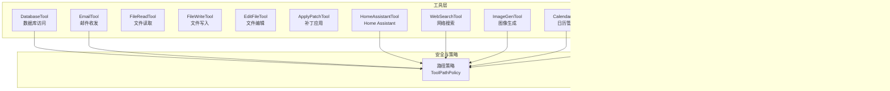
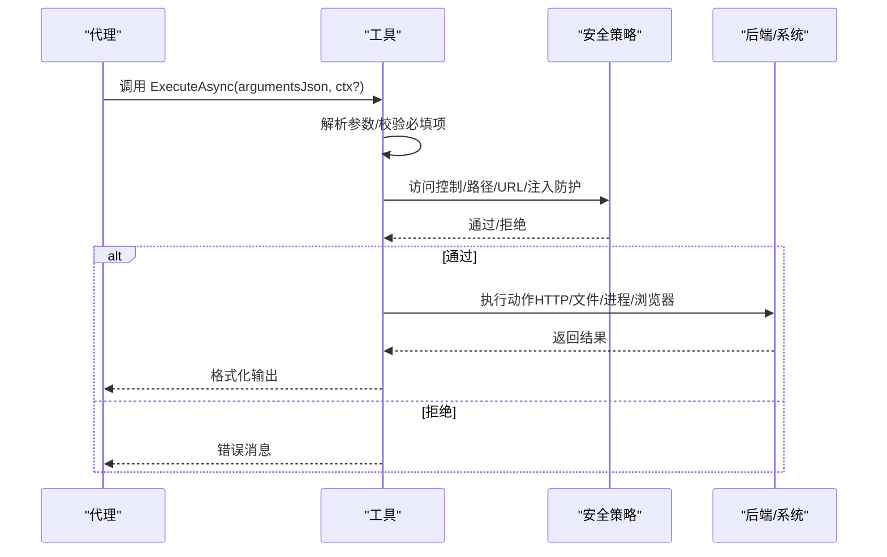
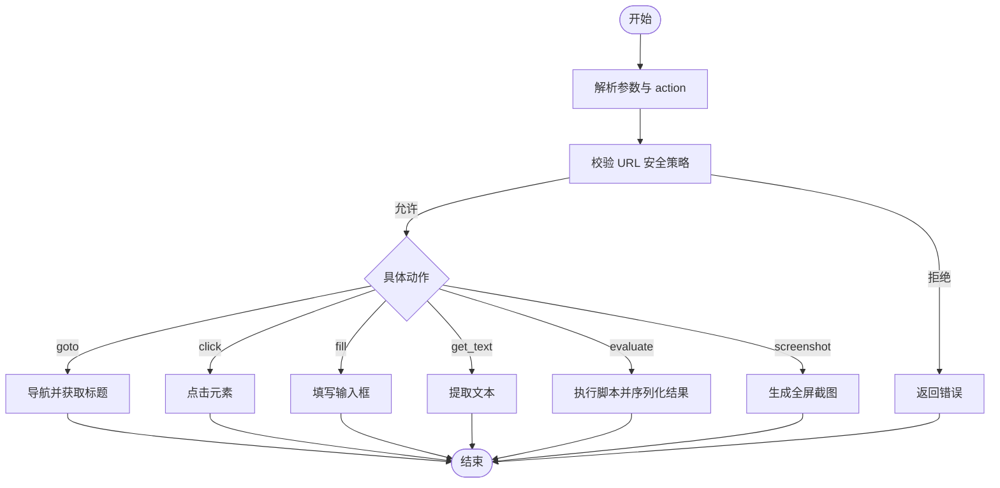
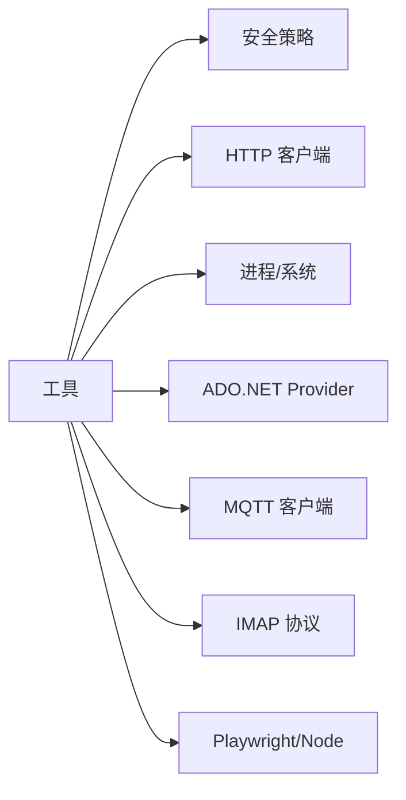

# 内置工具概览

<cite>
**本文档引用的文件**
- [BrowserTool.cs](file://src/OpenClaw.Agent/Tools/BrowserTool.cs)
- [ShellTool.cs](file://src/OpenClaw.Agent/Tools/ShellTool.cs)
- [FileReadTool.cs](file://src/OpenClaw.Agent/Tools/FileReadTool.cs)
- [FileWriteTool.cs](file://src/OpenClaw.Agent/Tools/FileWriteTool.cs)
- [GitTool.cs](file://src/OpenClaw.Agent/Tools/GitTool.cs)
- [DatabaseTool.cs](file://src/OpenClaw.Agent/Tools/DatabaseTool.cs)
- [EmailTool.cs](file://src/OpenClaw.Agent/Tools/EmailTool.cs)
- [HomeAssistantTool.cs](file://src/OpenClaw.Agent/Tools/HomeAssistantTool.cs)
- [MqttPublishTool.cs](file://src/OpenClaw.Agent/Tools/MqttPublishTool.cs)
- [WebSearchTool.cs](file://src/OpenClaw.Agent/Tools/WebSearchTool.cs)
- [ImageGenTool.cs](file://src/OpenClaw.Agent/Tools/ImageGenTool.cs)
- [CalendarTool.cs](file://src/OpenClaw.Agent/Tools/CalendarTool.cs)
- [ProcessTool.cs](file://src/OpenClaw.Agent/Tools/ProcessTool.cs)
- [EditFileTool.cs](file://src/OpenClaw.Agent/Tools/EditFileTool.cs)
- [ApplyPatchTool.cs](file://src/OpenClaw.Agent/Tools/ApplyPatchTool.cs)
</cite>

## 目录
1. [简介](#简介)
2. [项目结构](#项目结构)
3. [核心组件](#核心组件)
4. [架构总览](#架构总览)
5. [详细组件分析](#详细组件分析)
6. [依赖关系分析](#依赖关系分析)
7. [性能考量](#性能考量)
8. [故障排除指南](#故障排除指南)
9. [结论](#结论)
10. [附录](#附录)

## 简介
本文件系统性梳理并解读内置工具集合，覆盖浏览器工具、Shell 命令执行、文件读写与编辑、Git 版本控制、数据库访问、邮件收发、Home Assistant 集成、MQTT 发布、网络搜索、图像生成、日历管理以及进程管理等能力。文档从架构设计、数据流、处理逻辑、安全与错误处理、性能特征等多个维度进行深入分析，并提供参数说明、返回值格式、使用示例与最佳实践建议。

## 项目结构
内置工具位于 OpenClaw 项目的 Agent 层 Tools 目录中，遵循“按功能域分层”的组织方式：每个工具独立实现 ITool 接口或其变体，统一通过参数模式（ParameterSchema）描述输入约束，支持本地执行与沙箱执行两种模式（部分工具实现 ISandboxCapableTool），并通过统一的工具执行器进行调度。

图表来源
- [BrowserTool.cs:13-696](file://src/OpenClaw.Agent/Tools/BrowserTool.cs#L13-L696)
- [ShellTool.cs:11-193](file://src/OpenClaw.Agent/Tools/ShellTool.cs#L11-L193)
- [GitTool.cs:16-234](file://src/OpenClaw.Agent/Tools/GitTool.cs#L16-L234)
- [DatabaseTool.cs:18-944](file://src/OpenClaw.Agent/Tools/DatabaseTool.cs#L18-L944)
- [EmailTool.cs:16-402](file://src/OpenClaw.Agent/Tools/EmailTool.cs#L16-L402)
- [HomeAssistantTool.cs:9-283](file://src/OpenClaw.Agent/Tools/HomeAssistantTool.cs#L9-L283)
- [MqttPublishTool.cs:12-92](file://src/OpenClaw.Agent/Tools/MqttPublishTool.cs#L12-L92)
- [WebSearchTool.cs:14-207](file://src/OpenClaw.Agent/Tools/WebSearchTool.cs#L14-L207)
- [ImageGenTool.cs:15-146](file://src/OpenClaw.Agent/Tools/ImageGenTool.cs#L15-L146)
- [CalendarTool.cs:14-406](file://src/OpenClaw.Agent/Tools/CalendarTool.cs#L14-L406)
- [ProcessTool.cs:9-202](file://src/OpenClaw.Agent/Tools/ProcessTool.cs#L9-L202)
- [EditFileTool.cs:9-108](file://src/OpenClaw.Agent/Tools/EditFileTool.cs#L9-L108)
- [ApplyPatchTool.cs:9-152](file://src/OpenClaw.Agent/Tools/ApplyPatchTool.cs#L9-L152)

章节来源
- [BrowserTool.cs:13-696](file://src/OpenClaw.Agent/Tools/BrowserTool.cs#L13-L696)
- [ShellTool.cs:11-193](file://src/OpenClaw.Agent/Tools/ShellTool.cs#L11-L193)
- [GitTool.cs:16-234](file://src/OpenClaw.Agent/Tools/GitTool.cs#L16-L234)

## 核心组件
- 工具接口族
  - ITool：标准工具接口，提供名称、描述、参数模式与执行方法。
  - IToolWithContext：带会话上下文的工具，用于需要会话/通道/工作区权限的工具。
  - ISandboxCapableTool：可选择在沙箱中执行的工具，支持构建沙箱请求与结果格式化。
- 共享安全与策略
  - ToolPathPolicy：路径解析与访问控制。
  - InputSanitizer：防止注入与不安全输入。
  - UrlSafetyValidator：浏览器 URL 安全校验。
  - GlobMatcher：通配符匹配（MQTT 主题策略）。
- 统一配置
  - ToolingConfig、GitToolsConfig、DatabaseConfig、EmailConfig、HomeAssistantConfig、MqttConfig、WebSearchConfig、ImageGenConfig、CalendarConfig 等，分别驱动各工具行为。

章节来源
- [BrowserTool.cs:17-282](file://src/OpenClaw.Agent/Tools/BrowserTool.cs#L17-L282)
- [ShellTool.cs:11-20](file://src/OpenClaw.Agent/Tools/ShellTool.cs#L11-L20)
- [ProcessTool.cs:9-18](file://src/OpenClaw.Agent/Tools/ProcessTool.cs#L9-L18)

## 架构总览
工具执行流程通常包括：参数解析与校验、安全策略检查、调用后端服务或系统能力、格式化输出。对于可沙箱工具，还会生成沙箱执行请求并在外部进程中运行，再将结果回传。

图表来源
- [BrowserTool.cs:340-448](file://src/OpenClaw.Agent/Tools/BrowserTool.cs#L340-L448)
- [ShellTool.cs:24-85](file://src/OpenClaw.Agent/Tools/ShellTool.cs#L24-L85)
- [GitTool.cs:60-105](file://src/OpenClaw.Agent/Tools/GitTool.cs#L60-L105)

## 详细组件分析

### 浏览器工具（BrowserTool）
- 功能特性
  - 支持导航、点击、填写表单、提取文本、执行脚本、截图。
  - 可本地执行（Playwright Chromium）或通过沙箱 Node 脚本执行。
  - 强制 URL 安全策略，拦截私有/环回/黑名单地址与 CIDR。
- 参数说明
  - action: goto/click/fill/get_text/evaluate/screenshot
  - url: 导航目标（仅 http/https）
  - selector/value/script: 对应操作的附加参数
- 返回值
  - 成功：状态描述或内容；失败：错误信息
- 错误处理
  - URL 不合法、超时、取消、路由中断、异常
- 安全考虑
  - 严格白名单/通配匹配主机、私有网络与 CIDR 拦截、禁用 evaluate 的配置开关
- 使用示例
  - 导航到页面并截图
  - 在指定选择器上填写文本
  - 提取页面主体文本
- 最佳实践
  - 明确设置超时与无头模式
  - 优先使用沙箱以隔离环境
  - 限制 evaluate 权限

图表来源
- [BrowserTool.cs:340-448](file://src/OpenClaw.Agent/Tools/BrowserTool.cs#L340-L448)
- [BrowserTool.cs:491-526](file://src/OpenClaw.Agent/Tools/BrowserTool.cs#L491-L526)

章节来源
- [BrowserTool.cs:17-696](file://src/OpenClaw.Agent/Tools/BrowserTool.cs#L17-L696)

### Shell 工具（ShellTool）
- 功能特性
  - 在本地执行任意 shell 命令，支持超时与输出上限。
  - 沙箱模式下通过 timeout 包裹命令执行。
- 参数说明
  - command: 必填，要执行的命令
  - timeout_seconds: 默认 30，范围 1–600
- 返回值
  - 退出码 + 标准输出/错误输出，必要时追加截断标记
- 错误处理
  - 超时终止、只读模式禁用、未启用 Shell 执行
- 安全考虑
  - 严格只读与禁用策略；输出截断防止上下文溢出
- 使用示例
  - 列出目录、查询系统信息、执行脚本
- 最佳实践
  - 显式设置合理超时
  - 优先使用沙箱模式

章节来源
- [ShellTool.cs:11-193](file://src/OpenClaw.Agent/Tools/ShellTool.cs#L11-L193)

### 文件读取工具（FileReadTool）
- 功能特性
  - 读取文件内容，限制最大行数，避免上下文溢出
- 参数说明
  - path: 必填，文件路径
  - max_lines: 默认 200，范围 1–5000
- 返回值
  - 文件内容，超过行数则提示截断
- 错误处理
  - 路径不存在、读取权限不足
- 安全考虑
  - 通过路径策略解析真实路径并校验读取权限
- 使用示例
  - 查看日志文件前若干行
- 最佳实践
  - 合理设置 max_lines
  - 仅对受信路径读取

章节来源
- [FileReadTool.cs:9-66](file://src/OpenClaw.Agent/Tools/FileReadTool.cs#L9-L66)

### 文件写入工具（FileWriteTool）
- 功能特性
  - 将内容写入文件，自动创建父目录，原子替换
- 参数说明
  - path: 必填
  - content: 必填
- 返回值
  - 写入字符数
- 错误处理
  - 只读模式禁用、路径不可写、写入异常
- 安全考虑
  - 路径策略与只读模式双重保护
- 使用示例
  - 写入配置文件
- 最佳实践
  - 使用临时文件+原子移动降低损坏风险

章节来源
- [FileWriteTool.cs:9-58](file://src/OpenClaw.Agent/Tools/FileWriteTool.cs#L9-L58)

### 文件编辑工具（EditFileTool）
- 功能特性
  - 精准替换文本，支持一次性全部替换
- 参数说明
  - path, old_text, new_text: 必填
  - replace_all: 是否替换全部，默认 false
- 返回值
  - 替换次数
- 错误处理
  - 未找到旧文本、多处出现且未开启全部替换
- 安全考虑
  - 路径策略与只读模式
- 使用示例
  - 修改配置片段
- 最佳实践
  - 保证 old_text 唯一性或开启 replace_all

章节来源
- [EditFileTool.cs:9-108](file://src/OpenClaw.Agent/Tools/EditFileTool.cs#L9-L108)

### 补丁应用工具（ApplyPatchTool）
- 功能特性
  - 应用统一差异补丁，支持多段（hunk）
- 参数说明
  - path, patch: 必填
- 返回值
  - 应用的补丁段数
- 错误处理
  - 无有效段、行号越界、内容不匹配
- 安全考虑
  - 路径策略与只读模式
- 使用示例
  - 应用变更集
- 最佳实践
  - 确保补丁与当前文件一致

章节来源
- [ApplyPatchTool.cs:9-152](file://src/OpenClaw.Agent/Tools/ApplyPatchTool.cs#L9-L152)

### Git 工具（GitTool）
- 功能特性
  - 支持 status/diff/log/add/commit/branch/checkout/stash/show 等常用命令
  - 破坏性操作（push/pull/reset）需显式授权
  - 严格参数令牌化，防止注入
- 参数说明
  - subcommand: 必填，子命令枚举
  - args: 可选，额外参数
  - cwd: 可选，工作目录
- 返回值
  - 命令输出或状态信息
- 错误处理
  - 未知子命令、禁用破坏性操作、参数注入检测
- 安全考虑
  - 令牌化参数、默认日志/差异统计输出
- 使用示例
  - 查看最近提交摘要
  - 添加并提交变更
- 最佳实践
  - 优先使用安全子命令
  - 对破坏性操作开启授权

章节来源
- [GitTool.cs:16-234](file://src/OpenClaw.Agent/Tools/GitTool.cs#L16-L234)

### 数据库工具（DatabaseTool）
- 功能特性
  - 支持 SQLite/PostgreSQL/MySQL（通过 DbProviderFactory）
  - query/execute/tables/schema 四类操作
  - 写操作可被策略禁用
- 参数说明
  - action: query/execute/tables/schema
  - sql/table: 针对不同动作的参数
- 返回值
  - 结果集表格化输出或影响行数
- 错误处理
  - 连接字符串缺失、写操作被禁、SQL 注入策略触发
- 安全考虑
  - 多语句禁用、表白名单/黑名单、标识符清理、参数化查询
- 使用示例
  - 查询表结构
  - 执行更新语句
- 最佳实践
  - 仅连接只读用户或启用 AllowWrite
  - 限制最大行数与输出大小

章节来源
- [DatabaseTool.cs:18-944](file://src/OpenClaw.Agent/Tools/DatabaseTool.cs#L18-L944)

### 邮件工具（EmailTool）
- 功能特性
  - SMTP 发送、IMAP 列表/读取/搜索
  - 自定义 IMAP/SMTP 凭据与端口
- 参数说明
  - action: send/list/read/search
  - send: to/subject/body
  - list/read/search: folder/count/message_id/query
- 返回值
  - 发送成功/列表/正文/搜索结果
- 错误处理
  - 凭据缺失、IMAP 登录失败、网络异常
- 安全考虑
  - 输入净化（CRLF、文件夹名、搜索语法）、凭据密钥解析
- 使用示例
  - 发送通知邮件
  - 搜索近期邮件
- 最佳实践
  - 使用专用邮箱与最小权限
  - 限制最大结果数量

章节来源
- [EmailTool.cs:16-402](file://src/OpenClaw.Agent/Tools/EmailTool.cs#L16-L402)

### Home Assistant 工具（HomeAssistantTool）
- 功能特性
  - 读取实体状态、列出服务、解析目标、描述实体
  - 支持领域/区域/名称过滤与 JSON 文本双格式输出
- 参数说明
  - op: list_entities/get_state/list_services/resolve_targets/describe_entity
  - filters: domain/area/name_contains/limit/format
- 返回值
  - 实体列表/状态/服务/目标/描述
- 错误处理
  - 未知操作、网络异常
- 安全考虑
  - 仅读取操作
- 使用示例
  - 获取灯泡状态
  - 列出可用服务
- 最佳实践
  - 合理限制返回数量

章节来源
- [HomeAssistantTool.cs:9-283](file://src/OpenClaw.Agent/Tools/HomeAssistantTool.cs#L9-L283)

### MQTT 发布工具（MqttPublishTool）
- 功能特性
  - 发布消息到 MQTT 主题，支持 QoS 与保留标志
- 参数说明
  - op: publish（固定）
  - topic/payload/qos,retain
- 返回值
  - OK 或错误信息
- 错误处理
  - 只读模式禁用、主题策略拒绝、网络异常
- 安全考虑
  - 通配匹配策略限制发布主题
- 使用示例
  - 发送传感器读数
- 最佳实践
  - 限定允许的主题白名单

章节来源
- [MqttPublishTool.cs:12-92](file://src/OpenClaw.Agent/Tools/MqttPublishTool.cs#L12-L92)

### 网络搜索工具（WebSearchTool）
- 功能特性
  - 支持 Tavily/Brave/SearXNG，返回标题、链接与摘要
- 参数说明
  - query: 必填
  - max_results: 默认 5，上限 20
- 返回值
  - 格式化结果列表
- 错误处理
  - 未配置密钥、第三方 API 失败/超时
- 安全考虑
  - AOT 友好 JSON 构建
- 使用示例
  - 获取最新新闻摘要
- 最佳实践
  - 控制结果数量与超时

章节来源
- [WebSearchTool.cs:14-207](file://src/OpenClaw.Agent/Tools/WebSearchTool.cs#L14-L207)

### 图像生成工具（ImageGenTool）
- 功能特性
  - 通过 OpenAI DALL·E（或其他兼容 API）生成图片
- 参数说明
  - prompt: 必填
  - size: 默认 1024x1024
  - quality: standard/hd
- 返回值
  - 图片 URL 与修订提示
- 错误处理
  - 未配置密钥、API 失败/超时
- 安全考虑
  - AOT 友好 JSON 构建
- 使用示例
  - 根据描述生成插画
- 最佳实践
  - 合理设置尺寸与质量

章节来源
- [ImageGenTool.cs:15-146](file://src/OpenClaw.Agent/Tools/ImageGenTool.cs#L15-L146)

### 日历工具（CalendarTool）
- 功能特性
  - Google Calendar 集成：列出、搜索、创建、更新、删除事件
- 参数说明
  - action: list/search/create/update/delete
  - 事件相关字段：title/start/end/description/location/event_id/days_ahead/query
- 返回值
  - 事件列表/创建/更新/删除确认
- 错误处理
  - 凭证缺失、鉴权失败、API 失败
- 安全考虑
  - 使用服务账号 JWT 获取访问令牌
- 使用示例
  - 创建会议事件
- 最佳实践
  - 使用专用日历与最小权限服务账号

章节来源
- [CalendarTool.cs:14-406](file://src/OpenClaw.Agent/Tools/CalendarTool.cs#L14-L406)

### 进程工具（ProcessTool）
- 功能特性
  - 管理后台长进程：启动、列举、轮询、查看日志、等待、写入输入、终止
- 参数说明
  - action: start/list/poll/log/wait/write/kill
  - start: command/working_directory/backend/timeout_seconds/pty
  - log: stdout_offset/stderr_offset/max_chars
  - write/kill: process_id/session_id
- 返回值
  - 进程状态/日志/完成状态
- 错误处理
  - 只读模式禁用、Shell 禁用、进程不存在
- 安全考虑
  - 仅允许已授权会话访问自身进程
- 使用示例
  - 后台运行脚本并实时查看输出
- 最佳实践
  - 显式设置超时与工作目录

章节来源
- [ProcessTool.cs:9-202](file://src/OpenClaw.Agent/Tools/ProcessTool.cs#L9-L202)

## 依赖关系分析
- 工具间耦合
  - 大多数工具低耦合，通过统一接口与配置驱动
  - 共享安全组件（路径策略、输入净化、URL 安全、通配匹配）被广泛复用
- 外部依赖
  - 浏览器：Playwright（本地）/Node（沙箱）
  - 数据库：System.Data.Common + ProviderFactory（SQLite/Npgsql/MySqlConnector）
  - HTTP：System.Net.Http + HttpClientFactory
  - MQTT：MQTTnet
  - IMAP：自研纯文本协议客户端
- 执行后端
  - Shell/进程：系统进程
  - 浏览器：Playwright/沙箱 Node
  - 数据库：原生 ADO.NET Provider
  - 网络：第三方 REST API

图表来源
- [BrowserTool.cs:17-696](file://src/OpenClaw.Agent/Tools/BrowserTool.cs#L17-L696)
- [DatabaseTool.cs:313-339](file://src/OpenClaw.Agent/Tools/DatabaseTool.cs#L313-L339)
- [WebSearchTool.cs:17-207](file://src/OpenClaw.Agent/Tools/WebSearchTool.cs#L17-L207)
- [MqttPublishTool.cs:12-92](file://src/OpenClaw.Agent/Tools/MqttPublishTool.cs#L12-L92)
- [EmailTool.cs:243-291](file://src/OpenClaw.Agent/Tools/EmailTool.cs#L243-L291)

章节来源
- [BrowserTool.cs:17-696](file://src/OpenClaw.Agent/Tools/BrowserTool.cs#L17-L696)
- [DatabaseTool.cs:313-339](file://src/OpenClaw.Agent/Tools/DatabaseTool.cs#L313-L339)
- [WebSearchTool.cs:17-207](file://src/OpenClaw.Agent/Tools/WebSearchTool.cs#L17-L207)
- [MqttPublishTool.cs:12-92](file://src/OpenClaw.Agent/Tools/MqttPublishTool.cs#L12-L92)
- [EmailTool.cs:243-291](file://src/OpenClaw.Agent/Tools/EmailTool.cs#L243-L291)

## 性能考量
- 输出限制
  - Shell 输出上限、数据库最大行数、Web 搜索最大结果、IMAP 最大条目
- 超时控制
  - 浏览器/数据库/HTTP 请求均设置超时，避免阻塞
- I/O 优化
  - 文件读取采用异步流与行级限制；数据库结果集表格化并截断
- 并发与锁
  - 浏览器工具内部使用信号量确保初始化与操作串行化
- 沙箱执行
  - 通过外部进程隔离，避免污染主进程资源

## 故障排除指南
- 常见错误与定位
  - 只读模式禁用：检查 Tooling.ReadOnlyMode 与各工具的只读分支
  - Shell 禁用：检查 Tooling.AllowShell
  - 路径访问拒绝：检查 ToolPathPolicy 与具体工具的 IsReadAllowed/IsWriteAllowed
  - URL 安全拦截：检查 UrlSafetyConfig 与通配匹配规则
  - 数据库连接失败：检查 Database.ConnectionString 与 Provider 注册
  - 第三方 API 失败：检查密钥、网络连通性与超时
- 建议排查步骤
  - 开启最小权限验证（如仅启用必要工具）
  - 使用沙箱模式隔离问题
  - 逐步缩小参数范围（如减少 max_results、限制查询条件）
  - 查看工具返回的错误消息中的具体原因

章节来源
- [ShellTool.cs:125-157](file://src/OpenClaw.Agent/Tools/ShellTool.cs#L125-L157)
- [FileReadTool.cs:27-32](file://src/OpenClaw.Agent/Tools/FileReadTool.cs#L27-L32)
- [BrowserTool.cs:491-526](file://src/OpenClaw.Agent/Tools/BrowserTool.cs#L491-L526)
- [DatabaseTool.cs:78-81](file://src/OpenClaw.Agent/Tools/DatabaseTool.cs#L78-L81)
- [WebSearchTool.cs:59-67](file://src/OpenClaw.Agent/Tools/WebSearchTool.cs#L59-L67)

## 结论
内置工具集合在功能覆盖面、安全性与可扩展性之间取得平衡：通过统一接口、参数模式与安全策略，既满足多样化自动化需求，又有效降低风险。建议在生产环境中启用只读模式与最小权限策略，结合沙箱与超时控制，确保稳定与安全。

## 附录
- 参数与返回值格式
  - 所有工具均通过 ParameterSchema 描述输入约束，返回值为人类可读文本或 JSON（如工具支持）
  - 错误返回统一包含“Error:”前缀，便于识别
- 最佳实践清单
  - 明确最小权限原则
  - 为高风险操作（写文件、数据库写、Shell、MQTT 发布）设置严格策略
  - 合理设置超时与输出上限
  - 使用沙箱执行高风险动作
  - 定期审计工具使用记录与策略效果