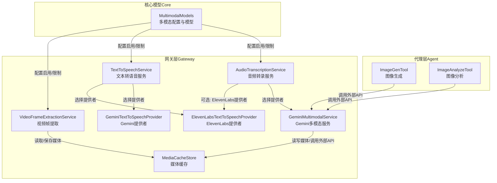
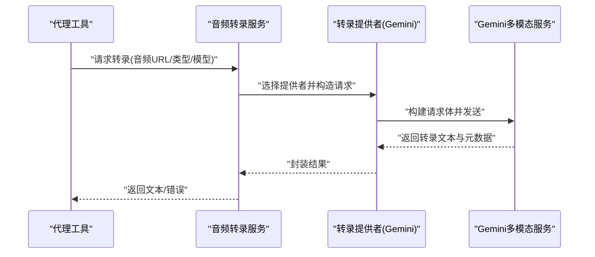
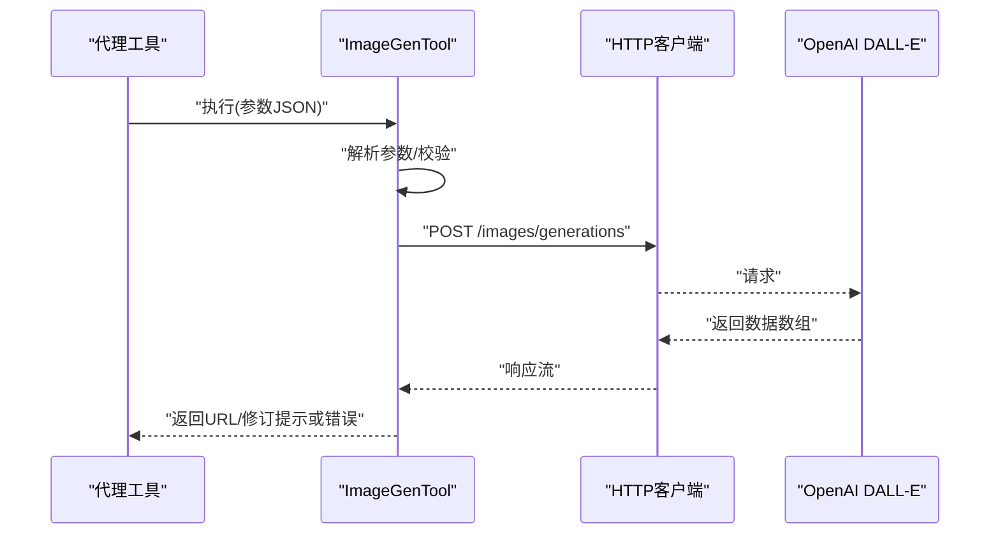
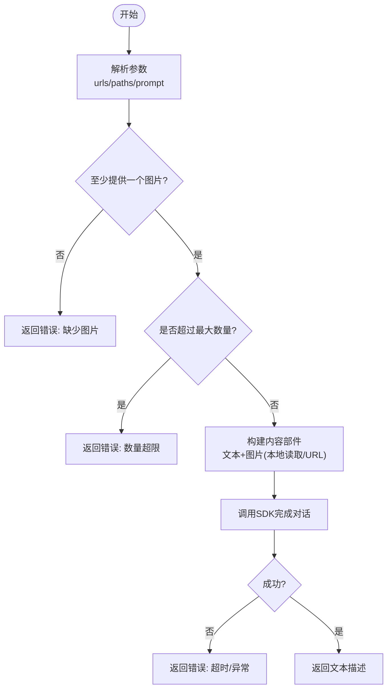
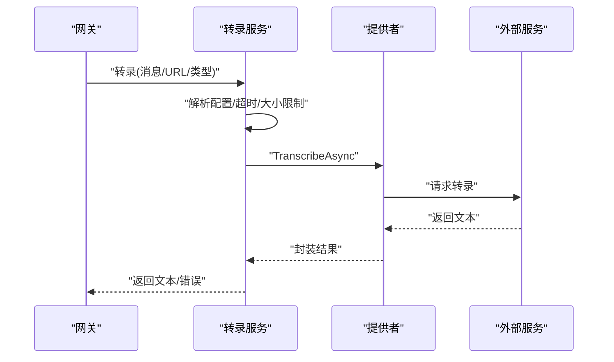
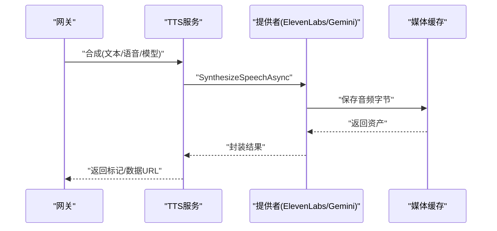
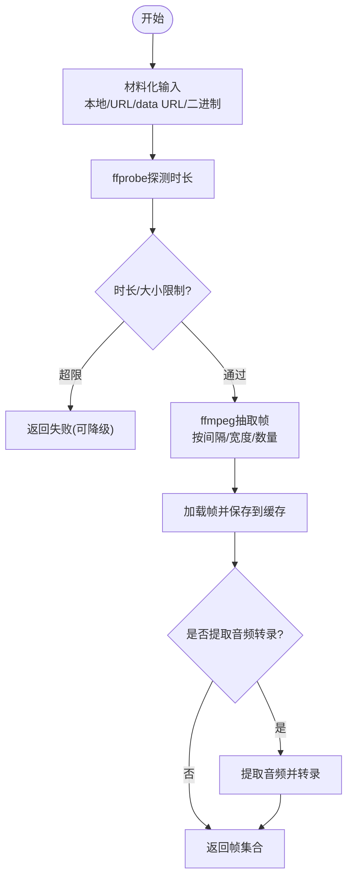
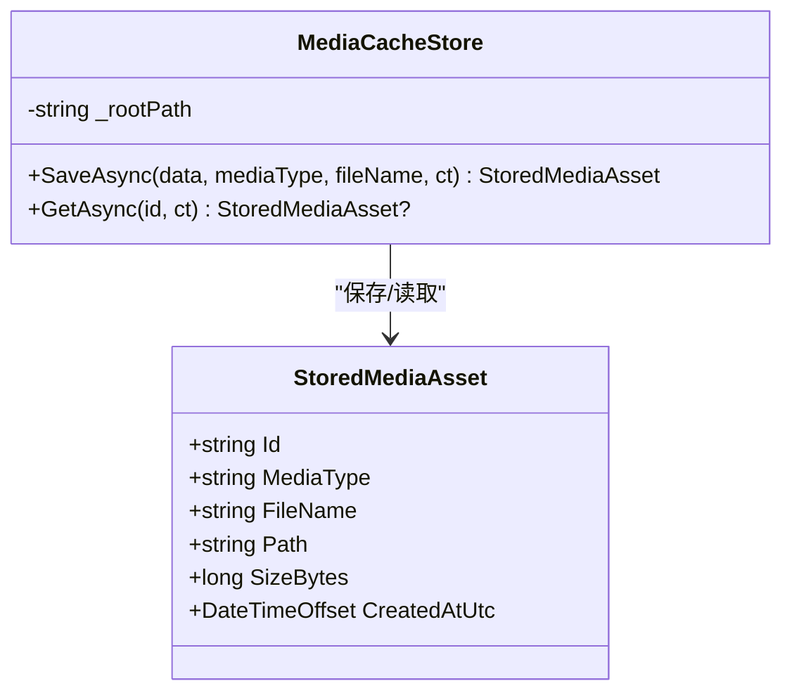
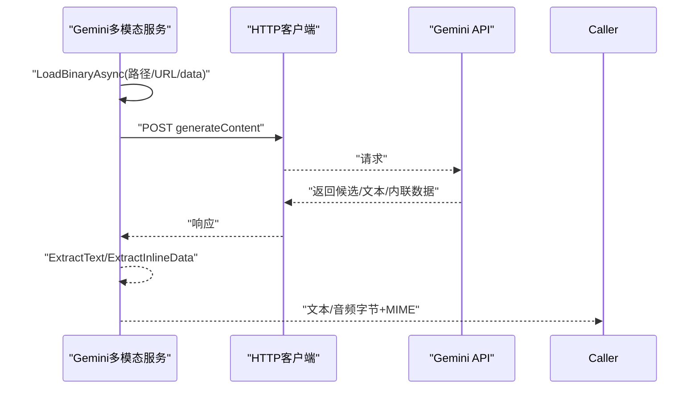
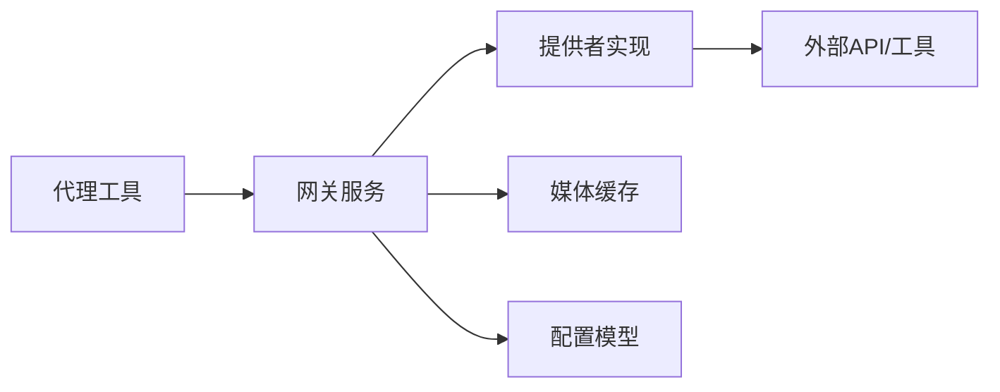

# 媒体工具

<cite>
**本文引用的文件**
- [ImageGenTool.cs](file://src/OpenClaw.Agent/Tools/ImageGenTool.cs)
- [ImageAnalyzeTool.cs](file://src/OpenClaw.Agent/Tools/ImageAnalyzeTool.cs)
- [AudioTranscriptionService.cs](file://src/OpenClaw.Gateway/AudioTranscriptionService.cs)
- [TextToSpeechService.cs](file://src/OpenClaw.Gateway/TextToSpeechService.cs)
- [ElevenLabsTextToSpeechProvider.cs](file://src/OpenClaw.Gateway/ElevenLabsTextToSpeechProvider.cs)
- [GeminiTextToSpeechProvider.cs](file://src/OpenClaw.Gateway/GeminiTextToSpeechProvider.cs)
- [VideoFrameExtractionService.cs](file://src/OpenClaw.Gateway/VideoFrameExtractionService.cs)
- [MediaCacheStore.cs](file://src/OpenClaw.Gateway/MediaCacheStore.cs)
- [GeminiMultimodalService.cs](file://src/OpenClaw.Gateway/GeminiMultimodalService.cs)
- [MultimodalModels.cs](file://src/OpenClaw.Core/Models/MultimodalModels.cs)
</cite>

## 目录
1. [简介](#简介)
2. [项目结构](#项目结构)
3. [核心组件](#核心组件)
4. [架构总览](#架构总览)
5. [详细组件分析](#详细组件分析)
6. [依赖关系分析](#依赖关系分析)
7. [性能考虑](#性能考虑)
8. [故障排查指南](#故障排查指南)
9. [结论](#结论)
10. [附录](#附录)

## 简介
本文件面向“媒体工具”模块，系统性梳理图像生成、图像分析（视觉）、音频转录、文本转语音（TTS）与视频帧提取等多媒体处理能力的实现原理、接口规范、参数配置与输出格式，并结合实际应用场景给出使用建议与优化策略。该模块在网关层统一编排多提供商能力，通过可插拔的服务提供者实现跨平台、可扩展的多模态处理。

## 项目结构
媒体工具相关代码主要分布在以下位置：
- 工具层（Agent）：图像生成、图像分析工具，面向代理执行与工具调度。
- 网关层（Gateway）：音频转录、文本转语音、视频帧提取、媒体缓存与多模态服务编排。
- 核心模型（Core）：多模态配置、存储资产模型等。

图表来源
- [ImageGenTool.cs:1-146](file://src/OpenClaw.Agent/Tools/ImageGenTool.cs#L1-L146)
- [ImageAnalyzeTool.cs:1-180](file://src/OpenClaw.Agent/Tools/ImageAnalyzeTool.cs#L1-L180)
- [AudioTranscriptionService.cs:1-223](file://src/OpenClaw.Gateway/AudioTranscriptionService.cs#L1-L223)
- [TextToSpeechService.cs:1-101](file://src/OpenClaw.Gateway/TextToSpeechService.cs#L1-L101)
- [ElevenLabsTextToSpeechProvider.cs:1-98](file://src/OpenClaw.Gateway/ElevenLabsTextToSpeechProvider.cs#L1-L98)
- [GeminiTextToSpeechProvider.cs:1-19](file://src/OpenClaw.Gateway/GeminiTextToSpeechProvider.cs#L1-L19)
- [VideoFrameExtractionService.cs:1-426](file://src/OpenClaw.Gateway/VideoFrameExtractionService.cs#L1-L426)
- [MediaCacheStore.cs:1-68](file://src/OpenClaw.Gateway/MediaCacheStore.cs#L1-L68)
- [GeminiMultimodalService.cs:1-455](file://src/OpenClaw.Gateway/GeminiMultimodalService.cs#L1-L455)
- [MultimodalModels.cs:1-118](file://src/OpenClaw.Core/Models/MultimodalModels.cs#L1-L118)

章节来源
- [ImageGenTool.cs:1-146](file://src/OpenClaw.Agent/Tools/ImageGenTool.cs#L1-L146)
- [ImageAnalyzeTool.cs:1-180](file://src/OpenClaw.Agent/Tools/ImageAnalyzeTool.cs#L1-L180)
- [AudioTranscriptionService.cs:1-223](file://src/OpenClaw.Gateway/AudioTranscriptionService.cs#L1-L223)
- [TextToSpeechService.cs:1-101](file://src/OpenClaw.Gateway/TextToSpeechService.cs#L1-L101)
- [ElevenLabsTextToSpeechProvider.cs:1-98](file://src/OpenClaw.Gateway/ElevenLabsTextToSpeechProvider.cs#L1-L98)
- [GeminiTextToSpeechProvider.cs:1-19](file://src/OpenClaw.Gateway/GeminiTextToSpeechProvider.cs#L1-L19)
- [VideoFrameExtractionService.cs:1-426](file://src/OpenClaw.Gateway/VideoFrameExtractionService.cs#L1-L426)
- [MediaCacheStore.cs:1-68](file://src/OpenClaw.Gateway/MediaCacheStore.cs#L1-L68)
- [GeminiMultimodalService.cs:1-455](file://src/OpenClaw.Gateway/GeminiMultimodalService.cs#L1-L455)
- [MultimodalModels.cs:1-118](file://src/OpenClaw.Core/Models/MultimodalModels.cs#L1-L118)

## 核心组件
- 图像生成（ImageGenTool）
  - 功能：基于文本提示生成图片，支持指定尺寸与质量，返回图片URL或修订提示。
  - 支持提供者：OpenAI DALL-E（兼容端点）。
  - 关键参数：prompt、size、quality；默认值与校验见参数模式。
  - 输出：文本描述（含URL与修订提示），错误信息。
- 图像分析（ImageAnalyzeTool）
  - 功能：对单张或多张图片进行视觉理解，支持本地路径与公开URL，可自定义提示词。
  - 支持提供者：OpenAI（可通过配置切换端点）。
  - 关键参数：image_urls、image_paths、prompt；最大图片数与超时控制。
  - 输出：文本描述或回答，错误信息。
- 音频转录（AudioTranscriptionService）
  - 功能：将音频消息转录为文本，支持超时与失败降级策略。
  - 提供者：Gemini（内置）、ElevenLabs（用于TTS，此处为转录服务）。
  - 关键参数：Provider、Model、MaxAudioBytes、TimeoutSeconds、FailureMode。
  - 输出：文本结果与元数据（提供者、MIME类型、字节数）。
- 文本转语音（TextToSpeechService）
  - 功能：将文本合成语音，返回媒体资产与内嵌Data URL标记。
  - 提供者：Gemini、ElevenLabs。
  - 关键参数：Text、Provider、VoiceName/VoiceId、Model。
  - 输出：合成结果（Provider、Asset、Marker、DataUrl）。
- 视频帧提取（VideoFrameExtractionService）
  - 功能：从视频中按时间间隔抽取帧，可选提取音频转录。
  - 外部依赖：ffmpeg/ffprobe。
  - 关键参数：MaxVideoBytes、MaxDurationSeconds、MaxFrames、FrameIntervalSeconds、FrameWidth、FailureMode。
  - 输出：帧列表（索引、时间戳、Data URL、媒体资产），可选音频转录。
- 媒体缓存（MediaCacheStore）
  - 功能：持久化媒体数据与元数据，生成稳定标识与JSON元信息。
  - 输出：StoredMediaAsset（Id、MediaType、FileName、Path、SizeBytes、CreatedAtUtc）。
- Gemini多模态服务（GeminiMultimodalService）
  - 功能：封装Gemini的视觉分析、音频转录、语音合成请求构建与响应解析。
  - 支持输入：本地文件、data URL、受控本地文件、远程HTTPS URL。
  - 输出：文本、音频字节与MIME类型、媒体资产。

章节来源
- [ImageGenTool.cs:26-50](file://src/OpenClaw.Agent/Tools/ImageGenTool.cs#L26-L50)
- [ImageAnalyzeTool.cs:22-50](file://src/OpenClaw.Agent/Tools/ImageAnalyzeTool.cs#L22-L50)
- [AudioTranscriptionService.cs:31-82](file://src/OpenClaw.Gateway/AudioTranscriptionService.cs#L31-L82)
- [TextToSpeechService.cs:36-64](file://src/OpenClaw.Gateway/TextToSpeechService.cs#L36-L64)
- [VideoFrameExtractionService.cs:40-105](file://src/OpenClaw.Gateway/VideoFrameExtractionService.cs#L40-L105)
- [MediaCacheStore.cs:6-40](file://src/OpenClaw.Gateway/MediaCacheStore.cs#L6-L40)
- [GeminiMultimodalService.cs:11-130](file://src/OpenClaw.Gateway/GeminiMultimodalService.cs#L11-L130)

## 架构总览
媒体工具采用“服务编排 + 可插拔提供者”的分层设计：
- 代理层工具负责参数解析与调用网关服务。
- 网关层服务根据配置选择具体提供者（Gemini、ElevenLabs等），并进行超时、大小限制与失败降级。
- 媒体缓存统一管理二进制与元数据，确保可检索与复用。
- 多模态服务封装第三方API请求与响应解析，屏蔽细节差异。

图表来源
- [AudioTranscriptionService.cs:47-82](file://src/OpenClaw.Gateway/AudioTranscriptionService.cs#L47-L82)
- [GeminiMultimodalService.cs:62-99](file://src/OpenClaw.Gateway/GeminiMultimodalService.cs#L62-L99)

## 详细组件分析

### 图像生成（ImageGenTool）
- 职责与流程
  - 解析参数（prompt、size、quality），选择提供者（当前支持OpenAI）。
  - 构建请求体（模型、数量、尺寸、质量、响应格式），发送HTTP请求。
  - 解析响应，拼接URL与修订提示，异常处理与超时处理。
- 参数与输出
  - 参数：prompt（必填）、size（默认1024x1024）、quality（默认standard）。
  - 输出：文本（包含URL与修订提示），错误信息。
- 使用场景
  - 内容创作：根据提示生成配图。
  - 设计辅助：批量生成草图或风格化素材。

图表来源
- [ImageGenTool.cs:52-118](file://src/OpenClaw.Agent/Tools/ImageGenTool.cs#L52-L118)

章节来源
- [ImageGenTool.cs:15-146](file://src/OpenClaw.Agent/Tools/ImageGenTool.cs#L15-L146)

### 图像分析（ImageAnalyzeTool）
- 职责与流程
  - 接收图片URL或本地路径，支持混合输入。
  - 对本地路径读取字节并推断MIME类型，构造多模态消息。
  - 调用SDK完成对话式视觉分析，限制最大图片数与超时。
- 参数与输出
  - 参数：image_urls、image_paths、prompt（默认详细描述）。
  - 输出：文本描述/回答，错误信息。
- 使用场景
  - 图像识别：检测物体、场景与文字。
  - 辅助阅读：OCR提取与解释。

图表来源
- [ImageAnalyzeTool.cs:52-107](file://src/OpenClaw.Agent/Tools/ImageAnalyzeTool.cs#L52-L107)

章节来源
- [ImageAnalyzeTool.cs:16-180](file://src/OpenClaw.Agent/Tools/ImageAnalyzeTool.cs#L16-L180)

### 音频转录（AudioTranscriptionService）
- 职责与流程
  - 校验消息类型与配置开关，解析提供者名称。
  - 构造请求（URL、MIME、文件名、模型、大小限制、允许本地根目录）。
  - 调用提供者并应用超时控制，支持失败降级。
- 参数与输出
  - 配置项：Provider、Model、MaxAudioBytes、TimeoutSeconds、FailureMode。
  - 输出：Provider、Text、MimeType、SizeBytes。
- 使用场景
  - 语音助手：将语音消息转为文本。
  - 内容归档：提取会议/播客文字稿。

图表来源
- [AudioTranscriptionService.cs:47-123](file://src/OpenClaw.Gateway/AudioTranscriptionService.cs#L47-L123)

章节来源
- [AudioTranscriptionService.cs:31-223](file://src/OpenClaw.Gateway/AudioTranscriptionService.cs#L31-L223)

### 文本转语音（TextToSpeechService）
- 职责与流程
  - 根据请求或全局配置选择提供者（Gemini、ElevenLabs）。
  - 调用提供者合成语音，保存到媒体缓存，生成Data URL标记。
- 参数与输出
  - 请求参数：Text、Provider、VoiceName/VoiceId、Model。
  - 输出：Provider、Asset（媒体资产）、Marker（内嵌音频标记）、DataUrl。
- 使用场景
  - 语音播报：自动朗读通知/摘要。
  - 有声书：批量生成音频内容。

图表来源
- [TextToSpeechService.cs:47-60](file://src/OpenClaw.Gateway/TextToSpeechService.cs#L47-L60)
- [ElevenLabsTextToSpeechProvider.cs:25-77](file://src/OpenClaw.Gateway/ElevenLabsTextToSpeechProvider.cs#L25-L77)
- [GeminiTextToSpeechProvider.cs:16-18](file://src/OpenClaw.Gateway/GeminiTextToSpeechProvider.cs#L16-L18)
- [MediaCacheStore.cs:16-40](file://src/OpenClaw.Gateway/MediaCacheStore.cs#L16-L40)

章节来源
- [TextToSpeechService.cs:1-101](file://src/OpenClaw.Gateway/TextToSpeechService.cs#L1-L101)
- [ElevenLabsTextToSpeechProvider.cs:1-98](file://src/OpenClaw.Gateway/ElevenLabsTextToSpeechProvider.cs#L1-L98)
- [GeminiTextToSpeechProvider.cs:1-19](file://src/OpenClaw.Gateway/GeminiTextToSpeechProvider.cs#L1-L19)
- [MediaCacheStore.cs:1-68](file://src/OpenClaw.Gateway/MediaCacheStore.cs#L1-L68)

### 视频帧提取（VideoFrameExtractionService）
- 职责与流程
  - 材料化输入（本地文件、data URL、二进制），探测时长与大小限制。
  - 使用ffmpeg按间隔抽取帧，缩放至指定宽度，最多抽取N帧。
  - 可选提取音频并转录，失败时按配置降级。
- 参数与输出
  - 配置项：FfmpegPath/FfprobePath、MaxVideoBytes、MaxDurationSeconds、MaxFrames、FrameIntervalSeconds、FrameWidth、ExtractAudioTranscript、FailureMode。
  - 输出：帧集合（索引、时间戳、Data URL、媒体资产），可选音频转录。
- 使用场景
  - 视频摘要：抽取关键帧生成缩略图集。
  - 智能检索：基于帧内容进行相似度匹配。

图表来源
- [VideoFrameExtractionService.cs:59-105](file://src/OpenClaw.Gateway/VideoFrameExtractionService.cs#L59-L105)
- [VideoFrameExtractionService.cs:169-215](file://src/OpenClaw.Gateway/VideoFrameExtractionService.cs#L169-L215)
- [VideoFrameExtractionService.cs:217-267](file://src/OpenClaw.Gateway/VideoFrameExtractionService.cs#L217-L267)

章节来源
- [VideoFrameExtractionService.cs:1-426](file://src/OpenClaw.Gateway/VideoFrameExtractionService.cs#L1-L426)

### 媒体缓存（MediaCacheStore）
- 职责与流程
  - 将二进制数据写入磁盘，生成唯一ID与扩展名，写入JSON元数据。
  - 提供按ID查询资产的能力。
- 输出
  - StoredMediaAsset：包含Id、MediaType、FileName、Path、SizeBytes、CreatedAtUtc。

图表来源
- [MediaCacheStore.cs:6-40](file://src/OpenClaw.Gateway/MediaCacheStore.cs#L6-L40)
- [MultimodalModels.cs:72-80](file://src/OpenClaw.Core/Models/MultimodalModels.cs#L72-L80)

章节来源
- [MediaCacheStore.cs:1-68](file://src/OpenClaw.Gateway/MediaCacheStore.cs#L1-L68)
- [MultimodalModels.cs:72-80](file://src/OpenClaw.Core/Models/MultimodalModels.cs#L72-L80)

### Gemini多模态服务（GeminiMultimodalService）
- 职责与流程
  - 统一封装视觉分析、音频转录、语音合成的请求构建与响应解析。
  - 支持本地文件、data URL、受控本地文件、远程HTTPS URL输入。
  - 严格控制媒体大小与MIME类型，解析候选文本或内联音频数据。
- 使用场景
  - 视觉问答：对图片进行提问并获取答案。
  - 语音转写：将音频转为文字。
  - 语音合成：将文本合成为音频并返回媒体资产。

图表来源
- [GeminiMultimodalService.cs:243-289](file://src/OpenClaw.Gateway/GeminiMultimodalService.cs#L243-L289)
- [GeminiMultimodalService.cs:380-437](file://src/OpenClaw.Gateway/GeminiMultimodalService.cs#L380-L437)

章节来源
- [GeminiMultimodalService.cs:1-455](file://src/OpenClaw.Gateway/GeminiMultimodalService.cs#L1-L455)

## 依赖关系分析
- 组件耦合
  - 代理工具依赖网关服务与安全密钥解析器。
  - 网关服务依赖配置、日志、媒体缓存与提供者实现。
  - 提供者实现依赖外部HTTP API与本地工具（ffmpeg/ffprobe）。
- 外部依赖
  - OpenAI（图像生成）、Gemini（视觉/转录/TTS）、ElevenLabs（TTS）。
  - ffmpeg/ffprobe（视频帧提取）。
- 循环依赖
  - 未发现直接循环依赖；服务通过接口解耦。

图表来源
- [ImageGenTool.cs:15-24](file://src/OpenClaw.Agent/Tools/ImageGenTool.cs#L15-L24)
- [AudioTranscriptionService.cs:31-45](file://src/OpenClaw.Gateway/AudioTranscriptionService.cs#L31-L45)
- [TextToSpeechService.cs:36-45](file://src/OpenClaw.Gateway/TextToSpeechService.cs#L36-L45)
- [VideoFrameExtractionService.cs:40-57](file://src/OpenClaw.Gateway/VideoFrameExtractionService.cs#L40-L57)
- [MediaCacheStore.cs:6-14](file://src/OpenClaw.Gateway/MediaCacheStore.cs#L6-L14)
- [MultimodalModels.cs:3-15](file://src/OpenClaw.Core/Models/MultimodalModels.cs#L3-L15)

章节来源
- [ImageGenTool.cs:1-146](file://src/OpenClaw.Agent/Tools/ImageGenTool.cs#L1-L146)
- [AudioTranscriptionService.cs:1-223](file://src/OpenClaw.Gateway/AudioTranscriptionService.cs#L1-L223)
- [TextToSpeechService.cs:1-101](file://src/OpenClaw.Gateway/TextToSpeechService.cs#L1-L101)
- [VideoFrameExtractionService.cs:1-426](file://src/OpenClaw.Gateway/VideoFrameExtractionService.cs#L1-L426)
- [MediaCacheStore.cs:1-68](file://src/OpenClaw.Gateway/MediaCacheStore.cs#L1-L68)
- [MultimodalModels.cs:1-118](file://src/OpenClaw.Core/Models/MultimodalModels.cs#L1-L118)

## 性能考虑
- 并发与超时
  - 转录与TTS均设置超时，避免阻塞；视频处理使用独立工作目录与清理逻辑。
- 资源限制
  - 图片/音频/视频均有限制（数量、大小、时长），防止资源滥用。
- I/O与缓存
  - 使用媒体缓存统一管理二进制与元数据，减少重复下载与计算。
- 失败降级
  - 视频预处理支持“降级”策略，在异常情况下返回可用结果而非抛出错误。
- 外部工具
  - ffmpeg/ffprobe需正确安装与路径配置，否则会触发降级或报错。

章节来源
- [AudioTranscriptionService.cs:60-82](file://src/OpenClaw.Gateway/AudioTranscriptionService.cs#L60-L82)
- [TextToSpeechService.cs:47-60](file://src/OpenClaw.Gateway/TextToSpeechService.cs#L47-L60)
- [VideoFrameExtractionService.cs:61-105](file://src/OpenClaw.Gateway/VideoFrameExtractionService.cs#L61-L105)
- [MultimodalModels.cs:17-40](file://src/OpenClaw.Core/Models/MultimodalModels.cs#L17-L40)

## 故障排查指南
- 常见错误与定位
  - API密钥缺失：检查配置中的密钥字段或环境变量。
  - 提供者不可用：确认Provider名称与注册表一致。
  - 输入不合法：URL/路径为空、超出数量/大小/时长限制、data URL格式错误。
  - 外部工具缺失：ffmpeg/ffprobe未安装或路径错误。
  - 失败降级：FailureMode非“strict/fail/throw”时，服务会尝试降级返回部分结果。
- 日志与诊断
  - 转录服务在超时时记录告警日志，便于定位耗时问题。
  - 视频预处理捕获进程输出，帮助定位ffmpeg/ffprobe问题。
- 建议操作
  - 逐步缩小范围：先验证输入合法性，再检查网络与密钥。
  - 开启降级模式以保证系统可用性，同时记录失败原因以便后续修复。

章节来源
- [AudioTranscriptionService.cs:77-82](file://src/OpenClaw.Gateway/AudioTranscriptionService.cs#L77-L82)
- [VideoFrameExtractionService.cs:269-281](file://src/OpenClaw.Gateway/VideoFrameExtractionService.cs#L269-L281)
- [VideoFrameExtractionService.cs:332-341](file://src/OpenClaw.Gateway/VideoFrameExtractionService.cs#L332-L341)
- [GeminiMultimodalService.cs:338-363](file://src/OpenClaw.Gateway/GeminiMultimodalService.cs#L338-L363)

## 结论
媒体工具模块通过清晰的分层与可插拔架构，实现了从图像生成与分析、音频转录到文本转语音与视频帧提取的全链路能力。借助严格的资源限制、失败降级与媒体缓存机制，系统在复杂多变的多媒体场景下具备良好的稳定性与可维护性。建议在生产环境中合理配置超时与大小限制，并优先采用降级策略以提升用户体验。

## 附录
- 配置要点（摘录）
  - 多模态总开关、媒体缓存路径、提供者与模型选择、超时与大小限制、失败模式等。
- 数据模型（摘录）
  - 媒体资产结构、直播会话请求/响应模型等。

章节来源
- [MultimodalModels.cs:3-118](file://src/OpenClaw.Core/Models/MultimodalModels.cs#L3-L118)