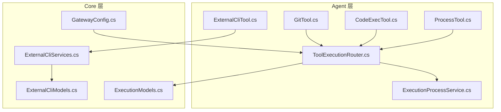
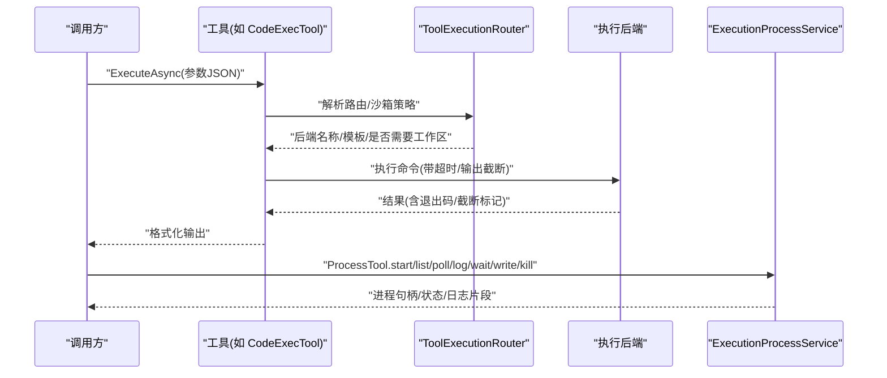
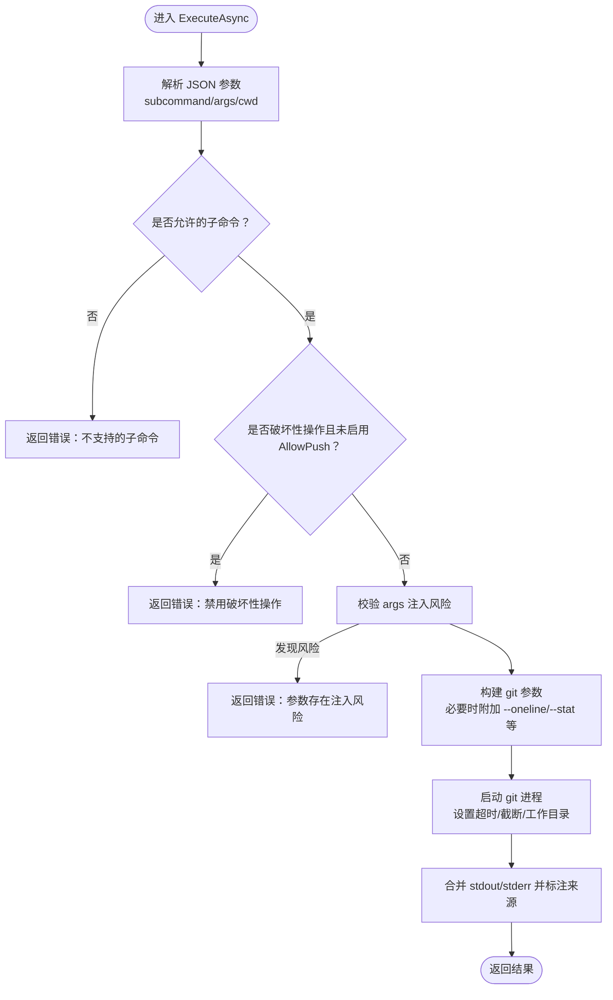
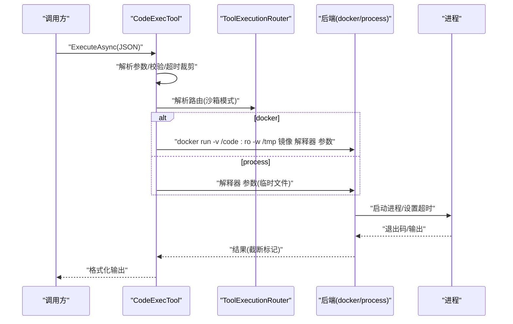
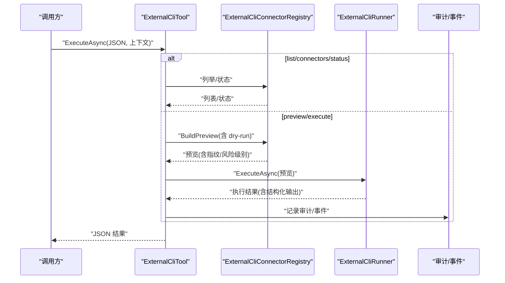
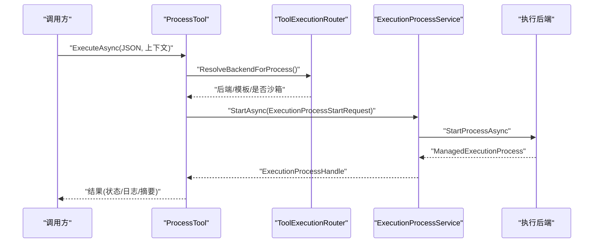
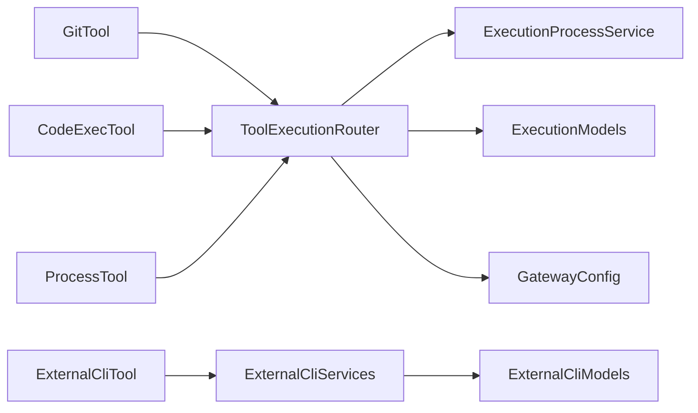

# 开发工具

<cite>
**本文引用的文件**
- [GitTool.cs](file://src/OpenClaw.Agent/Tools/GitTool.cs)
- [CodeExecTool.cs](file://src/OpenClaw.Agent/Tools/CodeExecTool.cs)
- [ExternalCliTool.cs](file://src/OpenClaw.Agent/Tools/ExternalCliTool.cs)
- [ProcessTool.cs](file://src/OpenClaw.Agent/Tools/ProcessTool.cs)
- [ToolExecutionRouter.cs](file://src/OpenClaw.Agent/Execution/ToolExecutionRouter.cs)
- [ExecutionProcessService.cs](file://src/OpenClaw.Agent/Execution/ExecutionProcessService.cs)
- [ExternalCliServices.cs](file://src/OpenClaw.Core/ExternalCli/ExternalCliServices.cs)
- [ExternalCliModels.cs](file://src/OpenClaw.Core/Models/ExternalCliModels.cs)
- [ExecutionModels.cs](file://src/OpenClaw.Core/Models/ExecutionModels.cs)
- [GatewayConfig.cs](file://src/OpenClaw.Core/Models/GatewayConfig.cs)
- [KingcrabToolConfigs.cs](file://src/OpenClaw.Core/Plugins/KingcrabToolConfigs.cs)
</cite>

## 目录
1. [简介](#简介)
2. [项目结构](#项目结构)
3. [核心组件](#核心组件)
4. [架构总览](#架构总览)
5. [详细组件分析](#详细组件分析)
6. [依赖关系分析](#依赖关系分析)
7. [性能考量](#性能考量)
8. [故障排查指南](#故障排查指南)
9. [结论](#结论)
10. [附录](#附录)

## 简介
本技术文档聚焦于开发工具模块，系统性阐述以下能力与实现细节：
- Git 版本控制：支持状态、差异、日志、添加、提交、分支、检出、暂存、展示等子命令；对破坏性操作进行策略开关与安全限制。
- 代码执行：在容器或本地进程中隔离运行 Python、JavaScript、Bash 脚本，支持超时、输出截断、沙箱模式选择。
- 外部 CLI 工具：通过“连接器-命令”白名单机制，预览与干跑、参数校验、审计与事件记录、结构化输出解析。
- 进程管理：长时后台进程的启动、轮询、日志拉取、等待、输入写入、终止，以及生命周期与资源保留策略。

文档同时覆盖配置参数、执行环境、输出格式、错误处理、安全使用与性能优化建议，并给出常见开发场景的使用示例。

## 项目结构
开发工具模块位于 Agent 层的 Tools 命名空间下，配合 Execution 子系统完成进程生命周期管理与路由调度；外部 CLI 能力由 Core 层 ExternalCli 提供注册表、运行器与模型定义。

图示来源
- [GitTool.cs:1-234](file://src/OpenClaw.Agent/Tools/GitTool.cs#L1-L234)
- [CodeExecTool.cs:1-465](file://src/OpenClaw.Agent/Tools/CodeExecTool.cs#L1-L465)
- [ExternalCliTool.cs:1-252](file://src/OpenClaw.Agent/Tools/ExternalCliTool.cs#L1-L252)
- [ProcessTool.cs:1-202](file://src/OpenClaw.Agent/Tools/ProcessTool.cs#L1-L202)
- [ToolExecutionRouter.cs:1-253](file://src/OpenClaw.Agent/Execution/ToolExecutionRouter.cs#L1-L253)
- [ExecutionProcessService.cs:1-522](file://src/OpenClaw.Agent/Execution/ExecutionProcessService.cs#L1-L522)
- [ExternalCliServices.cs:1-858](file://src/OpenClaw.Core/ExternalCli/ExternalCliServices.cs#L1-L858)
- [ExternalCliModels.cs:1-301](file://src/OpenClaw.Core/Models/ExternalCliModels.cs#L1-L301)
- [ExecutionModels.cs:1-179](file://src/OpenClaw.Core/Models/ExecutionModels.cs#L1-L179)
- [GatewayConfig.cs:1-898](file://src/OpenClaw.Core/Models/GatewayConfig.cs#L1-L898)

章节来源
- [GitTool.cs:1-234](file://src/OpenClaw.Agent/Tools/GitTool.cs#L1-L234)
- [CodeExecTool.cs:1-465](file://src/OpenClaw.Agent/Tools/CodeExecTool.cs#L1-L465)
- [ExternalCliTool.cs:1-252](file://src/OpenClaw.Agent/Tools/ExternalCliTool.cs#L1-L252)
- [ProcessTool.cs:1-202](file://src/OpenClaw.Agent/Tools/ProcessTool.cs#L1-L202)
- [ToolExecutionRouter.cs:1-253](file://src/OpenClaw.Agent/Execution/ToolExecutionRouter.cs#L1-L253)
- [ExecutionProcessService.cs:1-522](file://src/OpenClaw.Agent/Execution/ExecutionProcessService.cs#L1-L522)
- [ExternalCliServices.cs:1-858](file://src/OpenClaw.Core/ExternalCli/ExternalCliServices.cs#L1-L858)
- [ExternalCliModels.cs:1-301](file://src/OpenClaw.Core/Models/ExternalCliModels.cs#L1-L301)
- [ExecutionModels.cs:1-179](file://src/OpenClaw.Core/Models/ExecutionModels.cs#L1-L179)
- [GatewayConfig.cs:1-898](file://src/OpenClaw.Core/Models/GatewayConfig.cs#L1-L898)

## 核心组件
- GitTool：封装 git 原生调用，内置子命令白名单与破坏性操作开关，参数经 JSON 解析与安全检查，输出截断与超时保护。
- CodeExecTool：支持 docker/process 后端，按语言选择解释器，参数校验与超时控制，输出截断与格式化返回。
- ExternalCliTool：面向“连接器-命令”的治理型外部 CLI 执行，支持预览、干跑、参数校验、审计与事件记录。
- ProcessTool：提供长时后台进程的统一入口，封装启动、查询、日志、等待、输入、终止等动作。
- ToolExecutionRouter：根据配置解析工具到后端的路由，支持沙箱模式与回退后端。
- ExecutionProcessService：进程生命周期管理、日志切片读取、超时监控、历史清理与指标统计。

章节来源
- [GitTool.cs:16-105](file://src/OpenClaw.Agent/Tools/GitTool.cs#L16-L105)
- [CodeExecTool.cs:16-112](file://src/OpenClaw.Agent/Tools/CodeExecTool.cs#L16-L112)
- [ExternalCliTool.cs:9-95](file://src/OpenClaw.Agent/Tools/ExternalCliTool.cs#L9-L95)
- [ProcessTool.cs:9-68](file://src/OpenClaw.Agent/Tools/ProcessTool.cs#L9-L68)
- [ToolExecutionRouter.cs:7-112](file://src/OpenClaw.Agent/Execution/ToolExecutionRouter.cs#L7-L112)
- [ExecutionProcessService.cs:278-377](file://src/OpenClaw.Agent/Execution/ExecutionProcessService.cs#L278-L377)

## 架构总览
开发工具模块采用“工具-路由-后端”的分层设计。工具负责参数解析与安全检查；路由根据配置决定后端（local/docker/ssh/opensandbox）与沙箱策略；后端负责具体执行；进程服务负责长时任务生命周期管理。

图示来源
- [ToolExecutionRouter.cs:114-157](file://src/OpenClaw.Agent/Execution/ToolExecutionRouter.cs#L114-L157)
- [ExecutionProcessService.cs:301-377](file://src/OpenClaw.Agent/Execution/ExecutionProcessService.cs#L301-L377)
- [CodeExecTool.cs:189-258](file://src/OpenClaw.Agent/Tools/CodeExecTool.cs#L189-L258)
- [ProcessTool.cs:46-68](file://src/OpenClaw.Agent/Tools/ProcessTool.cs#L46-L68)

## 详细组件分析

### Git 工具（GitTool）
- 功能特性
  - 支持子命令：status、diff、log、add、commit、branch、checkout、stash、show、fetch、merge、rebase、cherry-pick、tag 等。
  - 破坏性操作受策略控制：push/pull/reset（尤其是 --hard）需开启 AllowPush。
  - 参数安全：对 args 进行 shell 元字符注入检测；内部以 ArgumentList 直接传递，避免 shell 中介。
  - 输出控制：diff 默认 --stat；log 默认 --oneline -20；stdout/stderr 截断并可提示截断。
  - 超时保护：默认 30 秒，超时则终止进程树。
- 配置参数
  - 允许的最大 diff 输出字节数（MaxDiffBytes），用于 stdout 截断。
  - 破坏性操作开关（AllowPush）。
- 执行环境
  - 使用系统 git 可执行文件；支持指定工作目录（cwd）。
- 输出格式
  - 组合 stdout 与 stderr；若均为空，返回退出码摘要信息。
- 错误处理
  - 不支持的子命令直接报错；
  - 安全检查失败返回明确错误信息；
  - 进程异常、超时、输出截断均有对应反馈。
- 使用示例
  - 查看最近提交：subcommand=log，args=空或追加 --since 或 --author 等。
  - 查看变更统计：subcommand=diff，不传 args 则自动使用 --stat。
  - 提交变更：subcommand=commit，args="-m 'message'"。
  - 分支管理：subcommand=branch/checkout/stash 等。
- 安全与合规
  - 严格白名单与破坏性操作开关；
  - 参数注入防护与输出截断；
  - 可通过配置调整最大输出大小。

图示来源
- [GitTool.cs:60-156](file://src/OpenClaw.Agent/Tools/GitTool.cs#L60-L156)

章节来源
- [GitTool.cs:16-156](file://src/OpenClaw.Agent/Tools/GitTool.cs#L16-L156)

### 代码执行工具（CodeExecTool）
- 功能特性
  - 后端：docker 与 process 二选一；docker 默认网络隔离、内存与 CPU 限制。
  - 语言：python/javascript/bash；bash 在 Windows 上优先尝试 wsl.exe 或 bash。
  - 沙箱：实现 ISandboxCapableTool，支持创建沙箱请求与格式化结果。
  - 超时：支持全局与单次调用超时裁剪至 1~300 秒。
  - 输出：stdout/stderr 截断并提示；最大输出字节受 MaxOutputBytes 与配置上限约束。
- 配置参数
  - Backend：docker 或 process。
  - DockerImage：容器镜像名。
  - TimeoutSeconds：默认超时秒数。
  - MaxOutputBytes：最大输出字节。
  - AllowedLanguages：允许的语言集合。
  - Tooling.ReadOnlyMode：只读模式禁用该工具。
- 执行环境
  - docker：挂载临时代码文件，工作目录 /tmp；网络 none，限制内存与 CPU。
  - process：写入临时文件并调用解释器；bash 通过前缀参数执行。
- 输出格式
  - 包含退出码与分段 stdout/stderr。
- 错误处理
  - 进程启动失败、超时、语言不支持、只读模式禁用等均有明确错误消息。
- 使用示例
  - 计算表达式：language=python，code="print(1+1)"。
  - JS 脚本：language=javascript，code="console.log('hello')"。
  - Bash 脚本：language=bash，code="echo $HOME"。
- 安全与合规
  - docker 后端默认无网络、有限资源，适合高风险脚本；
  - process 后端受限于宿主机环境，注意路径与权限。

图示来源
- [CodeExecTool.cs:58-258](file://src/OpenClaw.Agent/Tools/CodeExecTool.cs#L58-L258)
- [ToolExecutionRouter.cs:65-112](file://src/OpenClaw.Agent/Execution/ToolExecutionRouter.cs#L65-L112)

章节来源
- [CodeExecTool.cs:16-258](file://src/OpenClaw.Agent/Tools/CodeExecTool.cs#L16-L258)
- [ToolExecutionRouter.cs:65-112](file://src/OpenClaw.Agent/Execution/ToolExecutionRouter.cs#L65-L112)

### 外部 CLI 工具（ExternalCliTool）
- 功能特性
  - “连接器-命令”白名单：仅允许预配置的连接器与命令，参数必须满足 schema。
  - 预览与干跑：BuildPreview 生成预览与指纹，支持 dry-run 模板。
  - 审计与事件：记录执行结果、耗时、截断、超时等；支持结构化输出解析。
  - 参数校验：必填、长度、枚举值、正则匹配、未知参数拒绝。
- 配置参数（来自 GatewayConfig.ExternalCli）
  - Enabled、DefaultTimeoutSeconds、MaxStdoutBytes、MaxStderrBytes、RedactSecrets、RequireApprovalForMutatingCommands、Connectors、Commands 等。
- 执行流程
  - 解析请求 -> BuildPreview -> 可选 DryRun -> 执行 -> 记录审计与事件 -> 返回结果。
- 输出格式
  - JSON 序列化，包含预览、执行结果、结构化 JSON（可选）、错误信息等。
- 错误处理
  - 参数非法、未知连接器/命令、未启用、超时、执行失败等均有明确错误与事件记录。
- 使用示例
  - 列出连接器：action=list_connectors。
  - 获取命令 schema：action=command_schema，指定 connector 与 command。
  - 预览执行：action=preview，提供 parameters，可选 execute_dry_run=true。
  - 执行命令：action=execute，提供 parameters 与可选审批指纹。
- 安全与合规
  - 严格的参数白名单与必填项校验；
  - 可配置敏感信息脱敏规则；
  - 高风险命令与变更类命令可要求审批。

图示来源
- [ExternalCliTool.cs:49-168](file://src/OpenClaw.Agent/Tools/ExternalCliTool.cs#L49-L168)
- [ExternalCliServices.cs:140-224](file://src/OpenClaw.Core/ExternalCli/ExternalCliServices.cs#L140-L224)
- [ExternalCliServices.cs:639-742](file://src/OpenClaw.Core/ExternalCli/ExternalCliServices.cs#L639-L742)
- [ExternalCliModels.cs:105-245](file://src/OpenClaw.Core/Models/ExternalCliModels.cs#L105-L245)

章节来源
- [ExternalCliTool.cs:9-168](file://src/OpenClaw.Agent/Tools/ExternalCliTool.cs#L9-L168)
- [ExternalCliServices.cs:63-742](file://src/OpenClaw.Core/ExternalCli/ExternalCliServices.cs#L63-L742)
- [ExternalCliModels.cs:6-245](file://src/OpenClaw.Core/Models/ExternalCliModels.cs#L6-L245)
- [GatewayConfig.cs:26-26](file://src/OpenClaw.Core/Models/GatewayConfig.cs#L26-L26)

### 进程管理工具（ProcessTool）
- 功能特性
  - 动作：start、list、poll、log、wait、write、kill。
  - 会话级所有权：所有操作需匹配 owner 会话标识。
  - 日志切片：支持从指定偏移读取 stdout/stderr。
  - 超时：基于后端能力与配置设置超时。
- 配置参数
  - Tooling.ReadOnlyMode：只读模式禁用。
  - Tooling.AllowShell：禁用 shell 则禁用。
  - Tooling.WorkspaceRoot：默认工作目录。
- 执行流程
  - 解析参数 -> 根据路由选择后端 -> 启动进程 -> 记录事件与指标 -> 返回状态/日志。
- 输出格式
  - start：返回进程 ID、后端名、命令预览。
  - poll：返回状态、退出码、stdout/stderr 字节计数。
  - log：返回 stdout/stderr 片段与下一偏移。
  - wait/write/kill：返回成功/失败或状态摘要。
- 错误处理
  - 未知动作、缺少参数、找不到进程、后端不支持等均有明确错误消息。
- 使用示例
  - 后台运行构建脚本：action=start，command="make build"。
  - 实时查看日志：action=log，stdout_offset/stderr_offset/max_chars。
  - 写入交互输入：action=write，input="Enter password:"。
  - 终止进程：action=kill。
- 安全与合规
  - 仅允许在允许 shell 的环境中使用；
  - 仅能操作自身会话下的进程；
  - 长时进程有历史保留与清理策略。

图示来源
- [ProcessTool.cs:46-184](file://src/OpenClaw.Agent/Tools/ProcessTool.cs#L46-L184)
- [ToolExecutionRouter.cs:164-203](file://src/OpenClaw.Agent/Execution/ToolExecutionRouter.cs#L164-L203)
- [ExecutionProcessService.cs:301-377](file://src/OpenClaw.Agent/Execution/ExecutionProcessService.cs#L301-L377)

章节来源
- [ProcessTool.cs:9-184](file://src/OpenClaw.Agent/Tools/ProcessTool.cs#L9-L184)
- [ToolExecutionRouter.cs:164-203](file://src/OpenClaw.Agent/Execution/ToolExecutionRouter.cs#L164-L203)
- [ExecutionProcessService.cs:278-430](file://src/OpenClaw.Agent/Execution/ExecutionProcessService.cs#L278-L430)

## 依赖关系分析
- 工具到路由
  - GitTool/CodeExecTool/ProcessTool 通过 ToolExecutionRouter 解析后端与沙箱策略。
- 路由到后端
  - ToolExecutionRouter 根据 ExecutionConfig 与 SandboxConfig 决定后端类型与模板。
- 进程服务
  - ExecutionProcessService 管理长时进程生命周期，与后端能力耦合。
- 外部 CLI
  - ExternalCliTool 依赖 ExternalCliConnectorRegistry 与 ExternalCliRunner，二者在 Core 层实现。

图示来源
- [ToolExecutionRouter.cs:16-63](file://src/OpenClaw.Agent/Execution/ToolExecutionRouter.cs#L16-L63)
- [ExecutionProcessService.cs:278-300](file://src/OpenClaw.Agent/Execution/ExecutionProcessService.cs#L278-L300)
- [ExternalCliServices.cs:63-73](file://src/OpenClaw.Core/ExternalCli/ExternalCliServices.cs#L63-L73)
- [ExternalCliModels.cs:6-17](file://src/OpenClaw.Core/Models/ExternalCliModels.cs#L6-L17)
- [ExecutionModels.cs:8-20](file://src/OpenClaw.Core/Models/ExecutionModels.cs#L8-L20)
- [GatewayConfig.cs:26-28](file://src/OpenClaw.Core/Models/GatewayConfig.cs#L26-L28)

章节来源
- [ToolExecutionRouter.cs:16-63](file://src/OpenClaw.Agent/Execution/ToolExecutionRouter.cs#L16-L63)
- [ExecutionProcessService.cs:278-300](file://src/OpenClaw.Agent/Execution/ExecutionProcessService.cs#L278-L300)
- [ExternalCliServices.cs:63-73](file://src/OpenClaw.Core/ExternalCli/ExternalCliServices.cs#L63-L73)
- [ExternalCliModels.cs:6-17](file://src/OpenClaw.Core/Models/ExternalCliModels.cs#L6-L17)
- [ExecutionModels.cs:8-20](file://src/OpenClaw.Core/Models/ExecutionModels.cs#L8-L20)
- [GatewayConfig.cs:26-28](file://src/OpenClaw.Core/Models/GatewayConfig.cs#L26-L28)

## 性能考量
- 输出截断
  - GitTool/CodeExecTool/ExternalCliRunner 对 stdout/stderr 设置最大字节数，防止大输出阻塞与内存膨胀。
- 超时控制
  - GitTool 默认 30 秒；CodeExecTool/ExternalCliRunner 支持配置与裁剪超时；进程工具按后端配置超时。
- 资源限制
  - CodeExecTool docker 后端默认限制内存与 CPU；ExternalCliRunner 限制输出大小。
- 并发与批处理
  - Tooling.ParallelToolExecution 控制多工具并发执行；ProcessTool 适合长时任务异步化。
- 历史与缓存
  - ExecutionProcessService 对已完成进程进行时间与数量限制清理，降低内存占用。

## 故障排查指南
- GitTool
  - 症状：提示不支持的子命令或禁用破坏性操作。
  - 排查：确认 AllowPush 开关；检查 args 是否包含危险标志组合。
  - 参考
    - [GitTool.cs:67-76](file://src/OpenClaw.Agent/Tools/GitTool.cs#L67-L76)
- CodeExecTool
  - 症状：进程启动失败、超时、输出被截断。
  - 排查：检查 Backend 与 DockerImage；确认 AllowedLanguages；调整 TimeoutSeconds 与 MaxOutputBytes。
  - 参考
    - [CodeExecTool.cs:189-258](file://src/OpenClaw.Agent/Tools/CodeExecTool.cs#L189-L258)
- ExternalCliTool
  - 症状：参数校验失败、连接器/命令不存在、未启用、超时。
  - 排查：核对 ExternalCliOptions.Connectors/Commands；检查 RedactSecrets 与 RequireApprovalForMutatingCommands；确认执行后端可用。
  - 参考
    - [ExternalCliServices.cs:312-349](file://src/OpenClaw.Core/ExternalCli/ExternalCliServices.cs#L312-L349)
    - [ExternalCliServices.cs:639-742](file://src/OpenClaw.Core/ExternalCli/ExternalCliServices.cs#L639-L742)
- ProcessTool
  - 症状：找不到进程、后端不支持、只读模式禁用。
  - 排查：确认 Tooling.ReadOnlyMode/AllowShell；检查后端是否支持进程；核对 owner 会话。
  - 参考
    - [ProcessTool.cs:48-51](file://src/OpenClaw.Agent/Tools/ProcessTool.cs#L48-L51)
    - [ExecutionProcessService.cs:301-336](file://src/OpenClaw.Agent/Execution/ExecutionProcessService.cs#L301-L336)

章节来源
- [GitTool.cs:67-76](file://src/OpenClaw.Agent/Tools/GitTool.cs#L67-L76)
- [CodeExecTool.cs:189-258](file://src/OpenClaw.Agent/Tools/CodeExecTool.cs#L189-L258)
- [ExternalCliServices.cs:312-349](file://src/OpenClaw.Core/ExternalCli/ExternalCliServices.cs#L312-L349)
- [ExternalCliServices.cs:639-742](file://src/OpenClaw.Core/ExternalCli/ExternalCliServices.cs#L639-L742)
- [ProcessTool.cs:48-51](file://src/OpenClaw.Agent/Tools/ProcessTool.cs#L48-L51)
- [ExecutionProcessService.cs:301-336](file://src/OpenClaw.Agent/Execution/ExecutionProcessService.cs#L301-L336)

## 结论
开发工具模块通过统一的工具接口、可配置的路由与后端、以及完善的进程与外部 CLI 管控，提供了安全、可控、可观测的开发自动化能力。结合只读模式、沙箱策略、参数校验与审计事件，能够在保障安全的前提下高效完成代码执行、版本控制与外部工具集成等常见开发任务。

## 附录
- 配置要点
  - ExecutionConfig：默认后端、后端配置、工具路由映射。
  - GatewayConfig.Tooling：只读模式、Shell 允许、工作区根、工具超时、URL 安全等。
  - GatewayConfig.ExternalCli：连接器与命令白名单、默认超时、输出大小、审批策略、脱敏规则。
  - KingcrabToolConfigs：特定插件工具的扩展配置（如图像分析、PDF 解析）。
- 使用建议
  - 优先使用 docker 后端执行高风险脚本；
  - 为外部 CLI 建立最小权限连接器与命令集；
  - 启用审计与事件记录，便于问题追踪；
  - 合理设置超时与输出截断，避免资源耗尽；
  - 在公网部署时谨慎开放 shell 与工作区访问。

章节来源
- [ExecutionModels.cs:8-52](file://src/OpenClaw.Core/Models/ExecutionModels.cs#L8-L52)
- [GatewayConfig.cs:412-457](file://src/OpenClaw.Core/Models/GatewayConfig.cs#L412-L457)
- [GatewayConfig.cs:6-26](file://src/OpenClaw.Core/Models/GatewayConfig.cs#L6-L26)
- [KingcrabToolConfigs.cs:8-75](file://src/OpenClaw.Core/Plugins/KingcrabToolConfigs.cs#L8-L75)