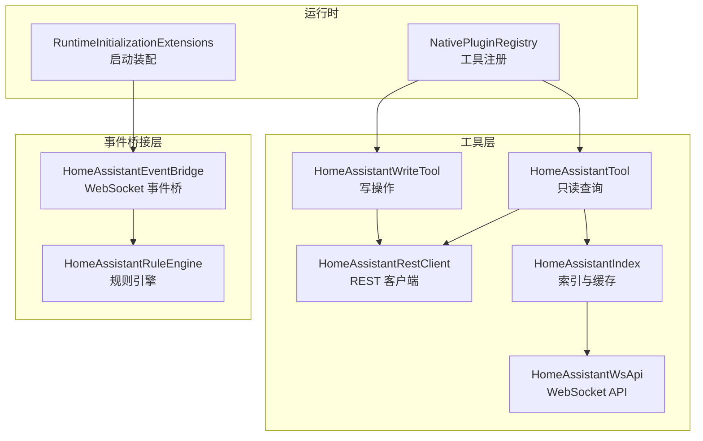
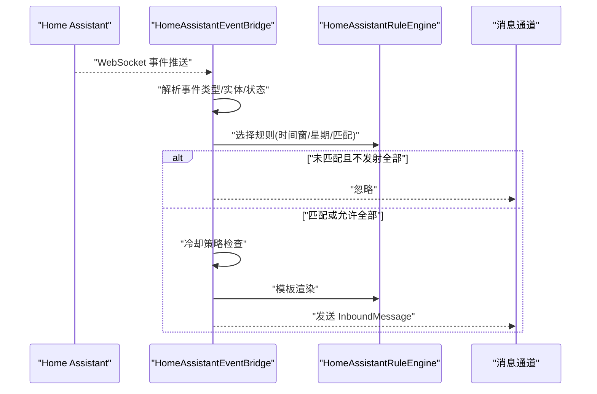
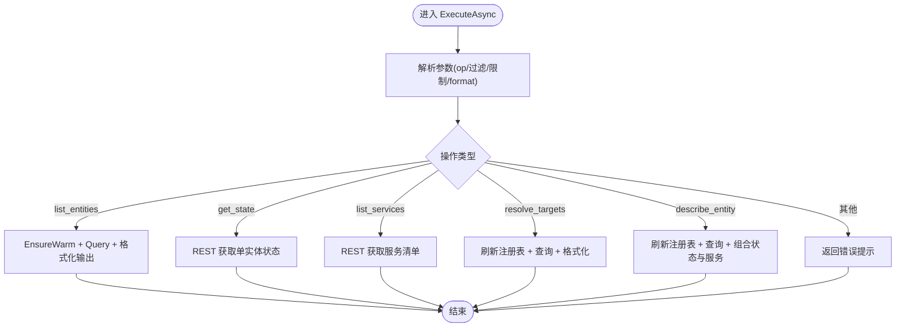
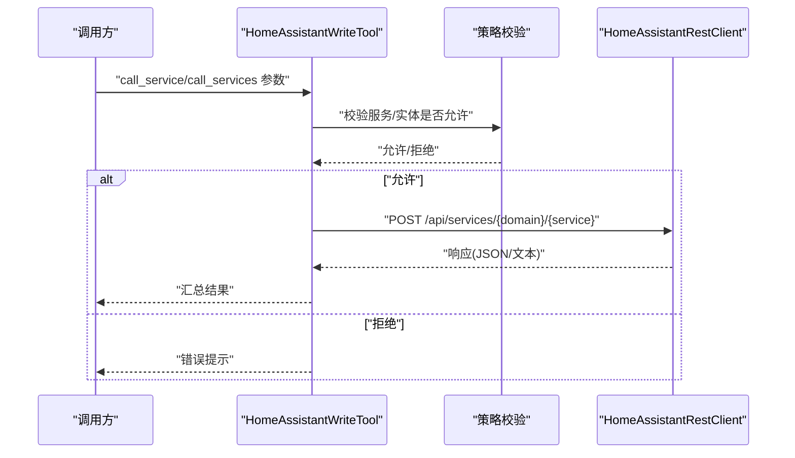
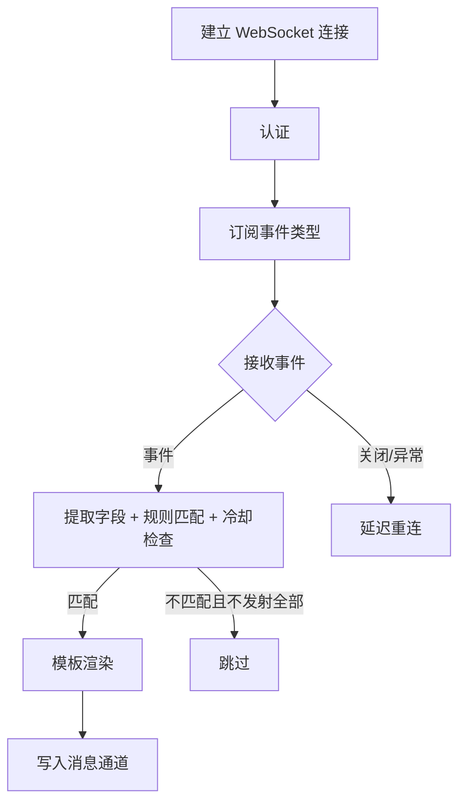
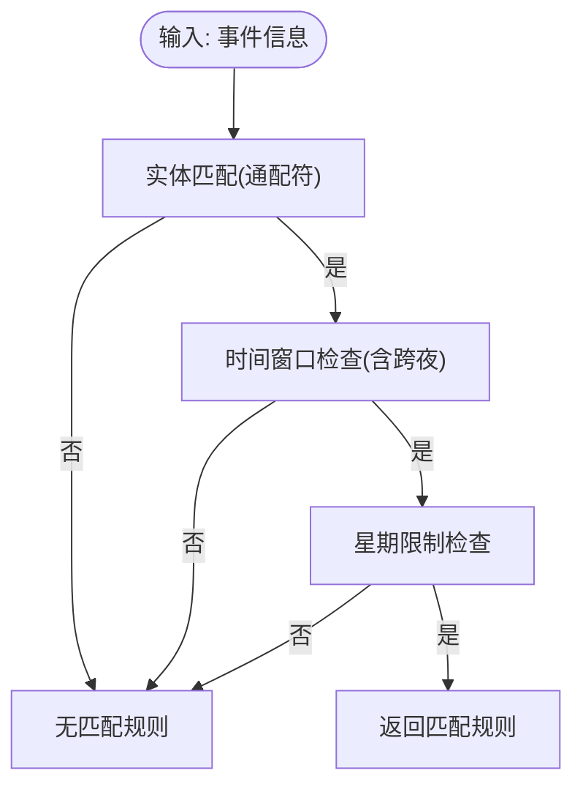
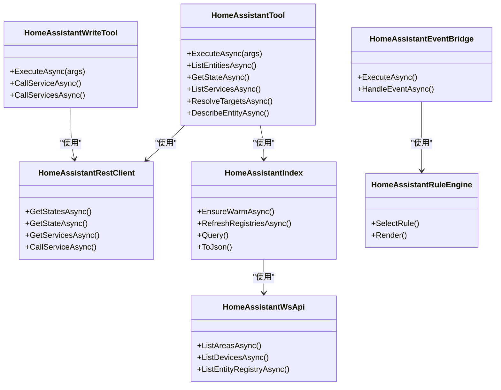

# 物联网与家庭自动化工具

<cite>
**本文档引用的文件**
- [HomeAssistantEventBridge.cs](file://src/OpenClaw.Agent/Integrations/HomeAssistantEventBridge.cs)
- [HomeAssistantRuleEngine.cs](file://src/OpenClaw.Agent/Integrations/HomeAssistantRuleEngine.cs)
- [HomeAssistantIndex.cs](file://src/OpenClaw.Agent/Tools/HomeAssistantIndex.cs)
- [HomeAssistantRestClient.cs](file://src/OpenClaw.Agent/Tools/HomeAssistantRestClient.cs)
- [HomeAssistantTool.cs](file://src/OpenClaw.Agent/Tools/HomeAssistantTool.cs)
- [HomeAssistantWsApi.cs](file://src/OpenClaw.Agent/Tools/HomeAssistantWsApi.cs)
- [HomeAssistantWriteTool.cs](file://src/OpenClaw.Agent/Tools/HomeAssistantWriteTool.cs)
- [NativePluginRegistry.cs](file://src/OpenClaw.Agent/Plugins/NativePluginRegistry.cs)
- [RuntimeInitializationExtensions.RuntimeFactories.cs](file://src/OpenClaw.Gateway/Composition/RuntimeInitializationExtensions.RuntimeFactories.cs)
- [EventBridgeRuleTests.cs](file://src/OpenClaw.Tests/EventBridgeRuleTests.cs)
- [NativePluginTests.cs](file://src/OpenClaw.Tests/NativePluginTests.cs)
</cite>

## 目录
1. [简介](#简介)
2. [项目结构](#项目结构)
3. [核心组件](#核心组件)
4. [架构总览](#架构总览)
5. [详细组件分析](#详细组件分析)
6. [依赖关系分析](#依赖关系分析)
7. [性能考虑](#性能考虑)
8. [故障排除指南](#故障排除指南)
9. [结论](#结论)
10. [附录](#附录)

## 简介
本文件面向物联网与家庭自动化工具模块，聚焦 Home Assistant 集成能力，系统化阐述以下主题：
- 设备控制：通过服务调用实现写操作（如开关、灯光、温控）
- 状态查询：读取实体状态、服务清单与目标解析
- 事件监听：基于 WebSocket 的事件桥接与规则引擎处理
- 规则引擎：按时间窗口、星期、实体匹配与冷却策略生成消息
- 配置与认证：基于令牌的认证、TLS 验证选项、超时与输出限制
- 实际场景：灯光控制、温度调节、安全监控等典型用法
- 配置指南与故障排除：常见问题定位与修复建议

## 项目结构
Home Assistant 集成由“工具层”和“事件桥接层”构成：
- 工具层：提供只读查询与写操作工具，封装 REST 与 WebSocket 调用
- 事件桥接层：连接 Home Assistant WebSocket，订阅事件，应用规则并输出消息
- 注册与运行：在网关启动时自动装配事件桥接与工具注册

**图表来源**
- [HomeAssistantTool.cs:1-283](file://src/OpenClaw.Agent/Tools/HomeAssistantTool.cs#L1-L283)
- [HomeAssistantWriteTool.cs:1-228](file://src/OpenClaw.Agent/Tools/HomeAssistantWriteTool.cs#L1-L228)
- [HomeAssistantRestClient.cs:1-155](file://src/OpenClaw.Agent/Tools/HomeAssistantRestClient.cs#L1-L155)
- [HomeAssistantWsApi.cs:1-224](file://src/OpenClaw.Agent/Tools/HomeAssistantWsApi.cs#L1-L224)
- [HomeAssistantIndex.cs:1-277](file://src/OpenClaw.Agent/Tools/HomeAssistantIndex.cs#L1-L277)
- [HomeAssistantEventBridge.cs:1-285](file://src/OpenClaw.Agent/Integrations/HomeAssistantEventBridge.cs#L1-L285)
- [HomeAssistantRuleEngine.cs:1-100](file://src/OpenClaw.Agent/Integrations/HomeAssistantRuleEngine.cs#L1-L100)
- [NativePluginRegistry.cs](file://src/OpenClaw.Agent/Plugins/NativePluginRegistry.cs)
- [RuntimeInitializationExtensions.RuntimeFactories.cs:357-376](file://src/OpenClaw.Gateway/Composition/RuntimeInitializationExtensions.RuntimeFactories.cs#L357-L376)

**章节来源**
- [HomeAssistantTool.cs:1-283](file://src/OpenClaw.Agent/Tools/HomeAssistantTool.cs#L1-L283)
- [HomeAssistantWriteTool.cs:1-228](file://src/OpenClaw.Agent/Tools/HomeAssistantWriteTool.cs#L1-L228)
- [HomeAssistantRestClient.cs:1-155](file://src/OpenClaw.Agent/Tools/HomeAssistantRestClient.cs#L1-L155)
- [HomeAssistantWsApi.cs:1-224](file://src/OpenClaw.Agent/Tools/HomeAssistantWsApi.cs#L1-L224)
- [HomeAssistantIndex.cs:1-277](file://src/OpenClaw.Agent/Tools/HomeAssistantIndex.cs#L1-L277)
- [HomeAssistantEventBridge.cs:1-285](file://src/OpenClaw.Agent/Integrations/HomeAssistantEventBridge.cs#L1-L285)
- [HomeAssistantRuleEngine.cs:1-100](file://src/OpenClaw.Agent/Integrations/HomeAssistantRuleEngine.cs#L1-L100)
- [NativePluginRegistry.cs](file://src/OpenClaw.Agent/Plugins/NativePluginRegistry.cs)
- [RuntimeInitializationExtensions.RuntimeFactories.cs:357-376](file://src/OpenClaw.Gateway/Composition/RuntimeInitializationExtensions.RuntimeFactories.cs#L357-L376)

## 核心组件
- HomeAssistantTool：提供只读查询能力，包括列出实体、查询状态、列举服务、解析目标、描述实体等
- HomeAssistantWriteTool：提供写操作能力，调用服务进行设备控制
- HomeAssistantRestClient：封装 REST API 调用，统一认证、超时与输出限制
- HomeAssistantWsApi：封装 WebSocket API 调用，用于区域/设备/实体注册表查询
- HomeAssistantIndex：维护实体索引与服务映射，提供查询与排序、JSON 序列化
- HomeAssistantEventBridge：后台服务，连接 Home Assistant WebSocket，订阅事件，应用规则并输出消息
- HomeAssistantRuleEngine：规则选择与模板渲染，支持时间窗口、星期、实体匹配与冷却策略
- NativePluginRegistry：在启用时注册 Home Assistant 相关工具
- RuntimeInitializationExtensions：在启动时装配事件桥接

**章节来源**
- [HomeAssistantTool.cs:1-283](file://src/OpenClaw.Agent/Tools/HomeAssistantTool.cs#L1-L283)
- [HomeAssistantWriteTool.cs:1-228](file://src/OpenClaw.Agent/Tools/HomeAssistantWriteTool.cs#L1-L228)
- [HomeAssistantRestClient.cs:1-155](file://src/OpenClaw.Agent/Tools/HomeAssistantRestClient.cs#L1-L155)
- [HomeAssistantWsApi.cs:1-224](file://src/OpenClaw.Agent/Tools/HomeAssistantWsApi.cs#L1-L224)
- [HomeAssistantIndex.cs:1-277](file://src/OpenClaw.Agent/Tools/HomeAssistantIndex.cs#L1-L277)
- [HomeAssistantEventBridge.cs:1-285](file://src/OpenClaw.Agent/Integrations/HomeAssistantEventBridge.cs#L1-L285)
- [HomeAssistantRuleEngine.cs:1-100](file://src/OpenClaw.Agent/Integrations/HomeAssistantRuleEngine.cs#L1-L100)
- [NativePluginRegistry.cs](file://src/OpenClaw.Agent/Plugins/NativePluginRegistry.cs)
- [RuntimeInitializationExtensions.RuntimeFactories.cs:357-376](file://src/OpenClaw.Gateway/Composition/RuntimeInitializationExtensions.RuntimeFactories.cs#L357-L376)

## 架构总览
下图展示从事件桥接到规则引擎再到消息输出的整体流程。

**图表来源**
- [HomeAssistantEventBridge.cs:116-172](file://src/OpenClaw.Agent/Integrations/HomeAssistantEventBridge.cs#L116-L172)
- [HomeAssistantRuleEngine.cs:15-44](file://src/OpenClaw.Agent/Integrations/HomeAssistantRuleEngine.cs#L15-L44)

**章节来源**
- [HomeAssistantEventBridge.cs:1-285](file://src/OpenClaw.Agent/Integrations/HomeAssistantEventBridge.cs#L1-L285)
- [HomeAssistantRuleEngine.cs:1-100](file://src/OpenClaw.Agent/Integrations/HomeAssistantRuleEngine.cs#L1-L100)

## 详细组件分析

### HomeAssistantTool（只读查询）
- 能力范围：列出实体、查询单个实体状态、列举服务、解析目标（按域/区域/名称）、描述实体（含友好名、区域、设备、平台、状态与常用服务）
- 数据来源：先通过 REST 获取状态，再通过索引与 WebSocket 注册表补充元数据
- 输出格式：文本或 JSON，支持限制数量与过滤条件

**图表来源**
- [HomeAssistantTool.cs:47-240](file://src/OpenClaw.Agent/Tools/HomeAssistantTool.cs#L47-L240)
- [HomeAssistantIndex.cs:36-161](file://src/OpenClaw.Agent/Tools/HomeAssistantIndex.cs#L36-L161)
- [HomeAssistantRestClient.cs:34-41](file://src/OpenClaw.Agent/Tools/HomeAssistantRestClient.cs#L34-L41)

**章节来源**
- [HomeAssistantTool.cs:1-283](file://src/OpenClaw.Agent/Tools/HomeAssistantTool.cs#L1-L283)
- [HomeAssistantIndex.cs:1-277](file://src/OpenClaw.Agent/Tools/HomeAssistantIndex.cs#L1-L277)
- [HomeAssistantRestClient.cs:1-155](file://src/OpenClaw.Agent/Tools/HomeAssistantRestClient.cs#L1-L155)

### HomeAssistantWriteTool（写操作）
- 能力范围：调用单个服务或批量服务，支持实体 ID 白名单/黑名单策略
- 安全策略：基于通配符匹配的服务与实体白名单/黑名单
- 返回结果：逐条记录成功/失败与响应内容

**图表来源**
- [HomeAssistantWriteTool.cs:67-149](file://src/OpenClaw.Agent/Tools/HomeAssistantWriteTool.cs#L67-L149)
- [HomeAssistantRestClient.cs:43-66](file://src/OpenClaw.Agent/Tools/HomeAssistantRestClient.cs#L43-L66)

**章节来源**
- [HomeAssistantWriteTool.cs:1-228](file://src/OpenClaw.Agent/Tools/HomeAssistantWriteTool.cs#L1-L228)
- [HomeAssistantRestClient.cs:1-155](file://src/OpenClaw.Agent/Tools/HomeAssistantRestClient.cs#L1-L155)

### HomeAssistantRestClient（REST 客户端）
- 认证：Bearer Token（来自密钥解析器），支持禁用 TLS 验证
- 超时：基于配置的超时秒数，避免阻塞
- 输出限制：最大字符数截断，防止过大响应
- 错误处理：401/403 明确提示授权失败，其他错误返回状态码与原因

**章节来源**
- [HomeAssistantRestClient.cs:1-155](file://src/OpenClaw.Agent/Tools/HomeAssistantRestClient.cs#L1-L155)

### HomeAssistantWsApi（WebSocket API）
- 用途：区域/设备/实体注册表查询，供索引构建使用
- 流程：握手认证 -> 发送请求 -> 等待 result 成功 -> 解析结果

**章节来源**
- [HomeAssistantWsApi.cs:1-224](file://src/OpenClaw.Agent/Tools/HomeAssistantWsApi.cs#L1-L224)

### HomeAssistantIndex（索引与缓存）
- 缓存策略：状态每 10 秒刷新一次，注册表与服务每 15 分钟刷新一次
- 查询能力：按域、区域、名称包含进行过滤与排序
- JSON 导出：将查询结果序列化为数组，包含实体 ID、友好名、区域、设备、平台、状态等

**章节来源**
- [HomeAssistantIndex.cs:1-277](file://src/OpenClaw.Agent/Tools/HomeAssistantIndex.cs#L1-L277)

### HomeAssistantEventBridge（事件桥接）
- 连接：WebSocket 连接 Home Assistant，认证后订阅指定事件类型
- 处理：提取事件类型、实体 ID、新旧状态、友好名；应用规则与冷却策略；输出消息
- 重连：异常时指数退避重连，最大 30 秒

**图表来源**
- [HomeAssistantEventBridge.cs:61-114](file://src/OpenClaw.Agent/Integrations/HomeAssistantEventBridge.cs#L61-L114)
- [HomeAssistantEventBridge.cs:116-172](file://src/OpenClaw.Agent/Integrations/HomeAssistantEventBridge.cs#L116-L172)

**章节来源**
- [HomeAssistantEventBridge.cs:1-285](file://src/OpenClaw.Agent/Integrations/HomeAssistantEventBridge.cs#L1-L285)

### HomeAssistantRuleEngine（规则引擎）
- 规则选择：实体匹配（通配符）、起始/终止本地时间窗口（支持跨夜）、星期限制
- 模板渲染：将事件信息注入模板字符串中的占位符
- 测试验证：单元测试覆盖匹配、跨夜窗口与模板替换

**图表来源**
- [HomeAssistantRuleEngine.cs:15-30](file://src/OpenClaw.Agent/Integrations/HomeAssistantRuleEngine.cs#L15-L30)
- [HomeAssistantRuleEngine.cs:46-97](file://src/OpenClaw.Agent/Integrations/HomeAssistantRuleEngine.cs#L46-L97)

**章节来源**
- [HomeAssistantRuleEngine.cs:1-100](file://src/OpenClaw.Agent/Integrations/HomeAssistantRuleEngine.cs#L1-L100)
- [EventBridgeRuleTests.cs:1-81](file://src/OpenClaw.Tests/EventBridgeRuleTests.cs#L1-L81)

### 工具注册与启动装配
- 注册：当 Home Assistant 插件启用时，注册只读与写操作两个工具
- 启动：网关启动时装配事件桥接后台服务

**章节来源**
- [NativePluginTests.cs:36-52](file://src/OpenClaw.Tests/NativePluginTests.cs#L36-L52)
- [RuntimeInitializationExtensions.RuntimeFactories.cs:357-376](file://src/OpenClaw.Gateway/Composition/RuntimeInitializationExtensions.RuntimeFactories.cs#L357-L376)

## 依赖关系分析

**图表来源**
- [HomeAssistantTool.cs:1-283](file://src/OpenClaw.Agent/Tools/HomeAssistantTool.cs#L1-L283)
- [HomeAssistantWriteTool.cs:1-228](file://src/OpenClaw.Agent/Tools/HomeAssistantWriteTool.cs#L1-L228)
- [HomeAssistantRestClient.cs:1-155](file://src/OpenClaw.Agent/Tools/HomeAssistantRestClient.cs#L1-L155)
- [HomeAssistantWsApi.cs:1-224](file://src/OpenClaw.Agent/Tools/HomeAssistantWsApi.cs#L1-L224)
- [HomeAssistantIndex.cs:1-277](file://src/OpenClaw.Agent/Tools/HomeAssistantIndex.cs#L1-L277)
- [HomeAssistantEventBridge.cs:1-285](file://src/OpenClaw.Agent/Integrations/HomeAssistantEventBridge.cs#L1-L285)
- [HomeAssistantRuleEngine.cs:1-100](file://src/OpenClaw.Agent/Integrations/HomeAssistantRuleEngine.cs#L1-L100)

**章节来源**
- [HomeAssistantTool.cs:1-283](file://src/OpenClaw.Agent/Tools/HomeAssistantTool.cs#L1-L283)
- [HomeAssistantWriteTool.cs:1-228](file://src/OpenClaw.Agent/Tools/HomeAssistantWriteTool.cs#L1-L228)
- [HomeAssistantRestClient.cs:1-155](file://src/OpenClaw.Agent/Tools/HomeAssistantRestClient.cs#L1-L155)
- [HomeAssistantWsApi.cs:1-224](file://src/OpenClaw.Agent/Tools/HomeAssistantWsApi.cs#L1-L224)
- [HomeAssistantIndex.cs:1-277](file://src/OpenClaw.Agent/Tools/HomeAssistantIndex.cs#L1-L277)
- [HomeAssistantEventBridge.cs:1-285](file://src/OpenClaw.Agent/Integrations/HomeAssistantEventBridge.cs#L1-L285)
- [HomeAssistantRuleEngine.cs:1-100](file://src/OpenClaw.Agent/Integrations/HomeAssistantRuleEngine.cs#L1-L100)

## 性能考虑
- 缓存策略：状态每 10 秒刷新一次，注册表与服务每 15 分钟刷新一次，降低频繁查询开销
- 输出限制：REST 客户端对响应进行字符数截断，避免超大负载
- 冷却策略：事件桥接支持全局与规则级冷却，减少高频事件风暴
- 超时控制：REST 请求基于配置超时，避免长时间阻塞
- WebSocket 保活：设置 KeepAlive 间隔，维持长连接稳定

[本节为通用性能讨论，无需特定文件来源]

## 故障排除指南
- 认证失败（401/403）
  - 现象：调用服务或获取状态时报错
  - 排查：确认 TokenRef 配置正确，环境变量或密钥解析可用
  - 参考
    - [HomeAssistantRestClient.cs:26-28](file://src/OpenClaw.Agent/Tools/HomeAssistantRestClient.cs#L26-L28)
    - [HomeAssistantRestClient.cs:56-62](file://src/OpenClaw.Agent/Tools/HomeAssistantRestClient.cs#L56-L62)
- WebSocket 认证失败
  - 现象：事件桥接连接后立即失败
  - 排查：确认 BaseUrl 与 TokenRef 正确，网络可达
  - 参考
    - [HomeAssistantEventBridge.cs:74-85](file://src/OpenClaw.Agent/Integrations/HomeAssistantEventBridge.cs#L74-L85)
    - [HomeAssistantWsApi.cs:50-61](file://src/OpenClaw.Agent/Tools/HomeAssistantWsApi.cs#L50-L61)
- 事件未触发或被忽略
  - 现象：期望事件未产生消息
  - 排查：检查事件类型订阅、实体 ID 匹配、规则时间窗与星期限制、冷却策略
  - 参考
    - [HomeAssistantEventBridge.cs:88-98](file://src/OpenClaw.Agent/Integrations/HomeAssistantEventBridge.cs#L88-L98)
    - [HomeAssistantRuleEngine.cs:60-97](file://src/OpenClaw.Agent/Integrations/HomeAssistantRuleEngine.cs#L60-L97)
- 写操作被策略拒绝
  - 现象：call_service/call_services 返回策略错误
  - 排查：检查 Allow/Deny 服务与实体 ID 通配符
  - 参考
    - [HomeAssistantWriteTool.cs:90-98](file://src/OpenClaw.Agent/Tools/HomeAssistantWriteTool.cs#L90-L98)
- TLS 验证问题
  - 现象：HTTPS 连接失败
  - 排查：可临时禁用 TLS 验证（仅开发调试）
  - 参考
    - [HomeAssistantRestClient.cs:113-119](file://src/OpenClaw.Agent/Tools/HomeAssistantRestClient.cs#L113-L119)
- 工具未注册
  - 现象：找不到 home_assistant 或 home_assistant_write 工具
  - 排查：确认 NativePlugins 配置中 HomeAssistant 已启用
  - 参考
    - [NativePluginTests.cs:36-52](file://src/OpenClaw.Tests/NativePluginTests.cs#L36-L52)
    - [NativePluginRegistry.cs](file://src/OpenClaw.Agent/Plugins/NativePluginRegistry.cs)

**章节来源**
- [HomeAssistantRestClient.cs:1-155](file://src/OpenClaw.Agent/Tools/HomeAssistantRestClient.cs#L1-L155)
- [HomeAssistantWsApi.cs:1-224](file://src/OpenClaw.Agent/Tools/HomeAssistantWsApi.cs#L1-L224)
- [HomeAssistantEventBridge.cs:1-285](file://src/OpenClaw.Agent/Integrations/HomeAssistantEventBridge.cs#L1-L285)
- [HomeAssistantRuleEngine.cs:1-100](file://src/OpenClaw.Agent/Integrations/HomeAssistantRuleEngine.cs#L1-L100)
- [HomeAssistantWriteTool.cs:1-228](file://src/OpenClaw.Agent/Tools/HomeAssistantWriteTool.cs#L1-L228)
- [NativePluginTests.cs:36-52](file://src/OpenClaw.Tests/NativePluginTests.cs#L36-L52)
- [NativePluginRegistry.cs](file://src/OpenClaw.Agent/Plugins/NativePluginRegistry.cs)

## 结论
本模块以工具与事件桥接为核心，提供了完整的 Home Assistant 集成方案：
- 通过只读工具实现设备状态查询与目标解析
- 通过写工具实现安全可控的设备控制
- 通过事件桥接与规则引擎实现智能化联动与消息输出
- 通过缓存、冷却与超时策略保障性能与稳定性
- 通过严格的策略与认证机制确保安全性

[本节为总结性内容，无需特定文件来源]

## 附录

### 配置要点与示例路径
- 启用 Home Assistant 工具：在 NativePlugins 中开启 HomeAssistant 并配置 BaseUrl 与 TokenRef
  - 参考
    - [NativePluginTests.cs:36-52](file://src/OpenClaw.Tests/NativePluginTests.cs#L36-L52)
- 事件桥接：配置事件类型订阅、通道与会话、冷却策略、规则模板
  - 参考
    - [HomeAssistantEventBridge.cs:34-98](file://src/OpenClaw.Agent/Integrations/HomeAssistantEventBridge.cs#L34-L98)
    - [HomeAssistantRuleEngine.cs:32-44](file://src/OpenClaw.Agent/Integrations/HomeAssistantRuleEngine.cs#L32-L44)
- 写操作策略：配置服务与实体 ID 的允许/拒绝列表
  - 参考
    - [HomeAssistantWriteTool.cs:90-98](file://src/OpenClaw.Agent/Tools/HomeAssistantWriteTool.cs#L90-L98)

### 实际场景示例（步骤说明）
- 灯光控制
  - 步骤：使用 home_assistant 查找目标实体；使用 home_assistant_write 调用对应 domain.service；观察状态变化
  - 参考
    - [HomeAssistantTool.cs:153-182](file://src/OpenClaw.Agent/Tools/HomeAssistantTool.cs#L153-L182)
    - [HomeAssistantWriteTool.cs:84-103](file://src/OpenClaw.Agent/Tools/HomeAssistantWriteTool.cs#L84-L103)
- 温度调节
  - 步骤：查询温度传感器状态；根据设定调用目标服务；观察状态更新
  - 参考
    - [HomeAssistantTool.cs:103-117](file://src/OpenClaw.Agent/Tools/HomeAssistantTool.cs#L103-L117)
    - [HomeAssistantWriteTool.cs:84-103](file://src/OpenClaw.Agent/Tools/HomeAssistantWriteTool.cs#L84-L103)
- 安全监控
  - 步骤：订阅 binary_sensor.* 事件；配置规则在夜间触发告警；按需冷却避免重复告警
  - 参考
    - [HomeAssistantEventBridge.cs:88-98](file://src/OpenClaw.Agent/Integrations/HomeAssistantEventBridge.cs#L88-L98)
    - [HomeAssistantRuleEngine.cs:60-97](file://src/OpenClaw.Agent/Integrations/HomeAssistantRuleEngine.cs#L60-L97)