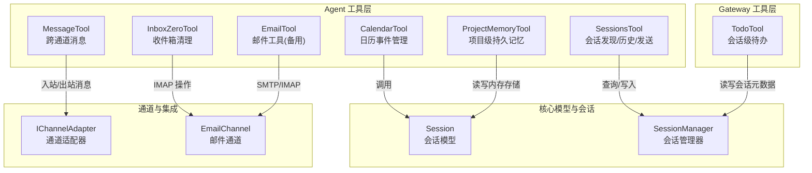
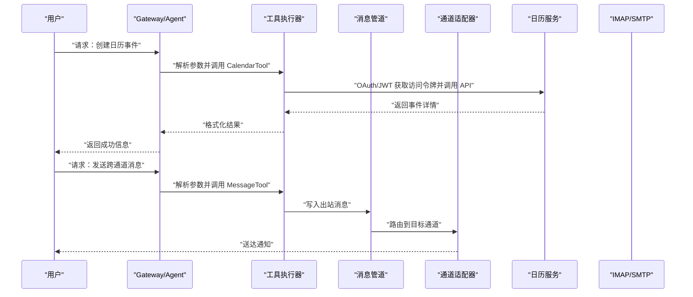
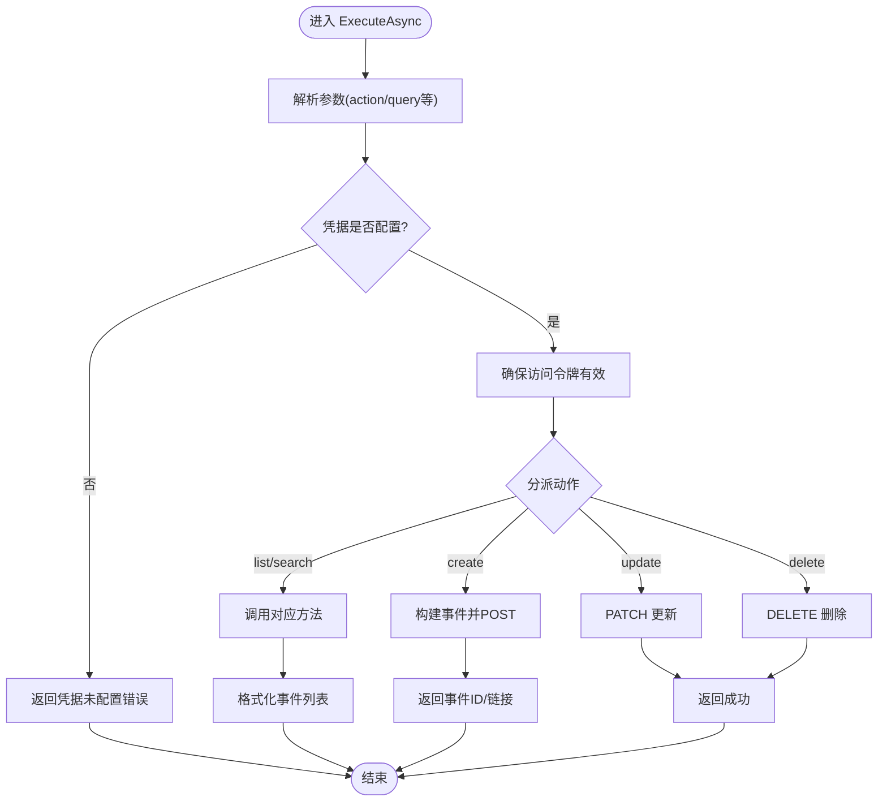
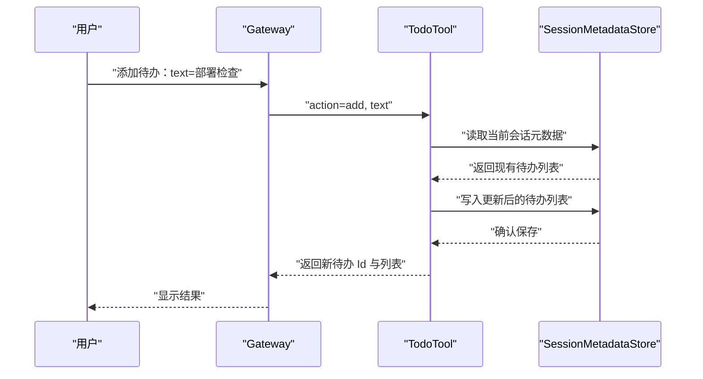
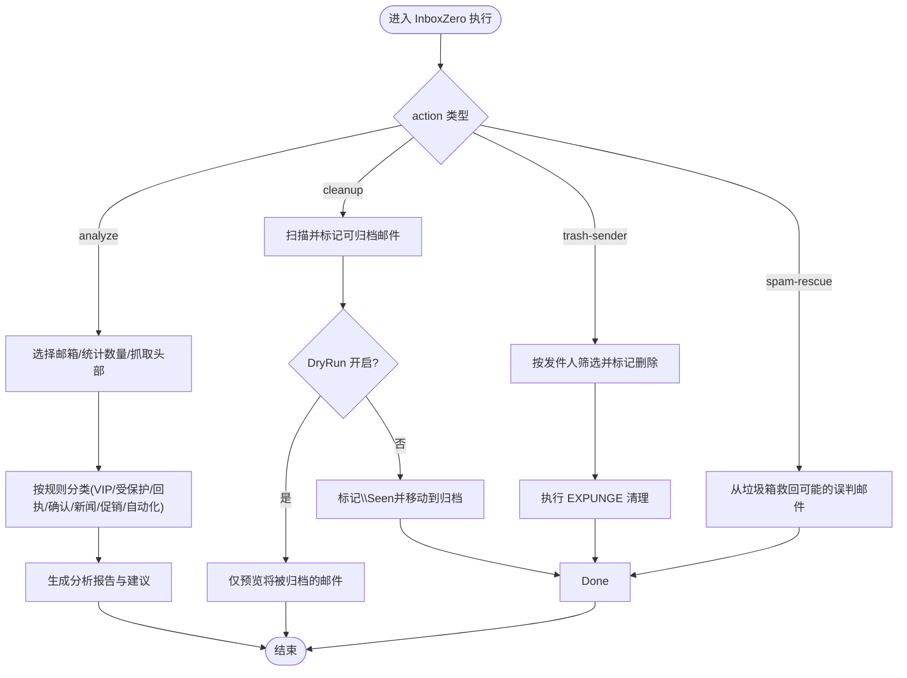
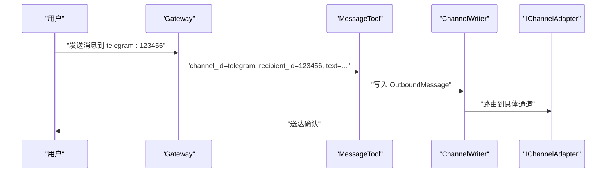
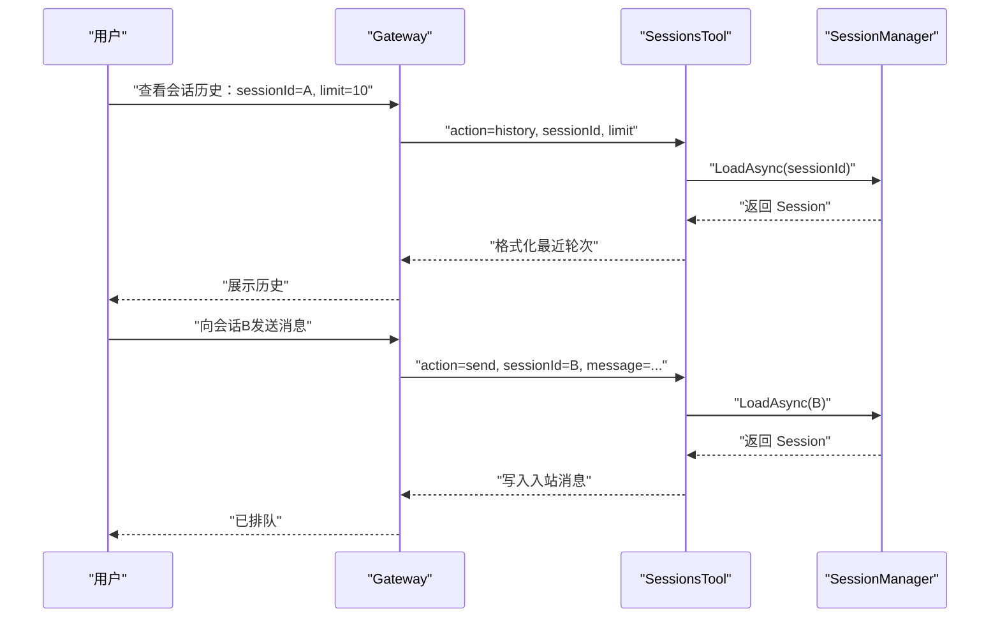
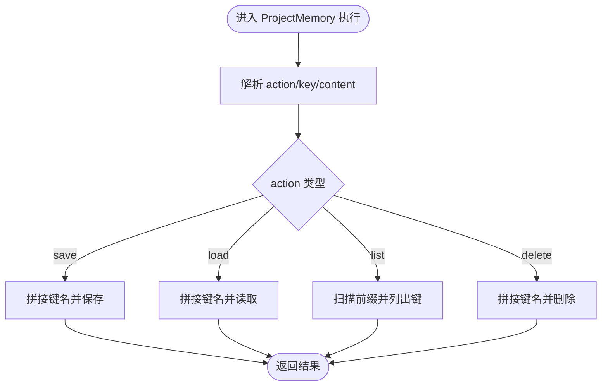
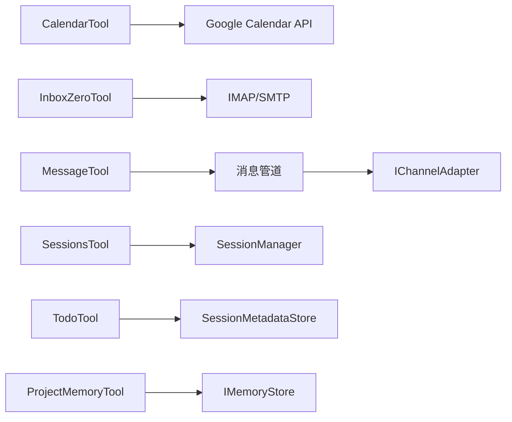

# 生产力工具

<cite>
**本文引用的文件**
- [CalendarTool.cs](file://src/OpenClaw.Agent/Tools/CalendarTool.cs)
- [TodoTool.cs](file://src/OpenClaw.Gateway/Tools/TodoTool.cs)
- [InboxZeroTool.cs](file://src/OpenClaw.Agent/Tools/InboxZeroTool.cs)
- [MessageTool.cs](file://src/OpenClaw.Agent/Tools/MessageTool.cs)
- [SessionsTool.cs](file://src/OpenClaw.Agent/Tools/SessionsTool.cs)
- [ProjectMemoryTool.cs](file://src/OpenClaw.Agent/Tools/ProjectMemoryTool.cs)
- [Session.cs](file://src/OpenClaw.Core/Models/Session.cs)
- [SessionAdminModels.cs](file://src/OpenClaw.Core/Models/SessionAdminModels.cs)
- [SessionManager.cs](file://src/OpenClaw.Core/Sessions/SessionManager.cs)
- [EmailChannel.cs](file://src/OpenClaw.Channels/EmailChannel.cs)
- [EmailTool.cs](file://src/OpenClaw.Agent/Tools/EmailTool.cs)
- [IChannelAdapter.cs](file://src/OpenClaw.Core/Abstractions/IChannelAdapter.cs)
- [SKILL.md](file://src/OpenClaw.Gateway/skills/email-triage/SKILL.md)
</cite>

## 目录
1. [简介](#简介)
2. [项目结构](#项目结构)
3. [核心组件](#核心组件)
4. [架构总览](#架构总览)
5. [详细组件分析](#详细组件分析)
6. [依赖关系分析](#依赖关系分析)
7. [性能考量](#性能考量)
8. [故障排查指南](#故障排查指南)
9. [结论](#结论)
10. [附录](#附录)

## 简介
本技术文档聚焦于“生产力工具模块”，系统性梳理并说明以下高效能工具：日历管理（Google Calendar）、待办事项（会话级）、消息处理（跨通道）、收件箱清理（Inbox Zero）、项目记忆（跨会话持久化）以及会话管理（发现、历史读取、跨会话消息）。文档覆盖数据模型、API 接口定义、配置项、典型工作流与最佳实践，并提供可视化图示帮助理解。

## 项目结构
生产力工具模块主要分布在以下位置：
- 工具实现：Agent 层的工具类（日历、收件箱、消息、会话、项目记忆、邮件工具），Gateway 层的会话级待办工具
- 会话与状态：核心会话模型、会话管理器、会话元数据存储
- 通道适配：多渠道适配器抽象，邮件通道实现
- 技能与工作流：收件箱三段式技能（triage）

图表来源
- [CalendarTool.cs:14-112](file://src/OpenClaw.Agent/Tools/CalendarTool.cs#L14-L112)
- [InboxZeroTool.cs:14-92](file://src/OpenClaw.Agent/Tools/InboxZeroTool.cs#L14-L92)
- [MessageTool.cs:11-54](file://src/OpenClaw.Agent/Tools/MessageTool.cs#L11-L54)
- [SessionsTool.cs:17-69](file://src/OpenClaw.Agent/Tools/SessionsTool.cs#L17-L69)
- [ProjectMemoryTool.cs:12-71](file://src/OpenClaw.Agent/Tools/ProjectMemoryTool.cs#L12-L71)
- [Session.cs:15-135](file://src/OpenClaw.Core/Models/Session.cs#L15-L135)
- [SessionManager.cs:13-36](file://src/OpenClaw.Core/Sessions/SessionManager.cs#L13-L36)
- [IChannelAdapter.cs:9-21](file://src/OpenClaw.Core/Abstractions/IChannelAdapter.cs#L9-L21)
- [EmailChannel.cs:75-115](file://src/OpenClaw.Channels/EmailChannel.cs#L75-L115)

章节来源
- [CalendarTool.cs:14-112](file://src/OpenClaw.Agent/Tools/CalendarTool.cs#L14-L112)
- [TodoTool.cs:8-30](file://src/OpenClaw.Gateway/Tools/TodoTool.cs#L8-L30)
- [InboxZeroTool.cs:14-92](file://src/OpenClaw.Agent/Tools/InboxZeroTool.cs#L14-L92)
- [MessageTool.cs:11-54](file://src/OpenClaw.Agent/Tools/MessageTool.cs#L11-L54)
- [SessionsTool.cs:17-69](file://src/OpenClaw.Agent/Tools/SessionsTool.cs#L17-L69)
- [ProjectMemoryTool.cs:12-71](file://src/OpenClaw.Agent/Tools/ProjectMemoryTool.cs#L12-L71)
- [Session.cs:15-135](file://src/OpenClaw.Core/Models/Session.cs#L15-L135)
- [SessionManager.cs:13-36](file://src/OpenClaw.Core/Sessions/SessionManager.cs#L13-L36)
- [IChannelAdapter.cs:9-21](file://src/OpenClaw.Core/Abstractions/IChannelAdapter.cs#L9-L21)
- [EmailChannel.cs:75-115](file://src/OpenClaw.Channels/EmailChannel.cs#L75-L115)

## 核心组件
- 日历管理（CalendarTool）
  - 功能：列出、搜索、创建、更新、删除日历事件；支持查询范围与最大条数
  - 认证：基于 Google Calendar Service Account 的 JWT 自签发令牌
  - 参数：action、query、title、start、end、description、location、event_id、days_ahead
  - 错误处理：凭据缺失、HTTP 请求失败、不支持的动作
- 待办事项（TodoTool）
  - 功能：会话级待办列表管理（list/add/update/complete/remove/clear）
  - 存储：通过会话元数据存储（SessionMetadataStore）持久化
  - 参数：action、id、text、notes
- 收件箱清理（InboxZeroTool）
  - 功能：分析、分类、清理、按发件人屏蔽、垃圾救援（DryRun 安全模式）
  - 分类规则：VIP/受保护/回执/确认/新闻/促销/自动化/未知
  - 参数：action、sender、folder、count
  - IMAP 操作：登录、选择邮箱、统计数量、抓取头部、标记/移动/复制/删除
- 消息处理（MessageTool）
  - 功能：向指定通道与接收者发送消息，经由消息管道路由
  - 参数：channel_id、recipient_id、text、reply_to
- 会话管理（SessionsTool）
  - 功能：列出活跃会话、读取会话历史、向目标会话发送消息
  - 参数：action、sessionId、message、limit
- 项目记忆（ProjectMemoryTool）
  - 功能：以项目维度保存/加载/列出/删除键值型上下文，跨会话持久化
  - 参数：action、key、content

章节来源
- [CalendarTool.cs:27-112](file://src/OpenClaw.Agent/Tools/CalendarTool.cs#L27-L112)
- [TodoTool.cs:17-110](file://src/OpenClaw.Gateway/Tools/TodoTool.cs#L17-L110)
- [InboxZeroTool.cs:46-92](file://src/OpenClaw.Agent/Tools/InboxZeroTool.cs#L46-L92)
- [MessageTool.cs:20-54](file://src/OpenClaw.Agent/Tools/MessageTool.cs#L20-L54)
- [SessionsTool.cs:22-69](file://src/OpenClaw.Agent/Tools/SessionsTool.cs#L22-L69)
- [ProjectMemoryTool.cs:17-71](file://src/OpenClaw.Agent/Tools/ProjectMemoryTool.cs#L17-L71)

## 架构总览
生产力工具围绕“会话”为中心进行组织，工具通过统一的参数模式与错误处理机制协同工作。消息在通道适配器之上流转，会话管理器负责生命周期与持久化，项目记忆提供跨会话上下文。

图表来源
- [CalendarTool.cs:79-112](file://src/OpenClaw.Agent/Tools/CalendarTool.cs#L79-L112)
- [MessageTool.cs:24-54](file://src/OpenClaw.Agent/Tools/MessageTool.cs#L24-L54)
- [IChannelAdapter.cs:13-21](file://src/OpenClaw.Core/Abstractions/IChannelAdapter.cs#L13-L21)

## 详细组件分析

### 日历管理（CalendarTool）
- 数据模型
  - 事件字段：标题、开始/结束时间、地点、描述、ID、链接
  - 认证：服务账号密钥文件路径、令牌缓存与过期控制
- API 行为
  - 列表/搜索：按时间窗口与查询条件过滤
  - 创建/更新/删除：构造事件 JSON 并调用 REST API
  - 错误处理：凭据缺失、网络异常、HTTP 失败
- 配置要点
  - Calendar.CredentialsPath：服务账号密钥文件
  - Calendar.CalendarId：日历标识
  - Calendar.MaxEvents：最大返回条数
- 使用场景
  - 会议安排：自动创建/更新会议事件并返回链接
  - 任务跟踪：结合会话历史与项目记忆，记录里程碑事件

图表来源
- [CalendarTool.cs:79-112](file://src/OpenClaw.Agent/Tools/CalendarTool.cs#L79-L112)
- [CalendarTool.cs:114-155](file://src/OpenClaw.Agent/Tools/CalendarTool.cs#L114-L155)
- [CalendarTool.cs:157-236](file://src/OpenClaw.Agent/Tools/CalendarTool.cs#L157-L236)

章节来源
- [CalendarTool.cs:27-112](file://src/OpenClaw.Agent/Tools/CalendarTool.cs#L27-L112)
- [CalendarTool.cs:114-155](file://src/OpenClaw.Agent/Tools/CalendarTool.cs#L114-L155)
- [CalendarTool.cs:157-236](file://src/OpenClaw.Agent/Tools/CalendarTool.cs#L157-L236)

### 待办事项（TodoTool）
- 数据模型
  - 会话级待办项：Id、Text、Notes、Completed、CreatedAtUtc、UpdatedAtUtc
  - 元数据存储：SessionMetadataStore
- API 行为
  - list：按完成状态与创建时间排序输出
  - add：生成唯一 Id，设置创建/更新时间
  - update/complete/remove：按 Id 查找并更新或移除
  - clear：清空当前会话所有待办
- 配置要点
  - 无外部配置，依赖会话元数据存储
- 使用场景
  - 任务跟踪：在会话内维护短期任务清单
  - 协作同步：通过 SessionsTool 跨会话共享任务状态

图表来源
- [TodoTool.cs:35-110](file://src/OpenClaw.Gateway/Tools/TodoTool.cs#L35-L110)
- [SessionManager.cs:297-303](file://src/OpenClaw.Core/Sessions/SessionManager.cs#L297-L303)

章节来源
- [TodoTool.cs:17-110](file://src/OpenClaw.Gateway/Tools/TodoTool.cs#L17-L110)
- [SessionManager.cs:297-303](file://src/OpenClaw.Core/Sessions/SessionManager.cs#L297-L303)

### 收件箱清理（InboxZeroTool）
- 数据模型
  - 邮件头：主题、发件人、日期、是否包含退订头
  - 分类：VIP/受保护/受保护关键词/回执/确认/新闻/促销/自动化/未知
- API 行为
  - analyze：统计各类别数量与明细
  - cleanup：归档可安全清理的邮件（支持 DryRun）
  - trash-sender：按发件人批量删除
  - spam-rescue：从垃圾箱救回可能的误判
- IMAP 流程
  - 登录 → 选择邮箱 → 统计数量 → 抓取头部 → 标记/移动/复制/删除
- 配置要点
  - InboxZero.DryRun：是否启用安全模式
  - InboxZero.MaxBatchSize：批处理上限
  - InboxZero.VipSenders/ProtectedSenders/ProtectedKeywords：白名单/保护词
  - Email.Username/PasswordRef/ImapHost/ImapPort：IMAP 凭据
- 使用场景
  - 三段式收件箱治理：先分析，再清理，后确认
  - 与邮件通道联动：自动轮询与投递

图表来源
- [InboxZeroTool.cs:96-162](file://src/OpenClaw.Agent/Tools/InboxZeroTool.cs#L96-L162)
- [InboxZeroTool.cs:164-233](file://src/OpenClaw.Agent/Tools/InboxZeroTool.cs#L164-L233)
- [InboxZeroTool.cs:235-299](file://src/OpenClaw.Agent/Tools/InboxZeroTool.cs#L235-L299)
- [InboxZeroTool.cs:301-377](file://src/OpenClaw.Agent/Tools/InboxZeroTool.cs#L301-L377)

章节来源
- [InboxZeroTool.cs:46-92](file://src/OpenClaw.Agent/Tools/InboxZeroTool.cs#L46-L92)
- [InboxZeroTool.cs:96-162](file://src/OpenClaw.Agent/Tools/InboxZeroTool.cs#L96-L162)
- [InboxZeroTool.cs:164-233](file://src/OpenClaw.Agent/Tools/InboxZeroTool.cs#L164-L233)
- [InboxZeroTool.cs:235-299](file://src/OpenClaw.Agent/Tools/InboxZeroTool.cs#L235-L299)
- [InboxZeroTool.cs:301-377](file://src/OpenClaw.Agent/Tools/InboxZeroTool.cs#L301-L377)
- [EmailChannel.cs:75-115](file://src/OpenClaw.Channels/EmailChannel.cs#L75-L115)
- [SKILL.md:1-20](file://src/OpenClaw.Gateway/skills/email-triage/SKILL.md#L1-L20)

### 消息处理（MessageTool）
- 数据模型
  - 出站消息：ChannelId、RecipientId、Text、ReplyToMessageId
- API 行为
  - 校验必填参数，封装为 OutboundMessage 写入管道
- 使用场景
  - 跨通道通知：向 Telegram/Slack/Discord/SMS/Email/WebSocket 发送消息
  - 回复链路：通过 ReplyToMessageId 实现回复关联

图表来源
- [MessageTool.cs:24-54](file://src/OpenClaw.Agent/Tools/MessageTool.cs#L24-L54)
- [IChannelAdapter.cs:13-21](file://src/OpenClaw.Core/Abstractions/IChannelAdapter.cs#L13-L21)

章节来源
- [MessageTool.cs:20-54](file://src/OpenClaw.Agent/Tools/MessageTool.cs#L20-L54)
- [IChannelAdapter.cs:9-21](file://src/OpenClaw.Core/Abstractions/IChannelAdapter.cs#L9-L21)

### 会话管理（SessionsTool）
- 数据模型
  - SessionsArgs：action、sessionId、message、limit
  - Session：会话标识、通道、发送者、历史、状态、计数
  - SessionManager：活跃会话字典、持久化、分支快照、锁管理
- API 行为
  - list：列出当前活跃会话
  - history：读取最近 N 轮对话（排除工具调用占位）
  - send：向目标会话注入入站消息
- 使用场景
  - 跨会话协作：子代理间通信
  - 会话检索：快速定位历史上下文

图表来源
- [SessionsTool.cs:50-118](file://src/OpenClaw.Agent/Tools/SessionsTool.cs#L50-L118)
- [SessionManager.cs:297-303](file://src/OpenClaw.Core/Sessions/SessionManager.cs#L297-L303)
- [Session.cs:15-135](file://src/OpenClaw.Core/Models/Session.cs#L15-L135)

章节来源
- [SessionsTool.cs:22-118](file://src/OpenClaw.Agent/Tools/SessionsTool.cs#L22-L118)
- [SessionManager.cs:255-303](file://src/OpenClaw.Core/Sessions/SessionManager.cs#L255-L303)
- [Session.cs:15-135](file://src/OpenClaw.Core/Models/Session.cs#L15-L135)

### 项目记忆（ProjectMemoryTool）
- 数据模型
  - 键命名空间：project:{projectId}:{key}
  - 存储：IMemoryStore（文件/SQLite 等）
- API 行为
  - save：保存键值内容
  - load：读取键值内容
  - list：列出项目下所有键
  - delete：删除指定键
- 使用场景
  - 项目级上下文：架构约定、偏好设置、决策摘要
  - 跨会话复用：不同会话共享同一项目记忆

图表来源
- [ProjectMemoryTool.cs:53-127](file://src/OpenClaw.Agent/Tools/ProjectMemoryTool.cs#L53-L127)

章节来源
- [ProjectMemoryTool.cs:17-127](file://src/OpenClaw.Agent/Tools/ProjectMemoryTool.cs#L17-L127)

## 依赖关系分析
- 组件耦合
  - CalendarTool 依赖 Google Calendar API 与 HTTP 客户端
  - InboxZeroTool 依赖 EmailConfig 与 IMAP/SMTP 连接
  - MessageTool 依赖消息管道与通道适配器
  - SessionsTool 依赖 SessionManager 与会话元数据存储
  - TodoTool 依赖会话元数据存储
  - ProjectMemoryTool 依赖 IMemoryStore
- 外部依赖
  - Google Calendar REST API
  - IMAP/SMTP 协议栈
  - 通道适配器（Telegram、Slack、Discord、SMS、Email、WebSocket 等）

图表来源
- [CalendarTool.cs:77-94](file://src/OpenClaw.Agent/Tools/CalendarTool.cs#L77-L94)
- [InboxZeroTool.cs:476-528](file://src/OpenClaw.Agent/Tools/InboxZeroTool.cs#L476-L528)
- [MessageTool.cs:13-18](file://src/OpenClaw.Agent/Tools/MessageTool.cs#L13-L18)
- [IChannelAdapter.cs:9-21](file://src/OpenClaw.Core/Abstractions/IChannelAdapter.cs#L9-L21)
- [SessionsTool.cs:42-46](file://src/OpenClaw.Agent/Tools/SessionsTool.cs#L42-L46)
- [SessionManager.cs:19-22](file://src/OpenClaw.Core/Sessions/SessionManager.cs#L19-L22)
- [ProjectMemoryTool.cs:14-15](file://src/OpenClaw.Agent/Tools/ProjectMemoryTool.cs#L14-L15)

章节来源
- [CalendarTool.cs:77-94](file://src/OpenClaw.Agent/Tools/CalendarTool.cs#L77-L94)
- [InboxZeroTool.cs:476-528](file://src/OpenClaw.Agent/Tools/InboxZeroTool.cs#L476-L528)
- [MessageTool.cs:13-18](file://src/OpenClaw.Agent/Tools/MessageTool.cs#L13-L18)
- [IChannelAdapter.cs:9-21](file://src/OpenClaw.Core/Abstractions/IChannelAdapter.cs#L9-L21)
- [SessionsTool.cs:42-46](file://src/OpenClaw.Agent/Tools/SessionsTool.cs#L42-L46)
- [SessionManager.cs:19-22](file://src/OpenClaw.Core/Sessions/SessionManager.cs#L19-L22)
- [ProjectMemoryTool.cs:14-15](file://src/OpenClaw.Agent/Tools/ProjectMemoryTool.cs#L14-L15)

## 性能考量
- 会话管理
  - 最大并发会话限制与逐出策略，避免内存膨胀
  - 会话锁粒度控制，减少争用
  - 后台最佳努力持久化，降低阻塞
- 日历与收件箱
  - 令牌缓存与过期控制，减少鉴权开销
  - IMAP 批量操作与行数上限，防止响应过大
- 消息管道
  - 出站消息写入 ChannelWriter，异步路由，降低延迟

## 故障排查指南
- 日历工具
  - 症状：提示“凭据未配置”
  - 排查：确认 Calendar.CredentialsPath 是否存在且可读
  - 参考：[CalendarTool.cs:84-85](file://src/OpenClaw.Agent/Tools/CalendarTool.cs#L84-L85)
- 收件箱清理
  - 症状：IMAP 登录失败或超时
  - 排查：检查 Email.Username/PasswordRef/ImapHost/ImapPort；确认 DryRun 设置
  - 参考：[InboxZeroTool.cs:476-528](file://src/OpenClaw.Agent/Tools/InboxZeroTool.cs#L476-L528)
- 消息发送
  - 症状：缺少必要参数或通道不可达
  - 排查：校验 channel_id、recipient_id、text；检查通道适配器可用性
  - 参考：[MessageTool.cs:30-41](file://src/OpenClaw.Agent/Tools/MessageTool.cs#L30-L41)
- 会话历史为空
  - 症状：history 返回“会话历史为空”
  - 排查：确认 sessionId 正确；检查会话是否处于 Active 状态
  - 参考：[SessionsTool.cs:87-90](file://src/OpenClaw.Agent/Tools/SessionsTool.cs#L87-L90)
- 项目记忆未找到键
  - 症状：load 返回“未找到”
  - 排查：确认键前缀 project:{projectId}: 是否一致；使用 list 查看已有键
  - 参考：[ProjectMemoryTool.cs:90-93](file://src/OpenClaw.Agent/Tools/ProjectMemoryTool.cs#L90-L93)

章节来源
- [CalendarTool.cs:84-85](file://src/OpenClaw.Agent/Tools/CalendarTool.cs#L84-L85)
- [InboxZeroTool.cs:476-528](file://src/OpenClaw.Agent/Tools/InboxZeroTool.cs#L476-L528)
- [MessageTool.cs:30-41](file://src/OpenClaw.Agent/Tools/MessageTool.cs#L30-L41)
- [SessionsTool.cs:87-90](file://src/OpenClaw.Agent/Tools/SessionsTool.cs#L87-L90)
- [ProjectMemoryTool.cs:90-93](file://src/OpenClaw.Agent/Tools/ProjectMemoryTool.cs#L90-L93)

## 结论
生产力工具模块通过统一的工具接口与参数模式，将日历、待办、消息、收件箱、项目记忆与会话管理整合为一套高效的工作流基础设施。借助会话管理与通道适配器，系统实现了跨会话协作与跨通道通信；借助项目记忆与收件箱三段式治理，显著提升信息处理效率与质量。建议在生产环境中合理配置会话容量、令牌缓存与 IMAP 批处理参数，并结合 DryRun 与审批策略保障安全。

## 附录
- 工作流优化建议
  - 收件箱治理：先 analyze 再 cleanup，dry-run 预演后再开启真实清理
  - 会议安排：使用日历工具自动填充默认时长与链接，便于后续复用
  - 任务跟踪：结合 TodoTool 与 SessionsTool，实现跨会话任务同步
  - 项目上下文：利用 ProjectMemoryTool 保存关键约定，减少重复沟通成本
- 最佳实践
  - 严格区分 DryRun 与真实执行，避免误删/误改
  - 控制 IMAP 批处理大小与超时，平衡吞吐与稳定性
  - 合理设置会话超时与最大并发，避免资源耗尽
  - 对外暴露最小参数集，增强工具可维护性与安全性