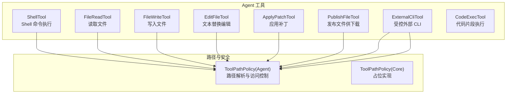
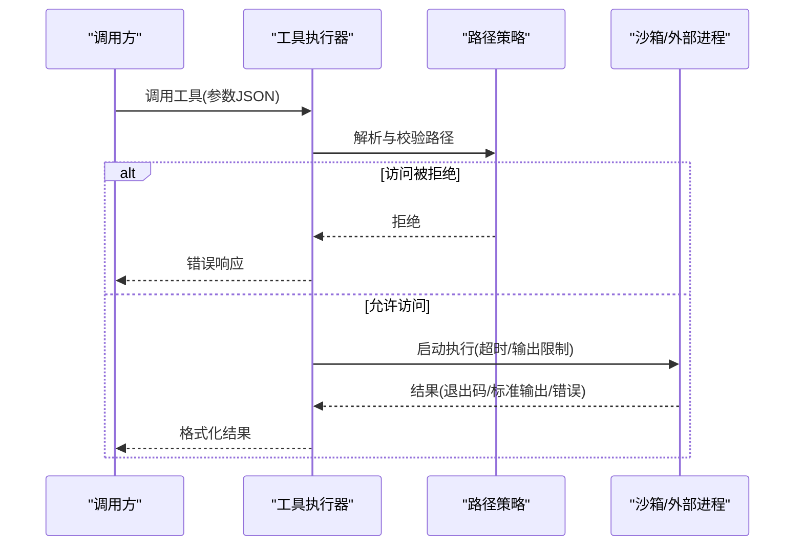
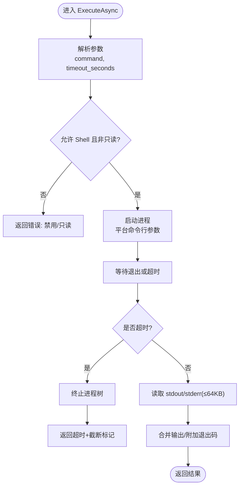

# 系统工具

<cite>
**本文引用的文件**
- [ShellTool.cs](file://src/OpenClaw.Agent/Tools/ShellTool.cs)
- [FileReadTool.cs](file://src/OpenClaw.Agent/Tools/FileReadTool.cs)
- [FileWriteTool.cs](file://src/OpenClaw.Agent/Tools/FileWriteTool.cs)
- [EditFileTool.cs](file://src/OpenClaw.Agent/Tools/EditFileTool.cs)
- [ApplyPatchTool.cs](file://src/OpenClaw.Agent/Tools/ApplyPatchTool.cs)
- [PublishFileTool.cs](file://src/OpenClaw.Agent/Tools/PublishFileTool.cs)
- [ToolPathPolicy.cs（Agent 实现）](file://src/OpenClaw.Agent/Tools/ToolPathPolicy.cs)
- [ToolPathPolicy.cs（Core 占位实现）](file://src/OpenClaw.Core/Security/ToolPathPolicy.cs)
- [ExternalCliTool.cs](file://src/OpenClaw.Agent/Tools/ExternalCliTool.cs)
- [CodeExecTool.cs](file://src/OpenClaw.Agent/Tools/CodeExecTool.cs)
- [GatewayBootstrapExtensions.cs](file://src/OpenClaw.Gateway/Bootstrap/GatewayBootstrapExtensions.cs)
- [ConfigValidator.cs](file://src/OpenClaw.Core/Validation/ConfigValidator.cs)
- [ToolPathPolicyTests.cs](file://src/OpenClaw.Tests/ToolPathPolicyTests.cs)
</cite>

## 目录
1. [简介](#简介)
2. [项目结构](#项目结构)
3. [核心组件](#核心组件)
4. [架构总览](#架构总览)
5. [详细组件分析](#详细组件分析)
6. [依赖关系分析](#依赖关系分析)
7. [性能考量](#性能考量)
8. [故障排查指南](#故障排查指南)
9. [结论](#结论)
10. [附录](#附录)

## 简介
本文件面向系统工具模块，聚焦以下能力：Shell 命令执行、文件读写与编辑、补丁应用、文件发布。文档从实现原理、安全限制、权限控制、路径策略、错误处理到使用示例与最佳实践进行系统化阐述，帮助在代理环境与受限沙箱中安全地执行系统操作。

## 项目结构
系统工具位于 Agent 工具集，围绕统一的 ITool 接口与参数 Schema 设计，配合路径策略与沙箱能力，形成可治理、可审计、可降噪的工具链。

图示来源
- [ShellTool.cs:11-193](file://src/OpenClaw.Agent/Tools/ShellTool.cs#L11-L193)
- [FileReadTool.cs:9-66](file://src/OpenClaw.Agent/Tools/FileReadTool.cs#L9-L66)
- [FileWriteTool.cs:9-57](file://src/OpenClaw.Agent/Tools/FileWriteTool.cs#L9-L57)
- [EditFileTool.cs:9-108](file://src/OpenClaw.Agent/Tools/EditFileTool.cs#L9-L108)
- [ApplyPatchTool.cs:9-152](file://src/OpenClaw.Agent/Tools/ApplyPatchTool.cs#L9-L152)
- [PublishFileTool.cs:19-131](file://src/OpenClaw.Agent/Tools/PublishFileTool.cs#L19-L131)
- [ToolPathPolicy.cs（Agent 实现）:5-132](file://src/OpenClaw.Agent/Tools/ToolPathPolicy.cs#L5-L132)
- [ToolPathPolicy.cs（Core 占位实现）:1-136](file://src/OpenClaw.Core/Security/ToolPathPolicy.cs#L1-L136)

章节来源
- [ShellTool.cs:11-193](file://src/OpenClaw.Agent/Tools/ShellTool.cs#L11-L193)
- [FileReadTool.cs:9-66](file://src/OpenClaw.Agent/Tools/FileReadTool.cs#L9-L66)
- [FileWriteTool.cs:9-57](file://src/OpenClaw.Agent/Tools/FileWriteTool.cs#L9-L57)
- [EditFileTool.cs:9-108](file://src/OpenClaw.Agent/Tools/EditFileTool.cs#L9-L108)
- [ApplyPatchTool.cs:9-152](file://src/OpenClaw.Agent/Tools/ApplyPatchTool.cs#L9-L152)
- [PublishFileTool.cs:19-131](file://src/OpenClaw.Agent/Tools/PublishFileTool.cs#L19-L131)
- [ToolPathPolicy.cs（Agent 实现）:5-132](file://src/OpenClaw.Agent/Tools/ToolPathPolicy.cs#L5-L132)
- [ToolPathPolicy.cs（Core 占位实现）:1-136](file://src/OpenClaw.Core/Security/ToolPathPolicy.cs#L1-L136)

## 核心组件
- ShellTool：本地 Shell 执行，支持超时与输出截断，支持沙箱模式。
- FileReadTool：按行读取文件内容，限制最大行数，避免上下文溢出。
- FileWriteTool：写入文件，带临时文件与原子替换，确保一致性。
- EditFileTool：基于精确匹配的文本替换，支持单次或全部替换，更安全的小范围修改。
- ApplyPatchTool：解析并应用统一差异补丁，支持多段（hunk），严格校验与偏移计算。
- PublishFileTool：将文件发布为可下载资源，必要时复制至工作区下载目录，自动标注 FILE_PATH 标记。
- ExternalCliTool：通过连接器与命令名执行受控外部 CLI，支持预览、干跑、审计与事件记录。
- CodeExecTool：在进程或容器内执行代码片段（Python/JS/Bash），支持超时与输出限制，支持沙箱模式。

章节来源
- [ShellTool.cs:11-193](file://src/OpenClaw.Agent/Tools/ShellTool.cs#L11-L193)
- [FileReadTool.cs:9-66](file://src/OpenClaw.Agent/Tools/FileReadTool.cs#L9-L66)
- [FileWriteTool.cs:9-57](file://src/OpenClaw.Agent/Tools/FileWriteTool.cs#L9-L57)
- [EditFileTool.cs:9-108](file://src/OpenClaw.Agent/Tools/EditFileTool.cs#L9-L108)
- [ApplyPatchTool.cs:9-152](file://src/OpenClaw.Agent/Tools/ApplyPatchTool.cs#L9-L152)
- [PublishFileTool.cs:19-131](file://src/OpenClaw.Agent/Tools/PublishFileTool.cs#L19-L131)
- [ExternalCliTool.cs:9-252](file://src/OpenClaw.Agent/Tools/ExternalCliTool.cs#L9-L252)
- [CodeExecTool.cs:16-465](file://src/OpenClaw.Agent/Tools/CodeExecTool.cs#L16-L465)

## 架构总览
系统工具通过统一的工具接口与参数 Schema 暴露能力；路径策略负责访问控制与符号链接解析；沙箱能力提供隔离与超时控制；外部 CLI 与代码执行工具进一步扩展系统交互面。

图示来源
- [ShellTool.cs:24-85](file://src/OpenClaw.Agent/Tools/ShellTool.cs#L24-L85)
- [FileReadTool.cs:19-64](file://src/OpenClaw.Agent/Tools/FileReadTool.cs#L19-L64)
- [FileWriteTool.cs:19-56](file://src/OpenClaw.Agent/Tools/FileWriteTool.cs#L19-L56)
- [EditFileTool.cs:19-82](file://src/OpenClaw.Agent/Tools/EditFileTool.cs#L19-L82)
- [ApplyPatchTool.cs:19-95](file://src/OpenClaw.Agent/Tools/ApplyPatchTool.cs#L19-L95)
- [PublishFileTool.cs:37-78](file://src/OpenClaw.Agent/Tools/PublishFileTool.cs#L37-L78)
- [ToolPathPolicy.cs（Agent 实现）:9-35](file://src/OpenClaw.Agent/Tools/ToolPathPolicy.cs#L9-L35)

## 详细组件分析

### ShellTool：Shell 命令执行
- 安全与限制
  - 仅在允许 Shell 的配置下启用；只读模式禁用。
  - 超时控制：默认 30 秒，范围 1–600 秒；超时后终止进程树并返回截断标记。
  - 输出限制：标准输出/错误各上限 64KB，超过则截断。
  - 平台适配：Windows 使用 cmd /c，类 Unix 使用 /bin/sh -c。
- 路径与权限
  - 通过参数解析校验命令字符串；不直接拼接用户输入到 shell 命令行，而是作为单一参数传入。
- 沙箱集成
  - 支持 ISandboxCapableTool：生成沙箱执行请求，使用外部超时包装与安全命令行。
- 错误处理
  - 参数缺失/非法、超时、输出截断均返回明确提示。
- 使用示例
  - 在代理环境执行系统查询或自动化脚本，设置合理 timeout_seconds，避免长时间阻塞。

图示来源
- [ShellTool.cs:24-85](file://src/OpenClaw.Agent/Tools/ShellTool.cs#L24-L85)
- [ShellTool.cs:115-157](file://src/OpenClaw.Agent/Tools/ShellTool.cs#L115-L157)
- [ShellTool.cs:159-191](file://src/OpenClaw.Agent/Tools/ShellTool.cs#L159-L191)

章节来源
- [ShellTool.cs:11-193](file://src/OpenClaw.Agent/Tools/ShellTool.cs#L11-L193)

### FileReadTool：文件读取
- 功能要点
  - 解析绝对/相对路径，解析真实路径，检查读取权限。
  - 限制最大读取行数（1–5000），逐行读取并追加换行，超过行数自动截断并提示。
- 安全与权限
  - 严格遵循 ToolPathPolicy 的读取白名单策略，拒绝越权访问。
- 错误处理
  - 文件不存在、路径无权限、参数缺失均返回明确错误。

章节来源
- [FileReadTool.cs:9-66](file://src/OpenClaw.Agent/Tools/FileReadTool.cs#L9-L66)
- [ToolPathPolicy.cs（Agent 实现）:9-35](file://src/OpenClaw.Agent/Tools/ToolPathPolicy.cs#L9-L35)

### FileWriteTool：文件写入
- 功能要点
  - 写入内容到指定路径，必要时创建父目录。
  - 使用临时文件写入后原子移动覆盖，避免部分写入。
- 安全与权限
  - 严格遵循写入白名单策略；只读模式禁用。
- 错误处理
  - 参数缺失、权限不足、写入异常均返回错误；异常时尝试清理临时文件。

章节来源
- [FileWriteTool.cs:9-57](file://src/OpenClaw.Agent/Tools/FileWriteTool.cs#L9-L57)
- [ToolPathPolicy.cs（Agent 实现）:12-13](file://src/OpenClaw.Agent/Tools/ToolPathPolicy.cs#L12-L13)

### EditFileTool：文件编辑（文本替换）
- 功能要点
  - 在文件中查找旧文本并替换为新文本；默认仅替换首次出现，可选择替换全部。
  - 若同一位置出现多次相同文本，要求显式设置 replace_all 或提供更唯一上下文。
- 安全与权限
  - 仅在文件存在且写入白名单内执行；只读模式禁用。
  - 替换前先检查内容包含性，避免误操作。
- 错误处理
  - 参数缺失、未找到旧文本、多次出现但未开启 replace_all、写入异常均返回明确错误。

章节来源
- [EditFileTool.cs:9-108](file://src/OpenClaw.Agent/Tools/EditFileTool.cs#L9-L108)
- [ToolPathPolicy.cs（Agent 实现）:12-13](file://src/OpenClaw.Agent/Tools/ToolPathPolicy.cs#L12-L13)

### ApplyPatchTool：补丁应用
- 功能要点
  - 解析统一差异格式的补丁，识别多个 hunk；对每个 hunk 校验原始行内容，再删除/插入对应行。
  - 使用临时文件写入后原子移动覆盖。
- 安全与权限
  - 仅在目标文件存在且写入白名单内执行；只读模式禁用。
- 错误处理
  - 无有效 hunk、hunk 行号越界、原始行不匹配、写入异常均返回明确错误。

章节来源
- [ApplyPatchTool.cs:9-152](file://src/OpenClaw.Agent/Tools/ApplyPatchTool.cs#L9-L152)
- [ToolPathPolicy.cs（Agent 实现）:12-13](file://src/OpenClaw.Agent/Tools/ToolPathPolicy.cs#L12-L13)

### PublishFileTool：文件发布
- 功能要点
  - 将本地文件发布为可下载资源；若文件不在允许写入根目录，则复制到工作区的 .downloads 目录。
  - 返回文件名、大小与 [FILE_PATH:...] 标记，由网关侧自动上传并生成下载链接。
- 安全与权限
  - 读取白名单策略；若无法确定可写下载目录，返回错误。
- 错误处理
  - 参数缺失、路径无权限、文件不存在、复制失败均返回错误。

章节来源
- [PublishFileTool.cs:19-131](file://src/OpenClaw.Agent/Tools/PublishFileTool.cs#L19-L131)
- [ToolPathPolicy.cs（Agent 实现）:9-13](file://src/OpenClaw.Agent/Tools/ToolPathPolicy.cs#L9-L13)

### ExternalCliTool：受控外部 CLI
- 功能要点
  - 通过连接器名称与命令名执行受控外部 CLI；支持列出连接器、状态、命令、预览、执行等动作。
  - 预览阶段可执行干跑模板以评估风险；执行后记录审计与运行事件。
- 安全与权限
  - 严格基于连接器注册表与命令白名单；未知参数会被拒绝（除非命令显式允许）。
- 错误处理
  - 参数无效、策略阻止、执行异常均返回错误并记录事件。

章节来源
- [ExternalCliTool.cs:9-252](file://src/OpenClaw.Agent/Tools/ExternalCliTool.cs#L9-L252)

### CodeExecTool：代码执行
- 功能要点
  - 支持 Python、JavaScript、Bash；可在进程或容器内执行；支持超时与输出限制。
  - 提供沙箱模式：将解释器与代码封装为安全命令行并注入超时。
- 安全与权限
  - 受限于语言白名单与只读模式；容器后端默认禁用网络并限制资源。
- 错误处理
  - 进程启动失败、超时、输出截断、不支持的语言均返回明确错误。

章节来源
- [CodeExecTool.cs:16-465](file://src/OpenClaw.Agent/Tools/CodeExecTool.cs#L16-L465)

## 依赖关系分析
- 路径策略
  - 统一由 ToolPathPolicy.ResolveRealPath 与 IsReadAllowed/IsWriteAllowed 控制，防止符号链接逃逸与越权访问。
- 配置与策略
  - 网关启动时可覆盖 Tooling 的 AllowedReadRoots/AllowedWriteRoots；配置验证器确保 WorkspaceOnly 场景下工作区路径合法。
- 测试保障
  - 单元测试覆盖符号链接逃逸、通配符与空根等边界场景，保证路径策略正确性。

图示来源
- [GatewayBootstrapExtensions.cs:352-375](file://src/OpenClaw.Gateway/Bootstrap/GatewayBootstrapExtensions.cs#L352-L375)
- [ConfigValidator.cs:135-162](file://src/OpenClaw.Core/Validation/ConfigValidator.cs#L135-L162)
- [ToolPathPolicy.cs（Agent 实现）:42-73](file://src/OpenClaw.Agent/Tools/ToolPathPolicy.cs#L42-L73)

章节来源
- [GatewayBootstrapExtensions.cs:352-375](file://src/OpenClaw.Gateway/Bootstrap/GatewayBootstrapExtensions.cs#L352-L375)
- [ConfigValidator.cs:135-162](file://src/OpenClaw.Core/Validation/ConfigValidator.cs#L135-L162)
- [ToolPathPolicyTests.cs:1-128](file://src/OpenClaw.Tests/ToolPathPolicyTests.cs#L1-L128)

## 性能考量
- I/O 与内存
  - 读取/写入采用流式处理与缓冲池，避免大对象拷贝；输出限制防止内存膨胀。
- 进程与超时
  - 统一使用取消令牌与进程树终止，避免僵尸进程与资源泄漏。
- 外部 CLI 与容器
  - 外部 CLI 工具通过预览与干跑降低真实执行成本；容器执行默认禁用网络并限制 CPU/内存。
- 发布流程
  - 下载目录复制采用异步流式复制，避免一次性加载大文件。

[本节为通用性能建议，无需特定文件引用]

## 故障排查指南
- Shell 执行超时
  - 检查 timeout_seconds 设置；确认命令本身是否阻塞；考虑改用沙箱或外部 CLI。
- 文件读取为空或被截断
  - 检查 max_lines 是否过小；确认路径解析后的真实路径是否正确；核对读取白名单。
- 写入失败或文件损坏
  - 确认写入白名单；检查磁盘空间与权限；关注临时文件清理逻辑。
- 文本替换未生效
  - 确认 old_text 存在于文件中；若出现多次，启用 replace_all 或提供更唯一上下文。
- 应用补丁失败
  - 核对补丁 hunk 的起始行与上下文行；确保目标文件未被其他进程修改。
- 发布文件不可下载
  - 确认源文件在读取白名单内；若复制到下载目录失败，检查工作区根与写入白名单。
- 外部 CLI 执行被阻止
  - 检查连接器与命令是否在白名单；参数是否符合命令模式；预览阶段干跑是否通过。
- 代码执行失败
  - 确认语言在白名单内；检查解释器可用性；适当提高超时与输出限制。

章节来源
- [ShellTool.cs:24-85](file://src/OpenClaw.Agent/Tools/ShellTool.cs#L24-L85)
- [FileReadTool.cs:19-64](file://src/OpenClaw.Agent/Tools/FileReadTool.cs#L19-L64)
- [FileWriteTool.cs:19-56](file://src/OpenClaw.Agent/Tools/FileWriteTool.cs#L19-L56)
- [EditFileTool.cs:19-82](file://src/OpenClaw.Agent/Tools/EditFileTool.cs#L19-L82)
- [ApplyPatchTool.cs:19-95](file://src/OpenClaw.Agent/Tools/ApplyPatchTool.cs#L19-L95)
- [PublishFileTool.cs:37-78](file://src/OpenClaw.Agent/Tools/PublishFileTool.cs#L37-L78)
- [ExternalCliTool.cs:46-95](file://src/OpenClaw.Agent/Tools/ExternalCliTool.cs#L46-L95)
- [CodeExecTool.cs:58-69](file://src/OpenClaw.Agent/Tools/CodeExecTool.cs#L58-L69)

## 结论
系统工具模块通过严格的路径策略、超时与输出限制、沙箱与审计机制，实现了在受限环境下的安全系统操作。推荐优先使用受控外部 CLI 与代码执行工具替代自由 Shell，结合最小权限原则与白名单策略，确保在代理与生产环境中的可控性与可观测性。

[本节为总结性内容，无需特定文件引用]

## 附录

### 最佳实践
- 路径与权限
  - 明确 AllowedReadRoots/AllowedWriteRoots；优先使用通配符以外的精确路径；定期审查白名单。
  - 对符号链接保持谨慎，避免通过链接访问受限区域。
- Shell 与外部 CLI
  - 优先使用 ExternalCliTool 与 CodeExecTool；ShellTool 仅用于必要场景并设置合理超时。
  - 预览与干跑先行，评估风险后再执行。
- 文件操作
  - 小范围修改优先 EditFileTool；大范围批量写入使用 FileWriteTool 并做好备份。
  - 发布文件前确保可写下载目录可达。
- 安全与审计
  - 开启审计与事件记录；对高风险操作要求审批指纹；定期回溯执行历史。

### 代理环境安全要点
- 网络隔离：容器后端默认禁用网络；外部 CLI 仅允许白名单命令。
- 资源限制：CPU/内存/超时统一约束，防止资源滥用。
- 路径限制：严格解析真实路径，禁止符号链接逃逸。
- 只读模式：在只读模式下禁用写入与 Shell，降低攻击面。

[本节为通用指导，无需特定文件引用]