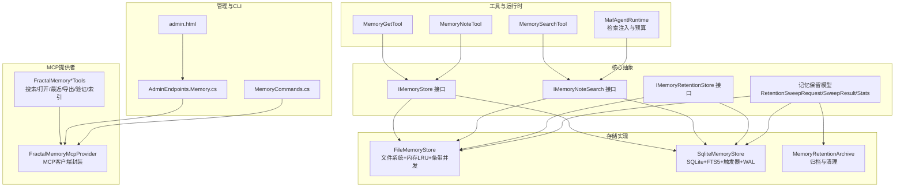
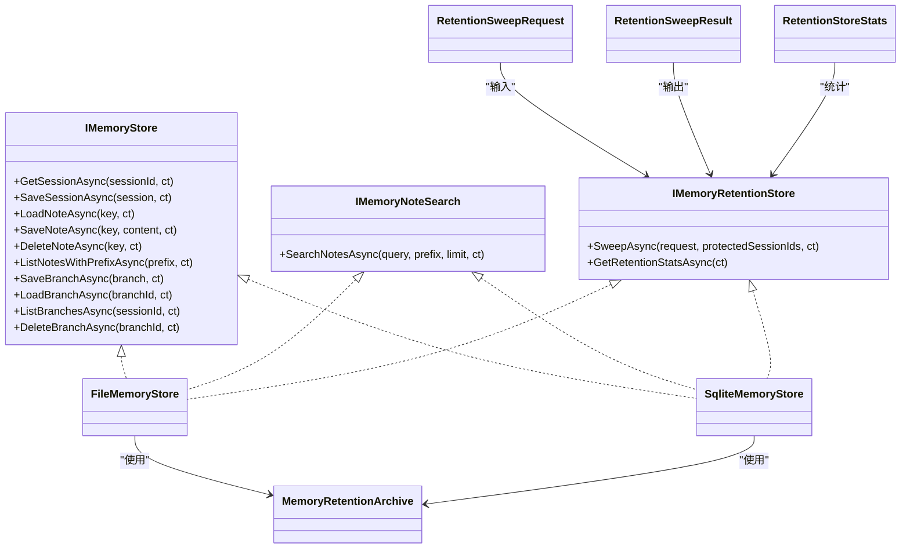
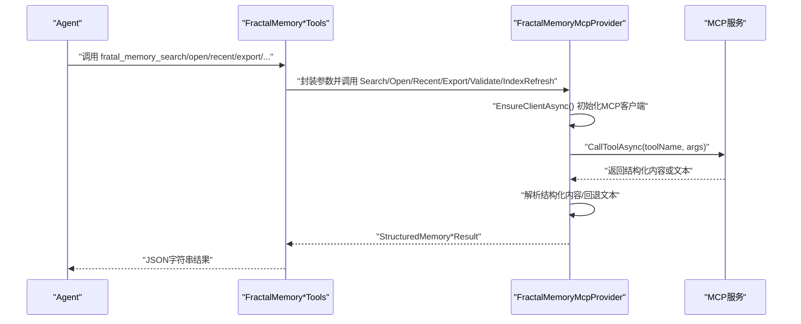
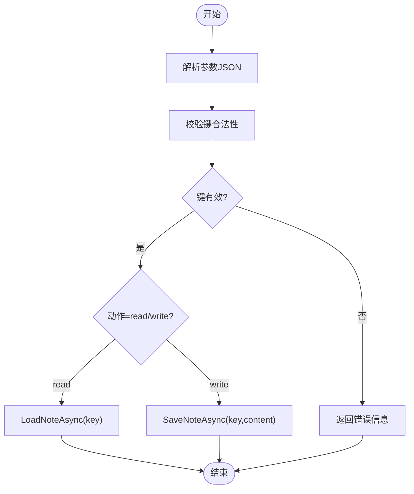
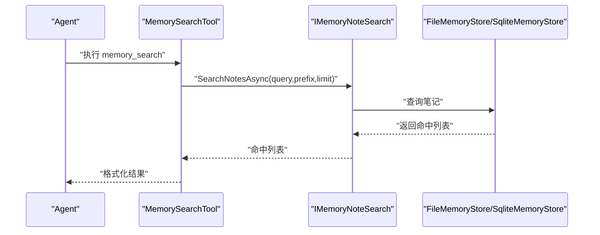
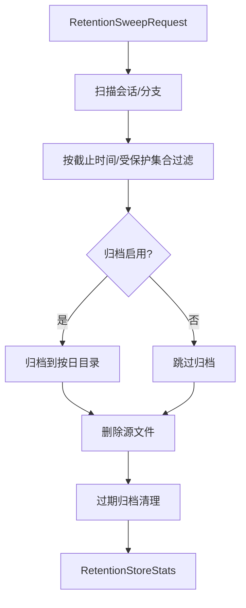
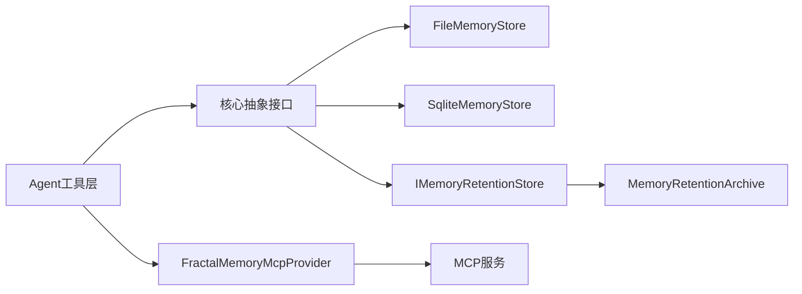

# 记忆工具

<cite>
**本文引用的文件**
- [FractalMemoryMcpProvider.cs](file://src/OpenClaw.Agent/Memory/FractalMemoryMcpProvider.cs)
- [FractalMemoryTools.cs](file://src/OpenClaw.Agent/Tools/FractalMemoryTools.cs)
- [IMemoryStore.cs](file://src/OpenClaw.Core/Abstractions/IMemoryStore.cs)
- [IMemoryNoteSearch.cs](file://src/OpenClaw.Core/Abstractions/IMemoryNoteSearch.cs)
- [IMemoryRetentionStore.cs](file://src/OpenClaw.Core/Abstractions/IMemoryRetentionStore.cs)
- [FileMemoryStore.cs](file://src/OpenClaw.Core/Memory/FileMemoryStore.cs)
- [SqliteMemoryStore.cs](file://src/OpenClaw.Core/Memory/SqliteMemoryStore.cs)
- [MemoryRetentionArchive.cs](file://src/OpenClaw.Core/Memory/MemoryRetentionArchive.cs)
- [MemoryRetentionModels.cs](file://src/OpenClaw.Core/Models/MemoryRetentionModels.cs)
- [MemorySearchTool.cs](file://src/OpenClaw.Agent/Tools/MemorySearchTool.cs)
- [MemoryGetTool.cs](file://src/OpenClaw.Agent/Tools/MemoryGetTool.cs)
- [MemoryNoteTool.cs](file://src/OpenClaw.Agent/Tools/MemoryNoteTool.cs)
- [MafAgentRuntime.cs](file://src/OpenClaw.Agent/MafAgentRuntime.cs)
- [openclaw-memory-recall-and-retention.md](file://docs/openclaw-memory-recall-and-retention.md)
- [FractalMemoryTests.cs](file://src/OpenClaw.Tests/FractalMemoryTests.cs)
- [MemoryCommands.cs](file://src/OpenClaw.Cli/MemoryCommands.cs)
- [AdminEndpoints.Memory.cs](file://src/OpenClaw.Gateway/Endpoints/AdminEndpoints.Memory.cs)
- [admin.html](file://src/OpenClaw.Gateway/wwwroot/admin.html)
</cite>

## 目录
1. [简介](#简介)
2. [项目结构](#项目结构)
3. [核心组件](#核心组件)
4. [架构总览](#架构总览)
5. [详细组件分析](#详细组件分析)
6. [依赖关系分析](#依赖关系分析)
7. [性能考量](#性能考量)
8. [故障排查指南](#故障排查指南)
9. [结论](#结论)
10. [附录](#附录)

## 简介
本技术文档聚焦于记忆工具模块，涵盖以下能力与特性：
- 记忆获取：按键读取持久化笔记内容
- 记忆笔记：读写持久化笔记，支持键校验与脱敏
- 记忆搜索：基于关键词的全文检索与向量混合检索
- 分形记忆MCP提供者：通过MCP协议对接外部分形记忆仓库，提供搜索、打开节点、最近变更、导出、手-off创建、验证与索引刷新等能力
- 存储机制：文件系统与SQLite双后端，支持FTS5与向量嵌入
- 检索算法：内存TF索引（文件后端）、SQLite FTS5全文检索、BM25与余弦相似度混合评分（SQLite向量）
- 索引策略：条带化并发控制、触发器自动同步、WAL模式与同步级别调优
- 隐私保护：输入校验、路径遍历防护、敏感信息脱敏、损坏隔离与归档
- 应用场景：知识管理、经验总结、智能回忆、项目上下文构建
- 优化策略：缓存命中、批量扫描限制、原子写入、归档清理、令牌预算规划

## 项目结构
记忆工具模块横跨多个子项目与目录，主要涉及：
- 核心抽象与模型：定义存储、搜索、保留等接口与数据模型
- 存储实现：文件系统与SQLite两种后端，分别满足本地优先与高级检索需求
- 工具与运行时：面向Agent的工具封装、检索注入流程、上下文预算规划
- MCP提供者：对外部分形记忆仓库的统一接入与错误处理
- 管理与CLI：后台端点、仪表盘页面、命令行工具对分形记忆状态与操作的支持

图示来源
- [IMemoryStore.cs:9-23](file://src/OpenClaw.Core/Abstractions/IMemoryStore.cs#L9-L23)
- [IMemoryNoteSearch.cs:18-21](file://src/OpenClaw.Core/Abstractions/IMemoryNoteSearch.cs#L18-L21)
- [IMemoryRetentionStore.cs:9-17](file://src/OpenClaw.Core/Abstractions/IMemoryRetentionStore.cs#L9-L17)
- [FileMemoryStore.cs:32-76](file://src/OpenClaw.Core/Memory/FileMemoryStore.cs#L32-L76)
- [SqliteMemoryStore.cs:12-45](file://src/OpenClaw.Core/Memory/SqliteMemoryStore.cs#L12-L45)
- [MemoryRetentionArchive.cs:7-77](file://src/OpenClaw.Core/Memory/MemoryRetentionArchive.cs#L7-L77)
- [MemoryGetTool.cs:8-36](file://src/OpenClaw.Agent/Tools/MemoryGetTool.cs#L8-L36)
- [MemoryNoteTool.cs:10-45](file://src/OpenClaw.Agent/Tools/MemoryNoteTool.cs#L10-L45)
- [MemorySearchTool.cs:7-67](file://src/OpenClaw.Agent/Tools/MemorySearchTool.cs#L7-L67)
- [MafAgentRuntime.cs:648-677](file://src/OpenClaw.Agent/MafAgentRuntime.cs#L648-L677)
- [FractalMemoryMcpProvider.cs:13-30](file://src/OpenClaw.Agent/Memory/FractalMemoryMcpProvider.cs#L13-L30)
- [FractalMemoryTools.cs:10-182](file://src/OpenClaw.Agent/Tools/FractalMemoryTools.cs#L10-L182)
- [AdminEndpoints.Memory.cs:839-855](file://src/OpenClaw.Gateway/Endpoints/AdminEndpoints.Memory.cs#L839-L855)
- [MemoryCommands.cs:7-40](file://src/OpenClaw.Cli/MemoryCommands.cs#L7-L40)
- [admin.html:4216-4266](file://src/OpenClaw.Gateway/wwwroot/admin.html#L4216-L4266)

章节来源
- [openclaw-memory-recall-and-retention.md:1-237](file://docs/openclaw-memory-recall-and-retention.md#L1-L237)

## 核心组件
- 存储接口与实现
  - IMemoryStore：统一的会话、笔记、分支持久化接口
  - FileMemoryStore：文件系统实现，带内存LRU缓存与条带并发控制
  - SqliteMemoryStore：SQLite实现，支持FTS5全文检索与触发器同步，可选向量嵌入
- 搜索接口与实现
  - IMemoryNoteSearch：笔记搜索接口；FileMemoryStore与SqliteMemoryStore均实现
  - MemorySearchTool：面向Agent的搜索工具
- 保留与归档
  - IMemoryRetentionStore：保留扫描接口
  - MemoryRetentionArchive：归档与过期清理
  - RetentionSweepRequest/Result/Stats：保留扫描请求、结果与统计
- 分形记忆MCP提供者
  - FractalMemoryMcpProvider：封装MCP客户端，提供状态、搜索、打开、最近、导出、手-off、验证、索引刷新等能力
  - FractalMemory*Tools：对应MCP工具的参数校验与描述
- 记忆工具
  - MemoryGetTool：按键获取笔记
  - MemoryNoteTool：读写笔记并进行键校验与脱敏
- 运行时集成
  - MafAgentRuntime：检索注入与上下文预算控制

章节来源
- [IMemoryStore.cs:9-23](file://src/OpenClaw.Core/Abstractions/IMemoryStore.cs#L9-L23)
- [IMemoryNoteSearch.cs:18-27](file://src/OpenClaw.Core/Abstractions/IMemoryNoteSearch.cs#L18-L27)
- [IMemoryRetentionStore.cs:9-17](file://src/OpenClaw.Core/Abstractions/IMemoryRetentionStore.cs#L9-L17)
- [FileMemoryStore.cs:32-76](file://src/OpenClaw.Core/Memory/FileMemoryStore.cs#L32-L76)
- [SqliteMemoryStore.cs:12-45](file://src/OpenClaw.Core/Memory/SqliteMemoryStore.cs#L12-L45)
- [MemoryRetentionArchive.cs:7-77](file://src/OpenClaw.Core/Memory/MemoryRetentionArchive.cs#L7-L77)
- [MemoryRetentionModels.cs:7-82](file://src/OpenClaw.Core/Models/MemoryRetentionModels.cs#L7-L82)
- [FractalMemoryMcpProvider.cs:13-30](file://src/OpenClaw.Agent/Memory/FractalMemoryMcpProvider.cs#L13-L30)
- [FractalMemoryTools.cs:10-182](file://src/OpenClaw.Agent/Tools/FractalMemoryTools.cs#L10-L182)
- [MemorySearchTool.cs:7-67](file://src/OpenClaw.Agent/Tools/MemorySearchTool.cs#L7-L67)
- [MemoryGetTool.cs:8-36](file://src/OpenClaw.Agent/Tools/MemoryGetTool.cs#L8-L36)
- [MemoryNoteTool.cs:10-45](file://src/OpenClaw.Agent/Tools/MemoryNoteTool.cs#L10-L45)
- [MafAgentRuntime.cs:648-677](file://src/OpenClaw.Agent/MafAgentRuntime.cs#L648-L677)

## 架构总览
记忆子系统以“接口解耦 + 可插拔后端”的方式组织，核心关注点分离：
- 持久化存储：IMemoryStore
- 内容搜索：IMemoryNoteSearch
- 生命周期保留：IMemoryRetentionStore

后端选择由配置驱动，文件系统与SQLite均可无缝替换。

图示来源
- [IMemoryStore.cs:9-23](file://src/OpenClaw.Core/Abstractions/IMemoryStore.cs#L9-L23)
- [IMemoryNoteSearch.cs:18-21](file://src/OpenClaw.Core/Abstractions/IMemoryNoteSearch.cs#L18-L21)
- [IMemoryRetentionStore.cs:9-17](file://src/OpenClaw.Core/Abstractions/IMemoryRetentionStore.cs#L9-L17)
- [FileMemoryStore.cs:32-76](file://src/OpenClaw.Core/Memory/FileMemoryStore.cs#L32-L76)
- [SqliteMemoryStore.cs:12-45](file://src/OpenClaw.Core/Memory/SqliteMemoryStore.cs#L12-L45)
- [MemoryRetentionArchive.cs:7-77](file://src/OpenClaw.Core/Memory/MemoryRetentionArchive.cs#L7-L77)
- [MemoryRetentionModels.cs:7-82](file://src/OpenClaw.Core/Models/MemoryRetentionModels.cs#L7-L82)

## 详细组件分析

### 分形记忆MCP提供者
- 角色定位：通过MCP协议桥接外部分形记忆仓库，为Agent提供结构化记忆查询与上下文构建能力
- 主要能力
  - 状态查询：可用性、警告、错误、仓库根路径等
  - 搜索：关键词检索，支持限制数量与作用域
  - 打开：按路径打开节点，支持视图与深度
  - 最近：按天数与限制列出近期变更
  - 导出：按模式导出上下文摘要
  - 手-off：创建手-off包（写能力，需显式允许）
  - 验证：验证仓库一致性
  - 索引刷新：重建索引（写能力，需显式允许）
- 安全与错误处理
  - 支持超时控制与多种异常类型捕获
  - 对禁用或不支持模式抛出明确异常
  - 对仓库根路径缺失、命令启动失败等给出友好提示
- 参数与返回
  - 统一的结构化响应模型，包含成功标志、错误信息、来源引用等
  - 解析MCP响应文本与结构化内容，回退到文本片段

图示来源
- [FractalMemoryMcpProvider.cs:32-198](file://src/OpenClaw.Agent/Memory/FractalMemoryMcpProvider.cs#L32-L198)
- [FractalMemoryTools.cs:10-182](file://src/OpenClaw.Agent/Tools/FractalMemoryTools.cs#L10-L182)

章节来源
- [FractalMemoryMcpProvider.cs:13-828](file://src/OpenClaw.Agent/Memory/FractalMemoryMcpProvider.cs#L13-L828)
- [FractalMemoryTools.cs:10-243](file://src/OpenClaw.Agent/Tools/FractalMemoryTools.cs#L10-L243)

### 记忆获取与笔记工具
- MemoryGetTool：按键获取笔记内容，内置键校验防止路径遍历
- MemoryNoteTool：读写笔记，支持键校验与脱敏；写入后返回确认信息
- 安全要点：输入校验、键编码、原子写入、临时文件与重命名

图示来源
- [MemoryGetTool.cs:18-36](file://src/OpenClaw.Agent/Tools/MemoryGetTool.cs#L18-L36)
- [MemoryNoteTool.cs:20-45](file://src/OpenClaw.Agent/Tools/MemoryNoteTool.cs#L20-L45)

章节来源
- [MemoryGetTool.cs:8-36](file://src/OpenClaw.Agent/Tools/MemoryGetTool.cs#L8-L36)
- [MemoryNoteTool.cs:10-45](file://src/OpenClaw.Agent/Tools/MemoryNoteTool.cs#L10-L45)

### 记忆搜索工具
- MemorySearchTool：关键词搜索笔记，支持前缀过滤与限制数量
- 返回格式：文本或JSON，包含匹配数量、键、更新时间、分数与内容片段
- 与运行时集成：MafAgentRuntime在注入上下文时根据预算截断内容长度

图示来源
- [MemorySearchTool.cs:31-67](file://src/OpenClaw.Agent/Tools/MemorySearchTool.cs#L31-L67)
- [IMemoryNoteSearch.cs:18-21](file://src/OpenClaw.Core/Abstractions/IMemoryNoteSearch.cs#L18-L21)
- [FileMemoryStore.cs:356-405](file://src/OpenClaw.Core/Memory/FileMemoryStore.cs#L356-L405)
- [SqliteMemoryStore.cs:319-490](file://src/OpenClaw.Core/Memory/SqliteMemoryStore.cs#L319-L490)
- [MafAgentRuntime.cs:648-677](file://src/OpenClaw.Agent/MafAgentRuntime.cs#L648-L677)

章节来源
- [MemorySearchTool.cs:7-67](file://src/OpenClaw.Agent/Tools/MemorySearchTool.cs#L7-L67)
- [MafAgentRuntime.cs:648-677](file://src/OpenClaw.Agent/MafAgentRuntime.cs#L648-L677)

### 存储后端对比与选择
- FileMemoryStore
  - 会话/笔记/分支以JSON/Markdown文件形式存储，键经URL安全Base64编码
  - 内存LRU缓存与64条带并发加载，避免热点竞争
  - 损坏文件隔离至.corrupt-*，不影响其他文件
- SqliteMemoryStore
  - WAL模式+PRAGMA同步级别调优，支持FTS5全文检索与触发器自动同步
  - 可选向量嵌入列，结合BM25与余弦相似度进行混合评分
  - 会话/分支/笔记三表，索引覆盖更新时间字段

章节来源
- [openclaw-memory-recall-and-retention.md:17-237](file://docs/openclaw-memory-recall-and-retention.md#L17-L237)
- [FileMemoryStore.cs:32-76](file://src/OpenClaw.Core/Memory/FileMemoryStore.cs#L32-L76)
- [SqliteMemoryStore.cs:54-148](file://src/OpenClaw.Core/Memory/SqliteMemoryStore.cs#L54-L148)

### 保留与归档
- RetentionSweepRequest：扫描截止时间、归档路径与保留天数、最大项数、是否DryRun
- RetentionSweepResult：扫描统计、删除/归档数量、跳过受保护项、错误列表
- RetentionStoreStats：后端类型与实体计数
- MemoryRetentionArchive：按日期层级归档，支持过期清理与空目录回收

图示来源
- [MemoryRetentionModels.cs:7-82](file://src/OpenClaw.Core/Models/MemoryRetentionModels.cs#L7-L82)
- [MemoryRetentionArchive.cs:9-166](file://src/OpenClaw.Core/Memory/MemoryRetentionArchive.cs#L9-L166)
- [FileMemoryStore.cs:570-623](file://src/OpenClaw.Core/Memory/FileMemoryStore.cs#L570-L623)
- [SqliteMemoryStore.cs:654-732](file://src/OpenClaw.Core/Memory/SqliteMemoryStore.cs#L654-L732)

章节来源
- [MemoryRetentionModels.cs:7-82](file://src/OpenClaw.Core/Models/MemoryRetentionModels.cs#L7-L82)
- [MemoryRetentionArchive.cs:7-218](file://src/OpenClaw.Core/Memory/MemoryRetentionArchive.cs#L7-L218)
- [FileMemoryStore.cs:570-800](file://src/OpenClaw.Core/Memory/FileMemoryStore.cs#L570-L800)
- [SqliteMemoryStore.cs:654-800](file://src/OpenClaw.Core/Memory/SqliteMemoryStore.cs#L654-L800)

### 运行时检索注入与预算
- MafAgentRuntime在生成用户消息时，根据配置的MaxNotes与MaxChars截断检索结果
- 明确标注“未信任数据”，仅作为参考材料，避免被当作可执行指令

章节来源
- [MafAgentRuntime.cs:648-677](file://src/OpenClaw.Agent/MafAgentRuntime.cs#L648-L677)

## 依赖关系分析
- 组件内聚与耦合
  - 存储实现与搜索/保留接口解耦，便于替换后端
  - MCP提供者与具体MCP服务解耦，通过Stdio传输与工具名约定交互
  - 工具层仅依赖抽象接口，降低对具体实现的耦合
- 外部依赖
  - SQLite FTS5扩展、向量嵌入生成器（可选）
  - MCP客户端库（ModelContextProtocol）

图示来源
- [IMemoryStore.cs:9-23](file://src/OpenClaw.Core/Abstractions/IMemoryStore.cs#L9-L23)
- [IMemoryNoteSearch.cs:18-21](file://src/OpenClaw.Core/Abstractions/IMemoryNoteSearch.cs#L18-L21)
- [IMemoryRetentionStore.cs:9-17](file://src/OpenClaw.Core/Abstractions/IMemoryRetentionStore.cs#L9-L17)
- [FileMemoryStore.cs:32-76](file://src/OpenClaw.Core/Memory/FileMemoryStore.cs#L32-L76)
- [SqliteMemoryStore.cs:12-45](file://src/OpenClaw.Core/Memory/SqliteMemoryStore.cs#L12-L45)
- [FractalMemoryMcpProvider.cs:13-30](file://src/OpenClaw.Agent/Memory/FractalMemoryMcpProvider.cs#L13-L30)
- [MemoryRetentionArchive.cs:7-77](file://src/OpenClaw.Core/Memory/MemoryRetentionArchive.cs#L7-L77)

## 性能考量
- 文件后端
  - 条带化并发加载：64条带减少热点竞争
  - 内存LRU缓存：降低重复读取开销
  - 原子写入：临时文件+重命名，保证一致性
- SQLite后端
  - WAL模式与PRAGMA同步级别调优，提升并发与可靠性
  - FTS5触发器自动同步，减少手工维护成本
  - 向量嵌入混合评分：在查询嵌入可用时采用BM25与余弦相似度融合
- 保留扫描
  - 分阶段扫描与限制扫描上限，避免长时间阻塞
  - 归档清理按日期层级组织，便于快速定位与清理

章节来源
- [FileMemoryStore.cs:34-76](file://src/OpenClaw.Core/Memory/FileMemoryStore.cs#L34-L76)
- [SqliteMemoryStore.cs:54-148](file://src/OpenClaw.Core/Memory/SqliteMemoryStore.cs#L54-L148)
- [SqliteMemoryStore.cs:319-490](file://src/OpenClaw.Core/Memory/SqliteMemoryStore.cs#L319-L490)
- [FileMemoryStore.cs:570-800](file://src/OpenClaw.Core/Memory/FileMemoryStore.cs#L570-L800)
- [SqliteMemoryStore.cs:654-800](file://src/OpenClaw.Core/Memory/SqliteMemoryStore.cs#L654-L800)

## 故障排查指南
- 分形记忆MCP
  - 禁用或模式不支持：检查配置中的Enabled与Mode，确保为“mcp”
  - MCP命令无法启动：确认McpCommand可执行且工作目录正确
  - 仓库根路径问题：检查RepositoryRoot是否存在，必要时设置环境变量
  - 超时与异常：查看日志中对ObjectDisposed/JsonException/IOException/TimeoutException等的记录
- 存储损坏
  - 文件后端：损坏会话文件会被移动到.corrupt-*，可在日志中定位路径
  - SQLite后端：异常会抛出MemoryStoreCorruptionException，检查数据库文件
- 保留扫描
  - 归档清理失败：检查权限与磁盘空间，查看错误列表
  - 扫描进度缓慢：调整MaxItems与扫描范围，避免DryRun影响

章节来源
- [FractalMemoryMcpProvider.cs:279-330](file://src/OpenClaw.Agent/Memory/FractalMemoryMcpProvider.cs#L279-L330)
- [FileMemoryStore.cs:191-223](file://src/OpenClaw.Core/Memory/FileMemoryStore.cs#L191-L223)
- [SqliteMemoryStore.cs:173-178](file://src/OpenClaw.Core/Memory/SqliteMemoryStore.cs#L173-L178)
- [MemoryRetentionArchive.cs:79-166](file://src/OpenClaw.Core/Memory/MemoryRetentionArchive.cs#L79-L166)

## 结论
记忆工具模块通过清晰的接口设计与可插拔后端，实现了从基础的键值笔记到高级的分形记忆检索与上下文构建的完整能力谱系。文件系统与SQLite后端分别满足本地优先与高性能检索的需求；MCP提供者进一步扩展了外部知识库的接入能力。配合保留与归档机制、严格的输入校验与脱敏策略，系统在功能完整性、安全性与可运维性方面达到良好平衡。

## 附录
- 配置参考与最佳实践
  - 后端选择：本地开发建议使用FileMemoryStore；需要全文检索与向量能力时选用SqliteMemoryStore
  - FTS5与向量：开启FTS5与向量嵌入可显著提升检索质量，但需考虑存储与计算开销
  - 保留策略：合理设置TTL与扫描频率，定期清理过期归档，避免磁盘膨胀
  - 分形记忆：默认禁用写能力，启用写能力时务必开启审批与审计
- 实际应用示例
  - 知识管理：使用MemoryNoteTool记录领域知识，MemorySearchTool进行检索
  - 经验总结：定期导出项目上下文，形成可复用的经验库
  - 智能回忆：结合MafAgentRuntime的检索注入，让Agent在对话中引用历史经验

章节来源
- [openclaw-memory-recall-and-retention.md:197-237](file://docs/openclaw-memory-recall-and-retention.md#L197-L237)
- [FractalMemoryTests.cs:18-54](file://src/OpenClaw.Tests/FractalMemoryTests.cs#L18-L54)
- [AdminEndpoints.Memory.cs:839-855](file://src/OpenClaw.Gateway/Endpoints/AdminEndpoints.Memory.cs#L839-L855)
- [MemoryCommands.cs:13-40](file://src/OpenClaw.Cli/MemoryCommands.cs#L13-L40)
- [admin.html:4216-4266](file://src/OpenClaw.Gateway/wwwroot/admin.html#L4216-L4266)