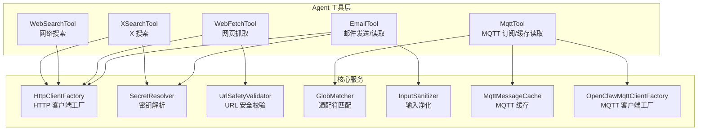
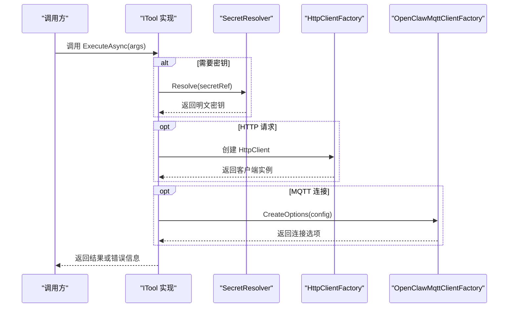
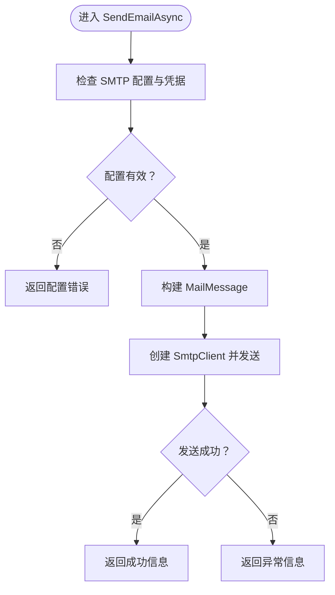
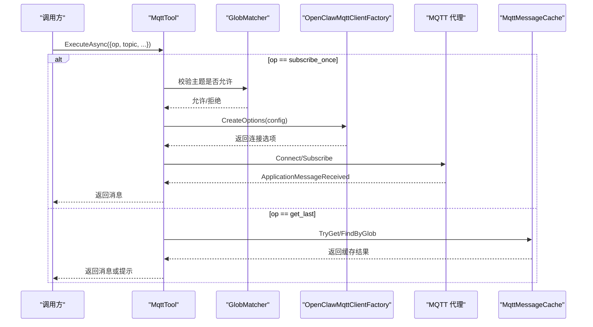
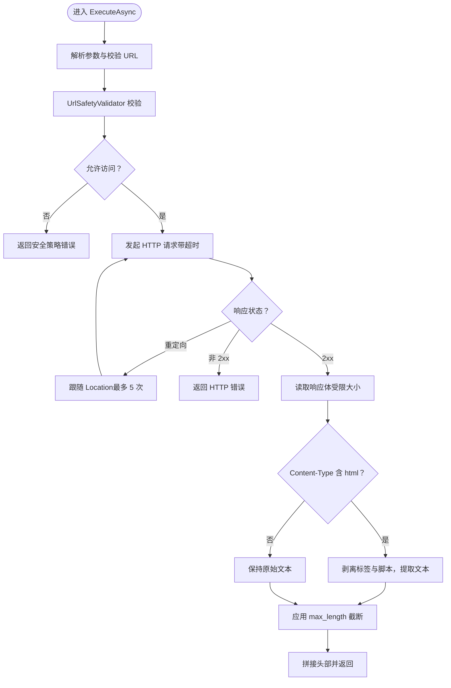
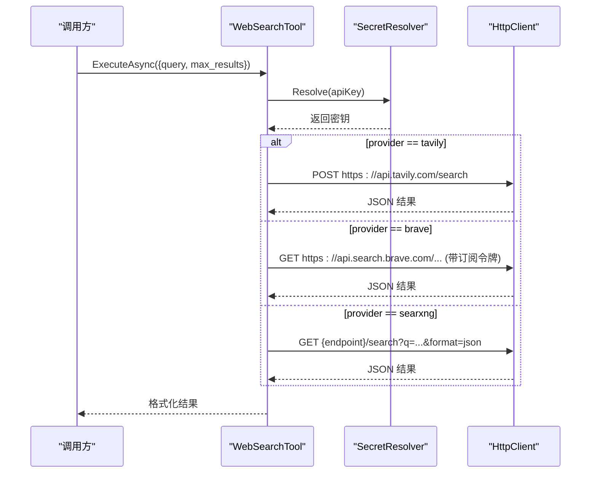
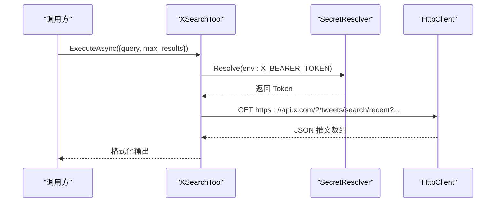
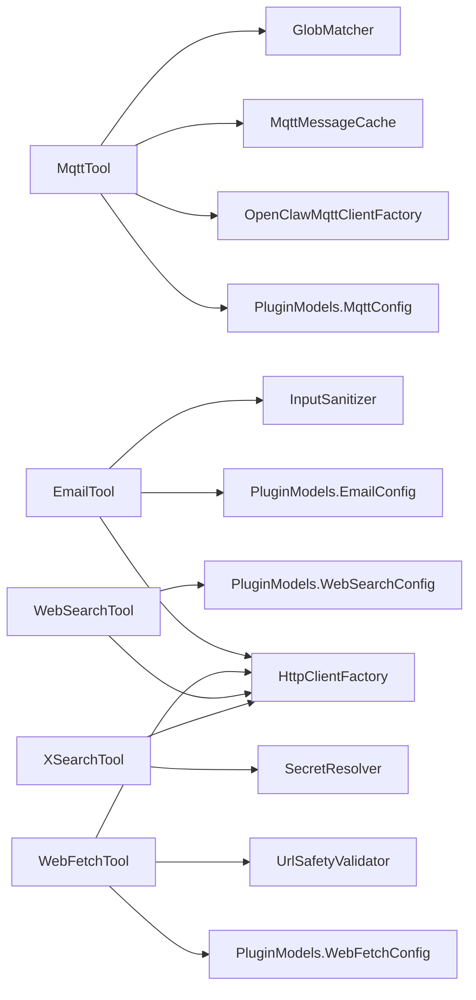

# 通信工具

<cite>
**本文引用的文件**
- [EmailTool.cs](file://src/OpenClaw.Agent/Tools/EmailTool.cs)
- [MqttTool.cs](file://src/OpenClaw.Agent/Tools/MqttTool.cs)
- [WebFetchTool.cs](file://src/OpenClaw.Agent/Tools/WebFetchTool.cs)
- [WebSearchTool.cs](file://src/OpenClaw.Agent/Tools/WebSearchTool.cs)
- [XSearchTool.cs](file://src/OpenClaw.Agent/Tools/XSearchTool.cs)
- [MqttClientFactory.cs](file://src/OpenClaw.Agent/Tools/MqttClientFactory.cs)
- [MqttMessageCache.cs](file://src/OpenClaw.Agent/Tools/MqttMessageCache.cs)
- [PluginModels.cs](file://src/OpenClaw.Core/Plugins/PluginModels.cs)
- [HttpClientFactory.cs](file://src/OpenClaw.Core/Http/HttpClientFactory.cs)
- [SecretResolver.cs](file://src/OpenClaw.Core/Security/SecretResolver.cs)
- [UrlSafetyValidator.cs](file://src/OpenClaw.Core/Security/UrlSafetyValidator.cs)
- [GlobMatcher.cs](file://src/OpenClaw.Core/Security/GlobMatcher.cs)
- [InputSanitizer.cs](file://src/OpenClaw.Core/Security/InputSanitizer.cs)
- [MqttToolTests.cs](file://src/OpenClaw.Tests/MqttToolTests.cs)
</cite>

## 目录
1. [简介](#简介)
2. [项目结构](#项目结构)
3. [核心组件](#核心组件)
4. [架构总览](#架构总览)
5. [详细组件分析](#详细组件分析)
6. [依赖关系分析](#依赖关系分析)
7. [性能考量](#性能考量)
8. [故障排查指南](#故障排查指南)
9. [结论](#结论)
10. [附录](#附录)

## 简介
本技术文档聚焦于通信工具模块，涵盖以下能力：
- 邮件发送与读取（SMTP 发送、IMAP 读取）
- MQTT 消息订阅与事件桥接缓存读取
- 网页抓取（HTTP 获取并提取可读文本）
- 网络搜索（Tavily、Brave、SearXNG）
- X 平台搜索（Twitter API v2）

文档将从架构、数据流、处理逻辑、集成点、错误处理与性能特性等方面进行系统化说明，并提供配置要点、认证方式、典型使用场景与安全建议。

## 项目结构
通信工具位于 Agent 工具层，围绕 ITool 接口统一对外暴露参数化能力；各工具通过配置模型注入运行时参数，并复用核心层的安全与网络基础设施。

图示来源
- [EmailTool.cs:1-402](file://src/OpenClaw.Agent/Tools/EmailTool.cs#L1-L402)
- [MqttTool.cs:1-152](file://src/OpenClaw.Agent/Tools/MqttTool.cs#L1-L152)
- [WebFetchTool.cs:1-212](file://src/OpenClaw.Agent/Tools/WebFetchTool.cs#L1-L212)
- [WebSearchTool.cs:1-207](file://src/OpenClaw.Agent/Tools/WebSearchTool.cs#L1-L207)
- [XSearchTool.cs:1-95](file://src/OpenClaw.Agent/Tools/XSearchTool.cs#L1-L95)
- [MqttClientFactory.cs:1-35](file://src/OpenClaw.Agent/Tools/MqttClientFactory.cs#L1-L35)
- [MqttMessageCache.cs:1-34](file://src/OpenClaw.Agent/Tools/MqttMessageCache.cs#L1-L34)
- [HttpClientFactory.cs](file://src/OpenClaw.Core/Http/HttpClientFactory.cs)
- [SecretResolver.cs](file://src/OpenClaw.Core/Security/SecretResolver.cs)
- [UrlSafetyValidator.cs](file://src/OpenClaw.Core/Security/UrlSafetyValidator.cs)
- [GlobMatcher.cs](file://src/OpenClaw.Core/Security/GlobMatcher.cs)
- [InputSanitizer.cs](file://src/OpenClaw.Core/Security/InputSanitizer.cs)

章节来源
- [EmailTool.cs:1-402](file://src/OpenClaw.Agent/Tools/EmailTool.cs#L1-L402)
- [MqttTool.cs:1-152](file://src/OpenClaw.Agent/Tools/MqttTool.cs#L1-L152)
- [WebFetchTool.cs:1-212](file://src/OpenClaw.Agent/Tools/WebFetchTool.cs#L1-L212)
- [WebSearchTool.cs:1-207](file://src/OpenClaw.Agent/Tools/WebSearchTool.cs#L1-L207)
- [XSearchTool.cs:1-95](file://src/OpenClaw.Agent/Tools/XSearchTool.cs#L1-L95)

## 核心组件
- 邮件工具：支持 SMTP 发送与 IMAP 读取（列表、读取、搜索），内置输入净化与只读模式保护。
- MQTT 工具：支持一次性订阅获取单条消息或基于事件桥接缓存的“最近一次”读取。
- 网页抓取：HTTP 获取网页内容，自动重定向限制，HTML 文本抽取，大小截断与超时控制。
- 网络搜索：统一接口对接 Tavily、Brave、SearXNG，返回标题、链接与摘要。
- X 搜索：基于 X API v2 的近期推文搜索，支持查询操作符与结果上限。

章节来源
- [EmailTool.cs:16-90](file://src/OpenClaw.Agent/Tools/EmailTool.cs#L16-L90)
- [MqttTool.cs:11-51](file://src/OpenClaw.Agent/Tools/MqttTool.cs#L11-L51)
- [WebFetchTool.cs:18-47](file://src/OpenClaw.Agent/Tools/WebFetchTool.cs#L18-L47)
- [WebSearchTool.cs:14-38](file://src/OpenClaw.Agent/Tools/WebSearchTool.cs#L14-L38)
- [XSearchTool.cs:13-27](file://src/OpenClaw.Agent/Tools/XSearchTool.cs#L13-L27)

## 架构总览
通信工具通过统一的 ITool 接口暴露能力，内部依赖核心层的安全与网络设施：
- 配置注入：各工具构造函数接收配置对象（如 EmailConfig、MqttConfig、WebFetchConfig、WebSearchConfig）。
- 安全与密钥：敏感信息通过 SecretResolver 解析，支持环境变量与密钥引用。
- 网络访问：统一使用 HttpClientFactory 创建 HTTP 客户端；MQTT 使用自定义工厂生成客户端与选项。
- 输入与策略：URL 安全校验、IMAP 输入净化、MQTT 主题通配符策略匹配。

图示来源
- [EmailTool.cs:92-129](file://src/OpenClaw.Agent/Tools/EmailTool.cs#L92-L129)
- [MqttTool.cs:80-135](file://src/OpenClaw.Agent/Tools/MqttTool.cs#L80-L135)
- [WebFetchTool.cs:48-159](file://src/OpenClaw.Agent/Tools/WebFetchTool.cs#L48-L159)
- [WebSearchTool.cs:39-67](file://src/OpenClaw.Agent/Tools/WebSearchTool.cs#L39-L67)
- [XSearchTool.cs:28-86](file://src/OpenClaw.Agent/Tools/XSearchTool.cs#L28-L86)
- [SecretResolver.cs](file://src/OpenClaw.Core/Security/SecretResolver.cs)
- [HttpClientFactory.cs](file://src/OpenClaw.Core/Http/HttpClientFactory.cs)
- [MqttClientFactory.cs:8-35](file://src/OpenClaw.Agent/Tools/MqttClientFactory.cs#L8-L35)

## 详细组件分析

### 邮件工具（SMTP 发送 + IMAP 读取）
- 功能范围
  - 发送：通过 SMTP 发送邮件，支持 TLS、凭据与发件人地址。
  - 读取：IMAP 支持选择目录、列出最近邮件、按编号读取正文、执行 IMAP SEARCH 查询。
  - 安全：输入净化防止命令注入；只读模式禁用发送。
- 参数与行为
  - action: send/list/read/search
  - send: to、subject、body 必填；from 可选，默认回退到用户名
  - list/read/search: folder（默认 INBOX）、count/query、message_id
- 错误处理
  - 配置缺失、认证失败、网络异常、IMAP 命令失败均返回明确错误信息
  - IMAP 登录失败、SELECT 失败、FETCH 失败均有针对性提示
- 性能与限制
  - 列表/搜索结果受 MaxResults 限制
  - IMAP 采用 UTF-8 流读写，登录后立即执行所需命令并退出

图示来源
- [EmailTool.cs:92-129](file://src/OpenClaw.Agent/Tools/EmailTool.cs#L92-L129)

章节来源
- [EmailTool.cs:16-90](file://src/OpenClaw.Agent/Tools/EmailTool.cs#L16-L90)
- [EmailTool.cs:92-239](file://src/OpenClaw.Agent/Tools/EmailTool.cs#L92-L239)
- [EmailTool.cs:243-397](file://src/OpenClaw.Agent/Tools/EmailTool.cs#L243-L397)
- [PluginModels.cs:449-497](file://src/OpenClaw.Core/Plugins/PluginModels.cs#L449-L497)

### MQTT 工具（订阅与缓存读取）
- 功能范围
  - subscribe_once：一次性订阅指定主题，等待消息到达或超时
  - get_last：从事件桥接缓存中读取最近消息，支持通配符匹配
- 参数与行为
  - op: subscribe_once 或 get_last
  - topic: 必填；timeout_ms（100–120000）、qos（0–2）
- 安全与策略
  - 通过策略白名单/黑名单限制订阅主题
  - 使用 GlobMatcher 进行通配符匹配
- 错误处理
  - 策略拒绝、连接失败、超时、断开均返回明确错误
  - 缓存未命中时提示启用事件桥接以开启缓存

图示来源
- [MqttTool.cs:35-135](file://src/OpenClaw.Agent/Tools/MqttTool.cs#L35-L135)
- [MqttClientFactory.cs:8-35](file://src/OpenClaw.Agent/Tools/MqttClientFactory.cs#L8-L35)
- [MqttMessageCache.cs:5-34](file://src/OpenClaw.Agent/Tools/MqttMessageCache.cs#L5-L34)
- [GlobMatcher.cs](file://src/OpenClaw.Core/Security/GlobMatcher.cs)

章节来源
- [MqttTool.cs:11-152](file://src/OpenClaw.Agent/Tools/MqttTool.cs#L11-L152)
- [MqttClientFactory.cs:8-35](file://src/OpenClaw.Agent/Tools/MqttClientFactory.cs#L8-L35)
- [MqttMessageCache.cs:5-34](file://src/OpenClaw.Agent/Tools/MqttMessageCache.cs#L5-L34)
- [MqttToolTests.cs](file://src/OpenClaw.Tests/MqttToolTests.cs)

### 网页抓取工具（WebFetch）
- 功能范围
  - 抓取指定 URL，支持自动重定向（最多 5 次），限制超时与最大长度
  - 对 HTML 自动剥离标签、脚本、样式，提取可读文本
  - 输出头部包含 URL、Content-Type、长度与截断标记
- 参数与行为
  - url: 必填；max_length: 可选，裁剪输出长度
- 安全与策略
  - 使用 UrlSafetyValidator 校验 URL 是否允许访问
  - 仅允许 http/https 协议
- 错误处理
  - URL 不合法、重定向过多、非 2xx、超时、请求失败均返回明确错误

图示来源
- [WebFetchTool.cs:48-159](file://src/OpenClaw.Agent/Tools/WebFetchTool.cs#L48-L159)
- [UrlSafetyValidator.cs](file://src/OpenClaw.Core/Security/UrlSafetyValidator.cs)

章节来源
- [WebFetchTool.cs:18-212](file://src/OpenClaw.Agent/Tools/WebFetchTool.cs#L18-L212)

### 网络搜索工具（WebSearch）
- 功能范围
  - 统一接口对接 Tavily、Brave、SearXNG
  - 返回标题、链接与摘要，支持限制最大结果数
- 参数与行为
  - query: 必填；max_results: 默认 5，限制 1–20
- 错误处理
  - 提供商不支持、请求失败、超时均返回明确错误
  - Tavily 使用 Bearer 认证，Brave 使用订阅令牌头，SearXNG 使用自建端点

图示来源
- [WebSearchTool.cs:39-132](file://src/OpenClaw.Agent/Tools/WebSearchTool.cs#L39-L132)
- [SecretResolver.cs](file://src/OpenClaw.Core/Security/SecretResolver.cs)
- [HttpClientFactory.cs](file://src/OpenClaw.Core/Http/HttpClientFactory.cs)

章节来源
- [WebSearchTool.cs:14-207](file://src/OpenClaw.Agent/Tools/WebSearchTool.cs#L14-L207)

### X 搜索工具（XSearch）
- 功能范围
  - 使用 X API v2 搜索近期推文，支持查询操作符
- 参数与行为
  - query: 必填；max_results: 10–100，默认 10
- 认证与安全
  - 通过环境变量 X_BEARER_TOKEN 提供 Bearer Token
  - 使用 SecretResolver 解析密钥
- 错误处理
  - 未配置密钥、HTTP 非 2xx、JSON 解析失败均返回明确错误

图示来源
- [XSearchTool.cs:28-86](file://src/OpenClaw.Agent/Tools/XSearchTool.cs#L28-L86)
- [SecretResolver.cs](file://src/OpenClaw.Core/Security/SecretResolver.cs)

章节来源
- [XSearchTool.cs:13-95](file://src/OpenClaw.Agent/Tools/XSearchTool.cs#L13-L95)

## 依赖关系分析
- 组件耦合
  - 工具与配置：通过构造函数注入配置对象，降低硬编码耦合
  - 安全与网络：集中于核心层，工具仅负责调用
  - MQTT 缓存：独立静态缓存，便于跨组件共享
- 外部依赖
  - MQTT：MQTTnet 库
  - HTTP：System.Net.Http 与工厂封装
  - IMAP：System.Net.Mail 与原生 TCP/SSL 流
- 潜在循环依赖
  - 工具层仅消费核心层服务，无反向依赖，避免循环

图示来源
- [EmailTool.cs:18-25](file://src/OpenClaw.Agent/Tools/EmailTool.cs#L18-L25)
- [MqttTool.cs:13-15](file://src/OpenClaw.Agent/Tools/MqttTool.cs#L13-L15)
- [WebFetchTool.cs:20-31](file://src/OpenClaw.Agent/Tools/WebFetchTool.cs#L20-L31)
- [WebSearchTool.cs:16-23](file://src/OpenClaw.Agent/Tools/WebSearchTool.cs#L16-L23)
- [XSearchTool.cs:15-22](file://src/OpenClaw.Agent/Tools/XSearchTool.cs#L15-L22)
- [PluginModels.cs](file://src/OpenClaw.Core/Plugins/PluginModels.cs)
- [HttpClientFactory.cs](file://src/OpenClaw.Core/Http/HttpClientFactory.cs)
- [SecretResolver.cs](file://src/OpenClaw.Core/Security/SecretResolver.cs)
- [MqttClientFactory.cs:8-35](file://src/OpenClaw.Agent/Tools/MqttClientFactory.cs#L8-L35)
- [MqttMessageCache.cs:5-34](file://src/OpenClaw.Agent/Tools/MqttMessageCache.cs#L5-L34)
- [GlobMatcher.cs](file://src/OpenClaw.Core/Security/GlobMatcher.cs)
- [InputSanitizer.cs](file://src/OpenClaw.Core/Security/InputSanitizer.cs)
- [UrlSafetyValidator.cs](file://src/OpenClaw.Core/Security/UrlSafetyValidator.cs)

章节来源
- [PluginModels.cs:449-497](file://src/OpenClaw.Core/Plugins/PluginModels.cs#L449-L497)

## 性能考量
- 网络请求
  - HTTP 读取采用分块缓冲与内存流，避免大数组预分配，提升吞吐与内存效率
  - 超时控制与最大长度限制，防止资源耗尽
- IMAP
  - 登录后立即执行所需命令并断开，减少连接占用
  - 列表/搜索结果按需截断，避免过度传输
- MQTT
  - 一次性订阅使用取消令牌与超时控制，避免长时间挂起
  - 缓存命中优先，减少重复订阅成本

## 故障排查指南
- 邮件工具
  - SMTP/IMAP 配置缺失：检查 EmailConfig 中主机、端口、TLS、凭据与发件人设置
  - IMAP 命令注入风险：确保 folder 名称经净化处理
  - 只读模式：若启用 ReadOnlyMode，则禁止发送
- MQTT 工具
  - 策略拒绝：确认主题是否在允许列表内；检查通配符匹配规则
  - 缓存未命中：启用事件桥接以开启缓存功能
  - 连接失败：检查用户名/密码引用、TLS 设置与代理可达性
- 网页抓取
  - URL 不被允许：调整 UrlSafety 配置或白名单
  - 重定向过多：检查目标站点重定向链路
  - 超时/截断：适当增加超时或放宽 max_length
- 网络搜索
  - API 密钥未配置：检查提供商密钥引用或环境变量
  - 非 2xx：根据提供商返回体定位问题
- X 搜索
  - Bearer Token 未配置：设置 X_BEARER_TOKEN 环境变量
  - 查询语法：参考 X API v2 操作符规范

章节来源
- [EmailTool.cs:92-129](file://src/OpenClaw.Agent/Tools/EmailTool.cs#L92-L129)
- [EmailTool.cs:131-239](file://src/OpenClaw.Agent/Tools/EmailTool.cs#L131-L239)
- [MqttTool.cs:80-135](file://src/OpenClaw.Agent/Tools/MqttTool.cs#L80-L135)
- [WebFetchTool.cs:48-159](file://src/OpenClaw.Agent/Tools/WebFetchTool.cs#L48-L159)
- [WebSearchTool.cs:39-67](file://src/OpenClaw.Agent/Tools/WebSearchTool.cs#L39-L67)
- [XSearchTool.cs:28-86](file://src/OpenClaw.Agent/Tools/XSearchTool.cs#L28-L86)

## 结论
通信工具模块以统一接口与清晰职责划分实现了邮件、MQTT、网页抓取、网络搜索与 X 搜索等能力。通过核心层的安全与网络基础设施，工具在保证易用性的同时兼顾了安全性与性能。建议在生产环境中严格配置密钥与 URL 安全策略，并结合事件桥接与缓存机制优化 MQTT 交互体验。

## 附录

### 配置与认证清单
- 邮件（SMTP/IMAP）
  - SMTP：主机、端口、TLS、用户名、密码引用、发件人地址
  - IMAP：主机、端口、TLS、用户名、密码引用、最大结果数
- MQTT
  - 主机、端口、协议版本、用户名/密码引用、TLS、客户端 ID、订阅策略
- 网页抓取
  - User-Agent、超时秒数、最大大小 KB、URL 安全策略
- 网络搜索
  - 提供商（tavily、brave、searxng）、API 密钥引用、端点（SearXNG）
- X 搜索
  - 环境变量：X_BEARER_TOKEN

章节来源
- [PluginModels.cs:449-497](file://src/OpenClaw.Core/Plugins/PluginModels.cs#L449-L497)
- [SecretResolver.cs](file://src/OpenClaw.Core/Security/SecretResolver.cs)