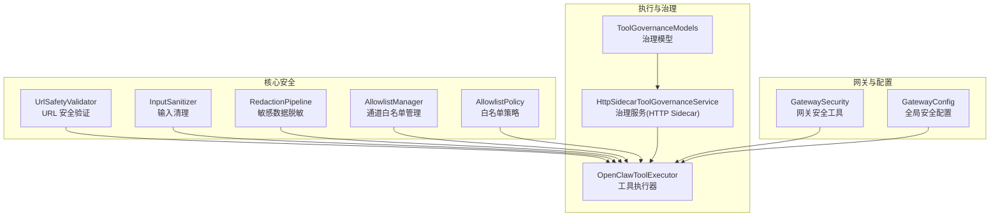
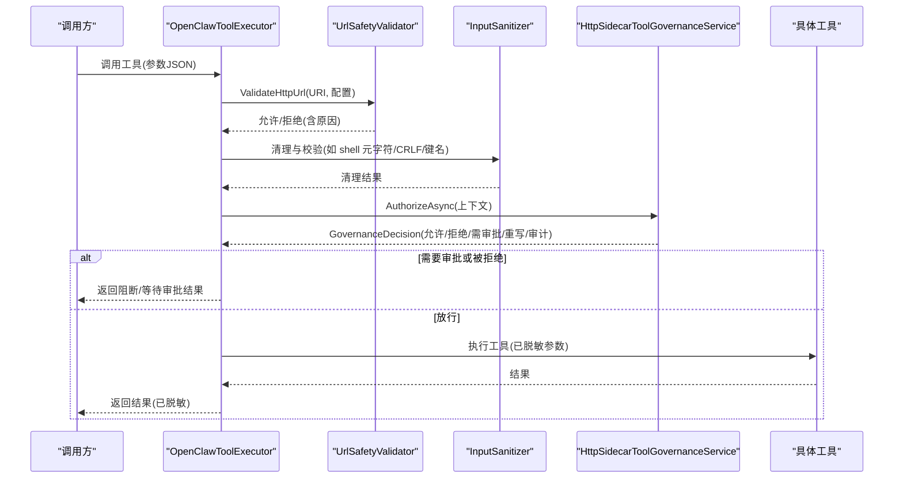
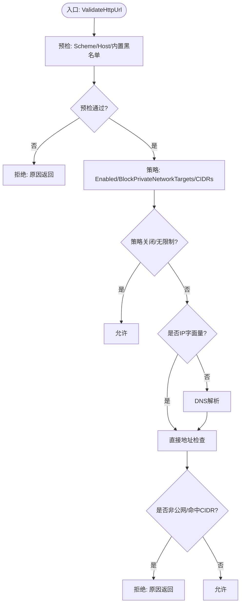
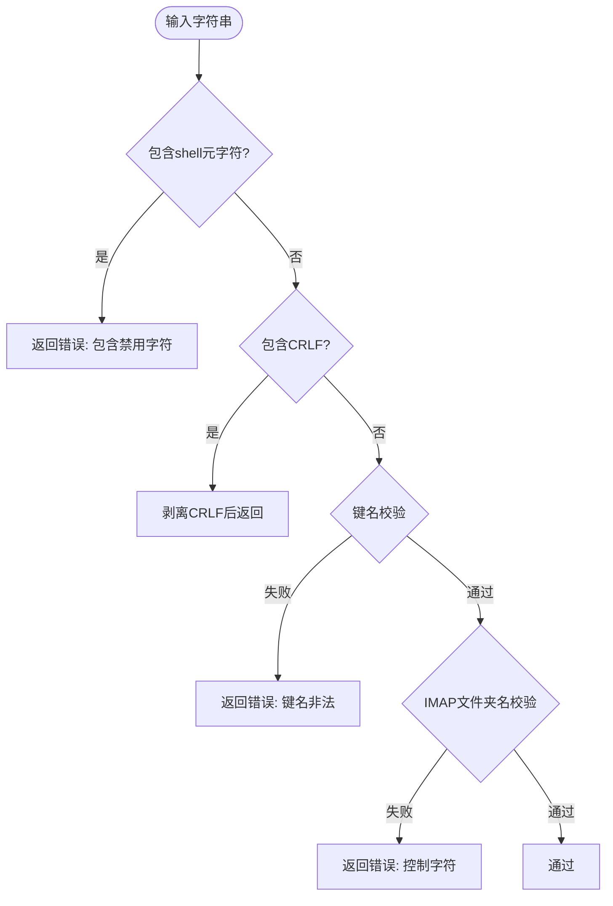
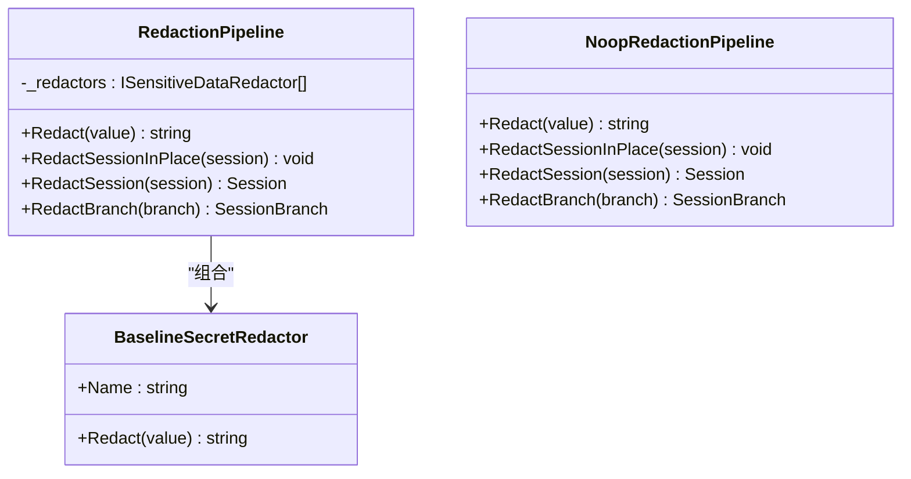
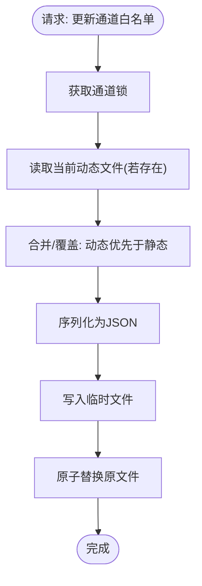
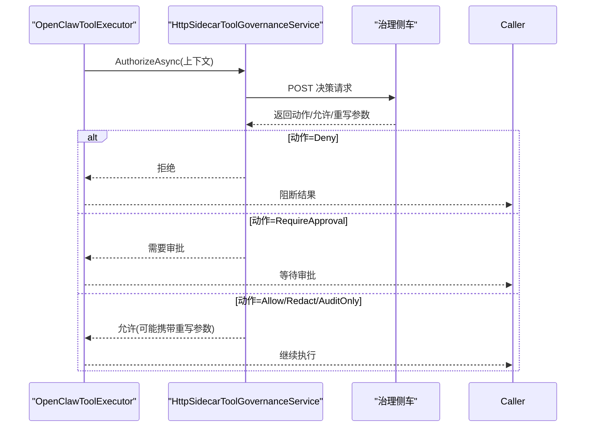
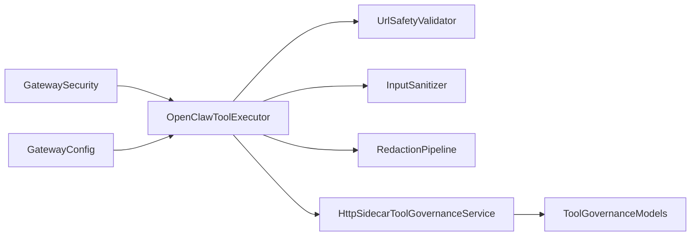

# 工具安全策略

<cite>
**本文引用的文件**
- [ToolPathPolicy.cs](file://src/OpenClaw.Core/Security/ToolPathPolicy.cs)
- [AllowlistManager.cs](file://src/OpenClaw.Core/Security/AllowlistManager.cs)
- [AllowlistPolicy.cs](file://src/OpenClaw.Core/Security/AllowlistPolicy.cs)
- [UrlSafetyValidator.cs](file://src/OpenClaw.Core/Security/UrlSafetyValidator.cs)
- [InputSanitizer.cs](file://src/OpenClaw.Core/Security/InputSanitizer.cs)
- [RedactionPipeline.cs](file://src/OpenClaw.Core/Security/RedactionPipeline.cs)
- [OpenClawToolExecutor.cs](file://src/OpenClaw.Agent/OpenClawToolExecutor.cs)
- [HttpSidecarToolGovernanceService.cs](file://src/OpenClaw.Core/Governance/HttpSidecarToolGovernanceService.cs)
- [ToolGovernanceModels.cs](file://src/OpenClaw.Core/Models/ToolGovernanceModels.cs)
- [GatewaySecurity.cs](file://src/OpenClaw.Gateway/GatewaySecurity.cs)
- [GatewayConfig.cs](file://src/OpenClaw.Core/Models/GatewayConfig.cs)
- [UrlSafetyValidatorTests.cs](file://src/OpenClaw.Tests/UrlSafetyValidatorTests.cs)
- [GovernanceLedgerService.cs](file://src/OpenClaw.Gateway/GovernanceLedgerService.cs)
</cite>

## 目录
1. [简介](#简介)
2. [项目结构](#项目结构)
3. [核心组件](#核心组件)
4. [架构总览](#架构总览)
5. [详细组件分析](#详细组件分析)
6. [依赖关系分析](#依赖关系分析)
7. [性能考量](#性能考量)
8. [故障排查指南](#故障排查指南)
9. [结论](#结论)
10. [附录](#附录)

## 简介
本技术文档聚焦于工具安全策略在系统中的设计与实现，覆盖路径策略、URL 安全验证、输入清理与敏感数据保护等关键领域。文档详细说明工具路径白名单机制、文件系统访问控制、命令注入防护、URL 安全验证规则、输入参数清理与输出数据脱敏，并阐述安全策略如何与工具执行器集成、如何处理安全违规事件，以及配置选项、审计日志与合规要求。最后提供最佳实践与威胁防护指南。

## 项目结构
安全策略相关代码主要分布在以下模块：
- 核心安全能力：URL 安全验证、输入清理、敏感数据脱敏、通道白名单管理
- 执行与治理：工具执行器、治理服务（HTTP Sidecar）
- 网关与配置：网关安全工具、全局安全配置模型
- 测试与审计：URL 安全测试、治理审计记录

**图表来源**
- [UrlSafetyValidator.cs:17-219](file://src/OpenClaw.Core/Security/UrlSafetyValidator.cs#L17-L219)
- [InputSanitizer.cs:9-84](file://src/OpenClaw.Core/Security/InputSanitizer.cs#L9-L84)
- [RedactionPipeline.cs:21-131](file://src/OpenClaw.Core/Security/RedactionPipeline.cs#L21-L131)
- [AllowlistManager.cs:19-126](file://src/OpenClaw.Core/Security/AllowlistManager.cs#L19-L126)
- [AllowlistPolicy.cs:9-43](file://src/OpenClaw.Core/Security/AllowlistPolicy.cs#L9-L43)
- [OpenClawToolExecutor.cs:30-100](file://src/OpenClaw.Agent/OpenClawToolExecutor.cs#L30-L100)
- [HttpSidecarToolGovernanceService.cs:8-236](file://src/OpenClaw.Core/Governance/HttpSidecarToolGovernanceService.cs#L8-L236)
- [ToolGovernanceModels.cs:24-150](file://src/OpenClaw.Core/Models/ToolGovernanceModels.cs#L24-L150)
- [GatewaySecurity.cs:8-109](file://src/OpenClaw.Gateway/GatewaySecurity.cs#L8-L109)
- [GatewayConfig.cs:331-378](file://src/OpenClaw.Core/Models/GatewayConfig.cs#L331-L378)

**章节来源**
- [UrlSafetyValidator.cs:17-219](file://src/OpenClaw.Core/Security/UrlSafetyValidator.cs#L17-L219)
- [OpenClawToolExecutor.cs:30-100](file://src/OpenClaw.Agent/OpenClawToolExecutor.cs#L30-L100)
- [GatewayConfig.cs:331-378](file://src/OpenClaw.Core/Models/GatewayConfig.cs#L331-L378)

## 核心组件
- URL 安全验证：对绝对 http(s) URL 进行预检、内置黑名单匹配、可选 DNS 解析与私有地址/网段阻断
- 输入清理：检测并阻止 shell 元字符、剥离 CRLF、校验内存键与 IMAP 文件夹名
- 敏感数据脱敏：多级脱敏流水线，支持 Authorization Bearer、OpenAI 密钥、API Key 字段等
- 通道白名单：按通道持久化允许来源/去向列表，动态更新与合并静态配置
- 治理与执行：工具执行前进行治理决策，支持拒绝、放行、需要审批、审计仅记录、重写参数等动作
- 网关安全：固定时间比较令牌、HMAC SHA256 校验、循环回环绑定识别

**章节来源**
- [UrlSafetyValidator.cs:17-219](file://src/OpenClaw.Core/Security/UrlSafetyValidator.cs#L17-L219)
- [InputSanitizer.cs:9-84](file://src/OpenClaw.Core/Security/InputSanitizer.cs#L9-L84)
- [RedactionPipeline.cs:21-131](file://src/OpenClaw.Core/Security/RedactionPipeline.cs#L21-L131)
- [AllowlistManager.cs:19-126](file://src/OpenClaw.Core/Security/AllowlistManager.cs#L19-L126)
- [HttpSidecarToolGovernanceService.cs:8-236](file://src/OpenClaw.Core/Governance/HttpSidecarToolGovernanceService.cs#L8-L236)
- [GatewaySecurity.cs:8-109](file://src/OpenClaw.Gateway/GatewaySecurity.cs#L8-L109)

## 架构总览
工具执行流程中，安全策略以“防御纵深”方式嵌入：先进行 URL 验证与输入清理，再通过治理服务进行授权决策，最终以脱敏后的参数执行工具，并记录审计日志。

**图表来源**
- [OpenClawToolExecutor.cs:134-200](file://src/OpenClaw.Agent/OpenClawToolExecutor.cs#L134-L200)
- [UrlSafetyValidator.cs:27-111](file://src/OpenClaw.Core/Security/UrlSafetyValidator.cs#L27-L111)
- [InputSanitizer.cs:24-82](file://src/OpenClaw.Core/Security/InputSanitizer.cs#L24-L82)
- [HttpSidecarToolGovernanceService.cs:24-107](file://src/OpenClaw.Core/Governance/HttpSidecarToolGovernanceService.cs#L24-L107)

## 详细组件分析

### 组件A：URL 安全验证
- 功能要点
  - 仅允许绝对 http/https URL
  - 内置主机通配黑名单（localhost、metadata 等）
  - 可选阻断私有网络目标（loopback、RFC1918/IPv6 链路本地/站点本地/组播等）
  - 支持自定义阻断 CIDR 列表
  - 可选延迟 DNS 解析，避免解析失败导致的误判
- 处理逻辑
  - 预检阶段：Scheme/Host 合法性、内置黑名单匹配
  - 解析阶段：DNS 解析主机到 IP，逐个检查是否为非公网地址或命中阻断 CIDR
  - 结果：允许或拒绝，附带原因字符串，便于工具错误提示

**图表来源**
- [UrlSafetyValidator.cs:27-135](file://src/OpenClaw.Core/Security/UrlSafetyValidator.cs#L27-L135)

**章节来源**
- [UrlSafetyValidator.cs:17-219](file://src/OpenClaw.Core/Security/UrlSafetyValidator.cs#L17-L219)
- [UrlSafetyValidatorTests.cs:10-41](file://src/OpenClaw.Tests/UrlSafetyValidatorTests.cs#L10-L41)

### 组件B：输入清理与命令注入防护
- 功能要点
  - 检测 shell 元字符集合；若发现则拒绝
  - 剥离 CRLF，防止协议注入
  - 校验内存键不允许路径穿越、斜杠、空字符
  - 校验 IMAP 文件夹名不允许控制字符
- 性能与复杂度
  - 使用 SIMD 加速的字符搜索，时间复杂度近似 O(n)
  - CRLF 剥离采用单次分配与写指针策略，避免多次复制

**图表来源**
- [InputSanitizer.cs:24-82](file://src/OpenClaw.Core/Security/InputSanitizer.cs#L24-L82)

**章节来源**
- [InputSanitizer.cs:9-84](file://src/OpenClaw.Core/Security/InputSanitizer.cs#L9-L84)

### 组件C：敏感数据脱敏与输出脱敏
- 功能要点
  - 多级脱敏流水线：依次应用各脱敏器
  - 默认脱敏器：Authorization Bearer、OpenAI 密钥、API Key 字段
  - 对会话历史、工具调用参数/结果/失败消息/下一步建议进行就地脱敏
- 与执行器集成
  - 执行器在记录审计前对参数 JSON 进行脱敏
  - 治理服务返回重写参数时同样进行脱敏

**图表来源**
- [RedactionPipeline.cs:21-131](file://src/OpenClaw.Core/Security/RedactionPipeline.cs#L21-L131)

**章节来源**
- [RedactionPipeline.cs:21-131](file://src/OpenClaw.Core/Security/RedactionPipeline.cs#L21-L131)
- [OpenClawToolExecutor.cs:165-166](file://src/OpenClaw.Agent/OpenClawToolExecutor.cs#L165-L166)
- [GovernanceLedgerService.cs:401-410](file://src/OpenClaw.Gateway/GovernanceLedgerService.cs#L401-L410)

### 组件D：通道白名单机制
- 功能要点
  - 按通道持久化允许来源/去向列表
  - 动态文件优先于静态配置，支持并发锁与原子替换
  - 名称安全化与路径隔离，防止目录遍历
- 语义
  - Legacy：空白名单默认允许所有（历史行为）
  - Strict：空白名单默认拒绝所有

**图表来源**
- [AllowlistManager.cs:53-84](file://src/OpenClaw.Core/Security/AllowlistManager.cs#L53-L84)
- [AllowlistPolicy.cs:9-43](file://src/OpenClaw.Core/Security/AllowlistPolicy.cs#L9-L43)

**章节来源**
- [AllowlistManager.cs:19-126](file://src/OpenClaw.Core/Security/AllowlistManager.cs#L19-L126)
- [AllowlistPolicy.cs:9-43](file://src/OpenClaw.Core/Security/AllowlistPolicy.cs#L9-L43)

### 组件E：工具执行器与治理服务集成
- 功能要点
  - 执行器在执行前进行参数脱敏与预检
  - 通过治理服务进行授权决策，支持 fail-closed/fail-open 策略
  - 支持重写参数、审计仅记录、需要审批等动作
  - 记录即时治理审计并返回阻断结果
- 关键交互
  - 治理服务根据风险级别与配置决定是否放行或要求审批
  - 执行器根据决策结果选择继续执行或阻断

**图表来源**
- [OpenClawToolExecutor.cs:243-272](file://src/OpenClaw.Agent/OpenClawToolExecutor.cs#L243-L272)
- [HttpSidecarToolGovernanceService.cs:24-107](file://src/OpenClaw.Core/Governance/HttpSidecarToolGovernanceService.cs#L24-L107)
- [ToolGovernanceModels.cs:44-93](file://src/OpenClaw.Core/Models/ToolGovernanceModels.cs#L44-L93)

**章节来源**
- [OpenClawToolExecutor.cs:134-200](file://src/OpenClaw.Agent/OpenClawToolExecutor.cs#L134-L200)
- [HttpSidecarToolGovernanceService.cs:8-236](file://src/OpenClaw.Core/Governance/HttpSidecarToolGovernanceService.cs#L8-L236)
- [ToolGovernanceModels.cs:24-150](file://src/OpenClaw.Core/Models/ToolGovernanceModels.cs#L24-L150)

### 组件F：网关安全与绑定策略
- 功能要点
  - 固定时间比较令牌，避免时序攻击
  - HMAC SHA256 校验签名，支持十六进制编码
  - 识别循环回环绑定地址，用于启动前安全检查
- 启动安全
  - 当绑定到非回环地址时，可通过安全配置强制更严格策略（如禁止不安全工具、插件桥等）

**章节来源**
- [GatewaySecurity.cs:8-109](file://src/OpenClaw.Gateway/GatewaySecurity.cs#L8-L109)
- [GatewayConfig.cs:331-378](file://src/OpenClaw.Core/Models/GatewayConfig.cs#L331-L378)

## 依赖关系分析
- 执行器依赖安全组件：URL 验证、输入清理、脱敏、治理服务
- 治理服务依赖模型：治理上下文、描述符、决策模型
- 网关安全工具与配置共同影响启动与运行期安全策略

**图表来源**
- [OpenClawToolExecutor.cs:30-100](file://src/OpenClaw.Agent/OpenClawToolExecutor.cs#L30-L100)
- [HttpSidecarToolGovernanceService.cs:8-236](file://src/OpenClaw.Core/Governance/HttpSidecarToolGovernanceService.cs#L8-L236)
- [ToolGovernanceModels.cs:24-150](file://src/OpenClaw.Core/Models/ToolGovernanceModels.cs#L24-L150)
- [GatewaySecurity.cs:8-109](file://src/OpenClaw.Gateway/GatewaySecurity.cs#L8-L109)
- [GatewayConfig.cs:331-378](file://src/OpenClaw.Core/Models/GatewayConfig.cs#L331-L378)

**章节来源**
- [OpenClawToolExecutor.cs:30-100](file://src/OpenClaw.Agent/OpenClawToolExecutor.cs#L30-L100)
- [HttpSidecarToolGovernanceService.cs:8-236](file://src/OpenClaw.Core/Governance/HttpSidecarToolGovernanceService.cs#L8-L236)

## 性能考量
- URL 安全验证
  - DNS 解析可异步进行，但默认预检阶段不解析，减少不必要的网络调用
  - 地址匹配使用位运算与短路判断，复杂度与 CIDR 数量线性相关
- 输入清理
  - 使用 SIMD 加速的字符搜索，适合大文本快速扫描
  - CRLF 剥离采用一次性分配与写指针，避免中间对象过多
- 脱敏流水线
  - 多级脱敏顺序执行，整体复杂度 O(n·k)，k 为脱敏器数量
  - 会话就地脱敏避免深拷贝，降低内存峰值

[本节为通用性能讨论，无需列出章节来源]

## 故障排查指南
- URL 安全验证失败
  - 检查 URL 是否为绝对 http/https
  - 确认是否命中内置黑名单或自定义阻断 CIDR
  - 若启用私网阻断，请确认目标地址为公网或调整策略
- 输入清理报错
  - 检查参数中是否存在 shell 元字符、CRLF、非法键名或控制字符
- 治理服务不可用
  - 查看超时设置与 Sidecar 状态码
  - 根据 fail-closed/fail-open 配置判断是否应阻断或降级
- 审计与合规
  - 治理审计记录包含决策、信任分、策略/规则 ID、评估耗时等字段
  - 参数与结果在记录前均经过脱敏处理

**章节来源**
- [UrlSafetyValidatorTests.cs:10-41](file://src/OpenClaw.Tests/UrlSafetyValidatorTests.cs#L10-L41)
- [HttpSidecarToolGovernanceService.cs:58-107](file://src/OpenClaw.Core/Governance/HttpSidecarToolGovernanceService.cs#L58-L107)
- [GovernanceLedgerService.cs:423-432](file://src/OpenClaw.Gateway/GovernanceLedgerService.cs#L423-L432)

## 结论
该安全策略通过“预检-治理-脱敏-审计”的闭环设计，有效降低了工具执行过程中的安全风险。URL 安全验证与输入清理从源头阻断常见注入与越权访问；脱敏流水线确保敏感信息不出域；通道白名单与网关安全工具进一步强化边界控制。治理服务提供灵活的授权策略与可观测性，满足不同部署场景下的合规与安全需求。

[本节为总结性内容，无需列出章节来源]

## 附录

### 安全策略配置选项
- URL 安全配置
  - Enabled：启用 URL 验证
  - BlockPrivateNetworkTargets：阻断私有网络目标
  - BlockedCidrs：阻断的网段列表
- 治理配置
  - Enabled：启用治理
  - Provider：治理提供者（HTTP Sidecar）
  - DecisionEndpoint/ResultEndpoint：治理端点
  - TimeoutMs：超时毫秒数
  - FailClosed/FailOpenReadOnlyLowRisk：失败时的策略
  - RequireGovernanceForHighRiskTools：高风险工具必须经治理
- 网关安全配置
  - StrictPublicBindProfile：公共绑定严格配置
  - AllowQueryStringToken：允许查询串令牌
  - AllowedOrigins/KnownProxies：跨域与代理信任
  - AllowUnsafeToolingOnPublicBind/AllowPluginBridgeOnPublicBind/AllowRawSecretRefsOnPublicBind：公共绑定时的限制开关

**章节来源**
- [GatewayConfig.cs:331-378](file://src/OpenClaw.Core/Models/GatewayConfig.cs#L331-L378)
- [ToolGovernanceModels.cs:24-36](file://src/OpenClaw.Core/Models/ToolGovernanceModels.cs#L24-L36)

### 审计日志与合规
- 治理审计记录字段
  - 决策状态、信任分、策略/规则 ID、评估耗时
  - 参数摘要与重写参数 JSON、替换参数 JSON
- 数据最小化
  - 所有记录前均进行脱敏处理，避免敏感信息泄露

**章节来源**
- [ToolGovernanceModels.cs:44-93](file://src/OpenClaw.Core/Models/ToolGovernanceModels.cs#L44-L93)
- [GovernanceLedgerService.cs:401-410](file://src/OpenClaw.Gateway/GovernanceLedgerService.cs#L401-L410)

### 最佳实践与威胁防护指南
- URL 安全
  - 默认启用私网阻断与内置黑名单，仅在受控环境放宽
  - 对外部依赖使用 HTTPS 并定期审查阻断 CIDR
- 输入清理
  - 严格禁止 shell 元字符与 CRLF 注入
  - 对用户输入的键名与文件夹名进行强校验
- 脱敏策略
  - 在日志、审计、对外响应中统一使用脱敏流水线
  - 对高敏感字段（密钥、令牌）实施多层脱敏
- 治理与审批
  - 高风险工具（进程执行、文件系统写、外部 HTTP、数据导出、消息发送）必须经治理
  - 低风险只读工具可在 fail-open 下降级放行，但需审计
- 网络与边界
  - 绑定到非回环地址时启用严格公共绑定配置
  - 使用固定时间比较与 HMAC 校验，避免时序攻击与伪造

[本节为通用指导，无需列出章节来源]