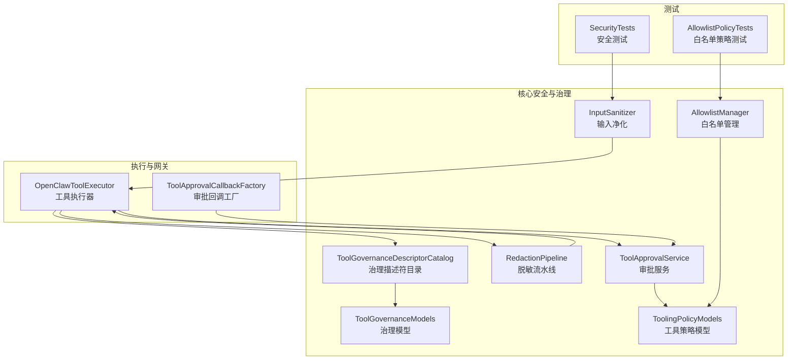
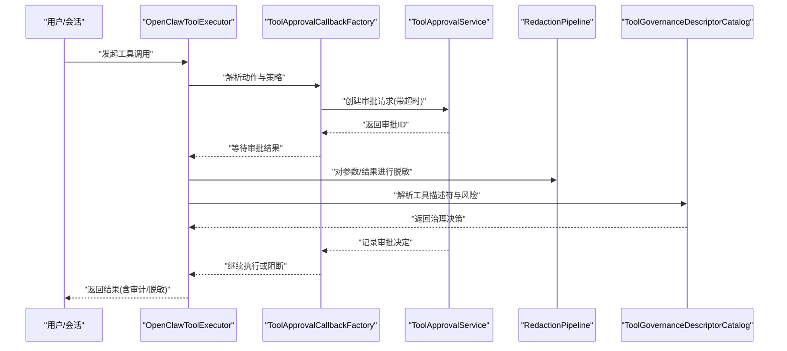
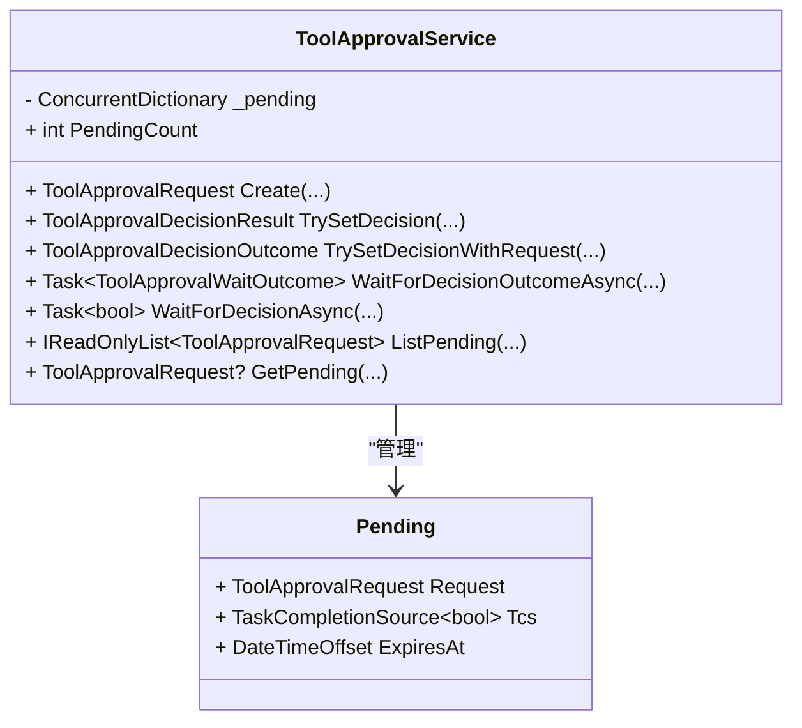
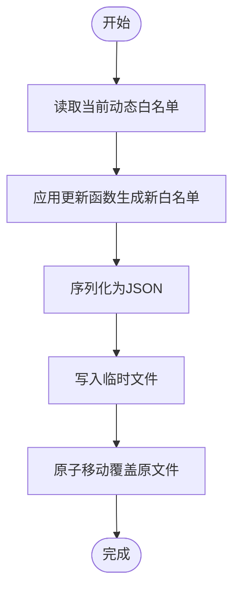
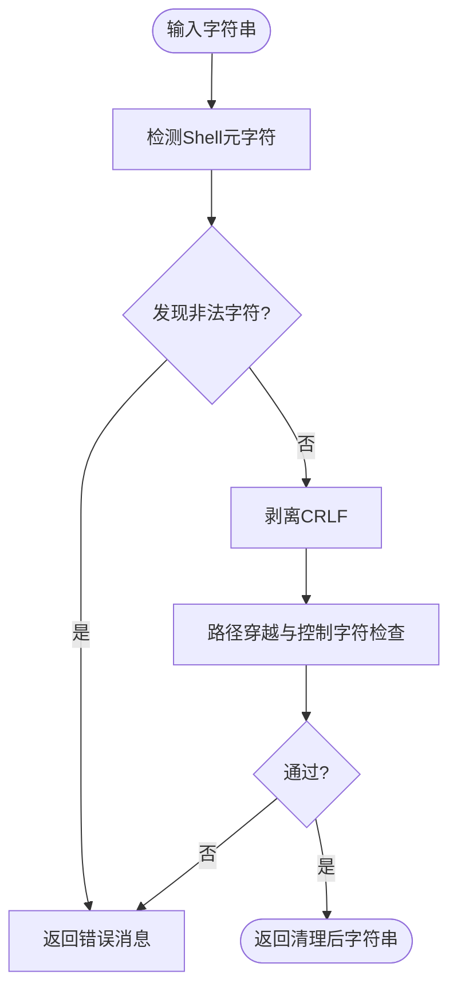
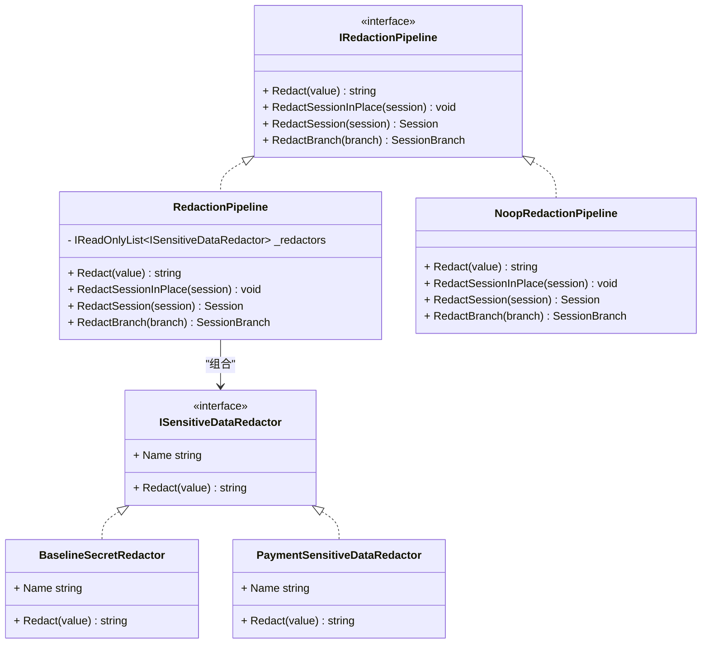
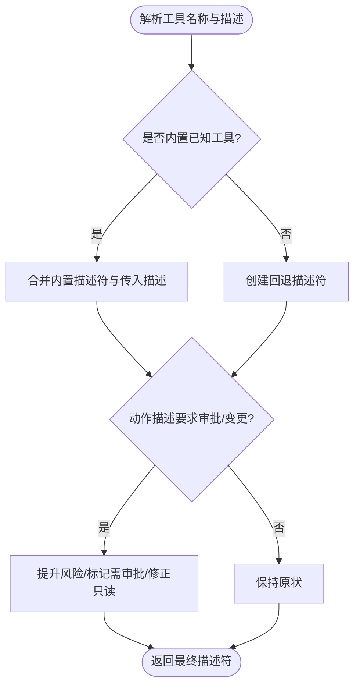
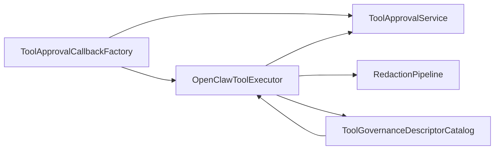

# 工具安全策略

<cite>
**本文引用的文件**   
- [ToolApprovalService.cs](file://src/OpenClaw.Core/Pipeline/ToolApprovalService.cs)
- [AllowlistManager.cs](file://src/OpenClaw.Core/Security/AllowlistManager.cs)
- [InputSanitizer.cs](file://src/OpenClaw.Core/Security/InputSanitizer.cs)
- [RedactionPipeline.cs](file://src/OpenClaw.Core/Security/RedactionPipeline.cs)
- [ToolGovernanceDescriptorCatalog.cs](file://src/OpenClaw.Core/Governance/ToolGovernanceDescriptorCatalog.cs)
- [ToolGovernanceModels.cs](file://src/OpenClaw.Core/Models/ToolGovernanceModels.cs)
- [ToolingPolicyModels.cs](file://src/OpenClaw.Core/Models/ToolingPolicyModels.cs)
- [ToolApprovalCallbackFactory.cs](file://src/OpenClaw.Gateway/ToolApprovalCallbackFactory.cs)
- [OpenClawToolExecutor.cs](file://src/OpenClaw.Agent/OpenClawToolExecutor.cs)
- [SecurityTests.cs](file://src/OpenClaw.Tests/SecurityTests.cs)
- [AllowlistPolicyTests.cs](file://src/OpenClaw.Tests/AllowlistPolicyTests.cs)
- [PaymentSensitiveDataRedactor.cs](file://src/OpenClaw.Payments.Core/PaymentSensitiveDataRedactor.cs)
</cite>

## 目录
1. [简介](#简介)
2. [项目结构](#项目结构)
3. [核心组件](#核心组件)
4. [架构总览](#架构总览)
5. [组件详解](#组件详解)
6. [依赖关系分析](#依赖关系分析)
7. [性能与可扩展性](#性能与可扩展性)
8. [故障排查指南](#故障排查指南)
9. [结论](#结论)
10. [附录：安全配置与合规检查清单](#附录安全配置与合规检查清单)

## 简介
本技术文档系统化阐述工具安全策略体系，覆盖执行安全、访问控制、风险评估与治理决策等关键环节。重点围绕以下能力进行深入解析：
- ToolApprovalService 的审批流程、权限验证与授权机制
- AllowlistManager 的工具白名单管理、动态更新与匹配算法
- InputSanitizer 的输入验证、注入与跨站脚本（XSS）防护
- RedactionPipeline 的数据脱敏策略、敏感信息保护与审计日志
- ToolGovernanceDescriptorCatalog 的治理描述符解析、策略匹配与决策支持
并提供安全配置指南、威胁模型分析与合规性检查清单。

## 项目结构
安全相关能力主要分布在如下模块：
- 核心安全与治理：OpenClaw.Core/Security、OpenClaw.Core/Governance、OpenClaw.Core/Models
- 执行与网关集成：OpenClaw.Agent、OpenClaw.Gateway
- 测试与验证：OpenClaw.Tests

**图表来源**
- [ToolApprovalService.cs:1-265](file://src/OpenClaw.Core/Pipeline/ToolApprovalService.cs#L1-L265)
- [AllowlistManager.cs:1-126](file://src/OpenClaw.Core/Security/AllowlistManager.cs#L1-L126)
- [InputSanitizer.cs:1-84](file://src/OpenClaw.Core/Security/InputSanitizer.cs#L1-L84)
- [RedactionPipeline.cs:1-131](file://src/OpenClaw.Core/Security/RedactionPipeline.cs#L1-L131)
- [ToolGovernanceDescriptorCatalog.cs:1-181](file://src/OpenClaw.Core/Governance/ToolGovernanceDescriptorCatalog.cs#L1-L181)
- [ToolGovernanceModels.cs:1-150](file://src/OpenClaw.Core/Models/ToolGovernanceModels.cs#L1-L150)
- [ToolingPolicyModels.cs:1-45](file://src/OpenClaw.Core/Models/ToolingPolicyModels.cs#L1-L45)
- [OpenClawToolExecutor.cs:420-445](file://src/OpenClaw.Agent/OpenClawToolExecutor.cs#L420-L445)
- [ToolApprovalCallbackFactory.cs:38-95](file://src/OpenClaw.Gateway/ToolApprovalCallbackFactory.cs#L38-L95)
- [SecurityTests.cs:108-144](file://src/OpenClaw.Tests/SecurityTests.cs#L108-L144)
- [AllowlistPolicyTests.cs:1-33](file://src/OpenClaw.Tests/AllowlistPolicyTests.cs#L1-L33)

**章节来源**
- [ToolApprovalService.cs:1-265](file://src/OpenClaw.Core/Pipeline/ToolApprovalService.cs#L1-L265)
- [AllowlistManager.cs:1-126](file://src/OpenClaw.Core/Security/AllowlistManager.cs#L1-L126)
- [InputSanitizer.cs:1-84](file://src/OpenClaw.Core/Security/InputSanitizer.cs#L1-L84)
- [RedactionPipeline.cs:1-131](file://src/OpenClaw.Core/Security/RedactionPipeline.cs#L1-L131)
- [ToolGovernanceDescriptorCatalog.cs:1-181](file://src/OpenClaw.Core/Governance/ToolGovernanceDescriptorCatalog.cs#L1-L181)
- [ToolGovernanceModels.cs:1-150](file://src/OpenClaw.Core/Models/ToolGovernanceModels.cs#L1-L150)
- [ToolingPolicyModels.cs:1-45](file://src/OpenClaw.Core/Models/ToolingPolicyModels.cs#L1-L45)
- [OpenClawToolExecutor.cs:420-445](file://src/OpenClaw.Agent/OpenClawToolExecutor.cs#L420-L445)
- [ToolApprovalCallbackFactory.cs:38-95](file://src/OpenClaw.Gateway/ToolApprovalCallbackFactory.cs#L38-L95)
- [SecurityTests.cs:108-144](file://src/OpenClaw.Tests/SecurityTests.cs#L108-L144)
- [AllowlistPolicyTests.cs:1-33](file://src/OpenClaw.Tests/AllowlistPolicyTests.cs#L1-L33)

## 核心组件
- 审批与授权：ToolApprovalService 提供内存队列式审批、超时与权限校验；ToolApprovalCallbackFactory 将审批请求接入会话生命周期。
- 白名单与访问控制：AllowlistManager 支持按通道持久化的动态白名单，结合策略模型实现允许/拒绝判定。
- 输入安全：InputSanitizer 提供注入检测与清理，覆盖 Shell 元字符、CRLF 注入、路径穿越与 IMAP 文件夹名校验。
- 数据脱敏：RedactionPipeline 以链式管线对会话历史与工具调用参数进行多级脱敏；BaselineSecretRedactor 与支付场景专用脱敏器共同保障敏感信息保护。
- 治理与风险评估：ToolGovernanceDescriptorCatalog 基于内置工具描述构建风险等级与能力矩阵，并与治理模型协同决策。

**章节来源**
- [ToolApprovalService.cs:49-265](file://src/OpenClaw.Core/Pipeline/ToolApprovalService.cs#L49-L265)
- [ToolApprovalCallbackFactory.cs:38-95](file://src/OpenClaw.Gateway/ToolApprovalCallbackFactory.cs#L38-L95)
- [AllowlistManager.cs:19-126](file://src/OpenClaw.Core/Security/AllowlistManager.cs#L19-L126)
- [InputSanitizer.cs:9-84](file://src/OpenClaw.Core/Security/InputSanitizer.cs#L9-L84)
- [RedactionPipeline.cs:21-131](file://src/OpenClaw.Core/Security/RedactionPipeline.cs#L21-L131)
- [ToolGovernanceDescriptorCatalog.cs:5-181](file://src/OpenClaw.Core/Governance/ToolGovernanceDescriptorCatalog.cs#L5-L181)
- [ToolGovernanceModels.cs:65-93](file://src/OpenClaw.Core/Models/ToolGovernanceModels.cs#L65-L93)
- [ToolingPolicyModels.cs:35-45](file://src/OpenClaw.Core/Models/ToolingPolicyModels.cs#L35-L45)

## 架构总览
下图展示从工具调用到审批、脱敏与治理决策的关键交互路径。

**图表来源**
- [OpenClawToolExecutor.cs:420-445](file://src/OpenClaw.Agent/OpenClawToolExecutor.cs#L420-L445)
- [ToolApprovalCallbackFactory.cs:38-95](file://src/OpenClaw.Gateway/ToolApprovalCallbackFactory.cs#L38-L95)
- [ToolApprovalService.cs:65-218](file://src/OpenClaw.Core/Pipeline/ToolApprovalService.cs#L65-L218)
- [RedactionPipeline.cs:30-93](file://src/OpenClaw.Core/Security/RedactionPipeline.cs#L30-L93)
- [ToolGovernanceDescriptorCatalog.cs:12-32](file://src/OpenClaw.Core/Governance/ToolGovernanceDescriptorCatalog.cs#L12-L32)

## 组件详解

### ToolApprovalService：审批流程、权限验证与授权机制
- 内存队列与超时：使用并发字典维护待审批请求，基于 TCS 异步等待决策，支持超时与取消。
- 权限校验：可选严格匹配请求者身份（通道ID与发送者ID），未匹配则返回未授权。
- 决策记录：支持内部决策记录与带请求体的决策输出，便于审计与回溯。
- 列表与查询：支持按通道/发送者筛选、过期清理与状态查询。

**图表来源**
- [ToolApprovalService.cs:49-265](file://src/OpenClaw.Core/Pipeline/ToolApprovalService.cs#L49-L265)

**章节来源**
- [ToolApprovalService.cs:49-265](file://src/OpenClaw.Core/Pipeline/ToolApprovalService.cs#L49-L265)

### AllowlistManager：工具白名单管理、动态更新与匹配算法
- 动态白名单：按通道持久化 JSON 文件，优先于静态配置；支持原子写入与临时文件回滚。
- 更新策略：并发锁保证同一通道写入一致性；自动去重与清洗。
- 匹配语义：结合策略模型中的严格/传统模式，实现通配与通配符匹配。

**图表来源**
- [AllowlistManager.cs:53-84](file://src/OpenClaw.Core/Security/AllowlistManager.cs#L53-L84)

**章节来源**
- [AllowlistManager.cs:19-126](file://src/OpenClaw.Core/Security/AllowlistManager.cs#L19-L126)
- [AllowlistPolicyTests.cs:1-33](file://src/OpenClaw.Tests/AllowlistPolicyTests.cs#L1-L33)

### InputSanitizer：输入验证、注入与跨站脚本（XSS）防护
- Shell 元字符检测：通过 SIMD 加速的查找集识别危险字符，防止命令注入。
- CRLF 清理：剥离 IMAP/SMTP 协议输入中的换行符，避免命令注入。
- 路径穿越与控制字符校验：禁止路径分隔符、空字符与“..”组合；IMAP 文件夹名仅允许可打印字符。
- 测试覆盖：单元测试验证不安全输入被拦截、安全输入通过。

**图表来源**
- [InputSanitizer.cs:24-82](file://src/OpenClaw.Core/Security/InputSanitizer.cs#L24-L82)

**章节来源**
- [InputSanitizer.cs:9-84](file://src/OpenClaw.Core/Security/InputSanitizer.cs#L9-L84)
- [SecurityTests.cs:108-144](file://src/OpenClaw.Tests/SecurityTests.cs#L108-L144)

### RedactionPipeline：数据脱敏策略、敏感信息保护与审计日志
- 脱敏接口：支持字符串、会话与会话分支的脱敏；链式管线顺序处理。
- 敏感信息识别：默认基线脱敏器识别 Authorization Bearer、OpenAI 密钥、API Key 字段等；支付场景脱敏器识别卡号、CVV、授权令牌等。
- 会话脱敏：遍历对话轮次与工具调用，对参数、结果、失败信息与下一步提示进行脱敏，确保审计日志与导出数据不泄露敏感信息。

**图表来源**
- [RedactionPipeline.cs:13-131](file://src/OpenClaw.Core/Security/RedactionPipeline.cs#L13-L131)
- [PaymentSensitiveDataRedactor.cs:25-63](file://src/OpenClaw.Payments.Core/PaymentSensitiveDataRedactor.cs#L25-L63)

**章节来源**
- [RedactionPipeline.cs:21-131](file://src/OpenClaw.Core/Security/RedactionPipeline.cs#L21-L131)
- [PaymentSensitiveDataRedactor.cs:25-63](file://src/OpenClaw.Payments.Core/PaymentSensitiveDataRedactor.cs#L25-L63)

### ToolGovernanceDescriptorCatalog：治理描述符解析、策略匹配与决策支持
- 描述符构建：内置大量工具的类别、风险等级、能力集合与是否需要审批等元数据。
- 动态增强：根据动作描述（是否变更、是否只读、风险等级）动态调整描述符属性。
- 风险与策略：提供低/中/高/严重等级划分，配合治理配置（如只读低风险放行、失败闭合等）形成策略闭环。

**图表来源**
- [ToolGovernanceDescriptorCatalog.cs:12-32](file://src/OpenClaw.Core/Governance/ToolGovernanceDescriptorCatalog.cs#L12-L32)

**章节来源**
- [ToolGovernanceDescriptorCatalog.cs:5-181](file://src/OpenClaw.Core/Governance/ToolGovernanceDescriptorCatalog.cs#L5-L181)
- [ToolGovernanceModels.cs:65-93](file://src/OpenClaw.Core/Models/ToolGovernanceModels.cs#L65-L93)
- [ToolingPolicyModels.cs:35-45](file://src/OpenClaw.Core/Models/ToolingPolicyModels.cs#L35-L45)

## 依赖关系分析
- 执行器依赖审批服务与脱敏管道：在工具执行前等待审批，在结果返回前进行脱敏。
- 审批回调工厂负责将策略解析与审批服务衔接，支持一次性与可复用审批授权。
- 治理描述符为执行器与网关提供统一的风险与能力视图，支撑决策与审计。

**图表来源**
- [OpenClawToolExecutor.cs:420-445](file://src/OpenClaw.Agent/OpenClawToolExecutor.cs#L420-L445)
- [ToolApprovalCallbackFactory.cs:38-95](file://src/OpenClaw.Gateway/ToolApprovalCallbackFactory.cs#L38-L95)
- [ToolApprovalService.cs:49-265](file://src/OpenClaw.Core/Pipeline/ToolApprovalService.cs#L49-L265)
- [RedactionPipeline.cs:21-131](file://src/OpenClaw.Core/Security/RedactionPipeline.cs#L21-L131)
- [ToolGovernanceDescriptorCatalog.cs:5-181](file://src/OpenClaw.Core/Governance/ToolGovernanceDescriptorCatalog.cs#L5-L181)

**章节来源**
- [OpenClawToolExecutor.cs:420-445](file://src/OpenClaw.Agent/OpenClawToolExecutor.cs#L420-L445)
- [ToolApprovalCallbackFactory.cs:38-95](file://src/OpenClaw.Gateway/ToolApprovalCallbackFactory.cs#L38-L95)

## 性能与可扩展性
- 审批服务：内存队列与并发字典，适合高吞吐短生命周期审批；注意超时与过期清理避免内存膨胀。
- 白名单：原子写入与临时文件策略降低竞态风险；建议限制通道数量与更新频率，必要时引入缓存层。
- 输入净化：SIMD 查找集与常量时间扫描，适合高频输入校验；避免在热路径重复构造正则。
- 脱敏流水线：链式处理可插拔，建议按敏感度排序，优先处理高价值目标；对大对象采用就地修改减少拷贝。
- 治理描述符：静态构建与字典查找，开销极低；新增工具时需同步完善描述符与风险等级。

[本节为通用性能讨论，无需列出具体文件来源]

## 故障排查指南
- 审批未生效或超时
  - 检查审批请求是否正确创建与超时设置
  - 确认审批决策是否按通道与发送者匹配
  - 关注超时默认值与取消逻辑
  - 参考：[ToolApprovalService.cs:65-218](file://src/OpenClaw.Core/Pipeline/ToolApprovalService.cs#L65-L218)
- 白名单未生效
  - 确认动态文件存在且 JSON 结构正确
  - 检查通道ID安全命名与文件覆盖是否成功
  - 参考：[AllowlistManager.cs:32-84](file://src/OpenClaw.Core/Security/AllowlistManager.cs#L32-L84)
- 输入被误判
  - 核对非法字符列表与 IMAP 名称规则
  - 使用测试用例验证边界条件
  - 参考：[SecurityTests.cs:108-144](file://src/OpenClaw.Tests/SecurityTests.cs#L108-L144)
- 脱敏不彻底
  - 确认脱敏器链顺序与正则覆盖范围
  - 对支付场景启用专用脱敏器
  - 参考：[RedactionPipeline.cs:21-131](file://src/OpenClaw.Core/Security/RedactionPipeline.cs#L21-L131)，[PaymentSensitiveDataRedactor.cs:25-63](file://src/OpenClaw.Payments.Core/PaymentSensitiveDataRedactor.cs#L25-L63)
- 治理决策异常
  - 核对工具描述符与动作描述增强逻辑
  - 检查治理配置（只读低风险放行、失败闭合等）
  - 参考：[ToolGovernanceDescriptorCatalog.cs:12-32](file://src/OpenClaw.Core/Governance/ToolGovernanceDescriptorCatalog.cs#L12-L32)，[ToolGovernanceModels.cs:24-36](file://src/OpenClaw.Core/Models/ToolGovernanceModels.cs#L24-L36)

**章节来源**
- [ToolApprovalService.cs:65-218](file://src/OpenClaw.Core/Pipeline/ToolApprovalService.cs#L65-L218)
- [AllowlistManager.cs:32-84](file://src/OpenClaw.Core/Security/AllowlistManager.cs#L32-L84)
- [SecurityTests.cs:108-144](file://src/OpenClaw.Tests/SecurityTests.cs#L108-L144)
- [RedactionPipeline.cs:21-131](file://src/OpenClaw.Core/Security/RedactionPipeline.cs#L21-L131)
- [PaymentSensitiveDataRedactor.cs:25-63](file://src/OpenClaw.Payments.Core/PaymentSensitiveDataRedactor.cs#L25-L63)
- [ToolGovernanceDescriptorCatalog.cs:12-32](file://src/OpenClaw.Core/Governance/ToolGovernanceDescriptorCatalog.cs#L12-L32)
- [ToolGovernanceModels.cs:24-36](file://src/OpenClaw.Core/Models/ToolGovernanceModels.cs#L24-L36)

## 结论
本安全策略体系通过“审批—白名单—输入净化—脱敏—治理描述符”的多层防御，实现了对工具执行的全生命周期安全管控。审批与白名单确保访问控制与最小权限，输入净化与脱敏保障数据安全与审计合规，治理描述符提供风险评估与策略决策支持。建议在生产环境中结合治理配置与监控指标持续优化策略阈值与告警响应。

[本节为总结性内容，无需列出具体文件来源]

## 附录：安全配置与合规检查清单
- 审批与授权
  - 启用审批超时与通道/发送者匹配
  - 对高危工具（执行、网络、外部）强制审批
  - 参考：[ToolApprovalService.cs:105-154](file://src/OpenClaw.Core/Pipeline/ToolApprovalService.cs#L105-L154)，[ToolingPolicyModels.cs:11-22](file://src/OpenClaw.Core/Models/ToolingPolicyModels.cs#L11-L22)
- 访问控制与白名单
  - 为各通道维护动态白名单，优先于静态配置
  - 使用严格/传统匹配语义，定期审计允许列表
  - 参考：[AllowlistManager.cs:50-84](file://src/OpenClaw.Core/Security/AllowlistManager.cs#L50-L84)，[AllowlistPolicyTests.cs:1-33](file://src/OpenClaw.Tests/AllowlistPolicyTests.cs#L1-L33)
- 输入安全
  - 在所有工具参数入口启用 Shell 元字符与 CRLF 检测
  - 对 IMAP/SMTP 输入进行 CRLF 清理
  - 对路径键与文件夹名进行严格校验
  - 参考：[InputSanitizer.cs:24-82](file://src/OpenClaw.Core/Security/InputSanitizer.cs#L24-L82)，[SecurityTests.cs:108-144](file://src/OpenClaw.Tests/SecurityTests.cs#L108-L144)
- 数据脱敏与审计
  - 启用默认基线脱敏器与支付专用脱敏器
  - 对会话历史与工具调用参数进行脱敏
  - 审计日志不得包含明文敏感信息
  - 参考：[RedactionPipeline.cs:21-131](file://src/OpenClaw.Core/Security/RedactionPipeline.cs#L21-L131)，[PaymentSensitiveDataRedactor.cs:25-63](file://src/OpenClaw.Payments.Core/PaymentSensitiveDataRedactor.cs#L25-L63)
- 治理与风险评估
  - 为工具配置准确的类别、风险等级与能力集合
  - 对高风险工具启用审批与只读低风险放行策略
  - 参考：[ToolGovernanceDescriptorCatalog.cs:66-181](file://src/OpenClaw.Core/Governance/ToolGovernanceDescriptorCatalog.cs#L66-L181)，[ToolGovernanceModels.cs:24-36](file://src/OpenClaw.Core/Models/ToolGovernanceModels.cs#L24-L36)

**章节来源**
- [ToolApprovalService.cs:105-154](file://src/OpenClaw.Core/Pipeline/ToolApprovalService.cs#L105-L154)
- [ToolingPolicyModels.cs:11-22](file://src/OpenClaw.Core/Models/ToolingPolicyModels.cs#L11-L22)
- [AllowlistManager.cs:50-84](file://src/OpenClaw.Core/Security/AllowlistManager.cs#L50-L84)
- [AllowlistPolicyTests.cs:1-33](file://src/OpenClaw.Tests/AllowlistPolicyTests.cs#L1-L33)
- [InputSanitizer.cs:24-82](file://src/OpenClaw.Core/Security/InputSanitizer.cs#L24-L82)
- [SecurityTests.cs:108-144](file://src/OpenClaw.Tests/SecurityTests.cs#L108-L144)
- [RedactionPipeline.cs:21-131](file://src/OpenClaw.Core/Security/RedactionPipeline.cs#L21-L131)
- [PaymentSensitiveDataRedactor.cs:25-63](file://src/OpenClaw.Payments.Core/PaymentSensitiveDataRedactor.cs#L25-L63)
- [ToolGovernanceDescriptorCatalog.cs:66-181](file://src/OpenClaw.Core/Governance/ToolGovernanceDescriptorCatalog.cs#L66-L181)
- [ToolGovernanceModels.cs:24-36](file://src/OpenClaw.Core/Models/ToolGovernanceModels.cs#L24-L36)