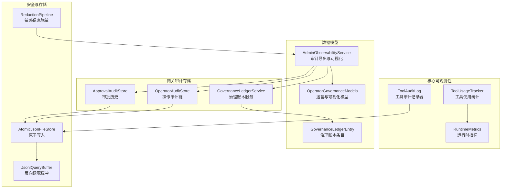
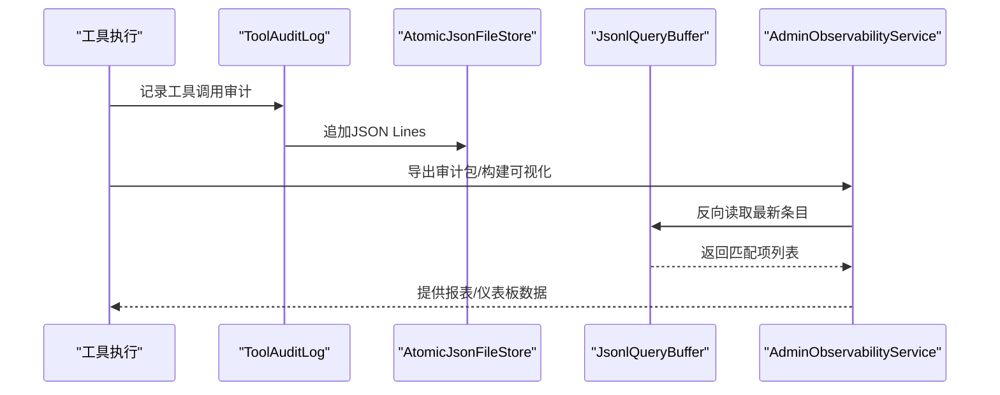
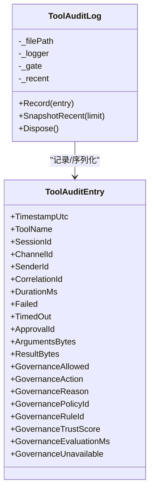
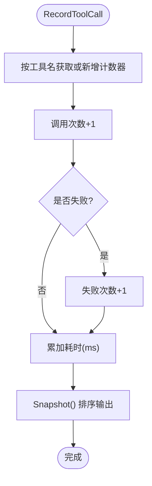
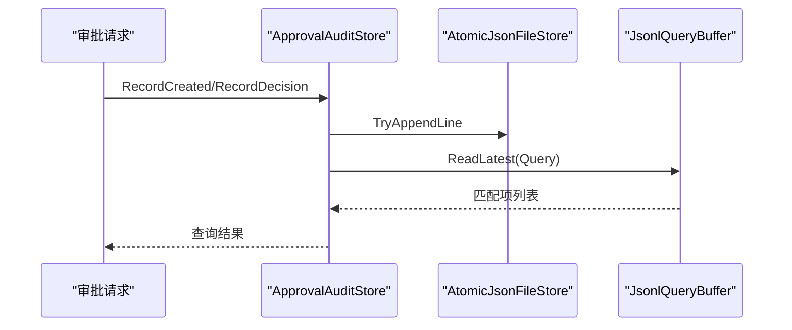
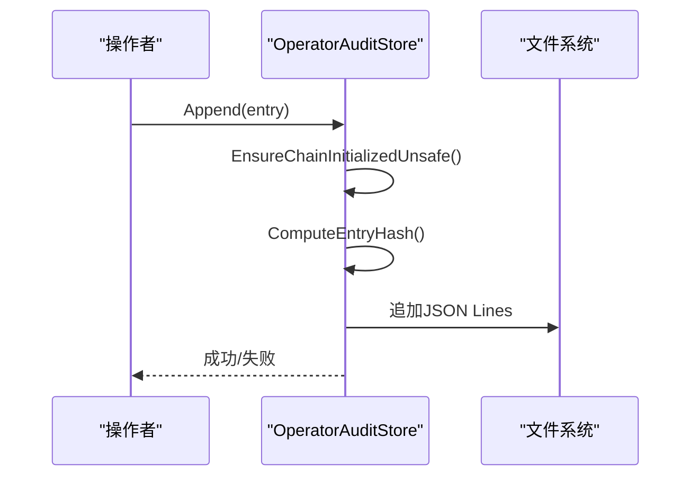
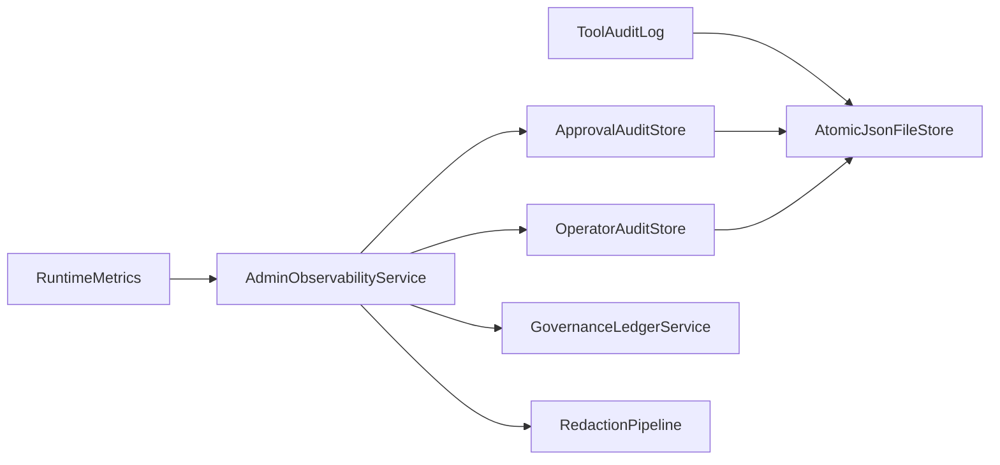

# 工具审计日志

<cite>
**本文引用的文件**
- [ToolAuditLog.cs](file://src/OpenClaw.Core/Observability/ToolAuditLog.cs)
- [ToolUsageTracker.cs](file://src/OpenClaw.Core/Observability/ToolUsageTracker.cs)
- [RuntimeMetrics.cs](file://src/OpenClaw.Core/Observability/RuntimeMetrics.cs)
- [ApprovalAuditStore.cs](file://src/OpenClaw.Gateway/ApprovalAuditStore.cs)
- [OperatorAuditStore.cs](file://src/OpenClaw.Gateway/OperatorAuditStore.cs)
- [GovernanceLedgerService.cs](file://src/OpenClaw.Gateway/GovernanceLedgerService.cs)
- [IGovernanceLedgerStore.cs](file://src/OpenClaw.Core/Abstractions/IGovernanceLedgerStore.cs)
- [GovernanceLedgerModels.cs](file://src/OpenClaw.Core/Models/GovernanceLedgerModels.cs)
- [AdminObservabilityService.cs](file://src/OpenClaw.Gateway/AdminObservabilityService.cs)
- [JsonlQueryBuffer.cs](file://src/OpenClaw.Gateway/JsonlQueryBuffer.cs)
- [AtomicJsonFileStore.cs](file://src/OpenClaw.Gateway/AtomicJsonFileStore.cs)
- [RedactionPipeline.cs](file://src/OpenClaw.Core/Security/RedactionPipeline.cs)
- [PaymentSensitiveDataRedactor.cs](file://src/OpenClaw.Payments.Core/PaymentSensitiveDataRedactor.cs)
- [OperatorGovernanceModels.cs](file://src/OpenClaw.Core/Models/OperatorGovernanceModels.cs)
- [OperatorDashboardModels.cs](file://src/OpenClaw.Core/Models/OperatorDashboardModels.cs)
- [GatewayAdminEndpointTests.cs](file://src/OpenClaw.Tests/GatewayAdminEndpointTests.cs)
</cite>

## 目录
1. [简介](#简介)
2. [项目结构](#项目结构)
3. [核心组件](#核心组件)
4. [架构总览](#架构总览)
5. [详细组件分析](#详细组件分析)
6. [依赖关系分析](#依赖关系分析)
7. [性能考量](#性能考量)
8. [故障排查指南](#故障排查指南)
9. [结论](#结论)
10. [附录](#附录)

## 简介
本技术文档面向“工具审计日志系统”，系统性阐述其架构设计、数据模型与实现机制，覆盖工具调用审计、使用统计、治理决策记录与性能监控，并解释审计数据的采集、存储、查询与分析能力。文档同时提供审计配置要点、合规与隐私保护策略、日志格式说明、查询示例以及与监控仪表板的集成方式。

## 项目结构
审计日志体系由核心可观测性模块（工具审计、使用统计、运行指标）与网关侧审计存储（审批审计、操作审计、治理账本导出）构成，配合安全脱敏流水线与JSON Lines文件存储，形成端到端的审计闭环。

图示来源
- [ToolAuditLog.cs:1-125](file://src/OpenClaw.Core/Observability/ToolAuditLog.cs#L1-L125)
- [ToolUsageTracker.cs:1-59](file://src/OpenClaw.Core/Observability/ToolUsageTracker.cs#L1-L59)
- [RuntimeMetrics.cs:1-312](file://src/OpenClaw.Core/Observability/RuntimeMetrics.cs#L1-L312)
- [ApprovalAuditStore.cs:1-126](file://src/OpenClaw.Gateway/ApprovalAuditStore.cs#L1-L126)
- [OperatorAuditStore.cs:1-195](file://src/OpenClaw.Gateway/OperatorAuditStore.cs#L1-L195)
- [GovernanceLedgerService.cs:109-143](file://src/OpenClaw.Gateway/GovernanceLedgerService.cs#L109-L143)
- [GovernanceLedgerModels.cs:54-146](file://src/OpenClaw.Core/Models/GovernanceLedgerModels.cs#L54-L146)
- [AdminObservabilityService.cs:26-229](file://src/OpenClaw.Gateway/AdminObservabilityService.cs#L26-L229)
- [JsonlQueryBuffer.cs:1-50](file://src/OpenClaw.Gateway/JsonlQueryBuffer.cs#L1-L50)
- [AtomicJsonFileStore.cs:1-50](file://src/OpenClaw.Gateway/AtomicJsonFileStore.cs#L1-L50)
- [RedactionPipeline.cs:1-111](file://src/OpenClaw.Core/Security/RedactionPipeline.cs#L1-L111)

章节来源
- [ToolAuditLog.cs:1-125](file://src/OpenClaw.Core/Observability/ToolAuditLog.cs#L1-L125)
- [ToolUsageTracker.cs:1-59](file://src/OpenClaw.Core/Observability/ToolUsageTracker.cs#L1-L59)
- [RuntimeMetrics.cs:1-312](file://src/OpenClaw.Core/Observability/RuntimeMetrics.cs#L1-L312)
- [ApprovalAuditStore.cs:1-126](file://src/OpenClaw.Gateway/ApprovalAuditStore.cs#L1-L126)
- [OperatorAuditStore.cs:1-195](file://src/OpenClaw.Gateway/OperatorAuditStore.cs#L1-L195)
- [GovernanceLedgerService.cs:109-143](file://src/OpenClaw.Gateway/GovernanceLedgerService.cs#L109-L143)
- [GovernanceLedgerModels.cs:54-146](file://src/OpenClaw.Core/Models/GovernanceLedgerModels.cs#L54-L146)
- [AdminObservabilityService.cs:26-229](file://src/OpenClaw.Gateway/AdminObservabilityService.cs#L26-L229)
- [JsonlQueryBuffer.cs:1-50](file://src/OpenClaw.Gateway/JsonlQueryBuffer.cs#L1-L50)
- [AtomicJsonFileStore.cs:1-50](file://src/OpenClaw.Gateway/AtomicJsonFileStore.cs#L1-L50)
- [RedactionPipeline.cs:1-111](file://src/OpenClaw.Core/Security/RedactionPipeline.cs#L1-L111)

## 核心组件
- 工具审计记录器：以JSON Lines格式记录单次工具调用的完整上下文，避免直接落盘原始参数与结果，仅记录字节计数，确保最小化敏感信息暴露风险。
- 工具使用统计器：按工具维度聚合调用次数、失败次数、超时次数与耗时总和，支持快照排序输出，便于生成使用统计报表。
- 运行时指标：轻量级无锁计数器与仪表盘指标，统一暴露健康检查与告警所需的运行状态。
- 审批历史存储：记录工具审批创建与决策事件，支持基于通道、发送者、工具名与时间范围的反向查询。
- 操作审计存储：维护带哈希链的审计序列，保证审计完整性与可追溯性，支持查询与导出。
- 治理账本服务：管理治理决策的生命周期（创建、查询、撤销），并与运行事件、证据包等实体关联。
- 安全脱敏流水线：对文本、会话与分支进行多层脱敏处理，支持支付敏感信息专项脱敏规则。
- 审计导出与可视化：提供审计数据打包导出、保留期控制、仪表板卡片与时间序列指标渲染。

章节来源
- [ToolAuditLog.cs:1-125](file://src/OpenClaw.Core/Observability/ToolAuditLog.cs#L1-L125)
- [ToolUsageTracker.cs:1-59](file://src/OpenClaw.Core/Observability/ToolUsageTracker.cs#L1-L59)
- [RuntimeMetrics.cs:1-312](file://src/OpenClaw.Core/Observability/RuntimeMetrics.cs#L1-L312)
- [ApprovalAuditStore.cs:1-126](file://src/OpenClaw.Gateway/ApprovalAuditStore.cs#L1-L126)
- [OperatorAuditStore.cs:1-195](file://src/OpenClaw.Gateway/OperatorAuditStore.cs#L1-L195)
- [GovernanceLedgerService.cs:109-143](file://src/OpenClaw.Gateway/GovernanceLedgerService.cs#L109-L143)
- [RedactionPipeline.cs:1-111](file://src/OpenClaw.Core/Security/RedactionPipeline.cs#L1-L111)
- [AdminObservabilityService.cs:26-229](file://src/OpenClaw.Gateway/AdminObservabilityService.cs#L26-L229)

## 架构总览
下图展示从工具执行到审计落盘、查询与可视化的端到端流程。

图示来源
- [ToolAuditLog.cs:72-95](file://src/OpenClaw.Core/Observability/ToolAuditLog.cs#L72-L95)
- [AtomicJsonFileStore.cs:34-50](file://src/OpenClaw.Gateway/AtomicJsonFileStore.cs#L34-L50)
- [JsonlQueryBuffer.cs:9-49](file://src/OpenClaw.Gateway/JsonlQueryBuffer.cs#L9-L49)
- [AdminObservabilityService.cs:55-229](file://src/OpenClaw.Gateway/AdminObservabilityService.cs#L55-L229)

## 详细组件分析

### 工具审计记录器（ToolAuditLog）
- 数据模型：记录时间戳、工具名、会话ID、渠道ID、发送者ID、关联ID、耗时、是否失败/超时、治理评估字段、参数与结果字节数等。
- 写入策略：线程安全追加，采用JSON源代码生成上下文；默认不落盘原始参数与结果，仅记录字节计数，降低敏感信息泄露风险。
- 最近快照：维护最近256条记录的环形缓冲，便于快速获取最新审计条目。
- 文件初始化：自动创建目录，异常时记录警告并禁用文件写入。

图示来源
- [ToolAuditLog.cs:10-32](file://src/OpenClaw.Core/Observability/ToolAuditLog.cs#L10-L32)
- [ToolAuditLog.cs:39-114](file://src/OpenClaw.Core/Observability/ToolAuditLog.cs#L39-L114)

章节来源
- [ToolAuditLog.cs:1-125](file://src/OpenClaw.Core/Observability/ToolAuditLog.cs#L1-L125)

### 工具使用统计（ToolUsageTracker）
- 统计维度：按工具名聚合调用次数、失败次数、超时次数与耗时总和。
- 并发模型：使用无锁计数与双精度数值的位模式存储，保证高并发下的准确性与性能。
- 输出：快照按调用量降序排列，便于生成Top N报表。

图示来源
- [ToolUsageTracker.cs:9-40](file://src/OpenClaw.Core/Observability/ToolUsageTracker.cs#L9-L40)

章节来源
- [ToolUsageTracker.cs:1-59](file://src/OpenClaw.Core/Observability/ToolUsageTracker.cs#L1-L59)

### 运行时指标（RuntimeMetrics）
- 指标类型：计数器（单调递增）与仪表盘指标（当前值），涵盖请求、LLM调用、工具调用、会话、进程、沙箱、保留策略、脉冲健康等。
- 暴露方式：通过健康端点提供快照，便于监控与告警系统集成。

章节来源
- [RuntimeMetrics.cs:1-312](file://src/OpenClaw.Core/Observability/RuntimeMetrics.cs#L1-L312)

### 审批历史存储（ApprovalAuditStore）
- 存储格式：JSON Lines，事件类型（创建/决策）、审批ID、会话ID、渠道ID、发送者ID、工具名、参数预览、动作、是否变更、摘要、时间戳、决策来源与决策结果等。
- 查询能力：支持按通道、发送者、工具名与时间范围过滤，限制返回数量，使用反向读取缓冲提升查询效率。
- 原子写入：通过原子写入工具保障并发安全性。

图示来源
- [ApprovalAuditStore.cs:28-101](file://src/OpenClaw.Gateway/ApprovalAuditStore.cs#L28-L101)
- [AtomicJsonFileStore.cs:34-50](file://src/OpenClaw.Gateway/AtomicJsonFileStore.cs#L34-L50)
- [JsonlQueryBuffer.cs:9-49](file://src/OpenClaw.Gateway/JsonlQueryBuffer.cs#L9-L49)

章节来源
- [ApprovalAuditStore.cs:1-126](file://src/OpenClaw.Gateway/ApprovalAuditStore.cs#L1-L126)

### 操作审计存储（OperatorAuditStore）
- 存储格式：JSON Lines，包含操作者角色、认证方式、动作类型、目标ID、摘要、前后状态、成功与否等。
- 链式完整性：维护序列号与前一记录哈希，形成不可篡改的审计链，支持初始化扫描与后续追加。
- 查询能力：支持按操作者、动作类型、目标ID与时间范围过滤。

图示来源
- [OperatorAuditStore.cs:33-93](file://src/OpenClaw.Gateway/OperatorAuditStore.cs#L33-L93)
- [OperatorAuditStore.cs:127-193](file://src/OpenClaw.Gateway/OperatorAuditStore.cs#L127-L193)

章节来源
- [OperatorAuditStore.cs:1-195](file://src/OpenClaw.Gateway/OperatorAuditStore.cs#L1-L195)

### 治理账本服务（GovernanceLedgerService）
- 职责：创建、查询、撤销治理账本条目，记录治理决策来源与状态，支持按多种维度筛选。
- 存储契约：通过接口抽象，便于替换持久化实现。

章节来源
- [GovernanceLedgerService.cs:109-143](file://src/OpenClaw.Gateway/GovernanceLedgerService.cs#L109-L143)
- [IGovernanceLedgerStore.cs:1-11](file://src/OpenClaw.Core/Abstractions/IGovernanceLedgerStore.cs#L1-L11)

### 数据模型与可视化
- 治理账本条目：包含决策、状态、来源、作用域、会话ID、合约ID、证据包ID、学习提案ID、审批ID、操作者、渠道、发送者、到期/撤销信息、策略提示与元数据等。
- 运营可视化：时间序列指标（审批决策、自动化运行、错误与重试、死信、活跃会话、渠道漂移、操作行为）与仪表板卡片模型。

章节来源
- [GovernanceLedgerModels.cs:54-146](file://src/OpenClaw.Core/Models/GovernanceLedgerModels.cs#L54-L146)
- [OperatorGovernanceModels.cs:418-449](file://src/OpenClaw.Core/Models/OperatorGovernanceModels.cs#L418-L449)
- [OperatorGovernanceModels.cs:330-359](file://src/OpenClaw.Core/Models/OperatorGovernanceModels.cs#L330-L359)
- [OperatorDashboardModels.cs:1-116](file://src/OpenClaw.Core/Models/OperatorDashboardModels.cs#L1-L116)

## 依赖关系分析
- 组件耦合：工具审计记录器与JSON Lines存储解耦，通过原子写入与反向读取缓冲实现高效查询；使用源代码生成减少序列化开销。
- 外部依赖：文件系统用于持久化；日志框架用于异常与警告记录；监控系统通过运行时指标进行集成。
- 安全依赖：脱敏流水线在导出前对敏感信息进行多层处理，支付敏感信息有专门正则规则。

图示来源
- [ToolAuditLog.cs:72-95](file://src/OpenClaw.Core/Observability/ToolAuditLog.cs#L72-L95)
- [ApprovalAuditStore.cs:103-113](file://src/OpenClaw.Gateway/ApprovalAuditStore.cs#L103-L113)
- [OperatorAuditStore.cs:33-93](file://src/OpenClaw.Gateway/OperatorAuditStore.cs#L33-L93)
- [AdminObservabilityService.cs:26-229](file://src/OpenClaw.Gateway/AdminObservabilityService.cs#L26-L229)
- [RuntimeMetrics.cs:1-312](file://src/OpenClaw.Core/Observability/RuntimeMetrics.cs#L1-L312)
- [RedactionPipeline.cs:21-94](file://src/OpenClaw.Core/Security/RedactionPipeline.cs#L21-L94)

章节来源
- [ToolAuditLog.cs:1-125](file://src/OpenClaw.Core/Observability/ToolAuditLog.cs#L1-L125)
- [ApprovalAuditStore.cs:1-126](file://src/OpenClaw.Gateway/ApprovalAuditStore.cs#L1-L126)
- [OperatorAuditStore.cs:1-195](file://src/OpenClaw.Gateway/OperatorAuditStore.cs#L1-L195)
- [AdminObservabilityService.cs:26-229](file://src/OpenClaw.Gateway/AdminObservabilityService.cs#L26-L229)
- [RuntimeMetrics.cs:1-312](file://src/OpenClaw.Core/Observability/RuntimeMetrics.cs#L1-L312)
- [RedactionPipeline.cs:1-111](file://src/OpenClaw.Core/Security/RedactionPipeline.cs#L1-L111)

## 性能考量
- 序列化优化：使用源代码生成上下文，避免反射开销，提高JSON Lines写入与读取性能。
- 并发安全：工具审计记录器与使用统计器均采用细粒度锁与无锁计数，降低竞争开销。
- 查询效率：反向读取缓冲（限定返回数量）与逐行解析结合，适合大体量JSON Lines文件的尾部查询场景。
- 指标暴露：运行时指标采用无锁计数与易分配的快照结构，便于高频健康检查与监控集成。

## 故障排查指南
- 文件写入失败：当审计文件路径无法创建或写入失败时，系统会记录警告并禁用文件写入，确保不影响主流程。建议检查磁盘空间、权限与路径配置。
- 解析异常：反向读取缓冲在解析失败时会记录警告并跳过异常行，不影响其他有效条目的返回。
- 导出异常：审计导出包含保留期校验与文件清单校验，若超出保留期会进行裁剪并产生相应警告。
- 脱敏问题：如发现敏感信息未被正确脱敏，检查脱敏流水线配置与支付敏感信息专项规则是否启用。

章节来源
- [ToolAuditLog.cs:51-95](file://src/OpenClaw.Core/Observability/ToolAuditLog.cs#L51-L95)
- [JsonlQueryBuffer.cs:41-45](file://src/OpenClaw.Gateway/JsonlQueryBuffer.cs#L41-L45)
- [AdminObservabilityService.cs:229-283](file://src/OpenClaw.Gateway/AdminObservabilityService.cs#L229-L283)
- [RedactionPipeline.cs:21-94](file://src/OpenClaw.Core/Security/RedactionPipeline.cs#L21-L94)

## 结论
该审计日志系统通过“最小化敏感信息落盘”的设计原则、高效的JSON Lines存储与查询机制、完善的治理账本与运营可视化能力，实现了对工具调用、使用统计、治理决策与运行性能的全链路可观测。配合安全脱敏与导出保留策略，满足合规与隐私保护要求，并可通过运行时指标与仪表板实现持续监控与告警。

## 附录

### 日志格式与字段说明
- 工具审计条目（JSON Lines）
  - 字段：时间戳、工具名、会话ID、渠道ID、发送者ID、关联ID、耗时、失败标志、超时标志、审批ID、参数字节数、结果字节数、治理评估字段等。
  - 示例路径：[ToolAuditEntry:10-32](file://src/OpenClaw.Core/Observability/ToolAuditLog.cs#L10-L32)

- 审批历史条目（JSON Lines）
  - 字段：事件类型、审批ID、会话ID、渠道ID、发送者ID、工具名、参数预览、动作、是否变更、摘要、时间戳、决策时间、决策来源、决策结果等。
  - 示例路径：[ApprovalHistoryEntry:64-84](file://src/OpenClaw.Core/Models/AdminApiModels.cs#L64-L84)

- 操作审计条目（JSON Lines）
  - 字段：序列号、时间戳、操作者ID/角色/显示名、认证方式、动作类型、目标ID、摘要、前后状态、成功与否、哈希链等。
  - 示例路径：[OperatorAuditStore:33-93](file://src/OpenClaw.Gateway/OperatorAuditStore.cs#L33-L93)

- 治理账本条目（JSON Lines）
  - 字段：ID、创建/更新时间、决策、状态、来源、动作类型、工具名、摘要、参数摘要、风险等级、作用域、会话ID、合约ID、证据包ID、学习提案ID、审批ID、操作者、渠道、发送者、到期/撤销信息、策略提示与元数据等。
  - 示例路径：[GovernanceLedgerEntry:54-87](file://src/OpenClaw.Core/Models/GovernanceLedgerModels.cs#L54-L87)

### 查询示例
- 审批历史查询（按通道、发送者、工具名与时间范围）
  - 示例路径：[ApprovalAuditStore.Query:73-101](file://src/OpenClaw.Gateway/ApprovalAuditStore.cs#L73-L101)
- 操作审计查询（按操作者、动作类型、目标ID与时间范围）
  - 示例路径：[OperatorAuditStore.Query:97-125](file://src/OpenClaw.Gateway/OperatorAuditStore.cs#L97-L125)
- 运行时指标快照（健康端点）
  - 示例路径：[RuntimeMetrics.Snapshot:192-250](file://src/OpenClaw.Core/Observability/RuntimeMetrics.cs#L192-L250)

### 监控仪表板集成
- 时间序列指标：审批决策、自动化运行/失败、提供方错误/重试、运行时告警、死信、活跃会话、渠道漂移、操作行为等。
  - 示例路径：[ObservabilitySeriesResponse:426-433](file://src/OpenClaw.Core/Models/OperatorGovernanceModels.cs#L426-L433)
- 仪表板卡片：包含各类指标卡与命名指标集合，便于前端渲染。
  - 示例路径：[ObservabilitySummaryResponse:352-359](file://src/OpenClaw.Core/Models/OperatorGovernanceModels.cs#L352-L359)

### 审计配置与合规
- 配置要点
  - 审计文件路径：工具审计与审批/操作审计均支持配置文件路径，系统会在初始化时尝试创建目录。
    - 示例路径：[ToolAuditLog 初始化:47-70](file://src/OpenClaw.Core/Observability/ToolAuditLog.cs#L47-L70)
    - 示例路径：[ApprovalAuditStore 路径:17-24](file://src/OpenClaw.Gateway/ApprovalAuditStore.cs#L17-L24)
    - 示例路径：[OperatorAuditStore 路径:23-31](file://src/OpenClaw.Gateway/OperatorAuditStore.cs#L23-L31)
  - 导出保留期：审计导出包含保留天数与警告信息，超出保留期将进行裁剪。
    - 示例路径：[导出清单与保留期:274-282](file://src/OpenClaw.Gateway/AdminObservabilityService.cs#L274-L282)
- 合规与隐私
  - 最小化数据：工具审计默认不记录原始参数与结果，仅记录字节计数；审批历史记录参数预览并截断。
    - 示例路径：[ApprovalAuditStore 参数预览截断:115-124](file://src/OpenClaw.Gateway/ApprovalAuditStore.cs#L115-L124)
  - 脱敏处理：提供通用敏感信息脱敏与支付敏感信息专项脱敏规则，支持对会话与分支进行脱敏。
    - 示例路径：[RedactionPipeline:21-94](file://src/OpenClaw.Core/Security/RedactionPipeline.cs#L21-L94)
    - 示例路径：[PaymentSensitiveDataRedactor:25-63](file://src/OpenClaw.Payments.Core/PaymentSensitiveDataRedactor.cs#L25-L63)

### 测试参考
- 审计导出与保留期测试
  - 示例路径：[GatewayAdminEndpointTests 导出与保留期:1221-1303](file://src/OpenClaw.Tests/GatewayAdminEndpointTests.cs#L1221-L1303)
- 审批历史与治理账本联动测试
  - 示例路径：[GatewayAdminEndpointTests 审批与账本:4983-5001](file://src/OpenClaw.Tests/GatewayAdminEndpointTests.cs#L4983-L5001)