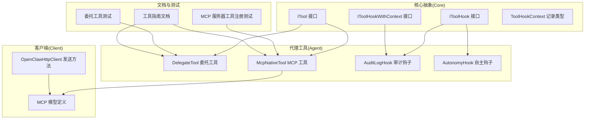
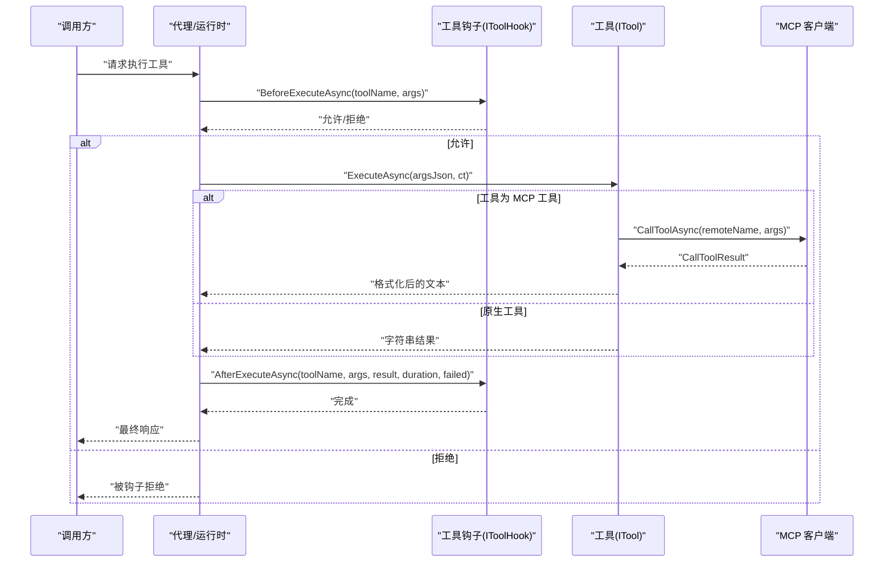
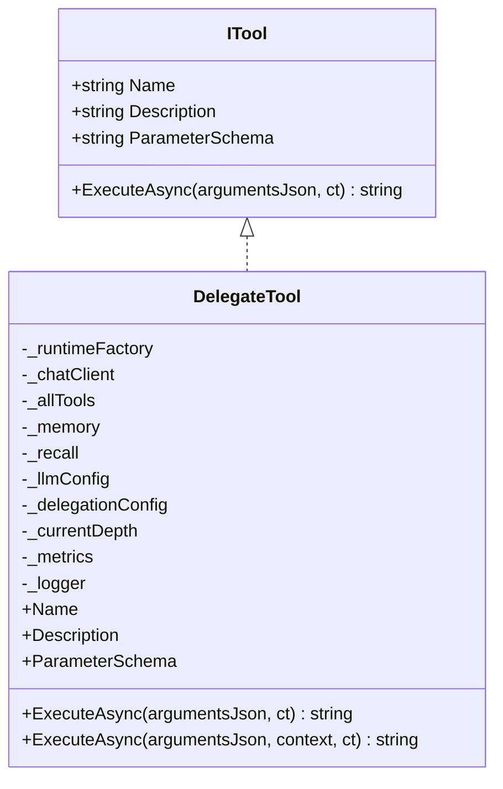
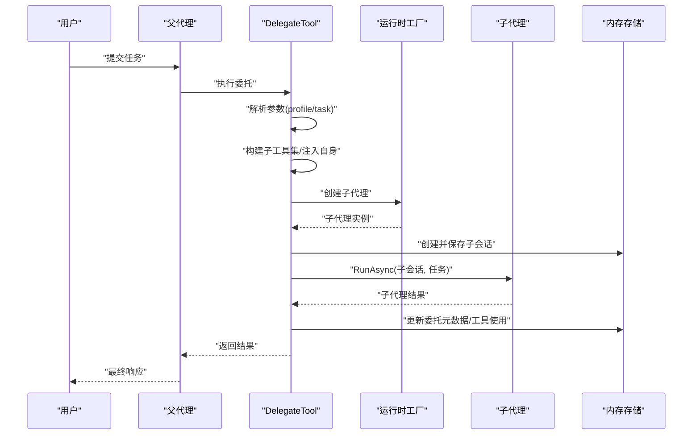
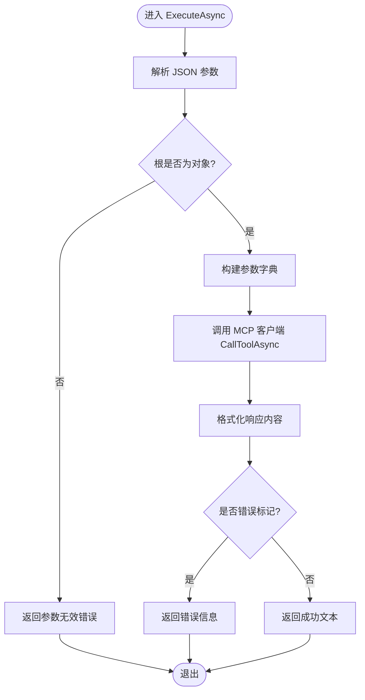
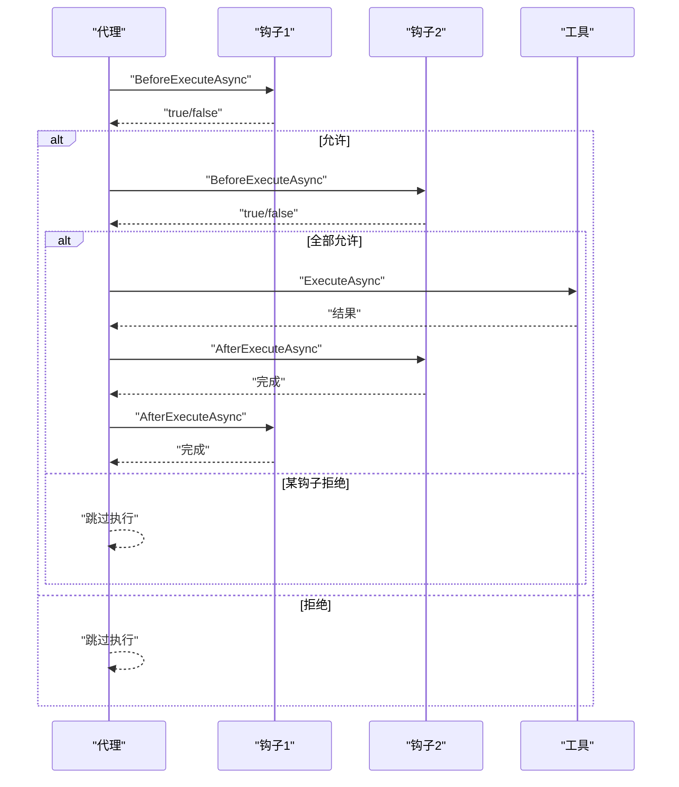
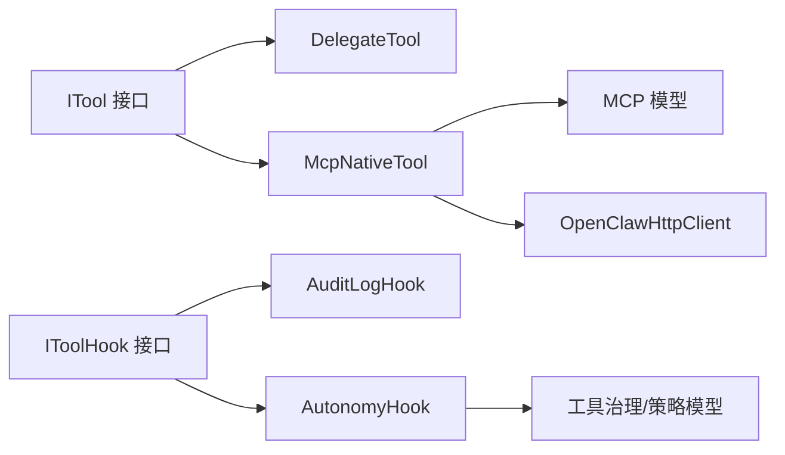

# 工具开发指南

<cite>
**本文引用的文件**
- [ITool 接口](file://src/OpenClaw.Core/Abstractions/ITool.cs)
- [IToolHook 接口](file://src/OpenClaw.Core/Abstractions/IToolHook.cs)
- [IToolHookWithContext 接口](file://src/OpenClaw.Core/Abstractions/IToolHookWithContext.cs)
- [ToolHookContext 记录类型](file://src/OpenClaw.Core/Abstractions/ToolHookContext.cs)
- [DelegateTool 委托工具](file://src/OpenClaw.Agent/Tools/DelegateTool.cs)
- [McpNativeTool MCP 工具](file://src/OpenClaw.Agent/Tools/McpNativeTool.cs)
- [AuditLogHook 审计钩子](file://src/OpenClaw.Agent/AuditLogHook.cs)
- [AutonomyHook 自主钩子](file://src/OpenClaw.Agent/AutonomyHook.cs)
- [工具指南（文档）](file://docs/TOOLS_GUIDE.md)
- [MCP 模型定义](file://src/OpenClaw.Client/McpModels.cs)
- [MCP 客户端发送方法](file://src/OpenClaw.Client/OpenClawHttpClient.cs)
- [委托工具测试](file://src/OpenClaw.Tests/DelegateToolTests.cs)
- [MCP 服务器工具注册测试](file://src/OpenClaw.Tests/McpServerToolRegistryTests.cs)
- [工具治理描述符目录](file://src/OpenClaw.Core/Governance/ToolGovernanceDescriptorCatalog.cs)
- [工具预设与策略模型](file://src/OpenClaw.Core/Models/ToolingPolicyModels.cs)
</cite>

## 目录
1. [简介](#简介)
2. [项目结构](#项目结构)
3. [核心组件](#核心组件)
4. [架构总览](#架构总览)
5. [详细组件分析](#详细组件分析)
6. [依赖关系分析](#依赖关系分析)
7. [性能考虑](#性能考虑)
8. [故障排查指南](#故障排查指南)
9. [结论](#结论)
10. [附录](#附录)

## 简介
本指南面向在 OpenClaw.NET 中开发自定义工具的工程师，系统阐述以下主题：
- ITool 接口的实现要求、参数处理与返回值规范
- DelegateTool 的委托模式、动态工具注册与运行时绑定
- McpNativeTool 的 MCP 协议集成、工具声明生成与消息处理
- IToolHook 钩子机制、生命周期事件与扩展点利用
- 工具开发模板、测试策略与调试技巧
- 性能优化、错误处理与日志记录规范
- 工具打包、分发与版本管理流程

## 项目结构
OpenClaw.NET 将“工具抽象”置于 Core 层，具体实现分布在 Agent 与 Gateway 等运行时模块；客户端通过 OpenClaw.Client 提供 MCP 协议交互能力；测试用例覆盖关键行为与边界条件。

**图表来源**
- [ITool 接口:6-16](file://src/OpenClaw.Core/Abstractions/ITool.cs#L6-L16)
- [IToolHook 接口:8-22](file://src/OpenClaw.Core/Abstractions/IToolHook.cs#L8-L22)
- [IToolHookWithContext 接口:7-12](file://src/OpenClaw.Core/Abstractions/IToolHookWithContext.cs#L7-L12)
- [ToolHookContext 记录类型:6-17](file://src/OpenClaw.Core/Abstractions/ToolHookContext.cs#L6-L17)
- [DelegateTool 委托工具:16-297](file://src/OpenClaw.Agent/Tools/DelegateTool.cs#L16-L297)
- [McpNativeTool MCP 工具:9-118](file://src/OpenClaw.Agent/Tools/McpNativeTool.cs#L9-L118)
- [AuditLogHook 审计钩子:10-62](file://src/OpenClaw.Agent/AuditLogHook.cs#L10-L62)
- [AutonomyHook 自主钩子:14-237](file://src/OpenClaw.Agent/AutonomyHook.cs#L14-L237)
- [MCP 模型定义:45-97](file://src/OpenClaw.Client/McpModels.cs#L45-L97)
- [MCP 客户端发送方法:262-280](file://src/OpenClaw.Client/OpenClawHttpClient.cs#L262-L280)
- [工具指南（文档）:1-405](file://docs/TOOLS_GUIDE.md#L1-L405)
- [委托工具测试:1-277](file://src/OpenClaw.Tests/DelegateToolTests.cs#L1-L277)
- [MCP 服务器工具注册测试:25-41](file://src/OpenClaw.Tests/McpServerToolRegistryTests.cs#L25-L41)

**章节来源**
- [ITool 接口:1-17](file://src/OpenClaw.Core/Abstractions/ITool.cs#L1-L17)
- [DelegateTool 委托工具:1-298](file://src/OpenClaw.Agent/Tools/DelegateTool.cs#L1-L298)
- [McpNativeTool MCP 工具:1-118](file://src/OpenClaw.Agent/Tools/McpNativeTool.cs#L1-L118)
- [AuditLogHook 审计钩子:1-63](file://src/OpenClaw.Agent/AuditLogHook.cs#L1-L63)
- [AutonomyHook 自主钩子:1-238](file://src/OpenClaw.Agent/AutonomyHook.cs#L1-L238)
- [MCP 模型定义:45-97](file://src/OpenClaw.Client/McpModels.cs#L45-L97)
- [MCP 客户端发送方法:262-280](file://src/OpenClaw.Client/OpenClawHttpClient.cs#L262-L280)
- [工具指南（文档）:1-405](file://docs/TOOLS_GUIDE.md#L1-L405)
- [委托工具测试:1-277](file://src/OpenClaw.Tests/DelegateToolTests.cs#L1-L277)
- [MCP 服务器工具注册测试:25-41](file://src/OpenClaw.Tests/McpServerToolRegistryTests.cs#L25-L41)

## 核心组件
- ITool：最小化工具接口，仅包含名称、描述、参数 Schema 与异步执行方法，便于 AOT 剪枝与跨运行时兼容。
- IToolHook / IToolHookWithContext：钩子扩展点，支持 Before/After 生命周期事件，可访问会话上下文。
- DelegateTool：多智能体委托工具，按配置生成子代理，持久化会话并汇总工具使用情况。
- McpNativeTool：封装 MCP 客户端调用，负责参数解析、结果格式化与错误处理。
- 审计与自主钩子：内置钩子示例，演示审计日志与路径/命令/工作区策略的强制执行。

**章节来源**
- [ITool 接口:6-16](file://src/OpenClaw.Core/Abstractions/ITool.cs#L6-L16)
- [IToolHook 接口:8-22](file://src/OpenClaw.Core/Abstractions/IToolHook.cs#L8-L22)
- [IToolHookWithContext 接口:7-12](file://src/OpenClaw.Core/Abstractions/IToolHookWithContext.cs#L7-L12)
- [ToolHookContext 记录类型:6-17](file://src/OpenClaw.Core/Abstractions/ToolHookContext.cs#L6-L17)
- [DelegateTool 委托工具:16-297](file://src/OpenClaw.Agent/Tools/DelegateTool.cs#L16-L297)
- [McpNativeTool MCP 工具:9-118](file://src/OpenClaw.Agent/Tools/McpNativeTool.cs#L9-L118)
- [AuditLogHook 审计钩子:10-62](file://src/OpenClaw.Agent/AuditLogHook.cs#L10-L62)
- [AutonomyHook 自主钩子:14-237](file://src/OpenClaw.Agent/AutonomyHook.cs#L14-L237)

## 架构总览
下图展示工具从被调用到执行完成的典型流程，包括钩子拦截、参数校验、执行与结果回传。

**图表来源**
- [ITool 接口:6-16](file://src/OpenClaw.Core/Abstractions/ITool.cs#L6-L16)
- [IToolHook 接口:8-22](file://src/OpenClaw.Core/Abstractions/IToolHook.cs#L8-L22)
- [McpNativeTool MCP 工具:20-70](file://src/OpenClaw.Agent/Tools/McpNativeTool.cs#L20-L70)
- [AuditLogHook 审计钩子:17-32](file://src/OpenClaw.Agent/AuditLogHook.cs#L17-L32)
- [AutonomyHook 自主钩子:28-82](file://src/OpenClaw.Agent/AutonomyHook.cs#L28-L82)

## 详细组件分析

### ITool 接口与实现规范
- 名称与描述：用于工具清单与用户提示。
- 参数 Schema：遵循 JSON Schema，描述参数类型、必填项与约束。
- 执行方法：接收 JSON 字符串参数，返回字符串结果；建议在失败时返回带前缀的错误信息，便于上层识别。

最佳实践
- 参数 Schema 必须严格且最小化，避免过度宽松导致误用。
- 返回值应统一格式，便于下游处理与日志记录。
- 对于可能失败的操作，优先抛出异常或返回明确错误字符串，避免静默失败。

**章节来源**
- [ITool 接口:6-16](file://src/OpenClaw.Core/Abstractions/ITool.cs#L6-L16)

### DelegateTool 委托模式与动态注册
DelegateTool 实现了“多智能体委托”能力，其关键特性：
- 动态子代理：根据配置选择允许工具集，并在允许深度内递归注入自身以支持多级委托。
- 会话持久化：为子代理创建独立会话，记录委托元数据、工具使用与变更摘要。
- 上下文感知：支持 ToolExecutionContext，将父会话与子会话关联，便于审计与追踪。
- 运行时绑定：通过工厂函数注入工具集合、LLM 配置与代理配置，实现灵活的运行时装配。

**图表来源**
- [ITool 接口:6-16](file://src/OpenClaw.Core/Abstractions/ITool.cs#L6-L16)
- [DelegateTool 委托工具:16-78](file://src/OpenClaw.Agent/Tools/DelegateTool.cs#L16-L78)

**图表来源**
- [DelegateTool 委托工具:86-191](file://src/OpenClaw.Agent/Tools/DelegateTool.cs#L86-L191)
- [委托工具测试:18-83](file://src/OpenClaw.Tests/DelegateToolTests.cs#L18-L83)

实现要点
- 参数校验：必须提供 profile 与 task；未知 profile 返回错误；超过最大深度拒绝委托。
- 工具子集：若配置中指定允许工具，则仅包含这些工具；否则排除自身以避免循环。
- 会话元数据：记录父会话、通道、发送者、允许工具列表、深度、开始时间与状态等。
- 工具使用统计：基于工具调用历史聚合工具使用次数与变更意图。

**章节来源**
- [DelegateTool 委托工具:86-191](file://src/OpenClaw.Agent/Tools/DelegateTool.cs#L86-L191)
- [委托工具测试:86-179](file://src/OpenClaw.Tests/DelegateToolTests.cs#L86-L179)

### McpNativeTool MCP 协议集成
McpNativeTool 将外部 MCP 服务的工具调用桥接为 ITool：
- 参数解析：将 JSON 参数解析为字典，确保根对象为对象类型。
- 结果格式化：合并文本内容块与结构化内容，支持多种内容类型。
- 错误处理：捕获 JSON 解析异常、取消与通用异常，返回标准化错误信息。

**图表来源**
- [McpNativeTool MCP 工具:20-70](file://src/OpenClaw.Agent/Tools/McpNativeTool.cs#L20-L70)
- [MCP 模型定义:78-97](file://src/OpenClaw.Client/McpModels.cs#L78-L97)
- [MCP 客户端发送方法:262-280](file://src/OpenClaw.Client/OpenClawHttpClient.cs#L262-L280)

实现要点
- 参数 Schema：由上游 MCP 服务器提供，McpNativeTool 仅透传与格式化。
- 取消令牌：尊重传入的取消信号，及时中断并抛出取消异常。
- 内容格式化：优先提取文本块，其次提取嵌入资源中的文本，最后序列化为 JSON 文本。

**章节来源**
- [McpNativeTool MCP 工具:20-100](file://src/OpenClaw.Agent/Tools/McpNativeTool.cs#L20-L100)
- [MCP 模型定义:78-97](file://src/OpenClaw.Client/McpModels.cs#L78-L97)
- [MCP 客户端发送方法:262-280](file://src/OpenClaw.Client/OpenClawHttpClient.cs#L262-L280)

### IToolHook 钩子机制与生命周期
钩子提供“执行前后”的扩展点，支持：
- BeforeExecuteAsync：返回 false 可拒绝执行；可访问工具名、参数与上下文。
- AfterExecuteAsync：无论成功与否都会回调，包含耗时与失败标志。

**图表来源**
- [IToolHook 接口:8-22](file://src/OpenClaw.Core/Abstractions/IToolHook.cs#L8-L22)
- [IToolHookWithContext 接口:7-12](file://src/OpenClaw.Core/Abstractions/IToolHookWithContext.cs#L7-L12)
- [ToolHookContext 记录类型:6-17](file://src/OpenClaw.Core/Abstractions/ToolHookContext.cs#L6-L17)

内置钩子示例
- 审计钩子：记录每次工具调用的会话、通道、发送者与耗时，失败时输出警告。
- 自主钩子：基于自治模式、工作区限制、路径禁止规则与 Shell 命令白名单进行硬性拒绝。

**章节来源**
- [AuditLogHook 审计钩子:10-62](file://src/OpenClaw.Agent/AuditLogHook.cs#L10-L62)
- [AutonomyHook 自主钩子:14-237](file://src/OpenClaw.Agent/AutonomyHook.cs#L14-L237)

## 依赖关系分析
- ITool 是所有工具的契约，DelegateTool 与 McpNativeTool 均实现该接口。
- 钩子通过 IToolHook/IToolHookWithContext 注入执行管线，影响工具是否执行及后续日志。
- MCP 工具依赖 OpenClaw.Client 的 MCP 模型与 HTTP 客户端方法进行远程调用。
- 工具治理与策略模型为工具启用/禁用、审批与风险等级提供支撑。

**图表来源**
- [ITool 接口:6-16](file://src/OpenClaw.Core/Abstractions/ITool.cs#L6-L16)
- [DelegateTool 委托工具:16-297](file://src/OpenClaw.Agent/Tools/DelegateTool.cs#L16-L297)
- [McpNativeTool MCP 工具:9-118](file://src/OpenClaw.Agent/Tools/McpNativeTool.cs#L9-L118)
- [AuditLogHook 审计钩子:10-62](file://src/OpenClaw.Agent/AuditLogHook.cs#L10-L62)
- [AutonomyHook 自主钩子:14-237](file://src/OpenClaw.Agent/AutonomyHook.cs#L14-L237)
- [MCP 模型定义:45-97](file://src/OpenClaw.Client/McpModels.cs#L45-L97)
- [MCP 客户端发送方法:262-280](file://src/OpenClaw.Client/OpenClawHttpClient.cs#L262-L280)
- [工具治理描述符目录:1-34](file://src/OpenClaw.Core/Governance/ToolGovernanceDescriptorCatalog.cs#L1-L34)
- [工具预设与策略模型:1-44](file://src/OpenClaw.Core/Models/ToolingPolicyModels.cs#L1-L44)

**章节来源**
- [工具治理描述符目录:1-34](file://src/OpenClaw.Core/Governance/ToolGovernanceDescriptorCatalog.cs#L1-L34)
- [工具预设与策略模型:1-44](file://src/OpenClaw.Core/Models/ToolingPolicyModels.cs#L1-L44)

## 性能考虑
- 参数解析与 JSON 序列化：尽量复用解析器与序列化上下文，减少分配。
- MCP 调用：合理设置超时与重试，避免阻塞主线程；对大响应进行流式处理或分段读取。
- 钩子链：钩子数量与复杂度直接影响延迟，建议将重逻辑移至异步后台任务。
- AOT 兼容：保持接口最小化与无反射依赖，避免剪枝后不可用。

[本节为通用指导，无需特定文件引用]

## 故障排查指南
常见问题与定位思路
- 参数无效：检查参数 Schema 是否匹配，确认 JSON 根为对象。
- MCP 调用失败：查看网络连通性、认证与超时设置；关注异常堆栈与错误字符串。
- 钩子拒绝：检查审计日志与自主钩子策略，确认是否命中禁止规则或超出深度。
- 会话未保存：确认内存存储可用性与权限，检查保存流程是否被异常中断。

调试技巧
- 使用审计钩子输出每次调用的上下文与耗时。
- 在本地启用更严格的策略（如只读模式）以快速暴露问题。
- 对 MCP 工具增加超时与重试策略，避免长时间阻塞。

**章节来源**
- [AuditLogHook 审计钩子:17-61](file://src/OpenClaw.Agent/AuditLogHook.cs#L17-L61)
- [AutonomyHook 自主钩子:28-82](file://src/OpenClaw.Agent/AutonomyHook.cs#L28-L82)
- [McpNativeTool MCP 工具:58-70](file://src/OpenClaw.Agent/Tools/McpNativeTool.cs#L58-L70)

## 结论
通过 ITool 统一抽象、DelegateTool 的委托模式、McpNativeTool 的 MCP 集成与 IToolHook 的扩展机制，OpenClaw.NET 为工具开发提供了清晰、可扩展且安全的框架。遵循本文的实现规范、测试策略与运维建议，可高效构建高性能、可观测且易维护的工具体系。

[本节为总结，无需特定文件引用]

## 附录

### 工具开发模板（步骤）
- 定义参数 Schema：参考现有工具的 Schema 设计，确保字段最小化与语义明确。
- 实现 ITool：提供 Name、Description、ParameterSchema 与 ExecuteAsync。
- 参数解析：在 ExecuteAsync 中解析 JSON 并校验必需字段。
- 执行与返回：执行业务逻辑，返回字符串结果；失败时返回带前缀的错误信息。
- 注册与测试：在运行时注册工具，编写单元测试覆盖正常与异常分支。

**章节来源**
- [ITool 接口:6-16](file://src/OpenClaw.Core/Abstractions/ITool.cs#L6-L16)
- [工具指南（文档）:1-405](file://docs/TOOLS_GUIDE.md#L1-L405)

### 测试策略
- 单元测试：验证参数解析、边界条件与错误路径。
- 集成测试：模拟委托工具的子代理运行、会话持久化与工具使用统计。
- MCP 测试：通过本地 MCP 服务器验证工具发现与调用流程。

**章节来源**
- [委托工具测试:18-83](file://src/OpenClaw.Tests/DelegateToolTests.cs#L18-L83)
- [MCP 服务器工具注册测试:25-41](file://src/OpenClaw.Tests/McpServerToolRegistryTests.cs#L25-L41)

### 日志记录规范
- 使用结构化日志记录工具名、会话 ID、通道、发送者与耗时。
- 失败场景输出警告级别日志，包含错误摘要与上下文。
- 审计钩子作为默认实现，确保所有工具调用均可被追踪。

**章节来源**
- [AuditLogHook 审计钩子:20-61](file://src/OpenClaw.Agent/AuditLogHook.cs#L20-L61)

### 工具治理与策略
- 工具预设与策略：通过 ToolingPolicyModels 定义允许/禁止工具集与审批需求。
- 工具治理描述符：根据工具动作描述推导审批与风险等级。

**章节来源**
- [工具预设与策略模型:1-44](file://src/OpenClaw.Core/Models/ToolingPolicyModels.cs#L1-L44)
- [工具治理描述符目录:1-34](file://src/OpenClaw.Core/Governance/ToolGovernanceDescriptorCatalog.cs#L1-L34)

### MCP 协议与消息处理
- 初始化与工具列表：通过 OpenClawHttpClient 的初始化与工具列表方法与 MCP 服务器交互。
- 工具调用：McpNativeTool 使用 CallToolAsync 发起调用并格式化响应。

**章节来源**
- [MCP 客户端发送方法:262-280](file://src/OpenClaw.Client/OpenClawHttpClient.cs#L262-L280)
- [MCP 模型定义:45-97](file://src/OpenClaw.Client/McpModels.cs#L45-L97)

### 工具打包、分发与版本管理
- 打包：将工具实现编译为库或插件形式，确保依赖与运行时兼容。
- 分发：通过网关配置启用工具，或在插件桥接场景中放置于扩展目录。
- 版本管理：遵循语义化版本，结合工具治理策略控制升级与回滚。

**章节来源**
- [工具指南（文档）:1-405](file://docs/TOOLS_GUIDE.md#L1-L405)