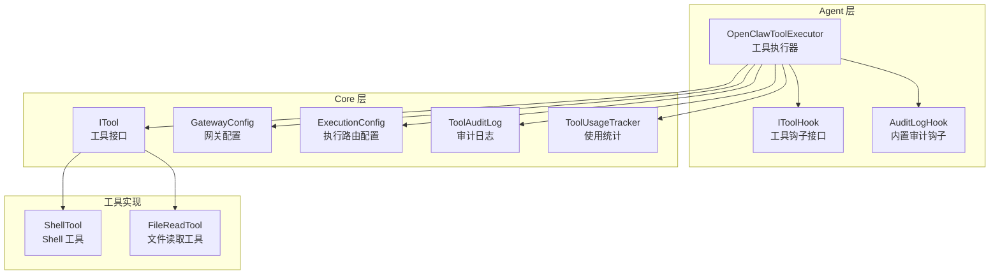
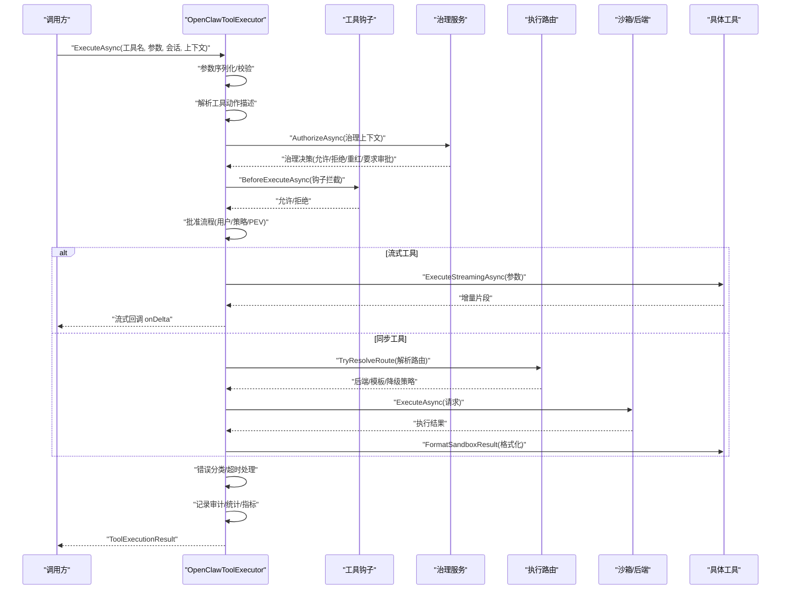
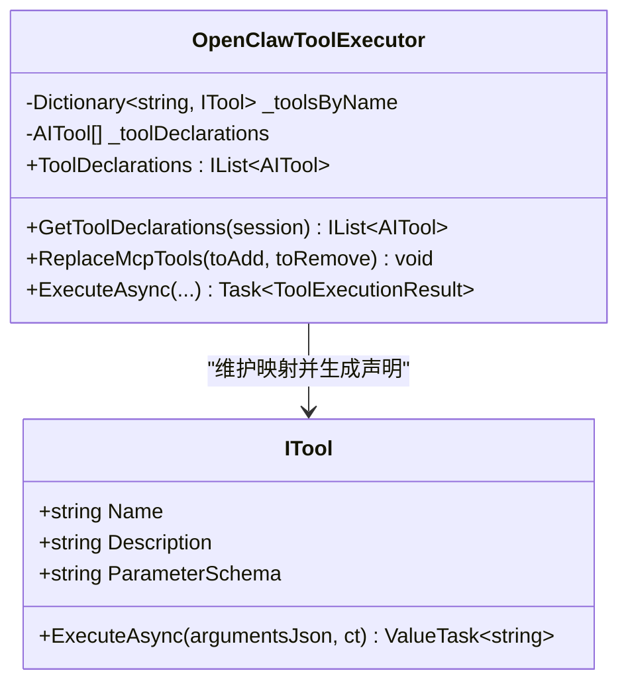
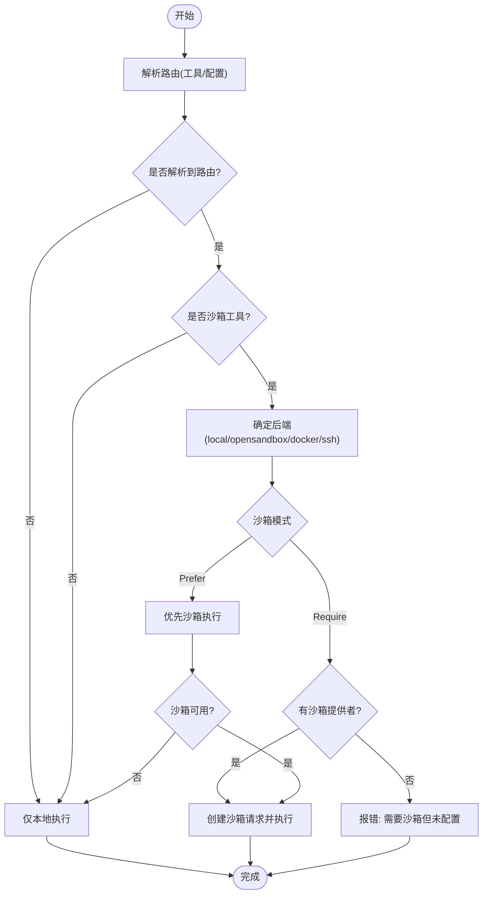
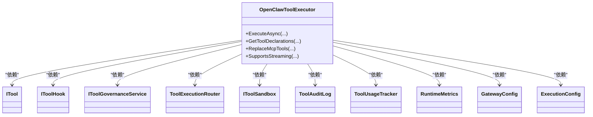

# 工具执行器

<cite>
**本文档引用的文件**
- [OpenClawToolExecutor.cs](file://src/OpenClaw.Agent/OpenClawToolExecutor.cs)
- [ITool.cs](file://src/OpenClaw.Core/Abstractions/ITool.cs)
- [IToolHook.cs](file://src/OpenClaw.Core/Abstractions/IToolHook.cs)
- [AuditLogHook.cs](file://src/OpenClaw.Agent/AuditLogHook.cs)
- [ToolAuditLog.cs](file://src/OpenClaw.Core/Observability/ToolAuditLog.cs)
- [ToolUsageTracker.cs](file://src/OpenClaw.Core/Observability/ToolUsageTracker.cs)
- [GatewayConfig.cs](file://src/OpenClaw.Core/Models/GatewayConfig.cs)
- [ExecutionModels.cs](file://src/OpenClaw.Core/Models/ExecutionModels.cs)
- [ShellTool.cs](file://src/OpenClaw.Agent/Tools/ShellTool.cs)
- [FileReadTool.cs](file://src/OpenClaw.Agent/Tools/FileReadTool.cs)
- [OpenClawToolExecutorTests.cs](file://src/OpenClaw.Tests/OpenClawToolExecutorTests.cs)
- [ToolApprovalCallbackFactory.cs](file://src/OpenClaw.Gateway/ToolApprovalCallbackFactory.cs)
- [ToolGovernanceDescriptorCatalog.cs](file://src/OpenClaw.Core/Governance/ToolGovernanceDescriptorCatalog.cs)
- [ToolGovernanceModels.cs](file://src/OpenClaw.Core/Models/ToolGovernanceModels.cs)
</cite>

## 目录
1. [简介](#简介)
2. [项目结构](#项目结构)
3. [核心组件](#核心组件)
4. [架构总览](#架构总览)
5. [详细组件分析](#详细组件分析)
6. [依赖关系分析](#依赖关系分析)
7. [性能考虑](#性能考虑)
8. [故障排除指南](#故障排除指南)
9. [结论](#结论)
10. [附录](#附录)

## 简介
本文件系统性阐述 OpenClaw 工具执行器（OpenClawToolExecutor）的核心工作机制，覆盖工具注册、发现与调用的完整生命周期；参数验证、权限检查、治理决策、批准流程、执行路由与结果处理；同步与流式工具调用、错误处理与超时机制；以及与工具钩子、审计日志、使用统计等组件的集成方式。同时提供配置选项、性能指标与监控数据说明，并给出使用示例与故障排除建议。

## 项目结构
OpenClaw 工具执行器位于 Agent 层，围绕 ITool 接口构建，通过路由层将工具调用分发到本地或沙箱后端，并在执行前后通过钩子、治理服务与审计日志进行可观测性与合规保障。

**图表来源**
- [OpenClawToolExecutor.cs:30-100](file://src/OpenClaw.Agent/OpenClawToolExecutor.cs#L30-L100)
- [ITool.cs:6-16](file://src/OpenClaw.Core/Abstractions/ITool.cs#L6-L16)
- [GatewayConfig.cs:412-457](file://src/OpenClaw.Core/Models/GatewayConfig.cs#L412-L457)
- [ExecutionModels.cs:8-20](file://src/OpenClaw.Core/Models/ExecutionModels.cs#L8-L20)
- [ShellTool.cs:11-20](file://src/OpenClaw.Agent/Tools/ShellTool.cs#L11-L20)
- [FileReadTool.cs:9-17](file://src/OpenClaw.Agent/Tools/FileReadTool.cs#L9-L17)

**章节来源**
- [OpenClawToolExecutor.cs:30-100](file://src/OpenClaw.Agent/OpenClawToolExecutor.cs#L30-L100)
- [GatewayConfig.cs:412-457](file://src/OpenClaw.Core/Models/GatewayConfig.cs#L412-L457)
- [ExecutionModels.cs:8-20](file://src/OpenClaw.Core/Models/ExecutionModels.cs#L8-L20)

## 核心组件
- 工具接口 ITool：最小化设计，仅包含名称、描述、参数模式与执行方法，便于 AOT 剪枝。
- 工具钩子 IToolHook：在执行前/后拦截，支持拒绝执行与记录行为。
- 执行器 OpenClawToolExecutor：统一编排工具生命周期，负责参数校验、权限与治理决策、批准流程、路由与执行、结果处理与可观测性。
- 路由层 ToolExecutionRouter：根据工具与配置决定执行后端（本地/沙箱/容器/SSH 等）。
- 审计与统计：ToolAuditLog 记录结构化审计条目；ToolUsageTracker 统计工具调用次数、失败与超时、耗时等。
- 配置 GatewayConfig：集中管理工具超时、审批、路由、沙箱、执行后端等配置。

**章节来源**
- [ITool.cs:6-16](file://src/OpenClaw.Core/Abstractions/ITool.cs#L6-L16)
- [IToolHook.cs:8-22](file://src/OpenClaw.Core/Abstractions/IToolHook.cs#L8-L22)
- [OpenClawToolExecutor.cs:30-100](file://src/OpenClaw.Agent/OpenClawToolExecutor.cs#L30-L100)
- [ToolAuditLog.cs:10-32](file://src/OpenClaw.Core/Observability/ToolAuditLog.cs#L10-L32)
- [ToolUsageTracker.cs:51-58](file://src/OpenClaw.Core/Observability/ToolUsageTracker.cs#L51-L58)
- [GatewayConfig.cs:412-457](file://src/OpenClaw.Core/Models/GatewayConfig.cs#L412-L457)

## 架构总览
工具执行器的执行流从接收函数调用开始，贯穿参数解析、会话与预设校验、治理决策、钩子拦截、批准流程、路由与执行、结果归档与可观测性记录，最终返回统一的结果封装。

**图表来源**
- [OpenClawToolExecutor.cs:134-630](file://src/OpenClaw.Agent/OpenClawToolExecutor.cs#L134-L630)
- [ToolApprovalCallbackFactory.cs:42-146](file://src/OpenClaw.Gateway/ToolApprovalCallbackFactory.cs#L42-L146)
- [ToolGovernanceDescriptorCatalog.cs:37-68](file://src/OpenClaw.Core/Governance/ToolGovernanceDescriptorCatalog.cs#L37-L68)

## 详细组件分析

### 工具注册、发现与声明
- 注册：构造函数接收工具集合，建立名称到工具实例的字典映射，并生成 AI 函数声明列表。
- 发现：支持按会话预设动态过滤可用工具；支持热替换 MCP 工具表（原子替换）。
- 声明：基于工具参数模式生成 AIFunctionDeclaration，供 LLM 使用。

**图表来源**
- [OpenClawToolExecutor.cs:30-100](file://src/OpenClaw.Agent/OpenClawToolExecutor.cs#L30-L100)
- [ITool.cs:6-16](file://src/OpenClaw.Core/Abstractions/ITool.cs#L6-L16)

**章节来源**
- [OpenClawToolExecutor.cs:70-132](file://src/OpenClaw.Agent/OpenClawToolExecutor.cs#L70-L132)
- [OpenClawToolExecutor.cs:104-110](file://src/OpenClaw.Agent/OpenClawToolExecutor.cs#L104-L110)

### 参数验证与会话/预设控制
- 参数序列化：将 FunctionCallContent 的 Arguments 序列化为 JSON 字符串。
- 会话与预设：通过 IsToolAllowedForSession 判断工具是否在会话路由白名单或预设允许范围内。
- 动作描述：优先使用工具提供的 IToolActionDescriptorProvider，否则回退到 ToolActionPolicyResolver。

**章节来源**
- [OpenClawToolExecutor.cs:144-196](file://src/OpenClaw.Agent/OpenClawToolExecutor.cs#L144-L196)
- [OpenClawToolExecutor.cs:770-779](file://src/OpenClaw.Agent/OpenClawToolExecutor.cs#L770-L779)
- [OpenClawToolExecutor.cs:781-784](file://src/OpenClaw.Agent/OpenClawToolExecutor.cs#L781-L784)

### 权限检查与治理决策
- 治理上下文：封装 AgentId、SessionId、ChannelId、SenderId、CallId、工具名、参数、动作描述、治理描述、是否流式等。
- 授权：调用 IToolGovernanceService.AuthorizeAsync 获取 GovernanceDecision。
- 红化与替换：若治理返回重红或替换参数，执行参数重写并重新解析动作描述。
- 不可用策略：当治理不可用时，按 fail-open/fail-closed 策略决定阻断或继续。

**章节来源**
- [OpenClawToolExecutor.cs:199-305](file://src/OpenClaw.Agent/OpenClawToolExecutor.cs#L199-L305)
- [ToolGovernanceDescriptorCatalog.cs:37-68](file://src/OpenClaw.Core/Governance/ToolGovernanceDescriptorCatalog.cs#L37-L68)
- [ToolGovernanceModels.cs:142-149](file://src/OpenClaw.Core/Models/ToolGovernanceModels.cs#L142-L149)

### 批准流程与 PEV 决策
- 钩子拦截：遍历 IToolHookWithContext/IToolHook，若任一钩子返回 false，则立即阻断。
- 批准需求判定：综合配置、预设、动作感知策略、治理决策与工具动作描述，计算是否需要批准。
- 用户批准：通过 ToolApprovalCallbackFactory 提供的回调等待批准；未配置回调则自动阻断。
- PEV 决策：调用 IPlanExecuteVerifyOrchestrator.EvaluateToolAsync，阻断非 Proceed/RequireApproval 的决策。

**章节来源**
- [OpenClawToolExecutor.cs:318-433](file://src/OpenClaw.Agent/OpenClawToolExecutor.cs#L318-L433)
- [ToolApprovalCallbackFactory.cs:42-146](file://src/OpenClaw.Gateway/ToolApprovalCallbackFactory.cs#L42-L146)
- [OpenClawToolExecutor.cs:1014-1017](file://src/OpenClaw.Agent/OpenClawToolExecutor.cs#L1014-L1017)

### 执行路由与后端选择
- 路由解析：ToolExecutionRouter.TryResolveRoute 决定后端类型、模板与工作区要求。
- 沙箱能力：ISandboxCapableTool 创建 SandboxExecutionRequest 并格式化结果。
- 后端选择策略：
  - 默认本地执行（local）
  - 沙箱优先（Prefer）：有沙箱提供者则走沙箱，否则回退本地
  - 强制沙箱（Require）：必须沙箱，否则报错
  - 严格禁用本地：浏览器工具等不支持本地时抛出异常
- 工作区与模板：检查 WorkspaceRoot、模板与回退后端配置，缺失时报错。
- 不可用回退：当沙箱/后端不可用且允许回退时，走本地执行。

**图表来源**
- [OpenClawToolExecutor.cs:848-964](file://src/OpenClaw.Agent/OpenClawToolExecutor.cs#L848-L964)
- [ExecutionModels.cs:47-52](file://src/OpenClaw.Core/Models/ExecutionModels.cs#L47-L52)

**章节来源**
- [OpenClawToolExecutor.cs:848-964](file://src/OpenClaw.Agent/OpenClawToolExecutor.cs#L848-L964)
- [ExecutionModels.cs:8-20](file://src/OpenClaw.Core/Models/ExecutionModels.cs#L8-L20)

### 同步与流式工具调用
- 同步调用：ExecuteToolWithTimeoutAsync 包装超时令牌，调用工具 ExecuteAsync。
- 流式调用：ExecuteStreamingToolCollectAsync 收集 IStreamingTool 的增量片段，按最大字符限制截断，对未被红化的片段直接回调 onDelta，否则回调红化后的结果。
- 超时控制：对流式与非流式均支持全局工具超时秒数，超时抛出 OperationCanceledException 并归类为超时失败。

**章节来源**
- [OpenClawToolExecutor.cs:786-831](file://src/OpenClaw.Agent/OpenClawToolExecutor.cs#L786-L831)
- [OpenClawToolExecutor.cs:969-997](file://src/OpenClaw.Agent/OpenClawToolExecutor.cs#L969-L997)
- [OpenClawToolExecutor.cs:478-498](file://src/OpenClaw.Agent/OpenClawToolExecutor.cs#L478-L498)

### 错误处理与超时机制
- 超时：捕获 OperationCanceledException 且非外部取消时，标记为超时失败，增加超时指标。
- 沙箱异常：ToolSandboxException 归类为阻断失败，附带下一步指引。
- 其他异常：分类失败码（如操作员认证、运行时能力不可用），区分阻断与失败状态。
- 结果红化：对结果、失败消息与下一步提示进行红化处理，避免敏感信息泄露。

**章节来源**
- [OpenClawToolExecutor.cs:499-530](file://src/OpenClaw.Agent/OpenClawToolExecutor.cs#L499-L530)
- [OpenClawToolExecutor.cs:1019-1048](file://src/OpenClaw.Agent/OpenClawToolExecutor.cs#L1019-L1048)

### 结果处理与可观测性
- 结果封装：ToolExecutionResult 封装调用信息、结果文本、状态码、失败原因与治理信息。
- 审计记录：ToolAuditLog 记录结构化条目（时间戳、会话/通道/发送者、耗时、失败/超时、治理决策等）。
- 使用统计：ToolUsageTracker 原子计数工具调用、失败与超时、累计耗时。
- 指标上报：Telemetry.ToolExecutionDuration 记录执行耗时，RuntimeMetrics 增加调用与失败计数。

**章节来源**
- [OpenClawToolExecutor.cs:17-28](file://src/OpenClaw.Agent/OpenClawToolExecutor.cs#L17-L28)
- [OpenClawToolExecutor.cs:545-597](file://src/OpenClaw.Agent/OpenClawToolExecutor.cs#L545-L597)
- [ToolAuditLog.cs:10-32](file://src/OpenClaw.Core/Observability/ToolAuditLog.cs#L10-L32)
- [ToolUsageTracker.cs:51-58](file://src/OpenClaw.Core/Observability/ToolUsageTracker.cs#L51-L58)

### 工具钩子与内置审计
- IToolHookWithContext/IToolHook：BeforeExecuteAsync 可拒绝执行；AfterExecuteAsync 记录结果与耗时。
- AuditLogHook：始终允许执行，记录调用前后的审计日志，包含会话、通道、发送者与结果长度。

**章节来源**
- [IToolHook.cs:8-22](file://src/OpenClaw.Core/Abstractions/IToolHook.cs#L8-L22)
- [AuditLogHook.cs:10-61](file://src/OpenClaw.Agent/AuditLogHook.cs#L10-L61)

## 依赖关系分析

**图表来源**
- [OpenClawToolExecutor.cs:30-100](file://src/OpenClaw.Agent/OpenClawToolExecutor.cs#L30-L100)
- [GatewayConfig.cs:412-457](file://src/OpenClaw.Core/Models/GatewayConfig.cs#L412-L457)
- [ExecutionModels.cs:8-20](file://src/OpenClaw.Core/Models/ExecutionModels.cs#L8-L20)

**章节来源**
- [OpenClawToolExecutor.cs:30-100](file://src/OpenClaw.Agent/OpenClawToolExecutor.cs#L30-L100)

## 性能考虑
- 超时控制：全局工具超时秒数可配置，避免长时间阻塞；流式工具同样受控。
- 输出截断：流式收集最大字符限制，防止内存膨胀与上下文溢出。
- 并行执行：配置支持独立工具并发执行，提升吞吐。
- 指标与追踪：执行耗时、失败与超时计数、使用统计与审计日志，便于性能分析与问题定位。
- 路由优化：优先沙箱执行在可用时可隔离风险并提升稳定性；不可用时快速回退本地。

[本节为通用性能讨论，无需特定文件来源]

## 故障排除指南
- 工具未知：确认工具已注册且名称匹配大小写。
- 会话/预设拒绝：检查会话 RouteAllowedTools 与预设 AllowedTools。
- 治理拒绝：查看 GovernanceDecision 的 Action/Reason/PolicyId/RuleId，必要时调整策略或启用可用性模式。
- 需要批准但无渠道：配置 ToolApprovalCallback 或在支持交互的表面发起批准。
- 沙箱/后端不可用：检查沙箱提供者、模板、工作区根目录与后端配置；必要时允许回退本地。
- 运行时能力不可用：为 shell、browser 等工具配置所需后端或沙箱。
- 操作员认证失败：在当前表面完成浏览器会话或提供操作员令牌。
- 超时：增大 Tooling.ToolTimeoutSeconds 或优化工具执行逻辑。

**章节来源**
- [OpenClawToolExecutor.cs:167-196](file://src/OpenClaw.Agent/OpenClawToolExecutor.cs#L167-L196)
- [OpenClawToolExecutor.cs:275-305](file://src/OpenClaw.Agent/OpenClawToolExecutor.cs#L275-L305)
- [OpenClawToolExecutor.cs:388-433](file://src/OpenClaw.Agent/OpenClawToolExecutor.cs#L388-L433)
- [OpenClawToolExecutor.cs:881-897](file://src/OpenClaw.Agent/OpenClawToolExecutor.cs#L881-L897)
- [OpenClawToolExecutorTests.cs:260-304](file://src/OpenClaw.Tests/OpenClawToolExecutorTests.cs#L260-L304)

## 结论
OpenClaw 工具执行器通过清晰的生命周期划分与强大的治理、钩子、审计与统计体系，实现了安全、可观测、可扩展的工具执行能力。其路由与沙箱策略兼顾灵活性与安全性，超时与输出截断保障了系统稳定性。配合完善的配置与监控，能够满足从开发到生产的多样化场景需求。

[本节为总结性内容，无需特定文件来源]

## 附录

### 配置选项与默认值
- 工具超时：Tooling.ToolTimeoutSeconds，默认 30 秒
- 是否需要批准：Tooling.RequireToolApproval，默认 false
- 明确要求批准的工具：Tooling.ApprovalRequiredTools，默认包含 shell、write_file
- 批准超时：Tooling.ToolApprovalTimeoutSeconds，默认 300 秒
- 并行工具执行：Tooling.ParallelToolExecution，默认 true
- 浏览器工具：Tooling.EnableBrowserTool、AllowBrowserEvaluate、BrowserHeadless、BrowserTimeoutSeconds
- 执行路由：Execution.DefaultBackend、Profiles、Tools
- 沙箱：Sandbox.Provider、Tools 模板与 TTL

**章节来源**
- [GatewayConfig.cs:412-457](file://src/OpenClaw.Core/Models/GatewayConfig.cs#L412-L457)
- [ExecutionModels.cs:8-20](file://src/OpenClaw.Core/Models/ExecutionModels.cs#L8-L20)

### 使用示例
- 注册工具：将 ITool 实例集合传入 OpenClawToolExecutor 构造函数。
- 执行同步工具：调用 ExecuteAsync(工具名, 参数JSON, ...)。
- 执行流式工具：提供 onDelta 回调，逐段接收增量结果。
- 动态替换 MCP 工具：调用 ReplaceMcpTools 添加/移除工具，原子更新声明列表。

**章节来源**
- [OpenClawToolExecutor.cs:52-100](file://src/OpenClaw.Agent/OpenClawToolExecutor.cs#L52-L100)
- [OpenClawToolExecutor.cs:134-162](file://src/OpenClaw.Agent/OpenClawToolExecutor.cs#L134-L162)
- [OpenClawToolExecutor.cs:119-132](file://src/OpenClaw.Agent/OpenClawToolExecutor.cs#L119-L132)

### 监控与指标
- 执行耗时：Telemetry.ToolExecutionDuration
- 调用与失败计数：RuntimeMetrics.IncrementToolCalls/IncrementToolFailures/IncrementToolTimeouts
- 使用统计：ToolUsageTracker.Snapshot
- 审计日志：ToolAuditLog.AppendJSONL

**章节来源**
- [OpenClawToolExecutor.cs:536-542](file://src/OpenClaw.Agent/OpenClawToolExecutor.cs#L536-L542)
- [ToolUsageTracker.cs:31-48](file://src/OpenClaw.Core/Observability/ToolUsageTracker.cs#L31-L48)
- [ToolAuditLog.cs:39-62](file://src/OpenClaw.Core/Observability/ToolAuditLog.cs#L39-L62)