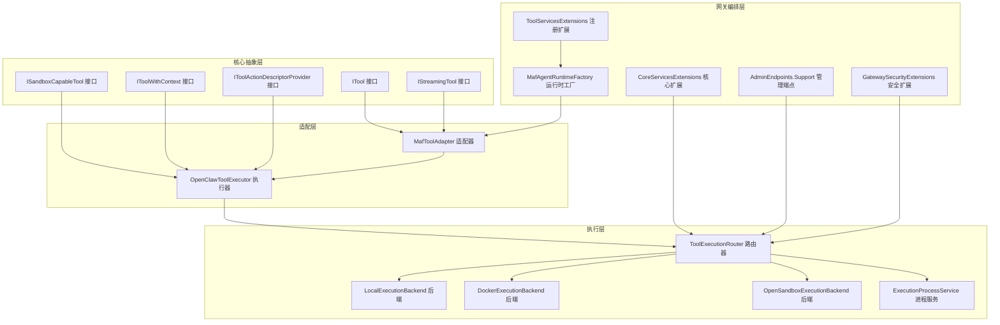
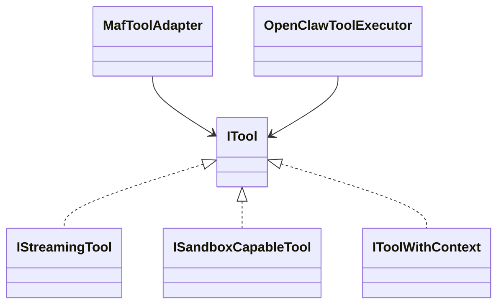
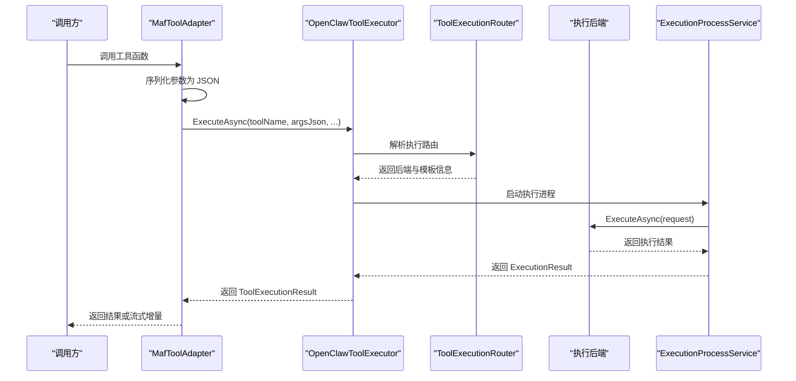
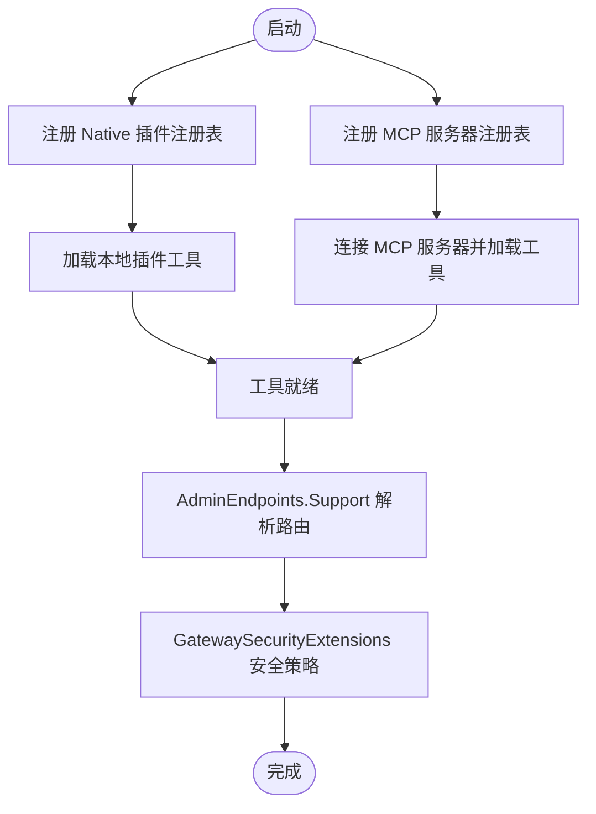
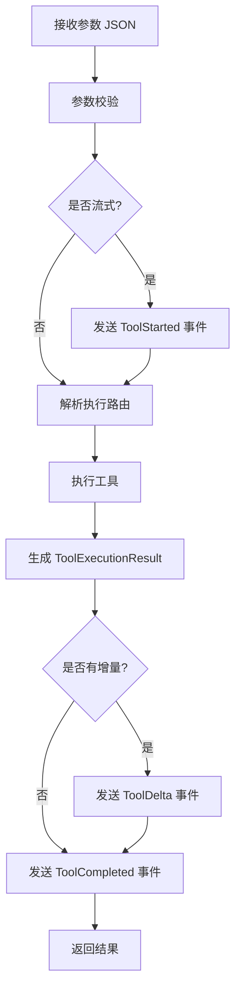
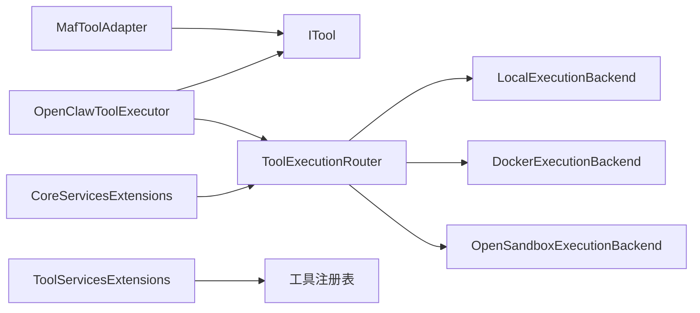

# 工具架构设计

<cite>
**本文档引用的文件**
- [ITool.cs](file://src/OpenClaw.Core/Abstractions/ITool.cs)
- [IStreamingTool.cs](file://src/OpenClaw.Core/Abstractions/IStreamingTool.cs)
- [ISandboxCapableTool.cs](file://src/OpenClaw.Core/Abstractions/ISandboxCapableTool.cs)
- [IToolWithContext.cs](file://src/OpenClaw.Core/Abstractions/IToolWithContext.cs)
- [IToolActionDescriptorProvider.cs](file://src/OpenClaw.Core/Abstractions/IToolActionDescriptorProvider.cs)
- [LocalExecutionBackend.cs](file://src/OpenClaw.Agent/Execution/LocalExecutionBackend.cs)
- [DockerExecutionBackend.cs](file://src/OpenClaw.Agent/Execution/DockerExecutionBackend.cs)
- [OpenSandboxExecutionBackend.cs](file://src/OpenClaw.Agent/Execution/OpenSandboxExecutionBackend.cs)
- [ToolExecutionRouter.cs](file://src/OpenClaw.Agent/Execution/ToolExecutionRouter.cs)
- [ExecutionProcessService.cs](file://src/OpenClaw.Agent/Execution/ExecutionProcessService.cs)
- [OpenClawToolExecutor.cs](file://src/OpenClaw.Agent/OpenClawToolExecutor.cs)
- [MafToolAdapter.cs](file://src/OpenClaw.Agent/MafToolAdapter.cs)
- [MafAgentRuntimeFactory.cs](file://src/OpenClaw.Agent/MafAgentRuntimeFactory.cs)
- [ToolServicesExtensions.cs](file://src/OpenClaw.Gateway/Composition/ToolServicesExtensions.cs)
- [CoreServicesExtensions.cs](file://src/OpenClaw.Gateway/Composition/CoreServicesExtensions.cs)
- [GatewaySecurityExtensions.cs](file://src/OpenClaw.Gateway/Extensions/GatewaySecurityExtensions.cs)
- [AdminEndpoints.Support.cs](file://src/OpenClaw.Gateway/Endpoints/AdminEndpoints.Support.cs)
- [ToolGovernanceDescriptorCatalog.cs](file://src/OpenClaw.Core/Governance/ToolGovernanceDescriptorCatalog.cs)
- [ToolGovernanceModels.cs](file://src/OpenClaw.Core/Models/ToolGovernanceModels.cs)
</cite>

## 目录
1. [简介](#简介)
2. [项目结构](#项目结构)
3. [核心组件](#核心组件)
4. [架构总览](#架构总览)
5. [详细组件分析](#详细组件分析)
6. [依赖关系分析](#依赖关系分析)
7. [性能考虑](#性能考虑)
8. [故障排查指南](#故障排查指南)
9. [结论](#结论)
10. [附录](#附录)

## 简介
本文件系统性阐述工具架构设计，围绕以下目标展开：整体架构设计原则、核心接口定义与继承层次、工具生命周期管理、工具注册与发现机制、工具分类体系（本地工具、远程工具、流式工具、沙箱工具）、工具执行器职责、工具声明生成与元数据管理，并提供架构图与组件交互流程图，帮助读者快速理解并高效扩展工具系统。

## 项目结构
工具系统横跨核心抽象层、执行层、网关编排层与适配层，形成“接口定义—执行路由—安全治理—运行时集成”的分层架构。关键模块包括：
- 核心抽象层：定义最小化的工具接口族，确保 AOT 友好与可扩展性
- 执行层：封装本地、容器与沙箱等执行后端，统一执行请求模型
- 网关编排层：负责工具注册、发现、路由解析、安全策略与运行时服务装配
- 适配层：将工具暴露为 AI 函数接口，支持流式与非流式调用

图表来源
- [ITool.cs:6-16](file://src/OpenClaw.Core/Abstractions/ITool.cs#L6-L16)
- [IStreamingTool.cs:7-10](file://src/OpenClaw.Core/Abstractions/IStreamingTool.cs#L7-L10)
- [ISandboxCapableTool.cs:5-12](file://src/OpenClaw.Core/Abstractions/ISandboxCapableTool.cs#L5-L12)
- [IToolWithContext.cs:6-15](file://src/OpenClaw.Core/Abstractions/IToolWithContext.cs#L6-L15)
- [IToolActionDescriptorProvider.cs:5-8](file://src/OpenClaw.Core/Abstractions/IToolActionDescriptorProvider.cs#L5-L8)
- [ToolExecutionRouter.cs:7-40](file://src/OpenClaw.Agent/Execution/ToolExecutionRouter.cs#L7-L40)
- [LocalExecutionBackend.cs:6-28](file://src/OpenClaw.Agent/Execution/LocalExecutionBackend.cs#L6-L28)
- [DockerExecutionBackend.cs:6-20](file://src/OpenClaw.Agent/Execution/DockerExecutionBackend.cs#L6-L20)
- [OpenSandboxExecutionBackend.cs:7-22](file://src/OpenClaw.Agent/Execution/OpenSandboxExecutionBackend.cs#L7-L22)
- [ExecutionProcessService.cs:281-309](file://src/OpenClaw.Agent/Execution/ExecutionProcessService.cs#L281-L309)
- [MafToolAdapter.cs:9-31](file://src/OpenClaw.Agent/MafToolAdapter.cs#L9-L31)
- [OpenClawToolExecutor.cs:873-953](file://src/OpenClaw.Agent/OpenClawToolExecutor.cs#L873-L953)
- [MafAgentRuntimeFactory.cs:9-40](file://src/OpenClaw.Agent/MafAgentRuntimeFactory.cs#L9-L40)
- [ToolServicesExtensions.cs:6-21](file://src/OpenClaw.Gateway/Composition/ToolServicesExtensions.cs#L6-L21)
- [CoreServicesExtensions.cs:160-165](file://src/OpenClaw.Gateway/Composition/CoreServicesExtensions.cs#L160-L165)
- [AdminEndpoints.Support.cs:1581-1611](file://src/OpenClaw.Gateway/Endpoints/AdminEndpoints.Support.cs#L1581-L1611)
- [GatewaySecurityExtensions.cs:291-316](file://src/OpenClaw.Gateway/Extensions/GatewaySecurityExtensions.cs#L291-L316)

章节来源
- [ITool.cs:1-17](file://src/OpenClaw.Core/Abstractions/ITool.cs#L1-L17)
- [ToolExecutionRouter.cs:1-132](file://src/OpenClaw.Agent/Execution/ToolExecutionRouter.cs#L1-L132)
- [MafToolAdapter.cs:1-63](file://src/OpenClaw.Agent/MafToolAdapter.cs#L1-L63)
- [ToolServicesExtensions.cs:1-22](file://src/OpenClaw.Gateway/Composition/ToolServicesExtensions.cs#L1-L22)

## 核心组件
- 工具接口族
  - ITool：最小化工具接口，包含名称、描述、参数 JSON Schema 与异步执行方法
  - IStreamingTool：可选的流式工具接口，支持增量输出
  - ISandboxCapableTool：具备沙箱能力的工具，定义默认沙箱模式、沙箱请求构建与结果格式化
  - IToolWithContext：带上下文的工具接口，扩展执行签名以传递会话与回合上下文
  - IToolActionDescriptorProvider：根据参数 JSON 解析动作描述，用于治理与审计
- 执行后端
  - LocalExecutionBackend：本地进程执行，支持工作目录约束与环境变量合并
  - DockerExecutionBackend：基于 Docker 的容器执行，要求镜像配置
  - OpenSandboxExecutionBackend：OpenSandbox 提供商的沙箱执行封装
- 执行路由器与进程服务
  - ToolExecutionRouter：根据配置与工具特性解析执行路由，选择后端与模板
  - ExecutionProcessService：进程生命周期管理、超时控制与事件上报
- 适配与执行器
  - MafToolAdapter：将 ITool 适配为 AI 函数，支持流式事件写入
  - OpenClawToolExecutor：统一工具执行入口，处理沙箱、回退与异常

章节来源
- [ITool.cs:6-16](file://src/OpenClaw.Core/Abstractions/ITool.cs#L6-L16)
- [IStreamingTool.cs:7-10](file://src/OpenClaw.Core/Abstractions/IStreamingTool.cs#L7-L10)
- [ISandboxCapableTool.cs:5-12](file://src/OpenClaw.Core/Abstractions/ISandboxCapableTool.cs#L5-L12)
- [IToolWithContext.cs:6-15](file://src/OpenClaw.Core/Abstractions/IToolWithContext.cs#L6-L15)
- [IToolActionDescriptorProvider.cs:5-8](file://src/OpenClaw.Core/Abstractions/IToolActionDescriptorProvider.cs#L5-L8)
- [LocalExecutionBackend.cs:6-99](file://src/OpenClaw.Agent/Execution/LocalExecutionBackend.cs#L6-L99)
- [DockerExecutionBackend.cs:6-66](file://src/OpenClaw.Agent/Execution/DockerExecutionBackend.cs#L6-L66)
- [OpenSandboxExecutionBackend.cs:7-69](file://src/OpenClaw.Agent/Execution/OpenSandboxExecutionBackend.cs#L7-L69)
- [ToolExecutionRouter.cs:7-132](file://src/OpenClaw.Agent/Execution/ToolExecutionRouter.cs#L7-L132)
- [ExecutionProcessService.cs:281-309](file://src/OpenClaw.Agent/Execution/ExecutionProcessService.cs#L281-L309)
- [MafToolAdapter.cs:9-63](file://src/OpenClaw.Agent/MafToolAdapter.cs#L9-L63)
- [OpenClawToolExecutor.cs:873-953](file://src/OpenClaw.Agent/OpenClawToolExecutor.cs#L873-L953)

## 架构总览
工具架构遵循“最小接口 + 多后端执行 + 统一路由 + 安全治理 + 运行时适配”的设计原则。核心思想：
- 最小接口：ITool 仅包含必要属性与方法，便于 AOT 剪枝与跨平台部署
- 多后端执行：通过统一的 ExecutionRequest/ExecutionResult 抽象，屏蔽本地、容器与沙箱差异
- 统一路由：ToolExecutionRouter 基于配置与工具特性选择后端、模板与工作区要求
- 安全治理：结合工具描述目录与治理决策模型，实现风险评估与审批控制
- 运行时适配：MafToolAdapter 将工具暴露为 AI 函数，OpenClawToolExecutor 统一调度

```mermaid
classDiagram
class ITool {
+string Name
+string Description
+string ParameterSchema
+ExecuteAsync(argumentsJson, ct) ValueTask~string~
}
class IStreamingTool {
+ExecuteStreamingAsync(argumentsJson, ct) IAsyncEnumerable~string~
}
class ISandboxCapableTool {
+ToolSandboxMode DefaultSandboxMode
+CreateSandboxRequest(argumentsJson) SandboxExecutionRequest
+FormatSandboxResult(argumentsJson, result) string
}
class IToolWithContext {
+ExecuteAsync(argumentsJson, context, ct) ValueTask~string~
}
class IToolActionDescriptorProvider {
+ResolveActionDescriptor(argumentsJson) ToolActionDescriptor
}
class ToolExecutionRouter {
+ResolveBackendForProcess() ExecutionRouteResolution
+ExecuteAsync(request, fallbackBackend, ct) Task~ExecutionResult~
}
class LocalExecutionBackend {
+ExecuteAsync(request, ct) Task~ExecutionResult~
-CreateProcessStartInfo(request) ProcessStartInfo
}
class DockerExecutionBackend {
+ExecuteAsync(request, ct) Task~ExecutionResult~
-CreateProcessStartInfo(request) ProcessStartInfo
}
class OpenSandboxExecutionBackend {
+ExecuteAsync(request, ct) Task~ExecutionResult~
}
class ExecutionProcessService {
+StartAsync(request, ct) Task~ExecutionProcessHandle~
}
class MafToolAdapter {
+InvokeCoreAsync(arguments, ct) ValueTask~object?~
}
class OpenClawToolExecutor {
+ExecuteAsync(...) Task~ToolExecutionResult~
}
IStreamingTool --|> ITool
ISandboxCapableTool --|> ITool
IToolWithContext --|> ITool
MafToolAdapter --> ITool
OpenClawToolExecutor --> ITool
ToolExecutionRouter --> LocalExecutionBackend
ToolExecutionRouter --> DockerExecutionBackend
ToolExecutionRouter --> OpenSandboxExecutionBackend
OpenClawToolExecutor --> ToolExecutionRouter
OpenClawToolExecutor --> ExecutionProcessService
```

图表来源
- [ITool.cs:6-16](file://src/OpenClaw.Core/Abstractions/ITool.cs#L6-L16)
- [IStreamingTool.cs:7-10](file://src/OpenClaw.Core/Abstractions/IStreamingTool.cs#L7-L10)
- [ISandboxCapableTool.cs:5-12](file://src/OpenClaw.Core/Abstractions/ISandboxCapableTool.cs#L5-L12)
- [IToolWithContext.cs:6-15](file://src/OpenClaw.Core/Abstractions/IToolWithContext.cs#L6-L15)
- [IToolActionDescriptorProvider.cs:5-8](file://src/OpenClaw.Core/Abstractions/IToolActionDescriptorProvider.cs#L5-L8)
- [ToolExecutionRouter.cs:7-132](file://src/OpenClaw.Agent/Execution/ToolExecutionRouter.cs#L7-L132)
- [LocalExecutionBackend.cs:6-99](file://src/OpenClaw.Agent/Execution/LocalExecutionBackend.cs#L6-L99)
- [DockerExecutionBackend.cs:6-66](file://src/OpenClaw.Agent/Execution/DockerExecutionBackend.cs#L6-L66)
- [OpenSandboxExecutionBackend.cs:7-69](file://src/OpenClaw.Agent/Execution/OpenSandboxExecutionBackend.cs#L7-L69)
- [ExecutionProcessService.cs:281-309](file://src/OpenClaw.Agent/Execution/ExecutionProcessService.cs#L281-L309)
- [MafToolAdapter.cs:9-63](file://src/OpenClaw.Agent/MafToolAdapter.cs#L9-L63)
- [OpenClawToolExecutor.cs:873-953](file://src/OpenClaw.Agent/OpenClawToolExecutor.cs#L873-L953)

## 详细组件分析

### 工具接口设计与继承层次
- 设计理念
  - ITool 保持极简，仅包含名称、描述、参数 Schema 与执行方法，满足 AOT 剪枝需求
  - IStreamingTool、ISandboxCapableTool、IToolWithContext 通过组合扩展能力，避免接口膨胀
  - IToolActionDescriptorProvider 将参数解析与工具行为解耦，便于治理与审计
- 继承与组合
  - IStreamingTool、ISandboxCapableTool、IToolWithContext 均继承自 ITool，体现“在最小接口之上按需增强”
  - MafToolAdapter 与 OpenClawToolExecutor 通过依赖注入与多态实现对不同工具类型的统一处理

图表来源
- [ITool.cs:6-16](file://src/OpenClaw.Core/Abstractions/ITool.cs#L6-L16)
- [IStreamingTool.cs:7-10](file://src/OpenClaw.Core/Abstractions/IStreamingTool.cs#L7-L10)
- [ISandboxCapableTool.cs:5-12](file://src/OpenClaw.Core/Abstractions/ISandboxCapableTool.cs#L5-L12)
- [IToolWithContext.cs:6-15](file://src/OpenClaw.Core/Abstractions/IToolWithContext.cs#L6-L15)
- [MafToolAdapter.cs:9-31](file://src/OpenClaw.Agent/MafToolAdapter.cs#L9-L31)
- [OpenClawToolExecutor.cs:873-953](file://src/OpenClaw.Agent/OpenClawToolExecutor.cs#L873-L953)

章节来源
- [ITool.cs:1-17](file://src/OpenClaw.Core/Abstractions/ITool.cs#L1-L17)
- [IStreamingTool.cs:1-11](file://src/OpenClaw.Core/Abstractions/IStreamingTool.cs#L1-L11)
- [ISandboxCapableTool.cs:1-14](file://src/OpenClaw.Core/Abstractions/ISandboxCapableTool.cs#L1-L14)
- [IToolWithContext.cs:1-16](file://src/OpenClaw.Core/Abstractions/IToolWithContext.cs#L1-L16)
- [IToolActionDescriptorProvider.cs:1-8](file://src/OpenClaw.Core/Abstractions/IToolActionDescriptorProvider.cs#L1-L8)

### 工具生命周期管理
- 生命周期阶段
  - 注册与发现：通过 ToolServicesExtensions 与 CoreServicesExtensions 在启动时注册 Native 与 MCP 工具源
  - 调度与执行：MafToolAdapter 将工具调用转换为 JSON 参数，OpenClawToolExecutor 统一调度
  - 路由与后端：ToolExecutionRouter 根据工具名与配置解析后端；ExecutionProcessService 管理进程生命周期
  - 结果返回：适配器将执行结果转为 AI 函数返回值或流式事件
- 关键流程
  - 参数序列化与流式事件写入：MafToolAdapter 在调用前后发出 ToolStarted/ToolDelta/ToolCompleted 事件
  - 治理与审批：根据工具描述目录与治理配置决定是否需要审批与风险降级

图表来源
- [MafToolAdapter.cs:31-61](file://src/OpenClaw.Agent/MafToolAdapter.cs#L31-L61)
- [OpenClawToolExecutor.cs:873-953](file://src/OpenClaw.Agent/OpenClawToolExecutor.cs#L873-L953)
- [ToolExecutionRouter.cs:114-132](file://src/OpenClaw.Agent/Execution/ToolExecutionRouter.cs#L114-L132)
- [ExecutionProcessService.cs:301-309](file://src/OpenClaw.Agent/Execution/ExecutionProcessService.cs#L301-L309)
- [LocalExecutionBackend.cs:27-28](file://src/OpenClaw.Agent/Execution/LocalExecutionBackend.cs#L27-L28)
- [DockerExecutionBackend.cs:19-20](file://src/OpenClaw.Agent/Execution/DockerExecutionBackend.cs#L19-L20)
- [OpenSandboxExecutionBackend.cs:22-52](file://src/OpenClaw.Agent/Execution/OpenSandboxExecutionBackend.cs#L22-L52)

章节来源
- [MafToolAdapter.cs:1-63](file://src/OpenClaw.Agent/MafToolAdapter.cs#L1-L63)
- [OpenClawToolExecutor.cs:873-953](file://src/OpenClaw.Agent/OpenClawToolExecutor.cs#L873-L953)
- [ExecutionProcessService.cs:281-309](file://src/OpenClaw.Agent/Execution/ExecutionProcessService.cs#L281-L309)

### 工具注册与发现机制
- 注册入口
  - ToolServicesExtensions：注册 NativePluginRegistry 与 McpServerToolRegistry，分别从本地插件与 MCP 服务器加载工具
  - CoreServicesExtensions：注册 ToolExecutionRouter 与 ExecutionProcessService，提供执行基础设施
- 发现与装载
  - NativePluginRegistry：扫描本地插件目录，构建工具集合
  - McpServerToolRegistry：连接 MCP 服务器，动态拉取工具清单
- 管理端点与安全
  - AdminEndpoints.Support：提供工具执行路由解析与后端选择逻辑
  - GatewaySecurityExtensions：根据配置解析执行后端，支持 process/shell 的特殊映射

图表来源
- [ToolServicesExtensions.cs:8-21](file://src/OpenClaw.Gateway/Composition/ToolServicesExtensions.cs#L8-L21)
- [CoreServicesExtensions.cs:160-165](file://src/OpenClaw.Gateway/Composition/CoreServicesExtensions.cs#L160-L165)
- [AdminEndpoints.Support.cs:1581-1611](file://src/OpenClaw.Gateway/Endpoints/AdminEndpoints.Support.cs#L1581-L1611)
- [GatewaySecurityExtensions.cs:291-316](file://src/OpenClaw.Gateway/Extensions/GatewaySecurityExtensions.cs#L291-L316)

章节来源
- [ToolServicesExtensions.cs:1-22](file://src/OpenClaw.Gateway/Composition/ToolServicesExtensions.cs#L1-L22)
- [CoreServicesExtensions.cs:39-183](file://src/OpenClaw.Gateway/Composition/CoreServicesExtensions.cs#L39-L183)
- [AdminEndpoints.Support.cs:1581-1611](file://src/OpenClaw.Gateway/Endpoints/AdminEndpoints.Support.cs#L1581-L1611)
- [GatewaySecurityExtensions.cs:291-316](file://src/OpenClaw.Gateway/Extensions/GatewaySecurityExtensions.cs#L291-L316)

### 工具分类体系与区别
- 本地工具（Local）
  - 特征：直接在宿主机执行，支持工作目录约束与环境变量合并
  - 适用场景：无需隔离的轻量任务、文件读写、简单命令
- 远程工具（Remote）
  - 特征：通过容器或沙箱执行，隔离性强，便于版本与依赖管理
  - 适用场景：需要稳定运行环境或网络访问的复杂任务
- 流式工具（Streaming）
  - 特征：实现 IStreamingTool，支持增量输出，适配器在流式会话中推送 ToolDelta 事件
  - 适用场景：长耗时任务、实时日志、逐步反馈
- 沙箱工具（Sandbox）
  - 特征：实现 ISandboxCapableTool，由 OpenSandboxExecutionBackend 执行，支持模板、租约与 TTL
  - 适用场景：高风险命令、不可信输入、资源受限执行

章节来源
- [LocalExecutionBackend.cs:17-25](file://src/OpenClaw.Agent/Execution/LocalExecutionBackend.cs#L17-L25)
- [DockerExecutionBackend.cs:17-20](file://src/OpenClaw.Agent/Execution/DockerExecutionBackend.cs#L17-L20)
- [OpenSandboxExecutionBackend.cs:20-22](file://src/OpenClaw.Agent/Execution/OpenSandboxExecutionBackend.cs#L20-L22)
- [IStreamingTool.cs:7-10](file://src/OpenClaw.Core/Abstractions/IStreamingTool.cs#L7-L10)
- [ISandboxCapableTool.cs:5-12](file://src/OpenClaw.Core/Abstractions/ISandboxCapableTool.cs#L5-L12)

### 工具执行器职责与工具声明生成
- 执行器职责
  - 参数校验与流式回调：根据适配器传入的 isStreaming 决定是否写入流式事件
  - 路由解析与回退：优先使用沙箱后端，不可用时按策略回退到本地或其他后端
  - 异常处理：捕获沙箱不可用异常并进行回退或抛出错误
- 工具声明生成
  - MafToolAdapter 基于 ITool 的 Name/Description/ParameterSchema 生成 AI 函数声明
  - 参数 Schema 通过 JSON 文档解析并在适配器中暴露为函数 JSON Schema

图表来源
- [MafToolAdapter.cs:31-61](file://src/OpenClaw.Agent/MafToolAdapter.cs#L31-L61)
- [OpenClawToolExecutor.cs:873-953](file://src/OpenClaw.Agent/OpenClawToolExecutor.cs#L873-L953)

章节来源
- [MafToolAdapter.cs:1-63](file://src/OpenClaw.Agent/MafToolAdapter.cs#L1-L63)
- [OpenClawToolExecutor.cs:873-953](file://src/OpenClaw.Agent/OpenClawToolExecutor.cs#L873-L953)

### 工具元数据管理与治理
- 元数据模型
  - ToolGovernanceDescriptor：工具类别、风险等级、能力矩阵（文件系统、网络、代码执行、外部数据等）
  - ToolGovernanceContext：调用上下文（会话、通道、发送者、关联 ID 等）
  - 治理决策与结果：GovernanceDecision、ToolGovernanceExecutionResult、Sidecar 请求/响应模型
- 描述目录
  - ToolGovernanceDescriptorCatalog：内置工具描述目录，支持从描述构建治理策略
- 使用场景
  - 根据工具类别与风险等级决定是否需要审批、是否只读、是否允许网络访问等

章节来源
- [ToolGovernanceDescriptorCatalog.cs:28-68](file://src/OpenClaw.Core/Governance/ToolGovernanceDescriptorCatalog.cs#L28-L68)
- [ToolGovernanceModels.cs:65-93](file://src/OpenClaw.Core/Models/ToolGovernanceModels.cs#L65-L93)
- [ToolGovernanceModels.cs:106-150](file://src/OpenClaw.Core/Models/ToolGovernanceModels.cs#L106-L150)

## 依赖关系分析
- 组件耦合
  - MafToolAdapter 与 OpenClawToolExecutor 通过 ITool 与参数 JSON 解耦
  - ToolExecutionRouter 与执行后端通过统一接口解耦，便于新增后端
  - 网关扩展通过 DI 注册工具与执行基础设施，降低运行时耦合
- 外部依赖
  - Docker 命令行（容器后端）
  - OpenSandbox 提供商（沙箱后端）
  - MCP 服务器（远程工具发现）

图表来源
- [MafToolAdapter.cs:9-31](file://src/OpenClaw.Agent/MafToolAdapter.cs#L9-L31)
- [OpenClawToolExecutor.cs:873-953](file://src/OpenClaw.Agent/OpenClawToolExecutor.cs#L873-L953)
- [ToolExecutionRouter.cs:7-40](file://src/OpenClaw.Agent/Execution/ToolExecutionRouter.cs#L7-L40)
- [LocalExecutionBackend.cs:6-28](file://src/OpenClaw.Agent/Execution/LocalExecutionBackend.cs#L6-L28)
- [DockerExecutionBackend.cs:6-20](file://src/OpenClaw.Agent/Execution/DockerExecutionBackend.cs#L6-L20)
- [OpenSandboxExecutionBackend.cs:7-22](file://src/OpenClaw.Agent/Execution/OpenSandboxExecutionBackend.cs#L7-L22)
- [ToolServicesExtensions.cs:8-21](file://src/OpenClaw.Gateway/Composition/ToolServicesExtensions.cs#L8-L21)
- [CoreServicesExtensions.cs:160-165](file://src/OpenClaw.Gateway/Composition/CoreServicesExtensions.cs#L160-L165)

章节来源
- [ToolExecutionRouter.cs:1-132](file://src/OpenClaw.Agent/Execution/ToolExecutionRouter.cs#L1-L132)
- [ToolServicesExtensions.cs:1-22](file://src/OpenClaw.Gateway/Composition/ToolServicesExtensions.cs#L1-L22)
- [CoreServicesExtensions.cs:39-183](file://src/OpenClaw.Gateway/Composition/CoreServicesExtensions.cs#L39-L183)

## 性能考虑
- AOT 友好：ITool 接口极简，减少剪枝开销
- 执行后端选择：根据工具特性与配置选择最优后端，避免不必要的容器/沙箱开销
- 流式输出：IStreamingTool 支持增量输出，降低等待时间
- 超时与回退：ExecutionProcessService 与 OpenSandboxExecutionBackend 提供超时控制与回退策略
- 进程复用与清理：ExecutionProcessService 对已完成进程进行清理，避免资源泄漏

## 故障排查指南
- 工作区限制
  - 本地后端要求工作区根目录，若工作目录超出范围将被拒绝
- 沙箱不可用
  - 当沙箱提供商不可用时，按策略回退到本地或其他后端；若必须沙箱则抛出异常
- 后端未配置
  - 容器后端需要镜像配置；沙箱后端需要模板与提供商配置
- 参数与 Schema 不匹配
  - 参数 JSON 必须符合 ParameterSchema；适配器在调用前进行序列化与事件写入

章节来源
- [LocalExecutionBackend.cs:53-83](file://src/OpenClaw.Agent/Execution/LocalExecutionBackend.cs#L53-L83)
- [OpenSandboxExecutionBackend.cs:22-67](file://src/OpenClaw.Agent/Execution/OpenSandboxExecutionBackend.cs#L22-L67)
- [OpenClawToolExecutor.cs:873-953](file://src/OpenClaw.Agent/OpenClawToolExecutor.cs#L873-L953)
- [MafToolAdapter.cs:31-61](file://src/OpenClaw.Agent/MafToolAdapter.cs#L31-L61)

## 结论
该工具架构以最小接口为核心，通过多后端执行与统一路由实现灵活扩展；借助治理与运行时适配，兼顾安全性与易用性。推荐实践包括：为新工具实现 ITool 并按需扩展 IStreamingTool/ISandboxCapableTool；在配置中明确执行后端与沙箱策略；利用工具描述目录完善治理与审计。

## 附录
- 最佳实践
  - 参数 Schema 保持简洁且完整，便于治理与调试
  - 流式工具应提供有意义的增量输出，提升用户体验
  - 沙箱工具需明确 TTL 与租约策略，避免资源泄露
  - 新增执行后端时，遵循统一的 ExecutionRequest/ExecutionResult 抽象