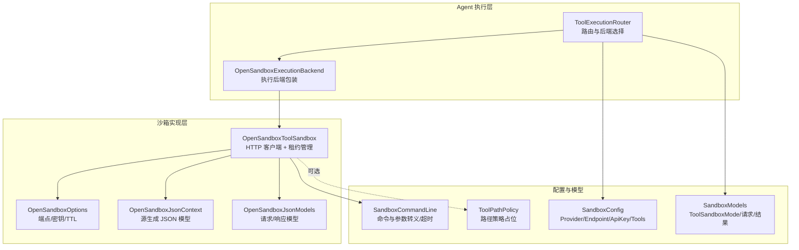
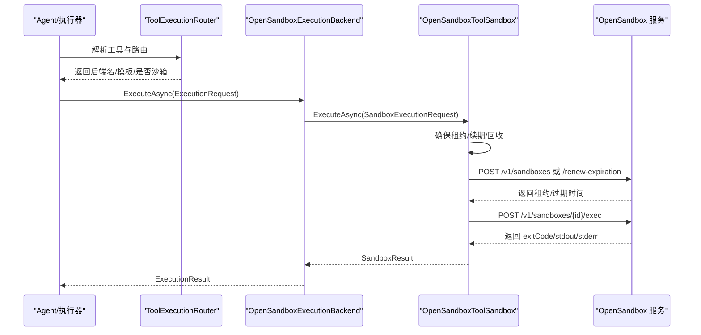
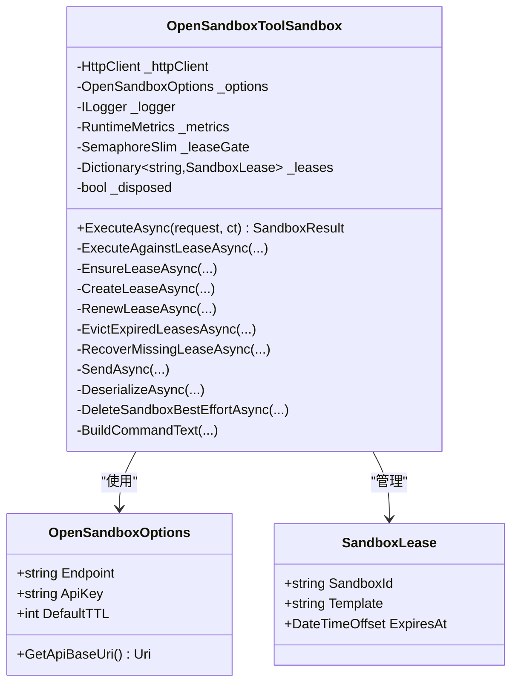
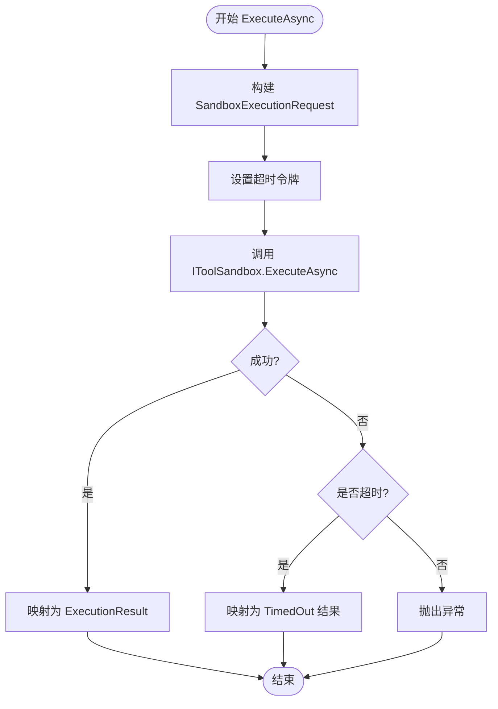
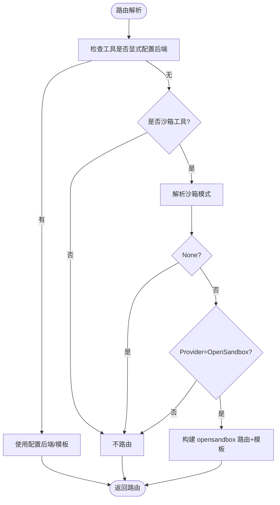
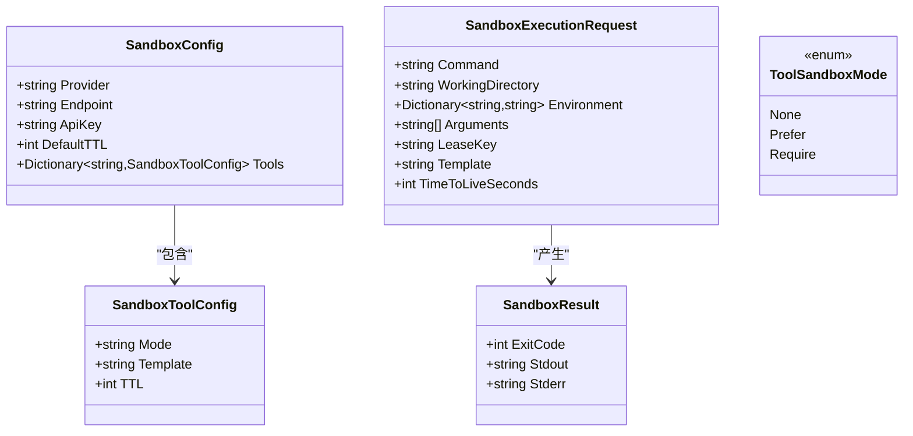
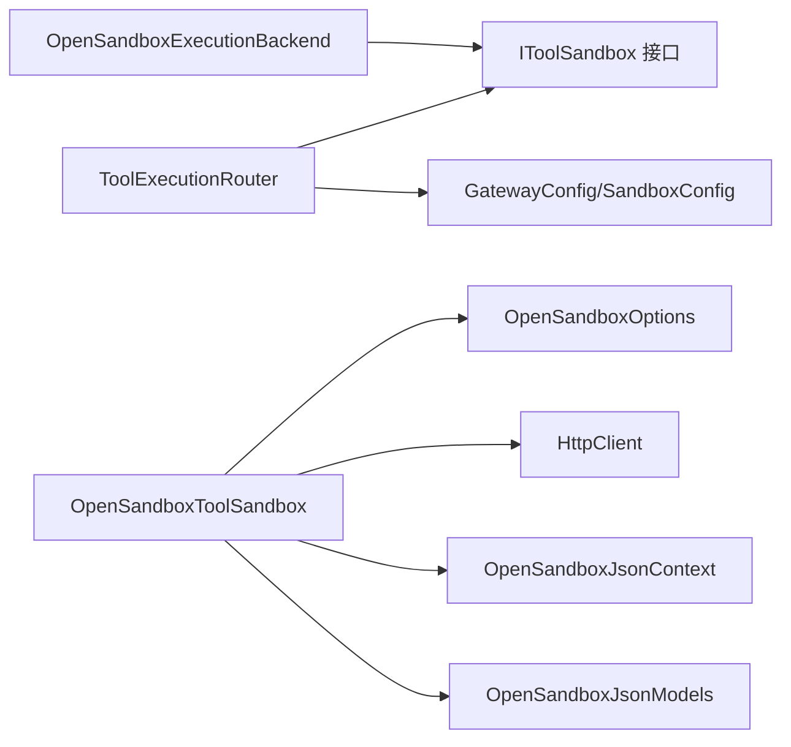
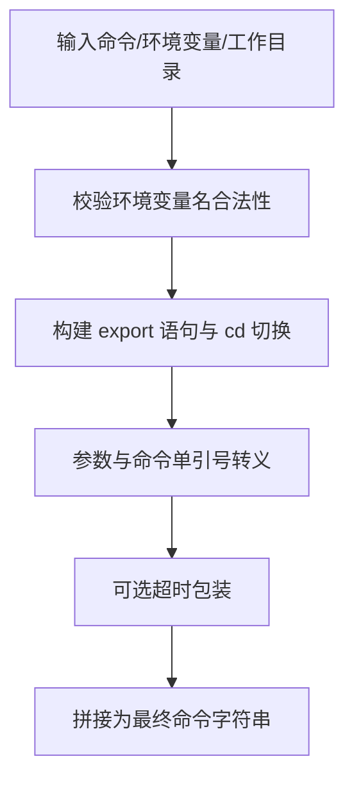

# 工具沙箱机制

<cite>
**本文引用的文件**   
- [OpenSandboxExecutionBackend.cs](file://src/OpenClaw.Agent/Execution/OpenSandboxExecutionBackend.cs)
- [IToolSandbox.cs](file://src/OpenClaw.Core/Abstractions/IToolSandbox.cs)
- [OpenSandboxToolSandbox.cs](file://src/OpenClawNet.Sandbox.OpenSandbox/OpenSandboxToolSandbox.cs)
- [OpenSandboxOptions.cs](file://src/OpenClawNet.Sandbox.OpenSandbox/OpenSandboxOptions.cs)
- [OpenSandboxJsonContext.cs](file://src/OpenClawNet.Sandbox.OpenSandbox/OpenSandboxJsonContext.cs)
- [OpenSandboxJsonModels.cs](file://src/OpenClawNet.Sandbox.OpenSandbox/OpenSandboxJsonModels.cs)
- [SandboxConfig.cs](file://src/OpenClaw.Core/Models/SandboxConfig.cs)
- [SandboxModels.cs](file://src/OpenClaw.Core/Models/SandboxModels.cs)
- [ToolExecutionRouter.cs](file://src/OpenClaw.Agent/Execution/ToolExecutionRouter.cs)
- [ToolSandboxException.cs](file://src/OpenClaw.Core/Abstractions/ToolSandboxException.cs)
- [SandboxCommandLine.cs](file://src/OpenClaw.Core/Models/SandboxCommandLine.cs)
- [ToolPathPolicy.cs](file://src/OpenClaw.Core/Security/ToolPathPolicy.cs)
- [sandboxing.md](file://docs/sandboxing.md)
- [Dockerfile.opensandbox](file://Dockerfile.opensandbox)
- [Dockerfile.opensandbox.base](file://Dockerfile.opensandbox.base)
- [OpenSandboxToolSandboxTests.cs](file://src/OpenClaw.Tests/OpenSandboxToolSandboxTests.cs)
</cite>

## 目录
1. [简介](#简介)
2. [项目结构](#项目结构)
3. [核心组件](#核心组件)
4. [架构总览](#架构总览)
5. [详细组件分析](#详细组件分析)
6. [依赖关系分析](#依赖关系分析)
7. [性能与可靠性](#性能与可靠性)
8. [安全策略与限制](#安全策略与限制)
9. [配置指南](#配置指南)
10. [故障排除](#故障排除)
11. [结论](#结论)

## 简介
本文件面向“工具沙箱安全机制”，聚焦于 OpenSandbox 工具沙箱的架构设计、安全隔离原理与实现细节。内容涵盖：
- OpenSandbox 工作原理与调用流程
- 配置项、策略解析与路由决策
- 安全策略（路径策略、命令行转义、超时控制）与限制机制
- 运维与安全最佳实践、故障排除方法
- 具体实现示例与安全注意事项

## 项目结构
围绕工具沙箱的关键代码分布在以下模块：
- 执行后端与路由：Agent 层负责选择执行后端，并在需要时委派给 IToolSandbox
- 沙箱实现：OpenSandboxToolSandbox 通过 HTTP 客户端与 OpenSandbox 服务交互
- 配置模型：SandboxConfig/SandboxModels 定义沙箱模式、模板与 TTL
- 安全与工具策略：SandboxCommandLine、ToolPathPolicy、ToolSandboxException
- 文档与镜像：sandboxing.md 提供使用说明；Dockerfile.opensandbox/base 提供运行时与基础镜像

**图表来源**
- [ToolExecutionRouter.cs:16-63](file://src/OpenClaw.Agent/Execution/ToolExecutionRouter.cs#L16-L63)
- [OpenSandboxExecutionBackend.cs:7-20](file://src/OpenClaw.Agent/Execution/OpenSandboxExecutionBackend.cs#L7-L20)
- [OpenSandboxToolSandbox.cs:14-46](file://src/OpenClawNet.Sandbox.OpenSandbox/OpenSandboxToolSandbox.cs#L14-L46)
- [OpenSandboxOptions.cs:3-16](file://src/OpenClawNet.Sandbox.OpenSandbox/OpenSandboxOptions.cs#L3-L16)
- [OpenSandboxJsonContext.cs:5-16](file://src/OpenClawNet.Sandbox.OpenSandbox/OpenSandboxJsonContext.cs#L5-L16)
- [OpenSandboxJsonModels.cs:5-47](file://src/OpenClawNet.Sandbox.OpenSandbox/OpenSandboxJsonModels.cs#L5-L47)
- [SandboxConfig.cs:3-16](file://src/OpenClaw.Core/Models/SandboxConfig.cs#L3-L16)
- [SandboxModels.cs:3-26](file://src/OpenClaw.Core/Models/SandboxModels.cs#L3-L26)
- [SandboxCommandLine.cs:5-33](file://src/OpenClaw.Core/Models/SandboxCommandLine.cs#L5-L33)
- [ToolPathPolicy.cs:5-135](file://src/OpenClaw.Core/Security/ToolPathPolicy.cs#L5-L135)

**章节来源**
- [ToolExecutionRouter.cs:16-63](file://src/OpenClaw.Agent/Execution/ToolExecutionRouter.cs#L16-L63)
- [OpenSandboxToolSandbox.cs:14-46](file://src/OpenClawNet.Sandbox.OpenSandbox/OpenSandboxToolSandbox.cs#L14-L46)
- [SandboxConfig.cs:3-16](file://src/OpenClaw.Core/Models/SandboxConfig.cs#L3-L16)
- [SandboxModels.cs:3-26](file://src/OpenClaw.Core/Models/SandboxModels.cs#L3-L26)
- [sandboxing.md:1-264](file://docs/sandboxing.md#L1-L264)

## 核心组件
- IToolSandbox 接口：定义统一的沙箱执行契约，接收 SandboxExecutionRequest 并返回 SandboxResult
- OpenSandboxToolSandbox 实现：封装 HTTP 客户端、租约生命周期管理、命令构建与序列化
- OpenSandboxExecutionBackend：将高层执行请求适配为 SandboxExecutionRequest，并处理超时与异常
- ToolExecutionRouter：根据配置与工具能力决定是否走沙箱、选择模板与后端
- 配置模型：SandboxConfig/SandboxToolConfig 描述 Provider、Endpoint、ApiKey、默认 TTL、工具级模式与模板
- 命令行与安全：SandboxCommandLine 提供参数转义与超时包装；ToolPathPolicy 为路径策略预留扩展

**章节来源**
- [IToolSandbox.cs:5-10](file://src/OpenClaw.Core/Abstractions/IToolSandbox.cs#L5-L10)
- [OpenSandboxToolSandbox.cs:48-81](file://src/OpenClawNet.Sandbox.OpenSandbox/OpenSandboxToolSandbox.cs#L48-L81)
- [OpenSandboxExecutionBackend.cs:22-67](file://src/OpenClaw.Agent/Execution/OpenSandboxExecutionBackend.cs#L22-L67)
- [ToolExecutionRouter.cs:65-112](file://src/OpenClaw.Agent/Execution/ToolExecutionRouter.cs#L65-L112)
- [SandboxConfig.cs:3-27](file://src/OpenClaw.Core/Models/SandboxConfig.cs#L3-L27)
- [SandboxModels.cs:10-26](file://src/OpenClaw.Core/Models/SandboxModels.cs#L10-L26)
- [SandboxCommandLine.cs:5-33](file://src/OpenClaw.Core/Models/SandboxCommandLine.cs#L5-L33)
- [ToolPathPolicy.cs:5-135](file://src/OpenClaw.Core/Security/ToolPathPolicy.cs#L5-L135)

## 架构总览
OpenSandbox 沙箱以“远程容器”为隔离边界，客户端通过 HTTP 与 OpenSandbox 服务交互，实现命令执行、租约续期与生命周期管理。

**图表来源**
- [ToolExecutionRouter.cs:65-112](file://src/OpenClaw.Agent/Execution/ToolExecutionRouter.cs#L65-L112)
- [OpenSandboxExecutionBackend.cs:22-67](file://src/OpenClaw.Agent/Execution/OpenSandboxExecutionBackend.cs#L22-L67)
- [OpenSandboxToolSandbox.cs:108-146](file://src/OpenClawNet.Sandbox.OpenSandbox/OpenSandboxToolSandbox.cs#L108-L146)
- [OpenSandboxJsonModels.cs:10-47](file://src/OpenClawNet.Sandbox.OpenSandbox/OpenSandboxJsonModels.cs#L10-L47)

## 详细组件分析

### 组件一：OpenSandboxToolSandbox（沙箱执行器）
职责与要点：
- 租约管理：确保同一 leaseKey 的并发安全创建，复用有效租约，清理过期租约
- 命令构建：对环境变量名进行合法性校验，按序导出；工作目录切换；命令与参数转义
- 请求发送：统一 JSON 序列化/反序列化，错误分类（不可达、超时、服务端错误、缺失租约）
- 生命周期：Dispose 时尽力删除租约，避免资源泄露

**图表来源**
- [OpenSandboxToolSandbox.cs:14-46](file://src/OpenClawNet.Sandbox.OpenSandbox/OpenSandboxToolSandbox.cs#L14-L46)
- [OpenSandboxToolSandbox.cs:411-423](file://src/OpenClawNet.Sandbox.OpenSandbox/OpenSandboxToolSandbox.cs#L411-L423)
- [OpenSandboxOptions.cs:3-16](file://src/OpenClawNet.Sandbox.OpenSandbox/OpenSandboxOptions.cs#L3-L16)

**章节来源**
- [OpenSandboxToolSandbox.cs:48-146](file://src/OpenClawNet.Sandbox.OpenSandbox/OpenSandboxToolSandbox.cs#L48-L146)
- [OpenSandboxToolSandbox.cs:177-212](file://src/OpenClawNet.Sandbox.OpenSandbox/OpenSandboxToolSandbox.cs#L177-L212)
- [OpenSandboxToolSandbox.cs:214-241](file://src/OpenClawNet.Sandbox.OpenSandbox/OpenSandboxToolSandbox.cs#L214-L241)
- [OpenSandboxToolSandbox.cs:243-297](file://src/OpenClawNet.Sandbox.OpenSandbox/OpenSandboxToolSandbox.cs#L243-L297)
- [OpenSandboxToolSandbox.cs:299-350](file://src/OpenClawNet.Sandbox.OpenSandbox/OpenSandboxToolSandbox.cs#L299-L350)
- [OpenSandboxToolSandbox.cs:352-366](file://src/OpenClawNet.Sandbox.OpenSandbox/OpenSandboxToolSandbox.cs#L352-L366)
- [OpenSandboxToolSandbox.cs:368-379](file://src/OpenClawNet.Sandbox.OpenSandbox/OpenSandboxToolSandbox.cs#L368-L379)
- [OpenSandboxToolSandbox.cs:381-409](file://src/OpenClawNet.Sandbox.OpenSandbox/OpenSandboxToolSandbox.cs#L381-L409)

### 组件二：OpenSandboxExecutionBackend（执行后端包装）
职责与要点：
- 将高层 ExecutionRequest 转换为 SandboxExecutionRequest
- 设置超时令牌，捕获取消异常并映射为超时结果
- 将沙箱执行结果转换为统一的 ExecutionResult

**图表来源**
- [OpenSandboxExecutionBackend.cs:22-67](file://src/OpenClaw.Agent/Execution/OpenSandboxExecutionBackend.cs#L22-L67)

**章节来源**
- [OpenSandboxExecutionBackend.cs:22-67](file://src/OpenClaw.Agent/Execution/OpenSandboxExecutionBackend.cs#L22-L67)

### 组件三：ToolExecutionRouter（路由与策略）
职责与要点：
- 支持多后端（local/docker/ssh/opensandbox），动态注册
- 对沙箱工具进行模式解析：None/Prefer/Require，优先取工具级配置，其次默认值
- 当 Provider=OpenSandbox 且模式非 None 时，路由到 opensandbox 后端并附带模板

**图表来源**
- [ToolExecutionRouter.cs:65-112](file://src/OpenClaw.Agent/Execution/ToolExecutionRouter.cs#L65-L112)
- [SandboxConfig.cs:86-122](file://src/OpenClaw.Core/Models/SandboxConfig.cs#L86-L122)

**章节来源**
- [ToolExecutionRouter.cs:65-112](file://src/OpenClaw.Agent/Execution/ToolExecutionRouter.cs#L65-L112)
- [SandboxConfig.cs:86-122](file://src/OpenClaw.Core/Models/SandboxConfig.cs#L86-L122)

### 组件四：配置与模型
- SandboxConfig：全局沙箱配置（Provider/Endpoint/ApiKey/DefaultTTL/Tools）
- SandboxToolConfig：工具级沙箱配置（Mode/Template/TTL）
- ToolSandboxMode：None/Prefer/Require
- SandboxExecutionRequest/SandboxResult：跨后端统一的数据载体
- SandboxCommandLine：命令与参数转义、超时包装

**图表来源**
- [SandboxConfig.cs:3-27](file://src/OpenClaw.Core/Models/SandboxConfig.cs#L3-L27)
- [SandboxModels.cs:3-26](file://src/OpenClaw.Core/Models/SandboxModels.cs#L3-L26)
- [SandboxCommandLine.cs:5-33](file://src/OpenClaw.Core/Models/SandboxCommandLine.cs#L5-L33)

**章节来源**
- [SandboxConfig.cs:3-27](file://src/OpenClaw.Core/Models/SandboxConfig.cs#L3-L27)
- [SandboxModels.cs:3-26](file://src/OpenClaw.Core/Models/SandboxModels.cs#L3-L26)
- [SandboxCommandLine.cs:5-33](file://src/OpenClaw.Core/Models/SandboxCommandLine.cs#L5-L33)

## 依赖关系分析
- 组件耦合
  - OpenSandboxToolSandbox 依赖 OpenSandboxOptions、HttpClient、JSON 上下文与指标
  - ToolExecutionRouter 依赖 GatewayConfig、IToolSandbox、IExecutionBackend
- 外部依赖
  - OpenSandbox 服务（HTTP API v1）
  - 源生成 JSON（减少反射开销）
- 潜在循环依赖
  - 未见直接循环；路由与沙箱实现通过接口解耦

**图表来源**
- [ToolExecutionRouter.cs:16-63](file://src/OpenClaw.Agent/Execution/ToolExecutionRouter.cs#L16-L63)
- [OpenSandboxExecutionBackend.cs:7-20](file://src/OpenClaw.Agent/Execution/OpenSandboxExecutionBackend.cs#L7-L20)
- [OpenSandboxToolSandbox.cs:25-46](file://src/OpenClawNet.Sandbox.OpenSandbox/OpenSandboxToolSandbox.cs#L25-L46)
- [OpenSandboxJsonContext.cs:5-16](file://src/OpenClawNet.Sandbox.OpenSandbox/OpenSandboxJsonContext.cs#L5-L16)
- [OpenSandboxJsonModels.cs:5-47](file://src/OpenClawNet.Sandbox.OpenSandbox/OpenSandboxJsonModels.cs#L5-L47)
- [SandboxConfig.cs:3-16](file://src/OpenClaw.Core/Models/SandboxConfig.cs#L3-L16)

**章节来源**
- [ToolExecutionRouter.cs:16-63](file://src/OpenClaw.Agent/Execution/ToolExecutionRouter.cs#L16-L63)
- [OpenSandboxToolSandbox.cs:25-46](file://src/OpenClawNet.Sandbox.OpenSandbox/OpenSandboxToolSandbox.cs#L25-L46)

## 性能与可靠性
- 租约复用与回收：通过内存字典缓存租约，减少重复创建；定期驱逐过期租约并尽力删除远端资源
- 并发控制：使用信号量保证同一 leaseKey 的租约创建互斥
- 异常与超时：区分超时与不可达，避免误判；对 5xx 错误进行专用异常类型
- 序列化优化：使用源生成 JSON，降低序列化成本

**章节来源**
- [OpenSandboxToolSandbox.cs:21-23](file://src/OpenClawNet.Sandbox.OpenSandbox/OpenSandboxToolSandbox.cs#L21-L23)
- [OpenSandboxToolSandbox.cs:148-175](file://src/OpenClawNet.Sandbox.OpenSandbox/OpenSandboxToolSandbox.cs#L148-L175)
- [OpenSandboxToolSandbox.cs:243-265](file://src/OpenClawNet.Sandbox.OpenSandbox/OpenSandboxToolSandbox.cs#L243-L265)
- [OpenSandboxToolSandbox.cs:299-350](file://src/OpenClawNet.Sandbox.OpenSandbox/OpenSandboxToolSandbox.cs#L299-L350)
- [OpenSandboxJsonContext.cs:5-16](file://src/OpenClawNet.Sandbox.OpenSandbox/OpenSandboxJsonContext.cs#L5-L16)

## 安全策略与限制
- 命令与参数安全
  - 环境变量名合法性校验，防止注入
  - 参数与命令使用单引号转义，避免 shell 注入
  - 可选超时包装，限制任意命令执行时长
- 路径策略
  - 路径读写白名单策略预留（ToolPathPolicy），当前沙箱执行不直接依赖该策略
- 网络与访问控制
  - 通过 OpenSandbox 服务端的网络策略（如出站规则）实现对外部网络的限制（参考演示项目）
- 身份与密钥
  - 支持通过 HTTP 头传递 API Key，避免明文存储
- 策略解析与强制
  - Provider=OpenSandbox 时，Require 模式下失败关闭，Prefer 可回退本地执行

**图表来源**
- [OpenSandboxToolSandbox.cs:381-409](file://src/OpenClawNet.Sandbox.OpenSandbox/OpenSandboxToolSandbox.cs#L381-L409)
- [SandboxCommandLine.cs:7-32](file://src/OpenClaw.Core/Models/SandboxCommandLine.cs#L7-L32)
- [ToolPathPolicy.cs:5-135](file://src/OpenClaw.Core/Security/ToolPathPolicy.cs#L5-L135)

**章节来源**
- [OpenSandboxToolSandbox.cs:381-409](file://src/OpenClawNet.Sandbox.OpenSandbox/OpenSandboxToolSandbox.cs#L381-L409)
- [SandboxCommandLine.cs:7-32](file://src/OpenClaw.Core/Models/SandboxCommandLine.cs#L7-L32)
- [ToolPathPolicy.cs:5-135](file://src/OpenClaw.Core/Security/ToolPathPolicy.cs#L5-L135)

## 配置指南
- 默认与示例配置
  - Provider、Endpoint、ApiKey、DefaultTTL、Tools（Mode/Template/TTL）
  - 示例配置覆盖 shell/code_exec/browser 等高风险工具
- 模式语义
  - None：不使用沙箱
  - Prefer：可用则沙箱，否则回退本地
  - Require：必须沙箱，不可回退
- 模板与 TTL
  - Template 映射为 OpenSandbox 创建租约时的镜像 URI
  - TTL 控制租约生命周期，支持每请求覆盖
- 构建与部署
  - 使用 Dockerfile.opensandbox 构建带 OpenSandbox 的运行时镜像
  - 基础镜像 Dockerfile.opensandbox.base 便于稳定复用

**章节来源**
- [sandboxing.md:55-141](file://docs/sandboxing.md#L55-L141)
- [SandboxConfig.cs:3-27](file://src/OpenClaw.Core/Models/SandboxConfig.cs#L3-L27)
- [SandboxModels.cs:3-26](file://src/OpenClaw.Core/Models/SandboxModels.cs#L3-L26)
- [Dockerfile.opensandbox:1-113](file://Dockerfile.opensandbox#L1-L113)
- [Dockerfile.opensandbox.base:1-76](file://Dockerfile.opensandbox.base#L1-L76)

## 故障排除
- 常见问题与定位
  - OpenSandbox 不可达：检查 Endpoint 与网络连通性；确认 API Key 正确
  - 缺失租约：租约可能被远端删除或过期，触发自动回收与重建
  - 超时：调整 DefaultTTL 或工具级 TTL；检查命令执行耗时
  - 模式配置错误：确保 Mode 为 None/Prefer/Require；工具启用沙箱时需提供 Template
- 运行时验证
  - 使用 --doctor 检查 OpenSandbox 可达性
  - 通过单元测试验证租约创建/复用/回收行为

**章节来源**
- [OpenSandboxToolSandbox.cs:299-350](file://src/OpenClawNet.Sandbox.OpenSandbox/OpenSandboxToolSandbox.cs#L299-L350)
- [OpenSandboxToolSandbox.cs:138-145](file://src/OpenClawNet.Sandbox.OpenSandbox/OpenSandboxToolSandbox.cs#L138-L145)
- [SandboxConfig.cs:160-186](file://src/OpenClaw.Core/Models/SandboxConfig.cs#L160-L186)
- [sandboxing.md:152-157](file://docs/sandboxing.md#L152-L157)
- [OpenSandboxToolSandboxTests.cs:15-110](file://src/OpenClaw.Tests/OpenSandboxToolSandboxTests.cs#L15-L110)

## 结论
OpenSandbox 工具沙箱通过“远程容器 + 租约管理 + 统一执行接口”的方式，在不牺牲易用性的前提下显著提升了高风险工具的执行安全性。其关键优势包括：
- 清晰的路由与策略解析，支持灵活的沙箱模式
- 完备的租约生命周期管理与错误恢复
- 严格的命令与参数安全处理
- 可观测性与可运维性（日志、指标、健康检查）

建议在生产环境中：
- 采用 Require 模式保护高风险工具
- 使用私有镜像仓库与最小化运行时
- 配置网络出站策略与资源限制
- 定期审计配置与租约使用情况