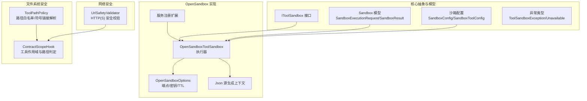
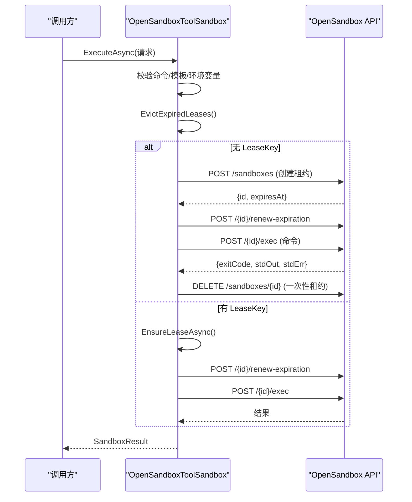
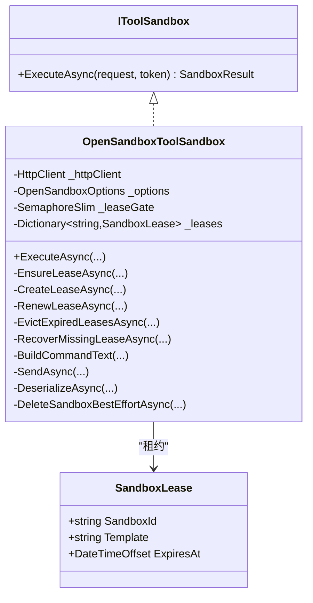
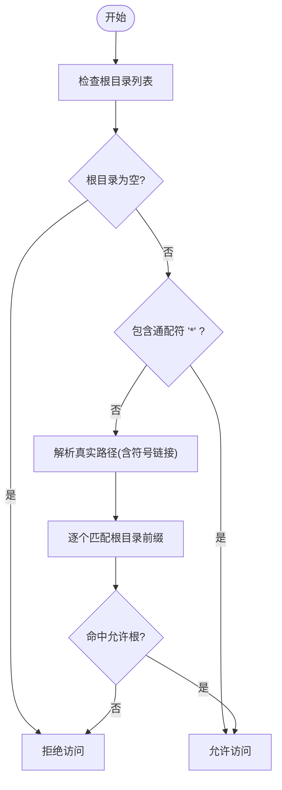
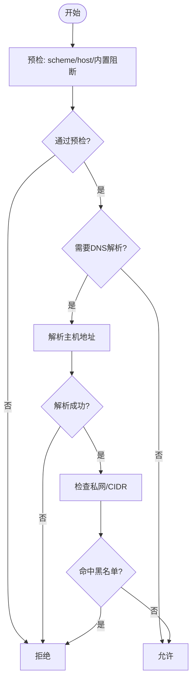
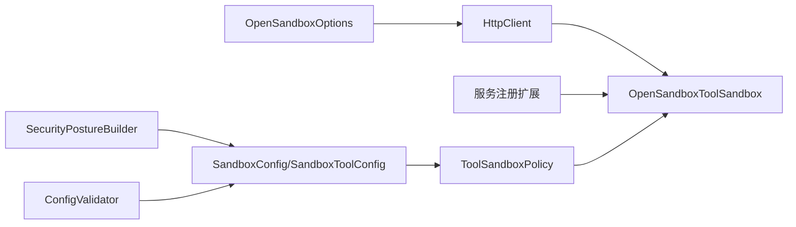

# 工具沙箱机制

<cite>
**本文引用的文件**
- [OpenSandboxToolSandbox.cs](file://src/OpenClawNet.Sandbox.OpenSandbox/OpenSandboxToolSandbox.cs)
- [IToolSandbox.cs](file://src/OpenClaw.Core/Abstractions/IToolSandbox.cs)
- [ToolSandboxException.cs](file://src/OpenClaw.Core/Abstractions/ToolSandboxException.cs)
- [SandboxModels.cs](file://src/OpenClaw.Core/Models/SandboxModels.cs)
- [SandboxConfig.cs](file://src/OpenClaw.Core/Models/SandboxConfig.cs)
- [OpenSandboxOptions.cs](file://src/OpenClawNet.Sandbox.OpenSandbox/OpenSandboxOptions.cs)
- [OpenSandboxServiceCollectionExtensions.cs](file://src/OpenClawNet.Sandbox.OpenSandbox/OpenSandboxServiceCollectionExtensions.cs)
- [OpenSandboxJsonContext.cs](file://src/OpenClawNet.Sandbox.OpenSandbox/OpenSandboxJsonContext.cs)
- [ToolPathPolicy.cs](file://src/OpenClaw.Agent/Tools/ToolPathPolicy.cs)
- [ContractScopeHook.cs](file://src/OpenClaw.Agent/ContractScopeHook.cs)
- [UrlSafetyValidator.cs](file://src/OpenClaw.Core/Security/UrlSafetyValidator.cs)
- [OpenSandboxToolSandboxTests.cs](file://src/OpenClaw.Tests/OpenSandboxToolSandboxTests.cs)
- [ToolPathPolicyTests.cs](file://src/OpenClaw.Tests/ToolPathPolicyTests.cs)
- [UrlSafetyValidatorTests.cs](file://src/OpenClaw.Tests/UrlSafetyValidatorTests.cs)
- [SecurityPostureBuilder.cs](file://src/OpenClaw.Gateway/SecurityPostureBuilder.cs)
- [ConfigValidator.cs](file://src/OpenClaw.Core/Validation/ConfigValidator.cs)
</cite>

## 目录
1. [简介](#简介)
2. [项目结构](#项目结构)
3. [核心组件](#核心组件)
4. [架构总览](#架构总览)
5. [详细组件分析](#详细组件分析)
6. [依赖关系分析](#依赖关系分析)
7. [性能考量](#性能考量)
8. [故障排查指南](#故障排查指南)
9. [结论](#结论)
10. [附录](#附录)

## 简介
本文件系统性阐述工具沙箱机制的设计与实现，覆盖安全隔离原理、资源限制策略、访问控制机制与异常处理。重点解析 IToolSandbox 接口设计理念、OpenSandboxToolSandbox 的实现细节（进程隔离、命令构建、租约管理、资源回收）、ToolPathPolicy 的路径白名单与目录遍历防护、UrlSafetyValidator 的 URL 安全校验与恶意链接阻断，并给出配置最佳实践、性能影响分析、安全审计方法以及逃逸检测与监控告警建议。

## 项目结构
围绕工具沙箱的关键代码分布在以下模块：
- 核心抽象与模型：IToolSandbox、SandboxModels、SandboxConfig、ToolSandboxException
- OpenSandbox 实现：OpenSandboxToolSandbox、OpenSandboxOptions、OpenSandboxServiceCollectionExtensions、OpenSandboxJsonContext
- 文件系统安全：ToolPathPolicy、ContractScopeHook
- 网络安全：UrlSafetyValidator
- 测试与验证：OpenSandboxToolSandboxTests、ToolPathPolicyTests、UrlSafetyValidatorTests、SecurityPostureBuilder、ConfigValidator

**图表来源**
- [IToolSandbox.cs:1-11](file://src/OpenClaw.Core/Abstractions/IToolSandbox.cs#L1-L11)
- [SandboxModels.cs:1-28](file://src/OpenClaw.Core/Models/SandboxModels.cs#L1-L28)
- [SandboxConfig.cs:1-168](file://src/OpenClaw.Core/Models/SandboxConfig.cs#L1-L168)
- [OpenSandboxToolSandbox.cs:1-427](file://src/OpenClawNet.Sandbox.OpenSandbox/OpenSandboxToolSandbox.cs#L1-L427)
- [OpenSandboxOptions.cs:1-19](file://src/OpenClawNet.Sandbox.OpenSandbox/OpenSandboxOptions.cs#L1-L19)
- [OpenSandboxServiceCollectionExtensions.cs:35-60](file://src/OpenClawNet.Sandbox.OpenSandbox/OpenSandboxServiceCollectionExtensions.cs#L35-L60)
- [OpenSandboxJsonContext.cs:1-17](file://src/OpenClawNet.Sandbox.OpenSandbox/OpenSandboxJsonContext.cs#L1-L17)
- [ToolPathPolicy.cs:1-132](file://src/OpenClaw.Agent/Tools/ToolPathPolicy.cs#L1-L132)
- [ContractScopeHook.cs:121-156](file://src/OpenClaw.Agent/ContractScopeHook.cs#L121-L156)
- [UrlSafetyValidator.cs:1-219](file://src/OpenClaw.Core/Security/UrlSafetyValidator.cs#L1-L219)

**章节来源**
- [IToolSandbox.cs:1-11](file://src/OpenClaw.Core/Abstractions/IToolSandbox.cs#L1-L11)
- [SandboxModels.cs:1-28](file://src/OpenClaw.Core/Models/SandboxModels.cs#L1-L28)
- [SandboxConfig.cs:1-168](file://src/OpenClaw.Core/Models/SandboxConfig.cs#L1-L168)
- [OpenSandboxToolSandbox.cs:1-427](file://src/OpenClawNet.Sandbox.OpenSandbox/OpenSandboxToolSandbox.cs#L1-L427)
- [OpenSandboxOptions.cs:1-19](file://src/OpenClawNet.Sandbox.OpenSandbox/OpenSandboxOptions.cs#L1-L19)
- [OpenSandboxServiceCollectionExtensions.cs:35-60](file://src/OpenClawNet.Sandbox.OpenSandbox/OpenSandboxServiceCollectionExtensions.cs#L35-L60)
- [OpenSandboxJsonContext.cs:1-17](file://src/OpenClawNet.Sandbox.OpenSandbox/OpenSandboxJsonContext.cs#L1-L17)
- [ToolPathPolicy.cs:1-132](file://src/OpenClaw.Agent/Tools/ToolPathPolicy.cs#L1-L132)
- [ContractScopeHook.cs:121-156](file://src/OpenClaw.Agent/ContractScopeHook.cs#L121-L156)
- [UrlSafetyValidator.cs:1-219](file://src/OpenClaw.Core/Security/UrlSafetyValidator.cs#L1-L219)

## 核心组件
- IToolSandbox 接口：定义统一的沙箱执行契约，输入为 SandboxExecutionRequest，输出为 SandboxResult，支持取消令牌。
- OpenSandboxToolSandbox 实现：通过 HTTP 客户端与 OpenSandbox 服务交互，负责租约生命周期管理、命令构建、环境变量校验、过期清理与恢复、错误映射与资源回收。
- 沙箱模型与配置：SandboxExecutionRequest/SandboxResult 描述执行参数；SandboxConfig/SandboxToolConfig 提供全局与工具级沙箱模式、模板镜像与 TTL 配置。
- 文件系统安全：ToolPathPolicy 基于白名单根目录与真实路径解析（含符号链接深度限制）实现读写权限控制；ContractScopeHook 将其集成到工具作用域检查。
- 网络安全：UrlSafetyValidator 对 HTTP(S) URL 进行预检、DNS 解析、私网地址与 CIDR 黑名单校验，阻止回环与元数据服务等高风险目标。
- 异常体系：ToolSandboxException/UnavailableException 统一错误语义，便于上层区分“不可用”与“业务错误”。

**章节来源**
- [IToolSandbox.cs:1-11](file://src/OpenClaw.Core/Abstractions/IToolSandbox.cs#L1-L11)
- [OpenSandboxToolSandbox.cs:48-81](file://src/OpenClawNet.Sandbox.OpenSandbox/OpenSandboxToolSandbox.cs#L48-L81)
- [SandboxModels.cs:10-26](file://src/OpenClaw.Core/Models/SandboxModels.cs#L10-L26)
- [SandboxConfig.cs:3-46](file://src/OpenClaw.Core/Models/SandboxConfig.cs#L3-L46)
- [ToolPathPolicy.cs:9-35](file://src/OpenClaw.Agent/Tools/ToolPathPolicy.cs#L9-L35)
- [UrlSafetyValidator.cs:27-58](file://src/OpenClaw.Core/Security/UrlSafetyValidator.cs#L27-L58)
- [ToolSandboxException.cs:1-28](file://src/OpenClaw.Core/Abstractions/ToolSandboxException.cs#L1-L28)

## 架构总览
OpenSandboxToolSandbox 作为 IToolSandbox 的实现，采用“租约驱动”的容器化执行模型：
- 租约创建：根据模板镜像与 TTL 创建沙箱实例，携带元数据（如 leaseKey/toolTemplate）。
- 命令执行：在租约有效期内发送 exec 请求，返回 exitCode、stdout/stderr。
- 租约续期：在执行前/后对过期时间进行刷新，确保长任务稳定性。
- 缓存复用：同一 leaseKey 在有效期内复用，减少创建开销。
- 异常恢复：当远端报告租约缺失时，自动重建并重试一次，避免单点失败。
- 资源回收：Dispose 时尽力删除远端沙箱实例，防止资源泄漏。

**图表来源**
- [OpenSandboxToolSandbox.cs:48-146](file://src/OpenClawNet.Sandbox.OpenSandbox/OpenSandboxToolSandbox.cs#L48-L146)
- [OpenSandboxToolSandbox.cs:148-175](file://src/OpenClawNet.Sandbox.OpenSandbox/OpenSandboxToolSandbox.cs#L148-L175)
- [OpenSandboxToolSandbox.cs:177-212](file://src/OpenClawNet.Sandbox.OpenSandbox/OpenSandboxToolSandbox.cs#L177-L212)
- [OpenSandboxToolSandbox.cs:214-241](file://src/OpenClawNet.Sandbox.OpenSandbox/OpenSandboxToolSandbox.cs#L214-L241)
- [OpenSandboxToolSandbox.cs:267-297](file://src/OpenClawNet.Sandbox.OpenSandbox/OpenSandboxToolSandbox.cs#L267-L297)

**章节来源**
- [OpenSandboxToolSandbox.cs:48-241](file://src/OpenClawNet.Sandbox.OpenSandbox/OpenSandboxToolSandbox.cs#L48-L241)
- [OpenSandboxToolSandbox.cs:267-297](file://src/OpenClawNet.Sandbox.OpenSandbox/OpenSandboxToolSandbox.cs#L267-L297)

## 详细组件分析

### IToolSandbox 接口与设计理念
- 设计目标：为工具执行提供统一的“可插拔”沙箱抽象，屏蔽具体实现差异（本地/远程容器/隔离执行后端）。
- 输入输出：SandboxExecutionRequest 承载命令、工作目录、环境变量、参数、租约键、模板与 TTL；SandboxResult 返回退出码与标准流。
- 取消语义：支持 CancellationToken，便于上层中断长时间运行的任务。
- 与工具集成：ISandboxCapableTool 可将工具参数转换为沙箱请求并格式化结果，形成“工具-沙箱”桥接。

**章节来源**
- [IToolSandbox.cs:1-11](file://src/OpenClaw.Core/Abstractions/IToolSandbox.cs#L1-L11)
- [SandboxModels.cs:10-26](file://src/OpenClaw.Core/Models/SandboxModels.cs#L10-L26)

### OpenSandboxToolSandbox 实现细节
- 安全边界与隔离
  - 进程隔离：通过远端 OpenSandbox 服务创建独立容器/命名空间，命令在受控环境中执行。
  - 环境变量校验：仅允许符合命名规范的键名，防止注入。
  - 命令构建：将环境导出、工作目录切换与命令拼接为单一 shell 命令字符串，避免外部进程直接暴露。
- 资源限制与租约管理
  - TTL 控制：默认 TTL 来自 OpenSandboxOptions，支持 per-request 覆盖；创建与续期均基于该值。
  - 租约复用：同一 leaseKey 在有效期内复用，减少创建成本；并发请求通过互斥门保证只创建一次。
  - 过期清理：定期剔除过期租约并尽力删除对应沙箱。
- 访问控制与错误处理
  - 租约缺失恢复：当远端返回 NotFound 时，自动重建租约并重试一次。
  - 错误映射：HTTP 5xx 映射为“不可用”，其他错误映射为“工具沙箱异常”；网络超时/连接失败映射为“不可用”。
  - 资源回收：Dispose 时遍历并删除所有租约，记录调试日志但不抛异常。
- 性能度量
  - 通过 RuntimeMetrics 记录租约创建/复用/恢复次数，便于容量规划与问题定位。

**图表来源**
- [IToolSandbox.cs:1-11](file://src/OpenClaw.Core/Abstractions/IToolSandbox.cs#L1-L11)
- [OpenSandboxToolSandbox.cs:14-23](file://src/OpenClawNet.Sandbox.OpenSandbox/OpenSandboxToolSandbox.cs#L14-L23)
- [OpenSandboxToolSandbox.cs:411-423](file://src/OpenClawNet.Sandbox.OpenSandbox/OpenSandboxToolSandbox.cs#L411-L423)

**章节来源**
- [OpenSandboxToolSandbox.cs:16-46](file://src/OpenClawNet.Sandbox.OpenSandbox/OpenSandboxToolSandbox.cs#L16-L46)
- [OpenSandboxToolSandbox.cs:108-146](file://src/OpenClawNet.Sandbox.OpenSandbox/OpenSandboxToolSandbox.cs#L108-L146)
- [OpenSandboxToolSandbox.cs:148-175](file://src/OpenClawNet.Sandbox.OpenSandbox/OpenSandboxToolSandbox.cs#L148-L175)
- [OpenSandboxToolSandbox.cs:177-212](file://src/OpenClawNet.Sandbox.OpenSandbox/OpenSandboxToolSandbox.cs#L177-L212)
- [OpenSandboxToolSandbox.cs:214-241](file://src/OpenClawNet.Sandbox.OpenSandbox/OpenSandboxToolSandbox.cs#L214-L241)
- [OpenSandboxToolSandbox.cs:243-265](file://src/OpenClawNet.Sandbox.OpenSandbox/OpenSandboxToolSandbox.cs#L243-L265)
- [OpenSandboxToolSandbox.cs:267-297](file://src/OpenClawNet.Sandbox.OpenSandbox/OpenSandboxToolSandbox.cs#L267-L297)
- [OpenSandboxToolSandbox.cs:381-409](file://src/OpenClawNet.Sandbox.OpenSandbox/OpenSandboxToolSandbox.cs#L381-L409)

### ToolPathPolicy 路径白名单与目录遍历防护
- 白名单机制
  - 允许读/写的根目录分别由 AllowedReadRoots/AllowedWriteRoots 配置；支持通配符“*”放行全部。
  - 若未设置根目录或为空数组，则默认拒绝。
- 符号链接与真实路径解析
  - 递归解析符号链接，限制最大深度，避免无限循环与路径逃逸。
  - 对不存在文件也解析父链，确保在目标不存在时仍能正确判断是否越权。
- Windows/Unix 差异
  - 路径比较大小写敏感性随平台而定，保证跨平台一致性。
- 与工具作用域集成
  - ContractScopeHook 将 ToolPathPolicy 的解析结果用于工具作用域的路径允许性判断，结合工具名称与能力范围进行综合判定。

**图表来源**
- [ToolPathPolicy.cs:15-35](file://src/OpenClaw.Agent/Tools/ToolPathPolicy.cs#L15-L35)
- [ToolPathPolicy.cs:42-73](file://src/OpenClaw.Agent/Tools/ToolPathPolicy.cs#L42-L73)
- [ToolPathPolicy.cs:79-110](file://src/OpenClaw.Agent/Tools/ToolPathPolicy.cs#L79-L110)
- [ContractScopeHook.cs:134-156](file://src/OpenClaw.Agent/ContractScopeHook.cs#L134-L156)

**章节来源**
- [ToolPathPolicy.cs:9-35](file://src/OpenClaw.Agent/Tools/ToolPathPolicy.cs#L9-L35)
- [ToolPathPolicy.cs:42-110](file://src/OpenClaw.Agent/Tools/ToolPathPolicy.cs#L42-L110)
- [ContractScopeHook.cs:128-156](file://src/OpenClaw.Agent/ContractScopeHook.cs#L128-L156)

### UrlSafetyValidator URL 安全校验
- 预检规则
  - 仅允许绝对 http/https URL；主机不能为空；内置阻断主机（如 localhost、metadata.*）。
- DNS 解析与地址判定
  - 支持异步/同步两种模式；解析失败返回拒绝并附原因。
  - 私网地址与回环地址一律阻断（可配置开关），同时支持 CIDR 黑名单精确匹配。
- 与工具集成
  - WebFetchTool/BrowserTool 在构造沙箱请求或发起请求前调用校验，一旦命中阻断则直接报错。

**图表来源**
- [UrlSafetyValidator.cs:27-58](file://src/OpenClaw.Core/Security/UrlSafetyValidator.cs#L27-L58)
- [UrlSafetyValidator.cs:60-111](file://src/OpenClaw.Core/Security/UrlSafetyValidator.cs#L60-L111)
- [UrlSafetyValidator.cs:113-135](file://src/OpenClaw.Core/Security/UrlSafetyValidator.cs#L113-L135)

**章节来源**
- [UrlSafetyValidator.cs:17-135](file://src/OpenClaw.Core/Security/UrlSafetyValidator.cs#L17-L135)

## 依赖关系分析
- 服务注册与选项绑定
  - 通过 OpenSandboxServiceCollectionExtensions 注册 IToolSandbox 实例，使用 IHttpClientFactory 创建带 BaseAddress 与超时的 HttpClient，并注入 OpenSandboxOptions。
- 配置解析与策略
  - SandboxConfig/SandboxToolConfig 决定 Provider、Endpoint、ApiKey、DefaultTTL、工具级 Mode/Template/TTL。
  - ToolSandboxPolicy 提供模式解析、模板与 TTL 解析、是否强制沙箱化等决策。
- 安全策略与验证
  - SecurityPostureBuilder 基于配置评估公开绑定风险与沙箱配置状态，指导部署建议。
  - ConfigValidator 对配置进行静态校验（如 TTL 正数、OpenSandbox 时模板必填等）。

**图表来源**
- [OpenSandboxServiceCollectionExtensions.cs:35-60](file://src/OpenClawNet.Sandbox.OpenSandbox/OpenSandboxServiceCollectionExtensions.cs#L35-L60)
- [OpenSandboxToolSandbox.cs:25-46](file://src/OpenClawNet.Sandbox.OpenSandbox/OpenSandboxToolSandbox.cs#L25-L46)
- [SandboxConfig.cs:3-46](file://src/OpenClaw.Core/Models/SandboxConfig.cs#L3-L46)
- [SecurityPostureBuilder.cs:11-20](file://src/OpenClaw.Gateway/SecurityPostureBuilder.cs#L11-L20)
- [ConfigValidator.cs:160-187](file://src/OpenClaw.Core/Validation/ConfigValidator.cs#L160-L187)

**章节来源**
- [OpenSandboxServiceCollectionExtensions.cs:35-60](file://src/OpenClawNet.Sandbox.OpenSandbox/OpenSandboxServiceCollectionExtensions.cs#L35-L60)
- [OpenSandboxToolSandbox.cs:25-46](file://src/OpenClawNet.Sandbox.OpenSandbox/OpenSandboxToolSandbox.cs#L25-L46)
- [SandboxConfig.cs:3-46](file://src/OpenClaw.Core/Models/SandboxConfig.cs#L3-L46)
- [SecurityPostureBuilder.cs:11-20](file://src/OpenClaw.Gateway/SecurityPostureBuilder.cs#L11-L20)
- [ConfigValidator.cs:160-187](file://src/OpenClaw.Core/Validation/ConfigValidator.cs#L160-L187)

## 性能考量
- 租约复用与并发
  - 同一 leaseKey 多次复用可显著降低创建/销毁开销；互斥门确保并发下仅创建一次，避免惊群。
- TTL 与续期
  - 合理设置 DefaultTTL 与 per-request TTL，平衡资源占用与任务完成率；频繁续期提升稳定性但增加 API 调用。
- 命令构建与序列化
  - 单条命令拼接减少子进程启动次数；Json 源生成上下文优化序列化性能。
- 网络与 DNS
  - 异步 DNS 解析避免阻塞；对私网/CIDR 判定尽量前置，减少无效请求。

[本节为通用性能讨论，无需特定文件引用]

## 故障排查指南
- 常见错误与定位
  - 命令/模板缺失：抛出 ToolSandboxException，检查调用侧请求参数与工具沙箱模式配置。
  - 环境变量键名非法：抛出 ToolSandboxException，修正键名命名规范。
  - OpenSandbox 不可达/超时：映射为 ToolSandboxUnavailableException，检查 Endpoint、网络连通性与超时设置。
  - 租约缺失：触发自动恢复流程；若多次失败，检查远端服务状态与租约 TTL。
- 日志与指标
  - 使用 RuntimeMetrics 观察租约创建/复用/恢复次数；在 Dispose 时留意删除失败的日志。
- 配置校验
  - 使用 ConfigValidator 与 SecurityPostureBuilder 快速发现配置错误与潜在风险项（如公共绑定且未启用沙箱）。

**章节来源**
- [OpenSandboxToolSandbox.cs:54-59](file://src/OpenClawNet.Sandbox.OpenSandbox/OpenSandboxToolSandbox.cs#L54-L59)
- [OpenSandboxToolSandbox.cs:389-390](file://src/OpenClawNet.Sandbox.OpenSandbox/OpenSandboxToolSandbox.cs#L389-L390)
- [OpenSandboxToolSandbox.cs:338-350](file://src/OpenClawNet.Sandbox.OpenSandbox/OpenSandboxToolSandbox.cs#L338-L350)
- [OpenSandboxToolSandboxTests.cs:236-271](file://src/OpenClaw.Tests/OpenSandboxToolSandboxTests.cs#L236-L271)
- [OpenSandboxToolSandboxTests.cs:322-335](file://src/OpenClaw.Tests/OpenSandboxToolSandboxTests.cs#L322-L335)
- [ConfigValidator.cs:160-187](file://src/OpenClaw.Core/Validation/ConfigValidator.cs#L160-L187)
- [SecurityPostureBuilder.cs:111-112](file://src/OpenClaw.Gateway/SecurityPostureBuilder.cs#L111-L112)

## 结论
该沙箱机制通过 IToolSandbox 抽象与 OpenSandbox 实现，实现了可控的进程隔离、租约驱动的资源管理与完善的错误处理；配合 ToolPathPolicy 的路径白名单与符号链接解析、UrlSafetyValidator 的 HTTP(S) 安全校验，形成了从文件系统到网络层面的多维安全边界。结合配置校验与安全态势评估，可在生产环境中实现强隔离与可观测性。

[本节为总结性内容，无需特定文件引用]

## 附录

### 沙箱配置最佳实践
- 优先启用 OpenSandbox 并为 shell/code_exec/browser 等高危工具配置 Require 模式。
- 为每个启用沙箱的工具配置明确的镜像模板与合理的 TTL。
- 在公共绑定场景下，务必要求沙箱化并最小化工具集与路径白名单。
- 使用 env: 或 raw: 密钥引用策略，避免明文硬编码。

**章节来源**
- [SandboxConfig.cs:3-46](file://src/OpenClaw.Core/Models/SandboxConfig.cs#L3-L46)
- [SandboxConfig.cs:86-167](file://src/OpenClaw.Core/Models/SandboxConfig.cs#L86-L167)
- [SecurityPostureBuilder.cs:111-112](file://src/OpenClaw.Gateway/SecurityPostureBuilder.cs#L111-L112)
- [ConfigValidator.cs:160-187](file://src/OpenClaw.Core/Validation/ConfigValidator.cs#L160-L187)

### 安全审计方法
- 配置审计：核对 Sandbox.Provider/Endpoint/ApiKey/DefaultTTL 与工具级 Mode/Template/TTL。
- 行为审计：通过测试用例覆盖典型路径（符号链接逃逸、私网目标、CIDR 匹配）。
- 运行审计：结合 SecurityPostureBuilder 输出与日志，识别公共绑定风险与未沙箱化工具。

**章节来源**
- [ToolPathPolicyTests.cs:9-185](file://src/OpenClaw.Tests/ToolPathPolicyTests.cs#L9-L185)
- [UrlSafetyValidatorTests.cs:12-77](file://src/OpenClaw.Tests/UrlSafetyValidatorTests.cs#L12-L77)
- [SecurityPostureBuilder.cs:11-127](file://src/OpenClaw.Gateway/SecurityPostureBuilder.cs#L11-L127)

### 监控告警建议
- 关键指标：租约创建/复用/恢复次数、执行成功率、平均执行时延、远端不可用次数。
- 告警阈值：连续租约恢复超过阈值、远端不可用持续时间过长、私网/回环 URL 访问尝试。
- 日志分级：将删除失败、租约缺失恢复、DNS 解析失败等记录为 Debug/Warn/Error，便于分级处置。

**章节来源**
- [OpenSandboxToolSandbox.cs:210-211](file://src/OpenClawNet.Sandbox.OpenSandbox/OpenSandboxToolSandbox.cs#L210-L211)
- [OpenSandboxToolSandbox.cs:282-290](file://src/OpenClawNet.Sandbox.OpenSandbox/OpenSandboxToolSandbox.cs#L282-L290)
- [OpenSandboxToolSandbox.cs:377-378](file://src/OpenClawNet.Sandbox.OpenSandbox/OpenSandboxToolSandbox.cs#L377-L378)