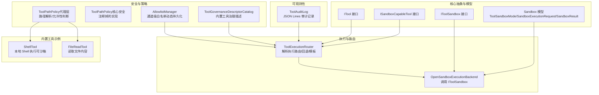
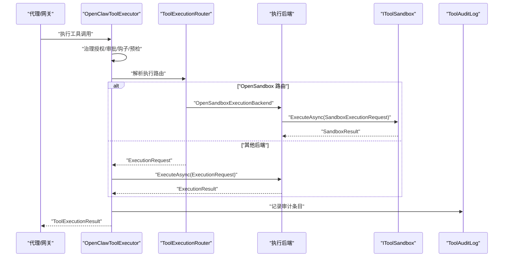
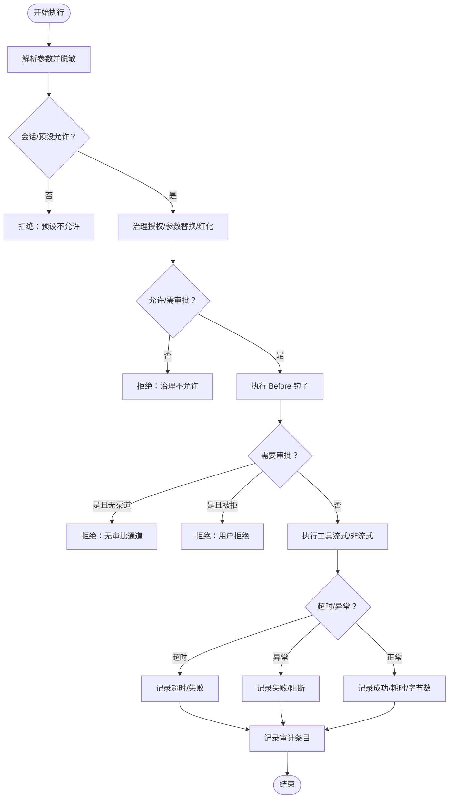
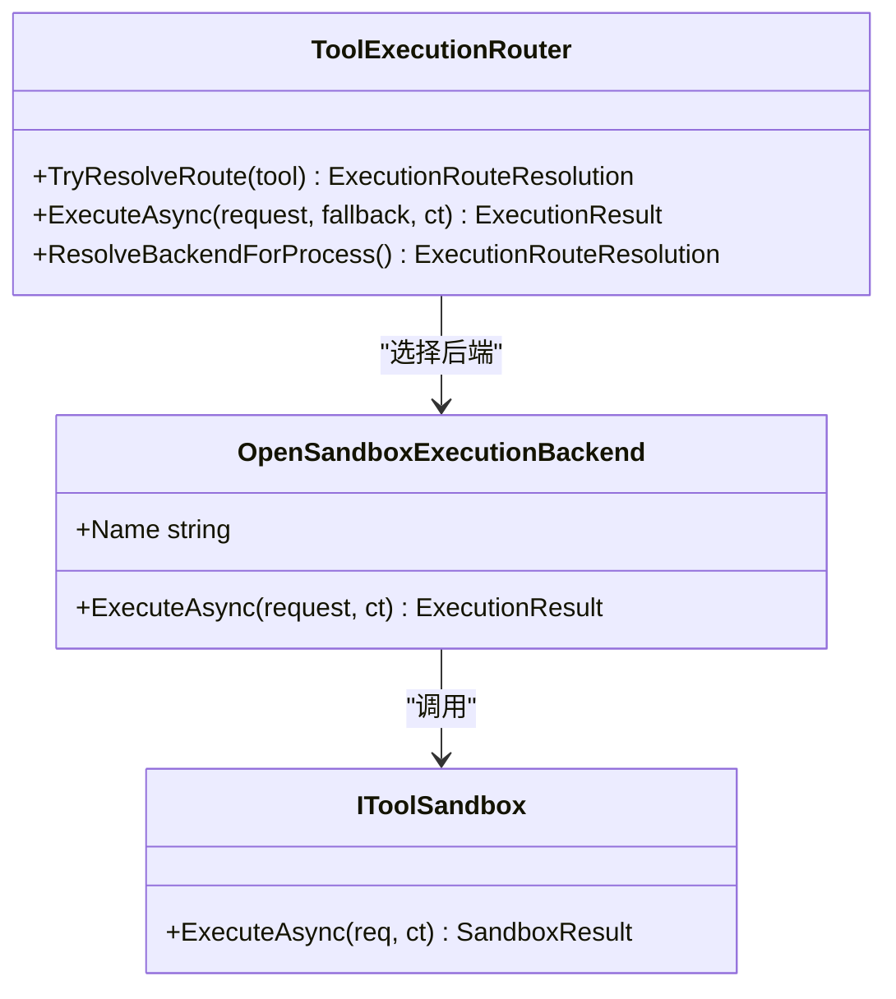
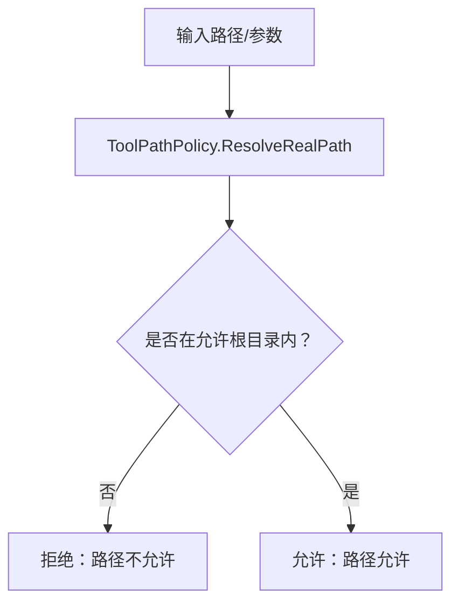
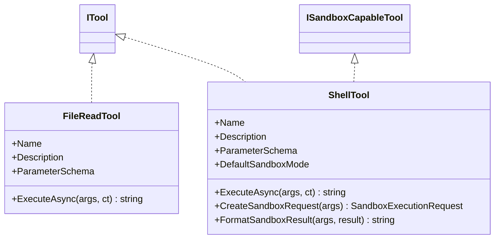
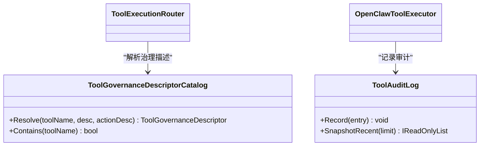
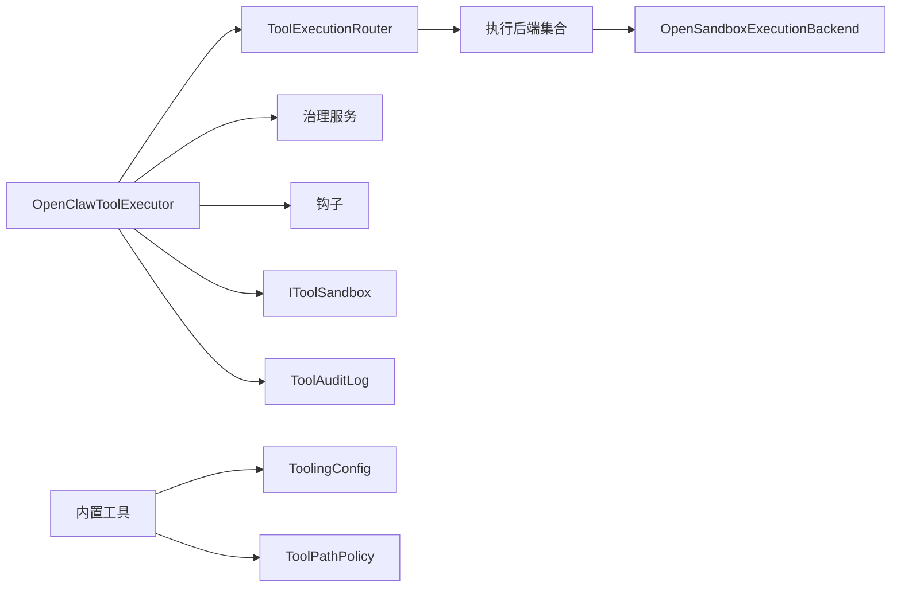

# 工具系统

<cite>
**本文引用的文件**
- [OpenClawToolExecutor.cs](file://src/OpenClaw.Agent/OpenClawToolExecutor.cs)
- [ToolExecutionRouter.cs](file://src/OpenClaw.Agent/Execution/ToolExecutionRouter.cs)
- [OpenSandboxExecutionBackend.cs](file://src/OpenClaw.Agent/Execution/OpenSandboxExecutionBackend.cs)
- [ITool.cs](file://src/OpenClaw.Core/Abstractions/ITool.cs)
- [ISandboxCapableTool.cs](file://src/OpenClaw.Core/Abstractions/ISandboxCapableTool.cs)
- [IToolSandbox.cs](file://src/OpenClaw.Core/Abstractions/IToolSandbox.cs)
- [SandboxModels.cs](file://src/OpenClaw.Core/Models/SandboxModels.cs)
- [ToolPathPolicy.cs（代理层）](file://src/OpenClaw.Agent/Tools/ToolPathPolicy.cs)
- [ToolPathPolicy.cs（核心安全）](file://src/OpenClaw.Core/Security/ToolPathPolicy.cs)
- [FileReadTool.cs](file://src/OpenClaw.Agent/Tools/FileReadTool.cs)
- [ShellTool.cs](file://src/OpenClaw.Agent/Tools/ShellTool.cs)
- [ToolGovernanceDescriptorCatalog.cs](file://src/OpenClaw.Core/Governance/ToolGovernanceDescriptorCatalog.cs)
- [ToolAuditLog.cs](file://src/OpenClaw.Core/Observability/ToolAuditLog.cs)
- [AllowlistManager.cs](file://src/OpenClaw.Core/Security/AllowlistManager.cs)
- [TOOLS_GUIDE.md](file://docs/TOOLS_GUIDE.md)
</cite>

## 目录
1. [简介](#简介)
2. [项目结构](#项目结构)
3. [核心组件](#核心组件)
4. [架构总览](#架构总览)
5. [详细组件分析](#详细组件分析)
6. [依赖关系分析](#依赖关系分析)
7. [性能考量](#性能考量)
8. [故障排除指南](#故障排除指南)
9. [结论](#结论)
10. [附录](#附录)

## 简介
本文件面向“工具系统”的技术文档，覆盖内置工具概览、工具执行后端、工具沙箱机制与权限控制体系；解释工具注册流程、执行策略、安全隔离与审计日志；并提供具体工具实现示例、自定义工具开发指南与最佳实践、配置选项、性能优化建议与常见问题排查方法。目标是帮助开发者与运维人员在保障安全的前提下，高效扩展与使用工具能力。

## 项目结构
工具系统主要分布在以下模块：
- 核心抽象与模型：定义工具接口、沙箱接口与沙箱请求/结果模型
- 执行路由与后端：根据配置与工具特性选择执行后端（本地、Docker、SSH、OpenSandbox）
- 安全与策略：路径白名单、审批与治理、审计日志
- 内置工具：文件读取、Shell命令、浏览器、数据库、MQTT、Notion 等
- 文档与指南：官方工具使用与安全加固建议

**图表来源**
- [ITool.cs:1-17](file://src/OpenClaw.Core/Abstractions/ITool.cs#L1-L17)
- [ISandboxCapableTool.cs:1-14](file://src/OpenClaw.Core/Abstractions/ISandboxCapableTool.cs#L1-L14)
- [IToolSandbox.cs:1-12](file://src/OpenClaw.Core/Abstractions/IToolSandbox.cs#L1-L12)
- [SandboxModels.cs:1-28](file://src/OpenClaw.Core/Models/SandboxModels.cs#L1-L28)
- [ToolExecutionRouter.cs:1-253](file://src/OpenClaw.Agent/Execution/ToolExecutionRouter.cs#L1-L253)
- [OpenSandboxExecutionBackend.cs:1-69](file://src/OpenClaw.Agent/Execution/OpenSandboxExecutionBackend.cs#L1-L69)
- [ToolPathPolicy.cs（代理层）:1-132](file://src/OpenClaw.Agent/Tools/ToolPathPolicy.cs#L1-L132)
- [ToolPathPolicy.cs（核心安全）:1-136](file://src/OpenClaw.Core/Security/ToolPathPolicy.cs#L1-L136)
- [AllowlistManager.cs:1-126](file://src/OpenClaw.Core/Security/AllowlistManager.cs#L1-L126)
- [ToolGovernanceDescriptorCatalog.cs:1-181](file://src/OpenClaw.Core/Governance/ToolGovernanceDescriptorCatalog.cs#L1-L181)
- [FileReadTool.cs:1-66](file://src/OpenClaw.Agent/Tools/FileReadTool.cs#L1-L66)
- [ShellTool.cs:1-193](file://src/OpenClaw.Agent/Tools/ShellTool.cs#L1-L193)
- [ToolAuditLog.cs:1-125](file://src/OpenClaw.Core/Observability/ToolAuditLog.cs#L1-L125)

**章节来源**
- [OpenClawToolExecutor.cs:1-1059](file://src/OpenClaw.Agent/OpenClawToolExecutor.cs#L1-L1059)
- [ToolExecutionRouter.cs:1-253](file://src/OpenClaw.Agent/Execution/ToolExecutionRouter.cs#L1-L253)
- [OpenSandboxExecutionBackend.cs:1-69](file://src/OpenClaw.Agent/Execution/OpenSandboxExecutionBackend.cs#L1-L69)
- [ITool.cs:1-17](file://src/OpenClaw.Core/Abstractions/ITool.cs#L1-L17)
- [ISandboxCapableTool.cs:1-14](file://src/OpenClaw.Core/Abstractions/ISandboxCapableTool.cs#L1-L14)
- [IToolSandbox.cs:1-12](file://src/OpenClaw.Core/Abstractions/IToolSandbox.cs#L1-L12)
- [SandboxModels.cs:1-28](file://src/OpenClaw.Core/Models/SandboxModels.cs#L1-L28)
- [ToolPathPolicy.cs（代理层）:1-132](file://src/OpenClaw.Agent/Tools/ToolPathPolicy.cs#L1-L132)
- [ToolPathPolicy.cs（核心安全）:1-136](file://src/OpenClaw.Core/Security/ToolPathPolicy.cs#L1-L136)
- [AllowlistManager.cs:1-126](file://src/OpenClaw.Core/Security/AllowlistManager.cs#L1-L126)
- [ToolGovernanceDescriptorCatalog.cs:1-181](file://src/OpenClaw.Core/Governance/ToolGovernanceDescriptorCatalog.cs#L1-L181)
- [FileReadTool.cs:1-66](file://src/OpenClaw.Agent/Tools/FileReadTool.cs#L1-L66)
- [ShellTool.cs:1-193](file://src/OpenClaw.Agent/Tools/ShellTool.cs#L1-L193)
- [ToolAuditLog.cs:1-125](file://src/OpenClaw.Core/Observability/ToolAuditLog.cs#L1-L125)
- [TOOLS_GUIDE.md:1-405](file://docs/TOOLS_GUIDE.md#L1-L405)

## 核心组件
- 工具接口与沙箱能力
  - ITool：最小化接口，仅包含名称、描述、参数模式与异步执行方法，便于 AOT 削减
  - ISandboxCapableTool：声明默认沙箱模式、如何构造沙箱请求、如何格式化沙箱结果
  - IToolSandbox：统一的沙箱执行接口，返回退出码与标准输出/错误
  - 沙箱模型：ToolSandboxMode（None/Prefer/Require）、SandboxExecutionRequest、SandboxResult

- 执行路由与后端
  - ToolExecutionRouter：根据工具名与配置解析执行后端、回退后端、模板与工作区需求；支持本地、Docker、SSH、OpenSandbox 后端
  - OpenSandboxExecutionBackend：封装 IToolSandbox 调用，统一超时处理与结果转换

- 安全与策略
  - ToolPathPolicy（代理层）：路径解析与允许性判断，支持符号链接解析、大小写敏感/不敏感比较、根目录判定
  - AllowlistManager：按通道持久化白名单，动态更新与并发保护
  - ToolGovernanceDescriptorCatalog：内置工具治理描述（类别、风险等级、是否需要审批、能力集合等）

- 内置工具示例
  - FileReadTool：受路径策略限制的文件读取，带最大行数限制
  - ShellTool：本地 Shell 执行，支持超时与输出截断，可作为沙箱工具

- 审计与可观测性
  - ToolAuditLog：线程安全的 JSON Lines 审计记录器，记录关键元数据与治理决策

**章节来源**
- [ITool.cs:1-17](file://src/OpenClaw.Core/Abstractions/ITool.cs#L1-L17)
- [ISandboxCapableTool.cs:1-14](file://src/OpenClaw.Core/Abstractions/ISandboxCapableTool.cs#L1-L14)
- [IToolSandbox.cs:1-12](file://src/OpenClaw.Core/Abstractions/IToolSandbox.cs#L1-L12)
- [SandboxModels.cs:1-28](file://src/OpenClaw.Core/Models/SandboxModels.cs#L1-L28)
- [ToolExecutionRouter.cs:1-253](file://src/OpenClaw.Agent/Execution/ToolExecutionRouter.cs#L1-L253)
- [OpenSandboxExecutionBackend.cs:1-69](file://src/OpenClaw.Agent/Execution/OpenSandboxExecutionBackend.cs#L1-L69)
- [ToolPathPolicy.cs（代理层）:1-132](file://src/OpenClaw.Agent/Tools/ToolPathPolicy.cs#L1-L132)
- [AllowlistManager.cs:1-126](file://src/OpenClaw.Core/Security/AllowlistManager.cs#L1-L126)
- [ToolGovernanceDescriptorCatalog.cs:1-181](file://src/OpenClaw.Core/Governance/ToolGovernanceDescriptorCatalog.cs#L1-L181)
- [FileReadTool.cs:1-66](file://src/OpenClaw.Agent/Tools/FileReadTool.cs#L1-L66)
- [ShellTool.cs:1-193](file://src/OpenClaw.Agent/Tools/ShellTool.cs#L1-L193)
- [ToolAuditLog.cs:1-125](file://src/OpenClaw.Core/Observability/ToolAuditLog.cs#L1-L125)

## 架构总览
工具系统采用“执行路由 + 多后端 + 治理/审批/审计”的分层设计。执行前进行治理授权与审批决策，再通过路由选择合适的后端执行；对可沙箱工具优先走 OpenSandbox 后端以实现更强隔离。

**图表来源**
- [OpenClawToolExecutor.cs:134-630](file://src/OpenClaw.Agent/OpenClawToolExecutor.cs#L134-L630)
- [ToolExecutionRouter.cs:65-157](file://src/OpenClaw.Agent/Execution/ToolExecutionRouter.cs#L65-L157)
- [OpenSandboxExecutionBackend.cs:22-67](file://src/OpenClaw.Agent/Execution/OpenSandboxExecutionBackend.cs#L22-L67)
- [IToolSandbox.cs:1-12](file://src/OpenClaw.Core/Abstractions/IToolSandbox.cs#L1-L12)
- [ToolAuditLog.cs:72-95](file://src/OpenClaw.Core/Observability/ToolAuditLog.cs#L72-L95)

## 详细组件分析

### 组件一：工具执行器（OpenClawToolExecutor）
- 职责
  - 注册工具、生成工具声明、支持热重载替换 MCP 工具
  - 执行前进行会话/预设/治理授权/审批/钩子检查
  - 选择执行后端并收集结果，记录指标、审计与使用统计
- 关键流程
  - 参数脱敏与红化、治理授权（含参数替换/红化）、审批决策（含指纹校验）
  - 钩子 Before/After 执行、Sentinel 替换、超时与异常分类处理
  - 记录治理结果与审计条目，上报度量与使用追踪

**图表来源**
- [OpenClawToolExecutor.cs:134-630](file://src/OpenClaw.Agent/OpenClawToolExecutor.cs#L134-L630)
- [ToolAuditLog.cs:72-95](file://src/OpenClaw.Core/Observability/ToolAuditLog.cs#L72-L95)

**章节来源**
- [OpenClawToolExecutor.cs:1-1059](file://src/OpenClaw.Agent/OpenClawToolExecutor.cs#L1-L1059)

### 组件二：执行路由与后端（ToolExecutionRouter / OpenSandboxExecutionBackend）
- 路由解析
  - 支持按工具名配置执行后端、回退后端、模板与工作区需求
  - 对可沙箱工具解析沙箱模式与模板，优先 OpenSandbox 后端
- 后端执行
  - OpenSandboxExecutionBackend 将 ExecutionRequest 转换为 SandboxExecutionRequest 并调用 IToolSandbox
  - 统一超时处理与结果封装

**图表来源**
- [ToolExecutionRouter.cs:1-253](file://src/OpenClaw.Agent/Execution/ToolExecutionRouter.cs#L1-L253)
- [OpenSandboxExecutionBackend.cs:1-69](file://src/OpenClaw.Agent/Execution/OpenSandboxExecutionBackend.cs#L1-L69)
- [IToolSandbox.cs:1-12](file://src/OpenClaw.Core/Abstractions/IToolSandbox.cs#L1-L12)

**章节来源**
- [ToolExecutionRouter.cs:1-253](file://src/OpenClaw.Agent/Execution/ToolExecutionRouter.cs#L1-L253)
- [OpenSandboxExecutionBackend.cs:1-69](file://src/OpenClaw.Agent/Execution/OpenSandboxExecutionBackend.cs#L1-L69)

### 组件三：工具沙箱机制与权限控制
- 沙箱能力
  - 可沙箱工具通过 ISandboxCapableTool 提供默认沙箱模式、沙箱请求与结果格式化
  - ToolExecutionRouter 解析沙箱模式与模板，必要时强制走 OpenSandbox 后端
- 权限控制
  - 文件路径策略：代理层 ToolPathPolicy 提供路径解析与允许性判断
  - 通道白名单：AllowlistManager 支持动态持久化白名单
  - 治理描述：内置工具治理描述决定风险等级、是否需要审批与能力集合

**图表来源**
- [ToolPathPolicy.cs（代理层）:42-130](file://src/OpenClaw.Agent/Tools/ToolPathPolicy.cs#L42-L130)
- [FileReadTool.cs:19-32](file://src/OpenClaw.Agent/Tools/FileReadTool.cs#L19-L32)
- [ShellTool.cs:115-157](file://src/OpenClaw.Agent/Tools/ShellTool.cs#L115-L157)

**章节来源**
- [ISandboxCapableTool.cs:1-14](file://src/OpenClaw.Core/Abstractions/ISandboxCapableTool.cs#L1-L14)
- [ToolExecutionRouter.cs:65-112](file://src/OpenClaw.Agent/Execution/ToolExecutionRouter.cs#L65-L112)
- [ToolPathPolicy.cs（代理层）:1-132](file://src/OpenClaw.Agent/Tools/ToolPathPolicy.cs#L1-L132)
- [AllowlistManager.cs:1-126](file://src/OpenClaw.Core/Security/AllowlistManager.cs#L1-L126)
- [ToolGovernanceDescriptorCatalog.cs:1-181](file://src/OpenClaw.Core/Governance/ToolGovernanceDescriptorCatalog.cs#L1-L181)

### 组件四：内置工具示例与实现要点
- FileReadTool
  - 读取文件内容，受 ToolPathPolicy 与 ToolingConfig 限制
  - 输出行数上限，避免上下文溢出
- ShellTool
  - 本地 Shell 执行，支持超时与输出截断
  - 实现 ISandboxCapableTool，可构造沙箱请求与格式化结果

**图表来源**
- [FileReadTool.cs:1-66](file://src/OpenClaw.Agent/Tools/FileReadTool.cs#L1-L66)
- [ShellTool.cs:1-193](file://src/OpenClaw.Agent/Tools/ShellTool.cs#L1-L193)
- [ITool.cs:1-17](file://src/OpenClaw.Core/Abstractions/ITool.cs#L1-L17)
- [ISandboxCapableTool.cs:1-14](file://src/OpenClaw.Core/Abstractions/ISandboxCapableTool.cs#L1-L14)

**章节来源**
- [FileReadTool.cs:1-66](file://src/OpenClaw.Agent/Tools/FileReadTool.cs#L1-L66)
- [ShellTool.cs:1-193](file://src/OpenClaw.Agent/Tools/ShellTool.cs#L1-L193)

### 组件五：治理与审计
- 治理描述目录
  - 内置工具治理描述，包含类别、风险等级、是否需要审批、能力集合等
- 审计日志
  - ToolAuditLog 以 JSON Lines 追加写入，记录关键元数据与治理决策，避免泄露原始载荷

**图表来源**
- [ToolGovernanceDescriptorCatalog.cs:1-181](file://src/OpenClaw.Core/Governance/ToolGovernanceDescriptorCatalog.cs#L1-L181)
- [ToolAuditLog.cs:1-125](file://src/OpenClaw.Core/Observability/ToolAuditLog.cs#L1-L125)
- [OpenClawToolExecutor.cs:545-577](file://src/OpenClaw.Agent/OpenClawToolExecutor.cs#L545-L577)

**章节来源**
- [ToolGovernanceDescriptorCatalog.cs:1-181](file://src/OpenClaw.Core/Governance/ToolGovernanceDescriptorCatalog.cs#L1-L181)
- [ToolAuditLog.cs:1-125](file://src/OpenClaw.Core/Observability/ToolAuditLog.cs#L1-L125)

## 依赖关系分析
- 组件耦合
  - OpenClawToolExecutor 依赖治理服务、审批回调、钩子、沙箱、审计、红化与使用追踪
  - ToolExecutionRouter 依赖配置与后端注册表，对可沙箱工具有强依赖 OpenSandbox 后端
  - 工具实现依赖 ToolingConfig 与 ToolPathPolicy（如 FileReadTool、ShellTool）
- 外部集成点
  - IToolSandbox 与外部沙箱服务对接
  - 治理服务可接入 Sidecar 或策略引擎
  - 审计日志可对接集中化日志平台

**图表来源**
- [OpenClawToolExecutor.cs:1-100](file://src/OpenClaw.Agent/OpenClawToolExecutor.cs#L1-L100)
- [ToolExecutionRouter.cs:1-63](file://src/OpenClaw.Agent/Execution/ToolExecutionRouter.cs#L1-L63)
- [OpenSandboxExecutionBackend.cs:1-18](file://src/OpenClaw.Agent/Execution/OpenSandboxExecutionBackend.cs#L1-L18)
- [FileReadTool.cs:1-13](file://src/OpenClaw.Agent/Tools/FileReadTool.cs#L1-L13)
- [ShellTool.cs:1-15](file://src/OpenClaw.Agent/Tools/ShellTool.cs#L1-L15)

**章节来源**
- [OpenClawToolExecutor.cs:1-100](file://src/OpenClaw.Agent/OpenClawToolExecutor.cs#L1-L100)
- [ToolExecutionRouter.cs:1-63](file://src/OpenClaw.Agent/Execution/ToolExecutionRouter.cs#L1-L63)

## 性能考量
- 执行超时与资源限制
  - 工具执行器与 OpenSandbox 后端均设置超时，避免长时间占用
  - ShellTool 对输出进行截断，防止大输出导致内存压力
- I/O 与并发
  - 文件读取使用顺序访问与共享读取，减少锁争用
  - 审计日志采用追加写与近期缓冲，降低频繁 IO
- AOT 兼容
  - ITool 接口极简，有利于 AOT 削减与启动性能

[本节为通用性能讨论，无需特定文件引用]

## 故障排除指南
- 工具未找到或被拒绝
  - 检查工具声明与会话/预设允许列表
  - 查看治理授权结果与原因
- 路径访问被拒绝
  - 核对 Tooling 的 AllowedReadRoots/AllowedWriteRoots 与 WorkspaceOnly/WorkspaceRoot
  - 使用 ToolPathPolicy 的路径解析逻辑定位真实路径
- 审批未通过
  - 确认审批通道可用与审批指纹未变更
  - 在受控绑定下启用请求者匹配策略
- 治理不可用或拒绝
  - 检查治理 Sidecar 可用性与 fail-open/fail-closed 策略
  - 查看审计条目中的治理策略 ID、规则 ID、信任分与评估耗时
- 审计与诊断
  - 使用 ToolAuditLog 的最近快照查看近期执行情况
  - 参考官方“医生”诊断端点获取安全与运行状态摘要

**章节来源**
- [OpenClawToolExecutor.cs:167-196](file://src/OpenClaw.Agent/OpenClawToolExecutor.cs#L167-L196)
- [OpenClawToolExecutor.cs:214-305](file://src/OpenClaw.Agent/OpenClawToolExecutor.cs#L214-L305)
- [ToolAuditLog.cs:97-108](file://src/OpenClaw.Core/Observability/ToolAuditLog.cs#L97-L108)
- [TOOLS_GUIDE.md:352-358](file://docs/TOOLS_GUIDE.md#L352-L358)

## 结论
工具系统通过清晰的抽象、灵活的执行路由、严格的治理与审批、完善的审计与安全策略，实现了在保证安全前提下的高扩展性与高性能。内置工具与可插拔后端的设计使得系统既能满足日常自动化需求，又能在复杂环境中实现强隔离与可追溯。

[本节为总结性内容，无需特定文件引用]

## 附录

### 自定义工具开发指南
- 实现 ITool 或可沙箱工具
  - 最小化实现 ITool，提供名称、描述、参数模式与异步执行
  - 如需沙箱，实现 ISandboxCapableTool 并提供默认沙箱模式与请求构造
- 安全与合规
  - 严格遵循 Tooling 配置与路径策略
  - 对外部输入进行参数校验与红化处理
  - 明确工具的风险等级与是否需要审批
- 治理与审计
  - 通过治理描述目录完善工具治理信息
  - 记录审计条目，确保可追溯

**章节来源**
- [ITool.cs:1-17](file://src/OpenClaw.Core/Abstractions/ITool.cs#L1-L17)
- [ISandboxCapableTool.cs:1-14](file://src/OpenClaw.Core/Abstractions/ISandboxCapableTool.cs#L1-L14)
- [ToolGovernanceDescriptorCatalog.cs:1-181](file://src/OpenClaw.Core/Governance/ToolGovernanceDescriptorCatalog.cs#L1-L181)
- [ToolAuditLog.cs:1-125](file://src/OpenClaw.Core/Observability/ToolAuditLog.cs#L1-L125)

### 工具配置选项与最佳实践
- 路径与工作区
  - AllowedReadRoots/AllowedWriteRoots、WorkspaceOnly/WorkspaceRoot
- 执行与沙箱
  - ExecutionProfiles、默认后端、OpenSandbox 提供商配置
- 审批与治理
  - RequireToolApproval、ApprovalRequiredTools、AutonomyMode
- 安全加固
  - 参考官方工具指南中的分阶段加固配置片段与审批流程

**章节来源**
- [TOOLS_GUIDE.md:195-321](file://docs/TOOLS_GUIDE.md#L195-L321)
- [ToolExecutionRouter.cs:20-63](file://src/OpenClaw.Agent/Execution/ToolExecutionRouter.cs#L20-L63)
- [OpenSandboxExecutionBackend.cs:13-18](file://src/OpenClaw.Agent/Execution/OpenSandboxExecutionBackend.cs#L13-L18)