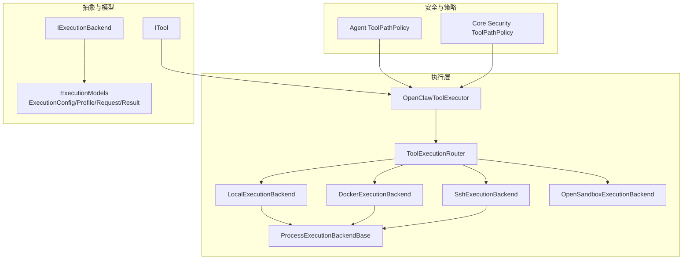
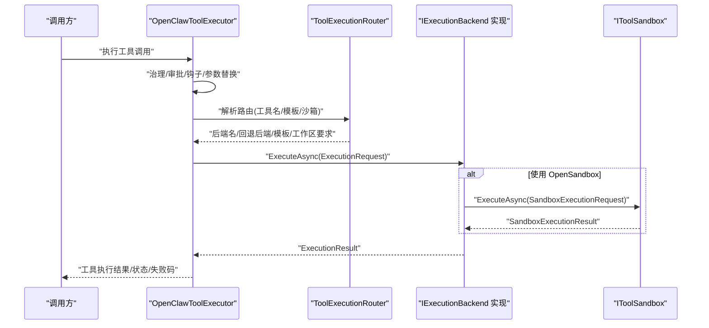
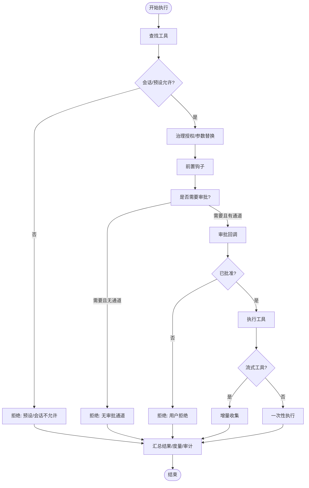
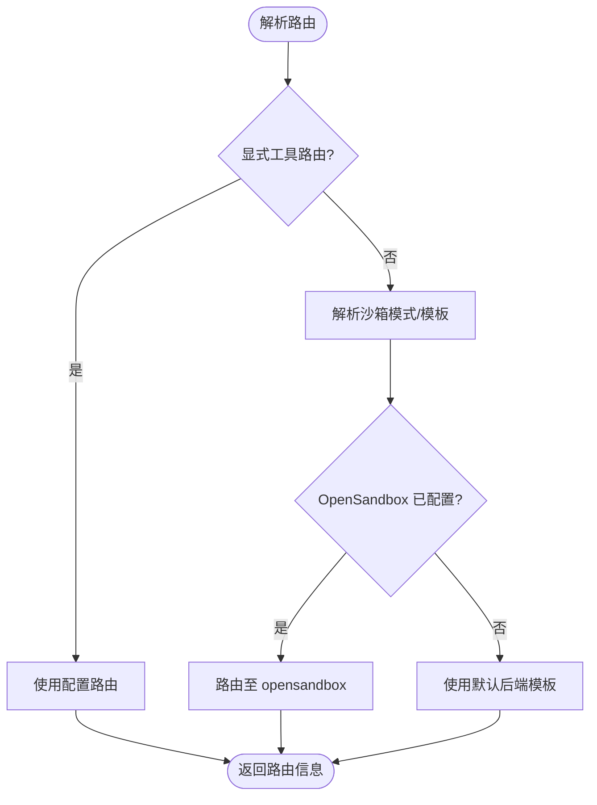
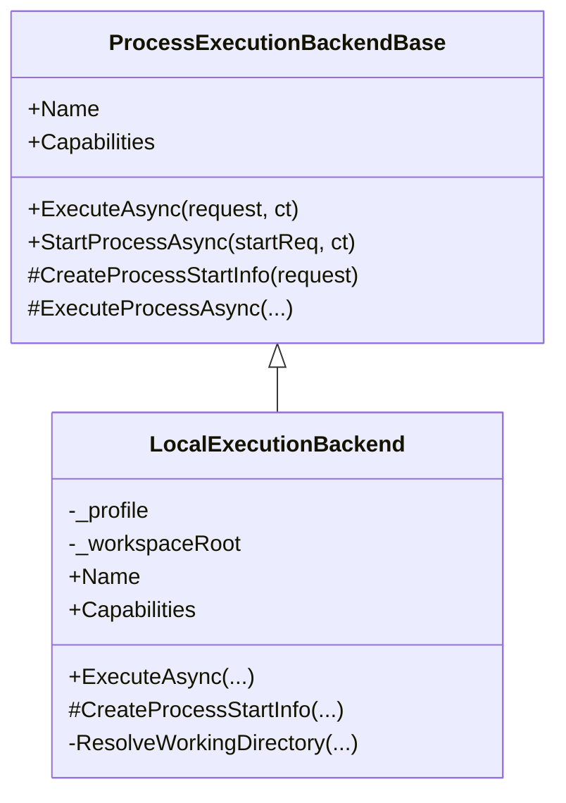
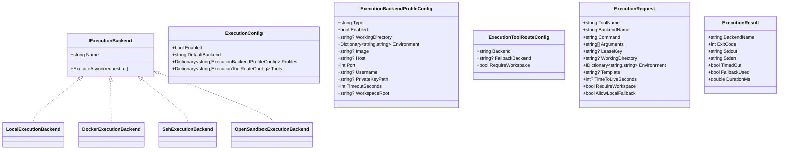
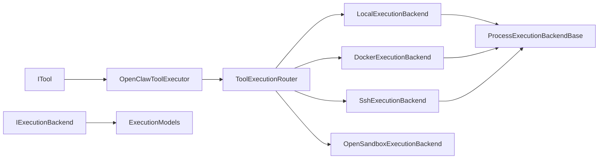

# 工具系统

<cite>
**本文引用的文件**
- [ToolExecutionRouter.cs](file://src/OpenClaw.Agent/Execution/ToolExecutionRouter.cs)
- [LocalExecutionBackend.cs](file://src/OpenClaw.Agent/Execution/LocalExecutionBackend.cs)
- [DockerExecutionBackend.cs](file://src/OpenClaw.Agent/Execution/DockerExecutionBackend.cs)
- [SshExecutionBackend.cs](file://src/OpenClaw.Agent/Execution/SshExecutionBackend.cs)
- [OpenSandboxExecutionBackend.cs](file://src/OpenClaw.Agent/Execution/OpenSandboxExecutionBackend.cs)
- [ProcessExecutionBackendBase.cs](file://src/OpenClaw.Agent/Execution/ProcessExecutionBackendBase.cs)
- [IExecutionBackend.cs](file://src/OpenClaw.Core/Abstractions/IExecutionBackend.cs)
- [ExecutionModels.cs](file://src/OpenClaw.Core/Models/ExecutionModels.cs)
- [OpenClawToolExecutor.cs](file://src/OpenClaw.Agent/OpenClawToolExecutor.cs)
- [ToolPathPolicy.cs（Agent）](file://src/OpenClaw.Agent/Tools/ToolPathPolicy.cs)
- [ToolPathPolicy.cs（Core 安全）](file://src/OpenClaw.Core/Security/ToolPathPolicy.cs)
- [ITool.cs](file://src/OpenClaw.Core/Abstractions/ITool.cs)
- [TOOLS_GUIDE.md](file://docs/TOOLS_GUIDE.md)
</cite>

## 目录
1. [简介](#简介)
2. [项目结构](#项目结构)
3. [核心组件](#核心组件)
4. [架构总览](#架构总览)
5. [详细组件分析](#详细组件分析)
6. [依赖关系分析](#依赖关系分析)
7. [性能考量](#性能考量)
8. [故障排除指南](#故障排除指南)
9. [结论](#结论)
10. [附录](#附录)

## 简介
本技术文档围绕工具系统的执行器、路由策略与执行后端进行深入解析，覆盖本地执行、Docker 执行、SSH 执行与 OpenSandbox 沙箱执行；阐述工具的注册、发现、权限控制与安全策略；解释工具生命周期管理、错误处理与重试机制；并提供内置工具说明、自定义工具开发指南与最佳实践、配置示例与故障排除建议。

## 项目结构
工具系统主要分布在以下模块：
- 执行层：工具执行器负责整体编排、治理、审批、审计与度量；执行路由器负责根据配置与沙箱策略选择后端；后端实现包括本地、Docker、SSH 与 OpenSandbox。
- 抽象与模型：定义执行后端接口、执行请求/结果与后端能力等数据结构。
- 安全与路径策略：提供文件读写根目录限制、符号链接解析与路径判定逻辑。
- 文档与指南：提供内置工具清单、配置要点与安全加固建议。

**图表来源**
- [OpenClawToolExecutor.cs:30-100](file://src/OpenClaw.Agent/OpenClawToolExecutor.cs#L30-L100)
- [ToolExecutionRouter.cs:7-63](file://src/OpenClaw.Agent/Execution/ToolExecutionRouter.cs#L7-L63)
- [LocalExecutionBackend.cs:6-28](file://src/OpenClaw.Agent/Execution/LocalExecutionBackend.cs#L6-L28)
- [DockerExecutionBackend.cs:6-20](file://src/OpenClaw.Agent/Execution/DockerExecutionBackend.cs#L6-L20)
- [SshExecutionBackend.cs:6-20](file://src/OpenClaw.Agent/Execution/SshExecutionBackend.cs#L6-L20)
- [OpenSandboxExecutionBackend.cs:7-20](file://src/OpenClaw.Agent/Execution/OpenSandboxExecutionBackend.cs#L7-L20)
- [ProcessExecutionBackendBase.cs:8-21](file://src/OpenClaw.Agent/Execution/ProcessExecutionBackendBase.cs#L8-L21)
- [IExecutionBackend.cs:5-12](file://src/OpenClaw.Core/Abstractions/IExecutionBackend.cs#L5-L12)
- [ExecutionModels.cs:8-86](file://src/OpenClaw.Core/Models/ExecutionModels.cs#L8-L86)
- [ITool.cs:6-16](file://src/OpenClaw.Core/Abstractions/ITool.cs#L6-L16)
- [ToolPathPolicy.cs（Agent）:5-35](file://src/OpenClaw.Agent/Tools/ToolPathPolicy.cs#L5-L35)
- [ToolPathPolicy.cs（Core 安全）:5-33](file://src/OpenClaw.Core/Security/ToolPathPolicy.cs#L5-L33)

**章节来源**
- [OpenClawToolExecutor.cs:30-100](file://src/OpenClaw.Agent/OpenClawToolExecutor.cs#L30-L100)
- [ToolExecutionRouter.cs:7-63](file://src/OpenClaw.Agent/Execution/ToolExecutionRouter.cs#L7-L63)
- [ExecutionModels.cs:8-86](file://src/OpenClaw.Core/Models/ExecutionModels.cs#L8-L86)

## 核心组件
- 工具执行器（OpenClawToolExecutor）
  - 负责工具声明生成、会话级工具过滤、治理授权、审批流程、钩子（Hook）前后置回调、流式工具执行、超时与失败分类、度量与审计记录。
- 执行路由器（ToolExecutionRouter）
  - 基于配置与沙箱策略解析工具到后端的路由，支持显式路由与基于沙箱模式的隐式路由，并提供回退后端与工作区要求判断。
- 执行后端（IExecutionBackend 实现）
  - 本地、Docker、SSH、OpenSandbox 四类后端均通过统一接口执行命令，部分后端继承进程基类以复用进程启动、输出捕获与超时处理。
- 抽象与模型
  - IExecutionBackend 定义后端名称与异步执行；ExecutionModels 提供执行配置、后端配置、工具路由配置、执行请求/结果与进程相关模型。
- 工具抽象（ITool）
  - 最小化接口，仅包含名称、描述、参数模式与异步执行方法，便于 AOT 剪枝。

**章节来源**
- [OpenClawToolExecutor.cs:30-100](file://src/OpenClaw.Agent/OpenClawToolExecutor.cs#L30-L100)
- [ToolExecutionRouter.cs:7-63](file://src/OpenClaw.Agent/Execution/ToolExecutionRouter.cs#L7-L63)
- [IExecutionBackend.cs:5-12](file://src/OpenClaw.Core/Abstractions/IExecutionBackend.cs#L5-L12)
- [ExecutionModels.cs:62-86](file://src/OpenClaw.Core/Models/ExecutionModels.cs#L62-L86)
- [ITool.cs:6-16](file://src/OpenClaw.Core/Abstractions/ITool.cs#L6-L16)

## 架构总览
工具系统采用“执行器 + 路由器 + 后端”的分层设计：
- 执行器在调用前完成治理、审批、钩子与参数替换，再委托路由器选择后端执行。
- 路由器根据工具名或“process/shell”预设解析后端与模板，必要时启用 OpenSandbox 沙箱。
- 后端统一返回标准化执行结果，执行器负责错误分类、度量与审计。

**图表来源**
- [OpenClawToolExecutor.cs:134-630](file://src/OpenClaw.Agent/OpenClawToolExecutor.cs#L134-L630)
- [ToolExecutionRouter.cs:114-157](file://src/OpenClaw.Agent/Execution/ToolExecutionRouter.cs#L114-L157)
- [OpenSandboxExecutionBackend.cs:22-67](file://src/OpenClaw.Agent/Execution/OpenSandboxExecutionBackend.cs#L22-L67)

**章节来源**
- [OpenClawToolExecutor.cs:134-630](file://src/OpenClaw.Agent/OpenClawToolExecutor.cs#L134-L630)
- [ToolExecutionRouter.cs:65-157](file://src/OpenClaw.Agent/Execution/ToolExecutionRouter.cs#L65-L157)

## 详细组件分析

### 执行器（OpenClawToolExecutor）
- 工具注册与发现
  - 通过构造函数接收工具集合，按名称字典化以便快速查找；支持热更新 MCP 工具并原子替换。
- 权限与治理
  - 会话级工具允许性检查、预设工具集限制、治理服务授权决策、敏感参数红化与替换。
- 审批与钩子
  - 支持审批回调与前后置钩子，对变更后的动作指纹进行校验，防止批准后参数漂移。
- 流式工具
  - 对实现 IStreamingTool 的工具，支持增量回调收集结果。
- 错误处理与分类
  - 统一捕获超时、沙箱异常与通用异常，分类失败码并生成阻断/失败状态与下一步建议。
- 度量与审计
  - 记录工具调用次数、超时次数、耗时分布、治理决策与审计条目。

**图表来源**
- [OpenClawToolExecutor.cs:167-630](file://src/OpenClaw.Agent/OpenClawToolExecutor.cs#L167-L630)

**章节来源**
- [OpenClawToolExecutor.cs:104-630](file://src/OpenClaw.Agent/OpenClawToolExecutor.cs#L104-L630)

### 执行路由器（ToolExecutionRouter）
- 路由解析
  - 优先匹配显式工具路由；否则对可沙箱工具解析沙箱模式与模板，若配置了 OpenSandbox 提供商则走沙箱路由。
- 后端选择与回退
  - 根据后端名查找实现；若失败且存在回退后端与允许本地回退，则自动切换并返回带回退标记的结果。
- 工作区要求
  - 判断 Docker/SSH 类后端是否需要工作区；默认后端的模板来自后端配置。
- 进程后端识别
  - 识别可启动交互式进程的后端（除 opensandbox 外），用于后续进程管理。

**图表来源**
- [ToolExecutionRouter.cs:65-112](file://src/OpenClaw.Agent/Execution/ToolExecutionRouter.cs#L65-L112)

**章节来源**
- [ToolExecutionRouter.cs:65-203](file://src/OpenClaw.Agent/Execution/ToolExecutionRouter.cs#L65-L203)

### 执行后端

#### 本地执行（LocalExecutionBackend）
- 能力：支持一次性命令、进程、非 Windows 上的伪终端与交互输入。
- 工作目录：支持工作区限制与“仅工作区”要求；不满足时抛出异常。
- 环境变量：合并后端与请求的环境变量，请求优先。

**图表来源**
- [ProcessExecutionBackendBase.cs:8-44](file://src/OpenClaw.Agent/Execution/ProcessExecutionBackendBase.cs#L8-L44)
- [LocalExecutionBackend.cs:6-83](file://src/OpenClaw.Agent/Execution/LocalExecutionBackend.cs#L6-L83)

**章节来源**
- [LocalExecutionBackend.cs:17-83](file://src/OpenClaw.Agent/Execution/LocalExecutionBackend.cs#L17-L83)
- [ProcessExecutionBackendBase.cs:19-128](file://src/OpenClaw.Agent/Execution/ProcessExecutionBackendBase.cs#L19-L128)

#### Docker 执行（DockerExecutionBackend）
- 能力：通过 docker CLI 运行容器，自动清理；支持镜像、工作目录、环境变量注入与命令参数拼接。
- 异常：未配置镜像时报错。

**章节来源**
- [DockerExecutionBackend.cs:17-64](file://src/OpenClaw.Agent/Execution/DockerExecutionBackend.cs#L17-L64)

#### SSH 执行（SshExecutionBackend）
- 能力：通过 ssh 远程执行命令；支持端口、私钥、用户名与主机校验；支持工作目录与环境变量注入。
- 异常：缺少主机或用户名时报错。

**章节来源**
- [SshExecutionBackend.cs:17-61](file://src/OpenClaw.Agent/Execution/SshExecutionBackend.cs#L17-L61)

#### OpenSandbox 执行（OpenSandboxExecutionBackend）
- 能力：委托 IToolSandbox 执行，支持超时控制；超时返回特定结果并标记超时。
- 异常：取消时区分外部取消与超时取消。

**章节来源**
- [OpenSandboxExecutionBackend.cs:20-67](file://src/OpenClaw.Agent/Execution/OpenSandboxExecutionBackend.cs#L20-L67)

### 数据模型与抽象
- IExecutionBackend：后端名称与异步执行接口。
- ExecutionModels：执行配置、后端配置、工具路由配置、执行请求/结果、进程相关模型与状态常量。

**图表来源**
- [IExecutionBackend.cs:5-12](file://src/OpenClaw.Core/Abstractions/IExecutionBackend.cs#L5-L12)
- [ExecutionModels.cs:8-86](file://src/OpenClaw.Core/Models/ExecutionModels.cs#L8-L86)

**章节来源**
- [IExecutionBackend.cs:5-12](file://src/OpenClaw.Core/Abstractions/IExecutionBackend.cs#L5-L12)
- [ExecutionModels.cs:8-86](file://src/OpenClaw.Core/Models/ExecutionModels.cs#L8-L86)

### 安全与路径策略
- Agent 侧 ToolPathPolicy
  - 提供读/写路径允许性判断、真实路径解析（跟随符号链接）、路径归属判定与大小写敏感比较。
- Core 侧 ToolPathPolicy（注释版）
  - 提供文件/目录链接目标解析与路径根判定的参考实现。

**章节来源**
- [ToolPathPolicy.cs（Agent）:5-131](file://src/OpenClaw.Agent/Tools/ToolPathPolicy.cs#L5-L131)
- [ToolPathPolicy.cs（Core 安全）:5-135](file://src/OpenClaw.Core/Security/ToolPathPolicy.cs#L5-L135)

## 依赖关系分析
- 执行器依赖路由器与后端实现；后端实现依赖进程基类以统一进程生命周期与超时处理。
- 路由器依赖配置与沙箱策略；执行器依赖治理、审批、钩子、度量与审计组件。
- 工具抽象最小化，便于 AOT 剪枝与跨运行时兼容。

**图表来源**
- [ITool.cs:6-16](file://src/OpenClaw.Core/Abstractions/ITool.cs#L6-L16)
- [OpenClawToolExecutor.cs:42-50](file://src/OpenClaw.Agent/OpenClawToolExecutor.cs#L42-L50)
- [ToolExecutionRouter.cs:16-62](file://src/OpenClaw.Agent/Execution/ToolExecutionRouter.cs#L16-L62)
- [LocalExecutionBackend.cs:6-17](file://src/OpenClaw.Agent/Execution/LocalExecutionBackend.cs#L6-L17)
- [DockerExecutionBackend.cs:6-17](file://src/OpenClaw.Agent/Execution/DockerExecutionBackend.cs#L6-L17)
- [SshExecutionBackend.cs:6-17](file://src/OpenClaw.Agent/Execution/SshExecutionBackend.cs#L6-L17)
- [OpenSandboxExecutionBackend.cs:7-20](file://src/OpenClaw.Agent/Execution/OpenSandboxExecutionBackend.cs#L7-L20)
- [ProcessExecutionBackendBase.cs:8-17](file://src/OpenClaw.Agent/Execution/ProcessExecutionBackendBase.cs#L8-L17)
- [IExecutionBackend.cs:5-12](file://src/OpenClaw.Core/Abstractions/IExecutionBackend.cs#L5-L12)
- [ExecutionModels.cs:62-86](file://src/OpenClaw.Core/Models/ExecutionModels.cs#L62-L86)

**章节来源**
- [OpenClawToolExecutor.cs:42-50](file://src/OpenClaw.Agent/OpenClawToolExecutor.cs#L42-L50)
- [ToolExecutionRouter.cs:16-62](file://src/OpenClaw.Agent/Execution/ToolExecutionRouter.cs#L16-L62)

## 性能考量
- 进程基类统一处理输出捕获与超时，避免重复实现；超时后尝试终止进程树，减少资源泄漏。
- OpenSandbox 执行受独立超时控制，避免阻塞主流程。
- 执行器对治理与审批结果进行缓存与复用，降低重复计算成本。
- 建议：
  - 合理设置工具超时时间，避免长时间阻塞。
  - 对频繁调用的工具启用治理缓存与审批预审。
  - 使用 Docker/SSH 后端时，尽量复用镜像与连接，减少启动开销。

[本节为通用指导，无需具体文件分析]

## 故障排除指南
- 工具未知或未发现
  - 检查工具是否在执行器注册表中；确认会话预设与路由允许列表。
- 治理拒绝或参数替换无效
  - 核对治理服务可用性与策略；确保替换参数为有效 JSON。
- 需要审批但无审批通道
  - 在支持交互的表面（如浏览器聊天）启用审批，或调整全局审批配置。
- 超时与进程异常
  - 检查后端超时配置；查看进程日志偏移与完成状态；必要时增大超时或优化命令。
- 文件路径被拒绝
  - 核对工作区限制与读写根目录；确认路径解析后仍处于允许范围内。
- OpenSandbox 执行失败
  - 检查沙箱提供程序配置与模板；确认超时与权限设置。

**章节来源**
- [OpenClawToolExecutor.cs:167-630](file://src/OpenClaw.Agent/OpenClawToolExecutor.cs#L167-L630)
- [ToolExecutionRouter.cs:114-157](file://src/OpenClaw.Agent/Execution/ToolExecutionRouter.cs#L114-L157)
- [LocalExecutionBackend.cs:53-83](file://src/OpenClaw.Agent/Execution/LocalExecutionBackend.cs#L53-L83)
- [ToolPathPolicy.cs（Agent）:9-35](file://src/OpenClaw.Agent/Tools/ToolPathPolicy.cs#L9-L35)

## 结论
工具系统通过执行器、路由器与多后端实现，提供了从治理、审批到执行、审计的完整闭环。本地、Docker、SSH 与 OpenSandbox 后端满足不同场景的安全与隔离需求；路径策略与安全钩子共同保障操作边界与合规性。结合内置工具清单与安全加固建议，可在开发与生产环境中平衡易用性与安全性。

[本节为总结，无需具体文件分析]

## 附录

### 内置工具与配置要点
- 参考工具指南，了解核心工具与原生插件工具的启用方式、关键配置项与安全建议。
- 建议按“兼容优先 → 监督运营 → 只读锁定”的梯度强化安全策略。

**章节来源**
- [TOOLS_GUIDE.md:1-405](file://docs/TOOLS_GUIDE.md#L1-L405)

### 自定义工具开发指南与最佳实践
- 实现 ITool 接口，提供稳定名称、描述与参数模式；在 AOT 场景下保持最小依赖。
- 对可能产生副作用的工具，实现动作描述提供者以支持治理与审批策略。
- 使用钩子扩展前后置行为；对敏感参数进行红化与哨兵替换。
- 为工具提供清晰的错误码与下一步建议，提升可观测性与可维护性。

**章节来源**
- [ITool.cs:6-16](file://src/OpenClaw.Core/Abstractions/ITool.cs#L6-L16)
- [OpenClawToolExecutor.cs:198-305](file://src/OpenClaw.Agent/OpenClawToolExecutor.cs#L198-L305)

### 执行后端对比与选型建议
- 本地执行：适合低风险、低隔离需求的命令；注意工作区限制与路径策略。
- Docker 执行：适合需要隔离与一致性的任务；需准备镜像与网络。
- SSH 执行：适合远程节点自动化；需正确配置主机、用户与密钥。
- OpenSandbox：适合高隔离与受限执行；需配置沙箱提供程序与模板。

**章节来源**
- [LocalExecutionBackend.cs:17-25](file://src/OpenClaw.Agent/Execution/LocalExecutionBackend.cs#L17-L25)
- [DockerExecutionBackend.cs:17-20](file://src/OpenClaw.Agent/Execution/DockerExecutionBackend.cs#L17-L20)
- [SshExecutionBackend.cs:17-20](file://src/OpenClaw.Agent/Execution/SshExecutionBackend.cs#L17-L20)
- [OpenSandboxExecutionBackend.cs:20-20](file://src/OpenClaw.Agent/Execution/OpenSandboxExecutionBackend.cs#L20-L20)

### 配置示例与参考
- 工具执行配置（默认后端、后端配置、工具路由）与执行请求/结果模型可作为配置参考。
- 安全加固配置片段可直接合并到应用设置中，按环境调整。

**章节来源**
- [ExecutionModels.cs:8-86](file://src/OpenClaw.Core/Models/ExecutionModels.cs#L8-L86)
- [TOOLS_GUIDE.md:242-321](file://docs/TOOLS_GUIDE.md#L242-L321)