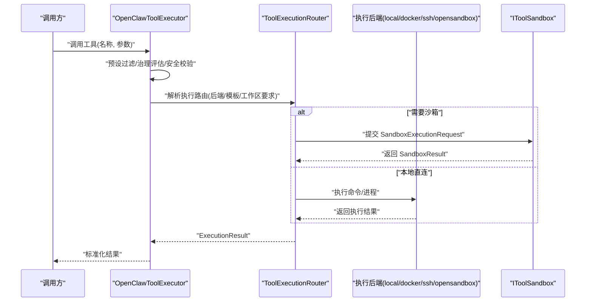
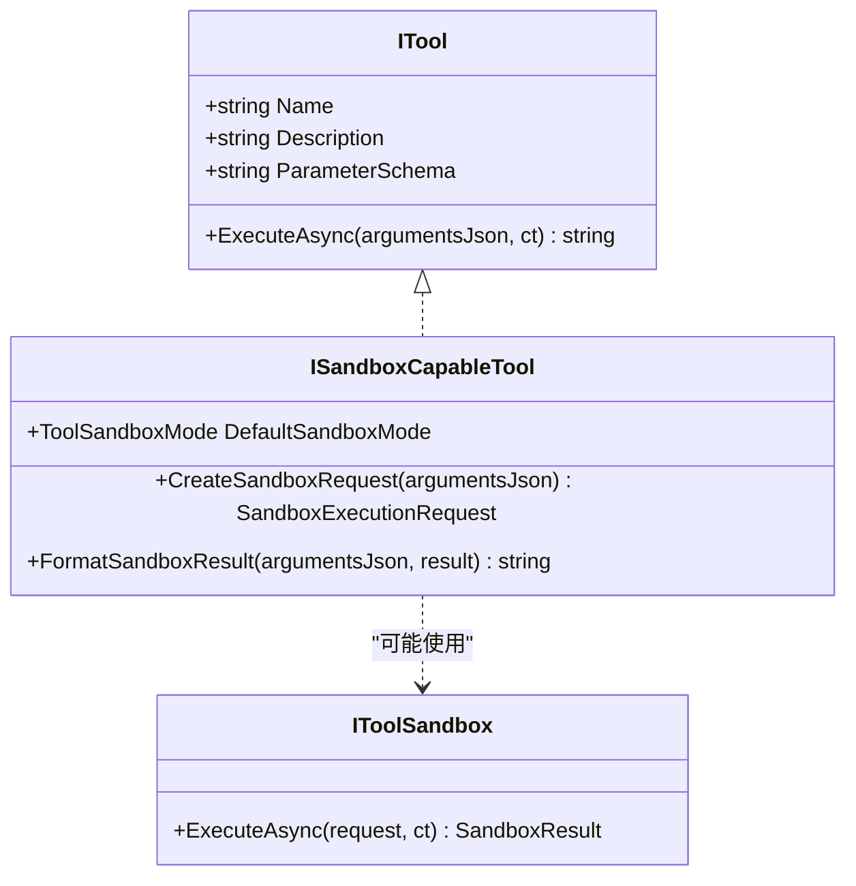
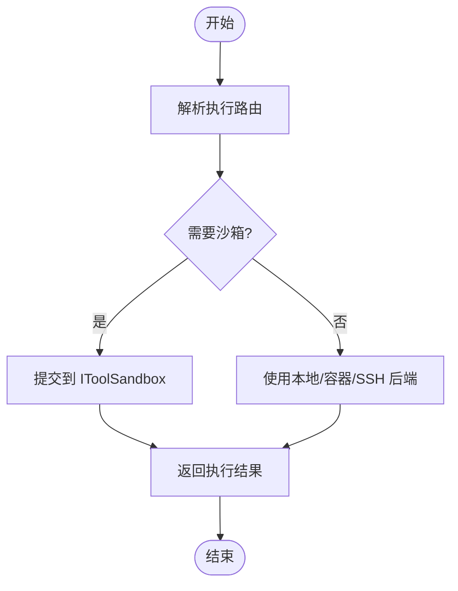
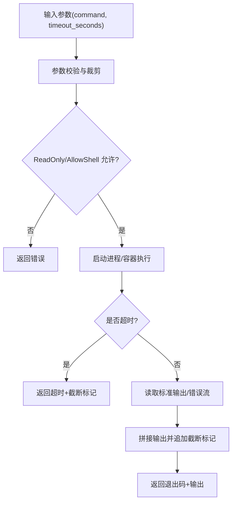
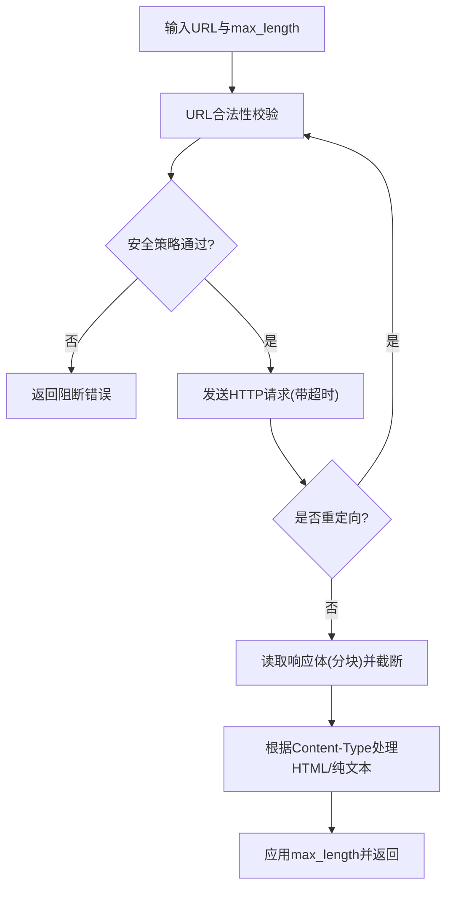
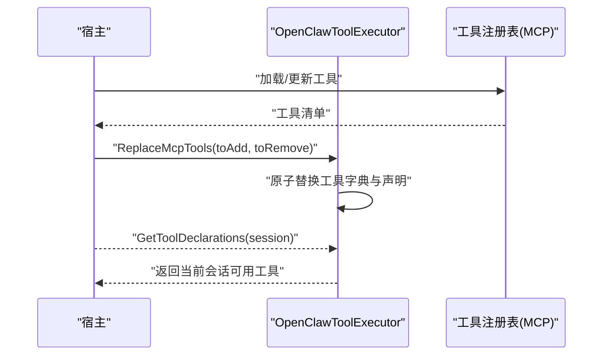
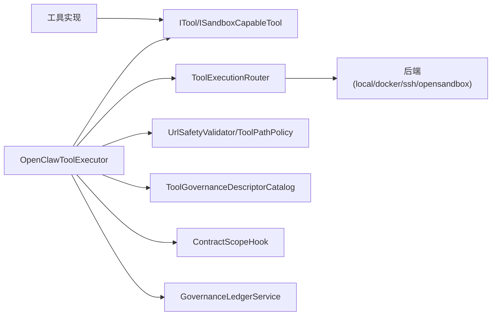

# 工具系统

<cite>
**本文引用的文件**
- [ITool.cs](file://src/OpenClaw.Core/Abstractions/ITool.cs)
- [ISandboxCapableTool.cs](file://src/OpenClaw.Core/Abstractions/ISandboxCapableTool.cs)
- [IToolSandbox.cs](file://src/OpenClaw.Core/Abstractions/IToolSandbox.cs)
- [SandboxModels.cs](file://src/OpenClaw.Core/Models/SandboxModels.cs)
- [SandboxConfig.cs](file://src/OpenClaw.Core/Models/SandboxConfig.cs)
- [ToolExecutionRouter.cs](file://src/OpenClaw.Agent/Execution/ToolExecutionRouter.cs)
- [OpenClawToolExecutor.cs](file://src/OpenClaw.Agent/OpenClawToolExecutor.cs)
- [ShellTool.cs](file://src/OpenClaw.Agent/Tools/ShellTool.cs)
- [FileReadTool.cs](file://src/OpenClaw.Agent/Tools/FileReadTool.cs)
- [WebFetchTool.cs](file://src/OpenClaw.Agent/Tools/WebFetchTool.cs)
- [GitTool.cs](file://src/OpenClaw.Agent/Tools/GitTool.cs)
- [BrowserTool.cs](file://src/OpenClaw.Agent/Tools/BrowserTool.cs)
- [UrlSafetyValidator.cs](file://src/OpenClaw.Core/Security/UrlSafetyValidator.cs)
- [ToolPathPolicy.cs](file://src/OpenClaw.Core/Security/ToolPathPolicy.cs)
- [ToolGovernanceDescriptorCatalog.cs](file://src/OpenClaw.Core/Governance/ToolGovernanceDescriptorCatalog.cs)
- [ContractScopeHook.cs](file://src/OpenClaw.Agent/ContractScopeHook.cs)
- [ContractGovernanceService.cs](file://src/OpenClaw.Gateway/ContractGovernanceService.cs)
- [GovernanceLedgerService.cs](file://src/OpenClaw.Gateway/GovernanceLedgerService.cs)
- [McpServerToolRegistryTests.cs](file://src/OpenClaw.Tests/McpServerToolRegistryTests.cs)
</cite>

## 目录
1. [简介](#简介)
2. [项目结构](#项目结构)
3. [核心组件](#核心组件)
4. [架构总览](#架构总览)
5. [详细组件分析](#详细组件分析)
6. [依赖关系分析](#依赖关系分析)
7. [性能考虑](#性能考虑)
8. [故障排查指南](#故障排查指南)
9. [结论](#结论)
10. [附录](#附录)

## 简介
本文件系统性阐述工具系统的架构设计、本地工具实现、远程工具桥接与工具沙箱机制，覆盖工具发现、注册、调用与管理的完整流程，并对内置工具（文件操作、网络访问、系统命令、浏览器自动化等）进行功能与使用方法的文档化。同时，解释工具执行的安全策略、权限控制与资源限制，提供工具开发指南、自定义工具创建与 Node.js 桥接实现细节，以及性能优化建议与最佳实践。

## 项目结构
工具系统主要分布在以下模块：
- 核心抽象与模型：定义工具接口、沙箱能力与沙箱请求/结果模型
- 执行路由与后端：统一调度工具执行，支持本地、Docker、SSH、OpenSandbox 等后端
- 工具实现：内置工具集合，涵盖文件读取、Shell 命令、Web 抓取、Git 操作、浏览器自动化等
- 安全与治理：URL 安全校验、路径策略、工具治理描述符、合同范围钩子与治理记录
- 测试与验证：MCP 服务器工具注册测试，验证工具发现与执行链路

```mermaid
graph TB
subgraph "核心抽象与模型"
ITool["ITool 接口"]
ISandbox["ISandboxCapableTool 接口"]
IToolSbx["IToolSandbox 接口"]
SbxModels["Sandbox 模型<br/>SandboxExecutionRequest/SandboxResult"]
SbxConfig["沙箱配置解析<br/>ToolSandboxPolicy"]
end
subgraph "执行与路由"
ExecRouter["ToolExecutionRouter<br/>执行路由与后端选择"]
Executor["OpenClawToolExecutor<br/>工具执行器"]
end
subgraph "内置工具"
Shell["ShellTool"]
FileReader["FileReadTool"]
WebFetch["WebFetchTool"]
Git["GitTool"]
Browser["BrowserTool"]
end
subgraph "安全与治理"
UrlSafe["UrlSafetyValidator"]
PathPolicy["ToolPathPolicy"]
GovDesc["ToolGovernanceDescriptorCatalog"]
ScopeHook["ContractScopeHook"]
GateService["ContractGovernanceService"]
Ledger["GovernanceLedgerService"]
end
ITool --> Shell
ITool --> FileReader
ITool --> WebFetch
ITool --> Git
ITool --> Browser
ISandbox --> Shell
ISandbox --> Browser
IToolSbx --> ExecRouter
SbxModels --> ExecRouter
SbxConfig --> ExecRouter
Executor --> ExecRouter
Executor --> UrlSafe
Executor --> PathPolicy
Executor --> GovDesc
Executor --> ScopeHook
Executor --> GateService
Executor --> Ledger
```

**图表来源**
- [ITool.cs:1-17](file://src/OpenClaw.Core/Abstractions/ITool.cs#L1-L17)
- [ISandboxCapableTool.cs:1-14](file://src/OpenClaw.Core/Abstractions/ISandboxCapableTool.cs#L1-L14)
- [IToolSandbox.cs:1-12](file://src/OpenClaw.Core/Abstractions/IToolSandbox.cs#L1-L12)
- [SandboxModels.cs:1-28](file://src/OpenClaw.Core/Models/SandboxModels.cs#L1-L28)
- [SandboxConfig.cs:113-152](file://src/OpenClaw.Core/Models/SandboxConfig.cs#L113-L152)
- [ToolExecutionRouter.cs:1-253](file://src/OpenClaw.Agent/Execution/ToolExecutionRouter.cs#L1-L253)
- [OpenClawToolExecutor.cs:1-200](file://src/OpenClaw.Agent/OpenClawToolExecutor.cs#L1-L200)
- [ShellTool.cs:1-193](file://src/OpenClaw.Agent/Tools/ShellTool.cs#L1-L193)
- [FileReadTool.cs:1-66](file://src/OpenClaw.Agent/Tools/FileReadTool.cs#L1-L66)
- [WebFetchTool.cs:1-212](file://src/OpenClaw.Agent/Tools/WebFetchTool.cs#L1-L212)
- [GitTool.cs:1-234](file://src/OpenClaw.Agent/Tools/GitTool.cs#L1-L234)
- [BrowserTool.cs:271-401](file://src/OpenClaw.Agent/Tools/BrowserTool.cs#L271-L401)
- [UrlSafetyValidator.cs:1-219](file://src/OpenClaw.Core/Security/UrlSafetyValidator.cs#L1-L219)
- [ToolPathPolicy.cs:1-136](file://src/OpenClaw.Core/Security/ToolPathPolicy.cs#L1-L136)
- [ToolGovernanceDescriptorCatalog.cs:1-34](file://src/OpenClaw.Core/Governance/ToolGovernanceDescriptorCatalog.cs#L1-L34)
- [ContractScopeHook.cs:35-124](file://src/OpenClaw.Agent/ContractScopeHook.cs#L35-L124)
- [ContractGovernanceService.cs:97-132](file://src/OpenClaw.Gateway/ContractGovernanceService.cs#L97-L132)
- [GovernanceLedgerService.cs:72-111](file://src/OpenClaw.Gateway/GovernanceLedgerService.cs#L72-L111)

**章节来源**
- [ITool.cs:1-17](file://src/OpenClaw.Core/Abstractions/ITool.cs#L1-L17)
- [ToolExecutionRouter.cs:1-253](file://src/OpenClaw.Agent/Execution/ToolExecutionRouter.cs#L1-L253)
- [OpenClawToolExecutor.cs:1-200](file://src/OpenClaw.Agent/OpenClawToolExecutor.cs#L1-L200)

## 核心组件
- 工具接口与能力
  - ITool：最小化工具接口，仅包含名称、描述、参数模式与异步执行方法，便于 AOT 裁剪
  - ISandboxCapableTool：声明默认沙箱模式、创建沙箱请求与格式化沙箱结果的能力
  - IToolSandbox：抽象沙箱执行器，接收沙箱请求并返回结果
- 沙箱模型与策略
  - SandboxExecutionRequest/SandboxResult：封装命令、工作目录、环境变量、参数、租约键、模板、TTL 等
  - ToolSandboxPolicy：解析工具沙箱模式、模板与 TTL，决定是否启用 OpenSandbox 提供者
- 执行路由与后端
  - ToolExecutionRouter：根据配置与工具能力解析执行后端（local、docker、ssh、opensandbox），支持回退后端与工作区要求
  - OpenClawToolExecutor：统一编排工具执行，含治理、审计、钩子、超时、预设过滤、MCP 工具热替换等

**章节来源**
- [ITool.cs:1-17](file://src/OpenClaw.Core/Abstractions/ITool.cs#L1-L17)
- [ISandboxCapableTool.cs:1-14](file://src/OpenClaw.Core/Abstractions/ISandboxCapableTool.cs#L1-L14)
- [IToolSandbox.cs:1-12](file://src/OpenClaw.Core/Abstractions/IToolSandbox.cs#L1-L12)
- [SandboxModels.cs:1-28](file://src/OpenClaw.Core/Models/SandboxModels.cs#L1-L28)
- [SandboxConfig.cs:113-152](file://src/OpenClaw.Core/Models/SandboxConfig.cs#L113-L152)
- [ToolExecutionRouter.cs:1-253](file://src/OpenClaw.Agent/Execution/ToolExecutionRouter.cs#L1-L253)
- [OpenClawToolExecutor.cs:1-200](file://src/OpenClaw.Agent/OpenClawToolExecutor.cs#L1-L200)

## 架构总览
工具系统采用“抽象接口 + 可插拔后端 + 沙箱执行”的分层架构。工具通过统一的执行器注册与声明，执行器在每次调用前进行会话预设过滤、治理评估与安全校验，随后由路由选择合适的执行后端（本地或沙箱），最终返回标准化结果。

**图表来源**
- [OpenClawToolExecutor.cs:134-200](file://src/OpenClaw.Agent/OpenClawToolExecutor.cs#L134-L200)
- [ToolExecutionRouter.cs:114-157](file://src/OpenClaw.Agent/Execution/ToolExecutionRouter.cs#L114-L157)
- [IToolSandbox.cs:1-12](file://src/OpenClaw.Core/Abstractions/IToolSandbox.cs#L1-L12)

## 详细组件分析

### 工具接口与沙箱能力
- ITool：最小接口，确保工具可被统一发现与声明；参数模式以 JSON Schema 描述，便于前端与 LLM 使用
- ISandboxCapableTool：面向需要隔离执行的工具，提供默认沙箱模式、创建沙箱请求与格式化输出的能力
- IToolSandbox：抽象沙箱执行器，屏蔽底层容器/进程隔离差异

**图表来源**
- [ITool.cs:1-17](file://src/OpenClaw.Core/Abstractions/ITool.cs#L1-L17)
- [ISandboxCapableTool.cs:1-14](file://src/OpenClaw.Core/Abstractions/ISandboxCapableTool.cs#L1-L14)
- [IToolSandbox.cs:1-12](file://src/OpenClaw.Core/Abstractions/IToolSandbox.cs#L1-L12)

**章节来源**
- [ITool.cs:1-17](file://src/OpenClaw.Core/Abstractions/ITool.cs#L1-L17)
- [ISandboxCapableTool.cs:1-14](file://src/OpenClaw.Core/Abstractions/ISandboxCapableTool.cs#L1-L14)
- [IToolSandbox.cs:1-12](file://src/OpenClaw.Core/Abstractions/IToolSandbox.cs#L1-L12)

### 执行路由与后端
- ToolExecutionRouter
  - 支持多后端：local、docker、ssh、opensandbox
  - 路由解析优先级：工具配置 > 工具默认沙箱模式 > 默认后端
  - 回退机制：当指定回退后端且允许本地回退时，自动切换到回退后端
  - 工作区要求：Docker/SSH 需要设置工作区根目录
- OpenClawToolExecutor
  - 统一编排：参数脱敏、预设过滤、治理评估、钩子、审计日志
  - 结果标准化：统一状态码、失败原因与下一步提示

**图表来源**
- [ToolExecutionRouter.cs:65-112](file://src/OpenClaw.Agent/Execution/ToolExecutionRouter.cs#L65-L112)
- [ToolExecutionRouter.cs:114-157](file://src/OpenClaw.Agent/Execution/ToolExecutionRouter.cs#L114-L157)
- [OpenClawToolExecutor.cs:134-200](file://src/OpenClaw.Agent/OpenClawToolExecutor.cs#L134-L200)

**章节来源**
- [ToolExecutionRouter.cs:1-253](file://src/OpenClaw.Agent/Execution/ToolExecutionRouter.cs#L1-L253)
- [OpenClawToolExecutor.cs:1-200](file://src/OpenClaw.Agent/OpenClawToolExecutor.cs#L1-L200)

### 内置工具：文件读取
- 功能：读取本地文件内容，限制最大行数，避免上下文溢出
- 安全：基于路径策略判断读取是否允许，解析真实路径并校验根目录
- 输出：按行拼接，超过上限追加截断提示

**章节来源**
- [FileReadTool.cs:1-66](file://src/OpenClaw.Agent/Tools/FileReadTool.cs#L1-L66)
- [ToolPathPolicy.cs:1-136](file://src/OpenClaw.Core/Security/ToolPathPolicy.cs#L1-L136)

### 内置工具：系统命令（Shell）
- 功能：在本地执行 shell 命令，支持超时与输出大小限制
- 安全：只在允许 Shell 的情况下启用；参数解析严格校验；输出截断防止溢出
- 沙箱：实现 ISandboxCapableTool，将命令包装为带超时的沙箱执行请求

**图表来源**
- [ShellTool.cs:24-85](file://src/OpenClaw.Agent/Tools/ShellTool.cs#L24-L85)
- [ShellTool.cs:87-113](file://src/OpenClaw.Agent/Tools/ShellTool.cs#L87-L113)

**章节来源**
- [ShellTool.cs:1-193](file://src/OpenClaw.Agent/Tools/ShellTool.cs#L1-L193)

### 内置工具：网络抓取（WebFetch）
- 功能：抓取网页并剥离 HTML 标签提取可读文本，支持重定向与长度限制
- 安全：URL 安全策略校验，阻止私有/非公网地址与黑名单主机
- 性能：分块读取，避免一次性占用大内存；超时控制

**图表来源**
- [WebFetchTool.cs:48-159](file://src/OpenClaw.Agent/Tools/WebFetchTool.cs#L48-L159)
- [UrlSafetyValidator.cs:27-58](file://src/OpenClaw.Core/Security/UrlSafetyValidator.cs#L27-L58)

**章节来源**
- [WebFetchTool.cs:1-212](file://src/OpenClaw.Agent/Tools/WebFetchTool.cs#L1-L212)
- [UrlSafetyValidator.cs:1-219](file://src/OpenClaw.Core/Security/UrlSafetyValidator.cs#L1-L219)

### 内置工具：Git 操作
- 功能：支持状态、差异、日志、添加、提交、分支、检出、暂存、展示等常用子命令
- 安全：破坏性操作（如 push/pull/reset --hard）需显式允许；额外参数进行注入检测与令牌化传递
- 输出：限制差异输出大小，必要时追加截断提示

**章节来源**
- [GitTool.cs:1-234](file://src/OpenClaw.Agent/Tools/GitTool.cs#L1-L234)

### 内置工具：浏览器自动化（Browser）
- 功能：无头浏览器导航、点击、填写、截图、脚本求值等
- 安全：URL 安全校验；本地执行受控（可禁用）
- 沙箱：默认偏好沙箱模式，适合隔离页面渲染与网络交互

**章节来源**
- [BrowserTool.cs:271-401](file://src/OpenClaw.Agent/Tools/BrowserTool.cs#L271-L401)

### 工具发现、注册与管理
- 发现与声明：工具实现 ITool，执行器通过构造函数收集工具并生成声明列表
- 预设过滤：根据会话预设动态筛选可用工具
- 热替换：支持在运行时原子替换 MCP 工具集合，保证并发安全

**图表来源**
- [OpenClawToolExecutor.cs:119-132](file://src/OpenClaw.Agent/OpenClawToolExecutor.cs#L119-L132)
- [McpServerToolRegistryTests.cs:25-331](file://src/OpenClaw.Tests/McpServerToolRegistryTests.cs#L25-L331)

**章节来源**
- [OpenClawToolExecutor.cs:102-132](file://src/OpenClaw.Agent/OpenClawToolExecutor.cs#L102-L132)
- [McpServerToolRegistryTests.cs:25-331](file://src/OpenClaw.Tests/McpServerToolRegistryTests.cs#L25-L331)

### 工具沙箱机制
- 模式解析：根据工具默认模式与配置，决定是否需要沙箱、是否强制沙箱
- 模板与 TTL：支持为工具配置沙箱模板与存活时间，路由层统一注入执行请求
- 执行流程：路由将沙箱请求提交给 IToolSandbox，返回标准化结果后交由执行器组装

**章节来源**
- [SandboxConfig.cs:113-152](file://src/OpenClaw.Core/Models/SandboxConfig.cs#L113-L152)
- [ToolExecutionRouter.cs:65-112](file://src/OpenClaw.Agent/Execution/ToolExecutionRouter.cs#L65-L112)
- [SandboxModels.cs:10-26](file://src/OpenClaw.Core/Models/SandboxModels.cs#L10-L26)

### 安全策略与权限控制
- URL 安全：禁止 localhost/metadata 等内网目标，支持 CIDR 黑名单与 DNS 解析校验
- 文件路径：读写路径白/黑名单与根目录约束，解析真实路径并判定是否越权
- 合同范围：针对受限会话，限制工具调用次数与路径范围，未匹配范围的文件工具默认拒绝
- 治理与审计：工具治理描述符聚合工具动作属性，结合治理服务与审计日志记录决策

**章节来源**
- [UrlSafetyValidator.cs:17-135](file://src/OpenClaw.Core/Security/UrlSafetyValidator.cs#L17-L135)
- [ToolPathPolicy.cs:1-136](file://src/OpenClaw.Core/Security/ToolPathPolicy.cs#L1-L136)
- [ContractScopeHook.cs:35-124](file://src/OpenClaw.Agent/ContractScopeHook.cs#L35-L124)
- [ToolGovernanceDescriptorCatalog.cs:12-32](file://src/OpenClaw.Core/Governance/ToolGovernanceDescriptorCatalog.cs#L12-L32)
- [GovernanceLedgerService.cs:72-111](file://src/OpenClaw.Gateway/GovernanceLedgerService.cs#L72-L111)

## 依赖关系分析
- 松耦合：工具实现仅依赖 ITool/ISandboxCapableTool 抽象，执行器通过 DI 注入后端与沙箱
- 路由解耦：后端类型通过配置驱动，新增后端无需修改工具代码
- 安全前置：URL 与路径策略在执行器阶段统一拦截，降低后端侧负担
- 治理闭环：描述符、服务与记录共同构成治理闭环，支持审批与审计

**图表来源**
- [OpenClawToolExecutor.cs:1-200](file://src/OpenClaw.Agent/OpenClawToolExecutor.cs#L1-L200)
- [ToolExecutionRouter.cs:1-253](file://src/OpenClaw.Agent/Execution/ToolExecutionRouter.cs#L1-L253)
- [UrlSafetyValidator.cs:1-219](file://src/OpenClaw.Core/Security/UrlSafetyValidator.cs#L1-L219)
- [ToolPathPolicy.cs:1-136](file://src/OpenClaw.Core/Security/ToolPathPolicy.cs#L1-L136)
- [ToolGovernanceDescriptorCatalog.cs:1-34](file://src/OpenClaw.Core/Governance/ToolGovernanceDescriptorCatalog.cs#L1-L34)
- [ContractScopeHook.cs:35-124](file://src/OpenClaw.Agent/ContractScopeHook.cs#L35-L124)
- [GovernanceLedgerService.cs:72-111](file://src/OpenClaw.Gateway/GovernanceLedgerService.cs#L72-L111)

**章节来源**
- [OpenClawToolExecutor.cs:1-200](file://src/OpenClaw.Agent/OpenClawToolExecutor.cs#L1-L200)
- [ToolExecutionRouter.cs:1-253](file://src/OpenClaw.Agent/Execution/ToolExecutionRouter.cs#L1-L253)

## 性能考虑
- I/O 限流：文件读取与网络抓取均设置最大行数/字节数，避免内存暴涨
- 分块读取：网络抓取采用小缓冲池与分块读取，减少峰值内存占用
- 超时与截断：Shell 命令与浏览器工具均设置超时与输出截断，保障响应性
- 后端选择：优先使用本地后端，仅在需要隔离时启用沙箱，平衡性能与安全
- 并发安全：工具热替换使用互斥锁，避免并发修改导致的不一致

[本节为通用指导，无需列出具体文件来源]

## 故障排查指南
- 工具未知：检查工具名称是否正确，确认已注册并处于当前会话预设范围内
- 治理拒绝：查看治理服务返回的拒绝原因与策略 ID，核对工具动作与风险等级
- URL 阻断：核对 URL 安全策略配置，确认主机是否命中黑名单或解析到非公网地址
- 路径越权：检查路径策略配置与实际工作区根目录，确认读写路径是否在允许范围内
- 沙箱未配置：若工具要求沙箱，请确认 OpenSandbox 提供者已配置且模板/TTL 设置合理
- 合同范围限制：受限会话下，文件工具未匹配范围将被拒绝；必要时调整合同策略

**章节来源**
- [OpenClawToolExecutor.cs:167-196](file://src/OpenClaw.Agent/OpenClawToolExecutor.cs#L167-L196)
- [UrlSafetyValidator.cs:60-135](file://src/OpenClaw.Core/Security/UrlSafetyValidator.cs#L60-L135)
- [ToolPathPolicy.cs:1-136](file://src/OpenClaw.Core/Security/ToolPathPolicy.cs#L1-L136)
- [SandboxConfig.cs:146-152](file://src/OpenClaw.Core/Models/SandboxConfig.cs#L146-L152)
- [ContractScopeHook.cs:56-107](file://src/OpenClaw.Agent/ContractScopeHook.cs#L56-L107)

## 结论
工具系统通过清晰的抽象与可插拔后端，实现了从本地到容器/SSH/沙箱的统一执行模型；内置工具覆盖常见场景并内置安全策略；治理与审计贯穿执行全流程，确保可控与可观测。遵循本文的最佳实践与安全策略，可在保证安全的前提下获得良好的性能与扩展性。

[本节为总结性内容，无需列出具体文件来源]

## 附录

### 自定义工具开发指南
- 实现 ITool 或 ISandboxCapableTool
- 在构造函数中注入所需配置与服务
- 编写参数 JSON Schema，确保 LLM 友好
- 如需隔离，实现 CreateSandboxRequest 与 FormatSandboxResult
- 在执行器初始化时注册工具，或通过 MCP 热替换接入

**章节来源**
- [ITool.cs:1-17](file://src/OpenClaw.Core/Abstractions/ITool.cs#L1-L17)
- [ISandboxCapableTool.cs:1-14](file://src/OpenClaw.Core/Abstractions/ISandboxCapableTool.cs#L1-L14)
- [OpenClawToolExecutor.cs:52-100](file://src/OpenClaw.Agent/OpenClawToolExecutor.cs#L52-L100)

### 与 Node.js 桥接实现要点
- 通过 MCP（Model Context Protocol）服务器暴露工具，执行器通过注册表发现并加载
- 使用热替换能力在运行时更新工具集合，避免重启
- 将 Node.js 工具的参数与返回值映射到 JSON Schema 与标准化结果

**章节来源**
- [McpServerToolRegistryTests.cs:25-331](file://src/OpenClaw.Tests/McpServerToolRegistryTests.cs#L25-L331)
- [OpenClawToolExecutor.cs:119-132](file://src/OpenClaw.Agent/OpenClawToolExecutor.cs#L119-L132)