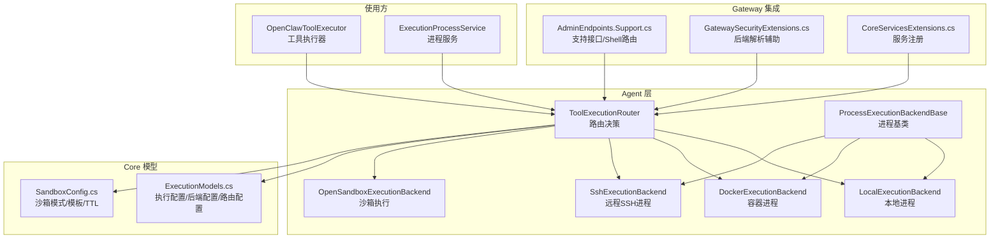
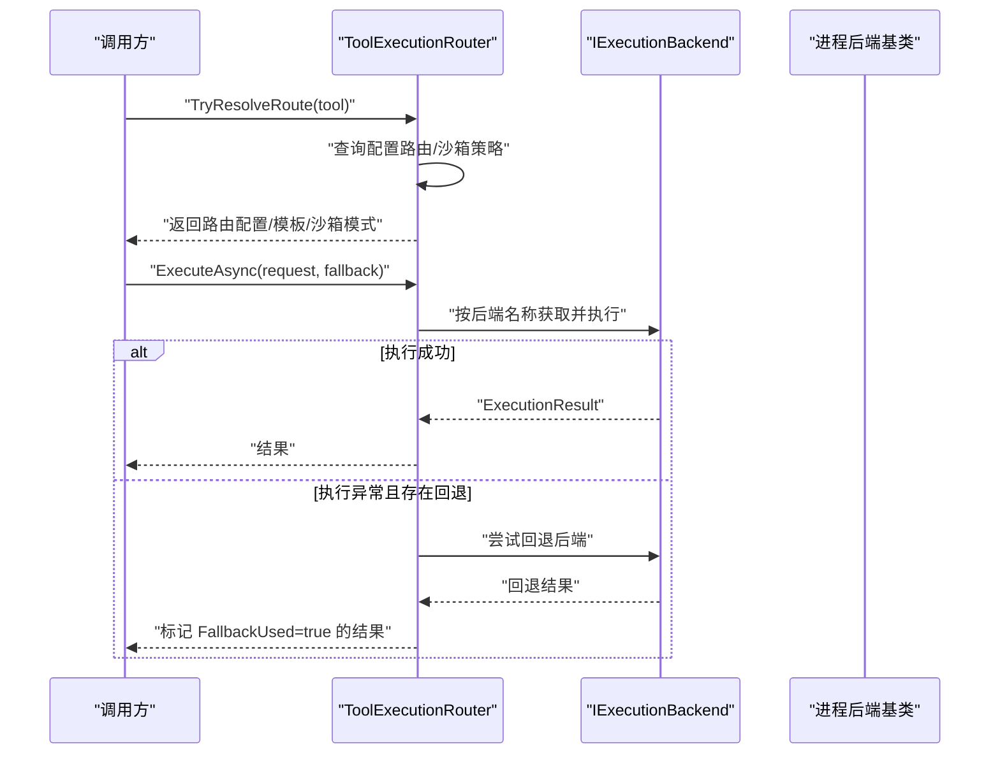
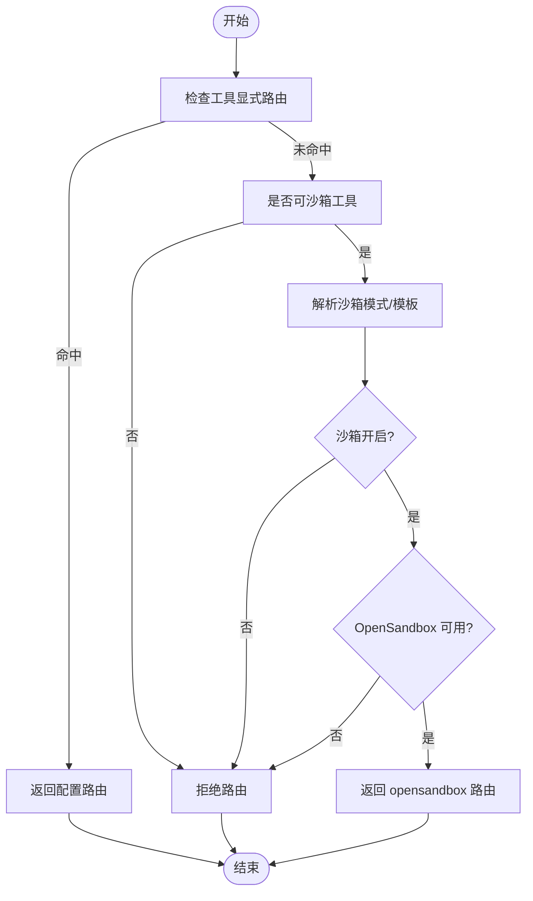
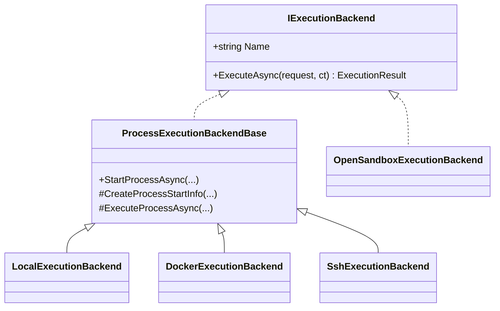
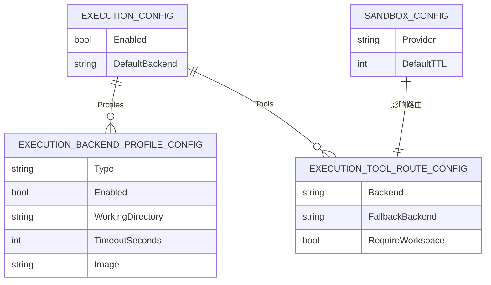
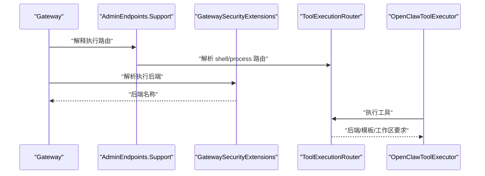
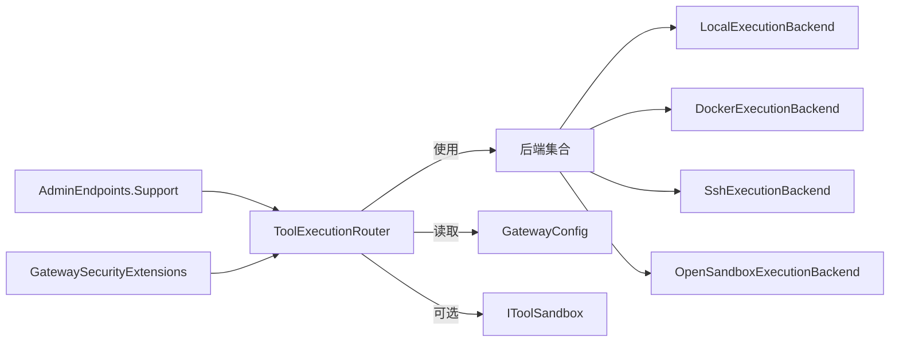

# 工具路由策略

<cite>
**本文引用的文件**
- [ToolExecutionRouter.cs](file://src/OpenClaw.Agent/Execution/ToolExecutionRouter.cs)
- [LocalExecutionBackend.cs](file://src/OpenClaw.Agent/Execution/LocalExecutionBackend.cs)
- [DockerExecutionBackend.cs](file://src/OpenClaw.Agent/Execution/DockerExecutionBackend.cs)
- [SshExecutionBackend.cs](file://src/OpenClaw.Agent/Execution/SshExecutionBackend.cs)
- [OpenSandboxExecutionBackend.cs](file://src/OpenClaw.Agent/Execution/OpenSandboxExecutionBackend.cs)
- [ProcessExecutionBackendBase.cs](file://src/OpenClaw.Agent/Execution/ProcessExecutionBackendBase.cs)
- [IExecutionBackend.cs](file://src/OpenClaw.Core/Abstractions/IExecutionBackend.cs)
- [ExecutionModels.cs](file://src/OpenClaw.Core/Models/ExecutionModels.cs)
- [SandboxConfig.cs](file://src/OpenClaw.Core/Models/SandboxConfig.cs)
- [AdminEndpoints.Support.cs](file://src/OpenClaw.Gateway/Endpoints/AdminEndpoints.Support.cs)
- [GatewaySecurityExtensions.cs](file://src/OpenClaw.Gateway/Extensions/GatewaySecurityExtensions.cs)
- [CoreServicesExtensions.cs](file://src/OpenClaw.Gateway/Composition/CoreServicesExtensions.cs)
- [OpenClawToolExecutor.cs](file://src/OpenClaw.Agent/OpenClawToolExecutor.cs)
- [ExecutionProcessService.cs](file://src/OpenClaw.Agent/Execution/ExecutionProcessService.cs)
- [ProcessToolTests.cs](file://src/OpenClaw.Tests/ProcessToolTests.cs)
- [SetupCommand.cs](file://src/OpenClaw.Cli/SetupCommand.cs)
</cite>

## 目录
1. [简介](#简介)
2. [项目结构](#项目结构)
3. [核心组件](#核心组件)
4. [架构总览](#架构总览)
5. [详细组件分析](#详细组件分析)
6. [依赖关系分析](#依赖关系分析)
7. [性能考量](#性能考量)
8. [故障排查指南](#故障排查指南)
9. [结论](#结论)
10. [附录](#附录)

## 简介
本文件系统化阐述工具路由策略的设计与实现，重点围绕 ToolExecutionRouter 在不同工具类型、会话上下文与配置约束下的执行后端选择逻辑。内容涵盖：
- 路由决策流程：工具能力检测、后端可用性检查、模板解析、工作区要求判定
- 执行路径：配置驱动的工具到后端映射、沙箱模式与降级回退
- 与工具预设、会话配置、运行时状态的关系
- 配置项、性能特性与扩展方法
- 调试技巧与最佳实践

## 项目结构
与工具路由策略直接相关的核心文件分布于以下模块：
- 路由器与后端实现：OpenClaw.Agent/Execution
- 路由配置模型：OpenClaw.Core/Models
- 网关集成与安全扩展：OpenClaw.Gateway
- 运行时使用方：OpenClaw.Agent（OpenClawToolExecutor、ExecutionProcessService）

图表来源
- [ToolExecutionRouter.cs:7-63](file://src/OpenClaw.Agent/Execution/ToolExecutionRouter.cs#L7-L63)
- [LocalExecutionBackend.cs:6-25](file://src/OpenClaw.Agent/Execution/LocalExecutionBackend.cs#L6-L25)
- [DockerExecutionBackend.cs:6-20](file://src/OpenClaw.Agent/Execution/DockerExecutionBackend.cs#L6-L20)
- [SshExecutionBackend.cs:6-19](file://src/OpenClaw.Agent/Execution/SshExecutionBackend.cs#L6-L19)
- [OpenSandboxExecutionBackend.cs:7-21](file://src/OpenClaw.Agent/Execution/OpenSandboxExecutionBackend.cs#L7-L21)
- [ProcessExecutionBackendBase.cs:8-17](file://src/OpenClaw.Agent/Execution/ProcessExecutionBackendBase.cs#L8-L17)
- [ExecutionModels.cs:8-33](file://src/OpenClaw.Core/Models/ExecutionModels.cs#L8-L33)
- [SandboxConfig.cs:86-152](file://src/OpenClaw.Core/Models/SandboxConfig.cs#L86-L152)
- [AdminEndpoints.Support.cs:1574-1622](file://src/OpenClaw.Gateway/Endpoints/AdminEndpoints.Support.cs#L1574-L1622)
- [GatewaySecurityExtensions.cs:294-316](file://src/OpenClaw.Gateway/Extensions/GatewaySecurityExtensions.cs#L294-L316)
- [CoreServicesExtensions.cs:161-168](file://src/OpenClaw.Gateway/Composition/CoreServicesExtensions.cs#L161-L168)
- [OpenClawToolExecutor.cs:43-92](file://src/OpenClaw.Agent/OpenClawToolExecutor.cs#L43-L92)
- [ExecutionProcessService.cs:282-293](file://src/OpenClaw.Agent/Execution/ExecutionProcessService.cs#L282-L293)

章节来源
- [ToolExecutionRouter.cs:7-63](file://src/OpenClaw.Agent/Execution/ToolExecutionRouter.cs#L7-L63)
- [ExecutionModels.cs:8-33](file://src/OpenClaw.Core/Models/ExecutionModels.cs#L8-L33)
- [SandboxConfig.cs:86-152](file://src/OpenClaw.Core/Models/SandboxConfig.cs#L86-L152)

## 核心组件
- ToolExecutionRouter：负责根据工具名、工具能力、配置与沙箱策略解析执行后端；支持执行与回退、工作区需求判断、进程后端识别等。
- 后端实现：
  - LocalExecutionBackend：本地进程执行，支持交互式输入与工作区校验。
  - DockerExecutionBackend：通过 docker CLI 运行镜像，支持环境变量与工作目录。
  - SshExecutionBackend：通过 ssh 远程执行命令，支持密钥与工作目录切换。
  - OpenSandboxExecutionBackend：基于 IToolSandbox 的沙箱执行，带超时控制。
  - ProcessExecutionBackendBase：统一的进程启动与执行基类，封装超时、输出捕获与进程管理。
- 配置模型：
  - ExecutionConfig/ExecutionBackendProfileConfig/ExecutionToolRouteConfig：定义执行开关、默认后端、后端配置与工具路由表。
  - SandboxConfig：定义沙箱提供者、工具沙箱模式、模板与 TTL 解析。

章节来源
- [ToolExecutionRouter.cs:7-63](file://src/OpenClaw.Agent/Execution/ToolExecutionRouter.cs#L7-L63)
- [LocalExecutionBackend.cs:6-25](file://src/OpenClaw.Agent/Execution/LocalExecutionBackend.cs#L6-L25)
- [DockerExecutionBackend.cs:6-20](file://src/OpenClaw.Agent/Execution/DockerExecutionBackend.cs#L6-L20)
- [SshExecutionBackend.cs:6-19](file://src/OpenClaw.Agent/Execution/SshExecutionBackend.cs#L6-L19)
- [OpenSandboxExecutionBackend.cs:7-21](file://src/OpenClaw.Agent/Execution/OpenSandboxExecutionBackend.cs#L7-L21)
- [ProcessExecutionBackendBase.cs:8-17](file://src/OpenClaw.Agent/Execution/ProcessExecutionBackendBase.cs#L8-L17)
- [ExecutionModels.cs:8-33](file://src/OpenClaw.Core/Models/ExecutionModels.cs#L8-L33)
- [SandboxConfig.cs:86-152](file://src/OpenClaw.Core/Models/SandboxConfig.cs#L86-L152)

## 架构总览
ToolExecutionRouter 作为“路由中枢”，在运行时将工具请求映射到具体后端。其决策链路包括：
- 配置驱动的工具到后端映射
- 沙箱模式解析与模板选择
- 后端可用性与类型校验
- 执行失败时的回退策略
- 进程后端隔离性与工作区要求

图表来源
- [ToolExecutionRouter.cs:65-157](file://src/OpenClaw.Agent/Execution/ToolExecutionRouter.cs#L65-L157)
- [ProcessExecutionBackendBase.cs:61-128](file://src/OpenClaw.Agent/Execution/ProcessExecutionBackendBase.cs#L61-L128)
- [IExecutionBackend.cs:5-12](file://src/OpenClaw.Core/Abstractions/IExecutionBackend.cs#L5-L12)

## 详细组件分析

### 路由器：ToolExecutionRouter
- 初始化：构建后端字典，包含 local、docker、ssh、opensandbox（可选）等后端实例。
- 路由解析：
  - TryResolveRoute：优先匹配工具名的显式路由；否则对可沙箱工具解析沙箱模式与模板；不满足则拒绝。
  - ResolveBackendForProcess：针对 process/shell 的专用解析，支持回退后端与沙箱模板。
- 执行与回退：ExecuteAsync 支持回退后端与本地回退许可控制；回退时包装结果并标记 FallbackUsed。
- 辅助判断：
  - RequiresWorkspace：基于后端类型判断是否需要工作区。
  - IsIsolatedProcessBackend：判断是否为隔离进程后端（排除 opensandbox 与 local）。
  - TryGetProcessBackend：将后端转换为进程后端接口。

图表来源
- [ToolExecutionRouter.cs:65-112](file://src/OpenClaw.Agent/Execution/ToolExecutionRouter.cs#L65-L112)

章节来源
- [ToolExecutionRouter.cs:65-251](file://src/OpenClaw.Agent/Execution/ToolExecutionRouter.cs#L65-L251)

### 后端实现与能力
- LocalExecutionBackend：本地进程，支持交互、PTY（非 Windows）、工作区限制。
- DockerExecutionBackend：通过 docker CLI 运行，需镜像；支持环境变量与工作目录。
- SshExecutionBackend：通过 ssh 远程执行，需主机与用户名；支持私钥、工作目录与环境注入。
- OpenSandboxExecutionBackend：委托 IToolSandbox 执行，带超时；超时即刻返回。
- ProcessExecutionBackendBase：统一的进程生命周期管理、超时与输出捕获。

图表来源
- [IExecutionBackend.cs:5-12](file://src/OpenClaw.Core/Abstractions/IExecutionBackend.cs#L5-L12)
- [ProcessExecutionBackendBase.cs:8-44](file://src/OpenClaw.Agent/Execution/ProcessExecutionBackendBase.cs#L8-L44)
- [LocalExecutionBackend.cs:6-25](file://src/OpenClaw.Agent/Execution/LocalExecutionBackend.cs#L6-L25)
- [DockerExecutionBackend.cs:6-20](file://src/OpenClaw.Agent/Execution/DockerExecutionBackend.cs#L6-L20)
- [SshExecutionBackend.cs:6-19](file://src/OpenClaw.Agent/Execution/SshExecutionBackend.cs#L6-L19)
- [OpenSandboxExecutionBackend.cs:7-21](file://src/OpenClaw.Agent/Execution/OpenSandboxExecutionBackend.cs#L7-L21)

章节来源
- [LocalExecutionBackend.cs:6-99](file://src/OpenClaw.Agent/Execution/LocalExecutionBackend.cs#L6-L99)
- [DockerExecutionBackend.cs:6-66](file://src/OpenClaw.Agent/Execution/DockerExecutionBackend.cs#L6-L66)
- [SshExecutionBackend.cs:6-63](file://src/OpenClaw.Agent/Execution/SshExecutionBackend.cs#L6-L63)
- [OpenSandboxExecutionBackend.cs:7-69](file://src/OpenClaw.Agent/Execution/OpenSandboxExecutionBackend.cs#L7-L69)
- [ProcessExecutionBackendBase.cs:8-142](file://src/OpenClaw.Agent/Execution/ProcessExecutionBackendBase.cs#L8-L142)

### 配置模型与策略
- ExecutionConfig：执行开关、默认后端、后端配置集合、工具路由表。
- ExecutionBackendProfileConfig：后端类型、启用状态、工作目录、环境变量、超时、端点与密钥等。
- ExecutionToolRouteConfig：工具到后端的路由配置，含回退后端、工作区要求与模板。
- SandboxConfig：沙箱提供者、工具沙箱模式（None/Prefer/Require）、模板与 TTL 解析。

图表来源
- [ExecutionModels.cs:8-33](file://src/OpenClaw.Core/Models/ExecutionModels.cs#L8-L33)
- [SandboxConfig.cs:86-152](file://src/OpenClaw.Core/Models/SandboxConfig.cs#L86-L152)

章节来源
- [ExecutionModels.cs:8-33](file://src/OpenClaw.Core/Models/ExecutionModels.cs#L8-L33)
- [SandboxConfig.cs:86-152](file://src/OpenClaw.Core/Models/SandboxConfig.cs#L86-L152)

### 与网关、会话与运行时的关系
- 网关支持接口：AdminEndpoints.Support.cs 提供 Shell 执行路由解析与支持说明。
- 安全扩展：GatewaySecurityExtensions.cs 提供工具到后端的解析辅助逻辑。
- 服务注册：CoreServicesExtensions.cs 注入 ToolExecutionRouter。
- 使用方：OpenClawToolExecutor 与 ExecutionProcessService 依赖 ToolExecutionRouter 进行路由与执行。

图表来源
- [AdminEndpoints.Support.cs:1574-1622](file://src/OpenClaw.Gateway/Endpoints/AdminEndpoints.Support.cs#L1574-L1622)
- [GatewaySecurityExtensions.cs:294-316](file://src/OpenClaw.Gateway/Extensions/GatewaySecurityExtensions.cs#L294-L316)
- [CoreServicesExtensions.cs:161-168](file://src/OpenClaw.Gateway/Composition/CoreServicesExtensions.cs#L161-L168)
- [OpenClawToolExecutor.cs:43-92](file://src/OpenClaw.Agent/OpenClawToolExecutor.cs#L43-L92)

章节来源
- [AdminEndpoints.Support.cs:1574-1622](file://src/OpenClaw.Gateway/Endpoints/AdminEndpoints.Support.cs#L1574-L1622)
- [GatewaySecurityExtensions.cs:294-316](file://src/OpenClaw.Gateway/Extensions/GatewaySecurityExtensions.cs#L294-L316)
- [CoreServicesExtensions.cs:161-168](file://src/OpenClaw.Gateway/Composition/CoreServicesExtensions.cs#L161-L168)
- [OpenClawToolExecutor.cs:43-92](file://src/OpenClaw.Agent/OpenClawToolExecutor.cs#L43-L92)

## 依赖关系分析
- 组件耦合：
  - ToolExecutionRouter 依赖 GatewayConfig、后端集合与可选 IToolSandbox。
  - 后端实现依赖 ProcessExecutionBackendBase 或 IToolSandbox。
  - 网关层通过扩展方法与支持接口间接使用路由器。
- 外部依赖：
  - Docker CLI、ssh 命令、IToolSandbox 提供商（如 OpenSandbox）。
- 潜在循环依赖：当前结构以接口与配置为中心，无明显循环。

图表来源
- [ToolExecutionRouter.cs:16-62](file://src/OpenClaw.Agent/Execution/ToolExecutionRouter.cs#L16-L62)
- [AdminEndpoints.Support.cs:1574-1622](file://src/OpenClaw.Gateway/Endpoints/AdminEndpoints.Support.cs#L1574-L1622)
- [GatewaySecurityExtensions.cs:294-316](file://src/OpenClaw.Gateway/Extensions/GatewaySecurityExtensions.cs#L294-L316)

章节来源
- [ToolExecutionRouter.cs:16-62](file://src/OpenClaw.Agent/Execution/ToolExecutionRouter.cs#L16-L62)
- [AdminEndpoints.Support.cs:1574-1622](file://src/OpenClaw.Gateway/Endpoints/AdminEndpoints.Support.cs#L1574-L1622)
- [GatewaySecurityExtensions.cs:294-316](file://src/OpenClaw.Gateway/Extensions/GatewaySecurityExtensions.cs#L294-L316)

## 性能考量
- 超时控制：各后端均支持超时；OpenSandboxExecutionBackend 显式设置超时并区分取消原因。
- 进程生命周期：ProcessExecutionBackendBase 统一管理进程启动、输出捕获与超时处理，避免资源泄漏。
- 回退策略：ExecuteAsync 在允许本地回退的前提下进行回退，减少失败影响。
- 工作区校验：LocalExecutionBackend 对工作区路径进行严格校验，避免越权访问带来的额外开销与风险。

章节来源
- [OpenSandboxExecutionBackend.cs:22-67](file://src/OpenClaw.Agent/Execution/OpenSandboxExecutionBackend.cs#L22-L67)
- [ProcessExecutionBackendBase.cs:61-128](file://src/OpenClaw.Agent/Execution/ProcessExecutionBackendBase.cs#L61-L128)
- [LocalExecutionBackend.cs:53-83](file://src/OpenClaw.Agent/Execution/LocalExecutionBackend.cs#L53-L83)
- [ToolExecutionRouter.cs:114-157](file://src/OpenClaw.Agent/Execution/ToolExecutionRouter.cs#L114-L157)

## 故障排查指南
- 路由未命中：
  - 检查 Execution.Tools 是否为工具配置了 Backend。
  - 确认工具是否实现可沙箱能力且沙箱模式非 None。
- 后端不可用：
  - 确认 Execution.Profiles 中后端已启用且类型正确。
  - Docker/SSH 后端需满足必要参数（镜像、主机、用户名等）。
- 执行失败回退：
  - 查看 AllowLocalFallback 与 FallbackBackend 设置。
  - 关注回退结果中的 FallbackUsed 标记。
- 沙箱问题：
  - 确认 Sandbox.Provider、Sandbox.Endpoint 与工具模板配置。
  - 检查 TTL 与模板有效性。
- 单元测试参考：
  - ProcessToolTests 中包含路由与隔离后端的断言示例。

章节来源
- [ToolExecutionRouter.cs:114-203](file://src/OpenClaw.Agent/Execution/ToolExecutionRouter.cs#L114-L203)
- [GatewaySecurityExtensions.cs:294-316](file://src/OpenClaw.Gateway/Extensions/GatewaySecurityExtensions.cs#L294-L316)
- [ProcessToolTests.cs:135-172](file://src/OpenClaw.Tests/ProcessToolTests.cs#L135-L172)

## 结论
ToolExecutionRouter 将“配置驱动”“沙箱策略”“后端可用性”“回退机制”整合为统一的路由决策体系。通过清晰的配置模型与后端抽象，系统实现了灵活的工具执行路径选择，并在安全性与可靠性上提供了工作区校验、超时控制与回退保障。结合网关层的支持接口与服务注册，该策略可在多场景下稳定扩展。

## 附录

### 配置选项速览
- 执行开关与默认后端：Execution.Enabled、Execution.DefaultBackend
- 后端配置：Execution.Profiles（类型、启用、工作目录、环境、超时、镜像、端点、密钥）
- 工具路由：Execution.Tools（Backend、FallbackBackend、RequireWorkspace、模板）
- 沙箱策略：Sandbox.Provider、Sandbox.Tools[*].Mode/TTL/Template、Sandbox.DefaultTTL

章节来源
- [ExecutionModels.cs:8-33](file://src/OpenClaw.Core/Models/ExecutionModels.cs#L8-L33)
- [SandboxConfig.cs:86-152](file://src/OpenClaw.Core/Models/SandboxConfig.cs#L86-L152)

### 最佳实践
- 显式为关键工具配置 Backend 与 FallbackBackend，确保可控回退。
- 对涉及外部系统的工具启用沙箱模式（Prefer/Require），并提供模板与 TTL。
- 为 Docker/SSH 后端提供最小权限与受限工作区，配合 RequireWorkspace。
- 在生产中启用日志记录，观察沙箱模式解析与回退行为。
- 使用 CLI 或安装向导快速生成后端与 Shell 路由配置。

章节来源
- [SetupCommand.cs:283-303](file://src/OpenClaw.Cli/SetupCommand.cs#L283-L303)
- [AdminEndpoints.Support.cs:1574-1622](file://src/OpenClaw.Gateway/Endpoints/AdminEndpoints.Support.cs#L1574-L1622)