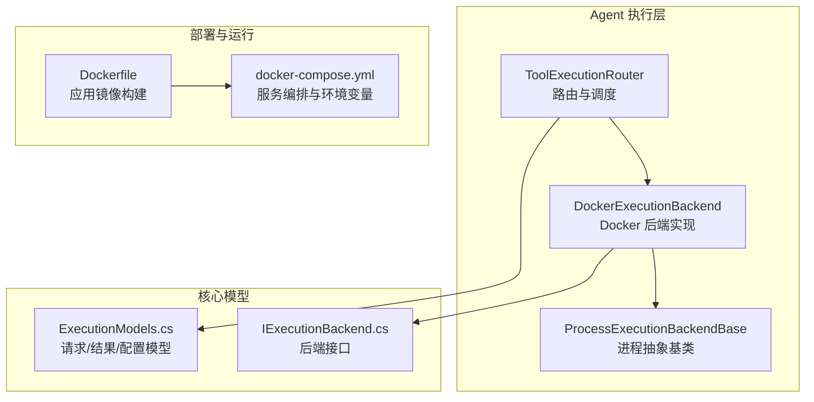
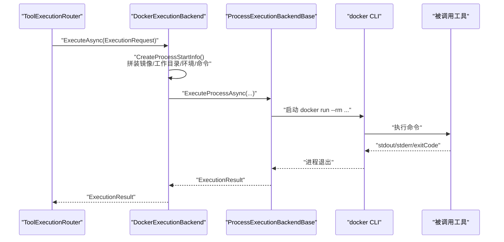
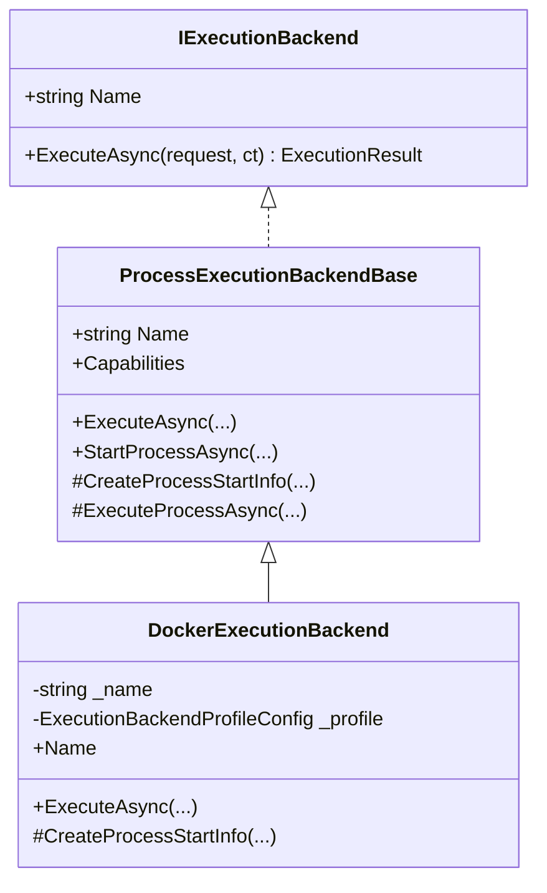
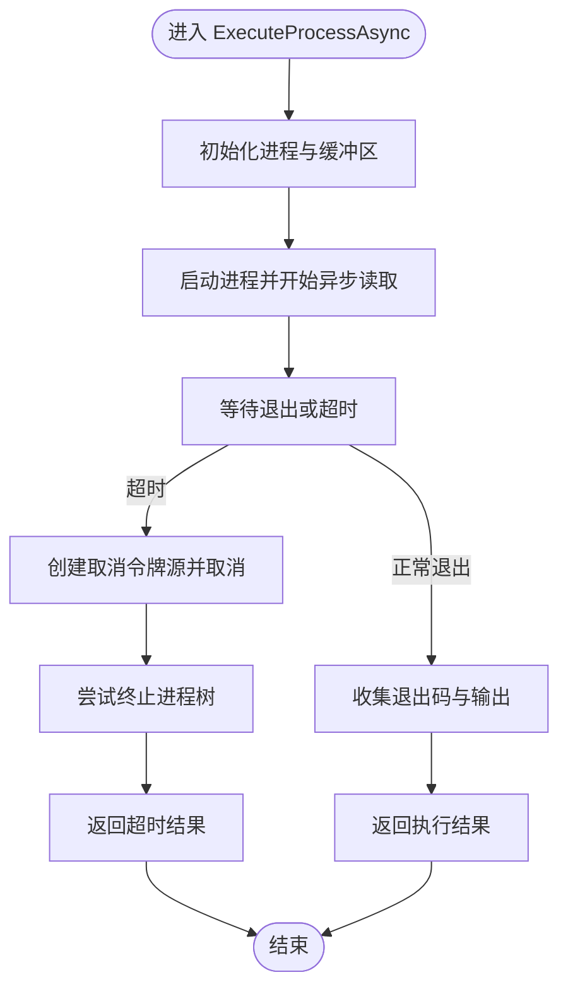
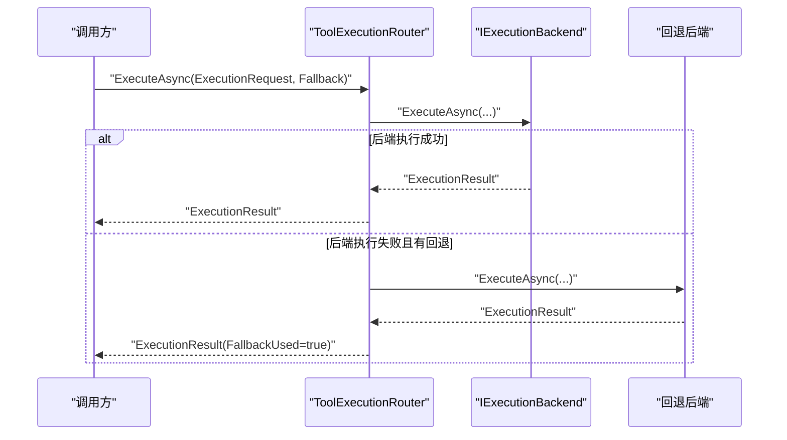
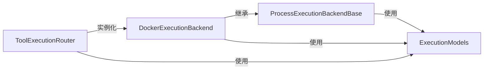

# Docker 执行后端

<cite>
**本文引用的文件**
- [DockerExecutionBackend.cs](file://src/OpenClaw.Agent/Execution/DockerExecutionBackend.cs)
- [ProcessExecutionBackendBase.cs](file://src/OpenClaw.Agent/Execution/ProcessExecutionBackendBase.cs)
- [ExecutionModels.cs](file://src/OpenClaw.Core/Models/ExecutionModels.cs)
- [IExecutionBackend.cs](file://src/OpenClaw.Core/Abstractions/IExecutionBackend.cs)
- [ToolExecutionRouter.cs](file://src/OpenClaw.Agent/Execution/ToolExecutionRouter.cs)
- [Dockerfile](file://Dockerfile)
- [docker-compose.yml](file://docker-compose.yml)
</cite>

## 目录
1. [简介](#简介)
2. [项目结构](#项目结构)
3. [核心组件](#核心组件)
4. [架构总览](#架构总览)
5. [详细组件分析](#详细组件分析)
6. [依赖关系分析](#依赖关系分析)
7. [性能考虑](#性能考虑)
8. [故障排查指南](#故障排查指南)
9. [结论](#结论)
10. [附录](#附录)

## 简介
本文件面向“Docker 执行后端”的技术文档，系统性说明其在 OpenClaw 体系中的定位与实现方式：如何通过 Docker 容器化执行工具命令；容器镜像管理、环境变量传递与工作目录挂载机制；配置项（镜像选择、超时、工作目录等）；容器生命周期管理、自动清理与错误处理；以及部署要求、性能优化与安全配置。同时给出最佳实践与常见问题解决方案。

## 项目结构
Docker 执行后端位于 Agent 层的 Execution 子模块中，采用“进程抽象 + 具体后端实现”的分层设计，并通过路由层统一调度不同后端。核心文件如下：
- 后端实现：DockerExecutionBackend.cs
- 进程基类：ProcessExecutionBackendBase.cs
- 模型定义：ExecutionModels.cs
- 接口契约：IExecutionBackend.cs
- 路由与调度：ToolExecutionRouter.cs
- 部署与运行：Dockerfile、docker-compose.yml

图表来源
- [ToolExecutionRouter.cs:1-253](file://src/OpenClaw.Agent/Execution/ToolExecutionRouter.cs#L1-L253)
- [DockerExecutionBackend.cs:1-66](file://src/OpenClaw.Agent/Execution/DockerExecutionBackend.cs#L1-L66)
- [ProcessExecutionBackendBase.cs:1-142](file://src/OpenClaw.Agent/Execution/ProcessExecutionBackendBase.cs#L1-L142)
- [ExecutionModels.cs:1-179](file://src/OpenClaw.Core/Models/ExecutionModels.cs#L1-L179)
- [IExecutionBackend.cs:1-13](file://src/OpenClaw.Core/Abstractions/IExecutionBackend.cs#L1-L13)
- [Dockerfile:1-59](file://Dockerfile#L1-L59)
- [docker-compose.yml:1-68](file://docker-compose.yml#L1-L68)

章节来源
- [DockerExecutionBackend.cs:1-66](file://src/OpenClaw.Agent/Execution/DockerExecutionBackend.cs#L1-L66)
- [ProcessExecutionBackendBase.cs:1-142](file://src/OpenClaw.Agent/Execution/ProcessExecutionBackendBase.cs#L1-L142)
- [ExecutionModels.cs:1-179](file://src/OpenClaw.Core/Models/ExecutionModels.cs#L1-L179)
- [IExecutionBackend.cs:1-13](file://src/OpenClaw.Core/Abstractions/IExecutionBackend.cs#L1-L13)
- [ToolExecutionRouter.cs:1-253](file://src/OpenClaw.Agent/Execution/ToolExecutionRouter.cs#L1-L253)
- [Dockerfile:1-59](file://Dockerfile#L1-L59)
- [docker-compose.yml:1-68](file://docker-compose.yml#L1-L68)

## 核心组件
- Docker 执行后端：继承进程抽象基类，使用 docker CLI 启动一次性容器执行命令，支持镜像选择、工作目录挂载、环境变量注入与自动清理。
- 进程抽象基类：统一处理进程启动、输出捕获、超时控制、取消与退出码收集。
- 路由器：根据工具配置与沙箱策略解析后端路由，支持回退后端与模板镜像解析。
- 模型与接口：定义执行请求、结果、能力集与后端类型枚举，确保跨后端一致的行为契约。

章节来源
- [DockerExecutionBackend.cs:6-66](file://src/OpenClaw.Agent/Execution/DockerExecutionBackend.cs#L6-L66)
- [ProcessExecutionBackendBase.cs:8-142](file://src/OpenClaw.Agent/Execution/ProcessExecutionBackendBase.cs#L8-L142)
- [ToolExecutionRouter.cs:7-63](file://src/OpenClaw.Agent/Execution/ToolExecutionRouter.cs#L7-L63)
- [ExecutionModels.cs:54-179](file://src/OpenClaw.Core/Models/ExecutionModels.cs#L54-L179)
- [IExecutionBackend.cs:5-12](file://src/OpenClaw.Core/Abstractions/IExecutionBackend.cs#L5-L12)

## 架构总览
Docker 执行后端作为“进程型后端”之一，通过 docker CLI 在宿主机上以一次性容器运行工具命令。其关键流程：
- 路由层根据工具与配置解析目标后端与镜像模板；
- Docker 后端构造 docker run 命令参数（镜像、工作目录、环境变量、命令与参数），并启用 --rm 自动清理；
- 进程基类负责启动进程、异步读取标准输出/错误流、超时与取消处理；
- 结果封装为统一的 ExecutionResult 返回给调用方。

图表来源
- [ToolExecutionRouter.cs:114-157](file://src/OpenClaw.Agent/Execution/ToolExecutionRouter.cs#L114-L157)
- [DockerExecutionBackend.cs:19-64](file://src/OpenClaw.Agent/Execution/DockerExecutionBackend.cs#L19-L64)
- [ProcessExecutionBackendBase.cs:61-128](file://src/OpenClaw.Agent/Execution/ProcessExecutionBackendBase.cs#L61-L128)

## 详细组件分析

### Docker 执行后端（DockerExecutionBackend）
- 角色与职责
  - 继承进程抽象基类，实现 IExecutionBackend；
  - 将 ExecutionRequest 转换为 docker run 的命令行参数；
  - 使用 --rm 实现容器自动清理；
  - 支持超时控制与取消。
- 关键行为
  - 镜像选择：优先使用请求模板，其次使用后端配置镜像；若均为空则抛出异常；
  - 工作目录挂载：可选地设置 -w；
  - 环境变量：合并后端全局环境与请求局部环境；
  - 命令与参数：将请求命令与参数追加到 docker run 后；
  - 输出与超时：通过基类统一捕获输出并处理超时与取消。
- 错误处理
  - 缺失镜像：立即抛出无效操作异常；
  - 超时：返回带 TimedOut 标记的结果并尝试终止进程树；
  - 取消：外部取消时同样尝试终止进程树。

图表来源
- [IExecutionBackend.cs:5-12](file://src/OpenClaw.Core/Abstractions/IExecutionBackend.cs#L5-L12)
- [ProcessExecutionBackendBase.cs:8-46](file://src/OpenClaw.Agent/Execution/ProcessExecutionBackendBase.cs#L8-L46)
- [DockerExecutionBackend.cs:6-17](file://src/OpenClaw.Agent/Execution/DockerExecutionBackend.cs#L6-L17)

章节来源
- [DockerExecutionBackend.cs:6-66](file://src/OpenClaw.Agent/Execution/DockerExecutionBackend.cs#L6-L66)

### 进程抽象基类（ProcessExecutionBackendBase）
- 角色与职责
  - 提供统一的进程生命周期管理与结果封装；
  - 支持一次性命令执行与交互式进程两种模式；
  - 处理标准输出/错误流的异步读取与缓冲；
  - 超时与取消：基于链接的取消令牌源，超时触发取消并尝试终止进程树；
  - 进程 ID 获取：尽力获取本地进程 PID，失败时返回空。
- 关键流程
  - ExecuteProcessAsync：启动进程、开启异步读取、等待退出或超时、汇总结果；
  - StartProcessAsync：用于交互式进程，返回托管进程句柄。

图表来源
- [ProcessExecutionBackendBase.cs:61-128](file://src/OpenClaw.Agent/Execution/ProcessExecutionBackendBase.cs#L61-L128)

章节来源
- [ProcessExecutionBackendBase.cs:8-142](file://src/OpenClaw.Agent/Execution/ProcessExecutionBackendBase.cs#L8-L142)

### 路由与调度（ToolExecutionRouter）
- 角色与职责
  - 根据工具名称与配置解析后端路由；
  - 支持显式路由与沙箱策略解析；
  - 支持回退后端（fallback）与模板镜像解析；
  - 判断后端是否需要工作空间（Docker/Ssh 需要）。
- 关键逻辑
  - 构造后端字典：按配置类型实例化后端；
  - 解析路由：优先配置，其次沙箱策略；
  - 执行：调用具体后端执行，必要时回退到备用后端。

图表来源
- [ToolExecutionRouter.cs:114-157](file://src/OpenClaw.Agent/Execution/ToolExecutionRouter.cs#L114-L157)

章节来源
- [ToolExecutionRouter.cs:7-63](file://src/OpenClaw.Agent/Execution/ToolExecutionRouter.cs#L7-L63)
- [ToolExecutionRouter.cs:159-162](file://src/OpenClaw.Agent/Execution/ToolExecutionRouter.cs#L159-L162)
- [ToolExecutionRouter.cs:233-234](file://src/OpenClaw.Agent/Execution/ToolExecutionRouter.cs#L233-L234)

### 配置模型与类型（ExecutionModels）
- 执行配置（ExecutionConfig）：启用开关、默认后端、后端配置集合、工具路由映射；
- 后端配置（ExecutionBackendProfileConfig）：类型、启用、工作目录、环境、镜像、超时、工作空间根等；
- 请求/结果（ExecutionRequest/ExecutionResult）：统一的执行契约；
- 后端类型（ExecutionBackendType）：local、opensandbox、docker、ssh；
- 进程相关模型：进程启动请求、状态、日志与输入请求等。

章节来源
- [ExecutionModels.cs:8-179](file://src/OpenClaw.Core/Models/ExecutionModels.cs#L8-L179)

## 依赖关系分析
- DockerExecutionBackend 依赖：
  - 进程抽象基类（统一的进程生命周期与结果封装）；
  - 执行模型（请求/结果/配置）；
  - 路由器（后端注册与调度）。
- 路由器依赖：
  - 配置对象（ExecutionConfig）；
  - 后端工厂（按类型实例化）；
  - 沙箱策略（可选）。

图表来源
- [ToolExecutionRouter.cs:28-62](file://src/OpenClaw.Agent/Execution/ToolExecutionRouter.cs#L28-L62)
- [DockerExecutionBackend.cs:6-17](file://src/OpenClaw.Agent/Execution/DockerExecutionBackend.cs#L6-L17)
- [ProcessExecutionBackendBase.cs:8-17](file://src/OpenClaw.Agent/Execution/ProcessExecutionBackendBase.cs#L8-L17)
- [ExecutionModels.cs:8-41](file://src/OpenClaw.Core/Models/ExecutionModels.cs#L8-L41)

章节来源
- [ToolExecutionRouter.cs:28-62](file://src/OpenClaw.Agent/Execution/ToolExecutionRouter.cs#L28-L62)
- [DockerExecutionBackend.cs:6-17](file://src/OpenClaw.Agent/Execution/DockerExecutionBackend.cs#L6-L17)
- [ProcessExecutionBackendBase.cs:8-17](file://src/OpenClaw.Agent/Execution/ProcessExecutionBackendBase.cs#L8-L17)
- [ExecutionModels.cs:8-41](file://src/OpenClaw.Core/Models/ExecutionModels.cs#L8-L41)

## 性能考虑
- 容器启动开销
  - docker run 一次性容器启动存在固定延迟，建议复用镜像与减少不必要的环境变量注入；
  - 对频繁执行的小工具，可考虑预热镜像或使用更轻量的基础镜像。
- I/O 与流捕获
  - 异步读取 stdout/stderr，避免阻塞；注意长输出场景下的内存占用，必要时结合日志拉取接口；
  - 控制超时时间，防止长时间阻塞导致资源泄漏。
- 并发与隔离
  - Docker 后端天然隔离，适合并发执行；但需关注宿主机资源上限与镜像缓存占用。
- 网络与存储
  - 默认不暴露额外端口；如需网络访问，建议最小化权限与白名单；
  - 工作目录挂载仅在需要时启用，避免不必要的文件系统共享。

## 故障排查指南
- 常见问题与定位
  - “缺少镜像”：检查后端配置与请求模板，确认镜像名称有效；
  - “超时”：增大 TimeoutSeconds 或优化工具执行逻辑；确认容器内命令本身耗时；
  - “无输出”：确认命令正确、工作目录与环境变量设置合理；
  - “权限不足”：检查宿主机 docker 权限与镜像内用户权限。
- 回退机制
  - 路由器支持回退后端，当主后端失败时自动切换至备用后端（需在配置中指定）；
  - 回退结果会标记 FallbackUsed=true，便于审计与诊断。
- 日志与可观测性
  - 使用统一的 ExecutionResult 中的 Stdout/Stderr 字段；
  - 对于长时间任务，结合进程日志拉取接口进行增量读取。

章节来源
- [DockerExecutionBackend.cs:24-26](file://src/OpenClaw.Agent/Execution/DockerExecutionBackend.cs#L24-L26)
- [ProcessExecutionBackendBase.cs:95-116](file://src/OpenClaw.Agent/Execution/ProcessExecutionBackendBase.cs#L95-L116)
- [ToolExecutionRouter.cs:125-153](file://src/OpenClaw.Agent/Execution/ToolExecutionRouter.cs#L125-L153)

## 结论
Docker 执行后端通过 docker CLI 以一次性容器的方式执行工具命令，具备清晰的镜像管理、环境变量与工作目录挂载机制，并在进程抽象基类中统一了超时、取消与结果封装。配合路由层的配置驱动与回退策略，能够灵活适配多工具、多后端的执行需求。在生产环境中，应重点关注镜像缓存、超时与资源限制、网络与存储隔离，以及日志与可观测性的建设。

## 附录

### 部署要求与运行
- 应用镜像构建
  - 使用多阶段构建，最终运行镜像基于 chiseled 运行时依赖，非 root 用户运行；
  - 默认暴露端口与健康检查，支持单文件发布与内存目录准备。
- 服务编排与环境变量
  - compose 文件定义服务、端口映射、环境变量与卷挂载；
  - 必需环境变量包括模型提供商密钥与认证令牌；
  - 可选反向代理（Caddy）与自动 TLS，按需启用。

章节来源
- [Dockerfile:1-59](file://Dockerfile#L1-L59)
- [docker-compose.yml:1-68](file://docker-compose.yml#L1-L68)

### 最佳实践
- 镜像选择
  - 为不同工具族选择专用镜像，减少启动与依赖加载时间；
  - 使用只读根文件系统与最小化依赖，提升安全性与稳定性。
- 环境变量与工作目录
  - 仅注入必要环境变量，避免污染；
  - 工作目录挂载仅在需要持久化或读写文件时启用。
- 资源与网络
  - 设置合理的超时与重试策略；
  - 限制网络访问范围，必要时使用自定义网络或代理。
- 安全配置
  - 非 root 用户运行容器；
  - 严格控制卷挂载路径与权限；
  - 使用只读文件系统与最小权限原则。