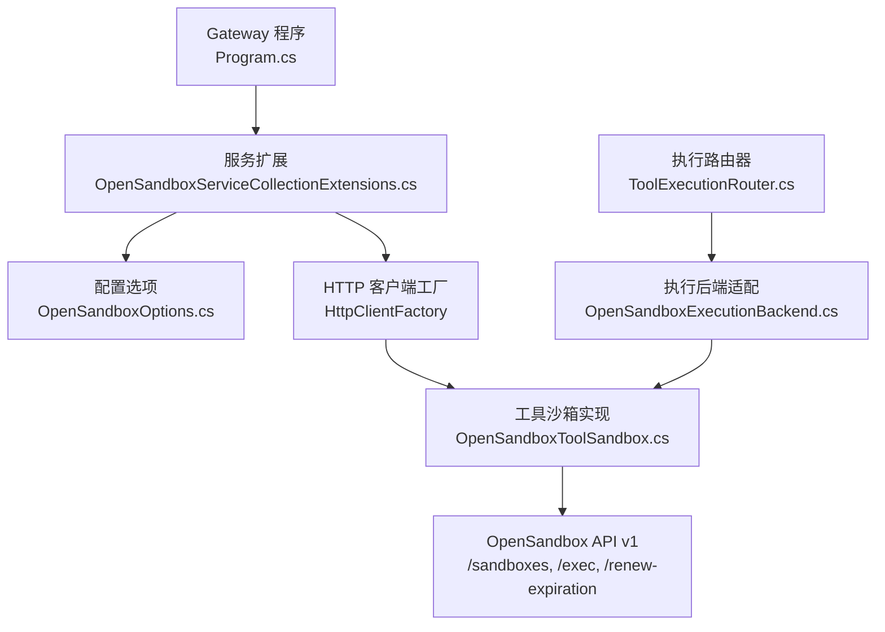
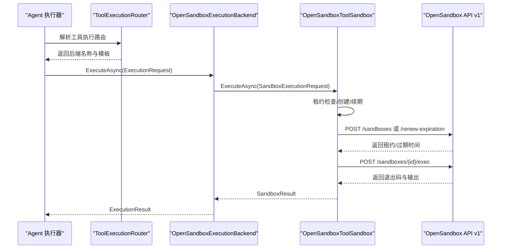
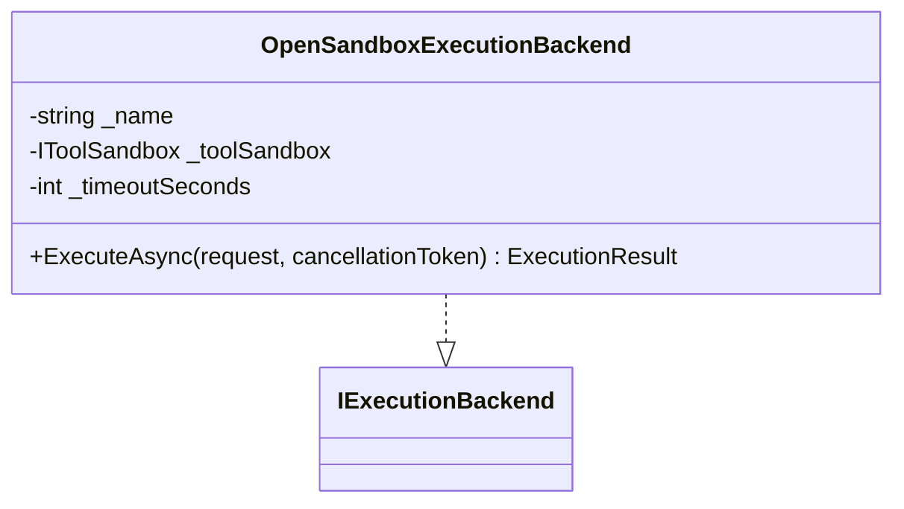
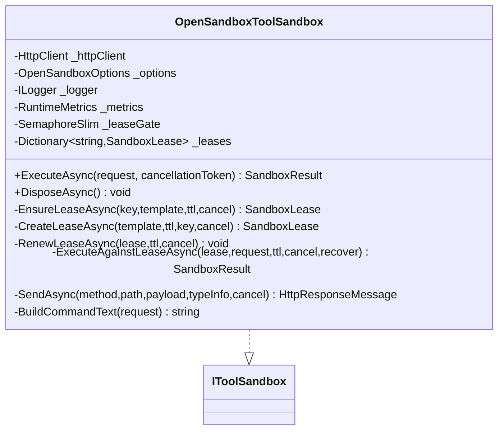
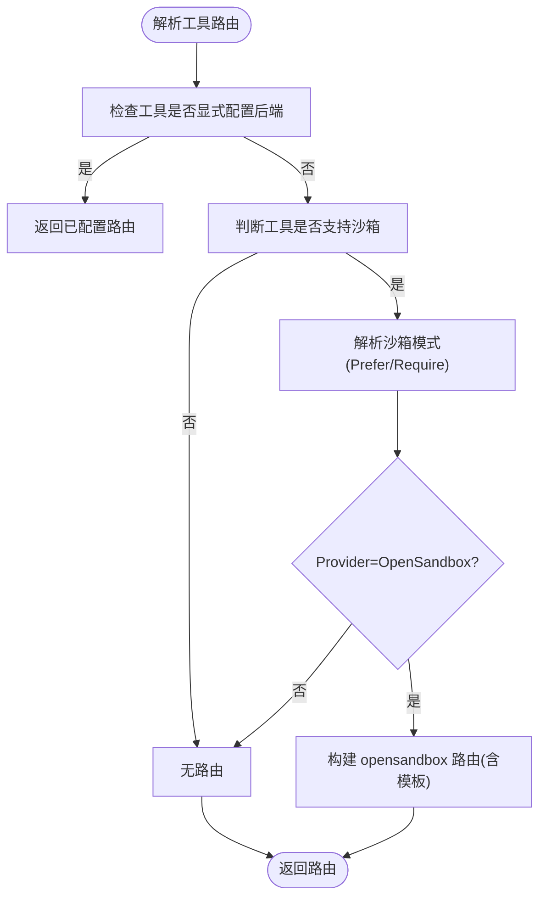
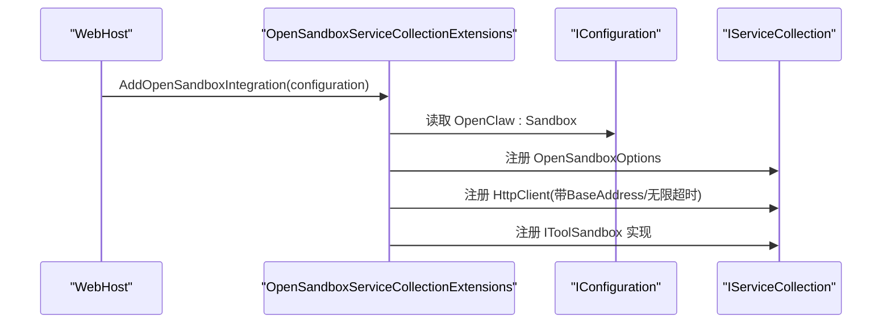
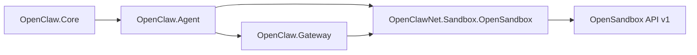

# OpenSandbox 执行后端

<cite>
**本文引用的文件**
- [OpenSandboxExecutionBackend.cs](file://src/OpenClaw.Agent/Execution/OpenSandboxExecutionBackend.cs)
- [OpenSandboxToolSandbox.cs](file://src/OpenClawNet.Sandbox.OpenSandbox/OpenSandboxToolSandbox.cs)
- [OpenSandboxOptions.cs](file://src/OpenClawNet.Sandbox.OpenSandbox/OpenSandboxOptions.cs)
- [OpenSandboxJsonModels.cs](file://src/OpenClawNet.Sandbox.OpenSandbox/OpenSandboxJsonModels.cs)
- [OpenSandboxJsonContext.cs](file://src/OpenClawNet.Sandbox.OpenSandbox/OpenSandboxJsonContext.cs)
- [OpenSandboxServiceCollectionExtensions.cs](file://src/OpenClawNet.Sandbox.OpenSandbox/OpenSandboxServiceCollectionExtensions.cs)
- [IToolSandbox.cs](file://src/OpenClaw.Core/Abstractions/IToolSandbox.cs)
- [SandboxModels.cs](file://src/OpenClaw.Core/Models/SandboxModels.cs)
- [SandboxConfig.cs](file://src/OpenClaw.Core/Models/SandboxConfig.cs)
- [ToolExecutionRouter.cs](file://src/OpenClaw.Agent/Execution/ToolExecutionRouter.cs)
- [Program.cs](file://src/OpenClaw.Gateway/Program.cs)
- [sandboxing.md](file://docs/sandboxing.md)
- [Dockerfile.opensandbox](file://Dockerfile.opensandbox)
- [Dockerfile.opensandbox.base](file://Dockerfile.opensandbox.base)
- [OpenSandboxToolSandboxTests.cs](file://src/OpensandboxToolSandboxTests.cs)
</cite>

## 目录
1. [简介](#简介)
2. [项目结构](#项目结构)
3. [核心组件](#核心组件)
4. [架构总览](#架构总览)
5. [详细组件分析](#详细组件分析)
6. [依赖关系分析](#依赖关系分析)
7. [性能考量](#性能考量)
8. [故障排除指南](#故障排除指南)
9. [结论](#结论)
10. [附录](#附录)

## 简介
本文件面向 OpenSandbox 执行后端，系统性阐述其在 OpenClaw.NET 中的集成方式、架构设计、安全隔离机制、配置选项、性能特性与扩展能力，并对比传统沙箱方案的优势。OpenSandbox 通过独立的外部服务提供容器化沙箱执行能力，OpenClaw 将高风险本地工具（如 shell、code_exec、browser）路由至该服务，从而显著降低宿主暴露面并提升资源控制与可审计性。

## 项目结构
OpenSandbox 执行后端由三层组成：
- 网关侧集成入口：在网关启动时按条件启用 OpenSandbox 集成，并注册相关服务。
- 执行后端适配层：将通用的 IExecutionBackend 抽象映射到 OpenSandbox 后端。
- 沙箱工具封装层：实现 IToolSandbox 接口，负责与 OpenSandbox API 交互、租约管理、命令构建与错误处理。

**图表来源**
- [Program.cs:76-78](file://src/OpenClaw.Gateway/Program.cs#L76-L78)
- [OpenSandboxServiceCollectionExtensions.cs:12-48](file://src/OpenClawNet.Sandbox.OpenSandbox/OpenSandboxServiceCollectionExtensions.cs#L12-L48)
- [OpenSandboxExecutionBackend.cs:7-18](file://src/OpenClaw.Agent/Execution/OpenSandboxExecutionBackend.cs#L7-L18)
- [OpenSandboxToolSandbox.cs:14](file://src/OpenClawNet.Sandbox.OpenSandbox/OpenSandboxToolSandbox.cs#L14)

**章节来源**
- [Program.cs:76-78](file://src/OpenClaw.Gateway/Program.cs#L76-L78)
- [OpenSandboxServiceCollectionExtensions.cs:12-48](file://src/OpenClawNet.Sandbox.OpenSandbox/OpenSandboxServiceCollectionExtensions.cs#L12-L48)
- [OpenSandboxExecutionBackend.cs:7-18](file://src/OpenClaw.Agent/Execution/OpenSandboxExecutionBackend.cs#L7-L18)
- [OpenSandboxToolSandbox.cs:14](file://src/OpenClawNet.Sandbox.OpenSandbox/OpenSandboxToolSandbox.cs#L14)

## 核心组件
- IToolSandbox：统一的工具沙箱执行接口，定义 ExecuteAsync 方法。
- OpenSandboxToolSandbox：IToolSandbox 的实现，负责与 OpenSandbox API 通信、租约生命周期管理、命令构建与序列化。
- OpenSandboxExecutionBackend：IExecutionBackend 的实现，将通用执行请求转交给 IToolSandbox。
- OpenSandboxOptions：OpenSandbox 连接参数（Endpoint、ApiKey、DefaultTTL）及 BaseURI 规范化。
- OpenSandboxJsonModels/JsonContext：与 OpenSandbox API 对应的 JSON 序列化模型与上下文。
- ToolExecutionRouter：根据工具与配置解析执行路由，支持 OpenSandbox 后端与回退策略。
- SandboxConfig/SandboxModels：沙箱配置与模式枚举（None/Prefer/Require）等。

**章节来源**
- [IToolSandbox.cs:5-10](file://src/OpenClaw.Core/Abstractions/IToolSandbox.cs#L5-L10)
- [OpenSandboxToolSandbox.cs:14](file://src/OpenClawNet.Sandbox.OpenSandbox/OpenSandboxToolSandbox.cs#L14)
- [OpenSandboxExecutionBackend.cs:7-18](file://src/OpenClaw.Agent/Execution/OpenSandboxExecutionBackend.cs#L7-L18)
- [OpenSandboxOptions.cs:3-16](file://src/OpenClawNet.Sandbox.OpenSandbox/OpenSandboxOptions.cs#L3-L16)
- [OpenSandboxJsonModels.cs:5-47](file://src/OpenClawNet.Sandbox.OpenSandbox/OpenSandboxJsonModels.cs#L5-L47)
- [OpenSandboxJsonContext.cs:5-16](file://src/OpenClawNet.Sandbox.OpenSandbox/OpenSandboxJsonContext.cs#L5-L16)
- [ToolExecutionRouter.cs:53-60](file://src/OpenClaw.Agent/Execution/ToolExecutionRouter.cs#L53-L60)
- [SandboxConfig.cs:3-46](file://src/OpenClaw.Core/Models/SandboxConfig.cs#L3-L46)
- [SandboxModels.cs:3-26](file://src/OpenClaw.Core/Models/SandboxModels.cs#L3-L26)

## 架构总览
OpenSandbox 在 OpenClaw 中采用“可选集成”设计：默认不包含在标准运行时中，需通过编译开关启用；运行时通过配置选择 Provider=OpenSandbox 并提供 Endpoint、ApiKey、默认 TTL 与工具模板映射。执行流程如下：

**图表来源**
- [ToolExecutionRouter.cs:104-111](file://src/OpenClaw.Agent/Execution/ToolExecutionRouter.cs#L104-L111)
- [OpenSandboxExecutionBackend.cs:22-67](file://src/OpenClaw.Agent/Execution/OpenSandboxExecutionBackend.cs#L22-L67)
- [OpenSandboxToolSandbox.cs:48-81](file://src/OpenClawNet.Sandbox.OpenSandbox/OpenSandboxToolSandbox.cs#L48-L81)
- [OpenSandboxJsonModels.cs:17-26](file://src/OpenClawNet.Sandbox.OpenSandbox/OpenSandboxJsonModels.cs#L17-L26)

## 详细组件分析

### 组件一：OpenSandbox 执行后端适配（OpenSandboxExecutionBackend）
- 角色：将通用执行请求转换为沙箱请求，注入超时控制与结果封装。
- 关键点：
  - 使用 Stopwatch 记录耗时。
  - 基于构造函数传入的超时秒数设置取消令牌。
  - 将 ExecutionRequest 映射为 SandboxExecutionRequest 并调用 IToolSandbox。
  - 捕获 OperationCanceledException 区分“外部取消”与“超时”，返回 TimedOut 标志。

**图表来源**
- [OpenSandboxExecutionBackend.cs:7-67](file://src/OpenClaw.Agent/Execution/OpenSandboxExecutionBackend.cs#L7-L67)

**章节来源**
- [OpenSandboxExecutionBackend.cs:7-67](file://src/OpenClaw.Agent/Execution/OpenSandboxExecutionBackend.cs#L7-L67)

### 组件二：OpenSandbox 工具沙箱（OpenSandboxToolSandbox）
- 角色：实现 IToolSandbox，负责与 OpenSandbox API 交互、租约生命周期管理、命令构建与错误处理。
- 关键点：
  - 租约管理：EnsureLeaseAsync/RecoverMissingLeaseAsync/Lease 回收与并发控制（SemaphoreSlim）。
  - 命令构建：BuildCommandText 组装 export、cd 与最终命令，校验环境变量名格式。
  - 请求发送：SendAsync 统一封装 HTTP 调用，区分 NotFound/5xx/4xx 并抛出对应异常类型。
  - 序列化：使用 Source Generator 的 OpenSandboxJsonContext 进行高效 JSON 处理。
  - 资源释放：DisposeAsync 清理所有租约。

**图表来源**
- [OpenSandboxToolSandbox.cs:14](file://src/OpenClawNet.Sandbox.OpenSandbox/OpenSandboxToolSandbox.cs#L14)
- [OpenSandboxToolSandbox.cs:108-146](file://src/OpenClawNet.Sandbox.OpenSandbox/OpenSandboxToolSandbox.cs#L108-L146)
- [OpenSandboxToolSandbox.cs:148-212](file://src/OpenClawNet.Sandbox.OpenSandbox/OpenSandboxToolSandbox.cs#L148-L212)
- [OpenSandboxToolSandbox.cs:214-241](file://src/OpenClawNet.Sandbox.OpenSandbox/OpenSandboxToolSandbox.cs#L214-L241)
- [OpenSandboxToolSandbox.cs:267-297](file://src/OpenClawNet.Sandbox.OpenSandbox/OpenSandboxToolSandbox.cs#L267-L297)
- [OpenSandboxToolSandbox.cs:299-350](file://src/OpenClawNet.Sandbox.OpenSandbox/OpenSandboxToolSandbox.cs#L299-L350)
- [OpenSandboxToolSandbox.cs:381-409](file://src/OpenClawNet.Sandbox.OpenSandbox/OpenSandboxToolSandbox.cs#L381-L409)

**章节来源**
- [OpenSandboxToolSandbox.cs:14](file://src/OpenClawNet.Sandbox.OpenSandbox/OpenSandboxToolSandbox.cs#L14)
- [OpenSandboxToolSandbox.cs:48-81](file://src/OpenClawNet.Sandbox.OpenSandbox/OpenSandboxToolSandbox.cs#L48-L81)
- [OpenSandboxToolSandbox.cs:108-146](file://src/OpenClawNet.Sandbox.OpenSandbox/OpenSandboxToolSandbox.cs#L108-L146)
- [OpenSandboxToolSandbox.cs:148-212](file://src/OpenClawNet.Sandbox.OpenSandbox/OpenSandboxToolSandbox.cs#L148-L212)
- [OpenSandboxToolSandbox.cs:214-241](file://src/OpenClawNet.Sandbox.OpenSandbox/OpenSandboxToolSandbox.cs#L214-L241)
- [OpenSandboxToolSandbox.cs:267-297](file://src/OpenClawNet.Sandbox.OpenSandbox/OpenSandboxToolSandbox.cs#L267-L297)
- [OpenSandboxToolSandbox.cs:299-350](file://src/OpenClawNet.Sandbox.OpenSandbox/OpenSandboxToolSandbox.cs#L299-L350)
- [OpenSandboxToolSandbox.cs:381-409](file://src/OpenClawNet.Sandbox.OpenSandbox/OpenSandboxToolSandbox.cs#L381-L409)

### 组件三：执行路由与后端选择（ToolExecutionRouter）
- 角色：根据工具与配置决定执行路径，支持 OpenSandbox 后端与回退策略。
- 关键点：
  - 当配置 Provider=OpenSandbox 且存在 IToolSandbox 实例时，注册名为 “opensandbox” 的后端。
  - 对于支持沙箱的工具，解析 Effective Mode（None/Prefer/Require），并生成执行路由。
  - 支持 fallbackBackend 与 AllowLocalFallback 控制失败时的回退行为。

**图表来源**
- [ToolExecutionRouter.cs:65-112](file://src/OpenClaw.Agent/Execution/ToolExecutionRouter.cs#L65-L112)
- [ToolExecutionRouter.cs:53-60](file://src/OpenClaw.Agent/Execution/ToolExecutionRouter.cs#L53-L60)

**章节来源**
- [ToolExecutionRouter.cs:65-112](file://src/OpenClaw.Agent/Execution/ToolExecutionRouter.cs#L65-L112)
- [ToolExecutionRouter.cs:114-157](file://src/OpenClaw.Agent/Execution/ToolExecutionRouter.cs#L114-L157)

### 组件四：配置与服务注册（OpenSandboxServiceCollectionExtensions）
- 角色：从 IConfiguration 读取 OpenClaw:Sandbox 配置，注册 OpenSandboxOptions、HttpClient 与 IToolSandbox 实例。
- 关键点：
  - 支持 env:/raw: 形式的密钥引用解析。
  - 默认禁用超时，由 OpenSandbox 服务端控制 TTL。
  - 仅当 Provider=OpenSandbox 时才注册。

**图表来源**
- [OpenSandboxServiceCollectionExtensions.cs:12-48](file://src/OpenClawNet.Sandbox.OpenSandbox/OpenSandboxServiceCollectionExtensions.cs#L12-L48)

**章节来源**
- [OpenSandboxServiceCollectionExtensions.cs:12-48](file://src/OpenClawNet.Sandbox.OpenSandbox/OpenSandboxServiceCollectionExtensions.cs#L12-L48)

### 组件五：JSON 模型与上下文（OpenSandboxJsonModels/JsonContext）
- 角色：定义与 OpenSandbox API v1 兼容的请求/响应模型，并通过 Source Generation 提升序列化性能。
- 关键点：
  - Create/Renew/Exec 请求/响应模型一一对应。
  - JsonContext 标注为 camelCase 命名策略，忽略空值。

**章节来源**
- [OpenSandboxJsonModels.cs:5-47](file://src/OpenClawNet.Sandbox.OpenSandbox/OpenSandboxJsonModels.cs#L5-L47)
- [OpenSandboxJsonContext.cs:5-16](file://src/OpenClawNet.Sandbox.OpenSandbox/OpenSandboxJsonContext.cs#L5-L16)

## 依赖关系分析
- 松耦合：OpenSandbox 集成为可选模块，通过编译宏与运行时配置控制启用。
- 低侵入：核心运行时不依赖 OpenSandbox SDK，仅使用 HttpClient 与 Source Generated JSON。
- 可观测性：通过 RuntimeMetrics 记录租约创建/复用/恢复次数，便于运营监控。
- 错误分类：对网络异常、超时、4xx/5xx 进行明确分类，便于上层策略处理。

**图表来源**
- [Program.cs:76-78](file://src/OpenClaw.Gateway/Program.cs#L76-L78)
- [OpenSandboxServiceCollectionExtensions.cs:12-48](file://src/OpenClawNet.Sandbox.OpenSandbox/OpenSandboxServiceCollectionExtensions.cs#L12-L48)

**章节来源**
- [Program.cs:76-78](file://src/OpenClaw.Gateway/Program.cs#L76-L78)
- [OpenSandboxServiceCollectionExtensions.cs:12-48](file://src/OpenClawNet.Sandbox.OpenSandbox/OpenSandboxServiceCollectionExtensions.cs#L12-L48)

## 性能考量
- 序列化性能：使用 Source Generation 减少反射开销，提高 JSON 编解码效率。
- 并发租约：通过租约门闩（SemaphoreSlim）与字典缓存，避免重复创建同一租约，降低 API 调用频率。
- 超时控制：后端适配层设置超时取消，防止长时间阻塞；服务端 TTL 由 DefaultTTL 或请求级 TimeToLiveSeconds 决定。
- 运维指标：记录租约创建/复用/恢复计数，辅助容量规划与问题定位。

**章节来源**
- [OpenSandboxToolSandbox.cs:21-23](file://src/OpenClawNet.Sandbox.OpenSandbox/OpenSandboxToolSandbox.cs#L21-L23)
- [OpenSandboxExecutionBackend.cs:26-28](file://src/OpenClaw.Agent/Execution/OpenSandboxExecutionBackend.cs#L26-L28)
- [OpenSandboxServiceCollectionExtensions.cs:35-39](file://src/OpenClawNet.Sandbox.OpenSandbox/OpenSandboxServiceCollectionExtensions.cs#L35-L39)

## 故障排除指南
- 连接不可达/超时
  - 现象：抛出 ToolSandboxUnavailableException，消息包含“unreachable/timed out”。
  - 排查：确认 Endpoint 正确、网络连通、防火墙放行；检查 API Key 是否正确。
- 租约缺失（NotFound）
  - 现象：内部抛出 OpenSandboxMissingLeaseException，自动触发租约恢复逻辑。
  - 排查：确认 OpenSandbox 服务状态正常；查看日志中租约恢复计数。
- 命令执行失败
  - 现象：返回非零退出码与 stderr 输出。
  - 排查：检查命令与参数、工作目录权限、环境变量名合法性（仅允许字母/数字/下划线，且以字母或下划线开头）。
- 配置错误
  - 现象：启动阶段未注册 OpenSandbox 服务（Provider 非 OpenSandbox）。
  - 排查：核对 appsettings 中 OpenClaw:Sandbox.Provider 与编译宏 OPENCLAW_ENABLE_OPENSANDBOX。

**章节来源**
- [OpenSandboxToolSandbox.cs:315-350](file://src/OpenClawNet.Sandbox.OpenSandbox/OpenSandboxToolSandbox.cs#L315-L350)
- [OpenSandboxToolSandbox.cs:138-145](file://src/OpenClawNet.Sandbox.OpenSandbox/OpenSandboxToolSandbox.cs#L138-L145)
- [OpenSandboxToolSandbox.cs:389-390](file://src/OpenClawNet.Sandbox.OpenSandbox/OpenSandboxToolSandbox.cs#L389-L390)
- [OpenSandboxServiceCollectionExtensions.cs:17-23](file://src/OpenClawNet.Sandbox.OpenSandbox/OpenSandboxServiceCollectionExtensions.cs#L17-L23)

## 结论
OpenSandbox 执行后端通过“可选集成+轻量实现”的设计，在不增加核心运行时复杂度的前提下，提供了强大的安全隔离与资源控制能力。它将高风险工具执行外置到受控的容器环境中，结合租约复用、并发控制与可观测性指标，满足生产环境对安全性与可运维性的双重需求。

## 附录

### 配置选项与说明
- Provider：None/ OpenSandbox（None 时强制本地执行）
- Endpoint：OpenSandbox API 地址（自动补全 /v1）
- ApiKey：支持 env:NAME 或 raw:VALUE 形式
- DefaultTTL：默认租约存活秒数
- Tools.*.Mode：None/Prefer/Require
- Tools.*.Template：容器镜像 URI（直接传递给 OpenSandbox 创建租约）
- Tools.*.TTL：单次租约 TTL（优先于 DefaultTTL）

**章节来源**
- [sandboxing.md:55-141](file://docs/sandboxing.md#L55-L141)
- [SandboxConfig.cs:3-27](file://src/OpenClaw.Core/Models/SandboxConfig.cs#L3-L27)
- [OpenSandboxOptions.cs:5-16](file://src/OpenClawNet.Sandbox.OpenSandbox/OpenSandboxOptions.cs#L5-L16)

### 部署要求与示例
- 构建启用 OpenSandbox 的网关镜像：使用 Dockerfile.opensandbox，配合编译参数 OPENCLAW_ENABLE_OPENSANDBOX=true。
- 基础镜像：Dockerfile.opensandbox.base 提供预装 Node/Playwright/Python 等工具的基础层，便于快速迭代应用镜像。
- 运行时环境变量：内存存储路径、工作区根目录、绑定地址与端口等已在 Dockerfile 中预设。

**章节来源**
- [sandboxing.md:159-263](file://docs/sandboxing.md#L159-L263)
- [Dockerfile.opensandbox:24-28](file://Dockerfile.opensandbox#L24-L28)
- [Dockerfile.opensandbox:79-104](file://Dockerfile.opensandbox#L79-L104)
- [Dockerfile.opensandbox.base:15-75](file://Dockerfile.opensandbox.base#L15-L75)

### 使用示例与最佳实践
- 示例：将 shell 设置为 Require 模式，确保 shell 命令在 OpenSandbox 中执行。
- 最佳实践：
  - 生产环境优先使用 Require 模式，避免回退到本地执行。
  - 为不同工具配置专用模板镜像，按需调整 TTL。
  - 开启租约复用与续期，减少频繁创建销毁带来的开销。
  - 监控租约创建/复用/恢复指标，及时发现异常。

**章节来源**
- [sandboxing.md:101-131](file://docs/sandboxing.md#L101-L131)
- [OpenSandboxToolSandbox.cs:161](file://src/OpenClawNet.Sandbox.OpenSandbox/OpenSandboxToolSandbox.cs#L161)
- [OpenSandboxToolSandbox.cs:219-235](file://src/OpenClawNet.Sandbox.OpenSandbox/OpenSandboxToolSandbox.cs#L219-L235)

### 与传统沙箱的区别与优势
- 外部化执行：命令在远程容器中执行，不直接暴露到网关主机。
- 可观测与治理：通过租约与指标实现可审计、可追踪的执行过程。
- 资源控制：服务端 TTL 与镜像模板实现更强的资源边界与一致性。
- 与 JS/TS 工具的差异：当前 V1 仅覆盖原生高风险工具，JS/TS 工具保持不变，便于渐进式迁移。

**章节来源**
- [sandboxing.md:142-157](file://docs/sandboxing.md#L142-L157)

### 测试与验证
- 单元测试覆盖了租约创建/复用/恢复、并发创建、环境变量校验、HTTP 异常映射等关键场景。
- 建议在集成测试中验证 OpenSandbox 服务可用性、镜像拉取与 Playwright 浏览器初始化。

**章节来源**
- [OpenSandboxToolSandboxTests.cs:15-110](file://src/OpenClaw.Tests/OpenSandboxToolSandboxTests.cs#L15-L110)
- [OpenSandboxToolSandboxTests.cs:149-192](file://src/OpenClaw.Tests/OpenSandboxToolSandboxTests.cs#L149-L192)
- [OpenSandboxToolSandboxTests.cs:195-233](file://src/OpenClaw.Tests/OpenSandboxToolSandboxTests.cs#L195-L233)
- [OpenSandboxToolSandboxTests.cs:236-271](file://src/OpenClaw.Tests/OpenSandboxToolSandboxTests.cs#L236-L271)
- [OpenSandboxToolSandboxTests.cs:323-335](file://src/OpenClaw.Tests/OpenSandboxToolSandboxTests.cs#L323-L335)