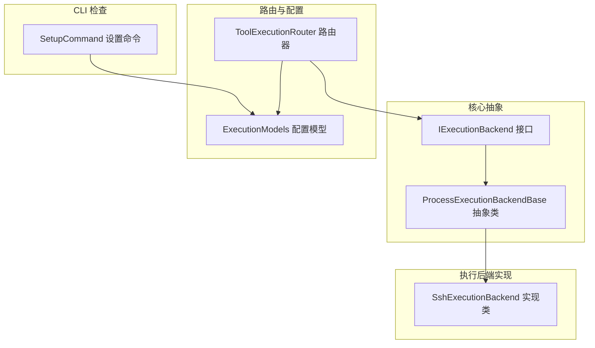
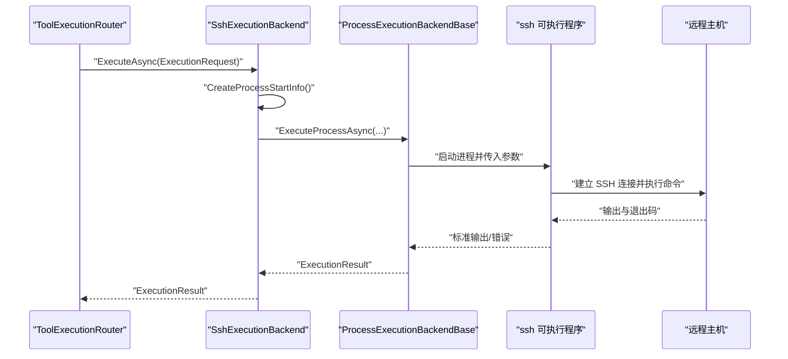
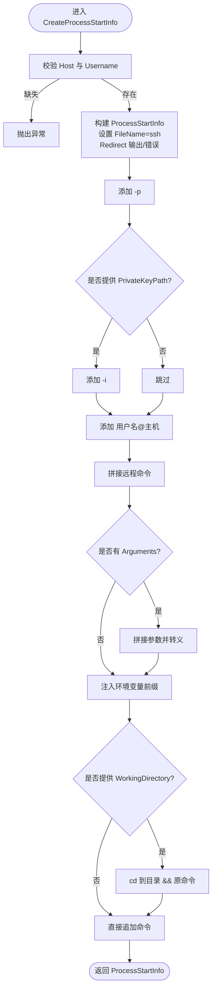
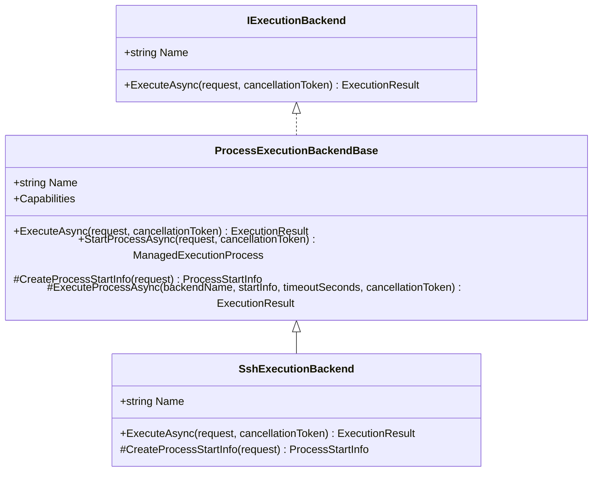
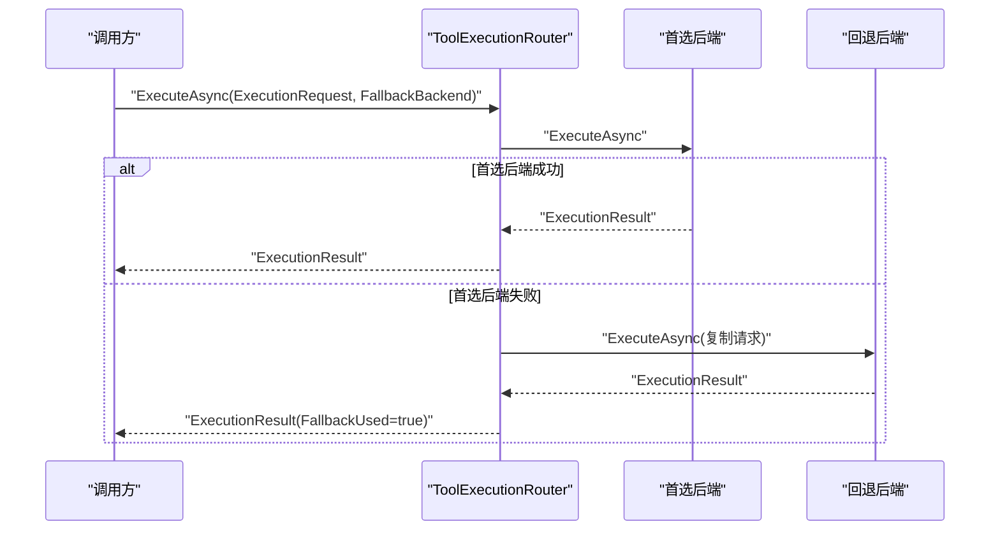

# SSH 执行后端

<cite>
**本文引用的文件**
- [SshExecutionBackend.cs](file://src/OpenClaw.Agent/Execution/SshExecutionBackend.cs)
- [ProcessExecutionBackendBase.cs](file://src/OpenClaw.Agent/Execution/ProcessExecutionBackendBase.cs)
- [IExecutionBackend.cs](file://src/OpenClaw.Core/Abstractions/IExecutionBackend.cs)
- [ExecutionModels.cs](file://src/OpenClaw.Core/Models/ExecutionModels.cs)
- [ToolExecutionRouter.cs](file://src/OpenClaw.Agent/Execution/ToolExecutionRouter.cs)
- [SetupCommand.cs](file://src/OpenClaw.Cli/SetupCommand.cs)
</cite>

## 目录
1. [简介](#简介)
2. [项目结构](#项目结构)
3. [核心组件](#核心组件)
4. [架构总览](#架构总览)
5. [详细组件分析](#详细组件分析)
6. [依赖关系分析](#依赖关系分析)
7. [性能考虑](#性能考虑)
8. [故障排除指南](#故障排除指南)
9. [结论](#结论)
10. [附录](#附录)

## 简介
本文件面向 SSH 执行后端的技术文档，系统性说明其设计与实现：如何通过本地系统中的 ssh 可执行程序，在远程主机上执行工具命令；如何进行连接参数（主机、端口、用户名、私钥路径）配置；如何传递命令参数、设置环境变量、指定工作目录；以及超时控制、错误处理与安全注意事项。同时给出配置示例、网络要求、故障排除方法与性能优化建议。

## 项目结构
SSH 执行后端位于 Agent 层的 Execution 子模块中，采用“进程型后端”抽象，复用统一的进程生命周期与结果收集逻辑，并通过路由层按工具与后端配置进行选择。

**图表来源**
- [SshExecutionBackend.cs:6-62](file://src/OpenClaw.Agent/Execution/SshExecutionBackend.cs#L6-L62)
- [ProcessExecutionBackendBase.cs:8-141](file://src/OpenClaw.Agent/Execution/ProcessExecutionBackendBase.cs#L8-L141)
- [ToolExecutionRouter.cs:7-63](file://src/OpenClaw.Agent/Execution/ToolExecutionRouter.cs#L7-L63)
- [ExecutionModels.cs:26-41](file://src/OpenClaw.Core/Models/ExecutionModels.cs#L26-L41)
- [SetupCommand.cs:330-344](file://src/OpenClaw.Cli/SetupCommand.cs#L330-L344)

**章节来源**
- [SshExecutionBackend.cs:1-63](file://src/OpenClaw.Agent/Execution/SshExecutionBackend.cs#L1-L63)
- [ProcessExecutionBackendBase.cs:1-142](file://src/OpenClaw.Agent/Execution/ProcessExecutionBackendBase.cs#L1-L142)
- [ToolExecutionRouter.cs:1-253](file://src/OpenClaw.Agent/Execution/ToolExecutionRouter.cs#L1-L253)
- [ExecutionModels.cs:1-179](file://src/OpenClaw.Core/Models/ExecutionModels.cs#L1-L179)
- [SetupCommand.cs:330-344](file://src/OpenClaw.Cli/SetupCommand.cs#L330-L344)

## 核心组件
- SSH 执行后端实现：负责将请求转换为本地 ssh 命令行参数，启动进程并捕获输出与退出码。
- 进程后端基类：提供统一的进程生命周期管理、超时控制、标准流捕获与结果封装。
- 路由器：根据工具与后端配置解析执行路径，支持回退后端与模板选择。
- 配置模型：定义后端类型、主机、端口、用户名、私钥路径、超时、工作目录等。
- CLI 检查：安装/设置阶段检测本地 ssh 是否可用，并提示相关警告。

**章节来源**
- [SshExecutionBackend.cs:6-62](file://src/OpenClaw.Agent/Execution/SshExecutionBackend.cs#L6-L62)
- [ProcessExecutionBackendBase.cs:8-141](file://src/OpenClaw.Agent/Execution/ProcessExecutionBackendBase.cs#L8-L141)
- [ToolExecutionRouter.cs:7-63](file://src/OpenClaw.Agent/Execution/ToolExecutionRouter.cs#L7-L63)
- [ExecutionModels.cs:26-41](file://src/OpenClaw.Core/Models/ExecutionModels.cs#L26-L41)
- [SetupCommand.cs:398-436](file://src/OpenClaw.Cli/SetupCommand.cs#L398-L436)

## 架构总览
SSH 执行后端通过本地 ssh 客户端发起远程命令执行，参数由后端配置与请求参数共同决定。路由器根据工具路由规则选择后端，执行完成后返回统一的执行结果对象。

**图表来源**
- [ToolExecutionRouter.cs:114-157](file://src/OpenClaw.Agent/Execution/ToolExecutionRouter.cs#L114-L157)
- [SshExecutionBackend.cs:19-20](file://src/OpenClaw.Agent/Execution/SshExecutionBackend.cs#L19-L20)
- [ProcessExecutionBackendBase.cs:61-128](file://src/OpenClaw.Agent/Execution/ProcessExecutionBackendBase.cs#L61-L128)

## 详细组件分析

### SSH 执行后端实现
- 继承关系：SshExecutionBackend 继承自 ProcessExecutionBackendBase，复用统一的进程生命周期与超时控制。
- 关键职责：
  - 将 ExecutionRequest 转换为 ssh 命令行参数。
  - 支持端口、私钥路径、用户名、主机等配置项。
  - 支持工作目录切换与环境变量注入。
  - 支持超时控制与进程终止。
- 参数拼装要点：
  - 必填项校验：主机与用户名必须存在。
  - 端口参数：-p <port>。
  - 私钥参数：-i <privateKeyPath>（可选）。
  - 用户@主机：作为 ssh 的目标地址。
  - 命令与参数：将请求中的 Arguments 按需转义后拼接到命令末尾。
  - 工作目录：若提供，则以 cd 切换到目标目录后再执行命令。
  - 环境变量：将后端与请求的环境变量合并，前置到命令字符串。
  - 引号与转义：对包含空白字符或双引号的值进行必要转义。

**图表来源**
- [SshExecutionBackend.cs:22-61](file://src/OpenClaw.Agent/Execution/SshExecutionBackend.cs#L22-L61)

**章节来源**
- [SshExecutionBackend.cs:6-62](file://src/OpenClaw.Agent/Execution/SshExecutionBackend.cs#L6-L62)

### 进程后端基类
- 统一能力：声明后端能力（一次性命令、进程、PTY、交互输入）。
- 进程启动：构造 ProcessStartInfo，重定向标准输入/输出/错误，启动进程。
- 结果收集：异步等待进程退出，累计标准输出与标准错误。
- 超时控制：基于配置的超时秒数创建取消令牌源；超时则尝试终止进程树并返回超时结果。
- 返回结构：统一的 ExecutionResult，包含后端名、退出码、输出、超时标记、耗时等。

**图表来源**
- [IExecutionBackend.cs:5-12](file://src/OpenClaw.Core/Abstractions/IExecutionBackend.cs#L5-L12)
- [ProcessExecutionBackendBase.cs:8-141](file://src/OpenClaw.Agent/Execution/ProcessExecutionBackendBase.cs#L8-L141)
- [SshExecutionBackend.cs:6-62](file://src/OpenClaw.Agent/Execution/SshExecutionBackend.cs#L6-L62)

**章节来源**
- [ProcessExecutionBackendBase.cs:8-141](file://src/OpenClaw.Agent/Execution/ProcessExecutionBackendBase.cs#L8-L141)

### 路由与回退
- 路由器根据工具名称与配置解析后端与回退策略，支持按工具覆盖默认后端。
- 当首选后端执行失败且配置了回退后端时，自动降级到回退后端继续执行，并在结果中标记已使用回退。
- 对于某些工具（如 shell），可将后端设置为 ssh 并配置回退到 local。

**图表来源**
- [ToolExecutionRouter.cs:114-157](file://src/OpenClaw.Agent/Execution/ToolExecutionRouter.cs#L114-L157)

**章节来源**
- [ToolExecutionRouter.cs:7-63](file://src/OpenClaw.Agent/Execution/ToolExecutionRouter.cs#L7-L63)
- [ToolExecutionRouter.cs:114-157](file://src/OpenClaw.Agent/Execution/ToolExecutionRouter.cs#L114-L157)

### 配置模型与 CLI 检查
- 后端配置模型包含：类型、启用状态、工作目录、环境变量、主机、端口、用户名、私钥路径、超时、工作区根等字段。
- CLI 在设置阶段会检测本地 ssh 是否可用，并在 PATH 缺失时给出警告；当配置了 ssh 后端但未启用 shell 时也会提示。

**章节来源**
- [ExecutionModels.cs:26-41](file://src/OpenClaw.Core/Models/ExecutionModels.cs#L26-L41)
- [SetupCommand.cs:330-344](file://src/OpenClaw.Cli/SetupCommand.cs#L330-L344)
- [SetupCommand.cs:398-436](file://src/OpenClaw.Cli/SetupCommand.cs#L398-L436)

## 依赖关系分析
- 组件耦合：
  - SshExecutionBackend 依赖 ProcessExecutionBackendBase 提供的进程生命周期与超时控制。
  - 路由器聚合多个后端实现，按配置动态选择。
  - 配置模型贯穿后端与路由器，驱动行为。
- 外部依赖：
  - 依赖本地 ssh 可执行程序；需要确保 PATH 中可找到 ssh。
  - 依赖操作系统进程模型与标准流捕获。
- 潜在循环依赖：
  - 无直接循环；路由器持有后端集合，后端不反向依赖路由器。

**图表来源**
- [ToolExecutionRouter.cs:36-57](file://src/OpenClaw.Agent/Execution/ToolExecutionRouter.cs#L36-L57)
- [SshExecutionBackend.cs:6-15](file://src/OpenClaw.Agent/Execution/SshExecutionBackend.cs#L6-L15)
- [ProcessExecutionBackendBase.cs:8-17](file://src/OpenClaw.Agent/Execution/ProcessExecutionBackendBase.cs#L8-L17)
- [SetupCommand.cs:330-344](file://src/OpenClaw.Cli/SetupCommand.cs#L330-L344)

**章节来源**
- [ToolExecutionRouter.cs:36-57](file://src/OpenClaw.Agent/Execution/ToolExecutionRouter.cs#L36-L57)
- [SshExecutionBackend.cs:6-15](file://src/OpenClaw.Agent/Execution/SshExecutionBackend.cs#L6-L15)
- [ProcessExecutionBackendBase.cs:8-17](file://src/OpenClaw.Agent/Execution/ProcessExecutionBackendBase.cs#L8-L17)
- [SetupCommand.cs:330-344](file://src/OpenClaw.Cli/SetupCommand.cs#L330-L344)

## 性能考虑
- 连接复用：当前实现每次执行均新建 ssh 进程，未内置连接池。对于高频短命令场景，可考虑在应用侧缓存连接或减少不必要的重复连接。
- 超时设置：通过后端配置的超时秒数限制单次执行时间，避免长时间阻塞。
- 输出捕获：异步读取标准输出与错误流，避免阻塞；注意在高吞吐场景下及时消费输出，防止缓冲区溢出。
- 命令拼接：对参数与环境变量进行必要转义，避免 shell 注入与解析错误。
- 网络抖动：结合路由器的回退策略，将易失败的 ssh 后端回退到本地执行，提升整体稳定性。

[本节为通用性能建议，无需特定文件引用]

## 故障排除指南
- 本地 ssh 不可用
  - 现象：设置阶段提示 ssh 未找到 PATH。
  - 处理：安装 openssh 或将其加入 PATH，重新运行设置流程。
- 主机与用户名缺失
  - 现象：执行时报错要求 Host 与 Username。
  - 处理：完善后端配置中的 Host 与 Username 字段。
- 私钥路径无效
  - 现象：SSH 认证失败或权限不足。
  - 处理：确认私钥路径正确、权限仅限当前用户、格式兼容。
- 超时被触发
  - 现象：返回 TimedOut=true。
  - 处理：增大后端超时配置；检查远端命令复杂度与网络延迟；必要时拆分任务。
- 回退执行
  - 现象：返回 FallbackUsed=true。
  - 处理：检查首选后端可用性与网络连通性，必要时调整路由配置。

**章节来源**
- [SetupCommand.cs:398-436](file://src/OpenClaw.Cli/SetupCommand.cs#L398-L436)
- [SshExecutionBackend.cs:24-25](file://src/OpenClaw.Agent/Execution/SshExecutionBackend.cs#L24-L25)
- [ProcessExecutionBackendBase.cs:95-116](file://src/OpenClaw.Agent/Execution/ProcessExecutionBackendBase.cs#L95-L116)
- [ToolExecutionRouter.cs:125-153](file://src/OpenClaw.Agent/Execution/ToolExecutionRouter.cs#L125-L153)

## 结论
SSH 执行后端通过本地 ssh 客户端实现远程命令执行，具备清晰的参数拼装、超时控制与结果封装。其设计遵循统一的进程后端抽象，便于扩展与维护。实际部署中应关注 ssh 可用性、认证配置与网络稳定性，并结合回退策略与超时设置提升鲁棒性。

[本节为总结性内容，无需特定文件引用]

## 附录

### 配置示例（说明性）
- 后端类型：ssh
- 主机与端口：Host、Port
- 认证方式：Username、PrivateKeyPath（可选）
- 工作目录：WorkingDirectory（可选）
- 环境变量：Environment（可选）
- 超时：TimeoutSeconds（可选）

**章节来源**
- [ExecutionModels.cs:26-41](file://src/OpenClaw.Core/Models/ExecutionModels.cs#L26-L41)

### 网络与安全要求
- 网络要求：本地可访问 ssh 可执行程序；远端主机开放 SSH 服务；防火墙允许从本地到远端的 22 端口（或自定义端口）。
- 安全要求：
  - 使用非密码认证（推荐公钥）。
  - 私钥文件权限仅限当前用户读取。
  - 严格控制环境变量与命令参数，避免注入风险。
  - 限制后端超时，防止长时间占用资源。
  - 在不可信网络中建议使用隧道或受控代理。

**章节来源**
- [SshExecutionBackend.cs:38-42](file://src/OpenClaw.Agent/Execution/SshExecutionBackend.cs#L38-L42)
- [ProcessExecutionBackendBase.cs:87-116](file://src/OpenClaw.Agent/Execution/ProcessExecutionBackendBase.cs#L87-L116)