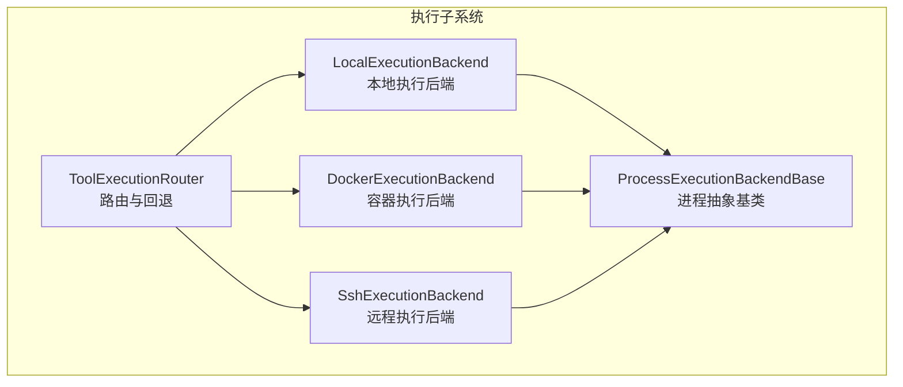
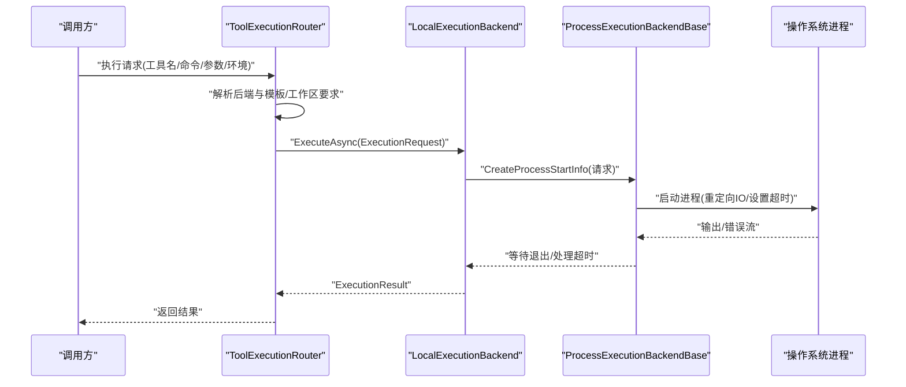
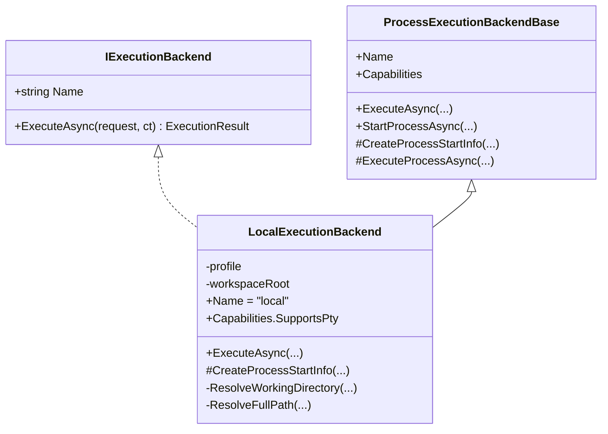
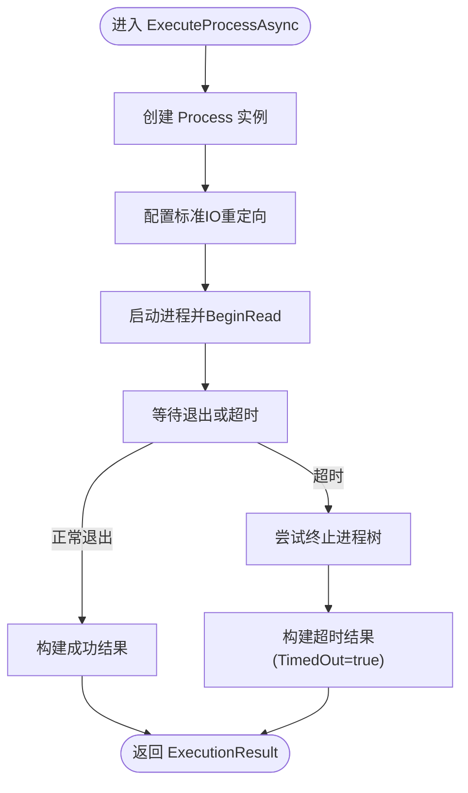
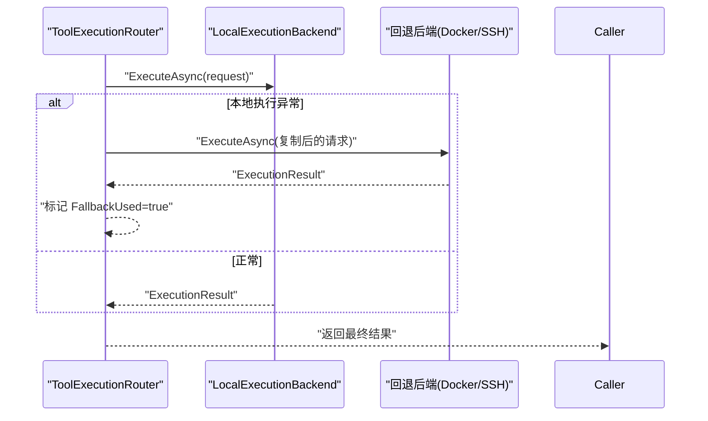
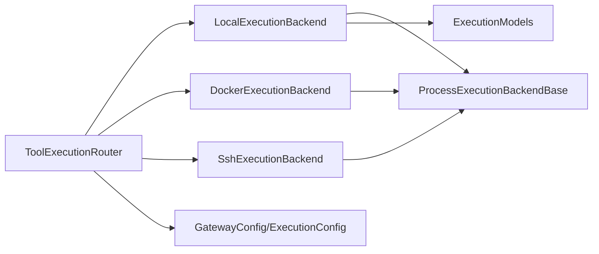

# 本地执行后端

<cite>
**本文引用的文件**
- [LocalExecutionBackend.cs](file://src/OpenClaw.Agent/Execution/LocalExecutionBackend.cs)
- [ProcessExecutionBackendBase.cs](file://src/OpenClaw.Agent/Execution/ProcessExecutionBackendBase.cs)
- [ToolExecutionRouter.cs](file://src/OpenClaw.Agent/Execution/ToolExecutionRouter.cs)
- [ExecutionModels.cs](file://src/OpenClaw.Core/Models/ExecutionModels.cs)
- [GatewayConfig.cs](file://src/OpenClaw.Core/Models/GatewayConfig.cs)
- [IExecutionBackend.cs](file://src/OpenClaw.Core/Abstractions/IExecutionBackend.cs)
- [DockerExecutionBackend.cs](file://src/OpenClaw.Agent/Execution/DockerExecutionBackend.cs)
- [SshExecutionBackend.cs](file://src/OpenClaw.Agent/Execution/SshExecutionBackend.cs)
</cite>

## 目录
1. [简介](#简介)
2. [项目结构](#项目结构)
3. [核心组件](#核心组件)
4. [架构总览](#架构总览)
5. [详细组件分析](#详细组件分析)
6. [依赖关系分析](#依赖关系分析)
7. [性能考量](#性能考量)
8. [故障排除指南](#故障排除指南)
9. [结论](#结论)
10. [附录：配置与最佳实践](#附录配置与最佳实践)

## 简介
本文件面向“本地执行后端”，系统性阐述其在本地系统上直接执行工具命令的实现原理、安全机制、权限控制与资源限制策略；详解进程启动参数配置、环境变量传递与工作目录设置；对比本地执行与其他执行后端（Docker、SSH、OpenSandbox）的差异与适用场景；并提供配置示例、性能特征与安全最佳实践，以及常见问题排查方法。

## 项目结构
本地执行后端位于执行子系统中，采用“抽象基类 + 具体后端”的分层设计：
- 抽象基类负责统一的进程生命周期管理、超时控制与输出捕获
- 具体后端仅负责构造 ProcessStartInfo 或外部命令行参数
- 执行路由器负责根据工具与配置选择后端，并支持回退策略

图表来源
- [ToolExecutionRouter.cs:1-253](file://src/OpenClaw.Agent/Execution/ToolExecutionRouter.cs#L1-L253)
- [ProcessExecutionBackendBase.cs:1-142](file://src/OpenClaw.Agent/Execution/ProcessExecutionBackendBase.cs#L1-L142)
- [LocalExecutionBackend.cs:1-99](file://src/OpenClaw.Agent/Execution/LocalExecutionBackend.cs#L1-L99)
- [DockerExecutionBackend.cs:1-66](file://src/OpenClaw.Agent/Execution/DockerExecutionBackend.cs#L1-L66)
- [SshExecutionBackend.cs:1-63](file://src/OpenClaw.Agent/Execution/SshExecutionBackend.cs#L1-L63)

章节来源
- [ToolExecutionRouter.cs:1-253](file://src/OpenClaw.Agent/Execution/ToolExecutionRouter.cs#L1-L253)
- [ProcessExecutionBackendBase.cs:1-142](file://src/OpenClaw.Agent/Execution/ProcessExecutionBackendBase.cs#L1-L142)
- [LocalExecutionBackend.cs:1-99](file://src/OpenClaw.Agent/Execution/LocalExecutionBackend.cs#L1-L99)

## 核心组件
- 本地执行后端：直接在本机启动进程，支持交互式输入、伪终端（非 Windows）、工作目录沙箱校验与环境变量合并
- 进程抽象基类：封装进程启动、异步读取标准输出/错误流、统一超时与终止逻辑
- 执行路由器：按工具与配置解析后端、模板与工作区要求，支持回退到其他后端
- 配置模型：定义执行配置、后端配置、请求/结果模型与能力集

章节来源
- [LocalExecutionBackend.cs:6-28](file://src/OpenClaw.Agent/Execution/LocalExecutionBackend.cs#L6-L28)
- [ProcessExecutionBackendBase.cs:8-46](file://src/OpenClaw.Agent/Execution/ProcessExecutionBackendBase.cs#L8-L46)
- [ToolExecutionRouter.cs:7-63](file://src/OpenClaw.Agent/Execution/ToolExecutionRouter.cs#L7-L63)
- [ExecutionModels.cs:8-86](file://src/OpenClaw.Core/Models/ExecutionModels.cs#L8-L86)

## 架构总览
本地执行后端的调用链路如下：

图表来源
- [ToolExecutionRouter.cs:114-157](file://src/OpenClaw.Agent/Execution/ToolExecutionRouter.cs#L114-L157)
- [LocalExecutionBackend.cs:27-51](file://src/OpenClaw.Agent/Execution/LocalExecutionBackend.cs#L27-L51)
- [ProcessExecutionBackendBase.cs:61-128](file://src/OpenClaw.Agent/Execution/ProcessExecutionBackendBase.cs#L61-L128)

## 详细组件分析

### 本地执行后端（LocalExecutionBackend）
- 角色与职责
  - 实现 IExecutionBackend 接口，作为“local”后端
  - 负责构建 ProcessStartInfo，设置命令、参数、工作目录、环境变量与 IO 重定向
  - 提供能力声明：支持一次性命令、进程、伪终端（非 Windows）、交互式输入
- 工作目录与沙箱
  - 支持显式工作目录、后端默认工作目录、网关工作区根路径与当前目录回退
  - 当请求要求工作区且未开启宽松模式时，会校验工作目录是否位于工作区根之下
  - 支持 ~ 与 ~/ 前缀的用户主目录展开
- 环境变量传递
  - 合并后端配置与请求中的环境变量，后者优先覆盖前者
- 超时与终止
  - 使用统一的 ExecuteProcessAsync 流程，支持超时取消与整树强制终止
- 与抽象基类的关系
  - 继承 ProcessExecutionBackendBase，复用进程生命周期与超时控制

图表来源
- [IExecutionBackend.cs:5-12](file://src/OpenClaw.Core/Abstractions/IExecutionBackend.cs#L5-L12)
- [ProcessExecutionBackendBase.cs:8-46](file://src/OpenClaw.Agent/Execution/ProcessExecutionBackendBase.cs#L8-L46)
- [LocalExecutionBackend.cs:6-51](file://src/OpenClaw.Agent/Execution/LocalExecutionBackend.cs#L6-L51)

章节来源
- [LocalExecutionBackend.cs:6-99](file://src/OpenClaw.Agent/Execution/LocalExecutionBackend.cs#L6-L99)

### 进程抽象基类（ProcessExecutionBackendBase）
- 统一的进程生命周期
  - 封装 ProcessStartInfo 的创建、进程启动、异步读取输出/错误流
  - 提供 StartProcessAsync 以支持交互式进程（stdin/stdout/stderr 重定向、可选伪终端）
- 超时与终止
  - 使用链接的取消令牌在超时触发时尝试终止进程树
  - 超时返回带 TimedOut 标记的结果
- 结果标准化
  - 输出捕获使用 StringBuilder，统一填充 ExecutionResult 的字段

图表来源
- [ProcessExecutionBackendBase.cs:61-128](file://src/OpenClaw.Agent/Execution/ProcessExecutionBackendBase.cs#L61-L128)

章节来源
- [ProcessExecutionBackendBase.cs:1-142](file://src/OpenClaw.Agent/Execution/ProcessExecutionBackendBase.cs#L1-L142)

### 执行路由器（ToolExecutionRouter）
- 后端注册与解析
  - 默认注册 “local” 后端；遍历配置文件中的 profiles，按类型创建对应后端实例
  - 支持 “opensandbox” 后端（当存在沙箱服务时）
- 工具路由
  - 优先从 ExecutionConfig.Tools 解析工具到后端的映射
  - 若工具具备沙箱能力且配置允许，则可路由到 OpenSandbox 模板
- 回退策略
  - 执行失败时，若指定回退后端且允许本地回退（或非本地），则自动切换并返回回退结果
- 进程后端识别
  - 判断某后端是否为“隔离型进程后端”（除 opensandbox 与 local 外的其他进程后端）

图表来源
- [ToolExecutionRouter.cs:114-157](file://src/OpenClaw.Agent/Execution/ToolExecutionRouter.cs#L114-L157)
- [ToolExecutionRouter.cs:205-231](file://src/OpenClaw.Agent/Execution/ToolExecutionRouter.cs#L205-L231)

章节来源
- [ToolExecutionRouter.cs:1-253](file://src/OpenClaw.Agent/Execution/ToolExecutionRouter.cs#L1-L253)

### 与其他执行后端的差异与适用场景
- 本地执行（local）
  - 直接在本机启动进程，无额外运行时依赖
  - 适合轻量命令、脚本与无需隔离的工具调用
  - 通过工作区根与工作目录校验实现路径沙箱
- 容器执行（docker）
  - 通过 docker CLI 启动容器，支持镜像、工作目录挂载与环境变量注入
  - 适合需要隔离、一致化运行环境的工具
- SSH 执行（ssh）
  - 通过 ssh 在远端主机执行命令，支持密钥认证与自定义端口
  - 适合跨主机工具调用与集中式运维场景
- OpenSandbox 执行（opensandbox）
  - 通过沙箱服务提供更强隔离与治理能力
  - 适合高风险工具或合规要求严格的场景

章节来源
- [DockerExecutionBackend.cs:22-64](file://src/OpenClaw.Agent/Execution/DockerExecutionBackend.cs#L22-L64)
- [SshExecutionBackend.cs:22-58](file://src/OpenClaw.Agent/Execution/SshExecutionBackend.cs#L22-L58)
- [ToolExecutionRouter.cs:159-203](file://src/OpenClaw.Agent/Execution/ToolExecutionRouter.cs#L159-L203)

## 依赖关系分析
- 组件耦合
  - LocalExecutionBackend 依赖 ExecutionBackendProfileConfig 与 GatewayConfig 中的 Tooling.WorkspaceRoot
  - ToolExecutionRouter 统一管理所有后端实例，提供路由与回退
  - ProcessExecutionBackendBase 为所有进程型后端提供通用能力
- 外部依赖
  - 本地执行依赖操作系统进程模型与 .NET Process API
  - Docker/SSH 后端依赖系统已安装的 docker/ssh 可执行文件

图表来源
- [ToolExecutionRouter.cs:16-63](file://src/OpenClaw.Agent/Execution/ToolExecutionRouter.cs#L16-L63)
- [LocalExecutionBackend.cs:8-15](file://src/OpenClaw.Agent/Execution/LocalExecutionBackend.cs#L8-L15)
- [GatewayConfig.cs:28](file://src/OpenClaw.Core/Models/GatewayConfig.cs#L28)
- [ExecutionModels.cs:8-41](file://src/OpenClaw.Core/Models/ExecutionModels.cs#L8-L41)

章节来源
- [ToolExecutionRouter.cs:1-253](file://src/OpenClaw.Agent/Execution/ToolExecutionRouter.cs#L1-L253)
- [LocalExecutionBackend.cs:1-99](file://src/OpenClaw.Agent/Execution/LocalExecutionBackend.cs#L1-L99)
- [GatewayConfig.cs:1-800](file://src/OpenClaw.Core/Models/GatewayConfig.cs#L1-L800)
- [ExecutionModels.cs:1-179](file://src/OpenClaw.Core/Models/ExecutionModels.cs#L1-L179)

## 性能考量
- 进程启动开销
  - 本地执行避免了容器拉起或网络连接开销，通常具有更低的启动延迟
- I/O 捕获
  - 异步读取标准输出/错误流，避免阻塞；大输出可能带来内存压力，建议结合超时与日志截断策略
- 超时控制
  - 统一的超时机制可防止长时间运行任务占用资源；超时后会尝试终止进程树
- 并发与并行
  - 网关层可通过配置启用并行工具执行，但需结合本地资源与工具特性评估并发度

## 故障排除指南
- 工作目录被拒绝
  - 现象：抛出无效操作异常，提示工作目录超出工作区根
  - 排查：确认请求的 WorkingDirectory 是否位于 WorkspaceRoot 下；必要时调整配置或请求参数
  - 参考：[LocalExecutionBackend.cs:53-83](file://src/OpenClaw.Agent/Execution/LocalExecutionBackend.cs#L53-L83)
- 未配置工作区根
  - 现象：请求要求工作区但未配置工作区根
  - 排查：在后端配置或网关配置中设置 WorkspaceRoot
  - 参考：[LocalExecutionBackend.cs:60-62](file://src/OpenClaw.Agent/Execution/LocalExecutionBackend.cs#L60-L62)
- 超时被触发
  - 现象：ExecutionResult 标记 TimedOut=true
  - 排查：检查工具执行时间、超时阈值与系统负载；考虑增大 TimeoutSeconds 或优化工具
  - 参考：[ProcessExecutionBackendBase.cs:95-116](file://src/OpenClaw.Agent/Execution/ProcessExecutionBackendBase.cs#L95-L116)
- 回退未生效
  - 现象：本地执行失败但未回退到其他后端
  - 排查：确认 fallbackBackend 名称有效、AllowLocalFallback 设置、非本地回退条件满足
  - 参考：[ToolExecutionRouter.cs:125-153](file://src/OpenClaw.Agent/Execution/ToolExecutionRouter.cs#L125-L153)
- 环境变量未生效
  - 现象：工具无法读取预期环境变量
  - 排查：确认后端配置与请求环境变量键值；注意请求环境变量会覆盖后端配置
  - 参考：[LocalExecutionBackend.cs:45-48](file://src/OpenClaw.Agent/Execution/LocalExecutionBackend.cs#L45-L48)

章节来源
- [LocalExecutionBackend.cs:53-83](file://src/OpenClaw.Agent/Execution/LocalExecutionBackend.cs#L53-L83)
- [ProcessExecutionBackendBase.cs:95-116](file://src/OpenClaw.Agent/Execution/ProcessExecutionBackendBase.cs#L95-L116)
- [ToolExecutionRouter.cs:125-153](file://src/OpenClaw.Agent/Execution/ToolExecutionRouter.cs#L125-L153)

## 结论
本地执行后端以最小开销提供直接的本地命令执行能力，配合工作区根与工作目录校验形成基础沙箱；通过统一的进程抽象与超时控制保障稳定性；借助路由器与回退机制实现灵活的多后端协同。对于不需要强隔离或外部运行时的工具调用，本地执行是高效、可控的首选方案。

## 附录：配置与最佳实践

### 关键配置项
- 执行配置（ExecutionConfig）
  - DefaultBackend：默认后端名称（默认为 local）
  - Profiles：后端配置字典，键为后端名，值为 ExecutionBackendProfileConfig
  - Tools：工具到后端的路由映射
- 后端配置（ExecutionBackendProfileConfig）
  - Type：后端类型（local/docker/ssh/opensandbox）
  - Enabled：是否启用
  - WorkingDirectory：默认工作目录
  - Environment：默认环境变量字典
  - TimeoutSeconds：超时秒数
  - WorkspaceRoot：工作区根路径（用于本地后端的工作目录校验）
  - Image/Host/Port/Username/PrivateKeyPath：容器/SSH 后端专用
- 请求模型（ExecutionRequest）
  - ToolName、BackendName、Command、Arguments、WorkingDirectory、Environment、RequireWorkspace、AllowLocalFallback 等

章节来源
- [ExecutionModels.cs:8-111](file://src/OpenClaw.Core/Models/ExecutionModels.cs#L8-L111)
- [GatewayConfig.cs:412-457](file://src/OpenClaw.Core/Models/GatewayConfig.cs#L412-L457)

### 安全最佳实践
- 严格工作区根
  - 为本地后端配置 WorkspaceRoot，并在请求中启用 RequireWorkspace，确保工作目录位于受控范围
- 最小权限原则
  - 仅注入必要的环境变量；避免在后端配置中暴露敏感信息
- 超时与资源限制
  - 为工具设置合理的 TimeoutSeconds；对长耗时工具考虑拆分或异步化
- 回退策略
  - 对高风险工具配置回退后端（如 Docker/SSH/OpenSandbox），并在失败时记录审计日志
- 输入验证与转义
  - 对传入命令与参数进行白名单校验；SSH 后端会对含空格的值进行引号处理

### 性能特征
- 启动延迟：本地执行通常最低，适合高频短任务
- I/O 峰值：异步读取避免阻塞，但大输出需关注内存占用
- 并发：可结合网关配置启用并行工具执行，但需评估 CPU/磁盘/网络瓶颈