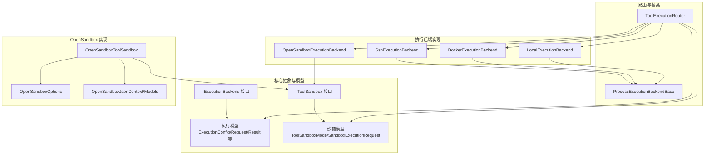
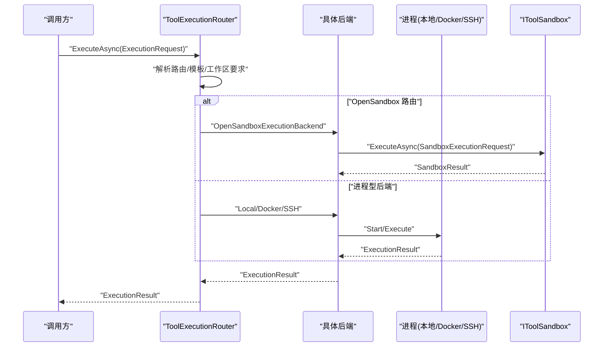
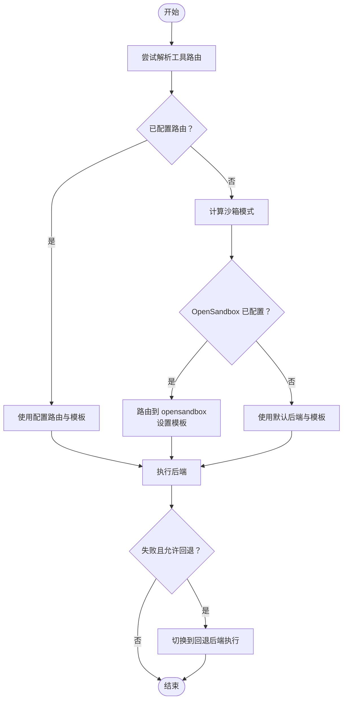
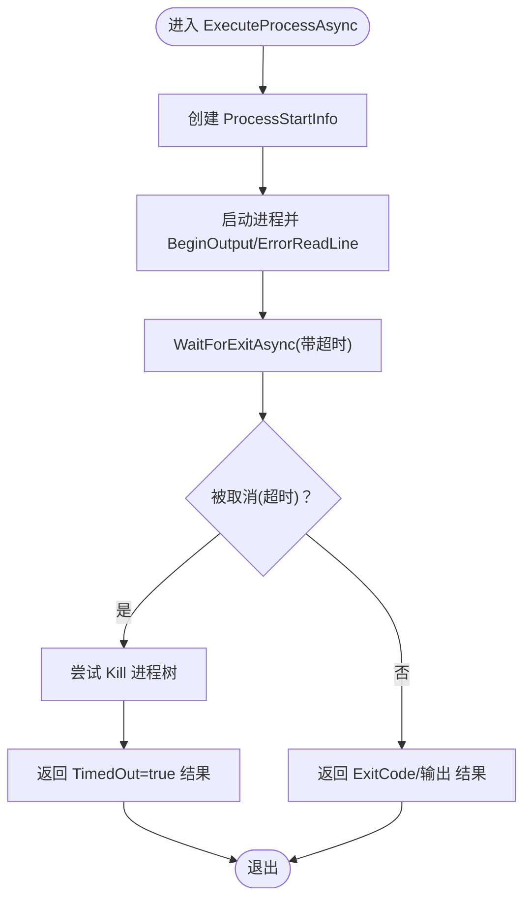
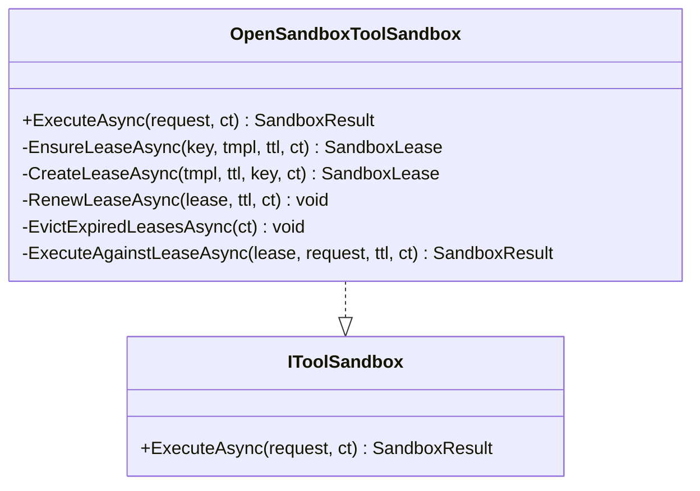
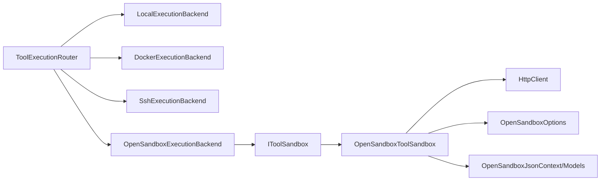

# 执行后端管理

<cite>
**本文引用的文件**
- [LocalExecutionBackend.cs](file://src/OpenClaw.Agent/Execution/LocalExecutionBackend.cs)
- [DockerExecutionBackend.cs](file://src/OpenClaw.Agent/Execution/DockerExecutionBackend.cs)
- [SshExecutionBackend.cs](file://src/OpenClaw.Agent/Execution/SshExecutionBackend.cs)
- [OpenSandboxExecutionBackend.cs](file://src/OpenClaw.Agent/Execution/OpenSandboxExecutionBackend.cs)
- [ToolExecutionRouter.cs](file://src/OpenClaw.Agent/Execution/ToolExecutionRouter.cs)
- [ProcessExecutionBackendBase.cs](file://src/OpenClaw.Agent/Execution/ProcessExecutionBackendBase.cs)
- [IExecutionBackend.cs](file://src/OpenClaw.Core/Abstractions/IExecutionBackend.cs)
- [IToolSandbox.cs](file://src/OpenClaw.Core/Abstractions/IToolSandbox.cs)
- [ExecutionModels.cs](file://src/OpenClaw.Core/Models/ExecutionModels.cs)
- [SandboxModels.cs](file://src/OpenClaw.Core/Models/SandboxModels.cs)
- [OpenSandboxToolSandbox.cs](file://src/OpenClawNet.Sandbox.OpenSandbox/OpenSandboxToolSandbox.cs)
- [GatewayConfig.cs](file://src/OpenClaw.Core/Models/GatewayConfig.cs)
- [OpenSandboxOptions.cs](file://src/OpenClawNet.Sandbox.OpenSandbox/OpenSandboxOptions.cs)
- [OpenSandboxJsonContext.cs](file://src/OpenClawNet.Sandbox.OpenSandbox/OpenSandboxJsonContext.cs)
- [OpenSandboxJsonModels.cs](file://src/OpenClawNet.Sandbox.OpenSandbox/OpenSandboxJsonModels.cs)
- [ProcessToolTests.cs](file://src/OpenClaw.Tests/ProcessToolTests.cs)
- [SetupCommand.cs](file://src/OpenClaw.Cli/SetupCommand.cs)
</cite>

## 目录
1. [简介](#简介)
2. [项目结构](#项目结构)
3. [核心组件](#核心组件)
4. [架构总览](#架构总览)
5. [详细组件分析](#详细组件分析)
6. [依赖关系分析](#依赖关系分析)
7. [性能考量](#性能考量)
8. [故障排除指南](#故障排除指南)
9. [结论](#结论)
10. [附录](#附录)

## 简介
本文件面向“工具执行后端”子系统，系统性阐述本地执行、Docker 容器执行、SSH 远程执行与 OpenSandbox 沙箱执行的架构设计、实现原理与使用场景。重点覆盖：
- 执行路由机制：基于配置的工具到后端映射、默认后端选择、工作区约束与回退策略
- 进程管理：统一的进程启动、标准流捕获、超时与终止控制
- 资源隔离与安全控制：工作区路径限制、环境变量白名单、PTY 支持与交互输入
- 配置选项：后端类型、镜像模板、主机与凭据、超时与工作目录
- 性能优化与故障排除：租约复用、过期清理、错误分类与重试策略
- 具体实现示例与集成方法：通过路由器与沙箱服务进行调用

## 项目结构
执行后端相关代码主要分布在以下模块：
- 核心抽象与模型：定义执行请求、结果、后端能力、沙箱模式等
- 执行后端实现：本地、Docker、SSH、OpenSandbox 四类后端
- 路由器：根据工具与配置解析执行后端、模板与工作区要求
- 沙箱实现：OpenSandbox 的 HTTP 客户端封装与租约管理

图表来源
- [ToolExecutionRouter.cs:1-253](file://src/OpenClaw.Agent/Execution/ToolExecutionRouter.cs#L1-253)
- [ProcessExecutionBackendBase.cs:1-142](file://src/OpenClaw.Agent/Execution/ProcessExecutionBackendBase.cs#L1-142)
- [LocalExecutionBackend.cs:1-99](file://src/OpenClaw.Agent/Execution/LocalExecutionBackend.cs#L1-99)
- [DockerExecutionBackend.cs:1-66](file://src/OpenClaw.Agent/Execution/DockerExecutionBackend.cs#L1-66)
- [SshExecutionBackend.cs:1-63](file://src/OpenClaw.Agent/Execution/SshExecutionBackend.cs#L1-63)
- [OpenSandboxExecutionBackend.cs:1-69](file://src/OpenClaw.Agent/Execution/OpenSandboxExecutionBackend.cs#L1-69)
- [OpenSandboxToolSandbox.cs:1-427](file://src/OpenClawNet.Sandbox.OpenSandbox/OpenSandboxToolSandbox.cs#L1-427)
- [IExecutionBackend.cs:1-13](file://src/OpenClaw.Core/Abstractions/IExecutionBackend.cs#L1-13)
- [IToolSandbox.cs:1-12](file://src/OpenClaw.Core/Abstractions/IToolSandbox.cs#L1-12)
- [ExecutionModels.cs:1-179](file://src/OpenClaw.Core/Models/ExecutionModels.cs#L1-179)
- [SandboxModels.cs:1-28](file://src/OpenClaw.Core/Models/SandboxModels.cs#L1-28)
- [OpenSandboxOptions.cs](file://src/OpenClawNet.Sandbox.OpenSandbox/OpenSandboxOptions.cs)

章节来源
- [ToolExecutionRouter.cs:1-253](file://src/OpenClaw.Agent/Execution/ToolExecutionRouter.cs#L1-253)
- [ExecutionModels.cs:1-179](file://src/OpenClaw.Core/Models/ExecutionModels.cs#L1-179)

## 核心组件
- 后端接口与能力
  - IExecutionBackend：统一的执行入口，返回 ExecutionResult
  - IExecutionProcessBackend：扩展支持启动可管理的进程（交互式）
  - ExecutionBackendCapabilities：描述后端对一次性命令、进程、PTY、交互输入的支持
- 执行请求与结果
  - ExecutionRequest/ExecutionResult：承载命令、参数、环境、工作目录、超时、是否超时、是否使用回退等
  - ExecutionProcess*：交互式进程的启动、状态、日志与输入
- 沙箱与模式
  - ToolSandboxMode：None/Prefer/Require
  - SandboxExecutionRequest/SandboxResult：沙箱执行的最小必要字段
  - IToolSandbox：抽象沙箱执行器

章节来源
- [IExecutionBackend.cs:1-13](file://src/OpenClaw.Core/Abstractions/IExecutionBackend.cs#L1-13)
- [ExecutionModels.cs:62-179](file://src/OpenClaw.Core/Models/ExecutionModels.cs#L62-179)
- [SandboxModels.cs:1-28](file://src/OpenClaw.Core/Models/SandboxModels.cs#L1-28)

## 架构总览
执行后端采用“路由器 + 多后端实现”的分层设计：
- 路由器根据工具名与配置解析目标后端、模板与工作区要求；若工具未显式配置，则依据沙箱策略决定是否走 OpenSandbox
- 本地/Docker/SSH 后端均继承统一的进程基类，负责进程生命周期、输出捕获与超时处理
- OpenSandbox 后端直接委托 IToolSandbox 执行，后者负责与远端 OpenSandbox 服务交互并维护租约

图表来源
- [ToolExecutionRouter.cs:114-157](file://src/OpenClaw.Agent/Execution/ToolExecutionRouter.cs#L114-157)
- [OpenSandboxExecutionBackend.cs:22-67](file://src/OpenClaw.Agent/Execution/OpenSandboxExecutionBackend.cs#L22-67)
- [ProcessExecutionBackendBase.cs:61-128](file://src/OpenClaw.Agent/Execution/ProcessExecutionBackendBase.cs#L61-128)
- [OpenSandboxToolSandbox.cs:48-81](file://src/OpenClawNet.Sandbox.OpenSandbox/OpenSandboxToolSandbox.cs#L48-81)

## 详细组件分析

### 路由器：ToolExecutionRouter
- 职责
  - 维护后端注册表（名称 -> IExecutionBackend）
  - 解析工具路由：优先读取配置中的工具路由；否则按沙箱策略推断
  - 执行回退：当指定回退后端且允许时，自动切换到备选后端
  - 工作区判定：识别 Docker/SSH 是否需要工作区
  - 进程后端判定：判断某后端是否为隔离进程型（非 OpenSandbox）
- 关键流程
  - ResolveBackendForProcess：为 process/shell 工具解析后端与模板
  - ExecuteAsync：按后端执行，必要时回退

图表来源
- [ToolExecutionRouter.cs:65-112](file://src/OpenClaw.Agent/Execution/ToolExecutionRouter.cs#L65-112)
- [ToolExecutionRouter.cs:114-157](file://src/OpenClaw.Agent/Execution/ToolExecutionRouter.cs#L114-157)

章节来源
- [ToolExecutionRouter.cs:1-253](file://src/OpenClaw.Agent/Execution/ToolExecutionRouter.cs#L1-253)

### 进程基类：ProcessExecutionBackendBase
- 统一行为
  - StartProcessAsync：创建 ProcessStartInfo，启动进程，返回可管理的进程句柄
  - ExecuteProcessAsync：启动进程，异步读取标准输出/错误，支持超时取消，必要时终止进程树
  - 能力声明：默认支持一次性命令与进程，交互输入；PTY 支持按平台判定
- 错误处理
  - 超时：返回 TimedOut=true 的 ExecutionResult，并尝试 Kill 进程树
  - 取消：外部取消不视为超时，保持正常退出逻辑

图表来源
- [ProcessExecutionBackendBase.cs:61-128](file://src/OpenClaw.Agent/Execution/ProcessExecutionBackendBase.cs#L61-128)

章节来源
- [ProcessExecutionBackendBase.cs:1-142](file://src/OpenClaw.Agent/Execution/ProcessExecutionBackendBase.cs#L1-142)

### 本地执行后端：LocalExecutionBackend
- 特性
  - 名称固定为 local
  - 能力：支持一次性命令、进程、非 Windows 平台支持 PTY、支持交互输入
  - 工作目录解析：支持 ~ 与相对路径解析；当请求要求工作区时，校验工作目录必须位于工作区根下
- 环境变量与参数
  - 合并后端与请求的环境变量；请求参数直接追加到命令行

章节来源
- [LocalExecutionBackend.cs:1-99](file://src/OpenClaw.Agent/Execution/LocalExecutionBackend.cs#L1-99)
- [ExecutionModels.cs:26-41](file://src/OpenClaw.Core/Models/ExecutionModels.cs#L26-41)

### Docker 执行后端：DockerExecutionBackend
- 特性
  - 通过 docker CLI 启动容器执行命令
  - 必须提供镜像（模板），否则抛出异常
  - 自动添加 --rm、工作目录、环境变量、命令与参数
- 使用建议
  - 建议在配置中预设默认镜像与工作目录
  - 注意容器内工作目录与宿主路径映射差异

章节来源
- [DockerExecutionBackend.cs:1-66](file://src/OpenClaw.Agent/Execution/DockerExecutionBackend.cs#L1-66)
- [ExecutionModels.cs:26-41](file://src/OpenClaw.Core/Models/ExecutionModels.cs#L26-41)

### SSH 远程执行后端：SshExecutionBackend
- 特性
  - 通过 ssh 客户端连接远程主机执行命令
  - 必须提供 Host 与 Username，否则抛出异常
  - 支持私钥认证、自定义端口、工作目录切换、环境变量注入
- 安全提示
  - 建议使用密钥认证而非密码
  - 对包含空格或特殊字符的值进行引号转义

章节来源
- [SshExecutionBackend.cs:1-63](file://src/OpenClaw.Agent/Execution/SshExecutionBackend.cs#L1-63)
- [ExecutionModels.cs:26-41](file://src/OpenClaw.Core/Models/ExecutionModels.cs#L26-41)

### OpenSandbox 执行后端：OpenSandboxExecutionBackend
- 特性
  - 直接委托 IToolSandbox 执行，屏蔽网络细节
  - 支持超时控制（后端级超时）
  - 返回标准化 ExecutionResult，包含是否超时标记
- 适用场景
  - 需要强隔离与可控运行环境的工具执行
  - 与 OpenSandbox 提供商配合，统一模板与租约管理

章节来源
- [OpenSandboxExecutionBackend.cs:1-69](file://src/OpenClaw.Agent/Execution/OpenSandboxExecutionBackend.cs#L1-69)
- [IToolSandbox.cs:1-12](file://src/OpenClaw.Core/Abstractions/IToolSandbox.cs#L1-12)

### OpenSandbox 沙箱实现：OpenSandboxToolSandbox
- 租约管理
  - 通过 leaseKey 维持租约，避免重复创建
  - 定期续期与过期清理，支持丢失租约恢复
- 执行流程
  - 若无 leaseKey：一次性租约，执行后销毁
  - 若有 leaseKey：确保租约存在并有效，执行命令
  - 构建命令文本：导出环境变量、切换工作目录、拼接命令与参数
- 错误处理
  - 404 表示租约缺失，触发重建
  - 5xx 视为不可用，抛出 ToolSandboxUnavailableException
  - 其他错误包装为 ToolSandboxException

图表来源
- [OpenSandboxToolSandbox.cs:48-81](file://src/OpenClawNet.Sandbox.OpenSandbox/OpenSandboxToolSandbox.cs#L48-81)
- [OpenSandboxToolSandbox.cs:148-175](file://src/OpenClawNet.Sandbox.OpenSandbox/OpenSandboxToolSandbox.cs#L148-175)
- [OpenSandboxToolSandbox.cs:177-212](file://src/OpenClawNet.Sandbox.OpenSandbox/OpenSandboxToolSandbox.cs#L177-212)
- [OpenSandboxToolSandbox.cs:214-241](file://src/OpenClawNet.Sandbox.OpenSandbox/OpenSandboxToolSandbox.cs#L214-241)
- [OpenSandboxToolSandbox.cs:243-265](file://src/OpenClawNet.Sandbox.OpenSandbox/OpenSandboxToolSandbox.cs#L243-265)
- [OpenSandboxToolSandbox.cs:267-297](file://src/OpenClawNet.Sandbox.OpenSandbox/OpenSandboxToolSandbox.cs#L267-297)
- [OpenSandboxToolSandbox.cs:108-146](file://src/OpenClawNet.Sandbox.OpenSandbox/OpenSandboxToolSandbox.cs#L108-146)

章节来源
- [OpenSandboxToolSandbox.cs:1-427](file://src/OpenClawNet.Sandbox.OpenSandbox/OpenSandboxToolSandbox.cs#L1-427)

## 依赖关系分析
- 组件耦合
  - 路由器依赖后端注册表与配置；对 OpenSandbox 的依赖通过 IToolSandbox 注入
  - 本地/Docker/SSH 后端共享进程基类，降低重复逻辑
  - OpenSandbox 后端与沙箱实现解耦，便于替换不同提供商
- 外部依赖
  - Docker/SSH 后端依赖系统可执行程序（docker、ssh）
  - OpenSandbox 后端依赖 HTTP 客户端与 JSON 序列化上下文

图表来源
- [ToolExecutionRouter.cs:20-63](file://src/OpenClaw.Agent/Execution/ToolExecutionRouter.cs#L20-63)
- [OpenSandboxExecutionBackend.cs:13-18](file://src/OpenClaw.Agent/Execution/OpenSandboxExecutionBackend.cs#L13-18)
- [OpenSandboxToolSandbox.cs:25-46](file://src/OpenClawNet.Sandbox.OpenSandbox/OpenSandboxToolSandbox.cs#L25-46)

章节来源
- [ToolExecutionRouter.cs:1-253](file://src/OpenClaw.Agent/Execution/ToolExecutionRouter.cs#L1-253)
- [OpenSandboxToolSandbox.cs:1-427](file://src/OpenClawNet.Sandbox.OpenSandbox/OpenSandboxToolSandbox.cs#L1-427)

## 性能考量
- 进程与超时
  - 进程基类统一处理超时与 Kill，避免僵尸进程
  - 合理设置后端超时，防止长时间阻塞
- OpenSandbox 租约
  - 复用租约减少创建/销毁开销
  - 定期续期与过期清理，避免资源泄漏
- I/O 捕获
  - 异步读取标准输出/错误，避免阻塞主线程
- 配置优化
  - Docker/SSH 后端尽量复用镜像与工作目录
  - 本地后端合理设置工作区根，避免频繁路径解析

[本节为通用性能建议，无需特定文件引用]

## 故障排除指南
- 常见错误与定位
  - “缺少镜像/主机/用户名”：检查对应后端配置
  - “工作目录超出工作区根”：调整请求或配置的工作目录与工作区根
  - “OpenSandbox 租约缺失/不可达”：确认提供商可用性与 API Key，查看租约恢复日志
  - “超时”：增大后端超时或优化命令执行时间
- 回退策略
  - 路由器支持在失败时切换到回退后端（需满足条件）
- 单元测试参考
  - 测试用例验证了 process 工具在 Require 模式下应路由到 OpenSandbox 并携带模板
  - 测试用例验证了隔离进程后端的判定规则

章节来源
- [LocalExecutionBackend.cs:53-83](file://src/OpenClaw.Agent/Execution/LocalExecutionBackend.cs#L53-83)
- [DockerExecutionBackend.cs:22-27](file://src/OpenClaw.Agent/Execution/DockerExecutionBackend.cs#L22-27)
- [SshExecutionBackend.cs:22-26](file://src/OpenClaw.Agent/Execution/SshExecutionBackend.cs#L22-26)
- [OpenSandboxToolSandbox.cs:318-350](file://src/OpenClawNet.Sandbox.OpenSandbox/OpenSandboxToolSandbox.cs#L318-350)
- [ToolExecutionRouter.cs:119-156](file://src/OpenClaw.Agent/Execution/ToolExecutionRouter.cs#L119-156)
- [ProcessToolTests.cs:135-172](file://src/OpenClaw.Tests/ProcessToolTests.cs#L135-172)

## 结论
该执行后端体系以“路由器 + 多后端实现 + 沙箱抽象”为核心，兼顾灵活性与安全性：
- 路由器提供统一的工具到后端映射与回退策略
- 进程基类统一处理进程生命周期与超时控制
- OpenSandbox 抽象屏蔽网络细节，提供租约复用与过期治理
- 通过配置驱动，可灵活启用本地、容器、远程与沙箱执行，满足不同安全与性能需求

[本节为总结性内容，无需特定文件引用]

## 附录

### 配置选项速查
- 执行配置（ExecutionConfig）
  - Enabled：是否启用执行路由
  - DefaultBackend：默认后端名称
  - Profiles：后端配置字典（名称 -> ExecutionBackendProfileConfig）
  - Tools：工具路由字典（工具名 -> ExecutionToolRouteConfig）
- 后端配置（ExecutionBackendProfileConfig）
  - Type：后端类型（local/docker/ssh/opensandbox）
  - Enabled：是否启用
  - WorkingDirectory：默认工作目录
  - Environment：默认环境变量
  - Endpoint/ApiKey：提供商端点与密钥（如适用）
  - Image：Docker 镜像模板
  - Host/Port/Username/PrivateKeyPath：SSH 主机信息与凭据
  - TimeoutSeconds：超时秒数
  - WorkspaceRoot：工作区根（用于本地后端工作目录校验）
- 工具路由（ExecutionToolRouteConfig）
  - Backend：目标后端名称
  - FallbackBackend：回退后端名称
  - RequireWorkspace：是否要求工作区
- 沙箱模式（ToolSandboxMode）
  - None/Prefer/Require：沙箱策略

章节来源
- [ExecutionModels.cs:8-60](file://src/OpenClaw.Core/Models/ExecutionModels.cs#L8-60)
- [ExecutionModels.cs:26-52](file://src/OpenClaw.Core/Models/ExecutionModels.cs#L26-52)
- [SandboxModels.cs:3-8](file://src/OpenClaw.Core/Models/SandboxModels.cs#L3-8)

### 集成与使用示例（步骤说明）
- 在网关配置中启用执行路由与后端配置
  - 参考：[GatewayConfig.cs:28-28](file://src/OpenClaw.Core/Models/GatewayConfig.cs#L28-28)
- 通过 CLI 初始化并应用后端配置（例如 Docker）
  - 参考：[SetupCommand.cs:283-303](file://src/OpenClaw.Cli/SetupCommand.cs#L283-303)
- 在工具执行前调用路由器解析后端
  - 参考：[ToolExecutionRouter.cs:65-112](file://src/OpenClaw.Agent/Execution/ToolExecutionRouter.cs#L65-112)
- 执行工具
  - 进程型后端：使用路由器返回的后端直接执行
  - OpenSandbox：路由器会自动选择 opensandbox 并传入模板
  - 参考：[ToolExecutionRouter.cs:114-157](file://src/OpenClaw.Agent/Execution/ToolExecutionRouter.cs#L114-157)

章节来源
- [SetupCommand.cs:283-303](file://src/OpenClaw.Cli/SetupCommand.cs#L283-303)
- [ToolExecutionRouter.cs:65-157](file://src/OpenClaw.Agent/Execution/ToolExecutionRouter.cs#L65-157)