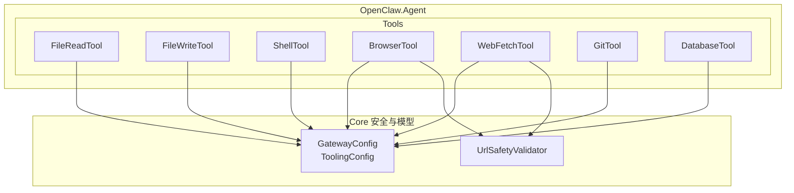
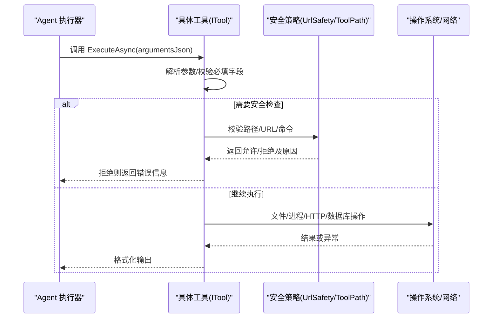
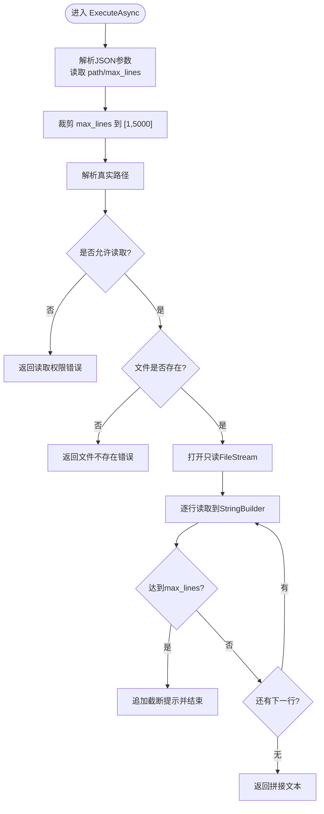
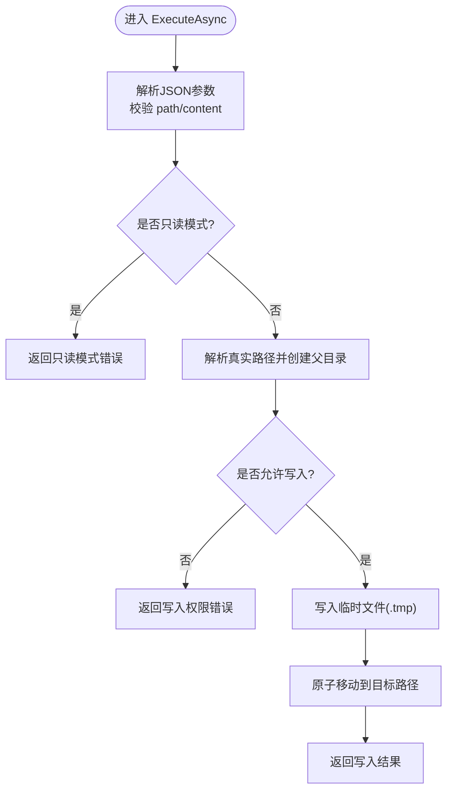
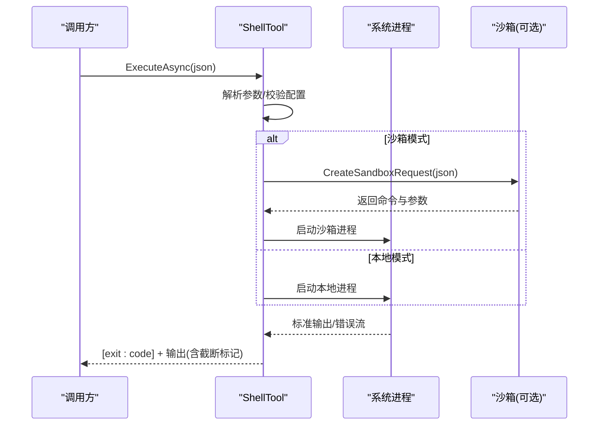
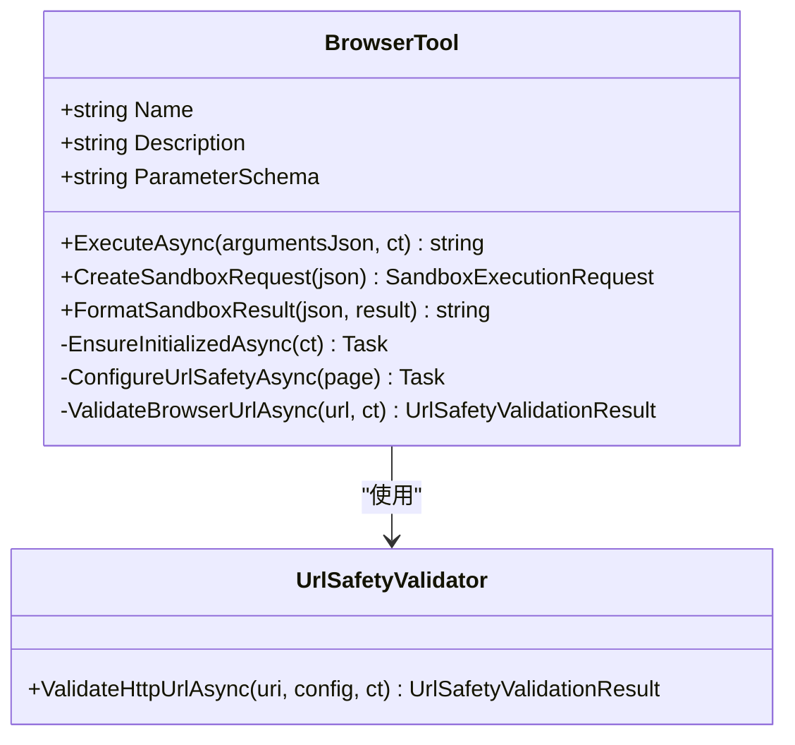
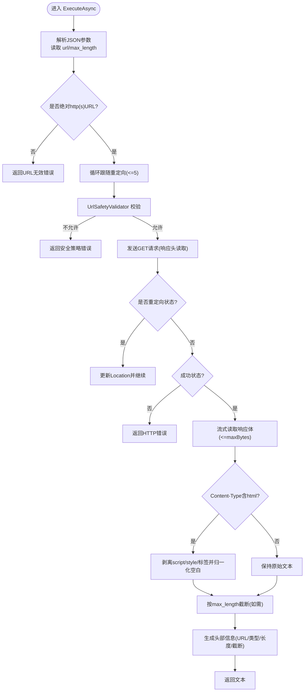
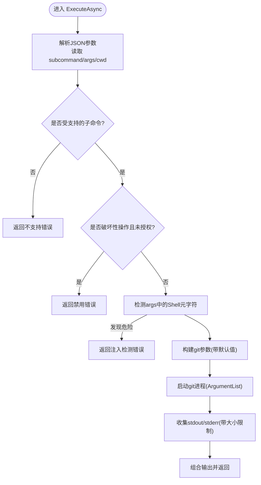
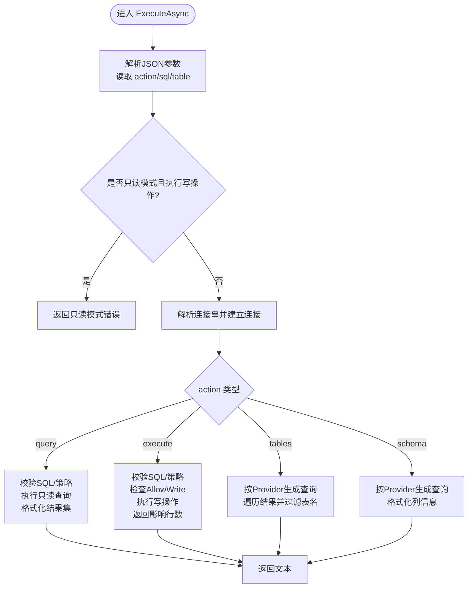
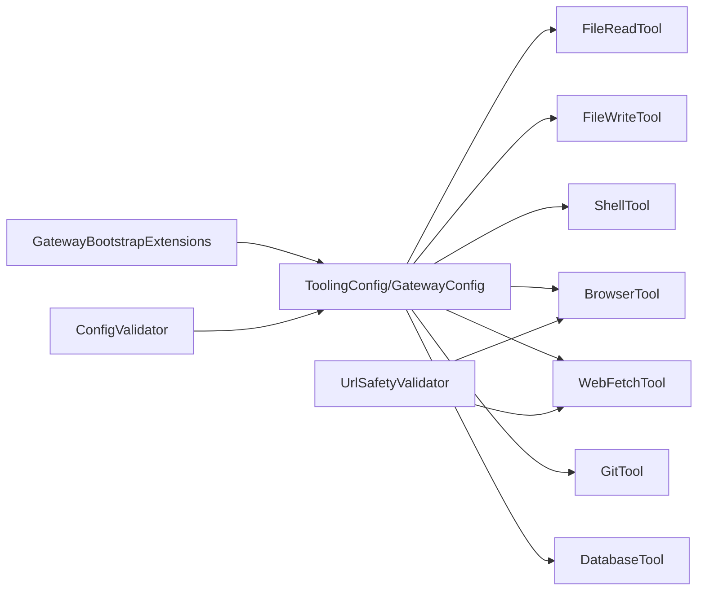

# 本地工具实现

<cite>
**本文档引用的文件**
- [FileReadTool.cs](file://src/OpenClaw.Agent/Tools/FileReadTool.cs)
- [FileWriteTool.cs](file://src/OpenClaw.Agent/Tools/FileWriteTool.cs)
- [ShellTool.cs](file://src/OpenClaw.Agent/Tools/ShellTool.cs)
- [BrowserTool.cs](file://src/OpenClaw.Agent/Tools/BrowserTool.cs)
- [WebFetchTool.cs](file://src/OpenClaw.Agent/Tools/WebFetchTool.cs)
- [GitTool.cs](file://src/OpenClaw.Agent/Tools/GitTool.cs)
- [DatabaseTool.cs](file://src/OpenClaw.Agent/Tools/DatabaseTool.cs)
- [UrlSafetyValidator.cs](file://src/OpenClaw.Core/Security/UrlSafetyValidator.cs)
- [GatewayConfig.cs](file://src/OpenClaw.Core/Models/GatewayConfig.cs)
- [AdminSettingsService.cs](file://src/OpenClaw.Gateway/AdminSettingsService.cs)
- [GatewayBootstrapExtensions.cs](file://src/OpenClaw.Gateway/Bootstrap/GatewayBootstrapExtensions.cs)
- [ConfigValidator.cs](file://src/OpenClaw.Core/Validation/ConfigValidator.cs)
- [UrlSafetyValidatorTests.cs](file://src/OpenClaw.Tests/UrlSafetyValidatorTests.cs)
- [NativePluginTests.cs](file://src/OpenClaw.Tests/NativePluginTests.cs)
</cite>

## 目录
1. [简介](#简介)
2. [项目结构](#项目结构)
3. [核心组件](#核心组件)
4. [架构总览](#架构总览)
5. [详细组件分析](#详细组件分析)
6. [依赖关系分析](#依赖关系分析)
7. [性能考虑](#性能考虑)
8. [故障排除指南](#故障排除指南)
9. [结论](#结论)
10. [附录](#附录)

## 简介
本文件面向本地工具实现，系统性梳理并文档化以下工具的实现细节与使用方法：
- 文件操作：FileReadTool、FileWriteTool
- 命令执行：ShellTool
- 浏览器自动化：BrowserTool（Playwright 集成）
- HTTP 请求：WebFetchTool（内容提取与安全策略）
- 版本控制：GitTool（子命令白名单与安全限制）
- 数据库访问：DatabaseTool（多厂商连接与策略校验）

文档重点覆盖：
- API 设计与参数校验
- 错误处理与安全策略
- 输出处理与性能优化
- 配置项与运行时行为
- 故障排除与最佳实践

## 项目结构
本地工具位于 OpenClaw.Agent 工程的 Tools 命名空间下，围绕 ITool 接口统一对外暴露“名称、描述、参数模式、异步执行”等能力；部分工具实现 ISandboxCapableTool 以支持沙箱执行。

图示来源
- [FileReadTool.cs:1-66](file://src/OpenClaw.Agent/Tools/FileReadTool.cs#L1-L66)
- [FileWriteTool.cs:1-58](file://src/OpenClaw.Agent/Tools/FileWriteTool.cs#L1-L58)
- [ShellTool.cs:1-193](file://src/OpenClaw.Agent/Tools/ShellTool.cs#L1-L193)
- [BrowserTool.cs:1-696](file://src/OpenClaw.Agent/Tools/BrowserTool.cs#L1-L696)
- [WebFetchTool.cs:1-212](file://src/OpenClaw.Agent/Tools/WebFetchTool.cs#L1-L212)
- [GitTool.cs:1-234](file://src/OpenClaw.Agent/Tools/GitTool.cs#L1-L234)
- [DatabaseTool.cs:1-944](file://src/OpenClaw.Agent/Tools/DatabaseTool.cs#L1-L944)
- [UrlSafetyValidator.cs:1-43](file://src/OpenClaw.Core/Security/UrlSafetyValidator.cs#L1-L43)
- [GatewayConfig.cs:412-434](file://src/OpenClaw.Core/Models/GatewayConfig.cs#L412-L434)

章节来源
- [FileReadTool.cs:1-66](file://src/OpenClaw.Agent/Tools/FileReadTool.cs#L1-L66)
- [FileWriteTool.cs:1-58](file://src/OpenClaw.Agent/Tools/FileWriteTool.cs#L1-L58)
- [ShellTool.cs:1-193](file://src/OpenClaw.Agent/Tools/ShellTool.cs#L1-L193)
- [BrowserTool.cs:1-696](file://src/OpenClaw.Agent/Tools/BrowserTool.cs#L1-L696)
- [WebFetchTool.cs:1-212](file://src/OpenClaw.Agent/Tools/WebFetchTool.cs#L1-L212)
- [GitTool.cs:1-234](file://src/OpenClaw.Agent/Tools/GitTool.cs#L1-L234)
- [DatabaseTool.cs:1-944](file://src/OpenClaw.Agent/Tools/DatabaseTool.cs#L1-L944)

## 核心组件
- ITool 接口：统一的工具执行契约，包含 Name、Description、ParameterSchema、ExecuteAsync。
- ISandboxCapableTool：可选接口，用于声明沙箱执行能力，包括 CreateSandboxRequest 和 FormatSandboxResult。
- UrlSafetyValidator：统一的 URL 安全校验器，支持主机通配、私网地址阻断、CIDR 白黑名单等策略。
- ToolingConfig/GatewayConfig：集中式配置入口，控制工具的可用性、路径白名单、超时、只读模式等。

章节来源
- [BrowserTool.cs:17-300](file://src/OpenClaw.Agent/Tools/BrowserTool.cs#L17-L300)
- [WebFetchTool.cs:18-46](file://src/OpenClaw.Agent/Tools/WebFetchTool.cs#L18-L46)
- [ShellTool.cs:11-21](file://src/OpenClaw.Agent/Tools/ShellTool.cs#L11-L21)
- [UrlSafetyValidator.cs:17-43](file://src/OpenClaw.Core/Security/UrlSafetyValidator.cs#L17-L43)
- [GatewayConfig.cs:412-434](file://src/OpenClaw.Core/Models/GatewayConfig.cs#L412-L434)

## 架构总览
本地工具通过统一的执行桥接在 Agent 运行时被调用，安全策略贯穿于路径访问、URL 导航与命令执行等关键环节。

图示来源
- [FileReadTool.cs:19-64](file://src/OpenClaw.Agent/Tools/FileReadTool.cs#L19-L64)
- [FileWriteTool.cs:19-56](file://src/OpenClaw.Agent/Tools/FileWriteTool.cs#L19-L56)
- [ShellTool.cs:24-85](file://src/OpenClaw.Agent/Tools/ShellTool.cs#L24-L85)
- [BrowserTool.cs:340-448](file://src/OpenClaw.Agent/Tools/BrowserTool.cs#L340-L448)
- [WebFetchTool.cs:48-159](file://src/OpenClaw.Agent/Tools/WebFetchTool.cs#L48-L159)
- [GitTool.cs:60-105](file://src/OpenClaw.Agent/Tools/GitTool.cs#L60-L105)
- [DatabaseTool.cs:70-101](file://src/OpenClaw.Agent/Tools/DatabaseTool.cs#L70-L101)

## 详细组件分析

### 文件读取工具 FileReadTool
- 功能概述
  - 从本地文件系统读取内容，支持最大行数限制，防止上下文溢出。
  - 使用只读流与顺序扫描优化大文件读取。
- 参数与校验
  - 必填：path；可选：max_lines（默认200，裁剪到[1, 5000]）。
  - 通过 ToolPathPolicy 解析真实路径并进行读取权限校验。
- 错误处理
  - 只读模式禁用写入工具；路径不存在或无读取权限返回明确错误。
- 性能特性
  - 异步 FileStream + StringBuilder，逐行读取并在达到上限时提示截断。

图示来源
- [FileReadTool.cs:19-64](file://src/OpenClaw.Agent/Tools/FileReadTool.cs#L19-L64)

章节来源
- [FileReadTool.cs:9-17](file://src/OpenClaw.Agent/Tools/FileReadTool.cs#L9-L17)
- [FileReadTool.cs:19-64](file://src/OpenClaw.Agent/Tools/FileReadTool.cs#L19-L64)

### 文件写入工具 FileWriteTool
- 功能概述
  - 将内容写入文件，自动创建父目录；采用临时文件+原子移动避免部分写入。
- 参数与校验
  - 必填：path、content；路径为空或仅空白字符时拒绝。
  - 通过 ToolPathPolicy 校验写入权限。
- 错误处理
  - 只读模式直接拒绝；写入失败尝试清理临时文件后抛出异常。
- 安全策略
  - 先写.tmp 再 Move，降低并发写入风险。

图示来源
- [FileWriteTool.cs:19-56](file://src/OpenClaw.Agent/Tools/FileWriteTool.cs#L19-L56)

章节来源
- [FileWriteTool.cs:9-17](file://src/OpenClaw.Agent/Tools/FileWriteTool.cs#L9-L17)
- [FileWriteTool.cs:19-56](file://src/OpenClaw.Agent/Tools/FileWriteTool.cs#L19-L56)

### Shell 工具 ShellTool
- 功能概述
  - 在本地执行 shell 命令，支持跨平台（Windows/cmd.exe 或 Unix/sh）。
- 参数与校验
  - 必填：command；可选：timeout_seconds（默认30，裁剪到[1,600]）。
  - 受 ToolingConfig.ReadOnlyMode 与 AllowShell 控制。
- 安全与沙箱
  - 本地执行：通过 ProcessStartInfo 直接启动 shell，重定向标准输出/错误。
  - 沙箱执行：CreateSandboxRequest 使用 timeout 包装与 node runner，FormatSandboxResult 处理超时与合并输出。
- 输出处理
  - 限制最大输出字节数（64KB），超过则标记截断；合并 stdout/stderr 并附加退出码。

图示来源
- [ShellTool.cs:24-85](file://src/OpenClaw.Agent/Tools/ShellTool.cs#L24-L85)
- [ShellTool.cs:87-113](file://src/OpenClaw.Agent/Tools/ShellTool.cs#L87-L113)
- [ShellTool.cs:115-157](file://src/OpenClaw.Agent/Tools/ShellTool.cs#L115-L157)
- [ShellTool.cs:159-191](file://src/OpenClaw.Agent/Tools/ShellTool.cs#L159-L191)

章节来源
- [ShellTool.cs:11-21](file://src/OpenClaw.Agent/Tools/ShellTool.cs#L11-L21)
- [ShellTool.cs:24-85](file://src/OpenClaw.Agent/Tools/ShellTool.cs#L24-L85)
- [ShellTool.cs:87-113](file://src/OpenClaw.Agent/Tools/ShellTool.cs#L87-L113)

### 浏览器工具 BrowserTool
- 功能概述
  - 基于 Playwright 的交互式无头浏览器，支持导航、点击、填写、文本提取、脚本求值、截图。
- Playwright 集成
  - 首次使用时自动安装 Chromium；按配置启动浏览器与页面；延迟初始化锁保证线程安全。
- URL 安全策略
  - 本地路由：通过 ConfigureUrlSafetyAsync 对所有资源请求进行安全校验。
  - 沙箱路由：内置 Node 脚本对 goto/click/fill/get_text/evaluate/screenshot 等动作进行安全校验与执行。
- 参数与动作
  - 必填：action（枚举）；根据动作选择性要求 url、selector、value、script。
  - evaluate 动作受 AllowBrowserEvaluate 配置控制。
- 错误处理
  - 取消令牌传播；异常转为用户可读错误消息；页面关闭的最佳努力处理。

图示来源
- [BrowserTool.cs:17-300](file://src/OpenClaw.Agent/Tools/BrowserTool.cs#L17-L300)
- [BrowserTool.cs:302-338](file://src/OpenClaw.Agent/Tools/BrowserTool.cs#L302-L338)
- [BrowserTool.cs:340-448](file://src/OpenClaw.Agent/Tools/BrowserTool.cs#L340-L448)
- [BrowserTool.cs:491-526](file://src/OpenClaw.Agent/Tools/BrowserTool.cs#L491-L526)
- [BrowserTool.cs:580-603](file://src/OpenClaw.Agent/Tools/BrowserTool.cs#L580-L603)
- [BrowserTool.cs:605-694](file://src/OpenClaw.Agent/Tools/BrowserTool.cs#L605-L694)
- [UrlSafetyValidator.cs:17-43](file://src/OpenClaw.Core/Security/UrlSafetyValidator.cs#L17-L43)

章节来源
- [BrowserTool.cs:17-300](file://src/OpenClaw.Agent/Tools/BrowserTool.cs#L17-L300)
- [BrowserTool.cs:302-338](file://src/OpenClaw.Agent/Tools/BrowserTool.cs#L302-L338)
- [BrowserTool.cs:340-448](file://src/OpenClaw.Agent/Tools/BrowserTool.cs#L340-L448)
- [BrowserTool.cs:491-526](file://src/OpenClaw.Agent/Tools/BrowserTool.cs#L491-L526)
- [BrowserTool.cs:580-603](file://src/OpenClaw.Agent/Tools/BrowserTool.cs#L580-L603)
- [BrowserTool.cs:605-694](file://src/OpenClaw.Agent/Tools/BrowserTool.cs#L605-L694)

### Web 获取工具 WebFetchTool
- 功能概述
  - 发起 HTTP/HTTPS 请求，支持最多 5 次重定向；限制最大长度；HTML 自动剥离标签并提取可读文本。
- 参数与校验
  - 必填：url；可选：max_length（默认使用配置中的 MaxSizeKb）。
  - 仅允许 http/https；超出重定向次数或非 http(s) 目标返回错误。
- 安全策略
  - 使用 UrlSafetyValidator 校验每个重定向目标；支持阻断私网/回环/元数据主机与 CIDR 黑名单。
- 输出处理
  - 读取流式响应，按最大字节限制累积；HTML 时进行轻量级文本提取；最终输出包含 URL、Content-Type、长度与截断标记。

图示来源
- [WebFetchTool.cs:48-159](file://src/OpenClaw.Agent/Tools/WebFetchTool.cs#L48-L159)
- [WebFetchTool.cs:165-189](file://src/OpenClaw.Agent/Tools/WebFetchTool.cs#L165-L189)

章节来源
- [WebFetchTool.cs:18-46](file://src/OpenClaw.Agent/Tools/WebFetchTool.cs#L18-L46)
- [WebFetchTool.cs:48-159](file://src/OpenClaw.Agent/Tools/WebFetchTool.cs#L48-L159)
- [WebFetchTool.cs:165-189](file://src/OpenClaw.Agent/Tools/WebFetchTool.cs#L165-L189)

### Git 工具 GitTool
- 功能概述
  - 支持常见子命令（status/diff/log/add/commit/branch/checkout/stash/show 等），以及 push/pull/reset 等破坏性操作。
- 安全策略
  - 默认禁止破坏性操作（AllowPush=false），reset --hard 亦受此限制。
  - 对 args 进行 Shell 元字符注入检测；通过自定义分词器避免 shell 中介，降低注入风险。
  - 为 log/diff 提供合理默认参数，避免过长输出。
- 输出处理
  - 限制 stdout 最大字节数，stderr 作为附加输出；必要时追加截断提示。

图示来源
- [GitTool.cs:60-105](file://src/OpenClaw.Agent/Tools/GitTool.cs#L60-L105)
- [GitTool.cs:107-156](file://src/OpenClaw.Agent/Tools/GitTool.cs#L107-L156)
- [GitTool.cs:162-203](file://src/OpenClaw.Agent/Tools/GitTool.cs#L162-L203)
- [GitTool.cs:205-232](file://src/OpenClaw.Agent/Tools/GitTool.cs#L205-L232)

章节来源
- [GitTool.cs:16-47](file://src/OpenClaw.Agent/Tools/GitTool.cs#L16-L47)
- [GitTool.cs:60-105](file://src/OpenClaw.Agent/Tools/GitTool.cs#L60-L105)
- [GitTool.cs:107-156](file://src/OpenClaw.Agent/Tools/GitTool.cs#L107-L156)

### 数据库工具 DatabaseTool
- 功能概述
  - 支持 SQLite、PostgreSQL、MySQL（通过 DbProviderFactory），提供 query/execute/tables/schema 四类操作。
- 安全策略
  - AllowWrite=false 时禁止写操作；query 严格限制为只读。
  - 表白/黑名单与多语句开关；基于关键字与 SQL 解析的写操作识别。
  - 不同数据库的敏感标识符处理（SQLite/MySQL 转义，PostgreSQL parameterized）。
- 输出格式
  - 结果集表格化输出，列宽自适应，行数限制，末尾显示统计与截断提示。

图示来源
- [DatabaseTool.cs:70-101](file://src/OpenClaw.Agent/Tools/DatabaseTool.cs#L70-L101)
- [DatabaseTool.cs:103-124](file://src/OpenClaw.Agent/Tools/DatabaseTool.cs#L103-L124)
- [DatabaseTool.cs:126-146](file://src/OpenClaw.Agent/Tools/DatabaseTool.cs#L126-L146)
- [DatabaseTool.cs:148-182](file://src/OpenClaw.Agent/Tools/DatabaseTool.cs#L148-L182)
- [DatabaseTool.cs:184-236](file://src/OpenClaw.Agent/Tools/DatabaseTool.cs#L184-L236)

章节来源
- [DatabaseTool.cs:18-61](file://src/OpenClaw.Agent/Tools/DatabaseTool.cs#L18-L61)
- [DatabaseTool.cs:70-101](file://src/OpenClaw.Agent/Tools/DatabaseTool.cs#L70-L101)
- [DatabaseTool.cs:103-124](file://src/OpenClaw.Agent/Tools/DatabaseTool.cs#L103-L124)
- [DatabaseTool.cs:126-146](file://src/OpenClaw.Agent/Tools/DatabaseTool.cs#L126-L146)
- [DatabaseTool.cs:148-182](file://src/OpenClaw.Agent/Tools/DatabaseTool.cs#L148-L182)
- [DatabaseTool.cs:184-236](file://src/OpenClaw.Agent/Tools/DatabaseTool.cs#L184-L236)

## 依赖关系分析
- 工具到安全策略
  - BrowserTool 与 WebFetchTool 均依赖 UrlSafetyValidator 进行 URL 安全校验。
- 工具到配置
  - 所有工具均读取 ToolingConfig/GatewayConfig 中的策略与开关（如只读模式、路径根、超时、浏览器配置等）。
- 配置加载与校验
  - GatewayBootstrapExtensions 支持从配置中覆盖 Tooling 的 AllowedReadRoots/AllowedWriteRoots。
  - ConfigValidator 对 WorkspaceOnly、Sandbox 配置进行一致性校验。

图示来源
- [GatewayConfig.cs:412-434](file://src/OpenClaw.Core/Models/GatewayConfig.cs#L412-L434)
- [GatewayBootstrapExtensions.cs:352-375](file://src/OpenClaw.Gateway/Bootstrap/GatewayBootstrapExtensions.cs#L352-L375)
- [ConfigValidator.cs:135-162](file://src/OpenClaw.Core/Validation/ConfigValidator.cs#L135-L162)
- [UrlSafetyValidator.cs:17-43](file://src/OpenClaw.Core/Security/UrlSafetyValidator.cs#L17-L43)

章节来源
- [GatewayConfig.cs:412-434](file://src/OpenClaw.Core/Models/GatewayConfig.cs#L412-L434)
- [GatewayBootstrapExtensions.cs:352-375](file://src/OpenClaw.Gateway/Bootstrap/GatewayBootstrapExtensions.cs#L352-L375)
- [ConfigValidator.cs:135-162](file://src/OpenClaw.Core/Validation/ConfigValidator.cs#L135-L162)
- [UrlSafetyValidator.cs:17-43](file://src/OpenClaw.Core/Security/UrlSafetyValidator.cs#L17-L43)

## 性能考虑
- 文件读取
  - FileReadTool 使用顺序扫描与 StringBuilder，适合大文件的渐进式读取；max_lines 限制避免上下文膨胀。
- 文件写入
  - FileWriteTool 采用 .tmp + Move 的原子写法，减少部分写入风险；建议在高并发场景配合外部锁或序列化写入。
- Shell 执行
  - 限制最大输出字节（64KB）；超时取消；避免 shell 中介，降低注入风险。
- 浏览器
  - Playwright 首次安装与延迟初始化；页面复用与取消令牌传播；沙箱模式下通过 Node 脚本隔离。
- HTTP 抓取
  - 流式读取与内存池缓冲（ArrayPool）；HTML 文本提取为纯文本，避免大体积渲染。
- Git
  - 自定义分词器避免 shell 注入；限制 stdout 字节数与截断提示。
- 数据库
  - 结果集表格化输出，列宽动态计算；MaxRows 限制；不同数据库采用参数化或转义策略。

[本节为通用指导，无需特定文件分析]

## 故障排除指南
- URL 安全策略
  - WebFetchTool 与 BrowserTool 均会阻止回环、私网与元数据主机；可通过 UrlSafetyConfig 调整策略。
  - 单元测试验证了对 localhost、127.0.0.1 等的阻断行为。
- 配置校验
  - ConfigValidator 对 WorkspaceOnly、Sandbox 默认 TTL 等进行校验，确保运行时安全。
- 工具开关
  - AdminSettingsService 显示 Tooling 的 AllowShell、ReadOnlyMode、AllowBrowserEvaluate 等开关，可在运行时调整。
- 常见问题定位
  - ShellTool：检查 ReadOnlyMode 与 AllowShell；确认 timeout_seconds 是否过短。
  - BrowserTool：确认本地 Playwright 安装与浏览器启动；沙箱模式下检查 Node runner 与超时包装。
  - WebFetchTool：确认 URL 为 http/https；检查重定向链与 Content-Type。
  - GitTool：确认 args 中无危险元字符；破坏性操作需开启 AllowPush。
  - DatabaseTool：确认 Provider 对应的 DbProviderFactory 已注册；AllowWrite 与表白/黑名单设置。

章节来源
- [UrlSafetyValidatorTests.cs:58-77](file://src/OpenClaw.Tests/UrlSafetyValidatorTests.cs#L58-L77)
- [ConfigValidator.cs:135-162](file://src/OpenClaw.Core/Validation/ConfigValidator.cs#L135-L162)
- [AdminSettingsService.cs:149-166](file://src/OpenClaw.Gateway/AdminSettingsService.cs#L149-L166)
- [NativePluginTests.cs:396-413](file://src/OpenClaw.Tests/NativePluginTests.cs#L396-L413)

## 结论
本地工具通过统一的 ITool 接口与 ISandboxCapableTool 沙箱能力，结合集中式配置与统一的安全策略（路径、URL、命令、数据库），在保障安全性的同时提供了强大的本地自动化能力。各工具在参数校验、错误处理、输出控制与性能优化方面均有明确的设计取舍，适合在受控环境中安全地执行文件、命令、浏览器、HTTP、版本控制与数据库操作。

[本节为总结，无需特定文件分析]

## 附录

### 配置选项速查
- ToolingConfig（关键安全与执行开关）
  - AutonomyMode、WorkspaceRoot、WorkspaceOnly、AllowedShellCommandGlobs、ForbiddenPathGlobs、AllowShell、ReadOnlyMode、AllowedReadRoots、AllowedWriteRoots、Per-tool execution timeout
- UrlSafetyConfig（URL 安全策略）
  - Enabled、BlockPrivateNetworkTargets、BlockedHostGlobs、BlockedCidrs
- BrowserTool 相关
  - BrowserHeadless、BrowserTimeoutSeconds、AllowBrowserEvaluate
- WebFetchTool 相关
  - UserAgent、MaxSizeKb、TimeoutSeconds
- GitTool 相关
  - AllowPush、MaxDiffBytes
- DatabaseTool 相关
  - Provider、ConnectionString、AllowWrite、AllowMultiStatement、AllowedTables、DeniedTables、MaxRows、TimeoutSeconds

章节来源
- [GatewayConfig.cs:412-434](file://src/OpenClaw.Core/Models/GatewayConfig.cs#L412-L434)
- [GatewayConfig.cs:371-378](file://src/OpenClaw.Core/Models/GatewayConfig.cs#L371-L378)
- [BrowserTool.cs:270-282](file://src/OpenClaw.Agent/Tools/BrowserTool.cs#L270-L282)
- [WebFetchTool.cs:20-31](file://src/OpenClaw.Agent/Tools/WebFetchTool.cs#L20-L31)
- [GitTool.cs:18-20](file://src/OpenClaw.Agent/Tools/GitTool.cs#L18-L20)
- [DatabaseTool.cs:20-29](file://src/OpenClaw.Agent/Tools/DatabaseTool.cs#L20-L29)