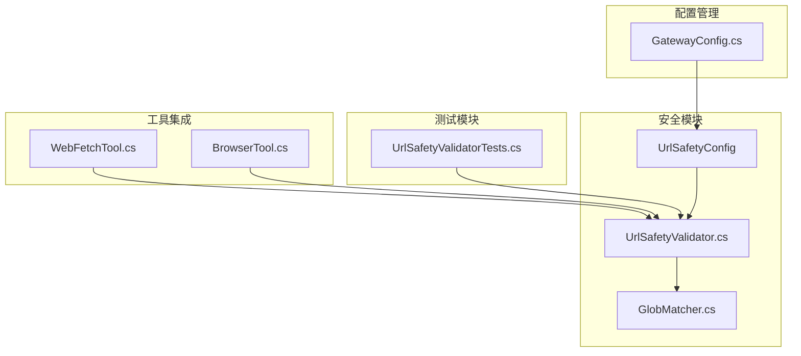
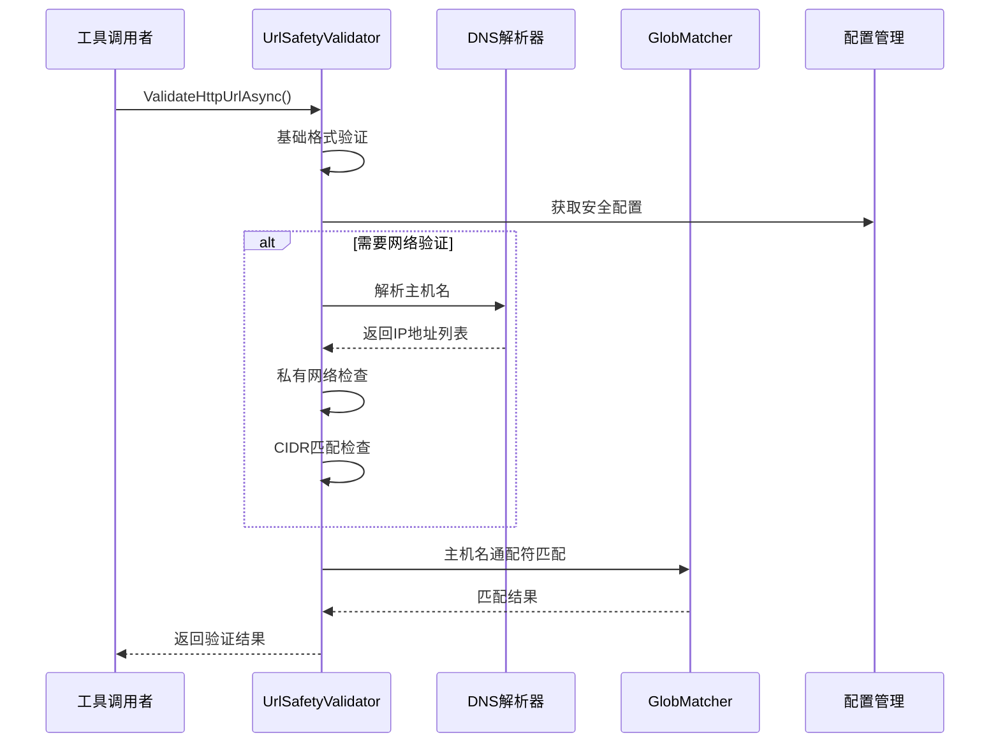
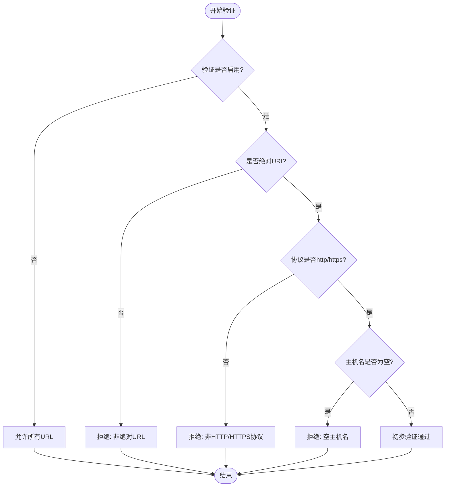
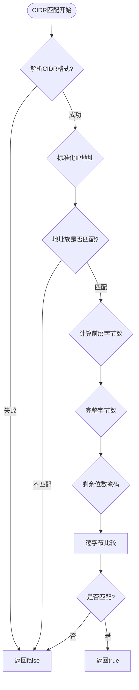
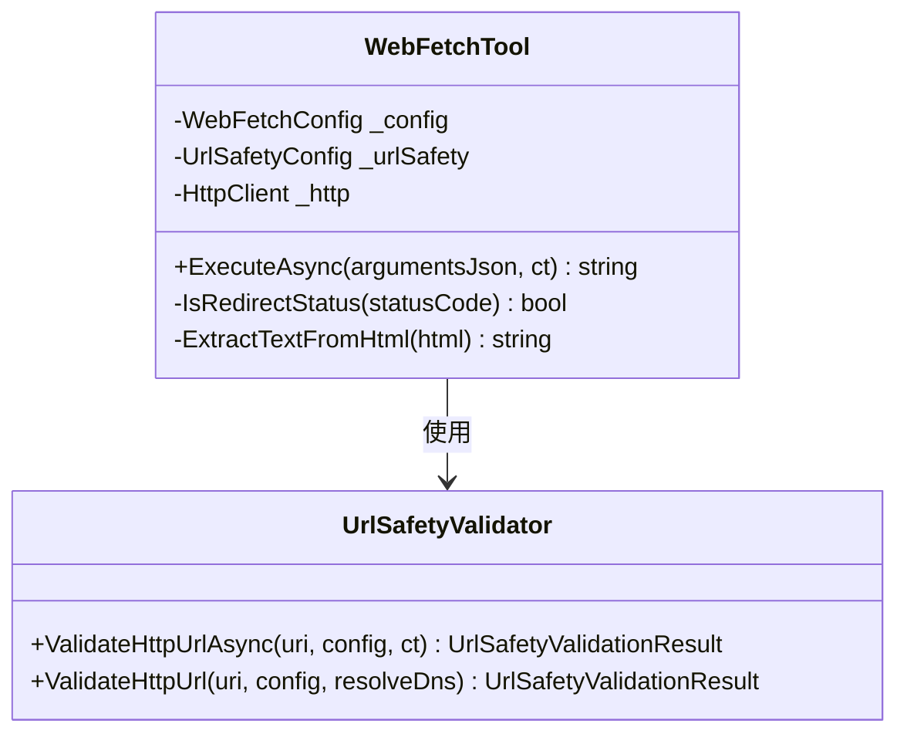
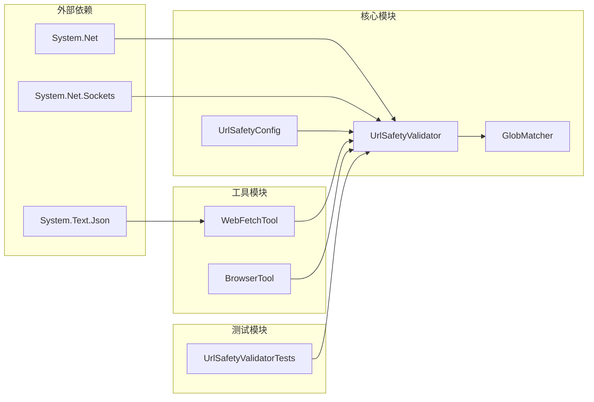

# URL安全验证

<cite>
**本文档引用的文件**
- [UrlSafetyValidator.cs](file://src/OpenClaw.Core/Security/UrlSafetyValidator.cs)
- [UrlSafetyValidatorTests.cs](file://src/OpenClaw.Tests/UrlSafetyValidatorTests.cs)
- [GatewayConfig.cs](file://src/OpenClaw.Core/Models/GatewayConfig.cs)
- [WebFetchTool.cs](file://src/OpenClaw.Agent/Tools/WebFetchTool.cs)
- [BrowserTool.cs](file://src/OpenClaw.Agent/Tools/BrowserTool.cs)
- [GlobMatcher.cs](file://src/OpenClaw.Core/Security/GlobMatcher.cs)
</cite>

## 目录
1. [简介](#简介)
2. [项目结构](#项目结构)
3. [核心组件](#核心组件)
4. [架构概览](#架构概览)
5. [详细组件分析](#详细组件分析)
6. [依赖关系分析](#依赖关系分析)
7. [性能考虑](#性能考虑)
8. [故障排除指南](#故障排除指南)
9. [结论](#结论)

## 简介

URL安全验证系统是OpenClaw平台中的关键安全组件，负责保护系统免受恶意URL访问、重定向攻击和钓鱼网站的危害。该系统通过多层验证机制确保只有安全的URL能够被系统工具访问，包括格式检查、协议验证、主机名白名单、端口限制以及私有网络地址阻断等。

系统的核心是UrlSafetyValidator类，它提供了同步和异步两种验证模式，支持IPv4和IPv6地址的全面验证，并集成了灵活的主机名匹配和CIDR块列表功能。

## 项目结构

URL安全验证功能在项目中的组织结构如下：

**图表来源**
- [UrlSafetyValidator.cs:1-219](file://src/OpenClaw.Core/Security/UrlSafetyValidator.cs#L1-L219)
- [WebFetchTool.cs:1-212](file://src/OpenClaw.Agent/Tools/WebFetchTool.cs#L1-L212)
- [BrowserTool.cs:116-204](file://src/OpenClaw.Agent/Tools/BrowserTool.cs#L116-L204)

**章节来源**
- [UrlSafetyValidator.cs:1-219](file://src/OpenClaw.Core/Security/UrlSafetyValidator.cs#L1-L219)
- [GatewayConfig.cs:371-384](file://src/OpenClaw.Core/Models/GatewayConfig.cs#L371-L384)

## 核心组件

### UrlSafetyValidator 类

UrlSafetyValidator是URL安全验证的核心类，提供了以下主要功能：

- **双重验证模式**：支持同步和异步两种验证方式
- **多层安全检查**：从基础格式验证到深度网络地址验证
- **灵活的配置支持**：通过UrlSafetyConfig进行细粒度控制
- **完整的错误处理**：提供详细的错误信息和诊断

### UrlSafetyValidationResult 结果类型

系统使用强类型的验证结果，包含：
- `Allowed`：布尔值表示验证是否通过
- `Reason`：字符串描述拒绝原因
- `ToToolError()`：工具友好的错误消息格式化

### UrlSafetyConfig 配置模型

UrlSafetyConfig提供了全面的安全策略配置：

| 属性 | 类型 | 默认值 | 描述 |
|------|------|--------|------|
| Enabled | bool | true | 启用URL验证功能 |
| BlockPrivateNetworkTargets | bool | true | 阻断私有网络目标 |
| BlockedHostGlobs | string[] | [] | 被阻止的主机名通配符 |
| BlockedCidrs | string[] | [] | 被阻止的CIDR网络段 |

**章节来源**
- [UrlSafetyValidator.cs:7-15](file://src/OpenClaw.Core/Security/UrlSafetyValidator.cs#L7-L15)
- [UrlSafetyValidator.cs:371-384](file://src/OpenClaw.Core/Models/GatewayConfig.cs#L371-L384)

## 架构概览

URL安全验证系统的整体架构采用分层设计，确保了安全性和可维护性：

**图表来源**
- [UrlSafetyValidator.cs:27-58](file://src/OpenClaw.Core/Security/UrlSafetyValidator.cs#L27-L58)
- [UrlSafetyValidator.cs:60-111](file://src/OpenClaw.Core/Security/UrlSafetyValidator.cs#L60-L111)

## 详细组件分析

### URL格式验证流程

系统实现了严格的URL格式验证，确保只接受绝对的HTTP/HTTPS URL：

**图表来源**
- [UrlSafetyValidator.cs:64-75](file://src/OpenClaw.Core/Security/UrlSafetyValidator.cs#L64-L75)

### 私有网络地址阻断机制

系统对私有网络地址进行了全面阻断，防止内部网络扫描和SSRF攻击：

| 地址类别 | IPv4范围 | IPv6范围 | 阻断原因 |
|----------|----------|----------|----------|
| 回环地址 | 127.0.0.0/8 | ::1 | 本地回环访问 |
| 私有网络 | 10.0.0.0/8 172.16.0.0/12 192.168.0.0/16 | 链路本地 站点本地 组播 | 内部网络访问 |
| 公共网关 | 169.254.0.0/16 |  | 链路本地元数据服务 |
| 多播地址 | 224.0.0.0/4 |  | 广播通信 |
| 未指定地址 | 0.0.0.0 | :: | 未指定地址 |

**章节来源**
- [UrlSafetyValidator.cs:140-173](file://src/OpenClaw.Core/Security/UrlSafetyValidator.cs#L140-L173)

### CIDR网络段匹配算法

系统实现了高效的CIDR网络段匹配算法，支持IPv4和IPv6：

**图表来源**
- [UrlSafetyValidator.cs:175-217](file://src/OpenClaw.Core/Security/UrlSafetyValidator.cs#L175-L217)

### 工具集成点

#### WebFetchTool集成

WebFetchTool作为网页抓取工具，集成了完整的URL安全验证：

**图表来源**
- [WebFetchTool.cs:18-31](file://src/OpenClaw.Agent/Tools/WebFetchTool.cs#L18-L31)
- [UrlSafetyValidator.cs:27-58](file://src/OpenClaw.Core/Security/UrlSafetyValidator.cs#L27-L58)

#### BrowserTool集成

BrowserTool在浏览器沙箱中实施相同的URL安全策略：

**章节来源**
- [WebFetchTool.cs:48-159](file://src/OpenClaw.Agent/Tools/WebFetchTool.cs#L48-L159)
- [BrowserTool.cs:144-180](file://src/OpenClaw.Agent/Tools/BrowserTool.cs#L144-L180)

## 依赖关系分析

URL安全验证系统的主要依赖关系如下：

**图表来源**
- [UrlSafetyValidator.cs:1-3](file://src/OpenClaw.Core/Security/UrlSafetyValidator.cs#L1-L3)
- [WebFetchTool.cs:1-11](file://src/OpenClaw.Agent/Tools/WebFetchTool.cs#L1-L11)

**章节来源**
- [GlobMatcher.cs:1-89](file://src/OpenClaw.Core/Security/GlobMatcher.cs#L1-L89)

## 性能考虑

### DNS解析优化

系统采用了智能的DNS解析策略，平衡了安全性与性能：

- **异步解析**：默认使用异步DNS解析避免阻塞
- **预检查机制**：先进行基础验证再进行DNS解析
- **缓存友好**：利用系统DNS缓存减少重复查询

### 内存管理

- **流式处理**：网页内容采用流式读取，避免大内存占用
- **缓冲池**：使用ArrayPool进行内存池化管理
- **及时释放**：所有资源实现及时释放和清理

### 算法复杂度

- **URL格式验证**：O(1)时间复杂度
- **主机名匹配**：O(n*m)最坏情况，其中n为模式长度，m为值长度
- **CIDR匹配**：O(k)时间复杂度，k为IP地址字节数

## 故障排除指南

### 常见问题及解决方案

| 问题类型 | 症状 | 可能原因 | 解决方案 |
|----------|------|----------|----------|
| URL被意外阻断 | "URL blocked by safety policy" | 私有网络地址或主机名匹配 | 检查UrlSafetyConfig配置 |
| DNS解析失败 | "DNS resolution failed" | 网络连接或DNS服务器问题 | 验证网络连通性和DNS配置 |
| 超时错误 | "Request timed out" | 服务器响应慢或网络延迟 | 调整超时设置或检查服务器状态 |
| 重定向循环 | "Too many redirects" | 服务器配置错误 | 检查服务器重定向规则 |

### 调试技巧

1. **启用详细日志**：查看具体的拒绝原因和错误信息
2. **测试配置**：使用单元测试验证配置正确性
3. **网络诊断**：使用nslookup或dig验证DNS解析
4. **权限检查**：确认工具具有必要的网络访问权限

**章节来源**
- [UrlSafetyValidatorTests.cs:12-77](file://src/OpenClaw.Tests/UrlSafetyValidatorTests.cs#L12-L77)

## 结论

URL安全验证系统通过多层次的安全检查和灵活的配置选项，为OpenClaw平台提供了强大的URL安全保护。系统的设计充分考虑了性能、可维护性和安全性，在保证严格安全策略的同时，也提供了良好的用户体验。

关键优势包括：
- **全面的安全覆盖**：从基础格式验证到深度网络检查
- **灵活的配置管理**：支持细粒度的安全策略定制
- **优秀的性能表现**：优化的算法和资源管理
- **完善的错误处理**：清晰的错误信息和诊断能力

该系统为构建安全可靠的自动化工具环境奠定了坚实的基础，有效防范了各种常见的URL相关安全威胁。