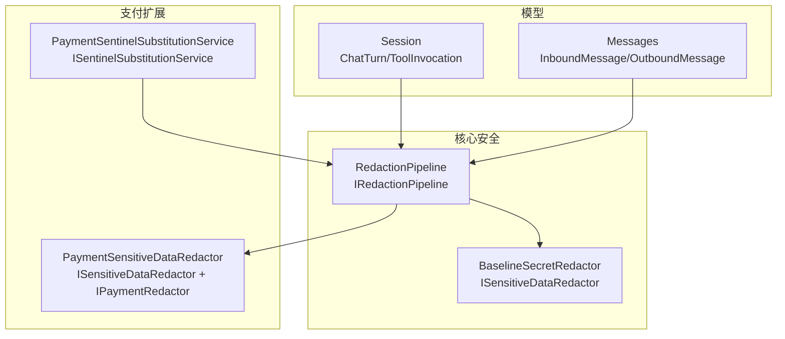
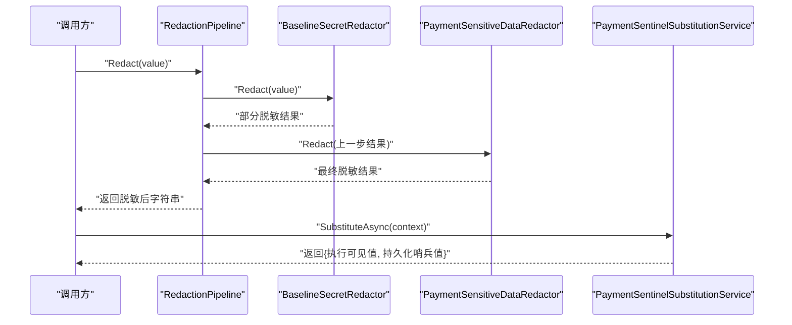
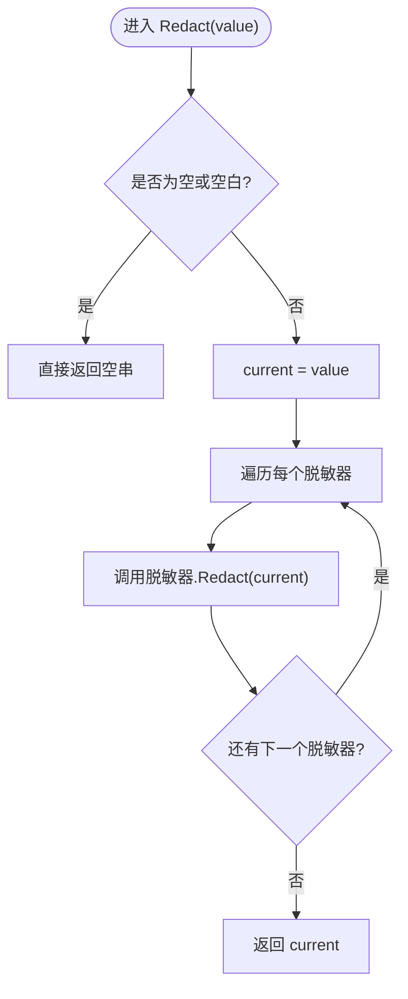
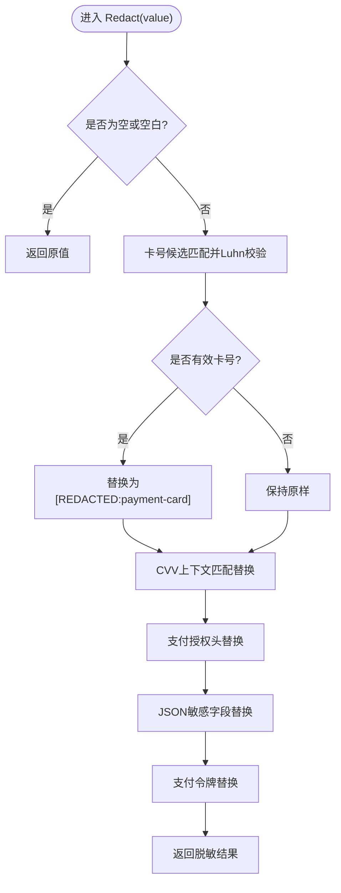
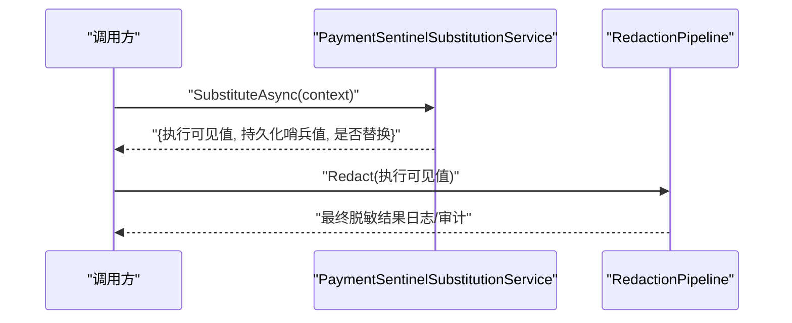
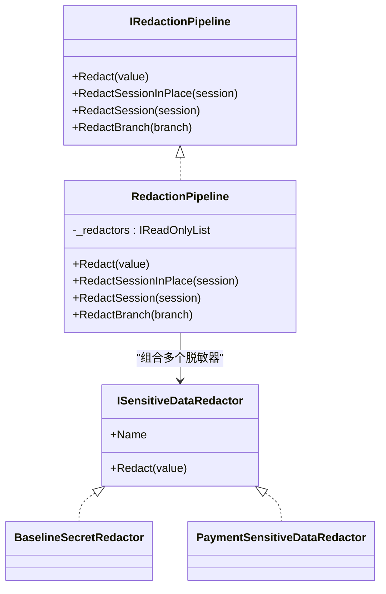
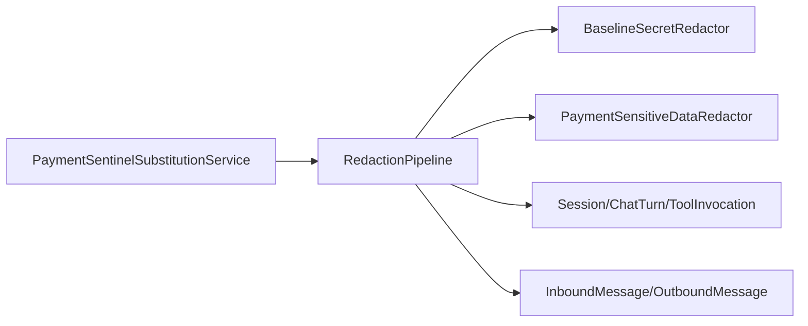

# 数据脱敏

<cite>
**本文引用的文件**
- [RedactionPipeline.cs](file://src/OpenClaw.Core/Security/RedactionPipeline.cs)
- [PaymentSensitiveDataRedactor.cs](file://src/OpenClaw.Payments.Core/PaymentSensitiveDataRedactor.cs)
- [SentinelSubstitution.cs](file://src/OpenClaw.Core/Security/SentinelSubstitution.cs)
- [PaymentSentinelSubstitutionService.cs](file://src/OpenClaw.Payments.Core/PaymentSentinelSubstitutionService.cs)
- [Session.cs](file://src/OpenClaw.Core/Models/Session.cs)
- [Messages.cs](file://src/OpenClaw.Core/Models/Messages.cs)
- [PaymentInterfaces.cs](file://src/OpenClaw.Payments.Abstractions/PaymentInterfaces.cs)
- [PaymentRuntimeTests.cs](file://src/OpenClaw.Tests/PaymentRuntimeTests.cs)
- [PaymentServiceCollectionExtensions.cs](file://src/OpenClaw.Payments.Core/PaymentServiceCollectionExtensions.cs)
</cite>

## 目录
1. [简介](#简介)
2. [项目结构](#项目结构)
3. [核心组件](#核心组件)
4. [架构总览](#架构总览)
5. [详细组件分析](#详细组件分析)
6. [依赖关系分析](#依赖关系分析)
7. [性能考量](#性能考量)
8. [故障排查指南](#故障排查指南)
9. [结论](#结论)
10. [附录](#附录)

## 简介
本技术文档围绕数据脱敏管道系统展开，重点介绍 RedactionPipeline 的脱敏策略与处理流程，涵盖敏感数据识别、脱敏算法选择、输出格式控制、规则配置、多层脱敏处理以及性能优化策略。同时提供配置示例、数据保护方案与合规性检查建议，并给出脱敏效果验证、误脱敏处理与安全事件追踪指南。

## 项目结构
脱敏能力主要分布在以下模块：
- 核心安全模块：提供通用脱敏接口、流水线与基础脱敏器（如密钥类敏感信息）。
- 支付扩展模块：提供支付敏感数据专用脱敏器与支付哨兵替换服务。
- 模型与消息：会话与消息模型用于承载待脱敏内容。
- 测试用例：验证支付脱敏器与会话持久化后的脱敏效果。

**图表来源**
- [RedactionPipeline.cs:21-94](file://src/OpenClaw.Core/Security/RedactionPipeline.cs#L21-L94)
- [PaymentSensitiveDataRedactor.cs:8-50](file://src/OpenClaw.Payments.Core/PaymentSensitiveDataRedactor.cs#L8-L50)
- [SentinelSubstitution.cs:3-26](file://src/OpenClaw.Core/Security/SentinelSubstitution.cs#L3-L26)
- [PaymentSentinelSubstitutionService.cs:8-35](file://src/OpenClaw.Payments.Core/PaymentSentinelSubstitutionService.cs#L8-L35)
- [Session.cs:15-179](file://src/OpenClaw.Core/Models/Session.cs#L15-L179)
- [Messages.cs:6-61](file://src/OpenClaw.Core/Models/Messages.cs#L6-L61)

**章节来源**
- [RedactionPipeline.cs:1-131](file://src/OpenClaw.Core/Security/RedactionPipeline.cs#L1-L131)
- [PaymentSensitiveDataRedactor.cs:1-88](file://src/OpenClaw.Payments.Core/PaymentSensitiveDataRedactor.cs#L1-L88)
- [Session.cs:1-800](file://src/OpenClaw.Core/Models/Session.cs#L1-L800)
- [Messages.cs:1-62](file://src/OpenClaw.Core/Models/Messages.cs#L1-L62)

## 核心组件
- 脱敏流水线接口与实现
  - IRedactionPipeline 定义统一的脱敏入口：对字符串进行脱敏、对会话/分支进行原位或克隆脱敏。
  - RedactionPipeline 实现按顺序应用多个 ISensitiveDataRedactor；支持会话历史逐条脱敏，覆盖消息正文与工具调用参数/结果/失败信息/下一步提示等字段。
  - NoopRedactionPipeline 提供空实现，便于在测试或禁用场景使用。
- 敏感数据脱敏器
  - BaselineSecretRedactor：识别并替换授权头、OpenAI 密钥、API Key 字段等常见密钥模式。
  - PaymentSensitiveDataRedactor：识别并替换支付卡号、CVV、授权头、JSON 字段中的敏感值、支付令牌等，含 Luhn 校验以降低误判。
- 哨兵替换服务
  - ISentinelSubstitutionService：在浏览器工具执行边界进行敏感值替换，同时保留未替换的“哨兵”以便持久化。
  - PaymentSentinelSubstitutionService：解析支付句柄与字段占位符，按环境与字段类型替换执行时可见值，持久化仍保留哨兵。
- 会话与消息模型
  - Session/ChatTurn/ToolInvocation：承载对话历史与工具调用参数，是脱敏流水线的主要处理对象。
  - InboundMessage/OutboundMessage：承载通道消息文本，亦可纳入脱敏范围。

**章节来源**
- [RedactionPipeline.cs:13-94](file://src/OpenClaw.Core/Security/RedactionPipeline.cs#L13-L94)
- [PaymentSensitiveDataRedactor.cs:8-88](file://src/OpenClaw.Payments.Core/PaymentSensitiveDataRedactor.cs#L8-L88)
- [SentinelSubstitution.cs:3-26](file://src/OpenClaw.Core/Security/SentinelSubstitution.cs#L3-L26)
- [PaymentSentinelSubstitutionService.cs:8-35](file://src/OpenClaw.Payments.Core/PaymentSentinelSubstitutionService.cs#L8-L35)
- [Session.cs:15-179](file://src/OpenClaw.Core/Models/Session.cs#L15-L179)
- [Messages.cs:6-61](file://src/OpenClaw.Core/Models/Messages.cs#L6-L61)

## 架构总览
下图展示从输入到输出的脱敏处理路径，包括会话级脱敏与支付哨兵替换协同工作的方式。

**图表来源**
- [RedactionPipeline.cs:30-39](file://src/OpenClaw.Core/Security/RedactionPipeline.cs#L30-L39)
- [PaymentSensitiveDataRedactor.cs:32-50](file://src/OpenClaw.Payments.Core/PaymentSensitiveDataRedactor.cs#L32-L50)
- [SentinelSubstitution.cs:23-26](file://src/OpenClaw.Core/Security/SentinelSubstitution.cs#L23-L26)
- [PaymentSentinelSubstitutionService.cs:21-35](file://src/OpenClaw.Payments.Core/PaymentSentinelSubstitutionService.cs#L21-L35)

## 详细组件分析

### RedactionPipeline 脱敏流水线
- 设计要点
  - 多脱敏器链式组合：依次应用每个脱敏器，确保覆盖不同类型的敏感信息。
  - 会话级脱敏：遍历历史记录，对每条消息正文与工具调用的参数、结果、失败信息、下一步提示进行脱敏。
  - 分支级脱敏：通过序列化/反序列化克隆会话分支，再对克隆体进行原位脱敏，避免影响原始数据。
- 性能特性
  - 使用编译正则表达式，减少运行时开销。
  - 对空值短路返回，避免无效处理。
  - 会话脱敏采用就地修改，减少内存分配。

**图表来源**
- [RedactionPipeline.cs:30-39](file://src/OpenClaw.Core/Security/RedactionPipeline.cs#L30-L39)

**章节来源**
- [RedactionPipeline.cs:21-94](file://src/OpenClaw.Core/Security/RedactionPipeline.cs#L21-L94)

### BaselineSecretRedactor 基线密钥脱敏
- 覆盖范围
  - 授权头（Bearer）替换为统一标记。
  - OpenAI 秘钥模式替换为统一标记。
  - API Key 字段替换为统一标记。
- 输出格式
  - 统一替换为占位标记，便于审计与日志过滤。

**章节来源**
- [RedactionPipeline.cs:104-131](file://src/OpenClaw.Core/Security/RedactionPipeline.cs#L104-L131)

### PaymentSensitiveDataRedactor 支付敏感数据脱敏
- 覆盖范围
  - 卡号候选匹配与 Luhn 校验，仅对有效卡号进行替换。
  - CVV 上下文匹配替换。
  - 支付授权头替换。
  - JSON 字段中敏感键值替换。
  - 支付令牌替换。
- 输出格式
  - 对卡号、CVV、授权头、敏感字段、令牌分别替换为对应占位标记，保留合理上下文（如“last4”）以满足业务需求。

**图表来源**
- [PaymentSensitiveDataRedactor.cs:32-50](file://src/OpenClaw.Payments.Core/PaymentSensitiveDataRedactor.cs#L32-L50)
- [PaymentSensitiveDataRedactor.cs:64-86](file://src/OpenClaw.Payments.Core/PaymentSensitiveDataRedactor.cs#L64-L86)

**章节来源**
- [PaymentSensitiveDataRedactor.cs:8-88](file://src/OpenClaw.Payments.Core/PaymentSensitiveDataRedactor.cs#L8-L88)

### 哨兵替换与持久化隔离
- 场景
  - 在浏览器工具执行边界替换敏感值，使执行时可见但持久化为哨兵，避免泄露。
- 实现
  - PaymentSentinelSubstitutionService 解析支付句柄与字段占位符，按字段类型与环境替换执行时可见值。
  - 返回结果包含两套 JSON：执行时使用的已替换参数与持久化使用的哨兵参数。
- 协同
  - 执行后可再次通过 RedactionPipeline 对执行参数进行兜底脱敏，确保日志与审计不残留敏感信息。

**图表来源**
- [SentinelSubstitution.cs:23-26](file://src/OpenClaw.Core/Security/SentinelSubstitution.cs#L23-L26)
- [PaymentSentinelSubstitutionService.cs:21-35](file://src/OpenClaw.Payments.Core/PaymentSentinelSubstitutionService.cs#L21-L35)
- [RedactionPipeline.cs:30-39](file://src/OpenClaw.Core/Security/RedactionPipeline.cs#L30-L39)

**章节来源**
- [SentinelSubstitution.cs:1-38](file://src/OpenClaw.Core/Security/SentinelSubstitution.cs#L1-L38)
- [PaymentSentinelSubstitutionService.cs:1-35](file://src/OpenClaw.Payments.Core/PaymentSentinelSubstitutionService.cs#L1-L35)

### 会话与消息脱敏
- 会话脱敏
  - RedactSessionInPlace 遍历 History，对每条 ChatTurn 的 Content 与 ToolCalls 中的 Arguments、Result、FailureMessage、NextStep 进行脱敏。
  - RedactSession 克隆会话后再脱敏，避免污染原始数据。
  - RedactBranch 将 SessionBranch 转换为临时 Session 再脱敏，保持分支结构不变。
- 消息脱敏
  - InboundMessage/OutboundMessage 的文本字段可直接交由 RedactionPipeline 处理，纳入统一脱敏策略。

**图表来源**
- [RedactionPipeline.cs:13-94](file://src/OpenClaw.Core/Security/RedactionPipeline.cs#L13-L94)
- [RedactionPipeline.cs:104-131](file://src/OpenClaw.Core/Security/RedactionPipeline.cs#L104-L131)
- [PaymentSensitiveDataRedactor.cs:8-50](file://src/OpenClaw.Payments.Core/PaymentSensitiveDataRedactor.cs#L8-L50)

**章节来源**
- [RedactionPipeline.cs:21-94](file://src/OpenClaw.Core/Security/RedactionPipeline.cs#L21-L94)
- [Session.cs:15-179](file://src/OpenClaw.Core/Models/Session.cs#L15-L179)
- [Messages.cs:6-61](file://src/OpenClaw.Core/Models/Messages.cs#L6-L61)

## 依赖关系分析
- 组件耦合
  - RedactionPipeline 依赖 ISensitiveDataRedactor 列表，通过构造注入实现多策略组合。
  - PaymentSensitiveDataRedactor 依赖正则与 Luhn 校验逻辑，独立于其他模块。
  - PaymentSentinelSubstitutionService 依赖 PaymentRuntimeService 获取敏感值，但通过接口解耦。
- 外部依赖
  - System.Text.RegularExpressions 与 System.Text.Json 用于正则匹配与序列化/反序列化。
- 可能的循环依赖
  - 当前模块间无循环依赖，接口清晰分离。

**图表来源**
- [RedactionPipeline.cs:21-94](file://src/OpenClaw.Core/Security/RedactionPipeline.cs#L21-L94)
- [PaymentSensitiveDataRedactor.cs:8-50](file://src/OpenClaw.Payments.Core/PaymentSensitiveDataRedactor.cs#L8-L50)
- [PaymentSentinelSubstitutionService.cs:8-35](file://src/OpenClaw.Payments.Core/PaymentSentinelSubstitutionService.cs#L8-L35)
- [Session.cs:15-179](file://src/OpenClaw.Core/Models/Session.cs#L15-L179)
- [Messages.cs:6-61](file://src/OpenClaw.Core/Models/Messages.cs#L6-L61)

**章节来源**
- [PaymentServiceCollectionExtensions.cs:29-42](file://src/OpenClaw.Payments.Core/PaymentServiceCollectionExtensions.cs#L29-L42)

## 性能考量
- 正则编译
  - 所有正则均使用编译标志，减少运行时编译开销。
- 空值短路
  - 对空或空白输入直接返回，避免不必要的处理。
- 结构化处理
  - 会话脱敏采用就地修改，减少中间对象创建。
- 序列化克隆
  - 分支脱敏通过序列化/反序列化克隆，确保线程安全与不可变性，但需注意大体量会话的序列化成本。
- 建议
  - 对高频调用场景，可考虑缓存常用正则结果或分批处理。
  - 对超长会话，优先对必要字段脱敏，避免全量序列化。

[本节为通用性能指导，无需特定文件引用]

## 故障排查指南
- 脱敏未生效
  - 检查是否正确注入了 RedactionPipeline 与相关脱敏器。
  - 确认输入非空且包含目标敏感信息。
- 误脱敏
  - 支付卡号需通过 Luhn 校验，若仍被替换，检查正则范围与校验逻辑。
  - 对于业务必需的上下文（如 last4），确认保留策略是否正确。
- 哨兵替换异常
  - 确认工具名称与参数 JSON 匹配哨兵模式。
  - 检查持久化参数是否仍包含哨兵，执行参数是否已替换。
- 验证方法
  - 使用测试用例思路：保存包含敏感信息的会话，加载后断言敏感信息已被替换。
  - 对支付哨兵替换，断言执行可见值与持久化哨兵值不同。

**章节来源**
- [PaymentRuntimeTests.cs:18-29](file://src/OpenClaw.Tests/PaymentRuntimeTests.cs#L18-L29)
- [PaymentRuntimeTests.cs:294-322](file://src/OpenClaw.Tests/PaymentRuntimeTests.cs#L294-L322)
- [PaymentRuntimeTests.cs:126-155](file://src/OpenClaw.Tests/PaymentRuntimeTests.cs#L126-L155)

## 结论
该脱敏管道通过“流水线+多脱敏器”的设计，实现了对多种敏感数据的统一处理；结合支付哨兵替换与会话级脱敏，既满足执行边界的安全需求，又保障持久化与审计阶段的数据安全。配合测试用例与可观测性，可有效验证脱敏效果并快速定位问题。

[本节为总结性内容，无需特定文件引用]

## 附录

### 配置示例与最佳实践
- 注册支付脱敏器
  - 在支付模块初始化时注册 PaymentSensitiveDataRedactor 为 ISensitiveDataRedactor，确保会话与消息脱敏时自动应用。
- 启用哨兵替换
  - 在需要浏览器工具执行的场景，先调用 PaymentSentinelSubstitutionService 替换执行参数，再进行兜底脱敏。
- 输出格式控制
  - 统一使用占位标记，便于日志过滤与合规审计。
- 多层脱敏处理
  - 基线密钥脱敏器与支付脱敏器组合使用，确保覆盖更广的敏感信息类型。
- 性能优化
  - 对大体量会话采用增量脱敏策略，优先处理关键字段。
  - 缓存编译后的正则表达式，避免重复编译。

**章节来源**
- [PaymentServiceCollectionExtensions.cs:29-42](file://src/OpenClaw.Payments.Core/PaymentServiceCollectionExtensions.cs#L29-L42)
- [RedactionPipeline.cs:21-94](file://src/OpenClaw.Core/Security/RedactionPipeline.cs#L21-L94)
- [PaymentSentinelSubstitutionService.cs:21-35](file://src/OpenClaw.Payments.Core/PaymentSentinelSubstitutionService.cs#L21-L35)

### 合规性检查清单
- 是否覆盖常见密钥模式（Bearer、OpenAI 秘钥、API Key）？
- 是否对支付卡号、CVV、授权头、敏感 JSON 字段、支付令牌进行脱敏？
- 是否对会话历史与工具调用参数/结果进行脱敏？
- 是否区分执行可见值与持久化值（哨兵替换）？
- 是否具备误脱敏的回退与人工审核机制？

[本节为通用合规建议，无需特定文件引用]

### 脱敏效果验证步骤
- 构造包含敏感信息的会话与消息。
- 保存后重新加载，断言敏感信息已被替换。
- 对支付哨兵替换，断言执行可见值与持久化值不同。
- 使用 RedactionPipeline 对执行参数再次脱敏，确保日志与审计不残留敏感信息。

**章节来源**
- [PaymentRuntimeTests.cs:18-29](file://src/OpenClaw.Tests/PaymentRuntimeTests.cs#L18-L29)
- [PaymentRuntimeTests.cs:294-322](file://src/OpenClaw.Tests/PaymentRuntimeTests.cs#L294-L322)
- [PaymentRuntimeTests.cs:126-155](file://src/OpenClaw.Tests/PaymentRuntimeTests.cs#L126-L155)

### 误脱敏处理与安全事件追踪
- 误脱敏处理
  - 通过保留合理上下文（如 last4）与严格的 Luhn 校验，降低误脱敏概率。
  - 对关键字段增加白名单或上下文限定，避免过度替换。
- 安全事件追踪
  - 记录脱敏前后的摘要与占位标记，便于审计与溯源。
  - 对哨兵替换与兜底脱敏分别记录，形成完整的安全轨迹。

[本节为通用安全建议，无需特定文件引用]