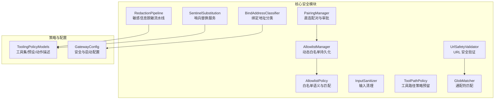
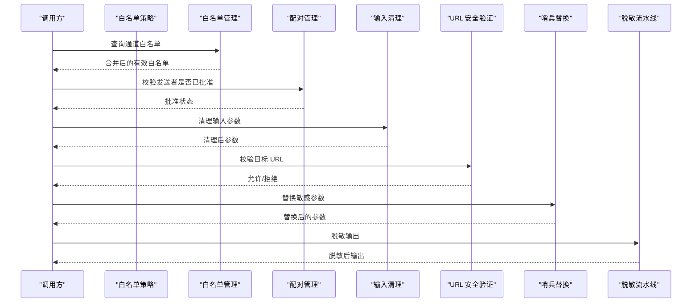
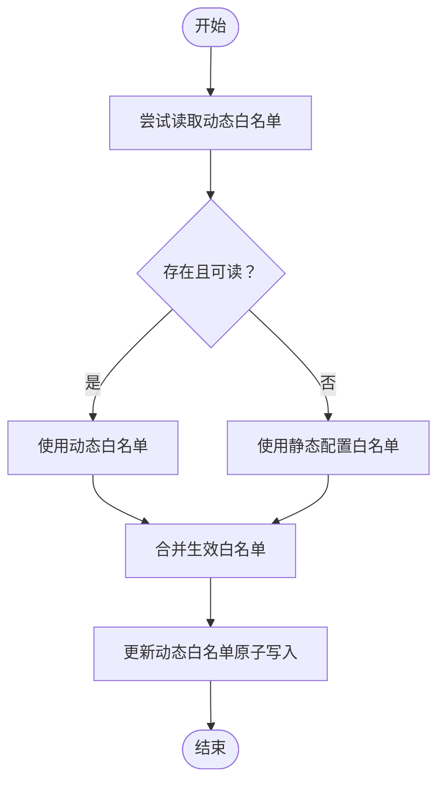
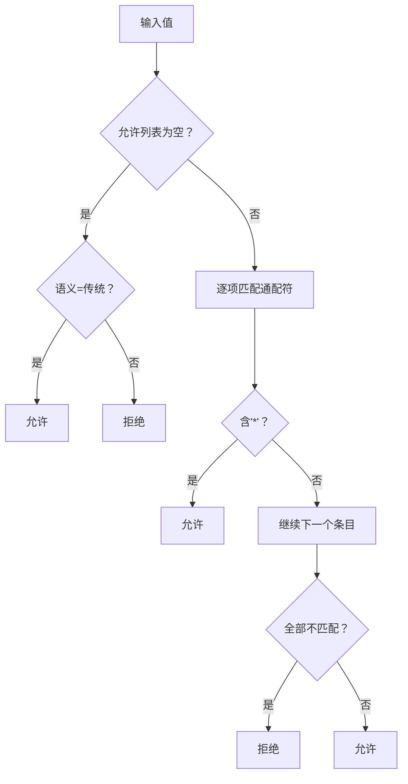
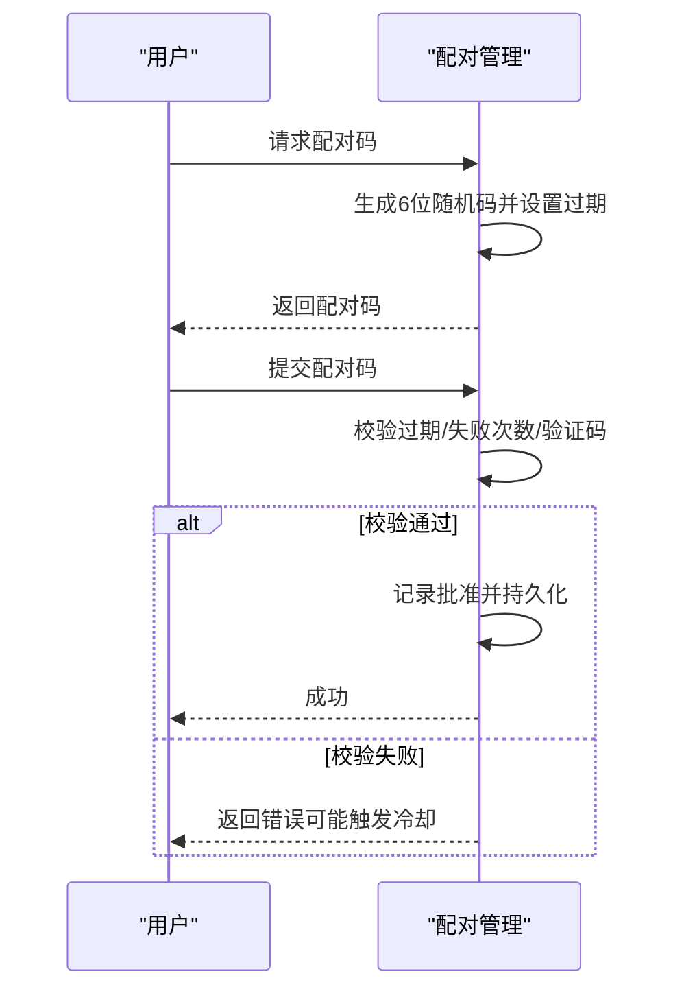
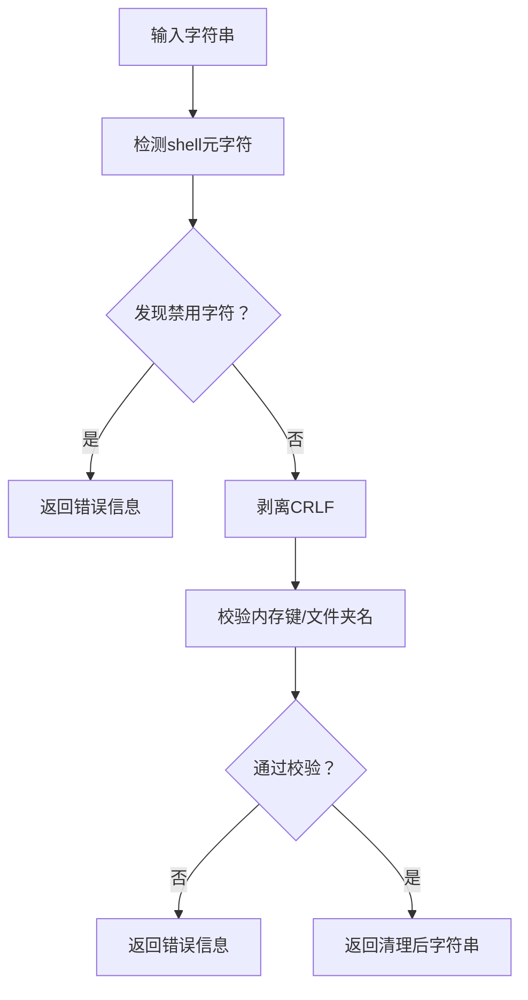
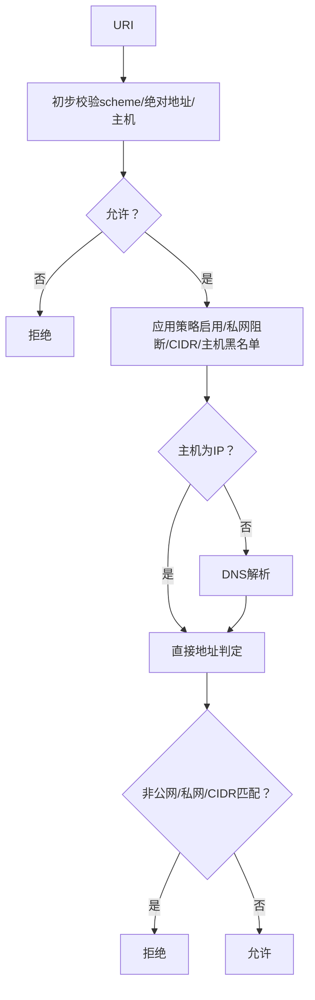
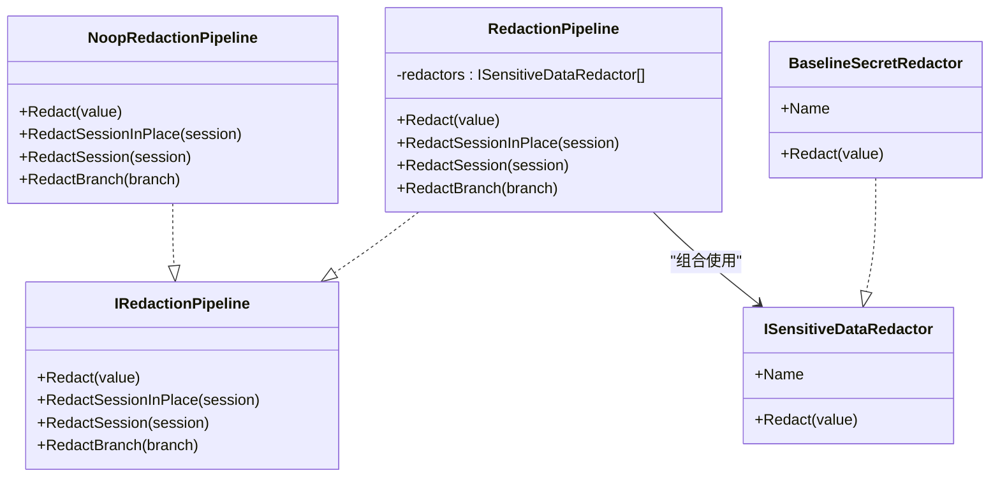
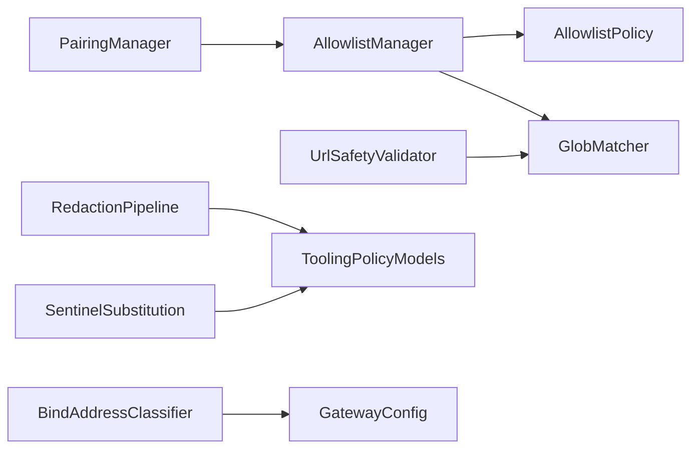

# 权限控制系统

<cite>
**本文引用的文件**
- [AllowlistManager.cs](file://src/OpenClaw.Core/Src/OpenClaw.Core/Security/AllowlistManager.cs)
- [AllowlistPolicy.cs](file://src/OpenClaw.Core/Src/OpenClaw.Core/Security/AllowlistPolicy.cs)
- [PairingManager.cs](file://src/OpenClaw.Core/Src/OpenClaw.Core/Security/PairingManager.cs)
- [InputSanitizer.cs](file://src/OpenClaw.Core/Src/OpenClaw.Core/Security/InputSanitizer.cs)
- [UrlSafetyValidator.cs](file://src/OpenClaw.Core/Src/OpenClaw.Core/Security/UrlSafetyValidator.cs)
- [ToolPathPolicy.cs](file://src/OpenClaw.Core/Src/OpenClaw.Core/Security/ToolPathPolicy.cs)
- [RedactionPipeline.cs](file://src/OpenClaw.Core/Src/OpenClaw.Core/Security/RedactionPipeline.cs)
- [GlobMatcher.cs](file://src/OpenClaw.Core/Src/OpenClaw.Core/Security/GlobMatcher.cs)
- [BindAddressClassifier.cs](file://src/OpenClaw.Core/Src/OpenClaw.Core/Security/BindAddressClassifier.cs)
- [SentinelSubstitution.cs](file://src/OpenClaw.Core/Src/OpenClaw.Core/Security/SentinelSubstitution.cs)
- [ToolingPolicyModels.cs](file://src/OpenClaw.Core/Src/OpenClaw.Core/Models/ToolingPolicyModels.cs)
- [GatewayConfig.cs](file://src/OpenClaw.Core/Src/OpenClaw.Core/Models/GatewayConfig.cs)
- [AllowlistManagerTests.cs](file://src/OpenClaw.Tests/Src/OpenClaw.Tests/AllowlistManagerTests.cs)
- [AllowlistPolicyTests.cs](file://src/OpenClaw.Tests/Src/OpenClaw.Tests/AllowlistPolicyTests.cs)
- [PairingManagerTests.cs](file://src/OpenClaw.Tests/Src/OpenClaw.Tests/PairingManagerTests.cs)
- [UrlSafetyValidatorTests.cs](file://src/OpenClaw.Tests/Src/OpenClaw.Tests/UrlSafetyValidatorTests.cs)
</cite>

## 目录
1. [简介](#简介)
2. [项目结构](#项目结构)
3. [核心组件](#核心组件)
4. [架构总览](#架构总览)
5. [详细组件分析](#详细组件分析)
6. [依赖关系分析](#依赖关系分析)
7. [性能考量](#性能考量)
8. [故障排除指南](#故障排除指南)
9. [结论](#结论)
10. [附录](#附录)

## 简介
本文件面向“工具权限控制系统”，系统性梳理并说明权限管理的架构设计、策略实现与安全机制。内容覆盖白名单管理、路径策略、输入清理、URL 安全验证、配对管理、数据脱敏等关键模块，并解释权限评估流程、策略组合与执行控制。同时提供配置示例、安全最佳实践与合规建议，以及常见问题的排查方法。

## 项目结构
权限控制相关能力主要集中在 OpenClaw.Core 的 Security 命名空间中，配合 Models 中的策略与配置模型共同构成完整的权限体系。测试用例位于 OpenClaw.Tests，用于验证各组件的行为与边界条件。

**图表来源**
- [AllowlistManager.cs:1-126](file://src/OpenClaw.Core/Src/OpenClaw.Core/Security/AllowlistManager.cs#L1-L126)
- [AllowlistPolicy.cs:1-43](file://src/OpenClaw.Core/Src/OpenClaw.Core/Security/AllowlistPolicy.cs#L1-L43)
- [PairingManager.cs:1-211](file://src/OpenClaw.Core/Src/OpenClaw.Core/Security/PairingManager.cs#L1-L211)
- [InputSanitizer.cs:1-84](file://src/OpenClaw.Core/Src/OpenClaw.Core/Security/InputSanitizer.cs#L1-L84)
- [UrlSafetyValidator.cs:1-219](file://src/OpenClaw.Core/Src/OpenClaw.Core/Security/UrlSafetyValidator.cs#L1-L219)
- [ToolPathPolicy.cs:1-136](file://src/OpenClaw.Core/Src/OpenClaw.Core/Security/ToolPathPolicy.cs#L1-L136)
- [RedactionPipeline.cs:1-131](file://src/OpenClaw.Core/Src/OpenClaw.Core/Security/RedactionPipeline.cs#L1-L131)
- [GlobMatcher.cs:1-89](file://src/OpenClaw.Core/Src/OpenClaw.Core/Security/GlobMatcher.cs#L1-L89)
- [BindAddressClassifier.cs:1-19](file://src/OpenClaw.Core/Src/OpenClaw.Core/Security/BindAddressClassifier.cs#L1-L19)
- [SentinelSubstitution.cs:1-38](file://src/OpenClaw.Core/Src/OpenClaw.Core/Security/SentinelSubstitution.cs#L1-L38)
- [ToolingPolicyModels.cs:1-45](file://src/OpenClaw.Core/Src/OpenClaw.Core/Models/ToolingPolicyModels.cs#L1-L45)
- [GatewayConfig.cs:331-378](file://src/OpenClaw.Core/Src/OpenClaw.Core/Models/GatewayConfig.cs#L331-L378)

**章节来源**
- [AllowlistManager.cs:1-126](file://src/OpenClaw.Core/Src/OpenClaw.Core/Security/AllowlistManager.cs#L1-L126)
- [AllowlistPolicy.cs:1-43](file://src/OpenClaw.Core/Src/OpenClaw.Core/Security/AllowlistPolicy.cs#L1-L43)
- [PairingManager.cs:1-211](file://src/OpenClaw.Core/Src/OpenClaw.Core/Security/PairingManager.cs#L1-L211)
- [InputSanitizer.cs:1-84](file://src/OpenClaw.Core/Src/OpenClaw.Core/Security/InputSanitizer.cs#L1-L84)
- [UrlSafetyValidator.cs:1-219](file://src/OpenClaw.Core/Src/OpenClaw.Core/Security/UrlSafetyValidator.cs#L1-L219)
- [ToolPathPolicy.cs:1-136](file://src/OpenClaw.Core/Src/OpenClaw.Core/Security/ToolPathPolicy.cs#L1-L136)
- [RedactionPipeline.cs:1-131](file://src/OpenClaw.Core/Src/OpenClaw.Core/Security/RedactionPipeline.cs#L1-L131)
- [GlobMatcher.cs:1-89](file://src/OpenClaw.Core/Src/OpenClaw.Core/Security/GlobMatcher.cs#L1-L89)
- [BindAddressClassifier.cs:1-19](file://src/OpenClaw.Core/Src/OpenClaw.Core/Security/BindAddressClassifier.cs#L1-L19)
- [SentinelSubstitution.cs:1-38](file://src/OpenClaw.Core/Src/OpenClaw.Core/Security/SentinelSubstitution.cs#L1-L38)
- [ToolingPolicyModels.cs:1-45](file://src/OpenClaw.Core/Src/OpenClaw.Core/Models/ToolingPolicyModels.cs#L1-L45)
- [GatewayConfig.cs:331-378](file://src/OpenClaw.Core/Src/OpenClaw.Core/Models/GatewayConfig.cs#L331-L378)

## 核心组件
- 白名单管理：支持按通道的动态白名单持久化与合并，优先读取动态文件，其次回退到静态配置。
- 白名单策略：提供“严格”和“传统”两种语义，支持通配符匹配与空列表行为差异。
- 配对管理：生成一次性配对码、审批通过者、撤销授权、固定时间比较防时序攻击、冷却与失败次数限制。
- 输入清理：检测并阻止 shell 元字符注入、剥离 CRLF 防协议注入、校验内存键与 IMAP 文件夹名安全性。
- URL 安全验证：仅允许绝对 http(s)；内置黑名单主机、可选私网/元数据/非公网阻断、CIDR 拦截、DNS 解析与地址判定。
- 工具路径策略：预留文件系统根目录读写许可判断与路径解析逻辑。
- 数据脱敏：多级脱敏流水线，针对会话历史中的工具调用参数、结果、失败消息等进行敏感信息替换。
- 通配符匹配：高性能 Span 匹配，支持“允许/拒绝”组合，拒绝优先。
- 绑定地址分类：识别是否为环回绑定，避免错误的公网部署安全假设。
- 哨兵替换：在执行与持久化之间对参数进行替换标记，便于审计与合规。

**章节来源**
- [AllowlistManager.cs:1-126](file://src/OpenClaw.Core/Src/OpenClaw.Core/Security/AllowlistManager.cs#L1-L126)
- [AllowlistPolicy.cs:1-43](file://src/OpenClaw.Core/Src/OpenClaw.Core/Security/AllowlistPolicy.cs#L1-L43)
- [PairingManager.cs:1-211](file://src/OpenClaw.Core/Src/OpenClaw.Core/Security/PairingManager.cs#L1-L211)
- [InputSanitizer.cs:1-84](file://src/OpenClaw.Core/Src/OpenClaw.Core/Security/InputSanitizer.cs#L1-L84)
- [UrlSafetyValidator.cs:1-219](file://src/OpenClaw.Core/Src/OpenClaw.Core/Security/UrlSafetyValidator.cs#L1-L219)
- [ToolPathPolicy.cs:1-136](file://src/OpenClaw.Core/Src/OpenClaw.Core/Security/ToolPathPolicy.cs#L1-L136)
- [RedactionPipeline.cs:1-131](file://src/OpenClaw.Core/Src/OpenClaw.Core/Security/RedactionPipeline.cs#L1-L131)
- [GlobMatcher.cs:1-89](file://src/OpenClaw.Core/Src/OpenClaw.Core/Security/GlobMatcher.cs#L1-L89)
- [BindAddressClassifier.cs:1-19](file://src/OpenClaw.Core/Src/OpenClaw.Core/Security/BindAddressClassifier.cs#L1-L19)
- [SentinelSubstitution.cs:1-38](file://src/OpenClaw.Core/Src/OpenClaw.Core/Security/SentinelSubstitution.cs#L1-L38)

## 架构总览
下图展示权限控制系统的整体交互：工具调用经由白名单与配对检查，输入进入清理与 URL 安全验证，执行前可进行哨兵替换，最终输出通过脱敏流水线处理。

**图表来源**
- [AllowlistManager.cs:50-51](file://src/OpenClaw.Core/Src/OpenClaw.Core/Security/AllowlistManager.cs#L50-L51)
- [AllowlistPolicy.cs:18-40](file://src/OpenClaw.Core/Src/OpenClaw.Core/Security/AllowlistPolicy.cs#L18-L40)
- [PairingManager.cs:44-48](file://src/OpenClaw.Core/Src/OpenClaw.Core/Security/PairingManager.cs#L44-L48)
- [InputSanitizer.cs:24-51](file://src/OpenClaw.Core/Src/OpenClaw.Core/Security/InputSanitizer.cs#L24-L51)
- [UrlSafetyValidator.cs:60-111](file://src/OpenClaw.Core/Src/OpenClaw.Core/Security/UrlSafetyValidator.cs#L60-L111)
- [SentinelSubstitution.cs:23-37](file://src/OpenClaw.Core/Src/OpenClaw.Core/Security/SentinelSubstitution.cs#L23-L37)
- [RedactionPipeline.cs:30-39](file://src/OpenClaw.Core/Src/OpenClaw.Core/Security/RedactionPipeline.cs#L30-L39)

## 详细组件分析

### 白名单管理（AllowlistManager）
- 功能要点
  - 按通道将白名单持久化至磁盘，动态文件优先于静态配置。
  - 提供添加/设置“允许来自”列表的原子更新，带并发锁与临时文件写入保障一致性。
  - 路径安全：对通道 ID 进行字符过滤与前导点清理，防止目录穿越。
- 关键流程
  - 读取动态文件失败时记录警告并回退到配置。
  - 更新时写入临时文件再原子移动覆盖，异常时尽力清理临时文件。
- 使用场景
  - 为不同渠道（如 Telegram、SMS）分别维护允许的发送者集合。
  - 在运行时动态调整白名单，无需重启。

**图表来源**
- [AllowlistManager.cs:32-51](file://src/OpenClaw.Core/Src/OpenClaw.Core/Security/AllowlistManager.cs#L32-L51)
- [AllowlistManager.cs:53-84](file://src/OpenClaw.Core/Src/OpenClaw.Core/Security/AllowlistManager.cs#L53-L84)

**章节来源**
- [AllowlistManager.cs:1-126](file://src/OpenClaw.Core/Src/OpenClaw.Core/Security/AllowlistManager.cs#L1-L126)
- [AllowlistManagerTests.cs:1-42](file://src/OpenClaw.Tests/Src/OpenClaw.Tests/AllowlistManagerTests.cs#L1-L42)

### 白名单策略（AllowlistPolicy）
- 功能要点
  - 支持“严格”和“传统”两种语义：
    - 严格：空白名单即拒绝；支持通配符与“*”全量放行。
    - 传统：空名单默认允许（兼容历史行为）。
  - 通配符匹配采用 GlobMatcher，大小写敏感。
- 使用场景
  - 在不同渠道或环境采用不同白名单策略，平衡安全与可用性。

**图表来源**
- [AllowlistPolicy.cs:18-40](file://src/OpenClaw.Core/Src/OpenClaw.Core/Security/AllowlistPolicy.cs#L18-L40)
- [GlobMatcher.cs:9-63](file://src/OpenClaw.Core/Src/OpenClaw.Core/Security/GlobMatcher.cs#L9-L63)

**章节来源**
- [AllowlistPolicy.cs:1-43](file://src/OpenClaw.Core/Src/OpenClaw.Core/Security/AllowlistPolicy.cs#L1-L43)
- [AllowlistPolicyTests.cs:1-34](file://src/OpenClaw.Tests/Src/OpenClaw.Tests/AllowlistPolicyTests.cs#L1-L34)

### 配对管理（PairingManager）
- 功能要点
  - 生成一次性 6 位配对码，10 分钟有效期；失败尝试超过阈值进入 5 分钟冷却。
  - 固定时间比较防止时序攻击；过期自动清理。
  - 将已批准发送者持久化到磁盘，重启后仍有效。
- 安全特性
  - 使用 CryptographicOperations.FixedTimeEquals 对比验证码。
  - 失败计数与冷却窗口降低暴力破解风险。
- 使用场景
  - 为未受信的直连渠道（如短信、WhatsApp）建立一次性信任链路。

**图表来源**
- [PairingManager.cs:53-124](file://src/OpenClaw.Core/Src/OpenClaw.Core/Security/PairingManager.cs#L53-L124)
- [PairingManager.cs:146-154](file://src/OpenClaw.Core/Src/OpenClaw.Core/Security/PairingManager.cs#L146-L154)

**章节来源**
- [PairingManager.cs:1-211](file://src/OpenClaw.Core/Src/OpenClaw.Core/Security/PairingManager.cs#L1-L211)
- [PairingManagerTests.cs:1-61](file://src/OpenClaw.Tests/Src/OpenClaw.Tests/PairingManagerTests.cs#L1-L61)

### 输入清理（InputSanitizer）
- 功能要点
  - 检测 shell 元字符（分号、管道、重定向、命令替换、控制字符等），阻止注入。
  - 剥离 CRLF，防止 IMAP/SMTP 协议注入。
  - 校验内存键不允许路径遍历与空字节；IMAP 文件夹名禁止控制字符。
- 使用场景
  - 在工具执行前对用户输入进行基础清洗，作为纵深防御的一部分。

**图表来源**
- [InputSanitizer.cs:24-82](file://src/OpenClaw.Core/Src/OpenClaw.Core/Security/InputSanitizer.cs#L24-L82)

**章节来源**
- [InputSanitizer.cs:1-84](file://src/OpenClaw.Core/Src/OpenClaw.Core/Security/InputSanitizer.cs#L1-L84)

### URL 安全验证（UrlSafetyValidator）
- 功能要点
  - 仅允许绝对 http(s) URL；内置 localhost/metadata 等黑名单主机。
  - 可选阻断私有网络目标（环回、链路本地、站点本地、组播、非公网等）。
  - 支持自定义主机通配黑名单与 CIDR 黑名单；可选择是否解析 DNS。
- 使用场景
  - 在浏览器沙箱导航、HTTP 获取等场景前置校验，阻断内网探测与 SSRF。

**图表来源**
- [UrlSafetyValidator.cs:60-135](file://src/OpenClaw.Core/Src/OpenClaw.Core/Security/UrlSafetyValidator.cs#L60-L135)
- [UrlSafetyValidator.cs:137-217](file://src/OpenClaw.Core/Src/OpenClaw.Core/Security/UrlSafetyValidator.cs#L137-L217)

**章节来源**
- [UrlSafetyValidator.cs:1-219](file://src/OpenClaw.Core/Src/OpenClaw.Core/Security/UrlSafetyValidator.cs#L1-L219)
- [UrlSafetyValidatorTests.cs:1-78](file://src/OpenClaw.Tests/Src/OpenClaw.Tests/UrlSafetyValidatorTests.cs#L1-L78)

### 工具路径策略（ToolPathPolicy）
- 功能要点
  - 预留文件系统根目录读写许可判断、路径解析（跟随符号链接）、是否存在根节点判断、是否在根下等逻辑。
  - 当前文件为注释状态，未来可用于限制工具对文件系统的访问范围。
- 使用场景
  - 结合安全基线，限制工具对文件系统的读写范围，防止越权访问。

**章节来源**
- [ToolPathPolicy.cs:1-136](file://src/OpenClaw.Core/Src/OpenClaw.Core/Security/ToolPathPolicy.cs#L1-L136)

### 数据脱敏（RedactionPipeline）
- 功能要点
  - 多级脱敏流水线：依次对文本执行脱敏规则；支持对会话历史、分支进行就地或克隆后脱敏。
  - 基线脱敏器：识别 Authorization Bearer、OpenAI 密钥、API Key 字段并替换。
  - 提供空实现以在不需要时关闭脱敏。
- 使用场景
  - 在日志、审计、导出等环节自动去除敏感信息，满足隐私与合规要求。

**图表来源**
- [RedactionPipeline.cs:13-94](file://src/OpenClaw.Core/Src/OpenClaw.Core/Security/RedactionPipeline.cs#L13-L94)
- [RedactionPipeline.cs:96-131](file://src/OpenClaw.Core/Src/OpenClaw.Core/Security/RedactionPipeline.cs#L96-L131)

**章节来源**
- [RedactionPipeline.cs:1-131](file://src/OpenClaw.Core/Src/OpenClaw.Core/Security/RedactionPipeline.cs#L1-L131)

### 通配符匹配（GlobMatcher）
- 功能要点
  - 高性能 Span 匹配，避免 Split 分割带来的分配开销。
  - “允许/拒绝”组合：拒绝优先，空允许列表默认拒绝。
- 使用场景
  - 白名单/黑名单匹配、主机/路径模式匹配。

**章节来源**
- [GlobMatcher.cs:1-89](file://src/OpenClaw.Core/Src/OpenClaw.Core/Security/GlobMatcher.cs#L1-L89)

### 绑定地址分类（BindAddressClassifier）
- 功能要点
  - 识别是否为环回绑定地址，区分 "*"、"+"、"[::]" 等通配符与 localhost 的语义。
- 使用场景
  - 与安全配置联动，决定是否允许公网绑定下的某些高风险功能。

**章节来源**
- [BindAddressClassifier.cs:1-19](file://src/OpenClaw.Core/Src/OpenClaw.Core/Security/BindAddressClassifier.cs#L1-L19)

### 哨兵替换（SentinelSubstitution）
- 功能要点
  - 定义上下文与结果结构，支持在执行与持久化阶段对参数进行替换标记。
  - 提供空实现以便在不需要时直接透传。
- 使用场景
  - 在工具执行前后对敏感参数进行差异化处理，兼顾可观测性与隐私保护。

**章节来源**
- [SentinelSubstitution.cs:1-38](file://src/OpenClaw.Core/Src/OpenClaw.Core/Security/SentinelSubstitution.cs#L1-L38)

## 依赖关系分析
- 组件耦合
  - AllowlistManager 依赖 CoreJsonContext 进行序列化；与 AllowlistPolicy/GlobMatcher 协作完成策略与匹配。
  - PairingManager 依赖存储目录与 JSON 序列化；使用固定时间比较与并发字典保证安全与一致性。
  - UrlSafetyValidator 依赖 DNS 解析与 CIDR 判定，结合策略配置实现灵活的网络访问控制。
  - RedactionPipeline 依赖会话模型与脱敏器集合，形成可扩展的脱敏链。
  - SentinelSubstitution 与工具执行上下文解耦，便于在不同执行层插入替换逻辑。
- 外部依赖
  - System.Net、System.Net.Sockets 用于 DNS 与地址判定。
  - System.Text.Json 用于配置与对象序列化。
  - Microsoft.Extensions.Logging 用于日志记录与告警。

**图表来源**
- [AllowlistManager.cs:1-126](file://src/OpenClaw.Core/Src/OpenClaw.Core/Security/AllowlistManager.cs#L1-L126)
- [AllowlistPolicy.cs:1-43](file://src/OpenClaw.Core/Src/OpenClaw.Core/Security/AllowlistPolicy.cs#L1-L43)
- [PairingManager.cs:1-211](file://src/OpenClaw.Core/Src/OpenClaw.Core/Security/PairingManager.cs#L1-L211)
- [UrlSafetyValidator.cs:1-219](file://src/OpenClaw.Core/Src/OpenClaw.Core/Security/UrlSafetyValidator.cs#L1-L219)
- [RedactionPipeline.cs:1-131](file://src/OpenClaw.Core/Src/OpenClaw.Core/Security/RedactionPipeline.cs#L1-L131)
- [SentinelSubstitution.cs:1-38](file://src/OpenClaw.Core/Src/OpenClaw.Core/Security/SentinelSubstitution.cs#L1-L38)
- [GlobMatcher.cs:1-89](file://src/OpenClaw.Core/Src/OpenClaw.Core/Security/GlobMatcher.cs#L1-L89)
- [BindAddressClassifier.cs:1-19](file://src/OpenClaw.Core/Src/OpenClaw.Core/Security/BindAddressClassifier.cs#L1-L19)
- [ToolingPolicyModels.cs:1-45](file://src/OpenClaw.Core/Src/OpenClaw.Core/Models/ToolingPolicyModels.cs#L1-L45)
- [GatewayConfig.cs:331-378](file://src/OpenClaw.Core/Src/OpenClaw.Core/Models/GatewayConfig.cs#L331-L378)

**章节来源**
- [AllowlistManager.cs:1-126](file://src/OpenClaw.Core/Src/OpenClaw.Core/Security/AllowlistManager.cs#L1-L126)
- [PairingManager.cs:1-211](file://src/OpenClaw.Core/Src/OpenClaw.Core/Security/PairingManager.cs#L1-L211)
- [UrlSafetyValidator.cs:1-219](file://src/OpenClaw.Core/Src/OpenClaw.Core/Security/UrlSafetyValidator.cs#L1-L219)
- [RedactionPipeline.cs:1-131](file://src/OpenClaw.Core/Src/OpenClaw.Core/Security/RedactionPipeline.cs#L1-L131)
- [SentinelSubstitution.cs:1-38](file://src/OpenClaw.Core/Src/OpenClaw.Core/Security/SentinelSubstitution.cs#L1-L38)
- [GlobMatcher.cs:1-89](file://src/OpenClaw.Core/Src/OpenClaw.Core/Security/GlobMatcher.cs#L1-L89)
- [BindAddressClassifier.cs:1-19](file://src/OpenClaw.Core/Src/OpenClaw.Core/Security/BindAddressClassifier.cs#L1-L19)
- [ToolingPolicyModels.cs:1-45](file://src/OpenClaw.Core/Src/OpenClaw.Core/Models/ToolingPolicyModels.cs#L1-L45)
- [GatewayConfig.cs:331-378](file://src/OpenClaw.Core/Src/OpenClaw.Core/Models/GatewayConfig.cs#L331-L378)

## 性能考量
- 匹配性能
  - GlobMatcher 使用 Span 与单次扫描，避免字符串分割与中间数组分配，适合高频匹配场景。
- I/O 与并发
  - AllowlistManager/ParingManager 使用并发字典与临时文件写入，减少竞争与损坏风险。
  - PairingManager 对过期请求进行周期清理，避免内存膨胀。
- DNS 与网络
  - UrlSafetyValidator 支持同步/异步两种模式；在需要解析时应考虑超时与重试策略，避免阻塞。
- 序列化
  - 使用 CoreJsonContext/Models 的强类型序列化，减少反射开销并提升稳定性。

[本节为通用指导，不直接分析具体文件]

## 故障排除指南
- 白名单不生效
  - 检查动态文件是否存在且可读；确认动态文件路径与通道 ID 是否正确。
  - 若动态文件缺失，系统会回退到静态配置，请核对配置项。
  - 参考测试用例验证动态覆盖静态的行为。
- 配对码无效或频繁被拒绝
  - 核对验证码长度与格式；确认是否触发失败冷却。
  - 检查日志中关于“无效验证码/过期/冷却”的提示。
- URL 被错误阻断
  - 检查策略配置：是否启用了私网阻断、是否命中主机黑名单或 CIDR。
  - 如需解析 DNS，确认网络可达性与 DNS 服务器配置。
- 输入被拒绝
  - 检查是否包含 shell 元字符或 CRLF；确认内存键与 IMAP 文件夹名规范。
- 脱敏未生效
  - 确认是否启用了脱敏流水线；检查脱敏器是否包含对应敏感字段。
- 哨兵替换未生效
  - 确认上下文字段是否完整；检查是否使用了空实现导致透传。

**章节来源**
- [AllowlistManagerTests.cs:1-42](file://src/OpenClaw.Tests/Src/OpenClaw.Tests/AllowlistManagerTests.cs#L1-L42)
- [PairingManagerTests.cs:1-61](file://src/OpenClaw.Tests/Src/OpenClaw.Tests/PairingManagerTests.cs#L1-L61)
- [UrlSafetyValidatorTests.cs:1-78](file://src/OpenClaw.Tests/Src/OpenClaw.Tests/UrlSafetyValidatorTests.cs#L1-L78)

## 结论
该权限控制系统通过“白名单+配对+输入清理+URL 安全+脱敏+哨兵替换”的多层防护，构建了从入口到输出的完整安全闭环。组件间职责清晰、接口明确，既满足高安全场景的严格要求，又保留了灵活的策略配置与扩展空间。建议在公网部署时启用严格语义与私网阻断，并结合日志与审计持续优化策略。

[本节为总结性内容，不直接分析具体文件]

## 附录

### 配置示例与最佳实践
- 安全配置（GatewayConfig.SecurityConfig）
  - 严格公共绑定配置：在非环回绑定时强制更严格的审批与工具默认。
  - 允许查询串令牌、已知代理与转发头信任策略需谨慎开启。
  - 浏览器会话的空闲与记住我生命周期应结合业务需求设定。
- URL 安全配置（UrlSafetyConfig）
  - 默认启用并阻断私网目标；可根据需要添加主机黑名单与 CIDR 黑名单。
  - 对于需要访问特定内网资源的场景，建议通过受控代理或 VPN 实现。
- 工具路径策略（ToolPathPolicy）
  - 未来可启用读写根目录限制，结合沙箱与最小权限原则。
- 脱敏策略
  - 在日志与导出前启用脱敏流水线；定期审查脱敏规则覆盖面。
- 哨兵替换
  - 在执行与持久化阶段分别进行替换，确保审计与合规。

**章节来源**
- [GatewayConfig.cs:331-378](file://src/OpenClaw.Core/Src/OpenClaw.Core/Models/GatewayConfig.cs#L331-L378)
- [UrlSafetyValidator.cs:1-219](file://src/OpenClaw.Core/Src/OpenClaw.Core/Security/UrlSafetyValidator.cs#L1-L219)
- [RedactionPipeline.cs:1-131](file://src/OpenClaw.Core/Src/OpenClaw.Core/Security/RedactionPipeline.cs#L1-L131)
- [SentinelSubstitution.cs:1-38](file://src/OpenClaw.Core/Src/OpenClaw.Core/Security/SentinelSubstitution.cs#L1-L38)