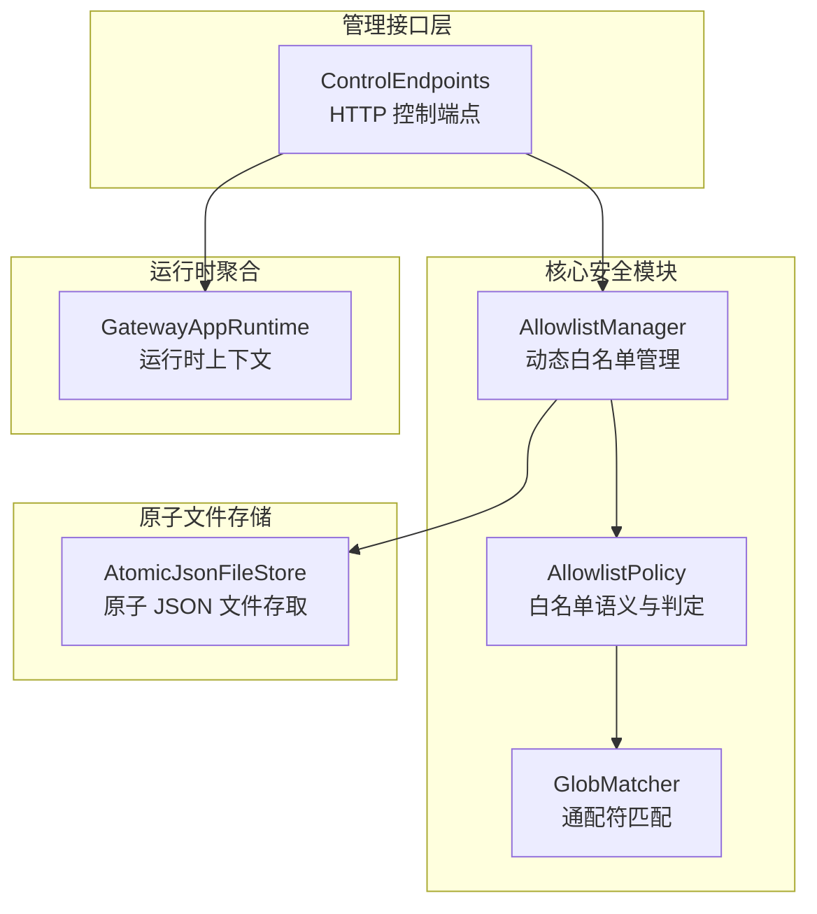
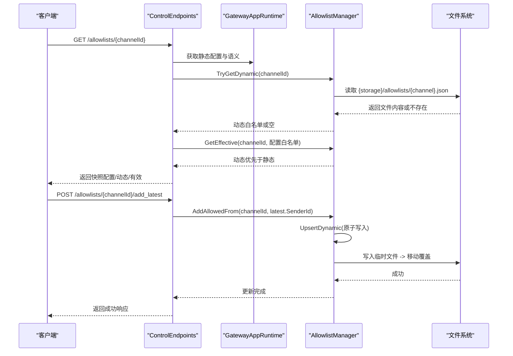
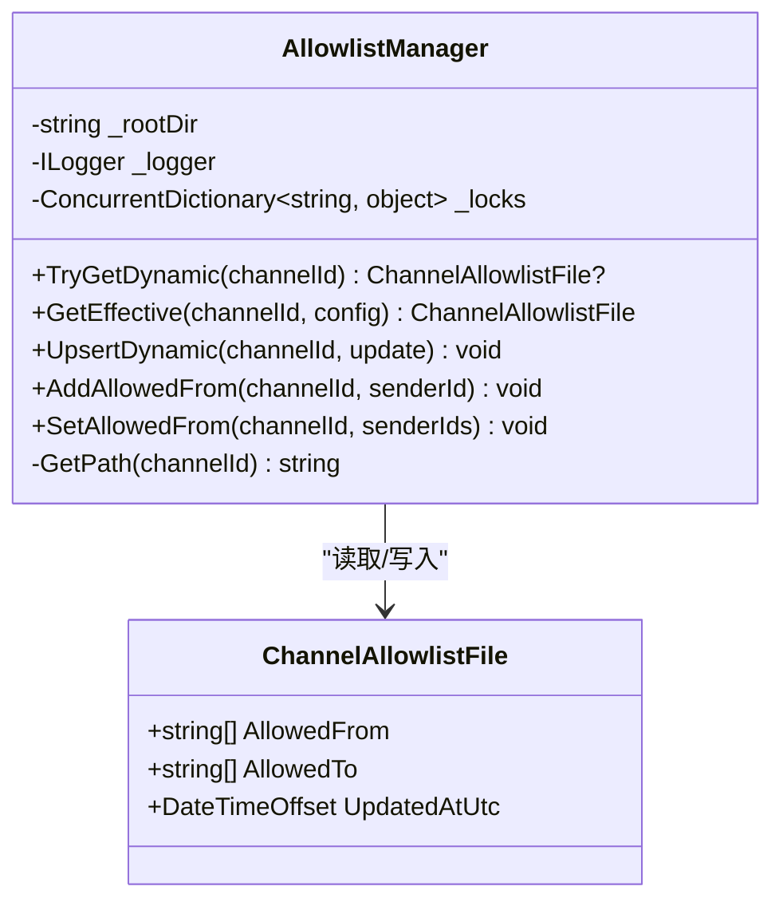
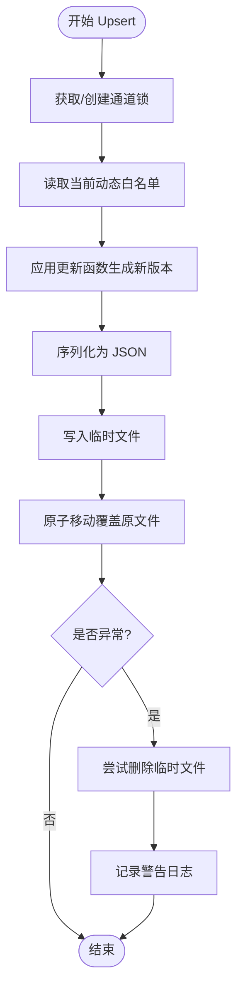
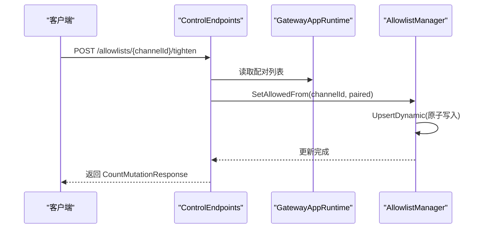
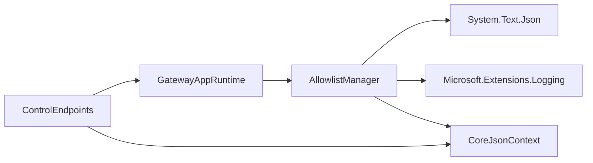
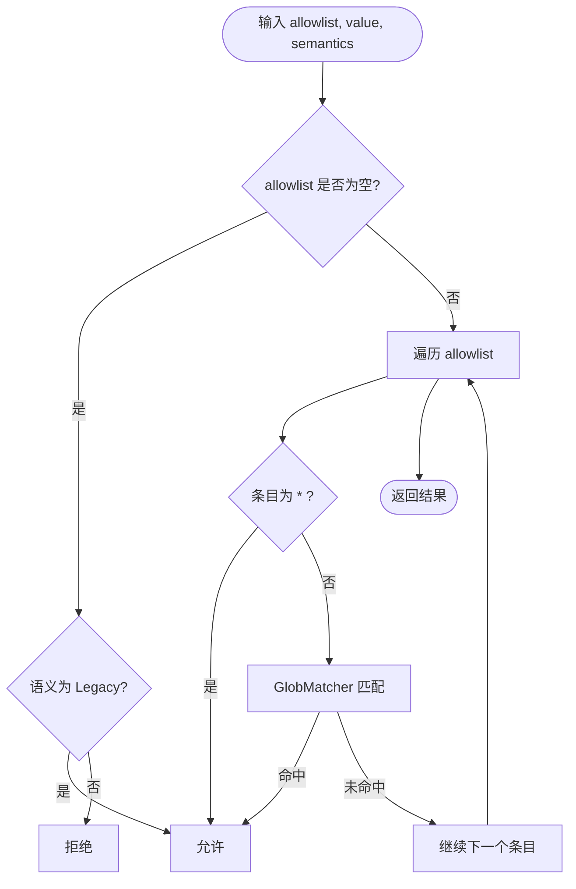

# 白名单管理

<cite>
**本文引用的文件**
- [AllowlistManager.cs](file://src/OpenClaw.Core/Security/AllowlistManager.cs)
- [AllowlistPolicy.cs](file://src/OpenClaw.Core/Security/AllowlistPolicy.cs)
- [GlobMatcher.cs](file://src/OpenClaw.Core/Security/GlobMatcher.cs)
- [AdminApiModels.cs](file://src/OpenClaw.Core/Models/AdminApiModels.cs)
- [ControlEndpoints.cs](file://src/OpenClaw.Gateway/Endpoints/ControlEndpoints.cs)
- [AtomicJsonFileStore.cs](file://src/OpenClaw.Gateway/AtomicJsonFileStore.cs)
- [GatewayAppRuntime.cs](file://src/OpenClaw.Gateway/Composition/GatewayAppRuntime.cs)
- [AllowlistManagerTests.cs](file://src/OpenClaw.Tests/AllowlistManagerTests.cs)
- [AllowlistPolicyTests.cs](file://src/OpenClaw.Tests/AllowlistPolicyTests.cs)
</cite>

## 目录
1. [简介](#简介)
2. [项目结构](#项目结构)
3. [核心组件](#核心组件)
4. [架构总览](#架构总览)
5. [详细组件分析](#详细组件分析)
6. [依赖关系分析](#依赖关系分析)
7. [性能考量](#性能考量)
8. [故障排除指南](#故障排除指南)
9. [结论](#结论)
10. [附录](#附录)

## 简介
本技术文档围绕白名单管理系统展开，重点阐述 AllowlistManager 的实现原理与工作机制，涵盖以下主题：
- 动态白名单文件的持久化机制与原子写入策略
- 并发安全控制与文件锁定策略
- 静态配置白名单与动态白名单的优先级规则
- per-channel 白名单的存储结构与数据模型
- 白名单配置示例、管理操作接口与故障排除指南

## 项目结构
白名单管理功能主要分布在以下模块：
- 核心安全模块：AllowlistManager、AllowlistPolicy、GlobMatcher
- 管理接口层：ControlEndpoints（HTTP 控制端点）
- 原子文件存储：AtomicJsonFileStore（通用原子写入工具）
- 运行时聚合：GatewayAppRuntime（运行时上下文聚合）

**图表来源**
- [AllowlistManager.cs:19-125](file://src/OpenClaw.Core/Security/AllowlistManager.cs#L19-L125)
- [AllowlistPolicy.cs:9-41](file://src/OpenClaw.Core/Security/AllowlistPolicy.cs#L9-L41)
- [GlobMatcher.cs:3-87](file://src/OpenClaw.Core/Security/GlobMatcher.cs#L3-L87)
- [ControlEndpoints.cs:75-146](file://src/OpenClaw.Gateway/Endpoints/ControlEndpoints.cs#L75-L146)
- [AtomicJsonFileStore.cs:7-89](file://src/OpenClaw.Gateway/AtomicJsonFileStore.cs#L7-L89)
- [GatewayAppRuntime.cs:21-63](file://src/OpenClaw.Gateway/Composition/GatewayAppRuntime.cs#L21-L63)

**章节来源**
- [AllowlistManager.cs:19-125](file://src/OpenClaw.Core/Security/AllowlistManager.cs#L19-L125)
- [ControlEndpoints.cs:75-146](file://src/OpenClaw.Gateway/Endpoints/ControlEndpoints.cs#L75-L146)
- [GatewayAppRuntime.cs:21-63](file://src/OpenClaw.Gateway/Composition/GatewayAppRuntime.cs#L21-L63)

## 核心组件
- AllowlistManager：负责 per-channel 白名单的读取、合并、更新与持久化，采用原子写入与通道级锁保证并发安全。
- AllowlistPolicy：定义白名单语义（Legacy/Strict），提供基于通配符的允许判定逻辑。
- GlobMatcher：提供高性能的简单通配符匹配算法，支持 '*' 作为“任意序列”匹配。
- ControlEndpoints：提供白名单查询与变更的 HTTP 接口，如获取快照、添加最新发送者、收紧白名单等。
- AtomicJsonFileStore：提供通用的原子 JSON 文件读写能力，用于其他组件的持久化需求。

**章节来源**
- [AllowlistManager.cs:8-125](file://src/OpenClaw.Core/Security/AllowlistManager.cs#L8-L125)
- [AllowlistPolicy.cs:3-41](file://src/OpenClaw.Core/Security/AllowlistPolicy.cs#L3-L41)
- [GlobMatcher.cs:3-87](file://src/OpenClaw.Core/Security/GlobMatcher.cs#L3-L87)
- [ControlEndpoints.cs:75-146](file://src/OpenClaw.Gateway/Endpoints/ControlEndpoints.cs#L75-L146)
- [AtomicJsonFileStore.cs:7-89](file://src/OpenClaw.Gateway/AtomicJsonFileStore.cs#L7-L89)

## 架构总览
下图展示了白名单管理在系统中的位置与交互关系：

**图表来源**
- [ControlEndpoints.cs:75-146](file://src/OpenClaw.Gateway/Endpoints/ControlEndpoints.cs#L75-L146)
- [AllowlistManager.cs:32-125](file://src/OpenClaw.Core/Security/AllowlistManager.cs#L32-L125)
- [GatewayAppRuntime.cs:32-33](file://src/OpenClaw.Gateway/Composition/GatewayAppRuntime.cs#L32-L33)

## 详细组件分析

### AllowlistManager 实现原理
- 存储路径与命名规范
  - 每个频道的动态白名单文件保存在 {StoragePath}/allowlists/{channel}.json。
  - 通道 ID 经过路径安全处理，移除非法字符并去除前导点号；若为空则回退为 unknown.json。
- 读取与合并策略
  - TryGetDynamic(channelId) 读取对应 JSON 文件，反序列化为 ChannelAllowlistFile。
  - GetEffective(channelId, configAllowlist) 将动态白名单与静态配置合并：动态优先。
- 并发安全与原子写入
  - 使用 ConcurrentDictionary<string, object> 为每个 channelId 提供独立锁对象，避免跨频道干扰。
  - UpsertDynamic(updateFn) 在临界区内执行更新函数，生成新版本并写入临时文件，再原子移动覆盖，确保写入过程不可中断。
- 字段更新操作
  - AddAllowedFrom：向 AllowedFrom 添加唯一且非空白的 senderId。
  - SetAllowedFrom：设置 AllowedFrom 列表，进行去空白、去重与排序处理。

**图表来源**
- [AllowlistManager.cs:19-125](file://src/OpenClaw.Core/Security/AllowlistManager.cs#L19-L125)
- [AllowlistManager.cs:8-13](file://src/OpenClaw.Core/Security/AllowlistManager.cs#L8-L13)

**章节来源**
- [AllowlistManager.cs:19-125](file://src/OpenClaw.Core/Security/AllowlistManager.cs#L19-L125)

### 动态白名单文件持久化机制与原子写入
- 临时文件策略
  - 写入前先序列化到临时文件（带随机后缀），成功后再用 File.Move 原子替换目标文件，避免部分写入导致的数据损坏。
- 错误处理与清理
  - 写入失败时尝试删除临时文件，记录警告日志，保证后续可重试。
- 适用范围
  - 该策略由 AllowlistManager 的 UpsertDynamic 直接使用，也与通用的 AtomicJsonFileStore 设计理念一致。

**图表来源**
- [AllowlistManager.cs:53-84](file://src/OpenClaw.Core/Security/AllowlistManager.cs#L53-L84)
- [AtomicJsonFileStore.cs:34-59](file://src/OpenClaw.Gateway/AtomicJsonFileStore.cs#L34-L59)

**章节来源**
- [AllowlistManager.cs:53-84](file://src/OpenClaw.Core/Security/AllowlistManager.cs#L53-L84)
- [AtomicJsonFileStore.cs:34-59](file://src/OpenClaw.Gateway/AtomicJsonFileStore.cs#L34-L59)

### 并发安全控制与文件锁定策略
- 通道级锁
  - 通过 _locks.GetOrAdd(channelId, _) 为每个 channelId 提供独立的锁对象，避免多线程同时修改同一频道白名单造成竞态。
- 互斥更新
  - 在 UpsertDynamic 内部使用 lock(gate)，确保同一频道的读取、计算与写入为原子操作。
- 共享资源
  - 日志器与根目录在构造时初始化，避免运行期重复分配。

**章节来源**
- [AllowlistManager.cs:23-29](file://src/OpenClaw.Core/Security/AllowlistManager.cs#L23-L29)
- [AllowlistManager.cs:55-83](file://src/OpenClaw.Core/Security/AllowlistManager.cs#L55-L83)

### 静态配置白名单与动态白名单的优先级规则
- 合并策略
  - GetEffective(channelId, configAllowlist) 优先返回动态白名单；若不存在，则回退到静态配置白名单。
- 语义影响
  - AllowlistSemantics（Legacy/Strict）决定空白名单的行为：Strict 下空列表拒绝所有；Legacy 下空列表允许所有（历史兼容）。
- 测试验证
  - 单元测试验证了动态白名单覆盖静态配置的行为与路径安全处理。

**章节来源**
- [AllowlistManager.cs:50-51](file://src/OpenClaw.Core/Security/AllowlistManager.cs#L50-L51)
- [AllowlistPolicy.cs:11-40](file://src/OpenClaw.Core/Security/AllowlistPolicy.cs#L11-L40)
- [AllowlistManagerTests.cs:10-28](file://src/OpenClaw.Tests/AllowlistManagerTests.cs#L10-L28)

### per-channel 白名单存储结构与数据模型
- ChannelAllowlistFile 字段
  - AllowedFrom：允许的发送者标识数组
  - AllowedTo：允许的目标标识数组
  - UpdatedAtUtc：文件最后更新时间戳
- 存储位置
  - {StoragePath}/allowlists/{channel}.json，其中 {channel} 经过路径安全处理，非法字符被过滤，前导点号被移除，空值回退为 unknown.json。

**章节来源**
- [AllowlistManager.cs:8-13](file://src/OpenClaw.Core/Security/AllowlistManager.cs#L8-L13)
- [AllowlistManager.cs:117-124](file://src/OpenClaw.Core/Security/AllowlistManager.cs#L117-L124)

### 白名单管理操作接口
- 查询接口
  - GET /allowlists/{channelId}：返回配置白名单、动态白名单与有效白名单（动态优先）。
- 变更接口
  - POST /allowlists/{channelId}/add_latest：将最近发送者加入 AllowedFrom。
  - POST /allowlists/{channelId}/tighten：将已配对的发送者集合设置为 AllowedFrom。
- 响应模型
  - AllowlistSnapshotResponse：包含 ChannelId、Semantics、Config、Dynamic、Effective。

**图表来源**
- [ControlEndpoints.cs:116-146](file://src/OpenClaw.Gateway/Endpoints/ControlEndpoints.cs#L116-L146)
- [AdminApiModels.cs:102-116](file://src/OpenClaw.Core/Models/AdminApiModels.cs#L102-L116)

**章节来源**
- [ControlEndpoints.cs:75-146](file://src/OpenClaw.Gateway/Endpoints/ControlEndpoints.cs#L75-L146)
- [AdminApiModels.cs:102-116](file://src/OpenClaw.Core/Models/AdminApiModels.cs#L102-L116)

### 白名单配置示例与使用场景
- 配置示例（静态）
  - 在频道配置中设置 AllowlistSemantics 为 strict 或 legacy，以及静态 AllowedFrom/AllowedTo 数组。
- 使用场景
  - 严格模式：仅允许明确列出的发送者或匹配通配符的发送者。
  - 放宽模式：历史兼容，空白名单默认允许所有。
  - 运维场景：通过管理端点快速收紧白名单，仅保留已配对的可信发送者。

**章节来源**
- [AllowlistPolicy.cs:11-16](file://src/OpenClaw.Core/Security/AllowlistPolicy.cs#L11-L16)
- [AllowlistPolicyTests.cs:8-31](file://src/OpenClaw.Tests/AllowlistPolicyTests.cs#L8-L31)

## 依赖关系分析
- AllowlistManager 依赖
  - System.Text.Json：序列化/反序列化
  - Microsoft.Extensions.Logging：日志记录
  - CoreJsonContext：类型上下文（用于 JSON 序列化）
- ControlEndpoints 依赖
  - GatewayAppRuntime：访问 Allowlists 与 AllowlistSemantics
  - CoreJsonContext：序列化响应模型
- 运行时聚合
  - GatewayAppRuntime 聚合 Allowlists 与 AllowlistSemantics，供端点与业务逻辑使用。

**图表来源**
- [ControlEndpoints.cs:1-20](file://src/OpenClaw.Gateway/Endpoints/ControlEndpoints.cs#L1-L20)
- [GatewayAppRuntime.cs:32-33](file://src/OpenClaw.Gateway/Composition/GatewayAppRuntime.cs#L32-L33)
- [AllowlistManager.cs:1-5](file://src/OpenClaw.Core/Security/AllowlistManager.cs#L1-L5)

**章节来源**
- [ControlEndpoints.cs:1-20](file://src/OpenClaw.Gateway/Endpoints/ControlEndpoints.cs#L1-L20)
- [GatewayAppRuntime.cs:32-33](file://src/OpenClaw.Gateway/Composition/GatewayAppRuntime.cs#L32-L33)
- [AllowlistManager.cs:1-5](file://src/OpenClaw.Core/Security/AllowlistManager.cs#L1-L5)

## 性能考量
- 读取路径
  - TryGetDynamic 仅在文件存在时才读取，避免不必要的 IO。
- 匹配算法
  - GlobMatcher 使用 Span-based 匹配，避免 Split('*') 分割带来的内存分配，适合高频调用。
- 并发优化
  - 通道级锁粒度细，减少锁竞争；原子写入避免频繁刷新导致的锁持有时间过长。
- 序列化开销
  - 仅在 UpsertDynamic 时进行序列化与磁盘写入，其余操作为内存数组拼接与去重。

**章节来源**
- [GlobMatcher.cs:21-63](file://src/OpenClaw.Core/Security/GlobMatcher.cs#L21-L63)
- [AllowlistManager.cs:53-84](file://src/OpenClaw.Core/Security/AllowlistManager.cs#L53-L84)

## 故障排除指南
- 动态文件读取失败
  - 现象：TryGetDynamic 返回空，日志出现警告。
  - 排查：检查文件权限、磁盘空间、JSON 格式是否正确。
- 原子写入失败
  - 现象：UpsertDynamic 记录警告日志，临时文件残留。
  - 排查：确认目标目录可写、磁盘空间充足、无并发进程占用。
- 路径安全问题
  - 现象：动态白名单文件名异常（如以点开头）。
  - 排查：确认 channelId 是否包含非法字符；系统会自动清理并回退到 unknown.json。
- 权限不足
  - 现象：管理端点返回 401/403。
  - 排查：确认操作者身份与 CSRF 校验通过，endpointScope 为 admin.control。

**章节来源**
- [AllowlistManager.cs:43-47](file://src/OpenClaw.Core/Security/AllowlistManager.cs#L43-L47)
- [AllowlistManager.cs:70-82](file://src/OpenClaw.Core/Security/AllowlistManager.cs#L70-L82)
- [AllowlistManagerTests.cs:31-41](file://src/OpenClaw.Tests/AllowlistManagerTests.cs#L31-L41)
- [ControlEndpoints.cs:97-100](file://src/OpenClaw.Gateway/Endpoints/ControlEndpoints.cs#L97-L100)

## 结论
AllowlistManager 通过 per-channel 的动态白名单与严格的原子写入策略，实现了高可用、可审计的白名单管理能力。结合 AllowlistPolicy 的语义控制与 GlobMatcher 的高效匹配，系统在保证安全性的同时兼顾了性能与易用性。管理端点提供了直观的操作接口，便于运维人员快速调整白名单策略。

## 附录

### ChannelAllowlistFile 数据模型字段说明
- AllowedFrom：允许的发送者标识数组
- AllowedTo：允许的目标标识数组
- UpdatedAtUtc：文件最后更新时间戳

**章节来源**
- [AllowlistManager.cs:8-13](file://src/OpenClaw.Core/Security/AllowlistManager.cs#L8-L13)

### 白名单判定流程（Strict/Legacy）

**图表来源**
- [AllowlistPolicy.cs:18-40](file://src/OpenClaw.Core/Security/AllowlistPolicy.cs#L18-L40)
- [GlobMatcher.cs:68-86](file://src/OpenClaw.Core/Security/GlobMatcher.cs#L68-L86)