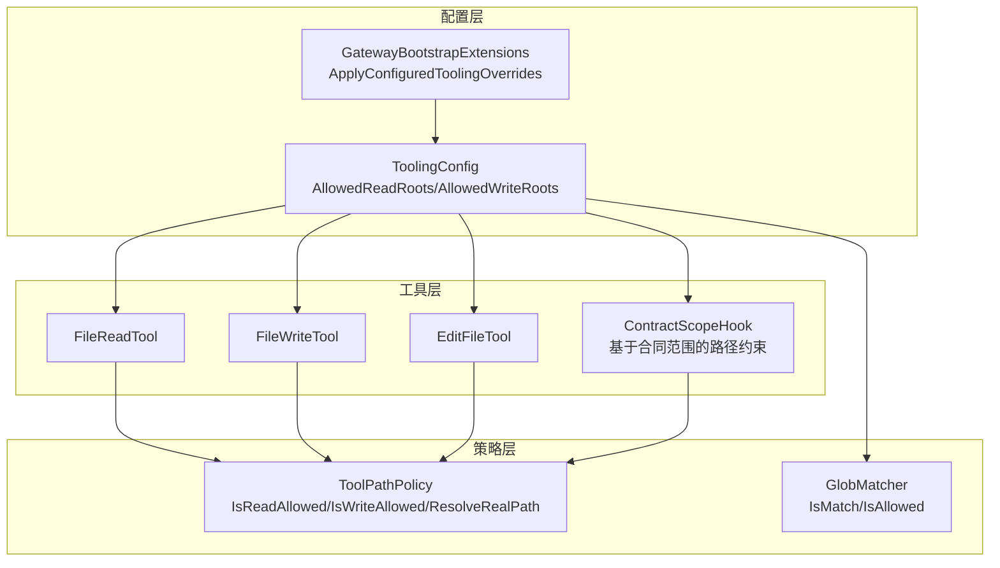
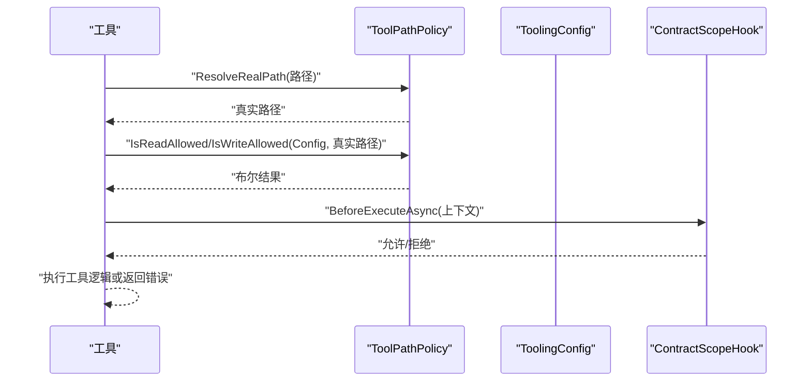
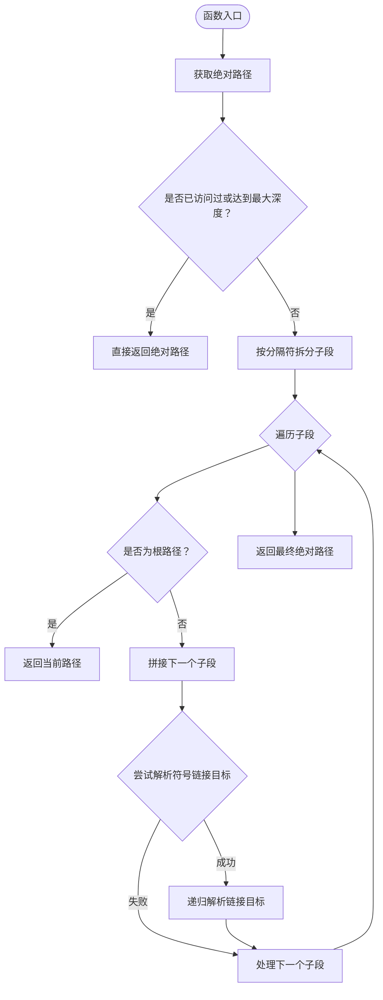
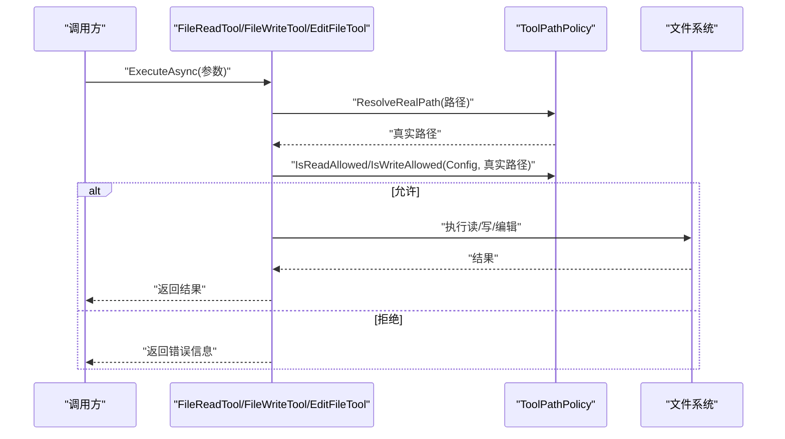
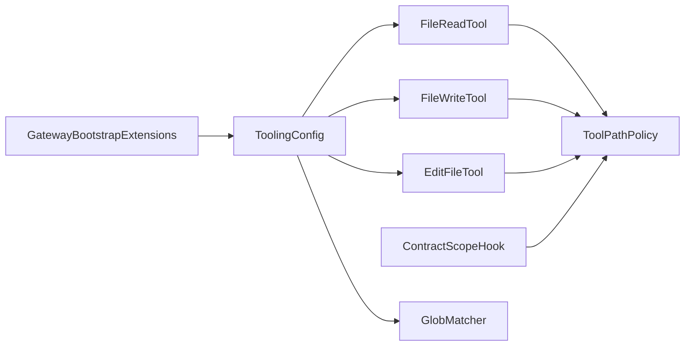

# 路径策略

<cite>
**本文引用的文件**
- [ToolPathPolicy.cs](file://src/OpenClaw.Agent/Tools/ToolPathPolicy.cs)
- [ToolPathPolicy.cs](file://src/OpenClaw.Core/Security/ToolPathPolicy.cs)
- [ToolPathPolicyTests.cs](file://src/OpenClaw.Tests/ToolPathPolicyTests.cs)
- [GatewayConfig.cs](file://src/OpenClaw.Core/Models/GatewayConfig.cs)
- [FileReadTool.cs](file://src/OpenClaw.Agent/Tools/FileReadTool.cs)
- [FileWriteTool.cs](file://src/OpenClaw.Agent/Tools/FileWriteTool.cs)
- [EditFileTool.cs](file://src/OpenClaw.Agent/Tools/EditFileTool.cs)
- [ContractScopeHook.cs](file://src/OpenClaw.Agent/ContractScopeHook.cs)
- [GatewayBootstrapExtensions.cs](file://src/OpenClaw.Gateway/Bootstrap/GatewayBootstrapExtensions.cs)
- [GlobMatcher.cs](file://src/OpenClaw.Core/Security/GlobMatcher.cs)
</cite>

## 目录
1. [简介](#简介)
2. [项目结构](#项目结构)
3. [核心组件](#核心组件)
4. [架构总览](#架构总览)
5. [详细组件分析](#详细组件分析)
6. [依赖关系分析](#依赖关系分析)
7. [性能考量](#性能考量)
8. [故障排除指南](#故障排除指南)
9. [结论](#结论)
10. [附录](#附录)

## 简介
本文件为工具路径策略系统的技术文档，聚焦于 ToolPathPolicy 的设计目标与实现机制，涵盖路径验证规则、安全边界检查与访问控制策略。文档将解释白名单、黑名单与通配符匹配的配置方法，提供路径策略配置示例、常见使用场景与安全最佳实践，并包含路径解析算法说明、性能考虑与故障排除指南。

## 项目结构
路径策略系统主要由以下部分组成：
- 核心策略实现：位于 Agent 工具层的 ToolPathPolicy，负责路径解析与访问控制判断。
- 配置模型：ToolingConfig 提供 AllowedReadRoots、AllowedWriteRoots 等根目录白名单配置。
- 工具集成：多个文件相关工具在执行前调用 ToolPathPolicy 进行访问控制校验。
- 合同级路径约束：ContractScopeHook 基于合同范围对工具路径进行二次限制。
- 全局配置注入：GatewayBootstrapExtensions 支持从配置节覆盖 Tooling 根目录设置。
- 通配符匹配：GlobMatcher 提供简单通配符匹配能力，用于命令与路径的允许/拒绝判定。

图表来源
- [GatewayConfig.cs:412-457](file://src/OpenClaw.Core/Models/GatewayConfig.cs#L412-L457)
- [GatewayBootstrapExtensions.cs:352-375](file://src/OpenClaw.Gateway/Bootstrap/GatewayBootstrapExtensions.cs#L352-L375)
- [ToolPathPolicy.cs:5-131](file://src/OpenClaw.Agent/Tools/ToolPathPolicy.cs#L5-L131)
- [GlobMatcher.cs:3-86](file://src/OpenClaw.Core/Security/GlobMatcher.cs#L3-L86)
- [FileReadTool.cs:19-31](file://src/OpenClaw.Agent/Tools/FileReadTool.cs#L19-L31)
- [FileWriteTool.cs:19-43](file://src/OpenClaw.Agent/Tools/FileWriteTool.cs#L19-L43)
- [EditFileTool.cs:19-51](file://src/OpenClaw.Agent/Tools/EditFileTool.cs#L19-L51)
- [ContractScopeHook.cs:56-107](file://src/OpenClaw.Agent/ContractScopeHook.cs#L56-L107)

章节来源
- [GatewayConfig.cs:412-457](file://src/OpenClaw.Core/Models/GatewayConfig.cs#L412-L457)
- [GatewayBootstrapExtensions.cs:352-375](file://src/OpenClaw.Gateway/Bootstrap/GatewayBootstrapExtensions.cs#L352-L375)
- [ToolPathPolicy.cs:5-131](file://src/OpenClaw.Agent/Tools/ToolPathPolicy.cs#L5-L131)
- [GlobMatcher.cs:3-86](file://src/OpenClaw.Core/Security/GlobMatcher.cs#L3-L86)
- [FileReadTool.cs:19-31](file://src/OpenClaw.Agent/Tools/FileReadTool.cs#L19-L31)
- [FileWriteTool.cs:19-43](file://src/OpenClaw.Agent/Tools/FileWriteTool.cs#L19-L43)
- [EditFileTool.cs:19-51](file://src/OpenClaw.Agent/Tools/EditFileTool.cs#L19-L51)
- [ContractScopeHook.cs:56-107](file://src/OpenClaw.Agent/ContractScopeHook.cs#L56-L107)

## 核心组件
- ToolPathPolicy（Agent 实现）
  - 提供 IsReadAllowed、IsWriteAllowed 判断入口，内部通过 ResolveRealPath 获取真实路径并进行白名单匹配。
  - 解析真实路径时遵循符号链接，避免逃逸到允许根目录之外。
  - 支持通配符“*”作为全量放行标记；空数组表示拒绝所有路径。
- ToolingConfig（配置模型）
  - AllowedReadRoots、AllowedWriteRoots：分别定义可读/可写路径的白名单根集合。
  - ReadOnlyMode：只读模式下禁用写操作。
- 工具集成点
  - FileReadTool、FileWriteTool、EditFileTool 在执行前调用 ToolPathPolicy 进行访问控制。
- 合同级路径约束
  - ContractScopeHook 对特定工具在合同范围内进行路径限制，必要时要求安全解析。
- 全局配置覆盖
  - GatewayBootstrapExtensions 支持从配置节动态覆盖 Tooling 的根目录设置。

章节来源
- [ToolPathPolicy.cs:9-35](file://src/OpenClaw.Agent/Tools/ToolPathPolicy.cs#L9-L35)
- [GatewayConfig.cs:426-432](file://src/OpenClaw.Core/Models/GatewayConfig.cs#L426-L432)
- [FileReadTool.cs:25-28](file://src/OpenClaw.Agent/Tools/FileReadTool.cs#L25-L28)
- [FileWriteTool.cs:34-37](file://src/OpenClaw.Agent/Tools/FileWriteTool.cs#L34-L37)
- [EditFileTool.cs:43-46](file://src/OpenClaw.Agent/Tools/EditFileTool.cs#L43-L46)
- [ContractScopeHook.cs:56-107](file://src/OpenClaw.Agent/ContractScopeHook.cs#L56-L107)
- [GatewayBootstrapExtensions.cs:352-375](file://src/OpenClaw.Gateway/Bootstrap/GatewayBootstrapExtensions.cs#L352-L375)

## 架构总览
路径策略在系统中的工作流如下：
- 工具执行前，先解析参数中的路径并通过 ToolPathPolicy 获取真实路径。
- 使用 ToolingConfig 中的 AllowedReadRoots 或 AllowedWriteRoots 进行白名单匹配。
- 若匹配失败，返回错误信息；若成功，则继续执行工具逻辑。
- 对于合同范围内的工具，ContractScopeHook 可进一步施加路径限制与解析要求。

图表来源
- [ToolPathPolicy.cs:23-35](file://src/OpenClaw.Agent/Tools/ToolPathPolicy.cs#L23-L35)
- [FileReadTool.cs:25-28](file://src/OpenClaw.Agent/Tools/FileReadTool.cs#L25-L28)
- [FileWriteTool.cs:34-37](file://src/OpenClaw.Agent/Tools/FileWriteTool.cs#L34-L37)
- [EditFileTool.cs:43-46](file://src/OpenClaw.Agent/Tools/EditFileTool.cs#L43-L46)
- [ContractScopeHook.cs:37-110](file://src/OpenClaw.Agent/ContractScopeHook.cs#L37-L110)

## 详细组件分析

### 组件一：ToolPathPolicy（路径解析与访问控制）
- 设计目标
  - 保证路径解析的安全性，防止通过符号链接逃逸到允许根目录之外。
  - 提供简洁高效的白名单匹配接口，支持通配符“*”与空数组的特殊语义。
- 关键算法
  - ResolveRealPath：递归解析符号链接，限制最大深度，避免循环与无限递归。
  - IsPathAllowed：对路径进行白名单匹配，支持“*”放行与大小写敏感比较。
- 安全边界
  - 严格区分大小写比较（Windows 忽略大小写）。
  - 对不存在的目标路径，优先解析已存在的祖先目录，再拼接剩余段，确保正确性。
- 性能特征
  - 单次解析时间复杂度近似 O(N)，N 为路径段数量；受符号链接链长度影响。
  - 最大符号链接深度限制为常数，避免栈溢出与性能退化。

图表来源
- [ToolPathPolicy.cs:42-73](file://src/OpenClaw.Agent/Tools/ToolPathPolicy.cs#L42-L73)
- [ToolPathPolicy.cs:79-110](file://src/OpenClaw.Agent/Tools/ToolPathPolicy.cs#L79-L110)

章节来源
- [ToolPathPolicy.cs:5-131](file://src/OpenClaw.Agent/Tools/ToolPathPolicy.cs#L5-L131)
- [ToolPathPolicyTests.cs:10-185](file://src/OpenClaw.Tests/ToolPathPolicyTests.cs#L10-L185)

### 组件二：ToolingConfig（路径策略配置）
- 配置项
  - AllowedReadRoots：可读路径白名单根集合。
  - AllowedWriteRoots：可写路径白名单根集合。
  - ReadOnlyMode：启用后禁止写操作。
  - ForbiddenPathGlobs：路径黑名单（拒绝优先于允许）。
  - AllowedShellCommandGlobs：允许的 Shell 命令通配符集合。
- 配置注入
  - GatewayBootstrapExtensions 支持从配置节读取数组并覆盖 Tooling 的根目录设置。

章节来源
- [GatewayConfig.cs:412-457](file://src/OpenClaw.Core/Models/GatewayConfig.cs#L412-L457)
- [GatewayBootstrapExtensions.cs:352-375](file://src/OpenClaw.Gateway/Bootstrap/GatewayBootstrapExtensions.cs#L352-L375)

### 组件三：工具集成（FileReadTool、FileWriteTool、EditFileTool）
- 执行流程
  - 解析参数路径，调用 ToolPathPolicy.ResolveRealPath 获取真实路径。
  - 使用 ToolPathPolicy.IsReadAllowed 或 IsWriteAllowed 进行访问控制。
  - 若允许，继续执行工具逻辑；否则返回错误信息。
- 写入保护
  - 写入采用临时文件+原子移动的方式，降低数据损坏风险。

图表来源
- [FileReadTool.cs:19-64](file://src/OpenClaw.Agent/Tools/FileReadTool.cs#L19-L64)
- [FileWriteTool.cs:19-56](file://src/OpenClaw.Agent/Tools/FileWriteTool.cs#L19-L56)
- [EditFileTool.cs:19-82](file://src/OpenClaw.Agent/Tools/EditFileTool.cs#L19-L82)
- [ToolPathPolicy.cs:9-13](file://src/OpenClaw.Agent/Tools/ToolPathPolicy.cs#L9-L13)

章节来源
- [FileReadTool.cs:19-64](file://src/OpenClaw.Agent/Tools/FileReadTool.cs#L19-L64)
- [FileWriteTool.cs:19-56](file://src/OpenClaw.Agent/Tools/FileWriteTool.cs#L19-L56)
- [EditFileTool.cs:19-82](file://src/OpenClaw.Agent/Tools/EditFileTool.cs#L19-L82)

### 组件四：合同级路径约束（ContractScopeHook）
- 功能概述
  - 基于合同范围对工具路径进行二次限制，未在范围内的文件系统工具默认拒绝。
  - 对需要安全解析的工具，若无法安全解析路径则拒绝执行。
- 关键逻辑
  - 查找匹配的 ScopedCapability，检查 AllowedPaths 是否包含目标路径。
  - 对 Windows 与非 Windows 平台采用大小写敏感/不敏感比较。

章节来源
- [ContractScopeHook.cs:56-107](file://src/OpenClaw.Agent/ContractScopeHook.cs#L56-L107)
- [ContractScopeHook.cs:134-156](file://src/OpenClaw.Agent/ContractScopeHook.cs#L134-L156)

### 组件五：通配符匹配（GlobMatcher）
- 能力概述
  - 支持“*”通配符的简单匹配，允许/拒绝评估时拒绝优先。
  - 提供 IsAllowed 统一接口，便于 Shell 命令与路径的黑白名单控制。
- 性能优化
  - 使用 Span 避免 Split 分割带来的内存分配，提升匹配效率。

章节来源
- [GlobMatcher.cs:3-86](file://src/OpenClaw.Core/Security/GlobMatcher.cs#L3-L86)

## 依赖关系分析
- 组件耦合
  - 工具层依赖 ToolPathPolicy 进行路径解析与访问控制。
  - ContractScopeHook 依赖 ToolPathPolicy 的路径解析能力与大小写比较策略。
  - 配置层通过 GatewayBootstrapExtensions 注入 ToolingConfig，间接影响策略判断。
- 外部依赖
  - 文件系统 API：符号链接解析、路径比较、大小写敏感性。
  - JSON 序列化：AllowlistManager 动态持久化。

图表来源
- [FileReadTool.cs:19-31](file://src/OpenClaw.Agent/Tools/FileReadTool.cs#L19-L31)
- [FileWriteTool.cs:19-43](file://src/OpenClaw.Agent/Tools/FileWriteTool.cs#L19-L43)
- [EditFileTool.cs:19-51](file://src/OpenClaw.Agent/Tools/EditFileTool.cs#L19-L51)
- [ToolPathPolicy.cs:9-13](file://src/OpenClaw.Agent/Tools/ToolPathPolicy.cs#L9-L13)
- [ContractScopeHook.cs:56-107](file://src/OpenClaw.Agent/ContractScopeHook.cs#L56-L107)
- [GatewayBootstrapExtensions.cs:352-375](file://src/OpenClaw.Gateway/Bootstrap/GatewayBootstrapExtensions.cs#L352-L375)
- [GlobMatcher.cs:68-86](file://src/OpenClaw.Core/Security/GlobMatcher.cs#L68-L86)

章节来源
- [FileReadTool.cs:19-31](file://src/OpenClaw.Agent/Tools/FileReadTool.cs#L19-L31)
- [FileWriteTool.cs:19-43](file://src/OpenClaw.Agent/Tools/FileWriteTool.cs#L19-L43)
- [EditFileTool.cs:19-51](file://src/OpenClaw.Agent/Tools/EditFileTool.cs#L19-L51)
- [ToolPathPolicy.cs:9-13](file://src/OpenClaw.Agent/Tools/ToolPathPolicy.cs#L9-L13)
- [ContractScopeHook.cs:56-107](file://src/OpenClaw.Agent/ContractScopeHook.cs#L56-L107)
- [GatewayBootstrapExtensions.cs:352-375](file://src/OpenClaw.Gateway/Bootstrap/GatewayBootstrapExtensions.cs#L352-L375)
- [GlobMatcher.cs:68-86](file://src/OpenClaw.Core/Security/GlobMatcher.cs#L68-L86)

## 性能考量
- 路径解析
  - 符号链接解析具有最大深度限制，避免无限递归与性能退化。
  - 对不存在路径的处理仅解析已存在祖先，减少不必要的 IO。
- 匹配算法
  - GlobMatcher 使用 Span-based 匹配，避免中间数组分配，适合高频调用场景。
- 工具执行
  - 读取工具采用顺序读取与行数限制，防止上下文溢出。
  - 写入工具采用临时文件+原子移动，降低并发写入冲突风险。

## 故障排除指南
- 符号链接逃逸问题
  - 现象：通过符号链接指向允许根目录外的文件仍被允许。
  - 排查：确认 ToolPathPolicy.ResolveRealPath 是否正确解析到真实目标路径。
  - 参考测试：符号链接逃逸应被拒绝。
- 循环符号链接
  - 现象：路径解析卡死或返回异常。
  - 排查：检查符号链接是否存在自引用或环路，确认最大深度限制生效。
- Windows 与 Linux 大小写差异
  - 现象：路径比较在不同平台表现不一致。
  - 排查：确认比较策略在 Windows 下忽略大小写，在类 Unix 下区分大小写。
- 合同范围路径解析失败
  - 现象：某些工具因无法安全解析路径而被拒绝。
  - 排查：检查 ScopedCapability 的 AllowedPaths 是否覆盖目标路径，或工具是否需要安全解析。

章节来源
- [ToolPathPolicyTests.cs:10-185](file://src/OpenClaw.Tests/ToolPathPolicyTests.cs#L10-L185)
- [ToolPathPolicy.cs:112-130](file://src/OpenClaw.Agent/Tools/ToolPathPolicy.cs#L112-L130)
- [ContractScopeHook.cs:99-107](file://src/OpenClaw.Agent/ContractScopeHook.cs#L99-L107)

## 结论
ToolPathPolicy 通过严谨的符号链接解析与白名单匹配，构建了安全可靠的路径访问控制体系。结合合同级路径约束与通配符匹配，系统在保障功能灵活性的同时，有效防范路径逃逸与越权访问风险。建议在生产环境中合理配置 AllowedReadRoots/AllowedWriteRoots，并配合 ReadOnlyMode 与合同范围策略，形成多层次的安全边界。

## 附录

### 配置示例与最佳实践
- 白名单配置
  - 可读白名单：仅允许特定目录及其子目录读取。
  - 可写白名单：仅允许特定目录写入，写入工具采用临时文件+原子移动。
- 黑名单配置
  - 使用 ForbiddenPathGlobs 对危险路径进行拒绝，拒绝优先于允许。
- 通配符匹配
  - AllowedShellCommandGlobs 支持“*”放行全部命令，谨慎使用。
- 合同范围
  - 对文件系统相关工具（如 shell、code_exec、git、process、file_*、edit_file、apply_patch）启用合同范围限制。
  - 对需要安全解析的工具，确保路径可被安全解析，否则拒绝执行。

章节来源
- [GatewayConfig.cs:423-427](file://src/OpenClaw.Core/Models/GatewayConfig.cs#L423-L427)
- [ContractScopeHook.cs:56-107](file://src/OpenClaw.Agent/ContractScopeHook.cs#L56-L107)
- [GlobMatcher.cs:68-86](file://src/OpenClaw.Core/Security/GlobMatcher.cs#L68-L86)