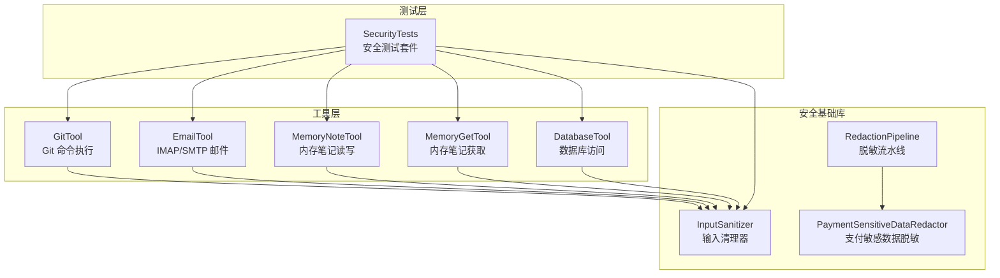
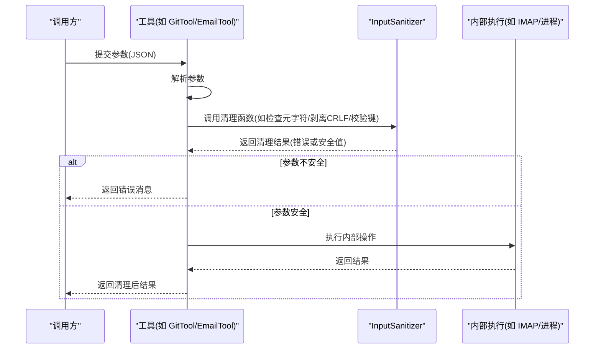
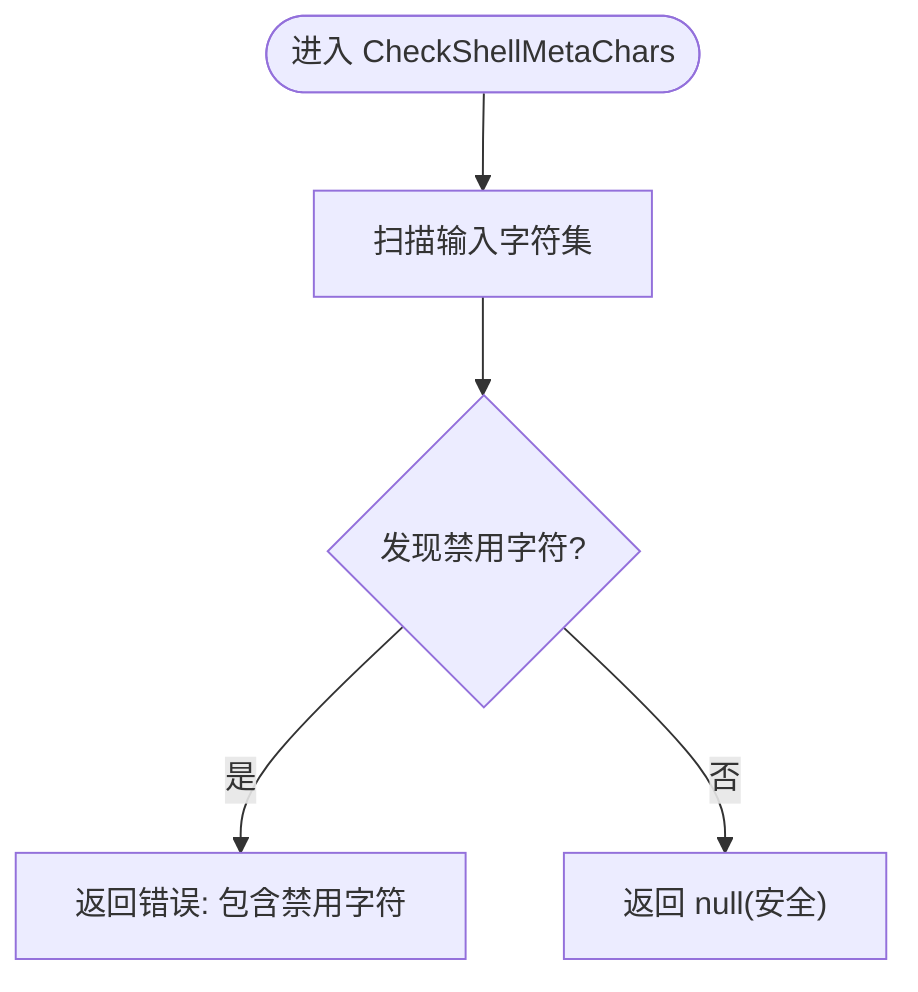
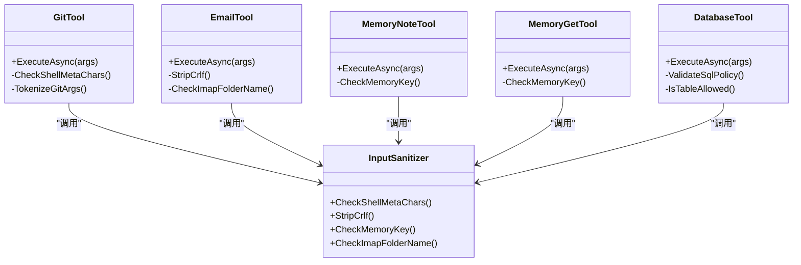
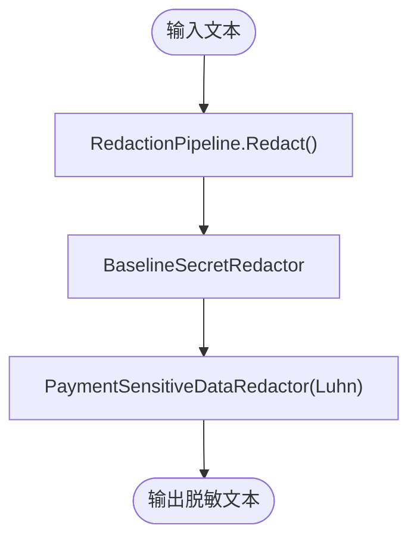
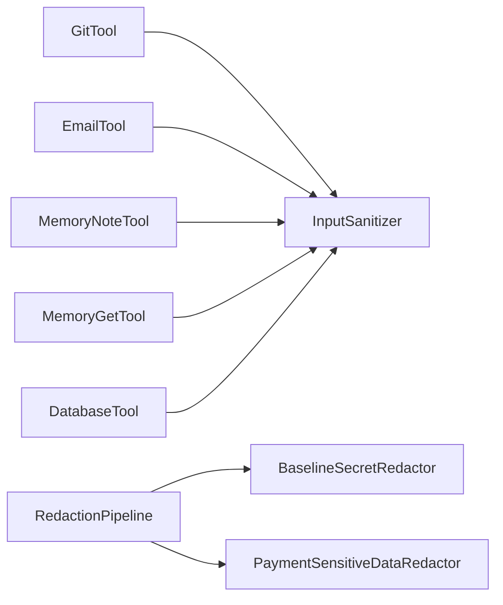

# 输入清理

<cite>
**本文引用的文件**
- [InputSanitizer.cs](file://src/OpenClaw.Core/Security/InputSanitizer.cs)
- [SecurityTests.cs](file://src/OpenClaw.Tests/SecurityTests.cs)
- [RedactionPipeline.cs](file://src/OpenClaw.Core/Security/RedactionPipeline.cs)
- [PaymentSensitiveDataRedactor.cs](file://src/OpenClaw.Payments.Core/PaymentSensitiveDataRedactor.cs)
- [GitTool.cs](file://src/OpenClaw.Agent/Tools/GitTool.cs)
- [EmailTool.cs](file://src/OpenClaw.Agent/Tools/EmailTool.cs)
- [MemoryNoteTool.cs](file://src/OpenClaw.Agent/Tools/MemoryNoteTool.cs)
- [MemoryGetTool.cs](file://src/OpenClaw.Agent/Tools/MemoryGetTool.cs)
- [DatabaseTool.cs](file://src/OpenClaw.Agent/Tools/DatabaseTool.cs)
</cite>

## 目录
1. [简介](#简介)
2. [项目结构](#项目结构)
3. [核心组件](#核心组件)
4. [架构总览](#架构总览)
5. [详细组件分析](#详细组件分析)
6. [依赖关系分析](#依赖关系分析)
7. [性能考量](#性能考量)
8. [故障排查指南](#故障排查指南)
9. [结论](#结论)
10. [附录](#附录)

## 简介
本文件面向输入清理系统，聚焦于 OpenClaw 项目中的 InputSanitizer 清理策略与安全机制，覆盖以下方面：
- 恶意字符过滤：基于字符集检测与拒绝列表，阻断命令注入与协议注入风险
- SQL 注入防护：对表名等标识符进行白名单/黑名单校验与规范化
- XSS 攻击防范：通过敏感信息脱敏与输出净化，降低敏感数据泄露风险
- 命令注入阻止：针对 IMAP/SMTP/CMD 等协议的换行与控制字符剥离
- 清理规则配置：允许在工具层按需启用或调整策略
- 敏感信息识别与数据脱敏：基于正则与算法（如 Luhn 校验）识别并替换敏感数据
- 输入验证示例、清理效果对比与安全测试方法
- 性能优化建议、误判处理与合规要求说明

## 项目结构
输入清理能力主要分布在以下模块：
- 安全基础库：输入清理与敏感信息脱敏
- 工具层：各具体工具在执行前调用清理器，确保参数安全
- 测试层：覆盖多种注入场景与边界条件

图表来源
- [InputSanitizer.cs:1-84](file://src/OpenClaw.Core/Security/InputSanitizer.cs#L1-L84)
- [RedactionPipeline.cs:1-131](file://src/OpenClaw.Core/Security/RedactionPipeline.cs#L1-L131)
- [PaymentSensitiveDataRedactor.cs:1-88](file://src/OpenClaw.Payments.Core/PaymentSensitiveDataRedactor.cs#L1-L88)
- [GitTool.cs:1-234](file://src/OpenClaw.Agent/Tools/GitTool.cs#L1-L234)
- [EmailTool.cs:1-402](file://src/OpenClaw.Agent/Tools/EmailTool.cs#L1-L402)
- [MemoryNoteTool.cs:1-36](file://src/OpenClaw.Agent/Tools/MemoryNoteTool.cs#L1-L36)
- [MemoryGetTool.cs:1-36](file://src/OpenClaw.Agent/Tools/MemoryGetTool.cs#L1-L36)
- [DatabaseTool.cs:350-799](file://src/OpenClaw.Agent/Tools/DatabaseTool.cs#L350-L799)
- [SecurityTests.cs:1-318](file://src/OpenClaw.Tests/SecurityTests.cs#L1-L318)

章节来源
- [InputSanitizer.cs:1-84](file://src/OpenClaw.Core/Security/InputSanitizer.cs#L1-L84)
- [SecurityTests.cs:1-318](file://src/OpenClaw.Tests/SecurityTests.cs#L1-L318)

## 核心组件
- InputSanitizer：提供跨工具共享的输入清理能力，包括 Shell 元字符检测、CRLF 剥离、路径穿越检测、IMAP 文件夹名控制字符检测等
- RedactionPipeline：多级敏感信息脱敏流水线，支持会话级脱敏与分支克隆脱敏
- PaymentSensitiveDataRedactor：支付领域专用脱敏器，识别卡号、CVV、授权令牌等并应用 Luhn 校验
- 各工具：在关键参数进入系统内部处理前调用清理器，形成“防御纵深”

章节来源
- [InputSanitizer.cs:1-84](file://src/OpenClaw.Core/Security/InputSanitizer.cs#L1-L84)
- [RedactionPipeline.cs:1-131](file://src/OpenClaw.Core/Security/RedactionPipeline.cs#L1-L131)
- [PaymentSensitiveDataRedactor.cs:1-88](file://src/OpenClaw.Payments.Core/PaymentSensitiveDataRedactor.cs#L1-L88)

## 架构总览
输入清理在工具执行链路中的位置如下：

图表来源
- [GitTool.cs:78-105](file://src/OpenClaw.Agent/Tools/GitTool.cs#L78-L105)
- [EmailTool.cs:137-239](file://src/OpenClaw.Agent/Tools/EmailTool.cs#L137-L239)
- [InputSanitizer.cs:24-82](file://src/OpenClaw.Core/Security/InputSanitizer.cs#L24-L82)

## 详细组件分析

### InputSanitizer 组件分析
- Shell 元字符检测：使用 SIMD 加速的字符集查找，快速定位分号、管道、重定向、反引号、美元变量、括号、尖括号及换行符等
- CRLF 剥离：移除回车与换行，防止 IMAP/SMTP 协议注入
- 路径穿越检测：禁止键名包含路径分隔符、Windows 反斜杠、点点号与空字节
- IMAP 文件夹名控制字符检测：仅允许可打印字符，拒绝控制字符

图表来源
- [InputSanitizer.cs:24-31](file://src/OpenClaw.Core/Security/InputSanitizer.cs#L24-L31)

章节来源
- [InputSanitizer.cs:1-84](file://src/OpenClaw.Core/Security/InputSanitizer.cs#L1-L84)
- [SecurityTests.cs:101-123](file://src/OpenClaw.Tests/SecurityTests.cs#L101-L123)

### 清理规则配置与工具集成
- GitTool：对额外参数进行 Shell 元字符检测；通过直接传递参数列表避免 shell 中介，进一步降低注入风险
- EmailTool：对 IMAP 文件夹名与查询语句进行 CRLF 剥离与控制字符检测；对 IMAP 登录与命令进行严格格式化
- MemoryNoteTool/MemoryGetTool：对键名进行路径穿越检测
- DatabaseTool：对 SQL 表名进行白名单/黑名单校验与规范化，拒绝多语句（可配置）

图表来源
- [GitTool.cs:60-105](file://src/OpenClaw.Agent/Tools/GitTool.cs#L60-L105)
- [EmailTool.cs:131-239](file://src/OpenClaw.Agent/Tools/EmailTool.cs#L131-L239)
- [MemoryNoteTool.cs:20-36](file://src/OpenClaw.Agent/Tools/MemoryNoteTool.cs#L20-L36)
- [MemoryGetTool.cs:18-36](file://src/OpenClaw.Agent/Tools/MemoryGetTool.cs#L18-L36)
- [DatabaseTool.cs:352-390](file://src/OpenClaw.Agent/Tools/DatabaseTool.cs#L352-L390)
- [InputSanitizer.cs:24-82](file://src/OpenClaw.Core/Security/InputSanitizer.cs#L24-L82)

章节来源
- [GitTool.cs:78-105](file://src/OpenClaw.Agent/Tools/GitTool.cs#L78-L105)
- [EmailTool.cs:137-239](file://src/OpenClaw.Agent/Tools/EmailTool.cs#L137-L239)
- [MemoryNoteTool.cs:26-30](file://src/OpenClaw.Agent/Tools/MemoryNoteTool.cs#L26-L30)
- [MemoryGetTool.cs:24-32](file://src/OpenClaw.Agent/Tools/MemoryGetTool.cs#L24-L32)
- [DatabaseTool.cs:352-390](file://src/OpenClaw.Agent/Tools/DatabaseTool.cs#L352-L390)

### 敏感信息识别与数据脱敏
- RedactionPipeline：串联多个脱敏器，逐级替换敏感内容；支持对会话历史、工具调用参数与结果进行原位/克隆脱敏
- BaselineSecretRedactor：识别 Authorization Bearer、OpenAI 密钥、API Key 字段等
- PaymentSensitiveDataRedactor：识别并替换支付卡号（含 Luhn 校验）、CVV 上下文、授权令牌、JSON 字段与支付令牌

图表来源
- [RedactionPipeline.cs:30-40](file://src/OpenClaw.Core/Security/RedactionPipeline.cs#L30-L40)
- [PaymentSensitiveDataRedactor.cs:32-50](file://src/OpenClaw.Payments.Core/PaymentSensitiveDataRedactor.cs#L32-L50)

章节来源
- [RedactionPipeline.cs:1-131](file://src/OpenClaw.Core/Security/RedactionPipeline.cs#L1-L131)
- [PaymentSensitiveDataRedactor.cs:1-88](file://src/OpenClaw.Payments.Core/PaymentSensitiveDataRedactor.cs#L1-L88)

### 输入验证示例与清理效果对比
- Shell 元字符检测：对包含分号、管道、换行等的参数返回错误，允许安全字符串通过
- CRLF 剥离：对 IMAP 查询与文件夹名剥离回车换行，防止注入
- 路径穿越检测：对包含 ../、/、\、空字节的键名返回错误
- 控制字符检测：对 IMAP 文件夹名中的控制字符返回错误
- SQL 表名校验：对未列入白名单或被黑名单拒绝的表名返回错误，允许安全表名通过

章节来源
- [SecurityTests.cs:101-162](file://src/OpenClaw.Tests/SecurityTests.cs#L101-L162)
- [SecurityTests.cs:227-259](file://src/OpenClaw.Tests/SecurityTests.cs#L227-L259)
- [SecurityTests.cs:263-316](file://src/OpenClaw.Tests/SecurityTests.cs#L263-L316)

### 安全测试方法
- 单元测试覆盖：针对每种注入场景构造边界输入，断言清理器返回错误或工具拒绝执行
- 工具集成测试：验证工具在执行前调用清理器，确保注入被拦截
- 场景回归：包含 IMAP 搜索注入、Git 参数注入、内存键路径穿越、数据库表名注入等

章节来源
- [SecurityTests.cs:1-318](file://src/OpenClaw.Tests/SecurityTests.cs#L1-L318)

## 依赖关系分析
- 工具到清理器：GitTool、EmailTool、MemoryNoteTool、MemoryGetTool、DatabaseTool 在关键路径上依赖 InputSanitizer
- 脱敏器到流水线：RedactionPipeline 组合 BaselineSecretRedactor 与 PaymentSensitiveDataRedactor，形成多级脱敏
- 测试到工具：SecurityTests 对各工具进行端到端验证，确保清理策略生效

图表来源
- [GitTool.cs:78-105](file://src/OpenClaw.Agent/Tools/GitTool.cs#L78-L105)
- [EmailTool.cs:137-239](file://src/OpenClaw.Agent/Tools/EmailTool.cs#L137-L239)
- [MemoryNoteTool.cs:26-30](file://src/OpenClaw.Agent/Tools/MemoryNoteTool.cs#L26-L30)
- [MemoryGetTool.cs:24-32](file://src/OpenClaw.Agent/Tools/MemoryGetTool.cs#L24-L32)
- [DatabaseTool.cs:352-390](file://src/OpenClaw.Agent/Tools/DatabaseTool.cs#L352-L390)
- [RedactionPipeline.cs:21-94](file://src/OpenClaw.Core/Security/RedactionPipeline.cs#L21-L94)
- [PaymentSensitiveDataRedactor.cs:8-30](file://src/OpenClaw.Payments.Core/PaymentSensitiveDataRedactor.cs#L8-L30)

章节来源
- [GitTool.cs:1-234](file://src/OpenClaw.Agent/Tools/GitTool.cs#L1-L234)
- [EmailTool.cs:1-402](file://src/OpenClaw.Agent/Tools/EmailTool.cs#L1-L402)
- [MemoryNoteTool.cs:1-36](file://src/OpenClaw.Agent/Tools/MemoryNoteTool.cs#L1-L36)
- [MemoryGetTool.cs:1-36](file://src/OpenClaw.Agent/Tools/MemoryGetTool.cs#L1-L36)
- [DatabaseTool.cs:350-799](file://src/OpenClaw.Agent/Tools/DatabaseTool.cs#L350-L799)
- [RedactionPipeline.cs:1-131](file://src/OpenClaw.Core/Security/RedactionPipeline.cs#L1-L131)
- [PaymentSensitiveDataRedactor.cs:1-88](file://src/OpenClaw.Payments.Core/PaymentSensitiveDataRedactor.cs#L1-L88)

## 性能考量
- SIMD 加速字符集查找：InputSanitizer 使用预构建的 SearchValues<char> 进行常量时间查找，适合高频输入检测
- 延迟分配与只读遍历：StripCrlf 采用字符串创建委托与 Span 计数，减少中间对象分配
- 正则表达式编译：脱敏器使用 RegexOptions.Compiled，提升重复匹配性能
- 工具侧最小化开销：GitTool 通过参数列表直传避免 shell 解析成本，同时保留清理器作为第二道防线
- I/O 限制：EmailTool 对 IMAP 输出设置最大读取长度，防止大输出导致资源耗尽

章节来源
- [InputSanitizer.cs:14-51](file://src/OpenClaw.Core/Security/InputSanitizer.cs#L14-L51)
- [GitTool.cs:107-156](file://src/OpenClaw.Agent/Tools/GitTool.cs#L107-L156)
- [RedactionPipeline.cs:104-131](file://src/OpenClaw.Core/Security/RedactionPipeline.cs#L104-L131)
- [EmailTool.cs:205-232](file://src/OpenClaw.Agent/Tools/EmailTool.cs#L205-L232)

## 故障排查指南
- 清理器报错“包含禁用字符”：检查参数是否包含分号、管道、重定向、换行、尖括号等；必要时转义或改用安全参数
- IMAP 报错“控制字符”：确认文件夹名不含控制字符；使用 StripCrlf 或规范化输入
- 内存键报错“路径穿越”：避免 ../、/、\、空字节；使用字母数字与安全分隔符组合键名
- 数据库表名报错“访问被拒绝”：将表名加入白名单或修正为允许的标识符
- 脱敏不彻底：确认已启用相应脱敏器；检查 JSON 结构与字段命名是否匹配正则模式
- 误判处理：若清理器误伤合法输入，可在工具层增加白名单校验或放宽规则，并记录审计日志

章节来源
- [SecurityTests.cs:101-162](file://src/OpenClaw.Tests/SecurityTests.cs#L101-L162)
- [SecurityTests.cs:227-316](file://src/OpenClaw.Tests/SecurityTests.cs#L227-L316)
- [InputSanitizer.cs:24-82](file://src/OpenClaw.Core/Security/InputSanitizer.cs#L24-L82)
- [RedactionPipeline.cs:30-94](file://src/OpenClaw.Core/Security/RedactionPipeline.cs#L30-L94)

## 结论
InputSanitizer 与配套的脱敏流水线构成了 OpenClaw 的输入清理与敏感数据保护基石。通过多层防御（字符集检测、CRLF 剥离、路径穿越与控制字符检测、白/黑名单策略、正则脱敏与算法校验），系统在保证安全性的同时兼顾性能与可维护性。建议在生产环境中结合工具策略与合规要求，持续完善清理规则与测试覆盖。

## 附录
- 清理规则配置建议
  - Shell 元字符：默认启用；对需要复杂参数的工具，优先使用参数列表直传
  - CRLF 剥离：对 IMAP/SMTP/HTTP 头部输入强制执行
  - 路径穿越：对所有键名与文件路径输入强制执行
  - 控制字符：对协议输入（如 IMAP 文件夹名）强制执行
  - SQL 表名：启用白名单/黑名单；严格禁止多语句
  - 脱敏：启用 BaselineSecretRedactor 与 PaymentSensitiveDataRedactor；定期审查正则覆盖范围
- 合规要求
  - 数据最小化：仅保留必要参数，避免在日志与输出中暴露敏感信息
  - 可追溯性：记录清理事件与误判情况，便于审计与改进
  - 最小权限：工具仅使用必要权限，避免高危操作（如 push/reset --hard）默认开启