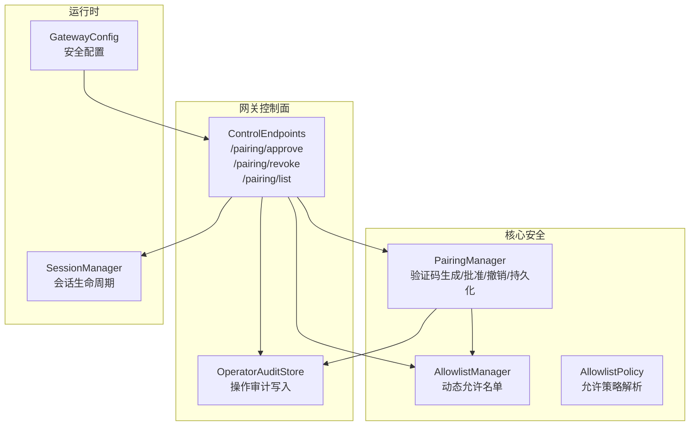
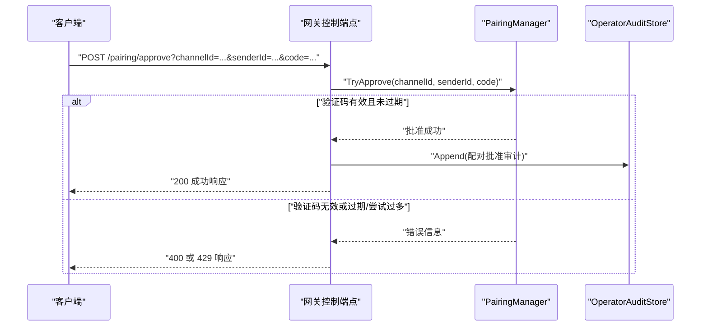
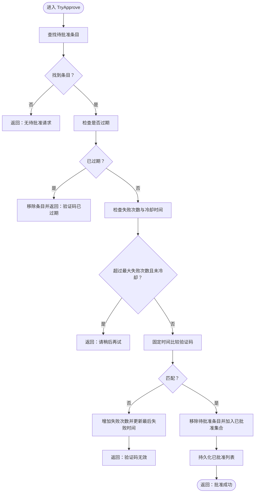
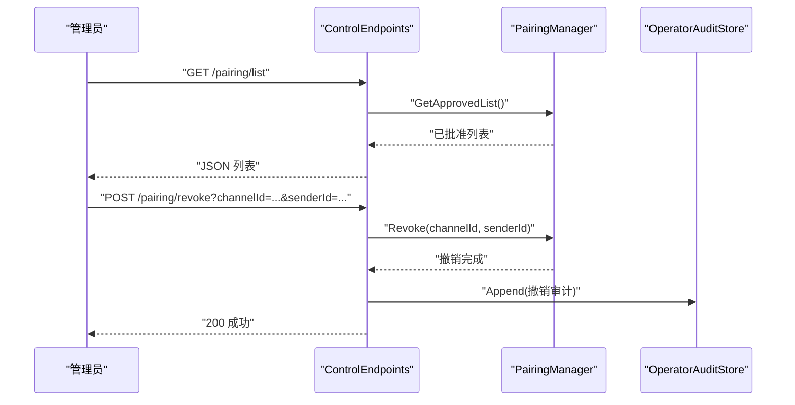
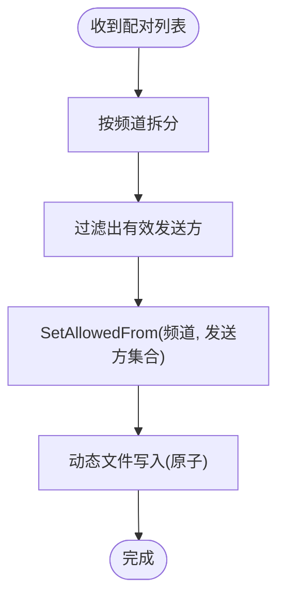
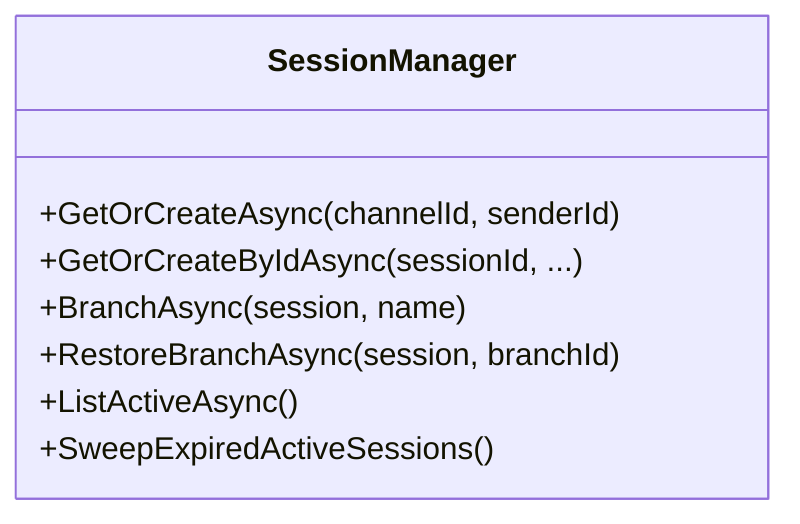
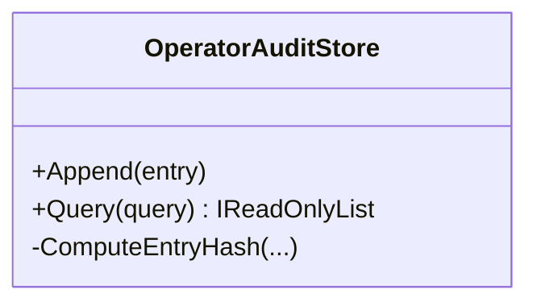
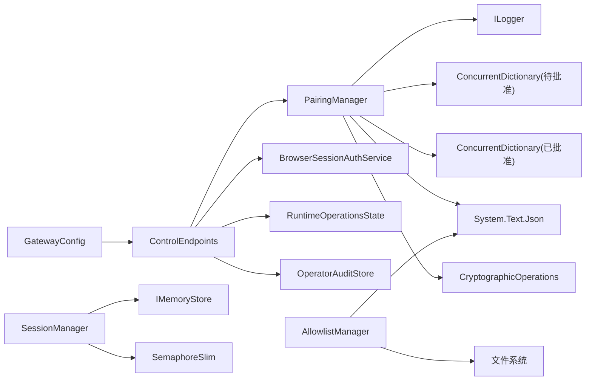

# 配对管理

<cite>
**本文引用的文件**
- [PairingManager.cs](file://src/OpenClaw.Core/Security/PairingManager.cs)
- [ControlEndpoints.cs](file://src/OpenClaw.Gateway/Endpoints/ControlEndpoints.cs)
- [AdminApiModels.cs](file://src/OpenClaw.Core/Models/AdminApiModels.cs)
- [AllowlistManager.cs](file://src/OpenClaw.Core/Security/AllowlistManager.cs)
- [AllowlistPolicy.cs](file://src/OpenClaw.Core/Security/AllowlistPolicy.cs)
- [SessionManager.cs](file://src/OpenClaw.Core/Sessions/SessionManager.cs)
- [OperatorAuditStore.cs](file://src/OpenClaw.Gateway/OperatorAuditStore.cs)
- [GatewayConfig.cs](file://src/OpenClaw.Core/Models/GatewayConfig.cs)
- [PairingManagerTests.cs](file://src/OpenClaw.Tests/PairingManagerTests.cs)
</cite>

## 目录
1. [简介](#简介)
2. [项目结构](#项目结构)
3. [核心组件](#核心组件)
4. [架构总览](#架构总览)
5. [详细组件分析](#详细组件分析)
6. [依赖关系分析](#依赖关系分析)
7. [性能考量](#性能考量)
8. [故障排查指南](#故障排查指南)
9. [结论](#结论)
10. [附录](#附录)

## 简介
本文件面向配对管理系统（PairingManager）的技术文档，系统性阐述其在 OpenClaw 中的职责与实现：如何通过一次性验证码完成设备/用户配对、如何进行配对请求验证与权限授予、如何与会话管理及安全审计联动，并给出配置示例、接口说明、安全最佳实践、故障恢复策略与合规建议。

## 项目结构
配对管理相关代码主要分布在以下模块：
- 核心安全模块：负责生成验证码、批准/撤销配对、持久化已批准发送方列表
- 网关控制端点：提供配对审批、撤销、查询等 HTTP 接口，并记录操作审计
- 允许名单模块：与配对结果联动，支持动态收紧允许名单
- 会话管理：为后续工具调用与消息交互提供会话上下文
- 审计存储：记录管理员操作链路，确保可追溯与合规

**图表来源**
- [PairingManager.cs:14-210](file://src/OpenClaw.Core/Security/PairingManager.cs#L14-L210)
- [ControlEndpoints.cs:21-73](file://src/OpenClaw.Gateway/Endpoints/ControlEndpoints.cs#L21-L73)
- [AllowlistManager.cs:19-125](file://src/OpenClaw.Core/Security/AllowlistManager.cs#L19-L125)
- [OperatorAuditStore.cs:10-195](file://src/OpenClaw.Gateway/OperatorAuditStore.cs#L10-L195)
- [SessionManager.cs:13-624](file://src/OpenClaw.Core/Sessions/SessionManager.cs#L13-L624)
- [GatewayConfig.cs:331-369](file://src/OpenClaw.Core/Models/GatewayConfig.cs#L331-L369)

**章节来源**
- [PairingManager.cs:14-210](file://src/OpenClaw.Core/Security/PairingManager.cs#L14-L210)
- [ControlEndpoints.cs:21-73](file://src/OpenClaw.Gateway/Endpoints/ControlEndpoints.cs#L21-L73)
- [AllowlistManager.cs:19-125](file://src/OpenClaw.Core/Security/AllowlistManager.cs#L19-L125)
- [OperatorAuditStore.cs:10-195](file://src/OpenClaw.Gateway/OperatorAuditStore.cs#L10-L195)
- [SessionManager.cs:13-624](file://src/OpenClaw.Core/Sessions/SessionManager.cs#L13-L624)
- [GatewayConfig.cs:331-369](file://src/OpenClaw.Core/Models/GatewayConfig.cs#L331-L369)

## 核心组件
- PairingManager：负责验证码生成、批准/撤销、持久化、防暴力破解与过期清理
- ControlEndpoints：提供配对审批、撤销、查询接口，并进行操作审计
- AllowlistManager/AllowlistPolicy：与配对联动，支持动态允许名单与策略解析
- SessionManager：为后续工具执行与消息处理提供会话上下文
- OperatorAuditStore：记录管理员操作，形成不可篡改的审计链
- GatewayConfig：提供安全相关配置项（如是否需要请求者匹配）

**章节来源**
- [PairingManager.cs:44-144](file://src/OpenClaw.Core/Security/PairingManager.cs#L44-L144)
- [ControlEndpoints.cs:21-73](file://src/OpenClaw.Gateway/Endpoints/ControlEndpoints.cs#L21-L73)
- [AllowlistManager.cs:19-125](file://src/OpenClaw.Core/Security/AllowlistManager.cs#L19-L125)
- [AllowlistPolicy.cs:9-41](file://src/OpenClaw.Core/Security/AllowlistPolicy.cs#L9-L41)
- [SessionManager.cs:45-130](file://src/OpenClaw.Core/Sessions/SessionManager.cs#L45-L130)
- [OperatorAuditStore.cs:33-93](file://src/OpenClaw.Gateway/OperatorAuditStore.cs#L33-L93)
- [GatewayConfig.cs:331-369](file://src/OpenClaw.Core/Models/GatewayConfig.cs#L331-L369)

## 架构总览
下图展示从客户端发起配对到最终批准并记录审计的整体流程：

**图表来源**
- [ControlEndpoints.cs:21-51](file://src/OpenClaw.Gateway/Endpoints/ControlEndpoints.cs#L21-L51)
- [PairingManager.cs:73-124](file://src/OpenClaw.Core/Security/PairingManager.cs#L73-L124)
- [OperatorAuditStore.cs:33-93](file://src/OpenClaw.Gateway/OperatorAuditStore.cs#L33-L93)

## 详细组件分析

### PairingManager 组件
- 职责
  - 生成一次性验证码（6位数字），有效期10分钟
  - 验证提交的验证码，支持固定时间比较防止时序攻击
  - 失败次数限制与冷却：最多5次失败后需等待5分钟
  - 批准/撤销配对发送方，并持久化到磁盘
  - 清理过期待批准条目
- 数据结构
  - 待批准集合：并发字典，键为“channelId:senderId”，值为包含验证码、过期时间、失败次数与最后失败时间的记录
  - 已批准集合：并发字典，键为“channelId:senderId”
  - 持久化：approved.json，原子写入（临时文件+覆盖）
- 安全要点
  - 使用固定时间字符串比较，避免时序侧信道
  - 冷却与失败次数限制，降低暴力破解风险
  - 过期自动清理，避免长期悬挂状态

**图表来源**
- [PairingManager.cs:73-124](file://src/OpenClaw.Core/Security/PairingManager.cs#L73-L124)
- [PairingManager.cs:146-154](file://src/OpenClaw.Core/Security/PairingManager.cs#L146-L154)
- [PairingManager.cs:156-163](file://src/OpenClaw.Core/Security/PairingManager.cs#L156-L163)
- [PairingManager.cs:185-209](file://src/OpenClaw.Core/Security/PairingManager.cs#L185-L209)

**章节来源**
- [PairingManager.cs:14-210](file://src/OpenClaw.Core/Security/PairingManager.cs#L14-L210)
- [PairingManagerTests.cs:9-60](file://src/OpenClaw.Tests/PairingManagerTests.cs#L9-L60)

### 控制端点与审计
- /pairing/approve
  - 需要管理员授权与CSRF校验
  - 调用 PairingManager.TryApprove，根据错误类型返回400或429
  - 记录操作审计
- /pairing/revoke
  - 撤销指定发送方的配对
  - 记录操作审计
- /pairing/list
  - 查询当前已批准的发送方列表

**图表来源**
- [ControlEndpoints.cs:67-73](file://src/OpenClaw.Gateway/Endpoints/ControlEndpoints.cs#L67-L73)
- [ControlEndpoints.cs:53-65](file://src/OpenClaw.Gateway/Endpoints/ControlEndpoints.cs#L53-L65)
- [OperatorAuditStore.cs:33-93](file://src/OpenClaw.Gateway/OperatorAuditStore.cs#L33-L93)

**章节来源**
- [ControlEndpoints.cs:21-73](file://src/OpenClaw.Gateway/Endpoints/ControlEndpoints.cs#L21-L73)
- [AdminApiModels.cs:91-100](file://src/OpenClaw.Core/Models/AdminApiModels.cs#L91-L100)

### 允许名单联动
- 动态允许名单优先于静态配置
- 支持基于配对结果一键收紧允许名单，仅保留该频道已批准的发送方
- 允许策略支持通配与严格模式

**图表来源**
- [ControlEndpoints.cs:123-145](file://src/OpenClaw.Gateway/Endpoints/ControlEndpoints.cs#L123-L145)
- [AllowlistManager.cs:102-115](file://src/OpenClaw.Core/Security/AllowlistManager.cs#L102-L115)

**章节来源**
- [AllowlistManager.cs:19-125](file://src/OpenClaw.Core/Security/AllowlistManager.cs#L19-L125)
- [AllowlistPolicy.cs:9-41](file://src/OpenClaw.Core/Security/AllowlistPolicy.cs#L9-L41)
- [ControlEndpoints.cs:116-146](file://src/OpenClaw.Gateway/Endpoints/ControlEndpoints.cs#L116-L146)

### 会话管理与后续流程
- 会话键由“channelId:senderId”确定，支持按键获取/创建、分支快照、历史恢复、容量与过期清理
- 配对批准后，后续工具执行与消息交互可在会话上下文中进行

**图表来源**
- [SessionManager.cs:45-130](file://src/OpenClaw.Core/Sessions/SessionManager.cs#L45-L130)
- [SessionManager.cs:176-220](file://src/OpenClaw.Core/Sessions/SessionManager.cs#L176-L220)
- [SessionManager.cs:338-359](file://src/OpenClaw.Core/Sessions/SessionManager.cs#L338-L359)

**章节来源**
- [SessionManager.cs:13-624](file://src/OpenClaw.Core/Sessions/SessionManager.cs#L13-L624)

### 安全审计与合规
- 审计条目包含序列号、哈希链、操作者角色与摘要，支持查询与导出
- 提供导出打包能力，便于合规审计

**图表来源**
- [OperatorAuditStore.cs:33-93](file://src/OpenClaw.Gateway/OperatorAuditStore.cs#L33-L93)
- [OperatorAuditStore.cs:162-193](file://src/OpenClaw.Gateway/OperatorAuditStore.cs#L162-L193)

**章节来源**
- [OperatorAuditStore.cs:10-195](file://src/OpenClaw.Gateway/OperatorAuditStore.cs#L10-L195)

## 依赖关系分析
- PairingManager 依赖：
  - 日志记录器（ILogger）
  - 并发容器（ConcurrentDictionary）
  - JSON 序列化（用于持久化）
  - 固定时钟比较（CryptographicOperations）
- ControlEndpoints 依赖：
  - PairingManager
  - 浏览器会话认证服务
  - 运维操作状态与审计存储
- AllowlistManager 依赖：
  - 文件系统持久化（原子写入）
  - JSON 序列化
- SessionManager 依赖：
  - 存储接口（IMemoryStore）
  - 并发锁与后台持久化任务
- GatewayConfig 依赖：
  - 安全策略配置项（如请求者匹配）

**图表来源**
- [PairingManager.cs:1-210](file://src/OpenClaw.Core/Security/PairingManager.cs#L1-L210)
- [ControlEndpoints.cs:17-20](file://src/OpenClaw.Gateway/Endpoints/ControlEndpoints.cs#L17-L20)
- [AllowlistManager.cs:19-125](file://src/OpenClaw.Core/Security/AllowlistManager.cs#L19-L125)
- [SessionManager.cs:13-624](file://src/OpenClaw.Core/Sessions/SessionManager.cs#L13-L624)
- [GatewayConfig.cs:331-369](file://src/OpenClaw.Core/Models/GatewayConfig.cs#L331-L369)

**章节来源**
- [PairingManager.cs:1-210](file://src/OpenClaw.Core/Security/PairingManager.cs#L1-L210)
- [ControlEndpoints.cs:17-20](file://src/OpenClaw.Gateway/Endpoints/ControlEndpoints.cs#L17-L20)
- [AllowlistManager.cs:19-125](file://src/OpenClaw.Core/Security/AllowlistManager.cs#L19-L125)
- [SessionManager.cs:13-624](file://src/OpenClaw.Core/Sessions/SessionManager.cs#L13-L624)
- [GatewayConfig.cs:331-369](file://src/OpenClaw.Core/Models/GatewayConfig.cs#L331-L369)

## 性能考量
- 并发访问
  - 使用并发字典与轻量级锁，避免阻塞
  - 会话管理采用自适应容量控制与LRU淘汰策略
- I/O 优化
  - PairingManager 与 AllowlistManager 均使用临时文件+原子替换，减少竞态与损坏风险
  - 审计写入采用追加写，避免大文件重写
- 可扩展性
  - 允许名单路径名安全化处理，避免目录穿越
  - 会话锁按会话ID隔离，降低全局争用

[本节为通用指导，无需特定文件引用]

## 故障排查指南
- 常见问题与定位
  - “无待批准请求”：确认是否已生成验证码且未过期
  - “验证码已过期”：重新生成验证码（默认10分钟）
  - “验证码无效”：检查输入格式与大小写；注意固定时间比较
  - “尝试过多，请稍后再试”：等待5分钟冷却
  - “撤销失败”：确认发送方是否已被批准
- 审计与导出
  - 通过审计查询接口定位最近操作
  - 导出审计包用于合规审查
- 单元测试参考
  - 验证有效验证码批准成功
  - 验证多次无效尝试后的冷却行为

**章节来源**
- [PairingManager.cs:73-124](file://src/OpenClaw.Core/Security/PairingManager.cs#L73-L124)
- [PairingManagerTests.cs:9-60](file://src/OpenClaw.Tests/PairingManagerTests.cs#L9-L60)
- [OperatorAuditStore.cs:97-125](file://src/OpenClaw.Gateway/OperatorAuditStore.cs#L97-L125)

## 结论
PairingManager 以简洁可靠的验证码机制实现了设备/用户的受控接入，结合严格的失败次数与冷却策略、固定时间比较与原子持久化，有效降低了安全风险。配合网关控制端点的授权与审计、允许名单的动态收紧以及会话管理的上下文支撑，形成了完整的配对与权限治理闭环。建议在公网部署时启用更严格的安全配置，并定期导出审计以满足合规要求。

[本节为总结，无需特定文件引用]

## 附录

### API 定义与示例
- 配对审批
  - 方法：POST
  - 路径：/pairing/approve
  - 参数：channelId, senderId, code
  - 成功：200，内容包含成功标志与消息
  - 错误：400（验证码无效/过期），429（尝试过多）
- 撤销配对
  - 方法：POST
  - 路径：/pairing/revoke
  - 参数：channelId, senderId
  - 成功：200，内容包含成功标志
- 查询已批准列表
  - 方法：GET
  - 路径：/pairing/list
  - 成功：200，返回键列表（格式为“channelId:senderId”）

**章节来源**
- [ControlEndpoints.cs:21-73](file://src/OpenClaw.Gateway/Endpoints/ControlEndpoints.cs#L21-L73)
- [AdminApiModels.cs:91-100](file://src/OpenClaw.Core/Models/AdminApiModels.cs#L91-L100)

### 配置示例与最佳实践
- 安全配置要点
  - 公网绑定时建议启用严格公共绑定预设
  - 如需HTTP工具审批的请求者匹配，开启相应开关
  - 浏览器会话空闲与记住登录时长按场景调整
- 最佳实践
  - 为高风险工具启用交互式审批
  - 定期导出审计并设定保留周期
  - 使用允许名单动态收紧策略，仅保留已批准发送方
  - 对公网暴露的实例禁用不安全的本地工具配置

**章节来源**
- [GatewayConfig.cs:331-369](file://src/OpenClaw.Core/Models/GatewayConfig.cs#L331-L369)